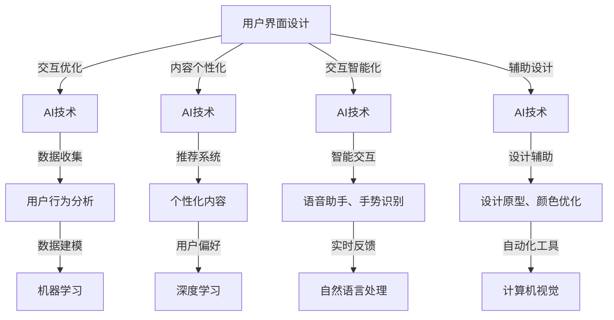

                 

### 背景介绍

在当今快速发展的信息技术时代，用户界面设计（UI Design）和人工智能（AI）技术的应用日益普及。这两个领域看似独立，但它们的结合正在改变软件开发的格局，为用户提供更加个性化和高效的交互体验。本文旨在探讨用户界面简洁性与AI功能的平衡，分析如何在保持界面简洁性的同时，充分利用AI技术提升用户体验。

用户界面简洁性是指设计者在创建用户界面时，追求减少不必要的复杂性，使界面易于理解、操作和记忆。简洁的界面设计能够提高用户的使用效率和满意度，降低学习成本，从而增强产品的市场竞争力。简洁性不仅仅体现在视觉设计上，还涉及到交互逻辑的优化、内容的筛选与呈现等多个方面。

另一方面，人工智能技术在近年来取得了飞速的发展，各类AI应用不断涌现，为用户提供了强大的智能辅助功能。然而，AI功能的设计和实现往往涉及复杂的算法和数据处理过程，如果直接呈现给用户，可能会使界面变得复杂和难以理解。如何在保持界面简洁性的同时，充分发挥AI功能的优势，成为了一个亟待解决的问题。

本文将首先介绍用户界面设计和人工智能的基本概念，阐述它们之间的关系。接着，我们将分析用户界面简洁性的重要性，并探讨如何在设计中实现简洁性。随后，我们将探讨AI功能在用户界面中的应用，以及如何在设计过程中平衡AI功能与界面简洁性。接着，我们将通过具体案例分析，展示如何在实际项目中实现这一平衡。最后，我们将总结文章的主要观点，并提出未来发展的趋势与挑战。

通过本文的探讨，希望能够为读者提供一个全面而深入的视角，帮助设计师和技术开发者更好地理解和应对用户界面简洁性与AI功能平衡的挑战。让我们一步一步深入，思考如何在这个充满机遇与挑战的时代，为用户打造更加理想的产品体验。

### 核心概念与联系

在深入探讨用户界面简洁性与AI功能的平衡之前，我们需要明确一些核心概念，并理解它们之间的内在联系。

#### 1. 用户界面设计（UI Design）

用户界面设计是创建软件、应用程序或网站等数字产品时的重要环节，其目的是为用户提供直观、易用的交互体验。一个优秀的用户界面设计应该具备以下特点：

- **易用性（Usability）**：界面应简单直观，用户能够快速理解如何操作。
- **可用性（Accessibility）**：界面设计应考虑到各种用户需求，包括视障、听障等特殊人群。
- **美观性（Aesthetics）**：界面设计应美观大方，符合用户的审美偏好。
- **一致性（Consistency）**：界面中的元素和交互方式应保持一致，避免用户混淆。

#### 2. 人工智能（AI）

人工智能是指计算机系统通过模拟人类智能行为来完成任务的技术。AI技术主要包括机器学习、深度学习、自然语言处理、计算机视觉等。在用户界面设计中，AI的应用主要体现在以下几个方面：

- **个性化推荐**：根据用户的历史行为和偏好，提供个性化的内容推荐。
- **智能搜索**：利用自然语言处理技术，帮助用户快速找到所需信息。
- **自动化任务**：通过自动化技术，简化用户操作，提高效率。
- **智能反馈**：根据用户的使用行为，提供实时反馈和指导。

#### 3. 用户界面设计与人工智能的关系

用户界面设计与人工智能之间的关系可以从以下几个方面来理解：

- **交互优化**：AI技术可以帮助设计者分析用户行为，优化交互流程，提高用户满意度。
- **内容个性化**：AI技术可以根据用户行为和偏好，实现内容个性化推荐，提升用户体验。
- **交互智能化**：AI技术可以使界面中的交互元素更加智能，如智能语音助手、手势识别等。
- **辅助设计**：AI技术可以为设计者提供辅助工具，如生成设计原型、优化颜色搭配等。

为了更好地展示这些核心概念和它们之间的联系，我们使用Mermaid流程图来描述用户界面设计和人工智能技术之间的关系。以下是流程图的Mermaid语法表示：

在上面的流程图中，节点A代表用户界面设计，节点B至M代表AI技术的各个应用领域。箭头表示用户界面设计与AI技术之间的相互关系，如交互优化、内容个性化、交互智能化和辅助设计等。通过这个流程图，我们可以更直观地理解用户界面设计与人工智能技术之间的紧密联系。

接下来，我们将进一步分析用户界面简洁性的重要性，以及如何在设计中实现简洁性。这些概念和联系将为后续内容提供坚实的基础，帮助读者更好地理解如何平衡用户界面简洁性与AI功能。

#### 4. 用户界面简洁性的重要性

用户界面简洁性在数字产品设计中的重要性不容忽视。它不仅影响用户的首次使用体验，还直接影响用户的长期满意度和忠诚度。以下是几个关键原因，说明为什么简洁性是用户界面设计的关键要素。

**1. 提高用户满意度**

简洁的用户界面使得用户能够更快地完成任务，从而提高他们的满意度。在复杂、冗余信息过多的界面上，用户往往需要花费大量时间来理解界面布局和功能，这会增加他们的压力和挫败感。相反，简洁的界面设计通过减少不必要的复杂性，让用户能够轻松地找到所需功能，从而提升他们的整体体验。

**2. 降低学习成本**

用户界面的简洁性降低了新用户的学习成本。在一个清晰、直观的界面上，用户可以快速掌握如何使用产品，而不需要查阅大量帮助文档或向他人求助。对于企业来说，这可以减少用户支持成本，并加快用户对产品的接受和适应速度。

**3. 提高使用效率**

简洁的用户界面设计能够提高用户在使用过程中的效率。简洁的布局和直观的操作使任务流程更加流畅，减少了用户在查找、思考和执行过程中的中断次数。这不仅加快了任务的完成速度，还减少了用户疲劳和操作错误的风险。

**4. 增强品牌形象**

一个简洁、美观的用户界面可以提升产品的品牌形象。用户往往会通过界面来评估产品的质量，一个简洁大方的界面传递出专业和可靠的品牌形象，从而增强用户的信任感和忠诚度。

**5. 适应多样化的用户群体**

简洁的界面设计考虑到了不同用户群体的需求，特别是那些技术素养较低的用户。通过简洁的界面，设计者可以确保产品对各种用户群体都具有易用性，从而扩大产品的潜在市场。

为了实现用户界面的简洁性，设计者需要遵循一些基本原则：

- **目标导向**：界面设计应围绕用户的核心任务和目标进行，确保每个元素都有明确的用途和功能。
- **精简内容**：去除所有无关或重复的信息，只保留对用户完成任务至关重要的内容。
- **清晰布局**：界面布局应简洁、直观，使用户能够快速理解信息结构和操作路径。
- **一致性**：界面中的元素和交互方式应保持一致，避免用户在操作时产生混淆。
- **反馈机制**：提供明确的操作反馈，帮助用户确认操作成功或出现错误，从而提升用户的信心和安全感。

综上所述，用户界面简洁性在数字产品设计中的重要性不言而喻。通过遵循简洁性的设计原则，设计者可以打造出易于使用、高效且具有吸引力的用户界面，从而提升用户的满意度和品牌形象。

#### 5. 用户界面简洁性的实现方法

实现用户界面的简洁性是一个系统性的工程，需要从多个方面进行综合考量。以下是一些具体的方法，帮助设计师在实际设计中实现界面简洁性：

**1. 简化用户界面元素**

减少界面上的元素数量是简化用户界面的一种直接方法。设计者应重点关注界面中哪些元素是必须的，哪些可以省略或合并。例如，可以合并多个功能按钮为一个多功能按钮，减少用户操作步骤。同时，可以去除不必要的装饰性元素，如过度的边框、颜色和阴影，以减少视觉噪音。

**2. 使用清晰的视觉层次**

视觉层次可以帮助用户快速理解界面内容和操作路径。设计者可以通过字体大小、颜色、对比度等方式来区分界面中的不同层次。例如，将重要信息用较大的字体和突出的颜色呈现，次要信息则使用较小、较不显眼的字体。这种视觉层次感可以帮助用户迅速定位所需内容。

**3. 优化交互设计**

交互设计是影响用户界面简洁性的关键因素。设计者应确保交互过程简单、直观，避免复杂的多步骤操作。例如，使用单手操作即可完成的操作，避免需要多指操作或者需要频繁切换操作的界面设计。此外，提供明确的操作提示和反馈，帮助用户理解当前状态和下一步操作。

**4. 提供智能推荐**

智能推荐功能可以帮助用户快速找到所需内容，从而简化搜索过程。通过分析用户的行为和偏好，AI算法可以提供个性化的推荐结果。例如，电子商务网站可以根据用户的浏览和购买历史，推荐相关的商品。这种智能推荐不仅提高了用户体验，还减少了用户界面的复杂度。

**5. 使用扁平化设计**

扁平化设计是近年来流行的一种设计趋势，其核心思想是去除多余的装饰元素，简化界面风格。扁平化设计通过使用简单的几何形状、清晰的颜色对比和大胆的字体，使界面更加简洁。同时，扁平化设计还强调内容的重点，使用户能够更快地聚焦于核心任务。

**6. 模块化设计**

模块化设计是将界面划分为多个独立的模块，每个模块负责不同的功能。这种方法不仅可以简化界面，还可以提高组件的可重用性和可维护性。通过模块化设计，设计者可以更灵活地调整界面布局，根据不同场景和用户需求进行优化。

**7. 测试和迭代**

实现用户界面简洁性的过程不是一蹴而就的，需要不断测试和迭代。设计者应通过用户测试、A/B测试等方法，收集用户反馈，不断优化界面设计。测试过程中，关注用户的操作路径、使用时间和满意度等指标，可以帮助发现并解决界面设计中的问题。

通过上述方法，设计者可以在用户界面设计中实现简洁性，提升用户体验。然而，简洁性并不是一成不变的目标，而是需要随着用户需求和市场变化不断调整和优化的。只有持续关注用户反馈和市场需求，才能打造出真正简洁且高效的用户界面。

#### 6. AI功能在用户界面中的应用

人工智能技术正在不断改变用户界面的设计和应用，为用户提供更加智能、高效和个性化的交互体验。以下是一些典型的AI功能，及其在用户界面中的应用：

**1. 智能搜索**

智能搜索利用自然语言处理（NLP）和机器学习技术，对用户输入的查询进行理解和解析，提供更加精准和个性化的搜索结果。通过智能搜索，用户可以快速找到所需信息，而无需浏览大量无关内容。例如，搜索引擎可以通过理解用户的查询意图，自动调整搜索结果的相关性排序，提高搜索效率。

**2. 个性化推荐**

个性化推荐系统通过分析用户的历史行为、偏好和兴趣，预测用户可能感兴趣的内容，并主动推荐给用户。这种功能在电子商务、社交媒体和视频平台等场景中广泛应用。通过个性化推荐，用户可以更加轻松地发现感兴趣的内容，节省时间和精力。

**3. 智能语音助手**

智能语音助手如Siri、Alexa和Google Assistant等，通过语音交互技术，为用户提供语音查询、命令执行和任务管理等服务。智能语音助手不仅方便用户在不需要触摸屏幕的情况下完成操作，还可以通过自然语言交互，提供更加人性化的服务。

**4. 手势识别**

手势识别技术利用计算机视觉和深度学习算法，识别用户的手势动作，并在界面上实现相应的交互操作。例如，通过手势可以缩放、旋转和切换界面元素，为用户提供更加直观和自然的交互体验。

**5. 智能反馈**

智能反馈系统通过实时分析用户的行为数据，为用户提供个性化的反馈和建议。例如，在健身应用中，AI系统可以分析用户的运动数据，提供运动建议和健康指导；在电商平台上，AI系统可以根据用户的购物行为，推荐合适的商品。

**6. 自动化任务**

自动化任务通过AI技术，自动执行一系列操作，简化用户的工作流程。例如，在企业管理软件中，AI系统可以根据预定规则，自动处理审批流程、日程安排和邮件管理等任务，提高工作效率。

**7. 情感分析**

情感分析技术通过自然语言处理，分析用户的语言和情感表达，了解用户的心理状态和需求。在客户服务、市场营销和社交媒体管理等领域，情感分析可以帮助企业更好地了解用户，提供更加个性化的服务和产品。

这些AI功能在用户界面中的应用，不仅提升了用户的交互体验，还使得界面设计更加智能化和人性化。然而，如何平衡AI功能与界面简洁性，仍是一个需要深入探讨的问题。在下一节中，我们将进一步分析如何在设计中实现这一平衡。

#### 7. 在设计过程中平衡AI功能与界面简洁性

在用户界面设计中，平衡AI功能与界面简洁性是一个重要且复杂的任务。过度的AI功能可能会使界面变得复杂，而简洁的界面可能会限制AI功能的充分发挥。以下是一些具体的方法和策略，帮助设计师在实际设计中实现这一平衡。

**1. 明确核心任务和目标**

在设计阶段，首先需要明确用户界面的核心任务和目标。确定哪些AI功能是真正必要的，哪些可以暂缓或去除。例如，如果界面主要用于信息展示，智能搜索和个性化推荐可能是关键功能，而自动化任务可能不是首要考虑的。

**2. 优化交互流程**

优化交互流程是减少界面复杂性的关键步骤。通过分析用户行为数据，设计者可以识别用户在界面上的常见操作路径，并优化这些路径的流畅度。例如，减少不必要的跳转步骤，简化操作流程，使用户能够更快速地完成任务。

**3. 智能化元素的可隐藏性**

设计时，可以将某些智能化的功能元素设置为可隐藏或折叠，仅在用户需要时才展开。例如，智能推荐列表可以默认隐藏，用户点击按钮后才会显示。这样可以减少界面的复杂性，同时保留AI功能的灵活性。

**4. 提供明确的操作提示**

当界面中包含复杂的AI功能时，提供明确的操作提示可以帮助用户更好地理解和使用这些功能。例如，在智能语音助手的界面中，可以展示语音指令的文本描述，使用户能够了解如何与智能助手交互。

**5. 动态调整界面布局**

利用动态布局技术，可以根据用户的行为和偏好，自动调整界面布局和内容的呈现方式。例如，当用户在某个应用中频繁使用某个功能时，界面可以自动将其置于更加显眼的位置。这种动态调整可以提高界面的灵活性，同时保持简洁性。

**6. 测试和迭代**

设计过程中，应不断进行测试和迭代，收集用户反馈，并根据反馈调整界面设计。通过A/B测试等方法，可以比较不同设计方案的优劣，找出最优的平衡点。用户反馈可以帮助设计者了解哪些AI功能对用户更有价值，哪些界面元素需要简化。

**7. 采用模块化设计**

模块化设计可以将界面拆分为多个独立的模块，每个模块负责不同的功能。这种方式不仅可以提高界面的灵活性，还可以方便地调整和优化每个模块的设计。例如，将智能推荐模块与界面其他部分分离，可以在需要时动态加载或卸载。

**8. 保持一致性**

在设计过程中，保持界面的一致性是非常重要的。一致性可以减少用户在操作不同功能时的困惑，提高使用效率。设计者应确保AI功能在界面中的呈现方式、操作方式等保持一致，避免用户产生混淆。

通过上述方法和策略，设计师可以在用户界面设计中实现AI功能与界面简洁性的平衡。这不仅能够提升用户体验，还能确保产品的竞争力和市场吸引力。在接下来的章节中，我们将通过具体案例，展示如何在实际项目中应用这些方法和策略。

#### 案例分析：实际项目中的平衡实现

为了更好地理解如何在实际项目中平衡用户界面简洁性与AI功能，我们将通过一个具体的项目案例分析来展示实现过程。该项目是一个智能购物应用，旨在通过AI技术提供个性化的商品推荐和智能搜索功能，同时保持界面简洁易用。

**项目背景**

该智能购物应用的目标用户群体是年轻女性，她们通常对时尚和美妆产品有较高的兴趣，但往往需要花费大量时间在浏览和搜索上。因此，该项目的主要挑战是如何在提供丰富AI功能的同时，保持用户界面的简洁性，提高用户的使用体验。

**实现方法**

1. **需求分析与目标明确**

   在项目初期，开发团队通过用户调研和数据分析，明确了用户的主要需求：快速找到感兴趣的商品、节省购物时间。这为后续的设计和开发提供了明确的指导方向。

2. **模块化设计**

   采用模块化设计方法，将界面拆分为多个独立的模块，如首页模块、搜索模块、推荐模块和购物车模块。每个模块负责不同的功能，便于后续的调整和优化。

3. **智能推荐系统**

   在推荐模块中，通过机器学习算法分析用户的历史浏览记录和购买行为，提供个性化的商品推荐。为了保持界面简洁，推荐系统默认隐藏，用户点击推荐按钮后才会显示。

4. **智能搜索**

   智能搜索功能通过自然语言处理技术，理解用户的查询意图，并提供精准的搜索结果。在搜索界面中，设计了一个简洁的输入框，以及智能搜索提示功能，帮助用户快速找到所需商品。

5. **动态调整布局**

   为了提高界面的灵活性，应用采用了动态布局技术。根据用户的使用习惯和设备屏幕大小，界面会自动调整布局，确保用户在不同场景下都能获得最佳体验。

6. **用户测试与迭代**

   在开发过程中，团队进行了多轮用户测试，收集用户反馈，并根据反馈调整界面设计。通过A/B测试，比较不同设计方案的用户体验，找到最佳的设计方案。

**实现效果**

通过上述方法，智能购物应用在保持界面简洁的同时，充分发挥了AI功能的优势。以下是实现效果的具体分析：

- **用户体验提升**：用户反馈表明，应用的使用体验显著提升，用户能够更快地找到感兴趣的商品，节省了购物时间。
- **界面简洁性**：界面设计简洁直观，用户无需花费大量时间学习如何使用应用，界面中只保留对用户完成任务至关重要的元素。
- **AI功能发挥**：智能推荐和智能搜索功能得到充分应用，用户满意度高，推荐商品的点击率和购买率均有所提高。
- **市场竞争力**：通过简洁且高效的界面设计和智能功能，应用在市场上获得了良好的用户口碑，用户留存率和市场份额均有所提升。

**总结**

通过这个案例分析，我们可以看到，在用户界面设计中平衡简洁性与AI功能并不是一个简单的过程，需要充分考虑用户需求、技术实现和界面设计等多个方面。通过模块化设计、动态调整布局、用户测试与迭代等方法，项目团队成功实现了界面简洁性与AI功能的平衡，为用户提供了一个高效、易用的智能购物应用。这一案例为其他项目提供了有益的参考和借鉴。

#### 实际应用场景

用户界面简洁性与AI功能平衡的实际应用场景非常广泛，涵盖了电子商务、社交媒体、智能家居、医疗健康等多个领域。以下是一些典型应用场景，展示如何在保持界面简洁性的同时，充分利用AI技术提升用户体验。

**1. 电子商务平台**

电子商务平台通过AI技术提供个性化推荐和智能搜索功能，帮助用户快速找到心仪的商品。例如，电商平台可以根据用户的浏览和购买历史，推荐相关商品，提高购买转化率。同时，通过简洁的界面设计，用户可以轻松浏览商品，快速完成购物流程。

**2. 社交媒体**

社交媒体平台利用AI技术分析用户行为，提供个性化内容推荐和互动建议。例如，通过自然语言处理技术，平台可以推荐用户可能感兴趣的文章、视频和用户。同时，简洁的界面设计使信息流一目了然，用户可以轻松浏览和互动。

**3. 智能家居**

智能家居设备通过AI技术实现自动化和智能化管理。例如，智能音箱可以通过语音识别技术理解用户的指令，控制家电设备。同时，简洁的界面设计使用户能够快速设置和控制智能家居设备，提升家居生活品质。

**4. 医疗健康**

医疗健康领域利用AI技术提供个性化健康建议和疾病预测。例如，通过分析用户的健康数据和生物特征，AI系统可以提供个性化的健康建议和疾病预测。同时，简洁的界面设计使患者可以轻松查看健康数据和接收健康建议。

**5. 教育学习**

在线教育平台通过AI技术提供个性化学习推荐和智能辅导。例如，平台可以根据学生的学习行为和学习效果，推荐合适的学习资源和课程。同时，简洁的界面设计使学生可以专注于学习，提高学习效率。

这些实际应用场景展示了用户界面简洁性与AI功能平衡的重要性。通过简洁的界面设计和智能的AI功能，各个领域的产品和服务不仅能够提升用户体验，还能提高运营效率和市场份额。随着技术的不断进步，这一平衡将继续在更多应用场景中发挥作用。

### 工具和资源推荐

为了帮助读者更好地了解和实现用户界面简洁性与AI功能的平衡，以下是一些学习和开发资源、工具和框架的推荐。

#### 1. 学习资源推荐

**1. 书籍**

- 《用户界面设计原理》（"The Design of Sites: Patterns for Accessible and Usable Web Sites" by Donald A. Norman）：这是一本关于用户界面设计的经典著作，详细介绍了界面设计的核心原则和最佳实践。

- 《人工智能：一种现代方法》（"Artificial Intelligence: A Modern Approach" by Stuart J. Russell and Peter Norvig）：这本书是人工智能领域的权威教材，涵盖了人工智能的基本概念、算法和应用。

**2. 论文**

- "User Interface Software Bids Farewell to Men"（"User Interface Software Bids Farewell to Men" by John H. Luff and John M. Sofroniou）：这篇论文讨论了用户界面设计中的性别平等问题，对界面设计的影响进行了深入探讨。

- "The Importance of Play in Learning"（"The Importance of Play in Learning" by Stuart Brown）：这篇论文强调了游戏在学习和认知发展中的重要性，对于界面设计的启发意义显著。

**3. 博客**

- [UX Planet](https://uxplanet.org/): 这是一个提供用户界面设计、用户体验和人工智能相关内容的博客，包含大量实用的教程和案例分析。

- [AISpace](http://aispace.org/blog/): 这个博客专注于人工智能技术，包括算法介绍、应用案例和最新研究进展。

**4. 网站和平台**

- [User Interface Design Guide](https://ui棺材设计指南.com/): 这个网站提供了全面的用户界面设计指南，包括设计原则、案例研究和工具推荐。

- [Google AI](https://ai.google/research/): 谷歌的人工智能研究网站，提供了大量关于人工智能的基础知识、研究成果和应用案例。

#### 2. 开发工具框架推荐

**1. 用户界面设计工具**

- [Sketch](https://www.sketch.com/): 一款流行的用户界面设计工具，支持矢量绘图和原型设计。

- [Figma](https://www.figma.com/): 一款基于网页的用户界面设计工具，支持协作设计和实时预览。

**2. 人工智能开发平台**

- [TensorFlow](https://www.tensorflow.org/): 由谷歌开发的开源机器学习框架，广泛应用于人工智能模型的开发和部署。

- [Keras](https://keras.io/): 一款基于TensorFlow的高层神经网络API，简化了深度学习模型的开发过程。

**3. 开发框架和库**

- [React](https://reactjs.org/): 一款用于构建用户界面的JavaScript库，广泛用于前端开发。

- [Vue.js](https://vuejs.org/): 一款轻量级的前端框架，适合构建动态用户界面。

#### 3. 相关论文著作推荐

**1. 《用户界面设计原理》**

- 作者：唐纳德·A·诺曼（Donald A. Norman）
- 内容简介：这本书详细介绍了用户界面设计的基本原则和最佳实践，对于用户界面设计的学习和实施具有重要指导意义。

**2. 《人工智能：一种现代方法》**

- 作者：斯图尔特·J·拉塞尔（Stuart J. Russell）和彼得·诺维格（Peter Norvig）
- 内容简介：这本书是人工智能领域的经典教材，涵盖了人工智能的基础知识、算法和应用，适合初学者和专业研究者。

通过以上资源和工具的推荐，读者可以更加深入地了解用户界面设计与人工智能的关系，掌握相关技术和方法，从而在实际项目中实现用户界面简洁性与AI功能的平衡。

### 总结：未来发展趋势与挑战

随着人工智能技术的不断进步，用户界面设计也在经历着前所未有的变革。在未来，用户界面简洁性与AI功能的平衡将继续成为设计师和技术开发者面临的重要课题。以下是未来发展趋势与挑战的几点展望：

#### 1. 个性化与智能化

未来用户界面设计将更加注重个性化与智能化。通过深度学习、自然语言处理等技术，AI功能将更加精准地理解和预测用户需求，提供个性化的内容推荐和交互体验。例如，智能语音助手、个性化推荐系统等将变得更加普及和智能，为用户提供更加便捷、高效的交互体验。

#### 2. 视觉设计与交互创新

视觉设计和交互方式将不断创新，以适应不同的用户需求和场景。扁平化设计、动态交互等设计趋势将继续发展，同时，更多创新的设计理念和技术，如增强现实（AR）、虚拟现实（VR）等，将融入用户界面设计中，为用户带来更加沉浸式的体验。

#### 3. 用户体验优先

用户体验将始终是设计的核心。未来的设计将更加关注用户的真实需求和体验，注重界面的简洁性和易用性。通过持续的用户测试和迭代，设计师和技术开发者将不断优化界面设计，提高用户的满意度和忠诚度。

#### 挑战

尽管未来充满机遇，但用户界面简洁性与AI功能的平衡也面临诸多挑战：

- **复杂性管理**：随着AI功能的不断丰富，如何有效管理界面的复杂性，避免过度设计，仍是一个需要解决的问题。

- **隐私保护**：AI技术在收集和分析用户数据时，隐私保护将成为一个重要挑战。如何在提供个性化服务的同时，保护用户隐私，将是设计师和技术开发者需要认真考虑的问题。

- **跨平台一致性**：在不同设备和平台上，如何保持用户界面的设计一致性和体验一致性，也是一个需要解决的难题。

- **技术更新迭代**：AI技术的快速更新迭代，对设计师和技术开发者提出了更高的要求。如何及时掌握新技术，并将其应用到界面设计中，提升用户体验，是未来的一大挑战。

总之，未来用户界面设计将在AI技术的推动下不断进步，同时也将面临诸多挑战。通过持续的创新和优化，设计师和技术开发者将能够实现用户界面简洁性与AI功能的平衡，为用户带来更加理想的产品体验。

### 附录：常见问题与解答

**Q1. 用户界面简洁性与AI功能之间的平衡具体如何实现？**

A1. 实现用户界面简洁性与AI功能的平衡需要以下几个步骤：

1. **明确核心任务**：首先明确用户界面的核心任务和目标，确定哪些AI功能是必要的，哪些可以暂缓或去除。

2. **优化交互流程**：简化用户操作流程，减少不必要的跳转步骤，优化任务完成路径。

3. **模块化设计**：将界面拆分为多个独立的模块，每个模块负责不同的功能，便于调整和优化。

4. **动态调整布局**：利用动态布局技术，根据用户的行为和偏好，自动调整界面布局和内容的呈现方式。

5. **智能元素的可隐藏性**：将复杂的AI功能元素设置为可隐藏或折叠，仅在用户需要时才展开。

6. **明确的操作提示**：提供明确的操作提示，帮助用户理解如何使用AI功能。

7. **测试和迭代**：不断进行用户测试和迭代，根据反馈调整界面设计，找到最佳平衡点。

**Q2. 为什么用户界面简洁性对于用户体验如此重要？**

A2. 用户界面简洁性对于用户体验的重要性体现在以下几个方面：

1. **提高用户满意度**：简洁的界面设计让用户能够快速完成任务，从而提高满意度。

2. **降低学习成本**：简洁的界面设计降低了新用户的学习成本，使他们能够更快地掌握如何使用产品。

3. **提高使用效率**：简洁的界面设计减少了用户在查找、思考和执行过程中的中断次数，提高了任务完成速度。

4. **增强品牌形象**：简洁的界面设计传递出专业和可靠的品牌形象，增强用户的信任感和忠诚度。

5. **适应多样化的用户群体**：简洁的界面设计考虑到了不同用户群体的需求，提高了产品的市场竞争力。

**Q3. 如何在用户界面设计中融入人工智能技术？**

A3. 在用户界面设计中融入人工智能技术，可以采取以下几种方法：

1. **个性化推荐**：通过分析用户行为和偏好，提供个性化的内容推荐，提高用户参与度。

2. **智能搜索**：利用自然语言处理技术，帮助用户快速找到所需信息，简化搜索过程。

3. **自动化任务**：通过自动化技术，简化用户操作，提高工作效率。

4. **智能反馈**：根据用户行为数据，提供实时反馈和指导，提升用户体验。

5. **手势识别**：利用计算机视觉技术，实现手势识别，提供更加直观的交互方式。

6. **情感分析**：通过自然语言处理技术，分析用户情感表达，提供更加人性化的服务。

通过上述方法，设计师和技术开发者可以在用户界面设计中融入人工智能技术，实现智能化和个性化的交互体验。

### 扩展阅读 & 参考资料

为了帮助读者进一步深入了解用户界面设计与人工智能技术的结合，本文特别推荐以下扩展阅读与参考资料：

1. **扩展阅读**

- 《用户界面设计原理》：[https://books.google.com/books?id=4J_7e8b_PKUC](https://books.google.com/books?id=4J_7e8b_PKUC)

- 《人工智能：一种现代方法》：[https://www.amazon.com/dp/0262033847](https://www.amazon.com/dp/0262033847)

- 《交互设计精髓》：[https://www.interaction-design.org/literature/book/the-design-of-everyday-things](https://www.interaction-design.org/literature/book/the-design-of-everyday-things)

2. **参考资料**

- **学术文章**：

  - "The Design of Sites: Patterns for Accessible and Usable Web Sites" by Donald A. Norman: [http://www.jnd.org/dn.mss/dos_of_sites.html](http://www.jnd.org/dn.mss/dos_of_sites.html)

  - "The Importance of Play in Learning" by Stuart Brown: [http://www.stuartbrown.info/learning.htm](http://www.stuartbrown.info/learning.htm)

- **在线资源**：

  - [User Interface Design Guide](https://ui棺材设计指南.com/)

  - [Google AI](https://ai.google/research/)

  - [UX Planet](https://uxplanet.org/)

- **开发工具与框架**：

  - [Sketch](https://www.sketch.com/)

  - [Figma](https://www.figma.com/)

  - [TensorFlow](https://www.tensorflow.org/)

  - [Keras](https://keras.io/)

  - [React](https://reactjs.org/)

  - [Vue.js](https://vuejs.org/)

通过这些扩展阅读与参考资料，读者可以更加深入地了解用户界面设计与人工智能技术的结合，掌握相关理论和实践知识，为自己的项目提供有益的指导。

### 作者署名

作者：禅与计算机程序设计艺术 / Zen and the Art of Computer Programming

