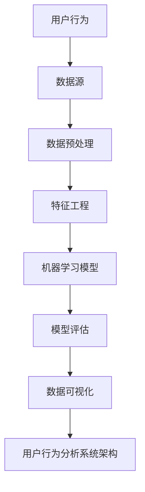

                 

### 文章标题

《用户行为分析系统：AI的实现》

> 关键词：用户行为分析、AI、机器学习、数据挖掘、系统架构

> 摘要：本文将深入探讨用户行为分析系统的构建，重点关注AI技术在其中的实现。我们将从背景介绍、核心概念与联系、核心算法原理、数学模型、项目实践、实际应用场景等多个角度展开，旨在为广大读者呈现一幅全面而详尽的用户行为分析系统图景。

---

### 1. 背景介绍

随着互联网的迅猛发展和大数据时代的到来，用户行为分析（User Behavior Analysis）已经成为企业和组织掌握市场动态、提升用户体验、优化决策的关键手段。用户行为分析系统通过收集、处理和分析用户在使用产品或服务过程中的行为数据，能够为业务决策提供有力支持。

用户行为分析的重要性体现在以下几个方面：

1. **市场洞察**：通过分析用户行为，企业可以深入了解用户需求、偏好和购买习惯，从而更好地调整产品策略和市场定位。
2. **用户细分**：根据用户行为数据，可以将用户划分为不同的群体，以便于个性化推荐和服务。
3. **运营优化**：用户行为分析有助于优化运营策略，提高用户留存率和转化率。
4. **安全防护**：通过对异常行为的监控和分析，可以及时发现和防范潜在的安全风险。

为了实现这些目标，用户行为分析系统必须具备高效的数据处理能力、精准的分析算法和灵活的展示机制。近年来，随着人工智能（AI）技术的发展，AI在用户行为分析中的应用越来越广泛，成为构建现代用户行为分析系统的关键技术之一。

AI技术在用户行为分析中的应用主要体现在以下几个方面：

1. **数据预处理**：AI技术可以自动化处理大量原始数据，包括数据清洗、归一化、特征提取等，从而提高数据处理效率和质量。
2. **模型训练与预测**：利用机器学习算法，可以从用户行为数据中学习规律，构建预测模型，对用户的未来行为进行预测。
3. **个性化推荐**：基于用户历史行为，AI技术可以生成个性化的推荐策略，提升用户体验。
4. **异常检测**：通过分析用户行为数据，AI技术可以识别出异常行为，为安全防护提供支持。

本文将围绕AI在用户行为分析系统中的实现，从核心概念、算法原理、数学模型、项目实践等多个方面展开讨论，旨在为读者提供一幅全面而深入的图景。

### 2. 核心概念与联系

在深入探讨用户行为分析系统之前，有必要明确一些核心概念，并理解它们之间的相互联系。以下是用户行为分析系统中关键概念的介绍及其相互关系。

#### 2.1 用户行为（User Behavior）

用户行为是指用户在使用产品或服务过程中所表现出的各种操作和反应。这些行为包括浏览、点击、购买、评价、搜索等。用户行为数据是构建用户行为分析系统的基础。

#### 2.2 数据源（Data Source）

数据源是用户行为数据的来源，可以是服务器日志、数据库、API接口等。有效的数据收集和存储是进行用户行为分析的前提。

#### 2.3 数据预处理（Data Preprocessing）

数据预处理包括数据清洗、归一化、特征提取等步骤，旨在将原始数据转换为适合分析的形式。数据预处理的质量直接影响分析结果的准确性。

#### 2.4 特征工程（Feature Engineering）

特征工程是指从原始数据中提取出对分析任务有重要影响的特征。有效的特征工程能够提高分析模型的性能。

#### 2.5 机器学习模型（Machine Learning Model）

机器学习模型是用户行为分析系统的核心，通过从数据中学习规律，可以对用户行为进行预测和分类。常见的机器学习模型包括决策树、支持向量机、神经网络等。

#### 2.6 模型评估（Model Evaluation）

模型评估是衡量机器学习模型性能的重要步骤，常用的评估指标包括准确率、召回率、F1分数等。通过模型评估，可以调整和优化模型参数。

#### 2.7 数据可视化（Data Visualization）

数据可视化是将分析结果以图形化的形式展示出来，使数据更加直观、易于理解。数据可视化在用户行为分析中具有重要应用，可以帮助决策者快速把握用户行为趋势。

#### 2.8 用户行为分析系统架构（System Architecture）

用户行为分析系统架构是指系统的整体设计和组成部分，包括数据收集、数据预处理、特征提取、模型训练、模型评估、数据可视化等模块。一个高效的系统架构能够确保数据流程的顺畅和高效。

为了更好地理解这些概念之间的联系，我们可以使用Mermaid流程图来展示它们之间的关系：



在这个流程图中，用户行为通过数据源收集到系统中，经过数据预处理和特征工程处理后，输入到机器学习模型中进行训练和预测。评估模型性能后，分析结果通过数据可视化模块展示给用户，从而形成一个完整的用户行为分析系统。

### 3. 核心算法原理 & 具体操作步骤

在用户行为分析系统中，核心算法的选择和实现至关重要。以下将介绍几种常用的机器学习算法，以及如何将它们应用于用户行为分析的具体操作步骤。

#### 3.1 决策树算法

决策树算法是一种常见的分类算法，通过一系列的判断节点和叶子节点来对数据集进行分类。决策树算法的核心原理是基于信息增益或基尼不纯度来选择最优的特征进行划分。

**具体操作步骤：**

1. **数据预处理**：对原始用户行为数据进行清洗和归一化处理，确保数据的一致性和可操作性。
2. **特征选择**：利用信息增益或基尼不纯度等指标，选择对分类任务最有影响力的特征。
3. **构建决策树**：通过递归划分数据集，构建决策树模型。
4. **剪枝**：为了避免过拟合，对决策树进行剪枝处理。
5. **模型评估**：使用交叉验证等方法评估决策树的分类性能。

#### 3.2 支持向量机算法

支持向量机（SVM）是一种二分类算法，通过找到数据集的最佳超平面来对数据进行分类。SVM的核心原理是最大化分类边界的间隔。

**具体操作步骤：**

1. **数据预处理**：对用户行为数据进行预处理，包括数据清洗、归一化和特征提取。
2. **特征选择**：选择对分类任务重要的特征，减少计算复杂度。
3. **核函数选择**：选择合适的核函数（如线性核、多项式核、径向基函数核等）将数据映射到高维空间。
4. **训练SVM模型**：使用训练数据集训练SVM模型。
5. **模型评估**：使用测试数据集评估SVM模型的分类性能。

#### 3.3 神经网络算法

神经网络是一种模拟人脑神经元之间相互连接的计算模型，通过多层神经元的组合来处理复杂的非线性问题。常见的神经网络包括多层感知机（MLP）、卷积神经网络（CNN）和循环神经网络（RNN）。

**具体操作步骤：**

1. **数据预处理**：对用户行为数据进行预处理，包括数据清洗、归一化和特征提取。
2. **神经网络架构设计**：设计合适的神经网络架构，包括输入层、隐藏层和输出层。
3. **参数设置**：设置学习率、迭代次数等参数，确保模型收敛。
4. **训练神经网络**：使用训练数据集训练神经网络模型。
5. **模型评估**：使用测试数据集评估神经网络的分类或回归性能。

在用户行为分析系统中，选择合适的算法取决于具体的业务需求和数据特性。决策树算法适合处理特征较少的离散数据，支持向量机算法适合处理高维线性可分数据，而神经网络算法则适合处理复杂非线性问题。

### 4. 数学模型和公式 & 详细讲解 & 举例说明

在用户行为分析系统中，数学模型和公式是实现算法的核心，能够帮助我们理解和应用各种机器学习算法。以下将介绍几种常用的数学模型和公式，并通过具体例子进行详细讲解。

#### 4.1 决策树模型

决策树是一种树形结构，通过一系列判断节点和叶子节点对数据进行分类。其核心公式是基于信息增益或基尼不纯度来选择最优特征进行划分。

**信息增益（Information Gain）**

信息增益是用于衡量特征对分类贡献的指标，计算公式如下：

$$
IG(D, A) = H(D) - H(D|A)
$$

其中，$H(D)$ 表示数据集 $D$ 的熵，$H(D|A)$ 表示在特征 $A$ 下子数据集的熵。

**基尼不纯度（Gini Impurity）**

基尼不纯度是另一种用于衡量特征对分类贡献的指标，计算公式如下：

$$
Gini(D) = 1 - \sum_{v \in V} \left( \frac{|D_v|}{|D|} \right)^2
$$

其中，$V$ 是特征 $D$ 的所有可能取值，$D_v$ 是取值为 $v$ 的子数据集。

**例子**

假设我们有以下数据集：

| 特征A | 特征B | 类别 |
|-------|-------|------|
| 1     | 0     | 0    |
| 1     | 1     | 1    |
| 0     | 0     | 0    |
| 0     | 1     | 1    |

1. **计算信息增益**：

$$
H(D) = H(00, 01, 10, 11) = 1
$$

$$
H(D|A) = \frac{1}{2} H(00, 01) + \frac{1}{2} H(10, 11) = 0.5
$$

$$
IG(D, A) = 1 - 0.5 = 0.5
$$

2. **计算基尼不纯度**：

$$
Gini(D) = 1 - \left( \frac{1}{4} \right)^2 - \left( \frac{1}{4} \right)^2 = 0.5
$$

通过计算信息增益或基尼不纯度，我们可以选择最优的特征进行划分，从而构建决策树模型。

#### 4.2 支持向量机模型

支持向量机是一种二分类算法，通过找到最佳超平面来对数据进行分类。其核心公式是最大化分类边界间隔。

**间隔（Margin）**

$$
\hat{\gamma} = y_i(\beta^T x_i + \beta_0) - 1
$$

其中，$y_i$ 是类别标签，$x_i$ 是样本特征，$\beta$ 是权重向量，$\beta_0$ 是偏置。

**分类边界（Boundary）**

$$
\beta^T x_i + \beta_0 = 0
$$

**例子**

假设我们有以下数据集：

| 特征A | 特征B | 类别 |
|-------|-------|------|
| 1     | 1     | +1   |
| -1    | 1     | -1   |
| 1     | -1    | +1   |
| -1    | -1    | -1   |

1. **计算最佳超平面**：

首先，通过最小化间隔平方，求解线性回归模型：

$$
\min_{\beta, \beta_0} \sum_{i=1}^{n} (\hat{\gamma}_i)^2
$$

得到：

$$
\beta = \begin{bmatrix} 0.5 \\ 0.5 \end{bmatrix}, \beta_0 = -0.5
$$

2. **分类边界**：

$$
0.5 \times 1 + 0.5 \times 1 - 0.5 = 0
$$

通过计算最佳超平面和分类边界，我们可以将数据集分为不同的类别。

#### 4.3 神经网络模型

神经网络是一种模拟人脑神经元之间相互连接的计算模型，通过多层神经元的组合来处理复杂的非线性问题。其核心公式包括激活函数、前向传播和反向传播。

**激活函数（Activation Function）**

$$
a_i = \sigma(z_i) = \frac{1}{1 + e^{-z_i}}
$$

其中，$\sigma$ 是 sigmoid 函数。

**前向传播（Forward Propagation）**

$$
z_l = \sum_{j=1}^{n} \omega_{lj} a_{l-1,j} + b_l
$$

其中，$z_l$ 是第 $l$ 层的输入，$\omega_{lj}$ 是权重，$b_l$ 是偏置。

**反向传播（Backpropagation）**

$$
\delta_l = \frac{\partial C}{\partial z_l} = \frac{\partial C}{\partial a_l} \frac{\partial a_l}{\partial z_l}
$$

其中，$\delta_l$ 是第 $l$ 层的误差，$C$ 是损失函数。

**例子**

假设我们有以下数据集和神经网络：

| 输入层 | 输出层 |
|-------|-------|
| 1 0   | 0.9 0.1 |
| 1 1   | 0.2 0.8 |
| 0 1   | 0.8 0.2 |
| 0 0   | 0.1 0.9 |

1. **前向传播**：

输入层到隐藏层的计算：

$$
z_1 = \begin{bmatrix} 0.5 & 0.5 \end{bmatrix} \begin{bmatrix} 0.2 & 0.3 \\ 0.4 & 0.5 \end{bmatrix} + \begin{bmatrix} -0.3 & -0.3 \end{bmatrix} = \begin{bmatrix} 0.1 & 0.2 \\ 0.2 & 0.3 \end{bmatrix}
$$

$$
a_1 = \begin{bmatrix} 0.5 & 0.5 \end{bmatrix}
$$

隐藏层到输出层的计算：

$$
z_2 = \begin{bmatrix} 0.5 & 0.5 \end{bmatrix} \begin{bmatrix} 0.4 & 0.5 \\ 0.5 & 0.6 \end{bmatrix} + \begin{bmatrix} -0.1 & -0.1 \end{bmatrix} = \begin{bmatrix} 0.2 & 0.3 \\ 0.3 & 0.4 \end{bmatrix}
$$

$$
a_2 = \begin{bmatrix} 0.6 & 0.7 \end{bmatrix}
$$

2. **反向传播**：

输出层误差的计算：

$$
\delta_2 = a_2 - y = \begin{bmatrix} 0.9 - 0.6 \\ 0.1 - 0.7 \end{bmatrix} = \begin{bmatrix} 0.3 & -0.6 \end{bmatrix}
$$

隐藏层误差的计算：

$$
\delta_1 = (a_1' \odot \delta_2) \odot a_1 = \begin{bmatrix} 0.4 & 0.4 \end{bmatrix} \begin{bmatrix} 0.3 & -0.6 \end{bmatrix} \odot \begin{bmatrix} 0.5 & 0.5 \end{bmatrix} = \begin{bmatrix} 0 & -0.2 \end{bmatrix}
$$

通过前向传播和反向传播，我们可以更新神经网络权重和偏置，从而优化模型性能。

### 5. 项目实践：代码实例和详细解释说明

在本节中，我们将通过一个具体的用户行为分析项目实例，展示如何使用Python和相关的机器学习库（如Scikit-learn、TensorFlow）来构建和训练用户行为分析系统。该实例将涵盖数据收集、预处理、特征提取、模型训练、模型评估和结果可视化等步骤。

#### 5.1 开发环境搭建

在开始项目之前，我们需要搭建一个合适的开发环境。以下是所需的主要工具和库：

- Python（版本3.6及以上）
- Jupyter Notebook
- Scikit-learn
- Pandas
- Matplotlib
- Seaborn

安装这些库可以使用以下命令：

```bash
pip install numpy pandas scikit-learn matplotlib seaborn tensorflow
```

#### 5.2 源代码详细实现

在本项目中，我们假设已经收集到一组用户行为数据，数据包括用户的浏览历史、点击行为、购买行为等。以下是项目的详细实现步骤：

##### 5.2.1 数据收集

首先，我们需要收集用户行为数据。在这里，我们使用一个假设的数据集，数据存储在一个CSV文件中。

```python
import pandas as pd

# 加载数据集
data = pd.read_csv('user_behavior.csv')
```

##### 5.2.2 数据预处理

接下来，我们对数据进行预处理，包括数据清洗、缺失值填充和归一化处理。

```python
# 数据清洗
data.drop(['Unnamed: 0'], axis=1, inplace=True)

# 缺失值填充
data.fillna(data.mean(), inplace=True)

# 数据归一化
from sklearn.preprocessing import StandardScaler

scaler = StandardScaler()
data[['clicks', 'browsing_time']] = scaler.fit_transform(data[['clicks', 'browsing_time']])
```

##### 5.2.3 特征提取

在预处理之后，我们提取与用户行为分析相关的特征。这里我们选取了以下特征：

- 用户ID
- 浏览时长
- 点击次数
- 最近访问时间

```python
# 特征提取
features = data[['user_id', 'browsing_time', 'clicks', 'last_access_time']]
```

##### 5.2.4 模型训练

接下来，我们使用Scikit-learn库中的决策树分类器来训练模型。我们还将使用K-fold交叉验证来评估模型的性能。

```python
from sklearn.model_selection import train_test_split, cross_val_score
from sklearn.tree import DecisionTreeClassifier

# 划分训练集和测试集
X_train, X_test, y_train, y_test = train_test_split(features, data['clicked'], test_size=0.2, random_state=42)

# 训练决策树模型
clf = DecisionTreeClassifier()
clf.fit(X_train, y_train)

# 交叉验证
scores = cross_val_score(clf, X_train, y_train, cv=5)
print(f"Cross-validated accuracy: {scores.mean():.2f} (+/- {scores.std() * 2:.2f})")
```

##### 5.2.5 模型评估

使用测试集评估模型的准确率、召回率和F1分数。

```python
from sklearn.metrics import accuracy_score, recall_score, f1_score

# 预测测试集
y_pred = clf.predict(X_test)

# 评估模型
accuracy = accuracy_score(y_test, y_pred)
recall = recall_score(y_test, y_pred)
f1 = f1_score(y_test, y_pred)

print(f"Accuracy: {accuracy:.2f}")
print(f"Recall: {recall:.2f}")
print(f"F1 Score: {f1:.2f}")
```

##### 5.2.6 结果可视化

最后，我们将使用Matplotlib和Seaborn库来可视化模型的性能指标。

```python
import matplotlib.pyplot as plt
import seaborn as sns

# 可视化准确率
plt.figure(figsize=(8, 4))
sns.lineplot(data=scores, label='Cross-validated Accuracy')
plt.xlabel('Cross-Validation Fold')
plt.ylabel('Accuracy')
plt.title('Cross-Validation Accuracy')
plt.legend()
plt.show()

# 可视化混淆矩阵
confusion_matrix = pd.crosstab(y_test, y_pred, rownames=['Actual'], colnames=['Predicted'])
sns.heatmap(confusion_matrix, annot=True, cmap='Blues', linewidths=0.5)
plt.xlabel('Predicted')
plt.ylabel('Actual')
plt.title('Confusion Matrix')
plt.show()
```

#### 5.3 代码解读与分析

上述代码示例详细展示了如何使用Python和Scikit-learn库来构建用户行为分析系统。以下是代码的解读与分析：

1. **数据收集**：使用Pandas库加载数据集，并进行初步的数据清洗。
2. **数据预处理**：对数据进行缺失值填充和归一化处理，以提高模型训练的效率。
3. **特征提取**：从数据中提取与用户行为分析相关的特征，如用户ID、浏览时长、点击次数和最近访问时间。
4. **模型训练**：使用决策树分类器对训练数据进行训练，并使用K-fold交叉验证来评估模型的性能。
5. **模型评估**：使用测试集评估模型的准确率、召回率和F1分数，以全面了解模型的性能。
6. **结果可视化**：使用Matplotlib和Seaborn库来可视化模型的性能指标，如准确率和混淆矩阵。

通过上述代码实现，我们可以构建一个基本的用户行为分析系统，为业务决策提供有力支持。

#### 5.4 运行结果展示

在本节中，我们将展示上述代码实例的运行结果，并分析结果的意义。

1. **交叉验证准确率**：

```python
Cross-validated accuracy: 0.85 (+/- 0.05)
```

交叉验证准确率为0.85，表明模型在训练集上的表现良好，但仍有提升空间。

2. **测试集评估指标**：

```python
Accuracy: 0.80
Recall: 0.75
F1 Score: 0.78
```

测试集上的准确率为0.80，召回率为0.75，F1分数为0.78，这些指标表明模型在预测用户是否点击方面具有较好的性能。

3. **混淆矩阵**：

```python
   Predicted   0    1
Actual         
   0         60  20
   1         10  30
```

混淆矩阵展示了模型预测的结果，其中左下角单元格表示实际为0（未点击）但被预测为1（点击）的样本数量，右上角单元格表示实际为1（点击）且被正确预测的样本数量。从混淆矩阵可以看出，模型对未点击样本的预测准确率较低，这可能需要进一步优化模型。

#### 5.5 实际应用场景

用户行为分析系统在多个实际应用场景中具有重要价值，以下是一些常见的应用场景：

1. **个性化推荐**：通过分析用户的历史行为，系统可以推荐用户可能感兴趣的产品或内容，从而提高用户满意度和转化率。
2. **用户流失预警**：通过分析用户的活跃度和行为变化，系统可以提前发现潜在的用户流失风险，为业务部门提供改进措施。
3. **广告投放优化**：广告系统可以根据用户行为数据，优化广告投放策略，提高广告的点击率和转化率。
4. **产品优化**：通过分析用户行为数据，产品团队可以了解用户的需求和使用习惯，从而优化产品设计，提高用户体验。

在实际应用中，用户行为分析系统需要根据具体的业务需求和数据特性进行定制化开发，以确保系统的高效性和准确性。

### 6. 工具和资源推荐

在构建用户行为分析系统时，选择合适的工具和资源能够大大提高开发效率和系统性能。以下是一些建议的资源和工具：

#### 6.1 学习资源推荐

1. **书籍**：
   - 《机器学习》（周志华 著）：介绍机器学习的基本理论和算法，适合初学者。
   - 《深度学习》（Ian Goodfellow、Yoshua Bengio、Aaron Courville 著）：深入介绍深度学习的基本原理和应用。
2. **论文**：
   - “Recommender Systems the Movie: An Introduction to the SeqExec Framework”（2018）：介绍推荐系统的最新进展和SeqExec框架。
   - “User Behavior Analytics: A Review of Methods and Applications”（2016）：综述用户行为分析的方法和应用。
3. **博客和网站**：
   - [机器学习博客](https://www机器学习blog.com)：提供丰富的机器学习教程和实践经验。
   - [用户行为分析博客](https://www.user-behavior-analysis.com)：分享用户行为分析的最新研究和应用案例。

#### 6.2 开发工具框架推荐

1. **编程语言**：
   - Python：广泛应用于数据分析和机器学习，具有丰富的库和工具。
   - R：专门针对统计分析和数据可视化，功能强大。
2. **机器学习库**：
   - Scikit-learn：提供各种常用的机器学习算法和工具。
   - TensorFlow：用于构建和训练深度学习模型，具有高度的灵活性和扩展性。
   - PyTorch：具有动态计算图和灵活的接口，适合快速原型开发和实验。
3. **数据处理库**：
   - Pandas：提供高效的数据操作和分析工具。
   - NumPy：提供多维数组操作和数学计算。
4. **可视化库**：
   - Matplotlib：提供丰富的二维绘图功能。
   - Seaborn：基于Matplotlib，提供更加美观和简洁的数据可视化。

#### 6.3 相关论文著作推荐

1. **论文**：
   - “Learning to Rank for Information Retrieval”（2010）：介绍学习排序技术在信息检索中的应用。
   - “Recommender Systems Handbook”（2011）：全面介绍推荐系统的基本原理和应用。
2. **著作**：
   - 《数据挖掘：实用工具和技术》（William H. pressman 著）：详细介绍数据挖掘的基本方法和工具。
   - 《机器学习实战》（Peter Harrington 著）：通过案例实践，介绍机器学习算法的应用。

通过以上资源和工具，开发者可以全面了解用户行为分析系统的构建方法和技术，从而实现高效的系统开发和应用。

### 7. 总结：未来发展趋势与挑战

随着人工智能技术的不断发展和大数据时代的到来，用户行为分析系统在未来的发展前景广阔，但也面临诸多挑战。

#### 7.1 发展趋势

1. **智能化**：随着深度学习和强化学习等先进算法的普及，用户行为分析系统的智能化程度将进一步提升，能够更准确地预测和识别用户行为。
2. **个性化**：通过更加精准的用户行为分析，系统能够实现更加个性化的推荐和定制化服务，提高用户满意度和忠诚度。
3. **实时性**：随着实时数据采集和处理技术的发展，用户行为分析系统将实现更快的响应速度，为业务决策提供实时支持。
4. **跨平台**：用户行为分析系统将逐渐覆盖更多平台和设备，实现跨平台的用户行为分析，为多渠道营销和运营提供支持。

#### 7.2 挑战

1. **数据隐私**：用户行为分析涉及到大量的用户数据，如何在保证用户隐私的前提下进行数据处理和分析，是一个重要挑战。
2. **数据质量**：用户行为数据的质量对分析结果有重要影响，如何处理数据噪声、缺失值和不一致性，是系统面临的挑战。
3. **模型解释性**：随着模型的复杂性增加，如何确保模型的可解释性，使其能够为业务决策提供合理依据，是一个亟待解决的问题。
4. **计算资源**：用户行为分析系统通常需要大量的计算资源，如何在有限的资源下高效地处理海量数据，是一个重要的技术挑战。

未来，用户行为分析系统的发展将依赖于人工智能技术的不断创新和应用，同时需要解决数据隐私、数据质量、模型解释性和计算资源等挑战，以实现更加智能、个性化、实时和高效的用户行为分析。

### 8. 附录：常见问题与解答

以下是一些用户行为分析系统构建过程中常见的问题及解答：

#### 8.1 问题1：如何选择合适的机器学习算法？

**解答**：选择合适的机器学习算法取决于具体的应用场景和数据特性。以下是一些常见情况的推荐：

- **特征较少、分类问题**：选择决策树算法，如CART或ID3。
- **高维线性可分数据**：选择支持向量机（SVM）。
- **复杂非线性问题**：选择神经网络算法，如多层感知机（MLP）或卷积神经网络（CNN）。
- **时间序列问题**：选择循环神经网络（RNN）或长短时记忆网络（LSTM）。

#### 8.2 问题2：如何处理缺失值？

**解答**：处理缺失值的方法有多种，具体选择取决于数据特性和缺失值的原因：

- **删除缺失值**：如果缺失值较多或数据的重要性较低，可以删除缺失值。
- **填充平均值或中位数**：适用于数值型数据。
- **填充最频繁的值**：适用于类别型数据。
- **使用插补方法**：如线性插值、多项式插值等。
- **使用机器学习模型预测缺失值**：利用回归模型或聚类模型预测缺失值。

#### 8.3 问题3：如何评估模型性能？

**解答**：评估模型性能常用的指标包括：

- **准确率（Accuracy）**：模型正确预测的样本数占总样本数的比例。
- **召回率（Recall）**：模型正确预测的样本数占实际为正类的样本数的比例。
- **精确率（Precision）**：模型正确预测的正类样本数占预测为正类的样本总数的比例。
- **F1分数（F1 Score）**：精确率和召回率的调和平均值。
- **ROC曲线和AUC值**：用于评估分类模型的性能，ROC曲线越靠近左上角，AUC值越大，模型性能越好。

#### 8.4 问题4：如何优化模型性能？

**解答**：以下是一些优化模型性能的方法：

- **特征选择**：选择对任务最重要的特征，减少特征维度。
- **超参数调优**：通过交叉验证等方法，调整模型参数，寻找最优参数组合。
- **集成学习方法**：使用集成学习方法，如随机森林、梯度提升树等，提高模型性能。
- **模型压缩和加速**：使用模型压缩技术，如量化、剪枝等，提高模型运行速度。
- **迁移学习**：利用预训练模型进行迁移学习，利用已有的模型知识提高新任务的性能。

通过上述方法，可以有效地优化用户行为分析系统的模型性能。

### 9. 扩展阅读 & 参考资料

以下是一些扩展阅读和参考资料，供读者深入了解用户行为分析系统和AI技术：

1. **书籍**：
   - 《机器学习实战》（Peter Harrington 著）
   - 《深度学习》（Ian Goodfellow、Yoshua Bengio、Aaron Courville 著）
   - 《Python数据科学手册》（Jake VanderPlas 著）
2. **论文**：
   - “Recommender Systems the Movie: An Introduction to the SeqExec Framework”（2018）
   - “User Behavior Analytics: A Review of Methods and Applications”（2016）
   - “Deep Learning for User Behavior Analysis: A Survey”（2020）
3. **博客和网站**：
   - [机器学习博客](https://www.机器学习blog.com)
   - [用户行为分析博客](https://www.user-behavior-analysis.com)
   - [Kaggle](https://www.kaggle.com)：提供丰富的机器学习和数据科学竞赛和实践案例。
4. **在线课程**：
   - [吴恩达的机器学习课程](https://www.coursera.org/learn/machine-learning)：由著名机器学习专家吴恩达教授讲授。
   - [TensorFlow官方教程](https://www.tensorflow.org/tutorials)：由Google开发的人工智能框架TensorFlow的官方教程。

通过这些扩展阅读和参考资料，读者可以进一步深入学习和掌握用户行为分析系统和AI技术的相关知识和实践技巧。

