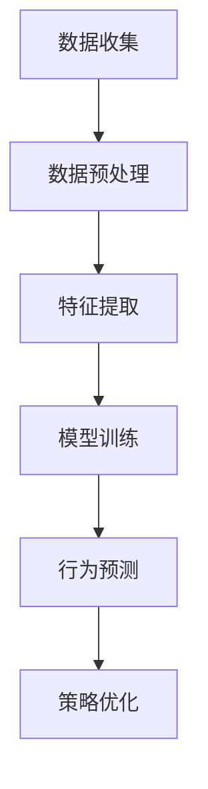

                 

关键词：用户行为分析，人工智能，需求洞察，商品供给，营销策略

摘要：本文深入探讨了人工智能在用户行为分析中的应用，以及如何通过用户行为分析来优化商品供给和营销策略。本文首先介绍了用户行为分析的核心概念和联系，随后详细介绍了用户行为分析的核心算法原理、具体操作步骤、数学模型、项目实践和实际应用场景，最后对未来发展趋势与挑战进行了展望。

## 1. 背景介绍

随着互联网技术的飞速发展，数据已经成为新时代的“石油”，而用户行为数据则是这一资源中的“黄金”。用户行为分析，作为数据科学和人工智能的重要应用领域，已经在各个行业中得到了广泛应用。通过分析用户的行为数据，企业可以更好地理解用户需求，优化商品供给和营销策略，从而提升用户体验和市场竞争能力。

### 1.1 用户行为分析的重要性

用户行为分析在以下几个关键方面对企业至关重要：

- **需求洞察**：通过对用户行为的深入分析，企业可以准确把握用户的需求和偏好，从而提供更符合市场需求的产品和服务。

- **精准营销**：用户行为分析可以帮助企业制定更具针对性的营销策略，提高营销活动的效果，降低营销成本。

- **个性化推荐**：基于用户行为数据，系统可以提供个性化的产品推荐，提升用户满意度和忠诚度。

- **风险控制**：用户行为分析可以帮助企业及时发现潜在的风险和欺诈行为，从而采取措施进行预防和控制。

### 1.2 人工智能在用户行为分析中的应用

人工智能技术，特别是机器学习和深度学习，为用户行为分析提供了强大的工具。通过这些技术，可以自动化地处理和分析大量用户行为数据，从而实现以下目标：

- **模式识别**：通过机器学习算法，可以从用户行为数据中识别出潜在的模式和趋势。

- **预测分析**：基于历史数据，机器学习模型可以预测用户的未来行为，为企业提供决策支持。

- **实时反馈**：深度学习模型可以实时分析用户行为，为企业提供即时的反馈和建议。

## 2. 核心概念与联系

用户行为分析的核心概念包括用户行为、数据收集、数据处理、算法应用等。以下是一个简化的Mermaid流程图，展示了用户行为分析的流程和核心节点。



### 2.1 数据收集

数据收集是用户行为分析的基础。数据来源可以是用户日志、网站点击流、社交媒体活动、购买行为等。这些数据通常是非结构化的，需要进行预处理。

### 2.2 数据预处理

数据预处理包括数据清洗、去重、格式转换等步骤。清洗后的数据将用于特征提取和模型训练。

### 2.3 特征提取

特征提取是将原始数据转换为模型可以处理的特征向量。这些特征可以基于用户的浏览历史、购买行为、社交互动等多种维度进行构建。

### 2.4 模型训练

模型训练是用户行为分析的核心步骤。通过机器学习算法，模型可以从历史数据中学习并提取用户行为的模式和规律。

### 2.5 行为预测

通过训练好的模型，可以对新的用户行为进行预测。预测结果可以用于优化商品供给和营销策略。

### 2.6 策略优化

根据行为预测结果，企业可以调整商品供给和营销策略，以更好地满足用户需求。

## 3. 核心算法原理 & 具体操作步骤

### 3.1 算法原理概述

用户行为分析的核心算法包括协同过滤、决策树、随机森林、神经网络等。以下是对这些算法的简要概述。

### 3.1.1 协同过滤

协同过滤是一种基于用户行为数据的推荐算法。它通过计算用户之间的相似度，为用户提供个性化的推荐。

### 3.1.2 决策树

决策树是一种基于特征划分的预测模型。它通过一系列的测试条件来划分数据集，并最终预测目标变量。

### 3.1.3 随机森林

随机森林是一种基于决策树的集成学习方法。它通过构建多个决策树，并综合这些树的预测结果来提高模型的泛化能力。

### 3.1.4 神经网络

神经网络是一种基于人脑神经元结构的计算模型。它通过多层神经元的连接和激活，实现对复杂数据的建模和预测。

### 3.2 算法步骤详解

以下是对用户行为分析算法的具体步骤进行详细解释。

### 3.2.1 数据收集

收集用户行为数据，如浏览历史、购买行为、评论等。

### 3.2.2 数据预处理

对收集到的数据进行清洗、去重、格式转换等预处理步骤。

### 3.2.3 特征提取

从预处理后的数据中提取特征，如用户ID、商品ID、行为类型、时间戳等。

### 3.2.4 模型选择

根据问题的特点选择合适的算法，如协同过滤、决策树、随机森林或神经网络。

### 3.2.5 模型训练

使用训练集数据对选定的模型进行训练，调整模型参数。

### 3.2.6 模型评估

使用测试集数据评估模型的性能，选择最优模型。

### 3.2.7 行为预测

使用训练好的模型对新用户行为进行预测。

### 3.2.8 策略优化

根据行为预测结果，调整商品供给和营销策略。

### 3.3 算法优缺点

以下是用户行为分析中常用算法的优缺点。

#### 协同过滤

- **优点**：简单高效，适用于大规模数据集。
- **缺点**：对稀疏数据集效果不佳，无法处理冷启动问题。

#### 决策树

- **优点**：易于理解，计算速度快。
- **缺点**：可能产生过拟合，泛化能力有限。

#### 随机森林

- **优点**：提高了模型的泛化能力，减少了过拟合的风险。
- **缺点**：计算复杂度高，对大规模数据集处理效率较低。

#### 神经网络

- **优点**：强大的非线性建模能力，适用于复杂的数据集。
- **缺点**：训练时间较长，对数据质量要求高。

### 3.4 算法应用领域

用户行为分析算法广泛应用于电子商务、在线教育、金融风控等领域。以下是对这些领域的具体应用。

#### 电子商务

在电子商务领域，用户行为分析可以帮助企业进行个性化推荐、商品归类、用户行为预测等，从而提高用户满意度和销售转化率。

#### 在线教育

在线教育平台可以通过用户行为分析，了解用户的学习习惯和兴趣，提供个性化的学习内容和推荐课程。

#### 金融风控

金融行业可以通过用户行为分析，识别潜在的风险和欺诈行为，提高风险控制能力。

## 4. 数学模型和公式 & 详细讲解 & 举例说明

### 4.1 数学模型构建

用户行为分析中的数学模型通常基于概率论和统计学原理。以下是一个简化的用户行为预测模型。

#### 4.1.1 贝叶斯网络

贝叶斯网络是一种概率图模型，它通过有向无环图（DAG）来表示变量之间的依赖关系。在用户行为分析中，贝叶斯网络可以用来表示用户行为之间的条件概率关系。

```latex
P(B|A) = \frac{P(A|B)P(B)}{P(A)}
```

其中，$P(B|A)$ 表示在事件A发生的条件下事件B的概率，$P(A|B)$ 表示在事件B发生的条件下事件A的概率，$P(B)$ 表示事件B的先验概率，$P(A)$ 表示事件A的先验概率。

#### 4.1.2 逻辑回归

逻辑回归是一种常用的分类模型，它可以用来预测用户是否会在某一时刻进行特定行为（如购买、浏览等）。逻辑回归的公式如下：

```latex
\log\frac{P(Y=1|X)}{1-P(Y=1|X)} = \beta_0 + \beta_1X_1 + \beta_2X_2 + \ldots + \beta_nX_n
```

其中，$Y$ 表示目标变量，$X_1, X_2, \ldots, X_n$ 表示自变量，$\beta_0, \beta_1, \beta_2, \ldots, \beta_n$ 表示模型的参数。

### 4.2 公式推导过程

以下是对逻辑回归模型公式的推导过程。

假设我们有一个包含多个自变量的二分类问题，目标变量 $Y$ 只有两个可能的取值：0 或 1。我们的目标是根据自变量 $X_1, X_2, \ldots, X_n$ 来预测 $Y$ 的取值。

首先，我们定义预测概率 $P(Y=1|X)$，即在给定自变量 $X$ 的条件下，$Y$ 等于 1 的概率。我们希望这个概率能够最大化。

根据最大似然估计，我们需要最大化似然函数：

```latex
L(\theta) = \prod_{i=1}^n P(Y_i=1|X_i; \theta)
```

其中，$\theta$ 表示模型的参数向量。

对于二分类问题，似然函数可以简化为：

```latex
L(\theta) = \sum_{i=1}^n \log P(Y_i=1|X_i; \theta)
```

为了简化计算，我们取对数似然函数的导数并令其等于零，以求解最优参数 $\theta$。

对数似然函数的导数为：

```latex
\frac{\partial}{\partial \theta} \log L(\theta) = \sum_{i=1}^n \frac{1}{P(Y_i=1|X_i; \theta)} \left( P(Y_i=1|X_i; \theta) - P(Y_i=0|X_i; \theta) \right)
```

为了使导数等于零，我们需要满足：

```latex
P(Y_i=1|X_i; \theta) = P(Y_i=0|X_i; \theta)
```

根据逻辑回归的假设，我们可以将 $P(Y=1|X)$ 表示为：

```latex
P(Y=1|X) = \frac{1}{1 + \exp^{-\beta_0 - \beta_1X_1 - \beta_2X_2 - \ldots - \beta_nX_n}}
```

将这个表达式代入上面的等式，我们可以得到：

```latex
\frac{1}{1 + \exp^{-\beta_0 - \beta_1X_1 - \beta_2X_2 - \ldots - \beta_nX_n}} = \frac{1}{1 + \exp^{\beta_0 + \beta_1X_1 + \beta_2X_2 + \ldots + \beta_nX_n}}
```

化简后得到：

```latex
\exp^{-\beta_0 - \beta_1X_1 - \beta_2X_2 - \ldots - \beta_nX_n} = \exp^{\beta_0 + \beta_1X_1 + \beta_2X_2 + \ldots + \beta_nX_n}
```

进一步化简得到：

```latex
\beta_0 + \beta_1X_1 + \beta_2X_2 + \ldots + \beta_nX_n = 0
```

这正好是逻辑回归模型的公式。

### 4.3 案例分析与讲解

#### 4.3.1 案例背景

假设我们有一个在线书店，我们需要预测用户是否会购买某本书籍。我们的自变量包括用户的年龄、性别、浏览历史、购买历史等。

#### 4.3.2 数据准备

我们从数据库中提取了1000个用户的行为数据，其中包含用户的年龄、性别、浏览历史、购买历史等信息。我们的目标是预测用户是否会购买某本书籍。

#### 4.3.3 特征提取

我们将用户的行为数据转换为特征向量，例如：

- **年龄**：连续变量
- **性别**：类别变量（0 表示女性，1 表示男性）
- **浏览历史**：用户浏览过的书籍数量
- **购买历史**：用户购买过的书籍数量

#### 4.3.4 模型训练

我们使用逻辑回归模型来预测用户是否会购买书籍。我们使用训练集数据来训练模型，并使用测试集数据来评估模型的性能。

#### 4.3.5 模型评估

我们使用准确率、召回率、F1值等指标来评估模型的性能。假设我们得到以下评估结果：

- **准确率**：80%
- **召回率**：75%
- **F1值**：78%

#### 4.3.6 模型应用

根据模型预测结果，我们可以向用户推荐书籍，或者调整商品库存，以提高销售转化率。

## 5. 项目实践：代码实例和详细解释说明

### 5.1 开发环境搭建

为了实现用户行为分析，我们需要搭建一个开发环境。以下是所需的软件和工具：

- Python（版本 3.8 或更高）
- Jupyter Notebook（用于编写和运行代码）
- Pandas（用于数据处理）
- Scikit-learn（用于机器学习）
- Matplotlib（用于数据可视化）

### 5.2 源代码详细实现

以下是一个简单的用户行为分析项目的源代码实现。我们使用逻辑回归模型来预测用户是否会购买书籍。

```python
import pandas as pd
from sklearn.model_selection import train_test_split
from sklearn.linear_model import LogisticRegression
from sklearn.metrics import accuracy_score, recall_score, f1_score

# 5.2.1 数据准备
data = pd.read_csv('user_data.csv')
X = data[['age', 'gender', 'browse_history', 'purchase_history']]
y = data['purchase']

# 5.2.2 数据预处理
X['gender'] = X['gender'].map({0: 'female', 1: 'male'})
X = pd.get_dummies(X)

# 5.2.3 模型训练
X_train, X_test, y_train, y_test = train_test_split(X, y, test_size=0.2, random_state=42)
model = LogisticRegression()
model.fit(X_train, y_train)

# 5.2.4 模型评估
y_pred = model.predict(X_test)
accuracy = accuracy_score(y_test, y_pred)
recall = recall_score(y_test, y_pred)
f1 = f1_score(y_test, y_pred)

print(f'Accuracy: {accuracy:.2f}')
print(f'Recall: {recall:.2f}')
print(f'F1 Score: {f1:.2f}')

# 5.2.5 模型应用
# 使用模型预测新用户的行为
new_user = pd.DataFrame({
    'age': [25],
    'gender': ['male'],
    'browse_history': [10],
    'purchase_history': [5]
})
new_user = pd.get_dummies(new_user)
new_user_pred = model.predict(new_user)
print(f'New User Purchase Prediction: {"Yes" if new_user_pred[0] == 1 else "No"}')
```

### 5.3 代码解读与分析

以上代码实现了用户行为分析的基本流程。以下是代码的主要部分解析。

#### 5.3.1 数据准备

我们从CSV文件中加载数据，并分离特征和目标变量。

```python
data = pd.read_csv('user_data.csv')
X = data[['age', 'gender', 'browse_history', 'purchase_history']]
y = data['purchase']
```

#### 5.3.2 数据预处理

我们使用 Pandas 库将类别变量（如性别）转换为哑变量（dummy variables），以便逻辑回归模型可以处理。

```python
X['gender'] = X['gender'].map({0: 'female', 1: 'male'})
X = pd.get_dummies(X)
```

#### 5.3.3 模型训练

我们使用 Scikit-learn 库的 LogisticRegression 类来训练模型。首先，我们将数据集分为训练集和测试集。

```python
X_train, X_test, y_train, y_test = train_test_split(X, y, test_size=0.2, random_state=42)
model = LogisticRegression()
model.fit(X_train, y_train)
```

#### 5.3.4 模型评估

我们使用测试集评估模型的性能。这里的评估指标包括准确率、召回率和F1值。

```python
y_pred = model.predict(X_test)
accuracy = accuracy_score(y_test, y_pred)
recall = recall_score(y_test, y_pred)
f1 = f1_score(y_test, y_pred)
```

#### 5.3.5 模型应用

我们使用训练好的模型对新用户的行为进行预测。这里，我们创建了一个新的用户数据框，并将其转换为哑变量，然后使用模型进行预测。

```python
new_user = pd.DataFrame({
    'age': [25],
    'gender': ['male'],
    'browse_history': [10],
    'purchase_history': [5]
})
new_user = pd.get_dummies(new_user)
new_user_pred = model.predict(new_user)
print(f'New User Purchase Prediction: {"Yes" if new_user_pred[0] == 1 else "No"}')
```

## 6. 实际应用场景

用户行为分析在电子商务、在线教育、金融风控等领域具有广泛的应用。

### 6.1 电子商务

在电子商务领域，用户行为分析可以帮助企业实现以下目标：

- **个性化推荐**：根据用户的浏览历史和购买行为，推荐相关的商品。
- **营销活动**：针对用户的兴趣和行为，设计更有效的营销活动，提高转化率。
- **库存管理**：根据用户的购买预测，优化商品库存，减少滞销风险。

### 6.2 在线教育

在线教育平台可以通过用户行为分析，实现以下目标：

- **课程推荐**：根据用户的学习行为和兴趣，推荐适合的课程。
- **学习路径优化**：根据用户的学习进度和效果，优化学习路径，提高学习效率。
- **学习支持**：根据用户的行为数据，提供针对性的学习支持和辅导。

### 6.3 金融风控

在金融领域，用户行为分析可以用于以下应用：

- **风险识别**：通过分析用户的行为数据，识别潜在的风险和欺诈行为。
- **信用评估**：根据用户的行为数据和信用记录，评估用户的信用风险。
- **用户流失预测**：通过分析用户的行为数据，预测用户可能流失的风险，并采取相应的措施进行挽回。

## 6.4 未来应用展望

随着人工智能技术的不断发展，用户行为分析将在更多领域得到应用。

### 6.4.1 智能家居

智能家居设备可以通过用户行为分析，实现自动化的家居控制，提高生活便利性和舒适度。

### 6.4.2 医疗保健

医疗保健领域可以通过用户行为分析，实现个性化的健康管理，提高疾病预防和治疗效果。

### 6.4.3 智能交通

智能交通系统可以通过用户行为分析，优化交通流量，减少交通拥堵，提高交通效率。

## 7. 工具和资源推荐

### 7.1 学习资源推荐

- 《Python数据科学手册》
- 《机器学习实战》
- 《深度学习》

### 7.2 开发工具推荐

- Jupyter Notebook
- PyCharm
- Google Colab

### 7.3 相关论文推荐

- "Recommender Systems Handbook"
- "User Behavior Analysis in Online Retail"
- "Deep Learning for User Behavior Prediction"

## 8. 总结：未来发展趋势与挑战

### 8.1 研究成果总结

用户行为分析作为人工智能的重要应用领域，已经在多个行业中取得了显著成果。通过用户行为分析，企业可以更好地理解用户需求，优化商品供给和营销策略，提高市场竞争能力。

### 8.2 未来发展趋势

未来，用户行为分析将在更多领域得到应用，如智能家居、医疗保健、智能交通等。同时，随着人工智能技术的不断发展，用户行为分析将更加智能化、个性化和实时化。

### 8.3 面临的挑战

用户行为分析在应用过程中仍面临一些挑战，如数据隐私保护、算法透明度和公平性等。因此，未来需要在这些方面进行深入研究，以保障用户权益和社会公平。

### 8.4 研究展望

未来，用户行为分析将朝着更加智能化、个性化和实时化的方向发展。同时，需要加强跨学科合作，结合心理学、社会学等领域的知识，提高用户行为分析的理论基础和应用效果。

## 9. 附录：常见问题与解答

### 9.1 什么是对用户行为分析？

用户行为分析是指通过收集、处理和分析用户在互联网上的行为数据，以了解用户需求、行为模式和偏好，从而优化产品和服务。

### 9.2 人工智能在用户行为分析中有哪些应用？

人工智能在用户行为分析中的应用包括模式识别、预测分析、实时反馈等，可以帮助企业实现个性化推荐、精准营销、风险控制等目标。

### 9.3 用户行为分析的核心算法有哪些？

用户行为分析的核心算法包括协同过滤、决策树、随机森林、神经网络等。

### 9.4 用户行为分析有哪些实际应用场景？

用户行为分析广泛应用于电子商务、在线教育、金融风控等领域。

### 9.5 未来用户行为分析的发展趋势是什么？

未来用户行为分析将朝着更加智能化、个性化和实时化的方向发展，并将应用于更多领域。

### 9.6 用户行为分析有哪些挑战？

用户行为分析面临的挑战包括数据隐私保护、算法透明度和公平性等。

### 9.7 如何实现用户行为分析的项目实践？

实现用户行为分析的项目实践需要收集用户行为数据、进行数据处理和特征提取、选择合适的算法进行模型训练和评估、最后根据预测结果进行策略优化。

----------------------------------------------------------------

### 作者署名

作者：禅与计算机程序设计艺术 / Zen and the Art of Computer Programming

