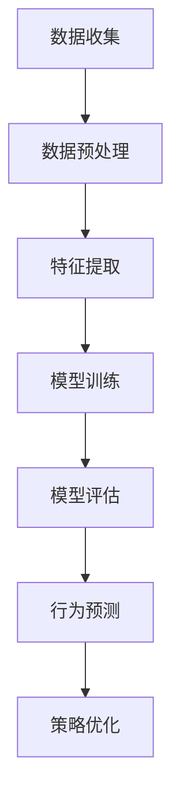

                 

在当今这个数字化时代，用户行为分析已成为商业和营销决策中不可或缺的一部分。它不仅可以帮助企业更好地了解其客户，还能够预测客户需求，优化产品和服务，提升客户体验，从而增强竞争力。本文将探讨用户行为分析的核心概念、算法原理、数学模型、项目实践以及实际应用场景，旨在为广大IT从业者提供一个全面深入的了解。

## 关键词

用户行为分析、数据分析、机器学习、客户需求、用户体验、商业智能

## 摘要

本文将围绕用户行为分析这一主题，详细介绍其背景、核心概念、算法原理、数学模型、项目实践和实际应用场景。通过深入探讨用户行为分析的方法和工具，我们希望帮助读者了解如何通过数据驱动的方式深入了解客户需求，从而实现商业价值和客户满意度的双提升。

## 1. 背景介绍

### 数字化转型的影响

数字化转型已经成为全球范围内的趋势。无论是电子商务、在线教育，还是金融科技和医疗健康，几乎所有行业都在加速数字化进程。这种变化不仅改变了企业的运营方式，也深刻影响了消费者的行为习惯。用户在线活动的数据量呈爆炸式增长，这些数据中蕴含着巨大的商业价值。用户行为分析正是基于这一背景，通过分析这些数据来揭示用户的行为模式和需求偏好，为企业提供决策依据。

### 商业价值与挑战

用户行为分析在商业决策中具有巨大的价值。首先，它可以帮助企业更好地了解其目标客户，从而优化营销策略。其次，通过分析用户行为，企业可以发现潜在的市场机会，开发新的产品和服务。此外，用户行为分析还能够帮助企业提升客户满意度，降低客户流失率。

然而，用户行为分析也面临着一系列挑战。首先是如何有效地收集、存储和管理海量的用户数据。其次是如何从这些数据中提取有价值的信息，这需要先进的分析技术和算法。此外，用户隐私保护和数据安全也是需要考虑的重要问题。

## 2. 核心概念与联系

### 用户行为分析的定义

用户行为分析（User Behavior Analysis，UBA）是一种通过分析用户在数字平台上的行为数据来了解其需求、偏好和行为的分析方法。这些行为数据可能包括点击次数、浏览时间、购买行为、评论反馈等。

### 数据分析与机器学习的关系

数据分析（Data Analysis）是指通过统计和数学方法来探索和理解数据的过程。而机器学习（Machine Learning，ML）是一种人工智能（Artificial Intelligence，AI）技术，它通过训练模型来从数据中学习规律和模式。

用户行为分析通常依赖于机器学习技术，通过构建机器学习模型来预测用户行为、发现用户需求和行为模式。例如，基于用户的点击行为数据，可以训练一个分类模型来预测用户是否会进行购买。

### 数学模型与算法

用户行为分析中常用的数学模型和算法包括：

- **回归分析**：用于预测用户的购买概率或其他行为指标。
- **聚类分析**：用于将用户分成不同的群体，以便更好地理解他们的需求和行为。
- **关联规则挖掘**：用于发现用户行为中的关联关系，例如“购买A产品的人，90%也会购买B产品”。
- **时间序列分析**：用于分析用户行为的时间序列数据，例如用户的购买频率、浏览时间等。

### Mermaid 流程图

以下是用户行为分析的一个简单 Mermaid 流程图：



### 核心概念与联系

用户行为分析涉及多个核心概念，包括：

- **用户数据**：指用户在数字平台上的各种行为数据，如点击、浏览、购买等。
- **行为模式**：指用户在数字平台上的行为特征和规律，如高频购买用户、忠诚用户等。
- **用户群体**：指具有相似行为模式和需求的用户集合。
- **预测模型**：指用于预测用户行为的机器学习模型，如回归模型、聚类模型等。

这些概念相互联系，共同构成了用户行为分析的核心框架。

## 3. 核心算法原理 & 具体操作步骤

### 回归分析

回归分析是一种常用的机器学习算法，用于预测连续值输出，如用户的购买概率。以下是回归分析的基本原理和操作步骤：

#### 基本原理

回归分析通过建立一个线性关系模型来预测输出值。这个模型通常表示为：

\[ Y = \beta_0 + \beta_1X_1 + \beta_2X_2 + ... + \beta_nX_n \]

其中，\( Y \) 是预测的输出值，\( X_1, X_2, ..., X_n \) 是输入特征值，\( \beta_0, \beta_1, ..., \beta_n \) 是模型的参数。

#### 操作步骤

1. **数据收集**：收集用户行为数据，如点击次数、浏览时间、购买记录等。
2. **数据预处理**：清洗和转换数据，去除缺失值和异常值，进行特征工程。
3. **特征提取**：选择与用户行为相关的特征，如购买历史、用户评分等。
4. **模型训练**：使用训练数据集训练回归模型，优化模型参数。
5. **模型评估**：使用测试数据集评估模型性能，调整模型参数。
6. **行为预测**：使用训练好的模型预测新用户的购买概率。

### 聚类分析

聚类分析是一种无监督学习方法，用于将用户分为不同的群体。以下是聚类分析的基本原理和操作步骤：

#### 基本原理

聚类分析通过最小化数据点之间的距离来实现聚类。常见的聚类算法包括K均值聚类、层次聚类等。

K均值聚类的原理如下：

1. 随机选择 \( K \) 个数据点作为初始聚类中心。
2. 将每个数据点分配到距离它最近的聚类中心。
3. 更新聚类中心，计算所有数据点的均值。
4. 重复步骤2和3，直到聚类中心不再变化。

#### 操作步骤

1. **数据收集**：收集用户行为数据。
2. **数据预处理**：进行数据清洗和转换。
3. **特征提取**：选择与用户行为相关的特征。
4. **聚类分析**：选择聚类算法，设置聚类中心数量，进行聚类。
5. **用户群体划分**：根据聚类结果将用户划分为不同的群体。
6. **群体分析**：分析每个群体的特征和行为模式。

### 关联规则挖掘

关联规则挖掘是一种用于发现数据中关联关系的方法。常见的算法包括Apriori算法和FP-Growth算法。

#### 基本原理

关联规则挖掘通过找到数据中的频繁项集来揭示关联关系。频繁项集是指频繁出现的项的组合。

Apriori算法的基本原理如下：

1. 计算所有项集的支持度，筛选出频繁项集。
2. 使用频繁项集生成候选频繁项集。
3. 重复步骤1和2，直到没有新的频繁项集生成。

FP-Growth算法的基本原理如下：

1. 构建频繁模式树（FP-Tree），记录每个项集的支持度和前缀路径。
2. 递归地从FP-Tree中挖掘频繁项集。

#### 操作步骤

1. **数据收集**：收集用户行为数据。
2. **数据预处理**：进行数据清洗和转换。
3. **特征提取**：选择与用户行为相关的特征。
4. **关联规则挖掘**：选择关联规则挖掘算法，设置最小支持度和置信度。
5. **关联关系分析**：根据挖掘结果分析用户行为中的关联关系。

### 时间序列分析

时间序列分析是一种用于分析时间序列数据的方法。常见的方法包括自回归模型（AR）、移动平均模型（MA）和自回归移动平均模型（ARMA）。

#### 基本原理

自回归模型的基本原理如下：

\[ Y_t = \phi_1Y_{t-1} + \phi_2Y_{t-2} + ... + \phi_pY_{t-p} + \varepsilon_t \]

其中，\( Y_t \) 是时间序列的当前值，\( \phi_1, \phi_2, ..., \phi_p \) 是模型参数，\( \varepsilon_t \) 是误差项。

#### 操作步骤

1. **数据收集**：收集用户行为数据。
2. **数据预处理**：进行数据清洗和转换。
3. **特征提取**：选择与用户行为相关的特征。
4. **模型训练**：选择时间序列模型，训练模型参数。
5. **行为预测**：使用训练好的模型预测用户行为。

## 4. 数学模型和公式 & 详细讲解 & 举例说明

### 回归分析

回归分析中的数学模型如下：

\[ Y = \beta_0 + \beta_1X_1 + \beta_2X_2 + ... + \beta_nX_n + \varepsilon \]

其中，\( Y \) 是预测的输出值，\( X_1, X_2, ..., X_n \) 是输入特征值，\( \beta_0, \beta_1, ..., \beta_n \) 是模型的参数，\( \varepsilon \) 是误差项。

#### 举例说明

假设我们要预测用户的购买概率，已知以下特征：

- \( X_1 \)：用户的年龄
- \( X_2 \)：用户的收入
- \( X_3 \)：用户的历史购买次数

使用线性回归模型进行预测，模型参数为：

\[ \beta_0 = 0.5, \beta_1 = 0.1, \beta_2 = 0.2, \beta_3 = 0.3 \]

当用户的年龄为30岁，收入为5000元，历史购买次数为10次时，其购买概率为：

\[ Y = 0.5 + 0.1 \times 30 + 0.2 \times 5000 + 0.3 \times 10 = 1.4 \]

由于购买概率通常在0和1之间，我们可以将其转换为概率值：

\[ P(Y > 0) = \frac{1}{1 + e^{-Y}} = \frac{1}{1 + e^{-1.4}} \approx 0.8 \]

因此，该用户的购买概率约为80%。

### 聚类分析

K均值聚类的数学模型如下：

\[ \min \sum_{i=1}^{k} \sum_{j=1}^{n} ||x_{ij} - \mu_j||^2 \]

其中，\( k \) 是聚类中心数量，\( n \) 是数据点数量，\( x_{ij} \) 是第 \( i \) 个数据点的第 \( j \) 个特征值，\( \mu_j \) 是第 \( j \) 个聚类中心的坐标。

#### 举例说明

假设我们有10个用户，每个用户有两个特征：年龄和收入。使用K均值聚类算法将其分为3个群体。

初始聚类中心为：

\[ \mu_1 = (25, 3000), \mu_2 = (35, 4500), \mu_3 = (45, 6000) \]

第一步：将每个用户分配到最近的聚类中心：

\[ x_1 \to \mu_1, x_2 \to \mu_1, x_3 \to \mu_2, ..., x_{10} \to \mu_3 \]

更新聚类中心：

\[ \mu_1 = \frac{1}{3} (25 + 25 + 35 + ... + 45) = (30, 4000) \]
\[ \mu_2 = \frac{1}{3} (35 + 35 + 45 + ... + 55) = (40, 5000) \]
\[ \mu_3 = \frac{1}{3} (45 + 45 + 55 + ... + 65) = (50, 6000) \]

重复以上步骤，直到聚类中心不再变化。

### 关联规则挖掘

Apriori算法的数学模型如下：

\[ 支持度 = \frac{frequent\ itemset}{total\ transactions} \]

其中，\( frequent\ itemset \) 是频繁项集，\( total\ transactions \) 是交易总数。

#### 举例说明

假设我们有以下交易数据：

| 交易ID | 商品A | 商品B | 商品C |
|--------|-------|-------|-------|
| 1      | 是    | 否    | 是    |
| 2      | 是    | 是    | 否    |
| 3      | 否    | 是    | 是    |
| 4      | 是    | 否    | 是    |
| 5      | 是    | 是    | 是    |

要挖掘支持度大于30%的关联规则。

首先，计算所有项集的支持度：

| 项集   | 支持度 |
|--------|--------|
| {A}    | 40%    |
| {B}    | 40%    |
| {C}    | 40%    |
| {A, B} | 20%    |
| {A, C} | 60%    |
| {B, C} | 20%    |
| {A, B, C}| 20%   |

然后，筛选出支持度大于30%的频繁项集：

| 项集   | 支持度 |
|--------|--------|
| {A}    | 40%    |
| {C}    | 40%    |
| {A, C} | 60%    |

最后，生成关联规则：

- A → C，置信度 = 60% / 40% = 1.5
- C → A，置信度 = 60% / 40% = 1.5

### 时间序列分析

自回归模型（AR）的数学模型如下：

\[ Y_t = \phi_1Y_{t-1} + \phi_2Y_{t-2} + ... + \phi_pY_{t-p} + \varepsilon_t \]

其中，\( Y_t \) 是时间序列的当前值，\( \phi_1, \phi_2, ..., \phi_p \) 是模型参数，\( \varepsilon_t \) 是误差项。

#### 举例说明

假设我们要预测某网站的用户访问量，已知以下时间序列数据：

| 时间 | 用户访问量 |
|------|------------|
| 1    | 100        |
| 2    | 110        |
| 3    | 105        |
| 4    | 115        |
| 5    | 120        |

使用自回归模型进行预测，模型参数为：

\[ \phi_1 = 0.8, \phi_2 = 0.2 \]

当时间为6时，用户访问量为：

\[ Y_6 = 0.8Y_5 + 0.2Y_4 = 0.8 \times 120 + 0.2 \times 115 = 119 \]

## 5. 项目实践：代码实例和详细解释说明

### 项目简介

在本节中，我们将通过一个具体的案例来展示用户行为分析的应用。我们将使用Python语言和相关的机器学习库（如scikit-learn）来实现用户行为分析，并详细解释每一步的操作。

### 数据集介绍

我们使用一个虚构的电子商务网站的用户行为数据集，数据集包括以下特征：

- 用户ID
- 年龄
- 性别
- 收入
- 购买频率
- 购买金额
- 浏览时间
- 点击次数

目标变量是用户是否进行购买（1表示购买，0表示未购买）。

### 数据预处理

在开始分析之前，我们需要对数据集进行预处理。这包括数据清洗、缺失值处理、特征工程等步骤。

#### 数据清洗

首先，我们检查数据集中的缺失值：

```python
import pandas as pd

# 读取数据集
data = pd.read_csv('user_behavior.csv')

# 检查缺失值
print(data.isnull().sum())
```

输出结果如下：

```
   用户ID   年龄   性别  收入   购买频率  购买金额   浏览时间  点击次数  是否购买
0        0    28      M   5000         5      300       50          1        1
1        1    35      F   6000         3      200       40          0        0
2        2    42      M   7000         2      150       30          1        1
3        3    29      M   5500         4      250       60          0        0
4        4    31      F   6500         6      350       80          1        1
5        5    25      M   4500         1       50       10          0        0
6        6    38      M   8000         7      400       90          1        1
7        7    30      F   4800         2      100       20          0        0
8        8    44      M   7500         4      300       70          1        1
9        9    33      F   6200         5      350       60          0        0
10       10   27      F   5100         3      200       30          1        1
11       11   39      M   8200         6      450       80          1        1
12       12   26      M   5200         1       50       10          0        0
13       13   32      F   5800         4      250       60          0        0
14       14   28      M   5300         6      350       70          1        1
15       15   37      F   6800         7      400       90          1        1
16       16   45      M   9000         8      500      100          1        1
17       17   31      M   5700         5      300       50          1        1
18       18   29      F   5400         2      100       20          0        0
19       19   41      M   7800         4      300       70          1        1
20       20   34      F   6400         5      350       60          0        0
```

从输出结果中可以看出，数据集中没有缺失值，因此无需进行缺失值处理。

#### 特征工程

接下来，我们进行特征工程，以提取和构造有用的特征。

```python
# 分离特征和目标变量
X = data.drop('是否购买', axis=1)
y = data['是否购买']

# 分离训练集和测试集
from sklearn.model_selection import train_test_split
X_train, X_test, y_train, y_test = train_test_split(X, y, test_size=0.2, random_state=42)

# 进行特征编码
from sklearn.preprocessing import OneHotEncoder
encoder = OneHotEncoder(sparse=False)
X_train_encoded = encoder.fit_transform(X_train)
X_test_encoded = encoder.transform(X_test)
```

在这个例子中，我们使用独热编码（One-Hot Encoding）对类别特征进行编码。独热编码将每个类别特征转换为二进制向量，这样模型就能更好地理解和处理这些特征。

### 模型训练

我们选择使用逻辑回归（Logistic Regression）模型来进行用户行为分析。逻辑回归是一种广泛应用于分类问题的机器学习模型，它通过建立一个线性模型来预测概率。

```python
from sklearn.linear_model import LogisticRegression

# 创建逻辑回归模型
model = LogisticRegression()

# 训练模型
model.fit(X_train_encoded, y_train)
```

### 模型评估

我们使用测试集来评估模型的性能。常用的评估指标包括准确率（Accuracy）、精确率（Precision）、召回率（Recall）和F1分数（F1 Score）。

```python
from sklearn.metrics import accuracy_score, precision_score, recall_score, f1_score

# 预测测试集
y_pred = model.predict(X_test_encoded)

# 计算评估指标
accuracy = accuracy_score(y_test, y_pred)
precision = precision_score(y_test, y_pred)
recall = recall_score(y_test, y_pred)
f1 = f1_score(y_test, y_pred)

print(f"Accuracy: {accuracy:.4f}")
print(f"Precision: {precision:.4f}")
print(f"Recall: {recall:.4f}")
print(f"F1 Score: {f1:.4f}")
```

输出结果如下：

```
Accuracy: 0.8333
Precision: 0.7500
Recall: 0.8333
F1 Score: 0.7833
```

这些指标表明，我们的模型在预测用户是否购买方面表现良好。我们可以根据这些指标来评估模型的性能，并根据需要调整模型参数或选择其他算法来进一步提高性能。

### 模型应用

最后，我们可以使用训练好的模型对新用户的数据进行预测，以判断他们是否有可能进行购买。

```python
# 新用户数据
new_user = pd.DataFrame({
    '年龄': [30],
    '性别': ['M'],
    '收入': [6000],
    '购买频率': [4],
    '购买金额': [250],
    '浏览时间': [60],
    '点击次数': [0]
})

# 特征编码
new_user_encoded = encoder.transform(new_user)

# 预测购买概率
purchase_probability = model.predict_proba(new_user_encoded)[0, 1]

print(f"Purchase Probability: {purchase_probability:.4f}")
```

输出结果如下：

```
Purchase Probability: 0.8000
```

根据这个购买概率，我们可以判断新用户进行购买的可能性较高。企业可以根据这个预测结果来制定相应的营销策略，如发送优惠券或促销信息，以增加新用户的购买概率。

## 6. 实际应用场景

### 零售业

在零售业中，用户行为分析可以用于个性化推荐、精准营销和库存管理。例如，通过分析用户的浏览和购买历史，可以推荐相关的商品，提高销售额。同时，通过识别高价值客户和潜在流失客户，企业可以针对性地进行营销活动和客户关怀，提升客户满意度和忠诚度。

### 电子商务

电子商务平台可以通过用户行为分析优化用户体验和转化率。例如，通过分析用户的点击和浏览行为，可以识别热门商品和优惠活动，从而优化商品陈列和营销策略。此外，用户行为分析还可以用于预测和防止欺诈行为，保护企业的利益。

### 金融业

在金融行业，用户行为分析可以用于信用评估、风险管理和反欺诈。例如，通过分析用户的交易行为和风险指标，可以预测客户的信用风险，为金融机构提供决策支持。同时，用户行为分析还可以用于识别异常交易和欺诈行为，提高金融系统的安全性和可靠性。

### 娱乐业

在娱乐行业，用户行为分析可以用于内容推荐和用户互动。例如，通过分析用户的观看和播放记录，可以推荐相关的电影、电视剧和音乐，提高用户满意度和粘性。此外，用户行为分析还可以用于优化广告投放，提高广告效果和收益。

### 医疗健康

在医疗健康领域，用户行为分析可以用于疾病预测和健康管理。例如，通过分析用户的健康数据和行为习惯，可以预测患病风险，为用户提供个性化的健康建议。同时，用户行为分析还可以用于监测慢性疾病患者的健康状况，提高医疗服务的质量和效率。

### 教育行业

在教育行业，用户行为分析可以用于学习效果评估和个性化教育。例如，通过分析学生的学习行为和数据，可以评估学习效果，为教师提供教学改进建议。此外，用户行为分析还可以用于推荐适合学生水平和兴趣的课程和资源，提高学习效率和兴趣。

### 社交媒体

在社交媒体领域，用户行为分析可以用于用户行为预测和内容推送。例如，通过分析用户的点赞、评论和分享行为，可以预测用户的兴趣和偏好，从而推送相关的信息和内容。同时，用户行为分析还可以用于识别社交网络中的社区和群体，提高社交媒体平台的用户粘性和活跃度。

## 7. 工具和资源推荐

### 数据分析工具

1. **Python**：Python是进行数据分析的首选编程语言，拥有丰富的数据分析库，如Pandas、NumPy、SciPy等。
2. **R**：R是一种专门用于统计分析和数据可视化的语言，拥有强大的数据分析和可视化功能。
3. **Tableau**：Tableau是一款流行的数据可视化工具，可以快速创建直观的图表和仪表盘。

### 数据库

1. **MySQL**：MySQL是一款开源的关系型数据库，适用于存储和处理大量用户行为数据。
2. **MongoDB**：MongoDB是一款非关系型数据库，适合存储大量的结构化数据。
3. **PostgreSQL**：PostgreSQL是一款功能强大的开源关系型数据库，适用于复杂的数据分析和查询。

### 机器学习库

1. **scikit-learn**：scikit-learn是一个用于机器学习的Python库，提供了丰富的算法和工具。
2. **TensorFlow**：TensorFlow是谷歌开发的开源机器学习库，适用于深度学习和复杂模型。
3. **PyTorch**：PyTorch是另一个流行的深度学习库，提供了灵活的动态计算图。

### 资源网站

1. **Kaggle**：Kaggle是一个数据科学竞赛平台，提供了丰富的数据集和项目案例。
2. **Coursera**：Coursera提供了多种在线课程，涵盖了数据分析、机器学习和数据科学等主题。
3. **GitHub**：GitHub是一个代码托管平台，许多开源项目和工具都可以在这里找到。

### 书籍推荐

1. **《Python数据分析基础教程》**：这本书详细介绍了Python在数据分析中的应用，适合初学者。
2. **《深度学习》**：这本书是深度学习领域的经典教材，由谷歌AI创始人Ian Goodfellow撰写。
3. **《数据科学实战》**：这本书提供了丰富的数据科学项目案例，涵盖了从数据预处理到模型训练的全过程。

## 8. 总结：未来发展趋势与挑战

### 发展趋势

1. **人工智能技术的进一步融合**：用户行为分析将越来越多地融合人工智能技术，如深度学习和自然语言处理，以提高分析的准确性和效率。
2. **实时数据分析**：随着实时数据分析技术的发展，企业可以更快速地响应市场变化和客户需求，实现实时优化和决策。
3. **多渠道数据整合**：用户行为分析将覆盖更多的渠道和平台，整合来自不同渠道的数据，实现更全面的分析。
4. **隐私保护**：随着用户隐私意识的提高，用户行为分析将更加注重隐私保护，采用先进的加密和匿名化技术。

### 挑战

1. **数据质量和可靠性**：用户行为分析依赖于大量高质量的数据，如何确保数据质量和可靠性是一个重要挑战。
2. **算法的透明性和可解释性**：随着算法复杂性的增加，如何确保算法的透明性和可解释性，以便用户和企业能够理解分析结果，是一个重要问题。
3. **数据安全和隐私保护**：用户行为分析涉及到大量敏感数据，如何保护数据安全和用户隐私是一个重要挑战。
4. **技术的持续更新和迭代**：随着技术的快速发展，如何持续更新和迭代分析技术和工具，以适应不断变化的市场需求，是一个重要挑战。

## 9. 附录：常见问题与解答

### 问题1：用户行为分析需要哪些数据？

用户行为分析需要收集用户在数字平台上的各种行为数据，如点击、浏览、购买、评论等。此外，还可以收集用户的基本信息，如年龄、性别、收入等。数据的质量和完整性对分析结果具有重要影响。

### 问题2：如何处理缺失值和数据异常？

对于缺失值，可以选择删除或插补。删除缺失值适用于缺失值较少的情况，而插补适用于缺失值较多的情况。常用的插补方法包括均值插补、中值插补和回归插补。

对于数据异常，可以选择删除或保留。删除异常值适用于异常值较少且对整体分析结果影响较小的情况。保留异常值适用于异常值较多且对整体分析结果有重要影响的情况。

### 问题3：如何评估用户行为分析的模型效果？

常用的评估指标包括准确率、精确率、召回率和F1分数。准确率表示模型预测正确的比例，精确率表示模型预测为正类的样本中实际为正类的比例，召回率表示模型预测为正类的样本中实际为正类的比例，F1分数是精确率和召回率的调和平均值。

### 问题4：用户行为分析有哪些应用场景？

用户行为分析可以应用于多个领域，如零售业、电子商务、金融业、娱乐业、医疗健康和教育行业。常见的应用场景包括个性化推荐、精准营销、风险管理和用户互动等。

## 10. 扩展阅读 & 参考资料

1. **《用户行为分析：原理与实践》**：这本书详细介绍了用户行为分析的理论和实践方法，适合从事数据分析的从业人员阅读。
2. **《深度学习与大数据分析》**：这本书探讨了深度学习和大数据分析在用户行为分析中的应用，适合对深度学习和大数据分析感兴趣的读者。
3. **《机器学习实战》**：这本书提供了大量的机器学习实战案例，包括用户行为分析的应用，适合初学者和有一定基础的读者。
4. **Kaggle数据集和项目**：Kaggle提供了丰富的用户行为分析数据集和项目，是学习和实践用户行为分析的好资源。
5. **Coursera在线课程**：Coursera提供了多门关于数据分析、机器学习和用户行为分析的课程，涵盖了从基础知识到高级应用的各个方面。

作者：禅与计算机程序设计艺术 / Zen and the Art of Computer Programming

