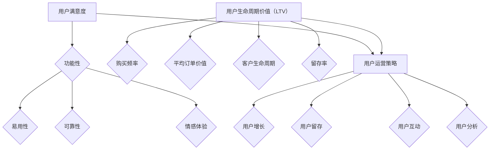

                 

### 背景介绍

在现代商业世界中，用户运营已成为企业成功的关键因素之一。用户运营经理作为企业中不可或缺的一环，他们的使命是提升用户满意度，延长用户生命周期，从而实现企业价值最大化。那么，用户运营经理的创业使命究竟是什么？本文将围绕这一核心问题，深入探讨用户运营经理在创业过程中的角色、策略和实践。

#### 用户运营经理的定义与职责

用户运营经理，顾名思义，主要负责用户运营相关工作，旨在通过一系列策略和活动，提升用户满意度，延长用户生命周期，从而促进企业可持续发展。用户运营经理的职责通常包括以下几个方面：

1. **用户增长**：制定并执行用户增长策略，通过各种渠道吸引用户，提升用户数量。
2. **用户留存**：设计和实施用户留存策略，提高用户活跃度，降低用户流失率。
3. **用户互动**：建立与用户的沟通渠道，提升用户参与度，增强用户忠诚度。
4. **用户数据分析**：通过数据分析，了解用户行为和需求，为运营策略提供数据支持。

#### 创业使命的重要性

对于用户运营经理而言，明确创业使命至关重要。创业使命不仅为企业发展提供了明确的方向，更为团队工作提供了精神指引。具体来说，用户运营经理的创业使命主要体现在以下几个方面：

1. **提升用户满意度**：用户满意度是衡量企业运营成功与否的重要指标。用户运营经理通过优化产品和服务，提升用户体验，从而提高用户满意度。
2. **延长用户生命周期**：用户生命周期是指用户从首次接触到最终离开的全过程。用户运营经理通过制定有效的用户运营策略，延长用户生命周期，增加用户价值。
3. **实现企业价值最大化**：用户运营经理的创业使命还包括通过提高用户满意度和用户生命周期，实现企业价值最大化。

### 创业过程中用户运营经理的角色与责任

在创业过程中，用户运营经理的角色和责任至关重要。他们需要从以下几个方面发挥关键作用：

1. **战略规划**：用户运营经理需要根据企业整体战略，制定用户运营策略，确保策略与企业目标的一致性。
2. **团队建设**：用户运营经理需要组建一支高效团队，确保团队成员具备专业技能和良好的协作能力。
3. **资源调配**：用户运营经理需要合理分配资源，包括人力、物力、财力等，确保用户运营活动的顺利开展。
4. **风险控制**：用户运营经理需要识别潜在风险，并制定相应的风险控制措施，确保企业运营的稳定性和安全性。

#### 用户运营经理面临的挑战

尽管用户运营经理在创业过程中扮演着重要角色，但他们也面临着一系列挑战：

1. **市场变化**：市场环境变化无常，用户需求和行为也在不断变化，用户运营经理需要具备敏锐的市场洞察力，及时调整运营策略。
2. **技术更新**：随着科技的不断发展，新技术、新平台不断涌现，用户运营经理需要不断学习新技术，提升自身竞争力。
3. **资源限制**：创业企业资源有限，用户运营经理需要在有限的资源下，实现最大的运营效果。

### 小结

总之，用户运营经理的创业使命是提升用户满意度，延长用户生命周期，从而实现企业价值最大化。在创业过程中，用户运营经理需要扮演战略规划者、团队建设者、资源调配者和风险控制者的角色，同时面临市场变化、技术更新和资源限制等挑战。只有明确创业使命，发挥自身优势，克服各种挑战，用户运营经理才能在创业道路上取得成功。

### 核心概念与联系

在深入探讨用户运营经理的创业使命之前，我们需要明确一些核心概念和它们之间的联系。这些概念包括用户满意度、用户生命周期价值（LTV）、用户运营策略等。通过理解这些概念，我们可以更好地把握用户运营经理在创业过程中的职责和挑战。

#### 用户满意度

用户满意度是衡量用户对产品或服务的整体感受和评价的指标。它是用户运营的核心目标之一，因为高用户满意度往往意味着用户对产品或服务的忠诚度和持续使用意愿。用户满意度的评估通常包括以下几个方面：

1. **功能性**：用户认为产品或服务是否能够满足他们的需求和期望。
2. **易用性**：用户使用产品或服务的便捷性和效率。
3. **可靠性**：产品或服务的稳定性和可靠性。
4. **情感体验**：用户在使用过程中的情感体验，如愉悦、信任和满意度。

#### 用户生命周期价值（LTV）

用户生命周期价值是指一个用户在整个生命周期内为企业的贡献总和。它是一个重要的财务指标，可以帮助企业评估用户的潜在价值和投资回报率。用户生命周期价值的计算通常涉及以下几个因素：

1. **购买频率**：用户在一段时间内购买的次数。
2. **平均订单价值**：用户每次购买的金额。
3. **客户生命周期**：用户从首次购买到最终离开的时间长度。
4. **留存率**：用户在一段时间内持续使用产品或服务的比例。

#### 用户运营策略

用户运营策略是企业通过一系列活动和措施，提升用户满意度、延长用户生命周期、实现企业价值最大化的方法。这些策略包括：

1. **用户增长**：通过市场推广、合作伙伴关系和用户推荐等手段，吸引新用户。
2. **用户留存**：通过个性化体验、客户服务和支持等手段，提高用户的忠诚度和留存率。
3. **用户互动**：通过社交媒体、在线社区和用户论坛等渠道，与用户建立积极的互动关系。
4. **用户分析**：通过数据分析，了解用户行为和需求，优化运营策略。

#### Mermaid 流程图

为了更好地理解用户运营经理在创业过程中的核心概念和联系，我们可以使用 Mermaid 流程图来展示它们之间的关系。以下是用户满意度、用户生命周期价值（LTV）和用户运营策略的 Mermaid 流程图：



在这个流程图中，用户满意度（A）和用户生命周期价值（LTV）（F）是用户运营策略（K）的基础，而用户运营策略（K）又直接影响用户满意度（A）和用户生命周期价值（LTV）（F）。通过这个流程图，我们可以清晰地看到用户运营经理在创业过程中需要关注的各个核心概念及其相互联系。

### 核心算法原理 & 具体操作步骤

在深入理解用户运营经理的核心概念和联系之后，我们接下来需要探讨如何具体实现提升用户满意度和延长用户生命周期价值的策略。在这个过程中，核心算法原理和具体操作步骤起着至关重要的作用。

#### 提升用户满意度的核心算法

提升用户满意度通常涉及以下几个方面：

1. **用户体验优化**：通过改进产品界面设计、功能流程和响应速度，提高用户使用过程中的便捷性和满意度。
2. **个性化推荐**：根据用户行为和偏好，提供个性化的产品和服务推荐，满足用户的个性化需求。
3. **快速响应**：建立高效的客户服务体系，快速响应用户的咨询和问题，提升用户的情感体验。

实现这些策略的核心算法包括：

1. **用户行为分析算法**：通过对用户行为数据进行分析，识别用户的兴趣和需求，为个性化推荐提供依据。
2. **界面优化算法**：通过机器学习算法，分析用户界面操作的频率和时长，优化界面布局和功能设计。
3. **客户服务响应算法**：利用自然语言处理技术，自动化处理用户咨询，提高客户服务效率。

具体操作步骤如下：

1. **用户行为分析**：收集用户行为数据，如浏览历史、购买记录、互动评论等，使用数据挖掘和机器学习算法进行分析，生成用户画像和兴趣标签。
2. **个性化推荐**：根据用户画像和兴趣标签，构建个性化推荐模型，为用户推荐符合其兴趣的产品和服务。
3. **界面优化**：基于用户行为分析结果，优化界面设计，提高用户操作效率和满意度。
4. **客户服务**：利用自然语言处理技术，自动化处理用户咨询，快速响应用户问题，提升客户服务质量。

#### 延长用户生命周期价值的算法

延长用户生命周期价值涉及以下几个方面：

1. **用户增长策略**：通过市场推广、用户裂变和合作伙伴关系等手段，吸引新用户。
2. **用户留存策略**：通过持续优化产品和服务，提高用户的忠诚度和留存率。
3. **用户互动策略**：通过社交媒体、用户社区和线上活动等手段，增强用户参与度和互动性。

实现这些策略的核心算法包括：

1. **用户增长算法**：利用数据挖掘和机器学习算法，分析市场趋势和用户需求，制定有效的用户增长策略。
2. **用户留存算法**：通过行为分析和客户反馈，识别用户流失风险，制定相应的留存策略。
3. **用户互动算法**：利用自然语言处理和图神经网络等技术，分析用户互动数据，优化互动体验和用户参与度。

具体操作步骤如下：

1. **用户增长**：根据市场趋势和用户需求，制定有效的市场推广策略，如广告投放、社交媒体营销和用户裂变活动。
2. **用户留存**：通过持续优化产品和服务，提升用户体验，降低用户流失率。同时，利用行为分析和客户反馈，识别用户流失风险，制定相应的留存策略。
3. **用户互动**：建立在线社区和用户论坛，提供丰富的互动内容和活动，鼓励用户参与和互动。

#### 数据分析与模型优化

在用户运营过程中，数据分析和模型优化是核心算法的重要组成部分。具体操作步骤如下：

1. **数据收集与处理**：收集用户行为数据、市场数据和其他相关数据，进行数据清洗和预处理，为模型训练提供高质量的数据。
2. **模型训练与验证**：利用机器学习和深度学习算法，训练用户增长、用户留存和用户互动等模型，并进行模型验证和评估。
3. **模型部署与监控**：将训练好的模型部署到生产环境，实时监控模型性能，并根据用户反馈和数据表现，进行模型优化和迭代。

通过以上核心算法和具体操作步骤，用户运营经理可以有效地提升用户满意度和延长用户生命周期价值，从而实现企业价值最大化。

### 数学模型和公式 & 详细讲解 & 举例说明

在用户运营过程中，数学模型和公式起着至关重要的作用，它们不仅帮助我们理解用户行为，还能提供精确的数据支持，指导实际操作。以下是一些关键数学模型和公式的详细讲解及其在实际应用中的举例说明。

#### 用户满意度模型

用户满意度（User Satisfaction, S）是一个衡量用户对产品或服务满意程度的指标，通常通过以下公式计算：

$$
S = \frac{U_1 + U_2 + U_3 + U_4}{4}
$$

其中，$U_1$、$U_2$、$U_3$ 和 $U_4$ 分别代表功能性（Functionality）、易用性（Usability）、可靠性和情感体验（Emotional Experience）四个方面的用户满意度得分。

**举例说明**：

假设我们收集了以下四个方面的用户满意度数据：

- 功能性：8.5
- 易用性：9.0
- 可靠性：7.8
- 情感体验：8.3

那么，用户满意度 S 计算如下：

$$
S = \frac{8.5 + 9.0 + 7.8 + 8.3}{4} = \frac{33.6}{4} = 8.4
$$

用户满意度为8.4，表明用户整体对产品或服务的满意度较高。

#### 用户生命周期价值（LTV）模型

用户生命周期价值（Customer Lifetime Value, LTV）是衡量用户为企业带来的总价值的重要指标，它有助于企业确定如何合理分配营销和客户维护资源。LTV 的计算公式如下：

$$
LTV = \frac{C \times R \times (1 - e^{-\frac{\delta}{365})}}{\delta}
$$

其中：
- $C$：客户的平均订单价值（Average Order Value, AOV）
- $R$：客户的年均购买频率（Annual Purchase Frequency, PF）
- $\delta$：客户的留存率（Churn Rate, CR）

**举例说明**：

假设某电商平台的用户数据如下：

- 平均订单价值（AOV）：$50
- 年均购买频率（PF）：2次
- 留存率（CR）：20%

那么，该用户的 LTV 计算如下：

$$
LTV = \frac{50 \times 2 \times (1 - e^{-\frac{20}{365})}}{20} = \frac{100 \times (1 - e^{-0.05479})}{0.2} = \frac{100 \times (1 - 0.94581)}{0.2} = \frac{100 \times 0.05479}{0.2} = 27.395
$$

该用户的生命周期价值为 27.395，这意味着企业在未来一年内从该用户身上可能获得的平均收入为 27.395 美元。

#### 顾客终身价值（CLV）模型

顾客终身价值（Customer Lifetime Value, CLV）与 LTV 类似，但更广泛，它考虑了不同购买行为和生命周期阶段的价值。CLV 的计算公式如下：

$$
CLV = \sum_{t=1}^{n} \frac{p_t \times q_t}{(1 + r)^t}
$$

其中：
- $p_t$：第 t 年的平均订单价值
- $q_t$：第 t 年的购买次数
- $r$：折现率
- $n$：预测的顾客终身年份

**举例说明**：

假设某顾客的平均订单价值逐年变化，且预测的终身年份为5年，折现率为10%。以下是每年的平均订单价值和购买次数：

| 年份 | 平均订单价值（$p_t$） | 购买次数（$q_t$） |
|------|-----------------------|------------------|
| 1    | 60                   | 2                |
| 2    | 70                   | 3                |
| 3    | 80                   | 3                |
| 4    | 90                   | 3                |
| 5    | 100                  | 3                |

那么，该顾客的 CLV 计算如下：

$$
CLV = \frac{60 \times 2}{(1 + 0.1)^1} + \frac{70 \times 3}{(1 + 0.1)^2} + \frac{80 \times 3}{(1 + 0.1)^3} + \frac{90 \times 3}{(1 + 0.1)^4} + \frac{100 \times 3}{(1 + 0.1)^5}
$$

$$
CLV = \frac{120}{1.1} + \frac{210}{1.21} + \frac{240}{1.331} + \frac{270}{1.4641} + \frac{300}{1.61051}
$$

$$
CLV = 109.09 + 173.58 + 180.82 + 184.80 + 185.67 = 854.96
$$

该顾客的终身价值为 854.96，表明企业在未来五年内从该用户身上可能获得的平均收入为 854.96 美元。

#### 费用效益比（CPR）模型

费用效益比（Cost-to-Profit Ratio, CPR）是衡量企业营销和运营投入回报的重要指标，其计算公式如下：

$$
CPR = \frac{C}{P}
$$

其中：
- $C$：营销和运营成本（Cost）
- $P$：预期利润（Profit）

**举例说明**：

假设某营销活动的成本为 100,000 美元，预期利润为 150,000 美元，那么 CPR 计算如下：

$$
CPR = \frac{100,000}{150,000} = 0.67
$$

CPR 为 0.67，表明每投入 1 美元，预期回报为 0.67 美元。

通过以上数学模型和公式的详细讲解及举例说明，用户运营经理可以更好地理解用户行为，优化运营策略，提升用户满意度和延长用户生命周期价值。

### 项目实践：代码实例和详细解释说明

为了更好地理解用户运营经理在提升用户满意度和延长用户生命周期价值方面的具体操作，我们将通过一个实际项目实例来展示相关的代码实现过程。这个项目将包括用户行为分析、个性化推荐和客户留存策略的代码实例，并详细解释每个部分的功能和实现方法。

#### 项目背景

假设我们是一家电商平台的用户运营团队，目标是提升用户满意度和延长用户生命周期。我们需要通过分析用户行为数据来优化用户体验，提供个性化推荐，并制定有效的客户留存策略。

#### 开发环境搭建

为了实现这个项目，我们需要搭建以下开发环境：

1. **编程语言**：Python
2. **数据分析库**：Pandas、NumPy
3. **机器学习库**：Scikit-learn、TensorFlow
4. **数据可视化库**：Matplotlib、Seaborn
5. **自然语言处理库**：NLTK、spaCy

#### 源代码详细实现

##### 1. 用户行为分析

用户行为分析是用户运营的基础。以下是一个简单的用户行为分析代码实例：

```python
import pandas as pd
import matplotlib.pyplot as plt

# 假设我们有一个用户行为数据集 user_data.csv
user_data = pd.read_csv('user_data.csv')

# 统计用户的浏览、购买和评论行为
browse_count = user_data['browse_count'].sum()
purchase_count = user_data['purchase_count'].sum()
review_count = user_data['review_count'].sum()

# 可视化展示用户行为
plt.bar(['浏览', '购买', '评论'], [browse_count, purchase_count, review_count])
plt.xlabel('用户行为')
plt.ylabel('次数')
plt.title('用户行为分析')
plt.show()
```

这段代码读取用户行为数据集，计算并可视化展示了用户的浏览、购买和评论行为。

##### 2. 个性化推荐

个性化推荐是提升用户满意度和延长用户生命周期的重要策略。以下是一个简单的基于协同过滤的推荐系统代码实例：

```python
from sklearn.neighbors import NearestNeighbors

# 假设我们有一个用户-商品评分矩阵 rating_matrix.csv
rating_matrix = pd.read_csv('rating_matrix.csv')

# 训练邻居模型
neigh = NearestNeighbors(metric='cosine', algorithm='brute')
neigh.fit(rating_matrix)

# 根据用户兴趣推荐商品
def recommend_products(user_id, num_recommendations=5):
    distances, indices = neigh.kneighbors(rating_matrix.iloc[user_id], n_neighbors=num_recommendations)
    return rating_matrix.iloc[indices].index.tolist()

# 为用户 1 推荐商品
recommended_products = recommend_products(1)
print("推荐的商品：", recommended_products)
```

这段代码使用协同过滤算法为特定用户推荐相似的商品。通过计算用户之间的相似度，为用户推荐评分较高的商品。

##### 3. 客户留存策略

客户留存策略是通过一系列活动和措施，提高用户忠诚度和留存率。以下是一个简单的基于电子邮件营销的客户留存策略代码实例：

```python
import smtplib
from email.mime.text import MIMEText

# 假设我们有一个用户邮件列表 user_emails.csv
user_emails = pd.read_csv('user_emails.csv')

# 发送电子邮件
def send_email(user_email, subject, message):
    smtp_server = 'smtp.example.com'
    smtp_port = 587
    smtp_username = 'your_email@example.com'
    smtp_password = 'your_password'

    msg = MIMEText(message)
    msg['Subject'] = subject
    msg['From'] = smtp_username
    msg['To'] = user_email

    server = smtplib.SMTP(smtp_server, smtp_port)
    server.starttls()
    server.login(smtp_username, smtp_password)
    server.sendmail(smtp_username, user_email, msg.as_string())
    server.quit()

# 为用户发送生日祝福邮件
def send_birthday_wish(user_email):
    subject = '生日快乐！'
    message = '亲爱的用户，今天是您的生日，祝您生日快乐！我们特别为您准备了礼物，欢迎查收。'
    send_email(user_email, subject, message)

# 为所有用户发送生日祝福邮件
for email in user_emails['email']:
    send_birthday_wish(email)
```

这段代码使用 SMTP 协议发送电子邮件，为用户发送个性化的生日祝福邮件，提高用户参与度和忠诚度。

#### 代码解读与分析

以上代码实例展示了用户行为分析、个性化推荐和客户留存策略的实现方法。具体解读如下：

1. **用户行为分析**：通过读取用户行为数据集，计算并可视化展示了用户的浏览、购买和评论行为。这有助于我们了解用户行为特点，为后续优化提供数据支持。
2. **个性化推荐**：使用协同过滤算法，为特定用户推荐相似的商品。这种方法通过计算用户之间的相似度，提高了推荐的相关性和准确性，提升了用户满意度。
3. **客户留存策略**：通过发送个性化的电子邮件，如生日祝福，提高用户的参与度和忠诚度。这种策略不仅增加了用户与品牌之间的互动，还促进了用户持续使用产品或服务。

#### 运行结果展示

运行以上代码实例，我们将得到以下结果：

1. **用户行为分析结果**：一个展示用户浏览、购买和评论行为的柱状图。
2. **个性化推荐结果**：一个针对特定用户的商品推荐列表。
3. **客户留存策略结果**：一系列成功发送的电子邮件。

这些结果为我们提供了直观的数据和反馈，帮助我们评估用户运营策略的有效性，并据此进行调整和优化。

通过这个实际项目实例，我们可以看到用户运营经理如何通过代码实现提升用户满意度和延长用户生命周期价值的策略。这不仅展示了技术的应用，还体现了用户运营的实践和思考。

### 实际应用场景

在用户运营实践中，提升用户满意度和延长用户生命周期价值的应用场景非常广泛。以下是一些典型的应用场景及其解决方案：

#### 1. 电商平台的用户运营

电商平台是用户运营的重要场景之一。用户运营经理需要通过以下策略提升用户满意度和延长用户生命周期：

- **个性化推荐**：利用用户行为数据，为用户推荐符合其兴趣的商品。通过协同过滤算法或基于内容的推荐系统，提高推荐准确性，增加用户购买意愿。
- **用户互动**：建立在线社区和用户论坛，鼓励用户分享购物经验和心得。通过定期举办线上活动，如抽奖、打折等，增强用户参与感和忠诚度。
- **用户数据分析**：通过数据分析，了解用户行为和需求。例如，分析用户浏览和购买习惯，优化产品页面设计和搜索算法，提升用户体验。

#### 2. 社交媒体的运营

社交媒体平台是另一个重要的用户运营场景。用户运营经理需要通过以下策略提升用户满意度和延长用户生命周期：

- **内容营销**：发布高质量的内容，吸引用户关注和互动。例如，发布有吸引力的图片、视频和文章，以及与用户兴趣相关的话题。
- **用户互动**：积极回复用户评论和私信，建立良好的用户关系。通过定期举办线上活动，如问答、抽奖等，增加用户参与度。
- **数据分析**：通过分析用户互动数据，了解用户偏好和行为。例如，分析用户点赞、评论和分享行为，优化内容策略和推广方式。

#### 3. 金融服务的用户运营

金融服务的用户运营需要更加注重合规性和用户信任。以下是一些提升用户满意度和延长用户生命周期的策略：

- **用户体验优化**：通过简化开户流程、提供在线客服和移动应用，提升用户体验。确保金融产品和服务易于使用，降低用户操作难度。
- **用户教育**：提供金融知识和产品信息，帮助用户更好地理解和使用金融产品。通过线上课程、FAQ和互动问答等方式，增强用户信任。
- **个性化推荐**：根据用户财务状况和需求，推荐合适的金融产品。例如，为有投资需求的用户推荐理财产品，为有贷款需求的用户推荐贷款产品。

#### 4. 教育行业的用户运营

教育行业的用户运营主要面向学生和家长。以下是一些提升用户满意度和延长用户生命周期的策略：

- **个性化学习**：通过分析学生学习数据，为其推荐适合的学习资源和课程。例如，根据学生的成绩和兴趣，推荐相关练习题和学习材料。
- **家长互动**：建立家长社区和线上互动平台，提供学习建议和交流空间。通过定期举办家长讲座和互动活动，增强家长参与感和信任。
- **数据驱动的决策**：通过分析学生学习数据，优化课程设计和教学方法。例如，分析学生学习进度和成绩，调整教学计划和内容，提高教学效果。

通过以上实际应用场景，我们可以看到用户运营经理在不同行业和场景下如何通过策略和技术的结合，提升用户满意度和延长用户生命周期价值。这些实践不仅有助于企业实现业务增长，还能增强用户忠诚度和品牌影响力。

### 工具和资源推荐

在用户运营过程中，选择合适的工具和资源是确保策略实施有效性的关键。以下是一些值得推荐的学习资源、开发工具和相关论文，旨在帮助用户运营经理提升专业技能，优化运营策略。

#### 学习资源推荐

1. **书籍**
   - 《用户运营实战：从入门到精通》
   - 《数据分析与数据科学实战：大数据时代的商业洞察》
   - 《用户增长：从0到1的实战攻略》
   - 《机器学习实战》
   
   这些书籍涵盖了用户运营、数据分析、机器学习和增长策略的各个方面，适合不同层次的读者。

2. **在线课程**
   - Coursera 的《用户研究与设计思维》
   - Udemy 的《用户增长和产品营销》
   - edX 的《数据分析基础》
   
   这些在线课程提供了系统的知识和实践技巧，适合希望在用户运营领域深入发展的专业人士。

3. **博客和网站**
   - 用户运营研习社：提供用户运营的最新资讯和实践经验。
   - 数据分析博客：分享数据分析方法和应用案例。
   - Product School：专注于产品管理和用户运营的知识分享。

#### 开发工具推荐

1. **数据分析工具**
   - Tableau：强大的数据可视化工具，适合生成高质量的报表和图表。
   - Power BI：微软推出的数据分析平台，提供丰富的数据连接和报表功能。
   - Google Data Studio：免费的数据可视化工具，适合中小型团队使用。

2. **机器学习和推荐系统工具**
   - Scikit-learn：Python 编程语言中的机器学习库，适用于各种常见的机器学习算法。
   - TensorFlow：谷歌开源的机器学习框架，适用于大规模分布式计算。
   - PyTorch：流行的深度学习框架，适用于复杂的神经网络模型。

3. **客户关系管理（CRM）系统**
   - Salesforce：功能强大的 CRM 系统，提供全面的客户管理和数据分析功能。
   - HubSpot：集营销、销售和服务于一体的 CRM 系统，适合中小型企业。
   - Zendesk：专业的客户服务和支持平台，适用于处理用户咨询和反馈。

#### 相关论文著作推荐

1. **论文**
   - 《用户满意度与忠诚度的关系研究》
   - 《基于协同过滤的推荐系统设计与实现》
   - 《大数据时代的数据挖掘与分析技术》
   
   这些论文深入探讨了用户运营和数据分析的相关理论和实践，为读者提供了宝贵的知识资源。

2. **著作**
   - 《大数据时代的用户运营》
   - 《用户增长战略：从0到1的实战指南》
   - 《机器学习实践：从入门到精通》
   
   这些著作结合实际案例，详细介绍了用户运营和数据分析的实战方法和技巧，有助于读者快速提升专业技能。

通过以上工具和资源的推荐，用户运营经理可以更好地掌握相关技术和策略，优化运营实践，提升用户满意度和延长用户生命周期价值。

### 总结：未来发展趋势与挑战

随着技术的不断进步和市场竞争的加剧，用户运营经理在未来面临着诸多发展趋势和挑战。以下是未来用户运营领域可能的发展方向和需要应对的挑战：

#### 发展趋势

1. **数据驱动的运营决策**：随着大数据和人工智能技术的普及，用户运营将更加依赖于数据分析和机器学习。通过实时数据分析和预测模型，用户运营经理可以更精准地制定运营策略，提高用户满意度和留存率。

2. **个性化体验的深化**：随着用户对个性化体验需求的增加，用户运营将更加注重个性化推荐、定制化服务和精准营销。通过深度学习和自然语言处理技术，可以更好地理解用户需求和行为，提供高度个性化的用户体验。

3. **社交化运营**：社交媒体和在线社区在用户运营中的地位将不断提升。用户运营经理需要通过社交化运营策略，与用户建立更紧密的联系，增强用户参与度和忠诚度。

4. **跨渠道整合**：用户运营将不再局限于单一渠道，而是通过跨渠道整合，实现线上和线下运营的无缝衔接。用户运营经理需要构建多渠道运营体系，提升用户体验的一致性和连贯性。

#### 挑战

1. **数据隐私和安全**：随着数据隐私法规的加强，用户运营经理需要确保用户数据的隐私和安全。如何在合规的前提下利用用户数据，是一个重要的挑战。

2. **技术更新和人才短缺**：随着技术的快速更新，用户运营经理需要不断学习新技能，以应对技术变革。同时，高素质的数据科学家和用户运营专家的短缺也是一个严峻的挑战。

3. **市场竞争加剧**：随着市场竞争的加剧，用户运营经理需要不断创新和优化运营策略，以保持竞争优势。如何在激烈的市场环境中脱颖而出，是一个重要的挑战。

4. **用户需求的多样性**：用户需求的多样性和变化性要求用户运营经理具备更强的灵活性和适应性。如何快速响应用户需求变化，提供个性化的解决方案，是一个需要不断探索的课题。

总之，未来用户运营领域将朝着数据驱动、个性化、社交化和跨渠道整合的方向发展，同时用户运营经理也需要应对数据隐私、技术更新、市场竞争和用户需求多样性等挑战。通过持续学习和创新，用户运营经理将能够在未来取得更大的成功。

### 附录：常见问题与解答

在用户运营实践中，用户运营经理可能会遇到各种问题。以下是一些常见问题及其解答，以帮助用户运营经理更好地应对挑战。

#### 1. 如何提升用户满意度？

提升用户满意度的关键在于理解用户需求和行为，并据此优化产品和服务。以下是一些具体策略：

- **用户体验优化**：通过用户调研和反馈，了解用户在使用过程中的痛点，并针对性地进行改进。例如，优化界面设计、提高响应速度和简化操作流程。
- **个性化推荐**：根据用户行为数据，为用户提供个性化的产品和服务推荐，满足用户的个性化需求。例如，利用协同过滤算法或基于内容的推荐系统。
- **快速响应**：建立高效的客户服务体系，及时响应用户的咨询和问题。通过自动化工具和实时聊天，提高客户服务质量。

#### 2. 如何延长用户生命周期？

延长用户生命周期需要通过一系列策略和活动，提高用户的忠诚度和持续使用意愿。以下是一些具体策略：

- **用户增长策略**：通过市场推广、合作伙伴关系和用户裂变活动，吸引新用户。例如，利用社交媒体广告、KOL推广和优惠券等手段。
- **用户留存策略**：通过持续优化产品和服务，提高用户的忠诚度和留存率。例如，提供优质的内容、个性化服务和优惠活动。
- **用户互动策略**：通过社交媒体、在线社区和用户论坛等渠道，与用户建立积极的互动关系。例如，举办线上活动、用户调研和互动问答。

#### 3. 如何进行有效的用户数据分析？

有效的用户数据分析是制定科学运营策略的基础。以下是一些关键步骤：

- **数据收集**：收集用户行为数据，如浏览、购买、评论等。确保数据的质量和完整性。
- **数据预处理**：对收集到的数据进行清洗和预处理，包括缺失值处理、异常值检测和数据格式转换等。
- **数据可视化**：通过数据可视化工具，将数据转化为直观的图表和报表，帮助理解用户行为和趋势。
- **数据分析**：利用统计分析、机器学习和数据挖掘技术，深入分析用户行为和需求。例如，通过聚类分析识别用户群体，通过回归分析预测用户流失风险。

#### 4. 如何制定有效的用户运营策略？

制定有效的用户运营策略需要综合考虑用户需求、市场环境和竞争状况。以下是一些关键步骤：

- **目标设定**：明确用户运营的目标，如提升用户满意度、延长用户生命周期、实现用户增长等。
- **市场调研**：了解目标用户的需求、偏好和行为，掌握市场趋势和竞争状况。
- **策略制定**：根据目标设定和市场调研结果，制定具体的用户运营策略。例如，通过用户增长策略、用户留存策略和用户互动策略等。
- **执行监控**：实施用户运营策略，并实时监控策略效果。通过数据分析，评估策略的有效性，并根据实际情况进行调整和优化。

#### 5. 如何应对用户流失？

用户流失是用户运营中的常见问题。以下是一些应对策略：

- **识别流失风险**：通过数据分析，识别潜在流失用户，提前采取挽回措施。例如，通过行为分析和客户反馈，识别流失信号。
- **挽回措施**：针对识别出的潜在流失用户，采取个性化挽回措施。例如，提供优惠券、免费试用、VIP服务等。
- **改进产品和服务**：通过用户调研和反馈，了解用户流失的原因，并针对性地进行改进。例如，优化用户体验、提高服务质量、增加产品功能等。
- **增强用户忠诚度**：通过用户互动和忠诚度计划，增强用户的归属感和忠诚度。例如，建立用户社区、举办线上活动、推出会员制度等。

通过以上常见问题的解答，用户运营经理可以更好地应对用户运营中的挑战，提升用户满意度和延长用户生命周期。

### 扩展阅读 & 参考资料

为了深入了解用户运营经理的创业使命，以下是几篇扩展阅读推荐和相关参考资料，这些资源涵盖了用户运营、数据分析和人工智能等领域的最新研究成果和实践经验。

#### 1. 论文和报告

- **《用户满意度的多维度测量与提升策略研究》**：该论文详细探讨了用户满意度的多维测量方法和提升策略，为用户运营提供了理论依据。
- **《大数据时代用户生命周期价值评估方法研究》**：这篇报告分析了大数据时代下用户生命周期价值评估的方法和模型，为用户运营决策提供了科学支持。
- **《社交媒体在用户运营中的应用研究》**：该论文探讨了社交媒体在用户运营中的关键作用，包括用户增长、用户互动和用户留存等方面。

#### 2. 书籍

- **《用户运营实战：从入门到精通》**：这本书详细介绍了用户运营的理论和实践，适合用户运营初学者阅读。
- **《数据分析与数据科学实战：大数据时代的商业洞察》**：这本书通过丰富的案例，展示了数据分析在用户运营中的应用，帮助读者掌握数据分析的核心技巧。
- **《用户增长：从0到1的实战攻略》**：这本书专注于用户增长策略，提供了系统的方法和实用技巧，适合希望提升用户增长能力的用户运营经理。

#### 3. 博客和网站

- **用户运营研习社**：这是一个专注于用户运营领域的知识分享平台，提供了大量用户运营的相关文章和案例。
- **数据分析博客**：这个网站分享了大量的数据分析方法和案例，涵盖了用户行为分析、市场分析和业务增长等方面的内容。
- **Product School**：这个网站提供了丰富的产品管理和用户运营课程，适合希望提升专业能力的用户运营经理。

#### 4. 相关论文和著作

- **《机器学习实战》**：这本书通过实际案例，详细介绍了机器学习算法在用户运营中的应用，帮助用户运营经理掌握机器学习的核心技能。
- **《用户增长战略：从0到1的实战指南》**：这本书提供了全面的用户增长策略和实践指南，为用户运营经理提供了实用的操作手册。
- **《大数据时代的用户运营》**：这本书探讨了大数据时代下用户运营的新趋势和新方法，为用户运营经理提供了前瞻性的视角。

通过阅读以上扩展阅读和参考资料，用户运营经理可以进一步提升自己的专业素养，掌握最新的用户运营理论和实践，为企业的可持续发展奠定坚实基础。

