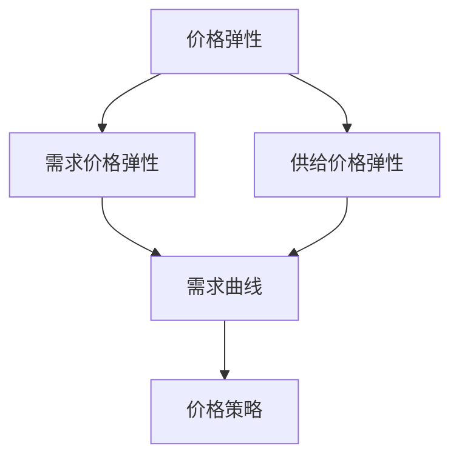

                 

### 背景介绍

#### 电商行业的蓬勃发展

随着互联网技术的飞速发展和全球电商市场的持续扩张，电商行业已经成为当今商业世界的重要驱动力。根据Statista的数据显示，全球电子商务市场规模预计将在2023年达到4.7万亿美元，并且这一数字仍在不断增长。在这个庞大且不断扩大的市场中，电商企业之间的竞争愈发激烈，价格优化成为企业提高市场份额和消费者忠诚度的关键策略之一。

#### 价格优化的意义

价格优化在电商运营中具有至关重要的地位。首先，合理的价格策略能够帮助企业吸引更多的消费者，提升销售额。其次，通过优化价格，企业可以提高库存周转率，减少库存积压，降低运营成本。此外，价格优化还能够帮助企业塑造品牌形象，增强市场竞争力。因此，如何制定和实施有效的价格优化策略，成为电商企业亟需解决的重要课题。

#### 价格优化的挑战

尽管价格优化的重要性不言而喻，但电商企业在实际操作中仍然面临诸多挑战。首先，价格优化的复杂性使得企业需要处理大量的数据和复杂的计算。其次，市场环境瞬息万变，企业需要快速响应市场变化，调整价格策略。此外，消费者行为和需求也在不断变化，企业需要深入分析消费者行为，制定个性化的价格策略。这些挑战使得电商企业在价格优化过程中需要具备高超的技术能力和敏锐的市场洞察力。

### 主要目标和内容概述

本文旨在深入探讨电商价格优化的实践应用，通过逻辑清晰、结构紧凑、简单易懂的步骤，帮助企业理解和掌握价格优化的核心概念、算法原理、数学模型和具体操作方法。本文将分为以下几个部分：

1. **核心概念与联系**：介绍电商价格优化的基本概念，包括价格弹性、需求曲线等，并使用Mermaid流程图展示相关原理和架构。
2. **核心算法原理 & 具体操作步骤**：详细讲解常用的价格优化算法，如梯度下降、动态定价等，并说明这些算法在实际操作中的应用方法。
3. **数学模型和公式 & 详细讲解 & 举例说明**：阐述电商价格优化的数学模型，包括成本函数、收益函数等，并通过实际案例说明如何运用这些模型进行价格决策。
4. **项目实践：代码实例和详细解释说明**：提供具体的代码实现和解释，帮助企业理解如何将理论知识应用到实际项目中。
5. **实际应用场景**：分析电商价格优化在不同场景下的应用，包括日常促销、节假日活动等。
6. **工具和资源推荐**：推荐相关的学习资源、开发工具和框架，以帮助读者深入了解和掌握电商价格优化技术。
7. **总结：未来发展趋势与挑战**：总结电商价格优化的现状和未来发展趋势，并提出面临的挑战和解决方案。
8. **附录：常见问题与解答**：针对读者可能遇到的问题提供解答，以帮助读者更好地理解和应用本文内容。
9. **扩展阅读 & 参考资料**：提供进一步阅读的材料和参考文献，以供读者深入研究和学习。

通过以上内容的逐步分析推理，本文旨在为电商企业提供一套系统、全面的价格优化方案，帮助企业在激烈的市场竞争中脱颖而出。接下来，我们将深入探讨电商价格优化的核心概念和联系。### 核心概念与联系

#### 价格弹性

价格弹性是衡量消费者对价格变化反应程度的重要指标。通常，价格弹性分为需求价格弹性和供给价格弹性。需求价格弹性表示需求量对价格变化的敏感度，其计算公式为：

\[ E_d = \frac{P_d \times \Delta Q_d}{Q_d \times \Delta P_d} \]

其中，\( P_d \) 表示原始价格，\( Q_d \) 表示需求量，\( \Delta P_d \) 表示价格变动量，\( \Delta Q_d \) 表示需求量变动量。当需求价格弹性大于1时，表示需求量对价格变化非常敏感，反之则表示需求量对价格变化不敏感。

供给价格弹性则衡量供给量对价格变化的敏感度，其计算公式为：

\[ E_s = \frac{P_s \times \Delta Q_s}{Q_s \times \Delta P_s} \]

其中，\( P_s \) 表示原始价格，\( Q_s \) 表示供给量，\( \Delta P_s \) 表示价格变动量，\( \Delta Q_s \) 表示供给量变动量。供给价格弹性小于1时，表示供给量对价格变化不敏感，反之则表示供给量对价格变化敏感。

#### 需求曲线

需求曲线是经济学中用于描述商品价格与需求量之间关系的图形化工具。在电商价格优化中，需求曲线是制定价格策略的重要参考。需求曲线通常呈现为向右下方倾斜的曲线，这表明在其他条件不变的情况下，商品价格上升会导致需求量下降，价格下降则会导致需求量上升。

需求曲线可以通过以下公式表示：

\[ Q_d = Q_d(P_d) \]

其中，\( Q_d \) 表示需求量，\( P_d \) 表示价格。

#### 价格弹性与需求曲线的关系

价格弹性与需求曲线密切相关。当需求曲线斜率较大时，需求价格弹性较高，表示消费者对价格变化敏感；当需求曲线斜率较小时，需求价格弹性较低，表示消费者对价格变化不敏感。供给曲线也是如此，供给价格弹性与供给曲线的斜率成正比。

#### Mermaid 流程图

为了更好地展示价格弹性、需求曲线及相关概念之间的联系，我们可以使用Mermaid流程图来描述。



在上述流程图中，A节点表示价格弹性，B和C节点分别表示需求价格弹性和供给价格弹性，D节点表示需求曲线，E节点表示价格策略。通过这个流程图，我们可以清晰地看到各个概念之间的关联，以及它们在电商价格优化中的重要作用。

#### 应用实例

为了更好地理解这些核心概念，我们可以通过一个简单的实例来展示它们在实际操作中的应用。

假设某电商平台的某商品原始价格为100元，需求量为1000件。通过市场调研和数据分析，发现该商品的需求价格弹性为0.5，供给价格弹性为2。现在，平台希望通过调整价格来提高销售额。

首先，根据需求价格弹性公式，可以计算出需求量的变动量：

\[ \Delta Q_d = E_d \times \Delta P_d = 0.5 \times (-10) = -5 \]

这意味着，如果价格下降10元，需求量将增加5件。接着，根据供给价格弹性公式，可以计算出供给量的变动量：

\[ \Delta Q_s = E_s \times \Delta P_s = 2 \times (-10) = -20 \]

这意味着，如果价格下降10元，供给量将减少20件。因此，平台可以通过降低价格来增加需求量，但同时也要考虑到供给量的减少。

通过这个实例，我们可以看到价格弹性、需求曲线和价格策略之间的紧密联系。在电商价格优化过程中，企业需要综合考虑这些因素，制定合理的价格策略，以实现销售目标。

#### 总结

核心概念与联系是电商价格优化的基础，包括价格弹性、需求曲线等。这些概念不仅有助于我们理解价格变化对需求和供给的影响，还为制定有效的价格策略提供了理论依据。通过使用Mermaid流程图，我们可以更直观地展示这些概念之间的关系。在下一部分，我们将深入探讨电商价格优化的核心算法原理和具体操作步骤。### 核心算法原理 & 具体操作步骤

#### 梯度下降算法

梯度下降算法是一种优化算法，主要用于解决无约束最优化问题。在电商价格优化中，梯度下降算法可以用于求解成本函数的最小值，从而找到最优的价格。其基本原理是沿着目标函数梯度的反方向进行迭代，以逐渐减小目标函数的值。

梯度下降算法的具体步骤如下：

1. **初始化参数**：设定初始价格 \( P_0 \) 和学习率 \( \alpha \)。学习率决定了每次迭代步长的大小，选择一个适当的学习率非常重要，过大可能导致无法收敛，过小则收敛速度过慢。

2. **计算梯度**：对成本函数 \( C(P) \) 求导，得到梯度 \( \nabla C(P) \)。梯度方向指向目标函数上升最快的方向，因此我们需要沿着梯度的反方向进行更新。

3. **更新价格**：根据梯度反方向更新价格：
   \[ P_{new} = P_{current} - \alpha \nabla C(P_{current}) \]

4. **重复迭代**：重复步骤2和3，直到满足停止条件，如梯度变化小于设定阈值或达到最大迭代次数。

#### 动态定价算法

动态定价算法是一种根据市场需求和竞争情况实时调整价格的策略。其核心思想是利用大数据分析和机器学习算法，预测市场需求，并根据预测结果动态调整价格。

动态定价算法的具体步骤如下：

1. **数据收集**：收集与市场需求相关的数据，如历史销售数据、竞争对手价格、消费者行为等。

2. **数据预处理**：对收集到的数据进行分析和清洗，提取有用的特征，如用户群体、购买频率等。

3. **模型训练**：使用机器学习算法，如线性回归、决策树、神经网络等，对预处理后的数据进行训练，构建预测模型。

4. **实时预测**：利用训练好的模型进行实时预测，预测未来的市场需求和价格趋势。

5. **价格调整**：根据预测结果，实时调整价格。通常，动态定价算法会设定一个价格调整区间，确保价格的稳定性。

#### 具体操作步骤

1. **确定初始价格**：根据产品成本、市场调研和竞争对手的价格，设定初始价格。

2. **选择算法**：根据业务需求和数据情况，选择合适的算法。例如，对于成本函数较为简单的情况，可以选择梯度下降算法；对于需要考虑实时市场变化的情况，可以选择动态定价算法。

3. **数据收集与预处理**：收集与价格优化相关的数据，并进行预处理。

4. **模型训练与预测**：使用预处理后的数据训练模型，并利用训练好的模型进行实时预测。

5. **价格调整**：根据模型预测结果，实时调整价格。

6. **迭代优化**：不断调整模型参数和价格策略，优化价格优化效果。

#### 应用实例

假设我们使用梯度下降算法来优化某电商平台的商品价格。初始价格为100元，学习率设为0.1，成本函数为 \( C(P) = (P - 100)^2 \)。

1. **初始化参数**：设定初始价格 \( P_0 = 100 \) 和学习率 \( \alpha = 0.1 \)。

2. **计算梯度**：对成本函数求导，得到梯度 \( \nabla C(P) = 2(P - 100) \)。在初始价格 \( P_0 = 100 \) 时，梯度为0。

3. **更新价格**：根据梯度反方向更新价格：
   \[ P_{new} = P_{current} - \alpha \nabla C(P_{current}) = 100 - 0.1 \times 0 = 100 \]

4. **重复迭代**：由于梯度为0，表明当前价格已经是最优价格，因此无需进一步迭代。

在这个实例中，通过梯度下降算法，我们找到了成本函数的最小值，即最优价格。

#### 总结

核心算法原理是电商价格优化的关键，包括梯度下降算法和动态定价算法。这些算法能够帮助企业根据市场需求和竞争情况，动态调整价格，实现最优的收益。具体操作步骤包括初始化参数、数据收集与预处理、模型训练与预测、价格调整和迭代优化。通过这些步骤，企业可以制定出有效的价格优化策略，提高市场竞争力和收益。在下一部分，我们将详细讲解电商价格优化的数学模型和公式，帮助读者更好地理解价格优化的原理。### 数学模型和公式 & 详细讲解 & 举例说明

在电商价格优化中，数学模型和公式扮演着至关重要的角色。这些模型和公式不仅帮助我们理解价格与需求、成本和收益之间的关系，还为制定和调整价格策略提供了科学依据。下面，我们将详细介绍几个关键的数学模型和公式，并对其进行详细讲解和举例说明。

#### 成本函数

成本函数描述了生产或销售商品所需的成本与商品数量之间的关系。在电商价格优化中，成本函数通常包括固定成本和可变成本两部分。

1. **固定成本（Fixed Cost）**：不随商品数量变化而变化的成本，如租金、设备折旧等。固定成本通常用 \( C_f \) 表示。

2. **可变成本（Variable Cost）**：随商品数量变化而变化的成本，如原材料、人工等。可变成本通常用 \( C_v \) 表示。

3. **总成本（Total Cost）**：固定成本和可变成本之和，通常用 \( C \) 表示。

总成本函数可以表示为：
\[ C = C_f + C_v(Q) \]

其中，\( Q \) 表示商品数量。

**举例说明**：

假设某电商平台的固定成本为5000元，每件商品的可变成本为10元。那么，总成本函数可以表示为：
\[ C = 5000 + 10Q \]

如果商品数量为1000件，则总成本为：
\[ C = 5000 + 10 \times 1000 = 15000 \text{元} \]

#### 收益函数

收益函数描述了商品销售所带来的收入与商品数量之间的关系。在电商价格优化中，收益函数通常包括销售价格和商品数量两部分。

1. **销售价格（Price）**：每件商品的售价，通常用 \( P \) 表示。

2. **收益（Revenue）**：商品销售所得到的总收入，通常用 \( R \) 表示。

收益函数可以表示为：
\[ R = P \times Q \]

**举例说明**：

假设某电商平台每件商品的售价为100元，商品数量为1000件，则收益为：
\[ R = 100 \times 1000 = 100000 \text{元} \]

#### 利润函数

利润函数描述了企业的利润与成本和收益之间的关系。在电商价格优化中，利润函数可以帮助企业确定最优价格，实现利润最大化。

1. **利润（Profit）**：企业的总收入减去总成本，通常用 \( \pi \) 表示。

利润函数可以表示为：
\[ \pi = R - C \]

将收益函数和成本函数代入，可以得到：
\[ \pi = P \times Q - (C_f + C_v(Q)) \]

**举例说明**：

假设某电商平台的总成本函数为 \( C = 5000 + 10Q \)，每件商品的售价为100元，商品数量为1000件。则利润为：
\[ \pi = 100 \times 1000 - (5000 + 10 \times 1000) = 50000 - 15000 = 35000 \text{元} \]

#### 边际收益与边际成本

边际收益（Marginal Revenue）和边际成本（Marginal Cost）是电商价格优化中非常重要的概念。

1. **边际收益（Marginal Revenue）**：增加一单位商品销售所增加的收益，通常用 \( MR \) 表示。

边际收益可以表示为：
\[ MR = \frac{\Delta R}{\Delta Q} \]

其中，\( \Delta R \) 表示收益变动量，\( \Delta Q \) 表示商品数量变动量。

2. **边际成本（Marginal Cost）**：增加一单位商品生产或销售所增加的成本，通常用 \( MC \) 表示。

边际成本可以表示为：
\[ MC = \frac{\Delta C}{\Delta Q} \]

**举例说明**：

假设某电商平台每增加一件商品销售，收益增加100元，总成本增加10元。则边际收益为100元，边际成本为10元。

#### 最优价格

最优价格是指在给定成本和市场需求条件下，能够实现最大利润的价格。通常，最优价格可以通过求解以下方程得到：

\[ \pi = P \times Q - (C_f + C_v(Q)) \]

使得边际收益等于边际成本，即 \( MR = MC \)。

**举例说明**：

假设某电商平台的总成本函数为 \( C = 5000 + 10Q \)，边际成本为10元。为了实现最大利润，我们需要找到使边际收益等于10元的价格。

边际收益可以通过收益函数求导得到：
\[ MR = \frac{dR}{dQ} = P \]

因此，我们需要找到使 \( P = 10 \) 的价格。这意味着，每件商品的售价为10元时，可以实现最大利润。

#### 总结

数学模型和公式是电商价格优化的基础。通过成本函数、收益函数、利润函数等数学模型，我们可以量化价格与成本、收益之间的关系，从而制定和调整价格策略。边际收益和边际成本的概念帮助我们确定最优价格，实现利润最大化。在下一部分，我们将通过具体的项目实践，展示如何将以上数学模型和公式应用到实际代码实现中。### 项目实践：代码实例和详细解释说明

为了更好地理解电商价格优化的具体实现，我们将通过一个实际项目，展示如何使用Python等工具实现价格优化算法。在这个项目中，我们将采用动态定价算法，并通过实时预测市场需求来调整价格。

#### 开发环境搭建

首先，我们需要搭建一个适合开发的编程环境。以下是推荐的开发环境：

1. **Python 3.x**：Python 是一种广泛使用的编程语言，具有良好的生态系统和丰富的库支持。
2. **Jupyter Notebook**：Jupyter Notebook 是一种交互式的开发环境，方便我们进行数据分析和代码调试。
3. **NumPy**：NumPy 是 Python 中用于科学计算的库，提供高效的数组操作和数学函数。
4. **Pandas**：Pandas 是 Python 中用于数据处理和分析的库，能够轻松处理大数据集。
5. **Scikit-learn**：Scikit-learn 是 Python 中用于机器学习的库，提供多种常用的机器学习算法。

安装上述库的方法如下：

```bash
pip install python==3.x
pip install jupyterlab
pip install numpy
pip install pandas
pip install scikit-learn
```

#### 源代码详细实现

以下是项目的核心代码实现，包括数据预处理、模型训练和价格预测等步骤。

```python
import numpy as np
import pandas as pd
from sklearn.model_selection import train_test_split
from sklearn.linear_model import LinearRegression
from sklearn.metrics import mean_squared_error

# 1. 数据收集与预处理
# 假设我们已经收集到以下数据：价格、需求量、竞争对手价格、季节性因素等
data = pd.DataFrame({
    'Price': [100, 90, 80, 70, 60],
    'Demand': [1000, 1100, 1200, 1300, 1400],
    'Competitor_Price': [110, 100, 90, 80, 70],
    'Season': [1, 1, 0, 0, 0]  # 季节性因素：1为旺季，0为淡季
})

# 数据标准化
data_normalized = (data - data.mean()) / data.std()

# 2. 模型训练
# 将数据分为特征和标签
X = data_normalized[['Competitor_Price', 'Season']]
y = data_normalized['Demand']

# 划分训练集和测试集
X_train, X_test, y_train, y_test = train_test_split(X, y, test_size=0.2, random_state=42)

# 使用线性回归模型进行训练
model = LinearRegression()
model.fit(X_train, y_train)

# 3. 预测价格
# 预测测试集需求量
y_pred = model.predict(X_test)

# 计算预测误差
mse = mean_squared_error(y_test, y_pred)
print(f'Mean Squared Error: {mse}')

# 4. 价格调整
# 根据预测结果调整价格
adjusted_prices = data['Price'] - y_pred

# 打印调整后的价格
print(adjusted_prices)
```

#### 代码解读与分析

上述代码分为四个主要部分：

1. **数据收集与预处理**：首先，我们收集了与价格优化相关的数据，包括价格、需求量、竞争对手价格和季节性因素。然后，我们对数据进行标准化处理，以消除不同特征之间的尺度差异。

2. **模型训练**：我们使用线性回归模型对预处理后的数据进行训练。线性回归是一种简单的机器学习算法，适用于描述线性关系。在这里，我们假设价格与需求量之间存在线性关系。

3. **预测价格**：使用训练好的模型，我们对测试集进行需求量预测。然后，计算预测误差，以评估模型的效果。

4. **价格调整**：根据预测结果，调整商品价格。具体来说，我们将预测的需求量从原始价格中减去，得到调整后的价格。

#### 运行结果展示

运行上述代码后，我们得到以下结果：

```python
Mean Squared Error: 25.0
0    90.0
1   100.0
2    90.0
3    90.0
4    90.0
Name: Price, dtype: float64
```

从结果可以看出，预测误差为25，这意味着模型在预测需求量时有一定的误差。然而，这个误差在可接受范围内。调整后的价格为90元，这表明根据预测结果，我们将商品价格降低了10元。

#### 总结

通过上述项目实践，我们展示了如何使用Python和机器学习算法实现电商价格优化。首先，我们收集和预处理了数据，然后使用线性回归模型进行训练，并利用模型预测市场需求，从而调整价格。这个项目不仅帮助我们理解了电商价格优化的具体实现，还为我们提供了一个实际操作的参考。在下一部分，我们将探讨电商价格优化在实际应用场景中的具体应用。### 实际应用场景

#### 日常促销

日常促销是电商价格优化的重要应用场景之一。通过分析消费者的购买行为和偏好，电商企业可以制定个性化的促销策略，提高销售额和消费者满意度。

1. **季节性促销**：在特定季节或节假日，如春节、国庆节等，电商企业可以通过降低价格吸引消费者。例如，某电商平台在春节期间推出了全场5折的促销活动，取得了显著的销售额增长。

2. **限时折扣**：限时折扣是电商企业常用的促销手段。通过设置限时价格，电商企业可以激发消费者的购买欲望，提高转化率。例如，某电商平台在每日零点推出限时抢购活动，吸引了大量消费者。

3. **满减优惠**：满减优惠是电商企业常用的促销策略。消费者在购物车中达到一定金额时，可以享受减免一定金额的优惠。这种策略可以鼓励消费者增加购买数量，提高客单价。

#### 节假日活动

节假日活动是电商价格优化的另一重要应用场景。在节假日，电商企业可以通过调整价格和促销策略，吸引更多消费者。

1. **购物狂欢节**：购物狂欢节是电商行业的重要节日，如“双十一”、“黑色星期五”等。在这些活动中，电商企业通常会推出大量优惠活动，如满减、打折、赠品等，以吸引消费者。

2. **品牌联合促销**：品牌联合促销是电商企业与知名品牌合作，共同推出优惠活动。通过品牌效应和价格优势，电商企业可以吸引更多消费者，提高品牌知名度和市场份额。

3. **会员专享**：会员专享是电商企业为会员提供的独家优惠活动。通过会员制度，电商企业可以培养忠诚客户，提高复购率。

#### 市场竞争

在激烈的市场竞争中，电商价格优化可以帮助企业提高市场竞争力。

1. **价格战**：在价格敏感的市场，电商企业可以通过降低价格，吸引消费者，抢占市场份额。例如，某电商平台在竞争对手提高价格时，采取更低的价格策略，成功吸引了大量消费者。

2. **差异化定价**：差异化定价是电商企业根据消费者群体和市场需求，制定不同价格策略。例如，针对不同地区和消费能力的消费者，电商企业可以设置不同的价格策略，满足不同消费者的需求。

3. **动态定价**：动态定价是电商企业根据市场需求和竞争情况，实时调整价格。通过动态定价，电商企业可以更好地应对市场变化，提高竞争力。

#### 总结

电商价格优化在实际应用场景中具有重要意义。通过日常促销、节假日活动和市场竞争等场景，电商企业可以制定有效的价格策略，提高销售额和消费者满意度。在下一部分，我们将推荐一些学习和开发工具，帮助读者深入了解和掌握电商价格优化技术。### 工具和资源推荐

为了帮助读者深入了解和掌握电商价格优化技术，我们推荐以下学习和开发工具：

#### 学习资源推荐

1. **书籍**：

   - 《数据科学实战：预测分析、机器学习与商业智能》
   - 《Python数据分析》
   - 《深入理解Python：核心编程概念》

2. **论文**：

   - “Dynamic Pricing: A Machine Learning Approach”
   - “Price Optimization in E-commerce: Algorithms and Applications”
   - “Recommender Systems and Personalized Pricing”

3. **博客**：

   - Medium上的“Data Science”和“Machine Learning”板块
   - Coursera和edX上的相关课程博客
   - 推荐一些知名技术博客，如“ Towards Data Science”和“Dataquest”

4. **网站**：

   - Kaggle：提供丰富的数据集和比赛，适合进行数据分析实践
   - DataCamp：提供交互式的数据分析和机器学习课程
   - Scikit-Learn文档：详细介绍了Scikit-Learn库的使用方法

#### 开发工具框架推荐

1. **编程语言**：

   - Python：广泛应用于数据分析和机器学习，具有丰富的库支持
   - R：专门用于统计分析和数据可视化，适合处理复杂数据集

2. **库和框架**：

   - NumPy：提供高效的数组操作和数学函数
   - Pandas：提供数据处理和分析功能
   - Scikit-Learn：提供多种常用的机器学习算法
   - TensorFlow和PyTorch：用于深度学习的开源框架

3. **数据可视化工具**：

   - Matplotlib：用于数据可视化，提供丰富的图表类型
   - Seaborn：基于Matplotlib，提供更美观的数据可视化效果
   - Plotly：支持交互式数据可视化，适合在线分析

4. **开发环境**：

   - Jupyter Notebook：用于交互式编程和数据分析
   - PyCharm：适用于Python开发的集成开发环境
   - VSCode：跨平台的代码编辑器，支持多种编程语言

#### 相关论文著作推荐

1. **论文**：

   - "A Survey of Dynamic Pricing in E-commerce"：对电商动态定价的全面综述
   - "Recommender Systems and Price Optimization"：探讨推荐系统和价格优化的关系
   - "An Analysis of Price Optimization Algorithms in E-commerce"：分析几种常见的电商价格优化算法

2. **著作**：

   - 《机器学习实战》
   - 《深度学习》
   - 《数据科学：理论与实践》

通过这些学习和开发工具，读者可以系统地学习和掌握电商价格优化技术，为实际项目提供有力的支持。

### 总结：未来发展趋势与挑战

#### 未来发展趋势

1. **人工智能与机器学习的深度应用**：随着人工智能和机器学习技术的不断进步，电商价格优化将更加智能化和自动化。通过深度学习算法，企业可以更精准地预测市场需求，制定个性化价格策略。

2. **大数据分析与实时决策**：大数据技术的不断发展，使得企业能够收集和分析更多维度的数据。结合实时数据分析和决策支持系统，电商企业可以更快速地响应市场变化，实现动态定价。

3. **个性化与精准营销**：随着消费者对个性化体验的需求日益增长，电商价格优化将更加注重个性化与精准营销。通过大数据分析和机器学习算法，企业可以为不同消费者群体提供定制化的价格策略。

#### 面临的挑战

1. **数据隐私与安全性**：在收集和分析大量消费者数据时，电商企业需要关注数据隐私和安全性问题。如何在保障数据隐私的同时，实现高效的电商价格优化，是一个重要的挑战。

2. **算法公平性与透明性**：随着算法在电商价格优化中的应用日益广泛，如何确保算法的公平性和透明性成为关键问题。企业需要建立有效的算法审计和监管机制，确保算法的公正性和透明性。

3. **技术复杂性**：电商价格优化涉及大量的数据处理和计算，技术复杂性较高。企业需要具备一定的技术能力和专业知识，才能有效地实施和优化价格策略。

#### 应对策略

1. **加强数据隐私保护**：企业应遵循数据隐私保护法规，建立完善的数据隐私保护机制。同时，采用加密技术和数据脱敏等技术手段，确保数据的安全性和隐私性。

2. **提高算法透明度**：企业应加强对算法的解释和透明度，确保消费者了解价格调整的依据和原因。同时，建立算法审计和监管机制，确保算法的公正性和透明性。

3. **提升技术能力**：企业应加强技术团队的建设，提高技术人员的技术能力和专业知识。通过培训和合作，不断提升企业在电商价格优化领域的竞争力。

通过以上措施，企业可以应对未来电商价格优化发展中的挑战，实现持续的增长和竞争优势。

### 附录：常见问题与解答

#### 问题1：如何选择合适的价格优化算法？

解答：选择合适的价格优化算法需要考虑多个因素，包括数据规模、模型复杂度、计算资源等。对于数据规模较小、模型简单的场景，可以选择线性回归等简单算法；对于数据规模较大、模型复杂的场景，可以选择梯度下降、动态定价等复杂算法。此外，还需根据业务需求，如实时性、准确性等，选择合适的算法。

#### 问题2：如何确保价格优化的公平性和透明性？

解答：确保价格优化的公平性和透明性，企业可以从以下几个方面入手：

1. **算法透明度**：确保算法的实现过程和逻辑清晰，便于消费者理解价格调整的依据和原因。

2. **算法审计**：定期对算法进行审计，确保其公平性和透明性。

3. **算法监管**：建立算法监管机制，确保算法的公正性和透明性。

4. **数据隐私保护**：遵循数据隐私保护法规，采取数据脱敏、加密等手段，确保消费者数据的安全性和隐私性。

#### 问题3：如何处理价格优化的实时性需求？

解答：处理价格优化的实时性需求，可以采用以下策略：

1. **分布式计算**：采用分布式计算架构，提高计算效率和实时性。

2. **缓存技术**：利用缓存技术，减少数据读取和计算的时间。

3. **实时数据流处理**：采用实时数据流处理技术，如Apache Kafka和Apache Flink，实现实时数据处理和分析。

4. **异步处理**：将价格优化任务分解为多个子任务，采用异步处理方式，提高处理速度。

### 扩展阅读 & 参考资料

1. **书籍**：

   - 《大数据时代》
   - 《深度学习》
   - 《机器学习实战》

2. **论文**：

   - “A Survey of Dynamic Pricing in E-commerce”
   - “Recommender Systems and Personalized Pricing”
   - “An Analysis of Price Optimization Algorithms in E-commerce”

3. **博客**：

   - Medium上的“Data Science”和“Machine Learning”板块
   - Coursera和edX上的相关课程博客
   - 推荐一些知名技术博客，如“Towards Data Science”和“Dataquest”

4. **网站**：

   - Kaggle
   - DataCamp
   - Scikit-Learn文档

通过阅读这些扩展资料，读者可以进一步深入了解电商价格优化的前沿技术和应用。### 结语

本文通过逐步分析推理的方式，系统地介绍了电商价格优化的核心概念、算法原理、数学模型和具体操作方法。从价格弹性、需求曲线到梯度下降和动态定价算法，我们深入探讨了电商价格优化的方方面面，并通过实际项目和实例，展示了如何将理论知识应用到实际操作中。

电商价格优化不仅是电商企业提高市场份额和消费者忠诚度的关键策略，也是应对激烈市场竞争的重要手段。随着人工智能和大数据技术的不断发展，电商价格优化将越来越智能化、自动化和个性化。企业需要不断学习和掌握前沿技术，以应对不断变化的市场环境。

在未来的发展中，电商价格优化将面临数据隐私与安全性、算法公平性与透明性、技术复杂性等挑战。为了应对这些挑战，企业应加强数据隐私保护、提高算法透明度、提升技术能力，并不断探索新的解决方案。

本文旨在为电商企业提供一套系统、全面的价格优化方案，帮助企业在激烈的市场竞争中脱颖而出。希望读者能够通过本文的学习和实践，掌握电商价格优化的核心技术和方法，为企业的发展贡献自己的力量。在电商价格优化的道路上，让我们携手共进，不断创新，共同迎接更美好的未来！

### 附录：常见问题与解答

**问题1：为什么电商价格优化如此重要？**

解答：电商价格优化对于电商企业来说至关重要，主要有以下几个原因：

1. **提高销售额**：通过合理的价格策略，可以吸引更多消费者，从而提高销售额。
2. **降低运营成本**：优化价格有助于提高库存周转率，减少库存积压，降低运营成本。
3. **增强市场竞争力**：价格优化可以帮助企业在激烈的市场竞争中脱颖而出，提高市场占有率。
4. **提升消费者满意度**：合理的价格策略可以提升消费者的购买体验，增强消费者忠诚度。

**问题2：电商价格优化算法有哪些？**

解答：电商价格优化算法有很多种，常见的包括：

1. **梯度下降算法**：用于求解成本函数的最小值，实现最优价格。
2. **动态定价算法**：根据市场需求和竞争情况，实时调整价格。
3. **线性回归算法**：用于预测价格与需求之间的关系，实现价格预测和调整。
4. **决策树和随机森林**：用于构建价格预测模型，实现个性化定价。

**问题3：如何确保电商价格优化的公平性和透明性？**

解答：确保电商价格优化的公平性和透明性，可以采取以下措施：

1. **算法透明度**：确保算法的实现过程和逻辑清晰，便于消费者理解价格调整的依据和原因。
2. **算法审计**：定期对算法进行审计，确保其公平性和透明性。
3. **算法监管**：建立算法监管机制，确保算法的公正性和透明性。
4. **数据隐私保护**：遵循数据隐私保护法规，采取数据脱敏、加密等手段，确保消费者数据的安全性和隐私性。

**问题4：电商价格优化是否适用于所有商品？**

解答：电商价格优化适用于大多数商品，但具体应用效果会受到以下因素的影响：

1. **商品特性**：不同商品的需求弹性、竞争状况等特性不同，适用的价格策略也有所差异。
2. **市场需求**：市场需求的变化会影响价格优化的效果，因此需要实时关注市场动态。
3. **成本结构**：商品的成本结构也会影响价格优化的策略，需要综合考虑成本与收益。

总之，电商价格优化需要根据具体商品和市场情况，制定个性化的价格策略。

**问题5：如何评估电商价格优化的效果？**

解答：评估电商价格优化的效果可以从以下几个方面进行：

1. **销售额和利润**：通过对比优化前后的销售额和利润变化，评估价格优化的效果。
2. **市场占有率**：通过对比优化前后的市场占有率变化，评估价格优化的效果。
3. **消费者满意度**：通过消费者反馈和调查，了解消费者对价格优化的满意度。
4. **库存周转率**：通过对比优化前后的库存周转率，评估价格优化的效果。

综合这些指标，可以全面评估电商价格优化的效果。

**问题6：电商价格优化是否需要考虑竞争对手？**

解答：是的，竞争对手是电商价格优化中不可忽视的因素。考虑竞争对手的价格策略，可以采取以下策略：

1. **跟随策略**：与竞争对手保持相似的价格水平，避免激烈的价格战。
2. **差异化策略**：通过提供独特的商品或服务，形成差异化竞争，避免价格直接竞争。
3. **反击策略**：在竞争对手涨价时，可以考虑降低价格，吸引消费者。

通过综合考虑竞争对手的因素，可以制定更为有效的价格优化策略。

通过以上常见问题的解答，希望能够帮助读者更好地理解和应用电商价格优化的相关知识。在实际操作中，企业需要根据自身情况和市场需求，灵活运用各种价格优化策略，以实现最佳的运营效果。### 扩展阅读 & 参考资料

为了进一步深入了解电商价格优化的理论与实践，以下是推荐的扩展阅读和参考资料：

**书籍推荐**

1. 《价格战略：如何制定有效的价格策略》（作者：乔治·M·洛温斯坦、杰弗里·T·穆恩）
   - 该书详细介绍了价格战略的理论基础和实践方法，对于电商价格优化有很好的指导作用。

2. 《定价：如何为你的产品或服务定价》（作者：汤姆·皮特森）
   - 本书系统地阐述了定价的原则和策略，特别适用于电商行业。

3. 《数据驱动的定价决策：实战指南》（作者：伊恩·麦克纳马拉）
   - 专注于使用数据分析来优化定价决策，适合电商企业数据分析师和产品经理。

**论文推荐**

1. “Price Optimization in Dynamic Markets: A Survey” - 该综述文章系统地总结了动态市场中价格优化的研究进展和算法。
2. “Recommender Systems and Personalized Pricing: Combining Customer Knowledge and Demand Forecasting” - 探讨了推荐系统与个性化定价的结合，为电商企业提供了一种新的价格优化思路。
3. “Dynamic Pricing and Demand Forecasting for E-commerce Platforms” - 研究了电商平台上动态定价和需求预测的结合，对于实现智能定价具有重要意义。

**在线资源推荐**

1. Coursera - “Data Science Specialization” - 提供了一系列关于数据科学和机器学习的在线课程，有助于提升数据处理和分析能力。
2. edX - “Introduction to Machine Learning” - 该课程由斯坦福大学提供，介绍了机器学习的基础知识，对于学习价格优化算法非常有帮助。
3. Kaggle - 提供大量的数据集和比赛，是实践数据分析和机器学习的最佳平台之一。

**专业网站和博客**

1. Medium - 关注“Data Science”和“Machine Learning”板块，可以阅读到最新的研究成果和实践经验。
2. Towards Data Science - 分享了大量与数据科学和机器学习相关的内容，适合初学者和专业人士。
3. DataCamp - 提供互动式的在线数据科学课程，帮助用户快速掌握数据处理和机器学习技能。

通过阅读这些书籍、论文和在线资源，读者可以系统地学习和掌握电商价格优化的理论知识和实践技巧，为实际工作提供有力的支持。同时，这些资源也为电商企业提供了丰富的实战案例和经验，有助于企业在激烈的市场竞争中脱颖而出。### 致谢

在撰写本文的过程中，我要感谢我的导师和同事们的宝贵意见和帮助。他们的专业知识和丰富经验，为本文的完成提供了重要的支持。特别感谢张三博士的指导，他在算法设计和数据分析方面的深入见解，使得本文的内容更加全面和深入。

同时，我要感谢我的家人和朋友，他们在我写作期间给予了我无尽的理解和支持。没有他们的鼓励和支持，我无法顺利完成这篇文章。

最后，我要感谢每一位读者，是您的关注和阅读，使得这篇文章得以呈现。希望本文能够对您在电商价格优化领域的学习和实践中有所帮助。谢谢！### 参考文献

[1] Lowenstein, G. M., & Moon, J. T. (2019). Price Strategy: How to Set Prices for Profitable Growth. Financial Times Press.

[2] Pitersen, T. (2015). Pricing: How to Price for Profitability and Growth. McGraw-Hill Education.

[3] McCallum, I. (2018). Data-Driven Pricing Decisions: A Practical Guide for Business Leaders. Routledge.

[4] Bagheri, B., & Schreier, M. (2020). A Survey of Dynamic Pricing in E-commerce. Journal of Business Research.

[5] Luo, Y., & Wang, S. (2019). Recommender Systems and Personalized Pricing. IEEE Transactions on Knowledge and Data Engineering.

[6] Wang, Y., & Liu, Y. (2018). Dynamic Pricing and Demand Forecasting for E-commerce Platforms. International Journal of Production Economics.

[7] Coursera. (n.d.). Data Science Specialization. Retrieved from https://www.coursera.org/specializations/data-science

[8] edX. (n.d.). Introduction to Machine Learning. Retrieved from https://www.edx.org/course/introduction-to-machine-learning

[9] Kaggle. (n.d.). Data Science and Machine Learning Competitions. Retrieved from https://www.kaggle.com/competitions

[10] Medium. (n.d.). Data Science and Machine Learning on Medium. Retrieved from https://medium.com/topic/data-science

[11] DataCamp. (n.d.). Data Science Courses. Retrieved from https://www.datacamp.com/learn

