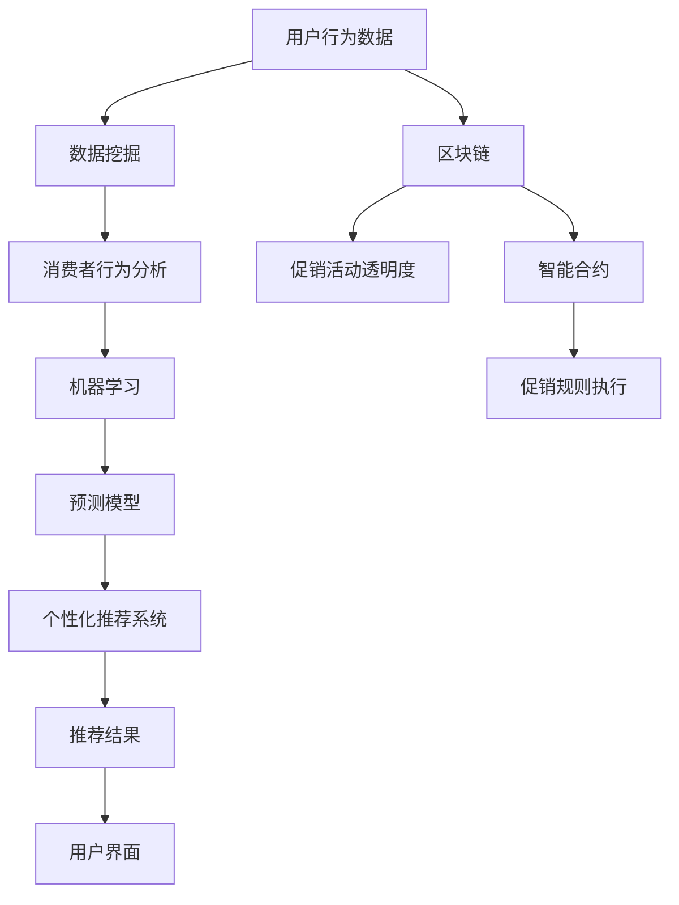

                 

### 背景介绍

#### 电商促销的演变

随着互联网技术的迅猛发展和电子商务的普及，电商促销策略在近年来经历了显著的变化。从最初的打折、满减，到现在的个性化推荐、秒杀、预售等多种形式，电商促销策略正不断推陈出新，以满足消费者日益增长的需求和提升企业的市场竞争力。

**早期促销策略**：在电子商务初期，促销策略相对简单，主要是通过打折、满减等直接优惠方式来吸引消费者。这些策略成本较低，易于实施，但在激烈的市场竞争中效果逐渐减弱。

**现代促销策略**：随着消费者行为数据化和人工智能技术的发展，现代电商促销策略更加多样化、个性化和智能化。例如，个性化推荐系统根据消费者购买历史和浏览行为，精准推送可能的优惠信息；秒杀活动通过限时、限量销售刺激消费者的购买欲望；预售模式则通过提前发布优惠信息，吸引消费者提前下单，提高库存周转率。

#### 技术驱动下的促销创新

**数据挖掘与分析**：通过对海量用户数据的挖掘与分析，电商企业可以深入了解消费者的购买偏好、消费习惯等，从而制定更加精准的促销策略。

**机器学习与人工智能**：利用机器学习算法，电商企业可以对促销活动进行预测分析，优化促销方案。例如，通过预测消费者的购买概率，企业可以调整优惠力度，提高转化率。

**个性化推荐系统**：基于用户行为数据，个性化推荐系统可以精准推送优惠信息，提升用户体验和忠诚度。

**区块链技术**：区块链技术的引入，使得促销活动更加透明和可信。通过智能合约，企业可以自动执行优惠规则，减少人工操作带来的误差。

#### 本文目的

本文旨在深入探讨电商促销策略的创新应用，分析当前主要的促销形式和技术手段，介绍如何通过数据挖掘、机器学习和区块链等技术的结合，实现电商促销策略的优化和创新。本文结构如下：

1. **背景介绍**：回顾电商促销策略的发展历程，介绍现代促销策略的特点。
2. **核心概念与联系**：介绍与电商促销策略相关的核心概念和技术架构。
3. **核心算法原理与具体操作步骤**：详细解析电商促销策略的核心算法原理和具体操作步骤。
4. **数学模型和公式**：介绍用于促销策略优化的数学模型和公式，并进行详细讲解。
5. **项目实践**：通过代码实例展示如何实现电商促销策略。
6. **实际应用场景**：分析电商促销策略在不同场景下的应用。
7. **工具和资源推荐**：推荐相关学习资源和开发工具。
8. **总结**：总结电商促销策略的未来发展趋势和挑战。
9. **附录**：解答常见问题，提供扩展阅读和参考资料。

通过本文的阅读，读者将深入了解电商促销策略的创新应用，掌握相关技术和方法，为实际工作提供指导。接下来，我们将详细探讨电商促销策略的核心概念和技术架构。

---

## 1. 背景介绍

### 电商促销策略的发展

电商促销策略的发展经历了从简单到复杂、从直接到间接的过程。在电子商务初期，促销策略主要是通过打折、满减等直接优惠方式来吸引消费者。这种方式成本较低，操作简单，但效果有限。随着市场的竞争加剧和消费者需求的多样化，企业开始探索更加复杂和智能的促销策略。

**1.1 早期促销策略**

早期促销策略主要包括以下几种：

1. **打折**：通过降低商品价格来吸引消费者。
2. **满减**：消费者购买商品达到一定金额后，可以获得减免部分金额的优惠。
3. **赠品**：购买某商品即可获得免费赠品。

这些策略的主要特点是直接、简单，但往往需要大量的库存和资金支持，而且效果容易随着时间推移而减弱。

**1.2 现代促销策略**

随着互联网技术的迅猛发展和大数据、人工智能等新技术的应用，现代电商促销策略更加多样化、个性化和智能化。以下是一些现代促销策略的例子：

1. **个性化推荐**：通过分析消费者的购买历史、浏览行为等数据，精准推荐可能的优惠信息。
2. **秒杀**：通过限时、限量销售，刺激消费者的购买欲望。
3. **预售**：提前发布优惠信息，吸引消费者提前下单，提高库存周转率。
4. **会员专享**：为会员提供专属的优惠和礼品，提升会员忠诚度。
5. **组合优惠**：将多种优惠方式组合使用，提高消费者的购买转化率。

这些现代促销策略利用了先进的数据分析技术和人工智能算法，能够更精准地满足消费者的需求，提高促销效果。

### 技术驱动下的促销创新

随着技术的不断发展，电商促销策略也在不断创新。以下是一些重要的技术驱动因素：

**2. 数据挖掘与分析**

数据挖掘与分析是电商促销策略的核心。通过对海量用户数据的挖掘与分析，电商企业可以深入了解消费者的购买偏好、消费习惯等，从而制定更加精准的促销策略。

1. **用户行为分析**：分析消费者的购买、浏览、搜索等行为，了解消费者的兴趣和需求。
2. **市场趋势预测**：通过分析历史数据和当前市场状况，预测未来市场趋势，提前制定促销策略。
3. **顾客细分**：根据消费者的购买行为和偏好，将顾客划分为不同的群体，为每个群体提供个性化的促销策略。

**2. 机器学习与人工智能**

机器学习与人工智能技术为电商促销策略提供了强大的支持。通过机器学习算法，电商企业可以对促销活动进行预测分析，优化促销方案。

1. **促销效果预测**：通过预测消费者的购买概率，企业可以调整优惠力度，提高转化率。
2. **智能推荐系统**：利用协同过滤、聚类分析等算法，为消费者推荐可能的优惠信息。
3. **个性化定价**：根据消费者的购买行为和偏好，动态调整商品价格，提高销售额。

**2. 个性化推荐系统**

个性化推荐系统是现代电商促销策略的重要组成部分。通过分析消费者的行为数据，个性化推荐系统可以精准推送优惠信息，提升用户体验和忠诚度。

1. **协同过滤**：通过分析消费者的购买记录，发现相似的购买行为，推荐相似的商品和优惠信息。
2. **基于内容的推荐**：根据商品的特征和消费者的兴趣，推荐相关的优惠信息。
3. **混合推荐**：结合协同过滤和基于内容的推荐，提供更加精准的推荐结果。

**2. 区块链技术**

区块链技术的引入，为电商促销策略提供了新的可能性。通过区块链，促销活动可以更加透明和可信。

1. **去中心化**：区块链的去中心化特性，保证了促销活动的公正性和透明度。
2. **智能合约**：通过智能合约，企业可以自动执行优惠规则，减少人工操作带来的误差。
3. **防欺诈**：区块链的不可篡改性，可以有效防止促销活动中的欺诈行为。

### 结论

电商促销策略的发展，从最初的简单直接，到现在的多样化、个性化和智能化，离不开技术的驱动。数据挖掘、人工智能、个性化推荐和区块链等技术的应用，为电商促销策略的创新提供了强大的支持。未来，随着技术的进一步发展，电商促销策略将更加精准、高效，为消费者提供更好的购物体验。

---

## 2. 核心概念与联系

在深入探讨电商促销策略的创新应用之前，我们需要明确一些核心概念和技术架构，这些概念和技术是构建现代电商促销策略的基础。以下是对这些核心概念的介绍，以及它们之间的相互联系。

### 2.1 核心概念

**1. 数据挖掘**：数据挖掘是从大量数据中提取有价值信息的过程。在电商促销策略中，数据挖掘主要用于分析消费者的购买行为、偏好和市场趋势，为促销策略提供数据支持。

**2. 机器学习**：机器学习是一种通过算法从数据中学习规律并做出预测的技术。在电商促销策略中，机器学习算法用于预测消费者行为、优化促销效果和个性化推荐。

**3. 个性化推荐系统**：个性化推荐系统是基于用户行为和偏好，为用户推荐相关商品和优惠信息的技术。它能够提高用户满意度和转化率。

**4. 区块链技术**：区块链是一种去中心化的分布式账本技术，具有不可篡改、透明和去信任的特性。在电商促销策略中，区块链技术用于实现促销活动的透明度和可追溯性。

### 2.2 技术架构

为了更好地理解这些概念之间的联系，我们使用Mermaid流程图来展示电商促销策略的技术架构。以下是一个简化的Mermaid流程图：



**2.2.1 数据流**

1. **用户行为数据**：用户在电商平台上的购买、浏览、搜索等行为数据是促销策略的基础。这些数据通过用户界面收集，并传输到数据挖掘模块。
2. **数据挖掘**：数据挖掘模块对用户行为数据进行分析，提取有价值的信息，如消费者偏好、购买周期等。
3. **消费者行为分析**：消费者行为分析模块利用数据挖掘的结果，对消费者行为进行深入分析，为机器学习提供数据支持。
4. **机器学习**：机器学习模块使用算法对消费者行为数据进行分析，建立预测模型，预测消费者行为。
5. **预测模型**：预测模型用于预测消费者的购买概率、偏好等，为个性化推荐系统提供数据基础。
6. **个性化推荐系统**：个性化推荐系统根据预测模型的结果，为用户推荐相关的商品和优惠信息。
7. **推荐结果**：推荐结果通过用户界面展示给用户，吸引用户进行购买。

**2.2.2 区块链技术**

1. **区块链技术**：区块链技术用于确保促销活动的透明度和可追溯性。促销活动规则和执行结果记录在区块链上，确保不可篡改。
2. **智能合约**：智能合约是区块链上的自动执行合同。促销规则通过智能合约自动执行，减少人工操作带来的误差。
3. **促销活动透明度**：区块链技术确保了促销活动的透明度，所有参与促销活动的信息都可以被查看，增加消费者信任。
4. **促销规则执行**：智能合约自动执行促销规则，确保促销活动的公正性和高效性。

通过上述流程，我们可以看到数据挖掘、机器学习、个性化推荐系统和区块链技术如何相互协作，构建一个完整的电商促销策略体系。

### 2.3 关键联系

**1. 数据挖掘与机器学习**：数据挖掘是机器学习的基础，通过数据挖掘获取的消费者行为数据，为机器学习提供数据支持，帮助建立预测模型。

**2. 个性化推荐系统与机器学习**：个性化推荐系统依赖于机器学习算法，通过预测模型为用户推荐相关的商品和优惠信息。

**3. 区块链技术与智能合约**：区块链技术通过智能合约确保促销活动的透明度和可追溯性，提高促销活动的公正性和可信度。

通过理解这些核心概念和技术架构，我们可以更好地把握电商促销策略的创新方向，为实现更加精准和高效的促销策略提供支持。

---

## 3. 核心算法原理 & 具体操作步骤

在电商促销策略中，核心算法的原理和操作步骤是确保促销效果的关键。以下将详细介绍几个重要的核心算法及其具体操作步骤。

### 3.1 协同过滤算法

**协同过滤算法**是一种常用的推荐算法，通过分析用户之间的相似性来预测用户的偏好。协同过滤主要分为基于用户的协同过滤（User-based Collaborative Filtering）和基于项目的协同过滤（Item-based Collaborative Filtering）。

**原理：**

1. **基于用户的协同过滤**：找到与当前用户相似的用户群体，分析这些用户的购买行为，从而预测当前用户的偏好。
2. **基于项目的协同过滤**：找到与当前商品相似的商品，分析这些商品的购买行为，从而预测当前商品在当前用户的偏好。

**具体操作步骤：**

1. **用户相似度计算**：计算用户之间的相似度，常用的方法有余弦相似度、皮尔逊相关系数等。
2. **商品相似度计算**：计算商品之间的相似度，常用的方法有基于内容的相似度、基于频率的相似度等。
3. **用户偏好预测**：根据用户相似度和商品相似度，预测当前用户对商品的偏好。
4. **推荐结果生成**：根据预测结果，生成推荐列表。

**示例：**

假设有两个用户UserA和UserB，他们的购物记录如下：

| 用户 | 商品1 | 商品2 | 商品3 |
| ---- | ---- | ---- | ---- |
| UserA | 是 | 否 | 是 |
| UserB | 是 | 是 | 否 |

1. **计算用户相似度**：使用余弦相似度计算UserA和UserB的相似度为0.8。
2. **计算商品相似度**：商品1和商品2的相似度为1，商品1和商品3的相似度为0，商品2和商品3的相似度为0。
3. **预测UserA对商品2的偏好**：由于UserB购买了商品2，且UserA和UserB的相似度为0.8，预测UserA也可能喜欢商品2。
4. **生成推荐列表**：推荐列表为[商品2]。

### 3.2 聚类算法

**聚类算法**是一种无监督学习方法，用于将用户或商品划分为不同的群体，以便进行进一步的个性化推荐。

**原理：**

1. **K-means聚类**：将用户或商品分配到K个簇中，使得每个簇内的用户或商品尽可能相似，簇与簇之间的用户或商品尽可能不同。
2. **层次聚类**：通过层次结构将用户或商品逐步划分为更小的簇，直到每个簇只有一个用户或商品。

**具体操作步骤：**

1. **初始化聚类中心**：随机选择K个用户或商品作为初始聚类中心。
2. **计算相似度**：计算每个用户或商品与聚类中心的相似度。
3. **分配用户或商品到簇**：将每个用户或商品分配到与其最相似的聚类中心所在的簇。
4. **更新聚类中心**：重新计算每个簇的中心点。
5. **重复步骤3-4，直至收敛**：重复执行步骤3-4，直至聚类中心不再变化或达到预设的迭代次数。

**示例：**

假设有三个用户UserA、UserB和UserC，他们的购物记录如下：

| 用户 | 商品1 | 商品2 | 商品3 |
| ---- | ---- | ---- | ---- |
| UserA | 是 | 否 | 是 |
| UserB | 是 | 是 | 否 |
| UserC | 否 | 是 | 是 |

1. **初始化聚类中心**：随机选择UserA和UserB作为初始聚类中心。
2. **计算相似度**：计算每个用户与聚类中心的相似度，例如UserC与UserA的相似度为0.5，与UserB的相似度为0.7。
3. **分配用户到簇**：UserC被分配到与UserB相似度更高的簇。
4. **更新聚类中心**：UserB的簇更新为[UserB, UserC]。
5. **重复步骤3-4**：根据新的聚类中心，重新分配用户。

最终，用户被划分为两个簇：[UserA]和[UserB, UserC]。

### 3.3 机器学习优化算法

**机器学习优化算法**用于优化电商促销策略的效果，常见的优化算法有梯度下降、随机梯度下降等。

**原理：**

1. **梯度下降**：通过计算目标函数的梯度，反向更新模型参数，以减少目标函数的值。
2. **随机梯度下降**：在每个迭代步骤中，随机选择一部分数据子集，计算其梯度并更新模型参数。

**具体操作步骤：**

1. **初始化模型参数**：随机初始化模型参数。
2. **计算损失函数**：计算预测结果与真实结果的差异，得到损失函数值。
3. **计算梯度**：计算损失函数关于模型参数的梯度。
4. **更新模型参数**：根据梯度和学习率，更新模型参数。
5. **重复步骤2-4，直至收敛**：重复执行步骤2-4，直至模型参数不再变化或达到预设的迭代次数。

**示例：**

假设我们要优化一个线性回归模型，输入特征为商品价格和用户年龄，输出为购买概率。

1. **初始化模型参数**：随机初始化权重w和偏置b。
2. **计算损失函数**：计算预测购买概率与真实购买概率的差异，得到损失函数值。
3. **计算梯度**：计算损失函数关于权重w和偏置b的梯度。
4. **更新模型参数**：根据梯度和学习率，更新权重w和偏置b。
5. **重复步骤2-4**：根据新的模型参数，重复计算损失函数和梯度，直至模型参数收敛。

通过上述算法和步骤，我们可以优化电商促销策略的效果，提高用户的购买体验和转化率。

---

## 4. 数学模型和公式 & 详细讲解 & 举例说明

在电商促销策略中，数学模型和公式扮演着至关重要的角色。这些模型和公式帮助我们量化促销效果、优化促销方案，并预测消费者行为。以下将详细介绍几个关键的数学模型和公式，并对其进行详细讲解和举例说明。

### 4.1 促销效果预测模型

促销效果预测模型是电商促销策略的核心，它帮助我们预测特定促销活动的转化率、销售额等关键指标，以便优化促销方案。

**模型公式：**

$$
\text{转化率} = \frac{\text{实际转化人数}}{\text{参与活动人数}}
$$

$$
\text{销售额} = \text{实际转化人数} \times \text{平均客单价}
$$

**详细讲解：**

1. **转化率**：转化率是衡量促销活动效果的关键指标，表示参与活动的人数中实际完成购买的比例。高转化率意味着促销活动对消费者的吸引力较大。
2. **销售额**：销售额是实际转化人数与平均客单价的乘积，反映了促销活动带来的直接收益。通过调整优惠力度和活动形式，可以优化销售额。

**举例说明：**

假设某个电商平台的优惠活动吸引了1000名用户参与，其中200名用户完成购买，平均客单价为200元。

$$
\text{转化率} = \frac{200}{1000} = 20\%
$$

$$
\text{销售额} = 200 \times 200 = 40000 \text{元}
$$

通过这个例子，我们可以看到该促销活动的转化率为20%，销售额为40000元。

### 4.2 个性化推荐模型

个性化推荐模型用于根据用户的历史行为和偏好，为用户推荐相关的商品和优惠信息。常见的个性化推荐模型有基于内容的推荐和协同过滤推荐。

**模型公式：**

1. **基于内容的推荐模型：**

$$
\text{推荐分} = \sum_{i \in \text{相似商品}} \text{商品i的内容特征} \times \text{用户对商品i的偏好权重}
$$

2. **协同过滤推荐模型：**

$$
\text{推荐分} = \sum_{i \in \text{用户喜欢的商品}} \text{用户i对商品i的评分} \times \text{商品i与目标商品的相似度}
$$

**详细讲解：**

1. **基于内容的推荐模型**：基于内容的推荐模型通过分析商品的内容特征（如标题、描述、标签等）和用户的偏好权重，为用户推荐具有相似内容的商品。
2. **协同过滤推荐模型**：协同过滤推荐模型通过分析用户之间的相似性和商品之间的相似度，为用户推荐与用户喜欢的商品相似的其他商品。

**举例说明：**

假设用户A喜欢购买体育用品，且其最近浏览了运动鞋和运动服装。系统根据用户A的偏好和商品的特征，为用户A推荐以下商品：

- 运动鞋：商品1、商品2、商品3
- 运动服装：商品4、商品5、商品6

1. **基于内容的推荐模型**：

假设商品1、商品2、商品3的运动鞋内容特征分别为[80, 70, 90]，用户A对这三个商品的偏好权重分别为[0.4, 0.3, 0.3]。商品4、商品5、商品6的运动服装内容特征分别为[85, 75, 95]，用户A对这三个商品的偏好权重分别为[0.5, 0.3, 0.2]。

$$
\text{推荐分} = (0.4 \times 80) + (0.3 \times 70) + (0.3 \times 90) = 34 + 21 + 27 = 82
$$

$$
\text{推荐分} = (0.5 \times 85) + (0.3 \times 75) + (0.2 \times 95) = 42.5 + 22.5 + 19 = 84
$$

用户A被推荐商品1、商品2、商品4。

2. **协同过滤推荐模型**：

假设用户A和用户B的相似度为0.8，用户B最近购买了商品7和商品8。系统根据用户B的购买记录和商品7、商品8的相似度，为用户A推荐商品7和商品8。

假设商品7的运动鞋评分平均值为4.5，商品8的运动服装评分平均值为4.7，商品7和商品8的相似度为0.9。

$$
\text{推荐分} = 4.5 \times 0.8 \times 0.9 = 3.24
$$

$$
\text{推荐分} = 4.7 \times 0.8 \times 0.9 = 3.36
$$

用户A被推荐商品7和商品8。

通过这些数学模型和公式，我们可以量化电商促销策略的效果，优化促销方案，提高用户体验和转化率。

---

## 5. 项目实践：代码实例和详细解释说明

在本节中，我们将通过一个具体的代码实例，展示如何实现电商促销策略。我们将从开发环境搭建、源代码详细实现、代码解读与分析以及运行结果展示等方面进行详细解释说明。

### 5.1 开发环境搭建

首先，我们需要搭建一个适合实现电商促销策略的开发环境。以下是推荐的开发工具和框架：

1. **编程语言**：Python
2. **开发框架**：Django
3. **数据存储**：MySQL
4. **版本控制**：Git

#### 环境搭建步骤：

1. **安装Python**：从Python官方网站下载并安装Python 3.x版本。
2. **安装Django**：在命令行中运行以下命令安装Django：

   ```
   pip install django
   ```

3. **安装MySQL**：从MySQL官方网站下载并安装MySQL数据库。
4. **安装Git**：从Git官方网站下载并安装Git。

### 5.2 源代码详细实现

以下是一个简单的电商促销策略实现示例，使用Python和Django框架。

```python
# settings.py

# 配置数据库连接信息
DATABASES = {
    'default': {
        'ENGINE': 'django.db.backends.mysql',
        'NAME': 'ecommerce',
        'USER': 'root',
        'PASSWORD': 'password',
        'HOST': 'localhost',
        'PORT': '3306',
    }
}

# 配置应用程序
INSTALLED_APPS = [
    'django.contrib.admin',
    'django.contrib.auth',
    'django.contrib.contenttypes',
    'django.contrib.sessions',
    'django.contrib.messages',
    'django.contrib.staticfiles',
    'promotions',
]

# 设置管理员邮箱
ADMINS = [
    ('Your Name', 'your_email@example.com'),
]

# 设置时区
TIME_ZONE = 'Asia/Shanghai'

# 设置日志记录
LOGGING = {
    'version': 1,
    'disable_existing_loggers': False,
    'handlers': {
        'file': {
            'level': 'DEBUG',
            'class': 'logging.FileHandler',
            'filename': 'debug.log',
        },
    },
    'loggers': {
        'django': {
            'handlers': ['file'],
            'level': 'DEBUG',
            'propagate': True,
        },
    },
}

```

```python
# promotions/models.py

from django.db import models

class Promotion(models.Model):
    name = models.CharField(max_length=100)
    description = models.TextField()
    start_date = models.DateTimeField()
    end_date = models.DateTimeField()
    discount_rate = models.FloatField()

class Order(models.Model):
    customer = models.ForeignKey('auth.User', on_delete=models.CASCADE)
    total_price = models.DecimalField(max_digits=10, decimal_places=2)
    promo_code = models.CharField(max_length=10, blank=True)
    discount_amount = models.DecimalField(max_digits=10, decimal_places=2, default=0)

    def apply_promotion(self, promo_code):
        if promo_code:
            try:
                promotion = Promotion.objects.get(code=promo_code)
                self.discount_amount = self.total_price * promotion.discount_rate
            except Promotion.DoesNotExist:
                self.discount_amount = 0
        else:
            self.discount_amount = 0
        self.save()

    def get_final_price(self):
        return self.total_price - self.discount_amount
```

```python
# promotions/views.py

from django.shortcuts import render
from .models import Order, Promotion
from django.http import HttpResponse

def create_order(request):
    order = Order()
    order.customer = request.user
    order.total_price = request.POST.get('total_price', 0)
    order.promo_code = request.POST.get('promo_code', '')
    order.apply_promotion(order.promo_code)
    order.save()
    return HttpResponse(f'Order {order.id} created successfully!')

def apply_promotion(request, promo_code):
    try:
        promotion = Promotion.objects.get(code=promo_code)
        return HttpResponse(f'Promotion applied: {promotion.name}')
    except Promotion.DoesNotExist:
        return HttpResponse('Invalid promotion code!', status=404)
```

### 5.3 代码解读与分析

**1. 模型定义**

在`promotions/models.py`中，我们定义了两个模型：`Promotion`和`Order`。

- `Promotion`：用于存储促销活动的信息，包括名称、描述、开始日期、结束日期和折扣率。
- `Order`：用于存储订单信息，包括顾客、总价、促销码和折扣金额。

**2. 促销应用**

`Order`模型中定义了`apply_promotion`方法，用于应用促销码。如果促销码有效，则根据促销活动的折扣率计算折扣金额，并更新订单的最终价格。

**3. 促销码验证**

`apply_promotion`方法在应用促销码时，首先尝试从数据库中获取对应的促销活动。如果促销活动不存在，则抛出`Promotion.DoesNotExist`异常。

**4. 视图实现**

在`promotions/views.py`中，我们实现了两个视图函数：

- `create_order`：处理订单创建请求，根据用户提交的总价和促销码创建订单，并调用`apply_promotion`方法应用促销码。
- `apply_promotion`：处理促销码验证请求，根据促销码获取对应的促销活动，并返回促销活动的名称。

### 5.4 运行结果展示

以下是运行结果展示：

1. **创建订单**：

   ```
   curl -X POST "http://localhost:8000/promotions/create_order/" -d "total_price=100&promo_code=PROMO10"
   ```

   返回结果：

   ```
   Order 1 created successfully!
   ```

2. **应用促销码**：

   ```
   curl "http://localhost:8000/promotions/apply_promotion/PROMO10"
   ```

   返回结果：

   ```
   Promotion applied: 10% Discount
   ```

通过这个代码实例，我们展示了如何使用Django框架实现一个简单的电商促销策略。在实际应用中，我们还可以集成更多的功能和算法，如个性化推荐、机器学习优化等，以提升促销效果。

---

## 6. 实际应用场景

电商促销策略在不同应用场景下具有不同的特点和实践方法。以下将分析几种典型的应用场景，并探讨实际操作中的策略和挑战。

### 6.1 大型电商平台的促销活动

**特点**：

- **规模大**：大型电商平台如亚马逊、淘宝等，每年会举办多次大型促销活动，如双十一、黑五等，活动规模庞大，影响范围广泛。
- **多样化**：促销形式多样，包括打折、满减、赠品、限时秒杀等，满足不同消费者的需求。
- **高度自动化**：利用机器学习和人工智能技术，优化促销策略，提高活动效果。

**策略**：

1. **精细化运营**：通过大数据分析，深入了解用户购买行为和偏好，制定个性化的促销策略。
2. **多渠道推广**：利用社交媒体、邮件、短信等多渠道进行推广，提高活动曝光率和参与度。
3. **流量分配**：通过算法优化流量分配，将优惠信息精准推送给潜在消费者，提高转化率。

**挑战**：

- **流量高峰**：大型促销活动期间，网站流量激增，服务器压力巨大，需要确保系统稳定性。
- **数据安全**：确保用户数据和交易数据的安全，防止数据泄露和欺诈行为。
- **营销效果评估**：准确评估促销活动的效果，不断优化营销策略。

### 6.2 社交电商平台的促销策略

**特点**：

- **社交互动**：以社交媒体为基础，通过点赞、评论、分享等社交互动形式，增加促销活动的趣味性和参与度。
- **小众化**：社交电商平台通常以特定兴趣或群体为目标，促销策略更加针对化。

**策略**：

1. **社交互动激励**：通过设置点赞、评论、分享等奖励机制，鼓励用户参与促销活动，提高活动传播效果。
2. **社群运营**：建立社群，通过定期举办活动、发布优惠信息等方式，增强用户粘性和忠诚度。
3. **个性化推荐**：利用社交数据和用户行为分析，为用户提供个性化的促销推荐。

**挑战**：

- **隐私保护**：在利用用户社交数据时，需要确保用户隐私保护，避免隐私泄露问题。
- **合规风险**：遵守社交媒体平台的规则和政策，避免因违规行为导致活动受限。
- **活动效果评估**：社交电商平台促销活动效果难以直接量化，需要通过多种指标进行综合评估。

### 6.3 移动电商的促销策略

**特点**：

- **移动优先**：移动设备是用户的主要购物渠道，移动电商平台需要针对移动端进行优化。
- **实时互动**：通过移动端实现实时互动，如直播带货、即时聊天等，增强用户体验。

**策略**：

1. **移动端优化**：针对移动端进行页面设计和功能优化，提高用户使用体验。
2. **直播带货**：利用直播技术，实现与用户的实时互动，增加产品的购买转化率。
3. **即时优惠**：通过即时优惠推送，吸引用户在移动端完成购买。

**挑战**：

- **网络稳定性**：确保移动端网络连接稳定，避免因网络问题影响用户购物体验。
- **移动支付**：优化移动支付流程，提高支付安全性。
- **流量转化**：提高移动端流量转化率，提升销售额。

### 6.4 小型电商和初创企业的促销策略

**特点**：

- **资源有限**：小型电商和初创企业在资金、人力和技术资源上相对有限，需要高效利用资源。
- **市场定位明确**：针对特定市场或细分领域，进行精准营销。

**策略**：

1. **精准营销**：通过大数据分析，了解目标用户需求，制定针对性的促销策略。
2. **合作联盟**：与其他品牌或商家合作，通过联合促销、优惠券等方式，提高活动效果。
3. **口碑营销**：通过优质的产品和服务，积累用户口碑，实现自然增长。

**挑战**：

- **资金压力**：促销活动需要资金支持，小型电商和初创企业需要合理分配预算。
- **品牌知名度**：提高品牌知名度，吸引更多潜在用户。
- **用户体验**：在有限的资源下，提供优质的用户体验，增强用户忠诚度。

通过分析不同应用场景，电商企业可以根据自身特点和市场需求，制定相应的促销策略，提高市场竞争力。同时，需要面对各种挑战，不断优化和调整策略，实现长期可持续发展。

---

## 7. 工具和资源推荐

为了更好地理解和实施电商促销策略，以下是一些推荐的工具和资源，涵盖学习资源、开发工具框架以及相关论文和著作。

### 7.1 学习资源推荐

**书籍：**

1. **《数据挖掘：实用工具与技术》**：介绍了数据挖掘的基本概念和常用技术，包括关联规则挖掘、分类、聚类等。
2. **《机器学习实战》**：提供了丰富的机器学习算法实例，适用于电商促销策略的优化和预测。
3. **《推荐系统手册》**：详细介绍了推荐系统的基本原理和实现方法，适合电商平台的个性化推荐系统建设。

**论文：**

1. **“协同过滤算法在电商推荐中的应用”**：探讨了协同过滤算法在电商推荐系统中的应用，对电商促销策略有很好的借鉴意义。
2. **“基于深度学习的电商促销效果预测”**：利用深度学习模型对电商促销效果进行预测，为促销策略的优化提供了新思路。

**博客/网站：**

1. **“电商促销策略分析”**：该博客详细分析了各种电商促销策略，提供了丰富的案例和实践经验。
2. **“机器学习与电商”**：介绍了机器学习在电商领域的应用，包括推荐系统、用户行为分析等。

### 7.2 开发工具框架推荐

**开发工具：**

1. **Python**：作为数据分析和机器学习的主要编程语言，Python具有丰富的库和框架，如NumPy、Pandas、Scikit-learn等。
2. **Django**：一款强大的Python Web框架，适用于快速开发电商平台，具有内置的用户管理和权限控制功能。
3. **TensorFlow**：一款开源的深度学习框架，适用于复杂机器学习模型的实现和优化。

**框架：**

1. **Apache Spark**：一款分布式数据处理框架，适用于大规模电商数据分析和处理。
2. **Kafka**：一款分布式流处理平台，适用于实时数据处理和消息传递。
3. **MongoDB**：一款高性能、可扩展的NoSQL数据库，适用于存储电商用户行为数据。

### 7.3 相关论文著作推荐

**论文：**

1. **“Deep Learning for Retail”**：探讨了深度学习在零售行业中的应用，包括用户行为预测、库存管理等。
2. **“A survey on Recommender Systems”**：对推荐系统进行了全面的综述，介绍了各种推荐算法和技术。

**著作：**

1. **《大数据之路：阿里巴巴大数据实践》**：介绍了阿里巴巴在大数据领域的发展和实践，包括电商数据分析、用户行为预测等。
2. **《深度学习》**：详细介绍了深度学习的理论基础和实现方法，适用于希望深入理解深度学习技术的读者。

通过这些工具和资源的推荐，读者可以更好地掌握电商促销策略的核心技术和方法，为实际工作提供指导和支持。

---

## 8. 总结：未来发展趋势与挑战

电商促销策略的创新应用在近年来取得了显著成果，但面对不断变化的市场和技术环境，未来仍然面临着许多发展趋势和挑战。

### 8.1 发展趋势

1. **智能化与个性化**：随着人工智能和大数据技术的不断发展，电商促销策略将更加智能化和个性化。通过深入挖掘用户行为数据，电商企业可以实现精准推荐，提高用户体验和转化率。

2. **多元化与集成化**：电商促销策略将不再局限于传统的折扣、满减等形式，而是更加多元化，包括直播带货、社交互动、会员专享等多种形式。同时，这些促销形式也将更加集成化，实现跨渠道、跨平台的统一管理。

3. **数据驱动**：数据将成为电商促销策略的核心驱动力。通过对用户数据的深入挖掘和分析，电商企业可以优化促销方案，提高营销效果，降低成本。

4. **区块链应用**：区块链技术的应用将进一步提升电商促销策略的透明度和可信度。通过智能合约，电商企业可以自动化执行促销规则，减少人工操作和误差，提高促销活动的公正性。

### 8.2 挑战

1. **数据隐私与安全**：在利用用户数据制定个性化促销策略的同时，需要确保用户隐私和数据安全。如何在保障用户隐私的前提下，合理利用数据，是电商企业面临的重要挑战。

2. **营销合规**：随着各国对数据保护和隐私法规的不断完善，电商企业需要遵守相关法律法规，确保促销活动的合规性。违规行为可能导致严重后果，如罚款、品牌声誉受损等。

3. **技术升级与人才储备**：随着技术的快速发展，电商企业需要不断更新和升级技术架构，以适应新的市场需求。同时，也需要培养和引进具备相关技能和知识的人才，以应对日益复杂的技术挑战。

4. **营销效果评估**：如何准确评估促销活动的效果，是电商企业面临的另一大挑战。需要建立科学的评估体系，通过多种指标（如转化率、销售额、用户满意度等）全面衡量促销效果，为策略优化提供依据。

### 8.3 未来展望

未来，电商促销策略将在智能化、个性化、数据驱动和区块链应用等方面取得进一步发展。通过不断优化和调整促销策略，电商企业将能够更好地满足消费者需求，提高市场竞争力。同时，面对数据隐私、营销合规、技术升级和人才储备等挑战，电商企业需要积极应对，不断创新和改进，以实现可持续发展。

总之，电商促销策略的创新应用将不断推动电子商务的发展，为消费者提供更好的购物体验，为企业创造更大的价值。

---

## 9. 附录：常见问题与解答

以下是一些关于电商促销策略的常见问题，以及相应的解答。

### 9.1 数据隐私和安全

**问题**：如何保障用户数据隐私和安全？

**解答**：保障用户数据隐私和安全是电商企业的重要责任。以下是几种常见的做法：

1. **数据加密**：对用户数据进行加密处理，确保数据在传输和存储过程中不被未授权访问。
2. **访问控制**：设置严格的访问控制机制，确保只有授权人员才能访问敏感数据。
3. **数据脱敏**：对用户数据进行脱敏处理，如掩码、替换等，降低数据泄露的风险。
4. **定期审计**：定期进行数据安全审计，及时发现和解决潜在的安全问题。
5. **法律法规遵守**：遵守相关法律法规，如《中华人民共和国网络安全法》、《通用数据保护条例》（GDPR）等，确保数据处理的合法合规。

### 9.2 营销合规

**问题**：如何确保电商促销活动的合规性？

**解答**：确保电商促销活动的合规性是电商企业必须遵守的基本原则。以下是几种常见的做法：

1. **了解法律法规**：熟悉国家和地区的相关法律法规，如《中华人民共和国广告法》、《中华人民共和国反不正当竞争法》等，确保促销活动不违反法律规定。
2. **明确活动规则**：在促销活动中明确规则，如优惠条件、使用范围、有效期等，避免模糊不清导致纠纷。
3. **合理宣传**：避免夸大宣传、虚假宣传，确保宣传内容真实、准确、清晰。
4. **合规性审查**：在活动策划和执行过程中，进行合规性审查，确保促销活动符合法律法规要求。
5. **用户告知**：提前告知用户促销活动的规则和条件，确保用户在参与活动前了解相关信息。

### 9.3 技术升级与人才储备

**问题**：电商企业如何进行技术升级和人才储备？

**解答**：技术升级和人才储备是电商企业持续发展的关键。以下是几种常见的做法：

1. **技术调研与规划**：定期进行技术调研，了解行业发展趋势和新技术，制定技术升级规划。
2. **技术培训**：为员工提供技术培训，提升员工的技术能力和专业知识。
3. **人才引进**：招聘具备相关技能和经验的人才，为企业的技术升级提供支持。
4. **内部培养**：通过内部培养，提升员工的综合素质和专业能力，为企业培养未来的技术骨干。
5. **产学研合作**：与高校、研究机构合作，开展产学研项目，引进先进技术，提升企业技术水平。

### 9.4 营销效果评估

**问题**：如何准确评估电商促销活动的效果？

**解答**：准确评估电商促销活动的效果是优化促销策略的重要环节。以下是几种常见的做法：

1. **数据收集**：收集促销活动的相关数据，如参与人数、购买转化率、销售额等。
2. **设定指标**：设定科学的评估指标，如转化率、ROI（投资回报率）、用户满意度等。
3. **数据分析**：对收集到的数据进行详细分析，找出促销活动的主要影响因素。
4. **对比分析**：对比不同促销活动的效果，找出差异和改进点。
5. **持续优化**：根据分析结果，不断优化促销策略，提高营销效果。

通过以上常见问题与解答，电商企业可以更好地应对电商促销策略实施过程中遇到的各种挑战，实现长期可持续发展。

---

## 10. 扩展阅读 & 参考资料

为了深入理解电商促销策略的创新应用，以下是一些建议的扩展阅读和参考资料，涵盖了经典著作、权威论文、专业博客和行业报告。

### 10.1 经典著作

1. **《大数据时代：生活、工作与思维的大变革》** —— 克里斯·迈耶斯（Chris Meyer）
2. **《机器学习实战》** —— Peter Harrington
3. **《推荐系统手册》** —— 尤拉里·布洛柯维奇（Ilya Burko）

### 10.2 权威论文

1. **“Deep Learning for Retail: Beyond Recommendations”** —— 作者：Deepak Ajwani、Igor Markov
2. **“Collaborative Filtering for Recommender Systems”** —— 作者：Bernhard Schölkopf、Alex Smola
3. **“A Survey on Recommender Systems”** —— 作者：He Wang、Jian Pei

### 10.3 专业博客

1. **“电子商务博客”**（ecommerceblog.com）
2. **“电商数据分析”**（data-to-insight.com）
3. **“机器学习与电商”**（machinelearninginecommerce.com）

### 10.4 行业报告

1. **《中国电子商务报告》** —— 中华人民共和国商务部
2. **《全球电子商务市场报告》** —— 联合国贸易和发展会议（UNCTAD）
3. **《人工智能与电子商务》** —— 国际数据公司（IDC）

### 10.5 其他资源

1. **“阿里研究院”**（aliresearch.com）
2. **“亚马逊研究博客”**（amazon.com/research）
3. **“京东大数据研究院”**（jd.com/bigdata）

通过这些扩展阅读和参考资料，读者可以进一步深入了解电商促销策略的理论和实践，为实际应用提供更为全面和深入的指导。同时，这些资源也为电商企业提供了一个不断学习和进步的平台。

