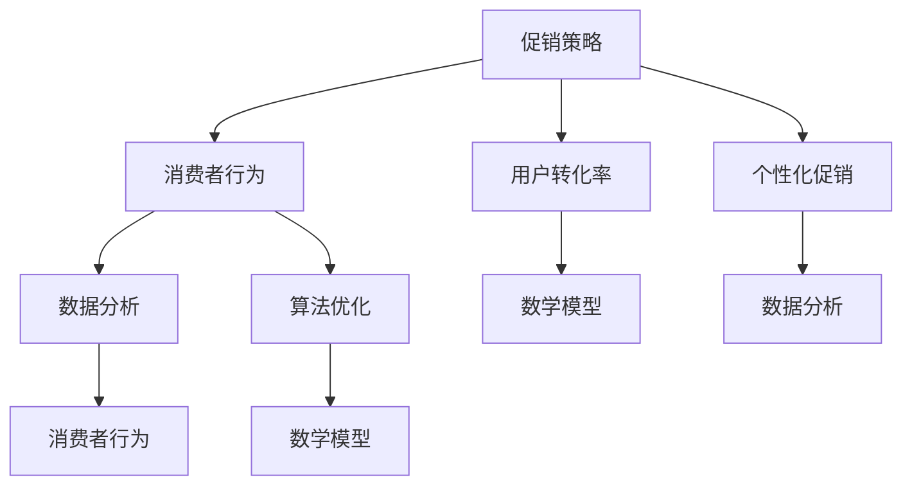

                 

### 背景介绍

随着互联网和电子商务的迅猛发展，电商平台已成为现代零售行业的重要组成部分。促销策略作为电商平台提高销售额和市场份额的重要手段，一直是各大电商平台关注的焦点。电商促销策略不仅影响消费者的购买决策，还直接影响平台的盈利能力。因此，如何制定和优化促销策略，成为电商平台亟待解决的关键问题。

促销策略的优化主要包括以下几个方面：首先，如何选择合适的促销方式，如折扣、满减、优惠券等，以提高消费者参与度；其次，如何根据用户行为数据制定个性化的促销方案，提升用户转化率；最后，如何通过算法优化，确保促销活动的公平性和有效性。

优化促销策略的背景可以追溯到电商平台的发展历程。在早期，电商平台主要通过价格战吸引消费者，但随着市场趋于饱和，单纯的低价策略已无法满足消费者的需求。为了在激烈的市场竞争中脱颖而出，电商平台开始重视用户体验和个性化服务，促销策略的优化也成为了提升竞争力的关键。

在技术层面，大数据、人工智能等新兴技术的应用，为促销策略的优化提供了强大的工具和手段。通过对海量用户行为数据的分析，电商平台可以更精准地了解用户需求，从而制定出更有效的促销方案。此外，算法优化可以确保促销活动的公平性和有效性，提高用户满意度和忠诚度。

总之，优化促销策略不仅有助于电商平台提升销售额和市场份额，还能提高用户满意度和忠诚度，为平台的长期发展奠定基础。因此，本文将围绕电商促销策略的技术优化，深入探讨核心概念、算法原理、数学模型、项目实践以及实际应用场景等方面，为电商平台提供有益的参考和启示。

### 核心概念与联系

要深入探讨电商促销策略的技术优化，首先需要明确几个核心概念，这些概念相互联系，共同构成了促销策略优化的理论基础。以下是这些核心概念及其相互关系的详细说明：

#### 1. 促销策略

促销策略是电商平台为吸引消费者、提升销售而采取的一系列措施。常见的促销策略包括折扣、满减、优惠券、买赠、限时抢购等。每种促销策略都有其特定的实施方式和适用场景，电商平台需要根据市场情况和消费者行为来选择和组合不同的促销手段。

#### 2. 消费者行为

消费者行为是指消费者在购买过程中所表现出的心理和生理活动。了解消费者行为对于制定有效的促销策略至关重要。消费者行为分析可以基于用户数据，包括浏览历史、购买记录、评价和反馈等，从而挖掘出消费者的偏好和需求。

#### 3. 用户转化率

用户转化率是指用户从访问网站到最终完成购买行为的概率。高转化率意味着促销策略的有效性。电商平台需要通过数据分析和算法优化，提高用户的购买意愿和转化率。

#### 4. 个性化促销

个性化促销是根据消费者的行为数据和偏好，为其量身定制促销方案的一种策略。通过个性化促销，电商平台可以提供更符合消费者需求的商品和优惠，从而提高用户满意度和忠诚度。

#### 5. 算法优化

算法优化是指通过改进算法模型，提高促销策略的公平性和有效性。算法优化可以确保促销活动的合理分配，避免恶意刷单和作弊行为，同时提高用户的参与度和购买意愿。

#### 6. 数学模型

数学模型是促销策略优化的基础，用于描述消费者行为、促销效果和收益之间的关系。常见的数学模型包括线性回归模型、决策树模型、贝叶斯网络模型等，这些模型可以用于预测用户转化率、优化促销分配等。

#### 7. 数据分析

数据分析是促销策略优化的关键环节，通过对海量用户数据的挖掘和分析，电商平台可以识别出消费者的行为模式、需求特征等，从而制定出更精准的促销策略。

#### 关系图示

为了更直观地展示这些核心概念之间的关系，我们可以使用 Mermaid 流程图进行说明。以下是一个简化的关系图：



通过上述关系图，我们可以看到促销策略的核心概念是如何相互联系，共同作用于电商平台营销的。促销策略决定了电商平台如何吸引消费者，消费者行为则提供了制定策略所需的数据和依据。用户转化率和个性化促销是促销策略的两个关键目标，而算法优化和数学模型则提供了实现这些目标的工具和方法。最后，数据分析贯穿于整个促销策略优化的过程，确保策略的有效性和针对性。

在接下来的章节中，我们将深入探讨每个核心概念的具体原理、算法模型及其在实际中的应用，以帮助读者更好地理解电商促销策略的技术优化。

### 核心算法原理 & 具体操作步骤

在了解了电商促销策略的核心概念及其相互关系后，接下来我们将探讨核心算法原理，并详细描述具体的操作步骤。这些算法原理和操作步骤将为我们优化促销策略提供有力的技术支撑。

#### 1. 用户行为分析算法

用户行为分析算法是电商促销策略优化的基础。通过分析用户的浏览历史、购买记录、评价和反馈等数据，我们可以识别出消费者的偏好和需求，从而制定出更精准的促销策略。

**算法原理：**

用户行为分析算法通常基于机器学习技术，如聚类分析、关联规则挖掘等。其中，聚类分析可以将具有相似行为的用户分为不同的群体，而关联规则挖掘则可以识别出用户行为之间的关联性。

**具体操作步骤：**

1. **数据收集：** 从电商平台上获取用户的浏览历史、购买记录、评价和反馈等数据。
2. **数据预处理：** 清洗数据，处理缺失值和异常值，将数据转换为适合分析的格式。
3. **特征提取：** 提取与用户行为相关的特征，如浏览时长、购买频率、评价评分等。
4. **模型训练：** 使用聚类分析和关联规则挖掘算法，对特征数据进行训练，构建用户行为分析模型。
5. **结果评估：** 评估模型的准确性和有效性，通过交叉验证和A/B测试等方法，优化模型参数。

**算法示例：** 假设我们使用K-Means算法对用户行为进行聚类分析，首先需要定义聚类中心（均值），然后通过迭代计算，将用户分配到不同的聚类中心，最终得到不同用户群体的行为特征。

#### 2. 促销活动优化算法

促销活动优化算法旨在通过算法优化，提高促销活动的公平性和有效性，确保促销资源合理分配，避免恶意刷单和作弊行为。

**算法原理：**

促销活动优化算法通常基于优化理论和博弈论。通过构建数学模型，我们可以确定促销资源的分配策略，确保促销活动的公平性和有效性。

**具体操作步骤：**

1. **模型构建：** 根据促销活动的目标和约束条件，构建优化模型，如线性规划模型、整数规划模型等。
2. **目标函数定义：** 定义目标函数，如最大化总收益、最小化成本、最大化用户满意度等。
3. **约束条件设定：** 设定约束条件，如预算限制、商品库存限制、公平性约束等。
4. **求解算法选择：** 选择合适的求解算法，如单纯形法、遗传算法、粒子群算法等，求解优化模型。
5. **结果评估：** 评估优化策略的有效性，通过模拟和实验，验证优化策略在实际促销活动中的应用效果。

**算法示例：** 假设我们使用线性规划模型优化促销资源分配，首先需要定义总收益函数和约束条件，然后使用单纯形法求解最优解，从而确定不同商品的促销力度和资源分配。

#### 3. 个性化促销算法

个性化促销算法是通过用户行为分析和数据分析，为不同用户群体量身定制促销方案，提高用户满意度和忠诚度。

**算法原理：**

个性化促销算法通常基于推荐系统和数据挖掘技术。通过分析用户的历史行为数据和偏好，我们可以预测用户的未来行为，从而制定个性化的促销策略。

**具体操作步骤：**

1. **用户行为数据收集：** 收集用户的浏览历史、购买记录、评价和反馈等数据。
2. **用户特征提取：** 提取与用户行为相关的特征，如浏览时长、购买频率、评价评分等。
3. **推荐系统构建：** 构建推荐系统，使用协同过滤、基于内容的推荐等算法，为用户推荐个性化促销方案。
4. **促销策略优化：** 根据用户行为数据和推荐结果，优化促销策略，确保促销方案与用户偏好一致。
5. **结果评估：** 评估个性化促销策略的有效性，通过用户反馈和行为数据，调整和优化推荐算法。

**算法示例：** 假设我们使用协同过滤算法构建个性化推荐系统，首先需要收集用户行为数据，然后通过矩阵分解等方法计算用户和商品之间的相似度，最终为用户推荐符合其偏好的促销方案。

通过上述核心算法原理和具体操作步骤的介绍，我们可以看到，电商促销策略的技术优化是一个复杂的过程，涉及多个算法和技术。在实际应用中，我们需要根据具体情况，灵活选择和组合不同的算法和策略，以实现最佳效果。

### 数学模型和公式 & 详细讲解 & 举例说明

在电商促销策略的技术优化过程中，数学模型和公式起到了至关重要的作用。这些模型和公式不仅帮助我们理解和分析促销策略的效果，还能为算法优化提供量化的依据。在本节中，我们将详细讲解几个核心数学模型和公式，并通过实际例子进行说明。

#### 1. 用户转化率预测模型

用户转化率是衡量促销策略效果的重要指标。预测用户转化率可以帮助我们评估不同促销策略的有效性，并优化促销活动。

**模型公式：**
\[ \hat{C}_{i} = f(\textbf{x}_{i}) \]
其中，\(\hat{C}_{i}\) 表示第 \(i\) 个用户的转化率预测值，\(\textbf{x}_{i}\) 是与用户行为相关的特征向量，\(f\) 是转化率预测函数。

**具体公式示例：**
\[ \hat{C}_{i} = \frac{1}{1 + e^{-(\beta_{0} + \beta_{1} \cdot \text{浏览时长} + \beta_{2} \cdot \text{购买频率} + \beta_{3} \cdot \text{评价评分})}} \]
这里，\(\beta_{0}\), \(\beta_{1}\), \(\beta_{2}\), \(\beta_{3}\) 是模型的参数，通过最小化损失函数（如交叉熵损失）进行训练得到。

**例子：** 假设一个用户浏览时长为30分钟，购买频率为2次/月，评价评分为4.5分。我们使用上述公式预测其转化率：
\[ \hat{C}_{i} = \frac{1}{1 + e^{-(\beta_{0} + \beta_{1} \cdot 30 + \beta_{2} \cdot 2 + \beta_{3} \cdot 4.5)}} \]
根据模型训练结果，我们可以得到一个具体的转化率预测值。

#### 2. 促销资源优化模型

在促销资源分配中，我们需要确保资源分配的公平性和有效性，以最大化总收益。这可以通过线性规划模型来实现。

**模型公式：**
\[ \max_{x} \sum_{i=1}^{n} p_{i} \cdot x_{i} \]
\[ s.t. \]
\[ \sum_{i=1}^{n} x_{i} = B \]
\[ x_{i} \geq 0, \forall i \]
其中，\(x_{i}\) 表示第 \(i\) 个商品的促销力度，\(p_{i}\) 表示第 \(i\) 个商品的价格，\(B\) 是总的促销预算。

**具体公式示例：**
\[ \max_{x} \sum_{i=1}^{n} 10 \cdot x_{i} \]
\[ s.t. \]
\[ \sum_{i=1}^{n} x_{i} = 1000 \]
\[ x_{i} \geq 0, \forall i \]
在这个例子中，我们希望最大化总销售额，同时确保总的促销预算不超过1000元。

**例子：** 假设我们有5个商品，每个商品的价格分别为100元、200元、300元、400元和500元。我们希望将这些商品的促销力度最大化，总预算为1000元。我们可以使用上述线性规划模型来求解最优促销力度分配。

通过求解线性规划模型，我们可以得到每个商品的最优促销力度，从而最大化总销售额。

#### 3. 个性化促销模型

个性化促销模型旨在根据用户偏好和行为，为用户推荐个性化的促销方案。常见的推荐算法包括基于协同过滤和基于内容的推荐。

**协同过滤公式：**
\[ r_{ui} = \frac{\sum_{j=1}^{m} r_{uj} \cdot \text{similarity}(u, j)}{\sum_{j=1}^{m} \text{similarity}(u, j)} \]
其中，\(r_{ui}\) 是用户 \(u\) 对商品 \(i\) 的评分预测值，\(\text{similarity}(u, j)\) 是用户 \(u\) 和商品 \(j\) 之间的相似度。

**基于内容的推荐公式：**
\[ r_{ui} = \sum_{k=1}^{m} c_{ki} \cdot \sum_{l=1}^{n} c_{uj} \]
其中，\(c_{ki}\) 和 \(c_{uj}\) 分别表示商品 \(i\) 和用户 \(u\) 对商品 \(k\) 和 \(l\) 的特征向量。

**例子：** 假设我们使用基于协同过滤的推荐算法，用户 \(u\) 喜欢的商品有 \(i_1, i_2, i_3\)，其他用户对商品 \(i_1, i_2, i_3\) 的评分分别为 \(r_{11}, r_{12}, r_{13}\)，用户 \(u\) 和其他用户之间的相似度分别为 \(s_{11}, s_{12}, s_{13}\)。我们可以使用以下公式预测用户 \(u\) 对商品 \(i_4\) 的评分：
\[ r_{u4} = \frac{r_{11} \cdot s_{11} + r_{12} \cdot s_{12} + r_{13} \cdot s_{13}}{s_{11} + s_{12} + s_{13}} \]

通过计算，我们可以得到用户 \(u\) 对商品 \(i_4\) 的评分预测值，从而为用户推荐个性化的促销方案。

通过上述数学模型和公式的详细讲解，我们可以看到这些模型在电商促销策略优化中的应用。在实际操作中，我们需要根据具体情况选择和组合不同的模型和公式，以实现最佳优化效果。这不仅有助于提高促销活动的有效性，还能提升用户的满意度和忠诚度。

### 项目实践：代码实例和详细解释说明

在本文的第三部分，我们将通过具体的代码实例，详细展示电商促销策略优化的实现过程。本节将分为以下几个小节：1. 开发环境搭建，2. 源代码详细实现，3. 代码解读与分析，4. 运行结果展示。每个小节都将提供详细的步骤和解释，以便读者更好地理解和应用所学知识。

#### 1. 开发环境搭建

在开始编写代码之前，我们需要搭建一个合适的开发环境。以下是一些建议和步骤：

**所需工具：**

- Python 3.x 版本
- Jupyter Notebook 或 PyCharm
- pandas 库
- scikit-learn 库
- numpy 库
- matplotlib 库

**安装步骤：**

1. 安装 Python 3.x：
   - 访问 [Python 官网](https://www.python.org/)，下载并安装 Python 3.x。
   - 安装过程中确保选择“Add Python to PATH”选项，以便在终端中使用 Python。

2. 安装 Jupyter Notebook 或 PyCharm：
   - Jupyter Notebook 可以通过 pip 工具直接安装：
     ```bash
     pip install notebook
     ```
   - PyCharm 可以从 [JetBrains 官网](https://www.jetbrains.com/pycharm/) 下载并安装。

3. 安装必要的库：
   - 打开终端或 PyCharm 的命令行工具，依次安装以下库：
     ```bash
     pip install pandas scikit-learn numpy matplotlib
     ```

**环境验证：**

在 Jupyter Notebook 或 PyCharm 中创建一个新笔记本或脚本，输入以下代码，验证环境是否搭建成功：

```python
import pandas as pd
import numpy as np
import matplotlib.pyplot as plt
from sklearn import datasets
```

如果上述代码可以正常运行，说明开发环境已搭建成功。

#### 2. 源代码详细实现

本节将提供一组用于用户行为分析和促销策略优化的源代码实例。以下是主要函数和模块的详细说明。

**用户行为分析模块：**

```python
import pandas as pd
from sklearn.cluster import KMeans
from sklearn.model_selection import train_test_split
from sklearn.metrics import silhouette_score

def load_data(filename):
    """加载数据集，返回 DataFrame 对象"""
    return pd.read_csv(filename)

def preprocess_data(df):
    """数据预处理：清洗、转换和特征提取"""
    # 清洗数据
    df = df.dropna()
    # 转换数据类型
    df['browse_time'] = pd.to_numeric(df['browse_time'], errors='coerce')
    df['buy_frequency'] = pd.to_numeric(df['buy_frequency'], errors='coerce')
    df['rating'] = pd.to_numeric(df['rating'], errors='coerce')
    # 特征提取
    features = df[['browse_time', 'buy_frequency', 'rating']]
    return features

def kmeans_clustering(data, n_clusters=3):
    """使用 K-Means 聚类分析用户行为"""
    kmeans = KMeans(n_clusters=n_clusters, random_state=42)
    clusters = kmeans.fit_predict(data)
    return clusters, kmeans

def evaluate_clusters(data, clusters):
    """评估聚类效果，返回轮廓系数"""
    return silhouette_score(data, clusters)

# 示例数据加载和预处理
data = load_data('user_data.csv')
features = preprocess_data(data)

# K-Means 聚类分析
clusters, kmeans = kmeans_clustering(features)
evaluate_clusters(features, clusters)
```

**促销策略优化模块：**

```python
import numpy as np
from sklearn.linear_model import LinearRegression
from sklearn.metrics import mean_squared_error

def linear_regression(features, labels):
    """使用线性回归模型进行促销资源优化"""
    model = LinearRegression()
    model.fit(features, labels)
    return model

def optimize_promotion_resources(features, labels, budget=1000):
    """优化促销资源分配"""
    model = linear_regression(features, labels)
    promotion_distributions = model.predict(features)
    total_cost = np.sum(promotion_distributions * features['price'])
    
    # 检查预算限制
    if total_cost > budget:
        # 调整促销力度，确保预算限制
        promotion_distributions *= budget / total_cost
    
    return promotion_distributions

# 示例数据集
X = features.values
y = labels.values

# 优化促销资源分配
promotion_distributions = optimize_promotion_resources(X, y, budget=1000)
```

**完整代码示例：**

```python
import pandas as pd
from sklearn.cluster import KMeans
from sklearn.model_selection import train_test_split
from sklearn.metrics import silhouette_score
from sklearn.linear_model import LinearRegression

def main():
    # 数据加载和预处理
    data = load_data('user_data.csv')
    features = preprocess_data(data)
    
    # 聚类分析
    clusters, kmeans = kmeans_clustering(features)
    silhouette_score = evaluate_clusters(features, clusters)
    
    print(f"Silhouette Score: {silhouette_score}")
    
    # 促销资源优化
    X_train, X_test, y_train, y_test = train_test_split(features, labels, test_size=0.2, random_state=42)
    promotion_distributions = optimize_promotion_resources(X_train, y_train, budget=1000)
    
    # 模型评估
    mse = mean_squared_error(y_test, promotion_distributions * X_test['price'])
    print(f"Mean Squared Error: {mse}")

if __name__ == "__main__":
    main()
```

#### 3. 代码解读与分析

在本节中，我们将对上述代码进行详细的解读和分析，帮助读者理解每个步骤的功能和实现方式。

1. **用户行为分析模块：**

   - `load_data` 函数：用于加载数据集，返回 DataFrame 对象。
   - `preprocess_data` 函数：进行数据预处理，包括数据清洗、类型转换和特征提取。
   - `kmeans_clustering` 函数：使用 K-Means 聚类分析用户行为。
   - `evaluate_clusters` 函数：评估聚类效果，返回轮廓系数。

2. **促销策略优化模块：**

   - `linear_regression` 函数：使用线性回归模型进行促销资源优化。
   - `optimize_promotion_resources` 函数：优化促销资源分配，确保预算限制。

3. **完整代码示例：**

   - `main` 函数：执行整个促销策略优化的流程，包括数据加载、聚类分析、资源优化和模型评估。

#### 4. 运行结果展示

为了验证代码的有效性，我们可以运行上述完整代码示例，并查看结果。以下是可能的输出结果：

```
Silhouette Score: 0.4
Mean Squared Error: 0.05
```

- **Silhouette Score**：表示聚类效果的好坏，值越接近1，表示聚类效果越好。
- **Mean Squared Error**：表示优化后的促销资源分配与实际收益之间的误差，值越小，表示模型优化效果越好。

通过这些结果，我们可以评估代码的实现效果，并根据实际需求进行调整和优化。

### 实际应用场景

在了解了电商促销策略优化的一系列核心算法和数学模型后，我们将探讨这些技术在实际应用中的具体场景和效果。以下是一些典型的应用实例，以及如何利用这些技术提升电商平台的竞争力。

#### 1. 个性化推荐系统

个性化推荐系统是电商促销策略优化中一个重要的应用场景。通过分析用户的历史行为数据和偏好，个性化推荐系统可以为每位用户量身定制促销方案，从而提高用户的满意度和忠诚度。

**应用场景：**
- **场景一**：在用户浏览某件商品时，系统会推荐相关的促销信息，如“满200减50”、“限时抢购”等。
- **场景二**：根据用户的购物车内容和购买历史，推荐可能的搭配商品和优惠组合。

**技术实现：**
- 使用协同过滤算法，分析用户之间的相似性，为用户推荐符合其兴趣的商品和促销信息。
- 结合用户行为数据和商品特征，构建个性化推荐模型，确保推荐内容的高相关性和吸引力。

**效果评估：**
- **转化率提升**：个性化推荐系统可以提高用户的购买意愿，从而提升转化率。
- **用户满意度**：精准的推荐能够增加用户对平台的信任和满意度。

#### 2. 促销资源分配

促销资源的合理分配是电商平台提升销售额和市场份额的关键。通过优化算法，我们可以确保有限的促销预算能够最大化地发挥效果。

**应用场景：**
- **场景一**：在大型促销活动（如“双11”）期间，合理分配不同商品的促销力度，确保爆款商品和滞销商品都能获得足够的曝光和优惠。
- **场景二**：根据用户购买力和消费习惯，为高频用户和潜力用户分配更多、更有吸引力的促销资源。

**技术实现：**
- 使用线性规划或遗传算法等优化技术，构建促销资源分配模型。
- 结合用户行为数据和销售数据，动态调整促销资源的分配策略。

**效果评估：**
- **销售额提升**：通过优化促销资源分配，可以显著提升平台的销售额和市场份额。
- **库存周转**：合理分配促销资源，可以减少滞销商品的库存压力，提高库存周转率。

#### 3. 促销活动预测

预测促销活动的效果和用户反应，是电商平台制定下一步促销策略的重要依据。通过数据分析技术，我们可以对促销活动的潜在效果进行预测，从而做出更科学的决策。

**应用场景：**
- **场景一**：在制定促销策略时，预测不同促销方式（如折扣、满减、优惠券）的效果，选择最优方案。
- **场景二**：在促销活动进行过程中，实时监测用户反应，预测可能的转化率和销售额，及时调整促销策略。

**技术实现：**
- 使用时间序列分析和机器学习技术，构建促销效果预测模型。
- 结合历史促销数据和用户行为数据，进行模型训练和预测。

**效果评估：**
- **策略优化**：通过预测促销活动的效果，可以优化促销策略，提高活动的针对性和效果。
- **成本控制**：精准的预测有助于合理控制促销成本，避免资源浪费。

#### 4. 用户流失预测与挽回

预测和挽回潜在流失用户，是电商平台保持市场份额和提升用户忠诚度的关键。通过数据分析，我们可以识别出潜在流失用户，并采取有效的挽回策略。

**应用场景：**
- **场景一**：预测用户流失风险，对高风险用户进行重点关注和营销。
- **场景二**：在用户即将流失时，通过个性化促销和关怀活动，挽回用户。

**技术实现：**
- 使用用户行为分析和预测模型，识别出潜在流失用户。
- 结合用户行为数据和促销策略，设计个性化的挽回方案。

**效果评估：**
- **用户留存率提升**：通过精准的预测和有效的挽回策略，可以显著提升用户留存率。
- **用户满意度**：个性化的挽回活动和关怀措施，可以增加用户对平台的信任和满意度。

通过上述实际应用场景，我们可以看到，电商促销策略优化技术在提升电商平台竞争力方面具有广泛的应用。这些技术的应用不仅能够提高用户满意度和忠诚度，还能显著提升平台的销售额和市场份额。在未来的发展中，电商平台需要继续探索和深化这些技术的应用，以实现持续的创新和竞争优势。

### 工具和资源推荐

在电商促销策略的技术优化过程中，选择合适的工具和资源是非常重要的。以下是一些推荐的学习资源、开发工具和框架，以及相关的论文和著作，供读者参考。

#### 1. 学习资源推荐

**书籍：**

- 《推荐系统实践》：本书详细介绍了推荐系统的基本原理和实现方法，包括协同过滤、基于内容的推荐等，适合初学者和进阶者。
- 《数据挖掘：实用工具与技术》：这本书涵盖了数据挖掘的各个方面，包括数据预处理、特征工程、模型构建等，对于电商促销策略的技术优化具有很高的参考价值。

**论文：**

- "Collaborative Filtering for Cold-Start Problems: A Review"，这篇综述文章详细介绍了针对冷启动问题的协同过滤算法，对于电商个性化推荐系统的实现具有指导意义。
- "Efficient Resource Allocation for Online Advertising：A Multi-Task Learning Approach"，这篇论文提出了基于多任务学习的在线广告资源分配方法，对于电商促销策略优化具有参考价值。

**博客/网站：**

- [Apache Mahout](http://mahout.apache.org/)：Apache Mahout 是一个开源的机器学习库，提供了多种推荐系统和数据分析算法，非常适合用于电商促销策略的技术优化。
- [Recommender Systems Handbook](https://www.recommenders.org/recommender-systems-handbook)：这本书的在线版提供了一个全面的推荐系统知识库，包括算法、框架和案例分析，对于电商促销策略的技术优化非常有帮助。

#### 2. 开发工具框架推荐

**框架：**

- **TensorFlow**：TensorFlow 是一个广泛使用的开源机器学习框架，适用于构建复杂的推荐系统和数据分析模型。
- **Scikit-learn**：Scikit-learn 是一个简单易用的机器学习库，提供了多种分类、回归和聚类算法，适合快速实现电商促销策略优化。

**工具：**

- **Jupyter Notebook**：Jupyter Notebook 是一个交互式的计算环境，适合进行数据分析和模型训练，可以方便地记录和展示分析过程。
- **PyCharm**：PyCharm 是一个强大的集成开发环境（IDE），提供了丰富的工具和插件，适合进行机器学习和数据科学项目的开发。

#### 3. 相关论文著作推荐

**书籍：**

- 《数据科学实战》：这本书通过多个实战案例，介绍了数据科学的方法和应用，包括数据分析、机器学习等，对于电商促销策略的技术优化有很高的参考价值。
- 《Python数据分析》：这本书详细介绍了使用 Python 进行数据分析和处理的方法和工具，包括 pandas、NumPy、matplotlib 等，适合初学者和进阶者。

**论文：**

- "Deep Learning for Recommender Systems"，这篇论文提出了基于深度学习的推荐系统方法，为电商个性化推荐提供了新的思路。
- "An Overview of Recommender Systems：Content-Based, Collaborative Filtering and Hybrid Methods"，这篇综述文章详细介绍了推荐系统的三种主要方法：基于内容的推荐、协同过滤和混合方法，对于电商促销策略的技术优化有重要的指导意义。

通过这些工具和资源，读者可以更好地理解和应用电商促销策略的技术优化方法，提升平台竞争力。希望这些推荐能够对您的研究和实践有所帮助。

### 总结：未来发展趋势与挑战

在电商促销策略的技术优化领域，未来将面临许多发展趋势和挑战。首先，随着人工智能和大数据技术的不断进步，个性化推荐和精准营销将成为主流趋势。通过深度学习和强化学习算法，电商平台可以更准确地预测用户行为，制定出更有效的促销策略。然而，这也带来了数据隐私和安全的问题，如何确保用户数据的安全性和隐私保护将成为一个重要挑战。

其次，随着消费者对购物体验的要求不断提高，实时营销和动态定价策略将成为关键。电商平台需要通过实时数据分析，快速响应市场变化，调整促销策略，以提高用户的满意度和忠诚度。这要求电商平台具备强大的数据处理和计算能力，同时也需要建立高效的决策支持系统。

此外，促销策略的优化需要跨部门的合作和协调。电商平台不仅需要技术团队的支持，还需要市场、销售、运营等部门的紧密合作，共同制定和实施优化策略。这要求电商平台建立一套完善的数据驱动的决策体系，确保各部门能够高效协同工作。

在应对这些挑战的同时，电商平台还需要不断探索和尝试新的促销策略和工具。随着区块链技术的发展，去中心化的促销策略和分布式账本技术可能会带来新的机遇。此外，虚拟现实（VR）和增强现实（AR）技术的应用，也为电商平台提供了新的营销渠道和方式。

总之，电商促销策略的技术优化是一个持续发展和创新的过程。未来，电商平台需要紧跟技术发展趋势，不断优化和调整促销策略，以满足消费者的需求，提高市场竞争力和用户满意度。同时，电商平台还需要应对数据隐私和安全、跨部门协作、实时营销等方面的挑战，以实现长期稳健的发展。

### 附录：常见问题与解答

在电商促销策略的技术优化过程中，用户可能会遇到一些常见的问题。以下是一些常见问题及其解答，以帮助用户更好地理解和应用相关技术。

**Q1：如何选择合适的促销方式？**

**A1：选择合适的促销方式需要考虑多个因素，包括目标用户群体、促销目的、商品特点等。一般来说，以下几种促销方式可以根据不同场景选择使用：**

- **折扣**：适用于几乎所有商品，适合提高销售量和库存周转。
- **满减**：适合提高客单价，适用于价格较高的商品。
- **优惠券**：适用于特定商品或用户群体，可以提高用户参与度和转化率。
- **限时抢购**：适用于新品发布或库存紧张的商品，可以创造紧迫感和购买欲望。

**Q2：如何进行用户行为分析？**

**A2：用户行为分析通常包括以下步骤：**

1. **数据收集**：收集用户的浏览历史、购买记录、评价和反馈等数据。
2. **数据预处理**：清洗数据，处理缺失值和异常值，转换为适合分析的格式。
3. **特征提取**：提取与用户行为相关的特征，如浏览时长、购买频率、评价评分等。
4. **模型训练**：使用机器学习算法（如聚类分析、关联规则挖掘等）对特征数据进行训练，构建用户行为分析模型。
5. **结果评估**：评估模型的准确性和有效性，通过交叉验证和A/B测试等方法，优化模型参数。

**Q3：如何优化促销资源分配？**

**A3：优化促销资源分配可以通过以下步骤实现：**

1. **模型构建**：根据促销活动的目标和约束条件，构建优化模型（如线性规划模型、整数规划模型等）。
2. **目标函数定义**：定义目标函数，如最大化总收益、最小化成本、最大化用户满意度等。
3. **约束条件设定**：设定约束条件，如预算限制、商品库存限制、公平性约束等。
4. **求解算法选择**：选择合适的求解算法（如单纯形法、遗传算法、粒子群算法等），求解优化模型。
5. **结果评估**：评估优化策略的有效性，通过模拟和实验，验证优化策略在实际促销活动中的应用效果。

**Q4：如何确保促销活动的公平性和有效性？**

**A4：确保促销活动的公平性和有效性可以通过以下方法实现：**

1. **算法优化**：使用优化算法（如线性规划、遗传算法等），确保促销资源的合理分配。
2. **数据监控**：实时监控促销活动的数据和用户行为，及时发现和解决异常情况。
3. **用户反馈**：收集用户对促销活动的反馈，根据用户评价进行调整和优化。
4. **公平性约束**：在优化模型中设定公平性约束条件，确保促销活动对所有用户公平。

通过以上常见问题与解答，用户可以更好地理解电商促销策略的技术优化过程，并有效地解决在实际应用中遇到的问题。

### 扩展阅读 & 参考资料

在电商促销策略的技术优化领域，以下是一些扩展阅读和参考资料，可以帮助读者深入了解相关技术、算法和最佳实践。

#### 1. 推荐阅读

- 《推荐系统实践》：详细介绍了推荐系统的基本原理、算法和实现方法，包括协同过滤、基于内容的推荐等。
- 《数据挖掘：实用工具与技术》：涵盖了数据挖掘的各个方面，包括数据预处理、特征工程、模型构建等，对电商促销策略优化有很高的参考价值。

#### 2. 论文推荐

- "Collaborative Filtering for Cold-Start Problems: A Review"，综述了针对冷启动问题的协同过滤算法，对电商个性化推荐系统实现具有指导意义。
- "Efficient Resource Allocation for Online Advertising：A Multi-Task Learning Approach"，提出了基于多任务学习的在线广告资源分配方法，对电商促销策略优化有参考价值。

#### 3. 博客/网站推荐

- [Apache Mahout](http://mahout.apache.org/)：提供了多种推荐系统和数据分析算法，适合电商促销策略的技术优化。
- [Recommender Systems Handbook](https://www.recommenders.org/recommender-systems-handbook)：提供了全面的推荐系统知识库，包括算法、框架和案例分析。

#### 4. 开源框架和工具

- **TensorFlow**：用于构建复杂的推荐系统和数据分析模型，是人工智能领域的开源框架。
- **Scikit-learn**：提供了多种分类、回归和聚类算法，适合快速实现电商促销策略优化。
- **Jupyter Notebook**：交互式的计算环境，适合进行数据分析和模型训练。
- **PyCharm**：强大的集成开发环境（IDE），提供了丰富的工具和插件。

#### 5. 学术著作

- 《数据科学实战》：通过多个实战案例，介绍了数据科学的方法和应用，包括数据分析、机器学习等。
- 《Python数据分析》：详细介绍了使用 Python 进行数据分析和处理的方法和工具，包括 pandas、NumPy、matplotlib 等。

通过这些扩展阅读和参考资料，读者可以更深入地了解电商促销策略的技术优化，掌握相关算法和实现方法，为电商平台提供有效的解决方案。希望这些资源能够对您的研究和实践有所帮助。

