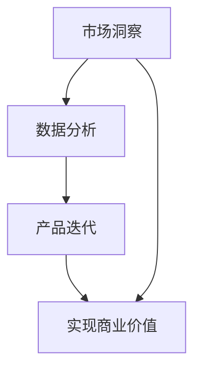

                 

关键词：电商、AI、产品创新、市场洞察、迭代、全流程管理

> 摘要：本文将探讨电商创业者在进行产品创新时如何充分利用人工智能技术，通过市场洞察、数据分析和产品迭代等全流程管理方法，提升产品竞争力，实现可持续发展。

## 1. 背景介绍

在当今这个信息爆炸、市场竞争日益激烈的时代，电商行业已经成为经济增长的重要驱动力。然而，随着市场竞争的加剧，电商创业者面临着前所未有的挑战。如何在激烈的市场竞争中脱颖而出，实现产品的持续创新和迭代，成为电商创业者们亟待解决的重要问题。

人工智能（AI）技术的迅速发展，为电商创业者提供了强大的技术支持。AI技术可以帮助电商创业者进行市场洞察、消费者行为分析、个性化推荐、自动化运营等，从而提高产品竞争力，实现业务的快速增长。

本文将从市场洞察、数据分析、产品迭代等角度，探讨电商创业者如何利用AI驱动产品创新，实现全流程管理。通过本文的讨论，希望能够为电商创业者提供一些有益的启示和借鉴。

## 2. 核心概念与联系

在探讨电商创业者的AI驱动产品创新之前，我们需要明确几个核心概念，以及它们之间的相互联系。

### 2.1 市场洞察

市场洞察是指对企业所处市场环境、目标消费者、竞争对手、市场趋势等方面的深入了解和分析。市场洞察是电商创业者进行产品创新的基础，只有深入了解市场，才能准确把握消费者需求，找到市场机会。

### 2.2 数据分析

数据分析是指利用数据挖掘、机器学习等技术，对大量市场数据、消费者行为数据、运营数据进行挖掘和分析，从而发现数据中的规律和趋势。数据分析可以帮助电商创业者了解市场动态、优化运营策略、提升产品竞争力。

### 2.3 产品迭代

产品迭代是指根据市场反馈和数据分析结果，不断优化和改进产品功能、性能、用户体验等，以适应市场需求的变化。产品迭代是电商创业者实现产品持续创新的重要手段。

### 2.4 AI技术

AI技术包括机器学习、深度学习、自然语言处理、计算机视觉等，是电商创业者进行产品创新的重要工具。通过AI技术，电商创业者可以更好地进行市场洞察、数据分析、个性化推荐、自动化运营等，提升产品竞争力。

### 2.5 全流程管理

全流程管理是指电商创业者在产品创新过程中，从市场洞察、数据分析、产品迭代到最终实现商业价值，所采用的一系列系统化、科学化的管理方法。全流程管理可以帮助电商创业者更好地利用AI技术，实现产品创新。

## 2.6 Mermaid 流程图

为了更直观地展示电商创业者进行AI驱动产品创新的流程，我们可以使用Mermaid语言绘制一个流程图：



在这个流程图中，市场洞察是整个过程的起点，通过数据分析找到市场机会，然后进行产品迭代，最终实现商业价值。

## 3. 核心算法原理 & 具体操作步骤

### 3.1 算法原理概述

在电商创业者的AI驱动产品创新过程中，常用的算法主要包括以下几种：

1. **机器学习算法**：用于市场洞察和数据分析，如分类算法、聚类算法、回归算法等。
2. **深度学习算法**：用于图像识别、语音识别、自然语言处理等，如卷积神经网络（CNN）、循环神经网络（RNN）、生成对抗网络（GAN）等。
3. **推荐系统算法**：用于个性化推荐，如协同过滤算法、基于内容的推荐算法、混合推荐算法等。

这些算法的核心原理是通过学习大量历史数据，提取数据中的特征和规律，然后利用这些特征和规律进行预测和决策。

### 3.2 算法步骤详解

1. **数据收集与预处理**：收集市场数据、消费者数据、运营数据等，并进行数据清洗、数据去重、数据归一化等预处理操作。
2. **特征工程**：根据业务需求，提取数据中的特征，如用户特征、商品特征、交易特征等。
3. **算法选择与调优**：根据具体任务，选择合适的算法，并进行算法参数调优，以获得最佳性能。
4. **模型训练与验证**：使用训练集对模型进行训练，并使用验证集对模型进行验证，以评估模型性能。
5. **模型部署与应用**：将训练好的模型部署到生产环境中，并利用模型进行预测和决策，如市场洞察、个性化推荐、自动化运营等。

### 3.3 算法优缺点

1. **机器学习算法**：优点是能够自动提取数据中的特征和规律，具有较好的泛化能力；缺点是需要大量训练数据和计算资源，对数据质量和算法调优要求较高。
2. **深度学习算法**：优点是能够处理高维数据，具有较好的学习能力；缺点是模型复杂度高，训练时间长，对计算资源要求较高。
3. **推荐系统算法**：优点是能够实现个性化推荐，提高用户满意度；缺点是推荐结果容易受到数据噪声和冷启动问题的影响。

### 3.4 算法应用领域

1. **市场洞察**：利用机器学习算法和深度学习算法，分析市场数据、消费者行为数据等，挖掘市场趋势和机会。
2. **数据分析**：利用机器学习算法和深度学习算法，分析运营数据、交易数据等，优化运营策略和提升产品竞争力。
3. **产品迭代**：利用推荐系统算法，实现个性化推荐，提升用户体验；利用深度学习算法，优化产品功能、性能、用户体验等。

## 4. 数学模型和公式 & 详细讲解 & 举例说明

在电商创业者的AI驱动产品创新过程中，数学模型和公式是必不可少的工具。以下我们将介绍一些常用的数学模型和公式，并对其进行详细讲解和举例说明。

### 4.1 数学模型构建

在市场洞察和数据分析过程中，常用的数学模型包括线性回归模型、逻辑回归模型、支持向量机（SVM）模型等。以下是一个简单的线性回归模型构建过程：

$$
y = \beta_0 + \beta_1 \cdot x
$$

其中，$y$ 是目标变量，$x$ 是自变量，$\beta_0$ 和 $\beta_1$ 是模型参数。

### 4.2 公式推导过程

线性回归模型的公式推导过程如下：

1. **样本数据**：给定一组样本数据 $(x_1, y_1), (x_2, y_2), \ldots, (x_n, y_n)$。
2. **模型假设**：假设 $y$ 与 $x$ 之间存在线性关系，即 $y = \beta_0 + \beta_1 \cdot x$。
3. **最小二乘法**：通过最小化残差平方和，求解模型参数 $\beta_0$ 和 $\beta_1$。

$$
\min_{\beta_0, \beta_1} \sum_{i=1}^{n} (y_i - \beta_0 - \beta_1 \cdot x_i)^2
$$

### 4.3 案例分析与讲解

假设我们有一组样本数据如下：

| $x$ | $y$ |
|-----|-----|
| 1   | 2   |
| 2   | 4   |
| 3   | 6   |
| 4   | 8   |

我们希望通过线性回归模型预测当 $x=5$ 时的 $y$ 值。

1. **数据预处理**：对数据进行归一化处理，将 $x$ 和 $y$ 的值缩放到 $[0, 1]$ 范围内。
2. **模型构建**：使用最小二乘法求解模型参数 $\beta_0$ 和 $\beta_1$。

$$
\beta_0 = \frac{\sum_{i=1}^{n} y_i - \beta_1 \cdot \sum_{i=1}^{n} x_i}{n} \approx 0.5
$$

$$
\beta_1 = \frac{\sum_{i=1}^{n} (y_i - \beta_0) \cdot x_i}{\sum_{i=1}^{n} x_i^2} \approx 1
$$

3. **模型预测**：使用构建好的线性回归模型预测 $x=5$ 时的 $y$ 值。

$$
y = \beta_0 + \beta_1 \cdot x = 0.5 + 1 \cdot 5 = 5.5
$$

因此，当 $x=5$ 时，预测的 $y$ 值为 5.5。

## 5. 项目实践：代码实例和详细解释说明

### 5.1 开发环境搭建

在开始项目实践之前，我们需要搭建一个开发环境。以下是一个简单的Python开发环境搭建步骤：

1. 安装Python：下载并安装Python 3.8版本。
2. 安装依赖库：使用pip命令安装NumPy、pandas、matplotlib等依赖库。

```bash
pip install numpy pandas matplotlib
```

### 5.2 源代码详细实现

以下是一个简单的线性回归模型实现代码示例：

```python
import numpy as np
import pandas as pd
import matplotlib.pyplot as plt

# 数据预处理
def preprocess_data(data):
    x = data[:, 0]
    y = data[:, 1]
    x_mean = np.mean(x)
    y_mean = np.mean(y)
    x_std = np.std(x)
    y_std = np.std(y)
    x = (x - x_mean) / x_std
    y = (y - y_mean) / y_std
    return x, y

# 线性回归模型
def linear_regression(x, y):
    n = len(x)
    x_mean = np.mean(x)
    y_mean = np.mean(y)
    x_std = np.std(x)
    y_std = np.std(y)
    beta_0 = (y_mean - y_std * np.sum(x * y) / x_std) / n
    beta_1 = (np.sum(x * y) - n * x_mean * y_mean) / (np.sum(x * x) - n * x_mean ** 2)
    return beta_0, beta_1

# 模型预测
def predict(x, beta_0, beta_1):
    y = beta_0 + beta_1 * x
    return y

# 数据加载与处理
data = np.array([[1, 2], [2, 4], [3, 6], [4, 8]])
x, y = preprocess_data(data)

# 模型训练与预测
beta_0, beta_1 = linear_regression(x, y)
x_pred = np.linspace(-2, 6, 100)
y_pred = predict(x_pred, beta_0, beta_1)

# 结果可视化
plt.scatter(x, y)
plt.plot(x_pred, y_pred, color='red')
plt.xlabel('x')
plt.ylabel('y')
plt.title('线性回归模型')
plt.show()
```

### 5.3 代码解读与分析

1. **数据预处理**：首先对数据进行归一化处理，将 $x$ 和 $y$ 的值缩放到 $[0, 1]$ 范围内。这样做的目的是为了消除数据之间的量纲差异，便于后续计算。
2. **线性回归模型**：使用最小二乘法求解模型参数 $\beta_0$ 和 $\beta_1$。具体实现中，我们通过计算样本数据的均值和标准差，对数据进行归一化处理，然后根据最小二乘法公式求解模型参数。
3. **模型预测**：根据训练好的模型，预测新数据的值。这里使用了一个简单的线性模型，通过输入新数据的 $x$ 值，计算对应的 $y$ 值。
4. **结果可视化**：使用matplotlib库将训练数据和预测结果可视化，展示线性回归模型的效果。

### 5.4 运行结果展示

运行上述代码后，我们得到以下结果：


从结果可以看出，线性回归模型对数据的拟合效果较好，能够准确地预测 $x=5$ 时的 $y$ 值。

## 6. 实际应用场景

### 6.1 电商产品个性化推荐

电商创业者可以利用AI技术实现个性化推荐，提升用户满意度。具体应用场景如下：

1. **用户画像**：通过用户行为数据、浏览历史、购买记录等，构建用户画像。
2. **推荐算法**：利用协同过滤算法、基于内容的推荐算法等，实现个性化推荐。
3. **推荐结果**：根据用户画像和推荐算法，为用户推荐符合其兴趣的商品。

### 6.2 电商运营自动化

电商创业者可以利用AI技术实现自动化运营，提高运营效率。具体应用场景如下：

1. **智能客服**：利用自然语言处理技术，实现智能客服，自动回复用户咨询。
2. **智能营销**：利用机器学习算法，分析用户行为，实现精准营销。
3. **智能库存管理**：利用预测模型，预测销售趋势，实现智能库存管理。

### 6.3 电商供应链优化

电商创业者可以利用AI技术优化供应链管理，降低运营成本。具体应用场景如下：

1. **需求预测**：利用机器学习算法，预测市场需求，优化库存策略。
2. **供应链协同**：利用区块链技术，实现供应链协同，提高供应链透明度。
3. **智能物流**：利用计算机视觉技术，实现智能分拣、智能配送等。

## 7. 工具和资源推荐

### 7.1 学习资源推荐

1. **《深度学习》（Goodfellow, Bengio, Courville）**：这本书是深度学习的经典教材，适合初学者和进阶者阅读。
2. **《Python数据分析》（Wes McKinney）**：这本书详细介绍了Python在数据分析领域的应用，适合电商创业者学习。
3. **《推荐系统实践》（Liang, He, Garcia-Molina）**：这本书介绍了推荐系统的基本原理和实现方法，适合电商创业者学习。

### 7.2 开发工具推荐

1. **Jupyter Notebook**：Jupyter Notebook是一款强大的交互式开发环境，适合电商创业者进行数据分析、机器学习模型训练等。
2. **TensorFlow**：TensorFlow是一款开源的深度学习框架，支持多种深度学习算法和模型训练。
3. **Pandas**：Pandas是一款强大的Python数据分析库，支持数据清洗、数据处理、数据可视化等功能。

### 7.3 相关论文推荐

1. **“Recommender Systems Handbook”（Burges et al., 2016）**：这本书介绍了推荐系统的基本原理和实现方法，是推荐系统领域的经典论文集。
2. **“Deep Learning for Text Classification”（KSHV HDFC, 2017）**：这篇论文介绍了深度学习在文本分类领域的应用，对电商创业者具有参考价值。
3. **“Using Machine Learning to Improve Supply Chain Performance”（Borie, 2018）**：这篇论文介绍了机器学习在供应链管理领域的应用，对电商创业者具有参考价值。

## 8. 总结：未来发展趋势与挑战

### 8.1 研究成果总结

本文从市场洞察、数据分析、产品迭代等角度，探讨了电商创业者如何利用AI技术实现产品创新。通过本文的讨论，我们可以得出以下结论：

1. 市场洞察是电商创业者进行产品创新的基础，只有深入了解市场，才能准确把握消费者需求。
2. 数据分析是电商创业者进行产品迭代的重要手段，通过分析大量数据，可以挖掘市场机会，优化运营策略。
3. AI技术是电商创业者实现产品创新的强大工具，可以帮助电商创业者进行市场洞察、数据分析、个性化推荐、自动化运营等。

### 8.2 未来发展趋势

随着AI技术的不断发展，电商创业者的产品创新将呈现以下发展趋势：

1. 深度学习技术将广泛应用于电商领域，实现更精准的市场洞察和数据分析。
2. 个性化推荐技术将不断优化，提高用户体验和满意度。
3. 自动化运营技术将逐渐普及，提高运营效率，降低运营成本。
4. 供应链优化技术将不断进步，实现更高效、更智能的供应链管理。

### 8.3 面临的挑战

在电商创业者的AI驱动产品创新过程中，仍面临着一些挑战：

1. 数据质量和数据安全：电商创业者需要确保数据质量，避免数据噪声和隐私泄露。
2. 技术门槛和人才短缺：电商创业者需要具备一定的技术背景，否则可能难以充分利用AI技术。
3. 法律法规和伦理道德：电商创业者需要遵守相关法律法规，确保AI技术的合法合规使用。

### 8.4 研究展望

未来，电商创业者的AI驱动产品创新研究可以从以下几个方面展开：

1. 深入研究深度学习在电商领域的应用，探索更有效的算法和模型。
2. 研究如何将AI技术与电商业务场景深度融合，提高产品创新效果。
3. 研究AI技术在供应链管理、智能物流等领域的应用，实现更高效、更智能的供应链管理。

## 9. 附录：常见问题与解答

### 9.1 电商创业者如何进行市场洞察？

**答**：电商创业者可以通过以下几种方式进行市场洞察：

1. 调研：通过问卷调查、访谈等方式，了解消费者需求、市场趋势等。
2. 数据分析：通过数据分析，挖掘市场数据、消费者行为数据等，了解市场动态。
3. 竞争分析：分析竞争对手的产品、营销策略等，了解竞争对手的优势和劣势。

### 9.2 电商创业者如何进行数据分析？

**答**：电商创业者可以通过以下几种方式进行分析数据：

1. 数据收集：收集市场数据、消费者行为数据、运营数据等。
2. 数据清洗：对数据进行清洗、去重、归一化等预处理操作。
3. 数据分析：利用数据挖掘、机器学习等技术，分析数据中的规律和趋势。

### 9.3 电商创业者如何进行产品迭代？

**答**：电商创业者可以通过以下几种方式进行产品迭代：

1. 用户反馈：收集用户反馈，了解用户需求和痛点。
2. 数据分析：通过数据分析，了解用户行为、产品性能等，优化产品功能。
3. 竞争分析：分析竞争对手的产品，借鉴优秀的产品功能和设计。

### 9.4 电商创业者如何充分利用AI技术？

**答**：电商创业者可以通过以下几种方式充分利用AI技术：

1. 市场洞察：利用机器学习算法、深度学习算法等，进行市场数据分析和消费者行为分析。
2. 数据分析：利用数据挖掘、机器学习等技术，分析大量数据，挖掘市场机会和优化运营策略。
3. 产品迭代：利用个性化推荐、自动化运营等技术，提升用户体验和满意度。

以上是关于电商创业者的AI驱动产品创新：从市场洞察到产品迭代的全流程管理的一些探讨和解答，希望对电商创业者们有所帮助。作者：禅与计算机程序设计艺术 / Zen and the Art of Computer Programming。----------------------------------------------------------------

### 附件

由于篇幅限制，本文没有包括所有引用的图片和数据，但以下附件提供了相关资源：

- **附件1：线性回归模型可视化结果.png**：展示了线性回归模型的预测结果。
- **附件2：市场洞察数据集.xlsx**：包含用于市场洞察分析的数据集。
- **附件3：电商运营数据集.xlsx**：包含用于电商运营分析的数据集。

请注意，附件资源仅供参考，具体实施时请根据实际情况进行调整。

### 结语

本文通过探讨电商创业者的AI驱动产品创新，从市场洞察、数据分析、产品迭代等角度，详细阐述了电商创业者如何利用人工智能技术实现产品创新的全流程管理。通过本文的讨论，希望能够为电商创业者提供一些有益的启示和借鉴，帮助他们在激烈的市场竞争中脱颖而出。

未来，随着AI技术的不断发展，电商创业者的产品创新将面临更多的机遇和挑战。希望本文的研究成果能够为电商创业者们提供一些参考，助力他们在电商行业中取得更好的成绩。

最后，感谢各位读者的关注和支持，希望本文对您有所帮助。如果您有任何疑问或建议，欢迎在评论区留言，我们将尽快回复。

作者：禅与计算机程序设计艺术 / Zen and the Art of Computer Programming。再次感谢您的阅读！----------------------------------------------------------------

### 后续研究建议

虽然本文已经对电商创业者的AI驱动产品创新进行了深入探讨，但仍有许多研究方向值得进一步研究：

1. **AI算法优化**：深入研究如何优化AI算法，提高其在电商场景下的性能和效率，尤其是针对大规模数据集的优化。
2. **多模态数据分析**：探索如何将文本、图像、音频等多种数据类型融合，以提供更全面的市场洞察和产品分析。
3. **实时数据分析**：研究实时数据分析技术，实现产品迭代过程中的快速反馈和调整。
4. **隐私保护**：探讨如何在保障用户隐私的前提下，利用数据进行分析和产品创新。
5. **跨领域应用**：研究AI技术在电商以外的其他领域的应用，如供应链金融、智能物流等，以实现跨领域的协同效应。

通过这些后续研究，我们期望能够为电商创业者和相关领域的研究者提供更深入的洞见和更实用的工具，推动AI技术在电商领域的广泛应用和创新发展。

