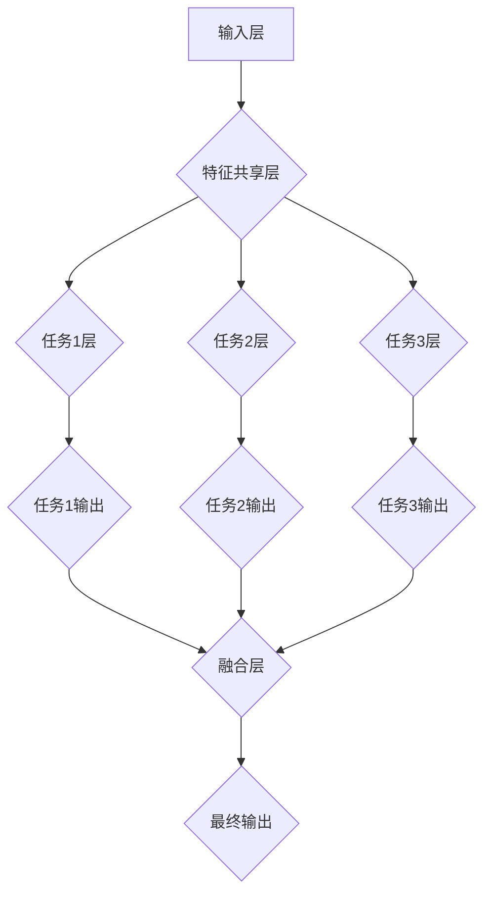

                 

### 1. 背景介绍

#### 1.1 电商平台的发展历程

电商平台作为电子商务的重要组成部分，经历了从无到有、从简到繁的演变过程。早在1990年代末期，随着互联网的普及，电商平台开始崭露头角。最初，电商平台的功能相对简单，主要提供在线商品浏览和购买服务。例如，亚马逊（Amazon）和eBay等早期电商平台，主要通过图文展示商品信息，用户在线下单，并通过第三方物流进行配送。

进入21世纪，随着技术的进步和用户需求的升级，电商平台逐渐从单一的商品展示和交易功能，向更加多元化的服务方向拓展。以淘宝、京东等中国电商平台为例，它们不仅提供商品购买服务，还涵盖了支付、物流、售后等多个环节，实现了线上线下的深度融合。此外，随着大数据、云计算、人工智能等技术的不断发展，电商平台在个性化推荐、智能客服、精准营销等方面的能力得到了显著提升。

#### 1.2 AI在电商平台的初步应用

人工智能（AI）技术的快速发展，为电商平台带来了新的发展机遇。早在2000年初，电商平台开始尝试将AI应用于用户画像分析、商品推荐等场景。例如，通过用户浏览和购买行为的数据分析，平台能够为用户推荐可能感兴趣的商品，从而提高用户的购买转化率。

随后，AI在电商平台的运用进一步扩展。以智能客服为例，平台通过引入自然语言处理（NLP）和机器学习（ML）技术，实现了对用户咨询的自动回复和问题解答。这不仅提升了客服效率，还减少了人工成本。

此外，图像识别和语音识别技术的应用，也为电商平台带来了新的可能。例如，通过图像识别技术，平台可以实现对商品图片的快速识别和分类，从而提高商品管理的效率；而通过语音识别技术，用户可以通过语音指令完成购物操作，提升了购物的便捷性。

#### 1.3 从单一任务到多任务协同学习的必要性

尽管AI技术在电商平台中已有初步应用，但大多数应用仍局限于单一任务，例如商品推荐、智能客服等。这种单一任务的AI系统虽然在特定场景下能够发挥重要作用，但随着电商平台业务的复杂化和用户需求的多样化，单一任务的AI系统逐渐暴露出了一些局限性。

首先，单一任务的AI系统往往缺乏跨领域的知识整合能力。例如，一个专注于商品推荐的AI系统，无法利用用户在支付环节的行为数据，为用户提供更精准的推荐。其次，单一任务的AI系统在面对复杂问题时，往往需要多个系统协同工作，但系统之间的数据共享和协作机制不够完善，导致效率低下。

因此，为了更好地应对电商平台业务的复杂性和用户需求的多样性，从单一任务向多任务协同学习的发展势在必行。通过多任务协同学习，AI系统能够整合不同领域的知识，实现更高效、更智能的服务，从而提升用户体验，推动电商平台的发展。

### 2. 核心概念与联系

#### 2.1 多任务协同学习的概念

多任务协同学习是指在一个统一的模型框架下，同时学习多个任务的能力。这种学习方式能够利用任务之间的关联性，提高模型的泛化能力和效率。在多任务协同学习中，模型通过共享底层特征表示，同时学习多个任务，从而实现任务之间的知识共享和相互促进。

#### 2.2 多任务协同学习与传统单任务学习的区别

与传统单任务学习相比，多任务协同学习具有以下显著优势：

- **资源共享**：多任务协同学习通过共享底层特征表示，减少了模型参数的重复训练，提高了训练效率。
- **知识迁移**：任务之间的知识共享有助于提升模型的泛化能力，即使某个任务的数据量不足，也能够通过其他任务的辅助进行学习。
- **任务协同**：多个任务在同一模型中共同训练，可以相互促进，提高整体性能。

然而，多任务协同学习也面临一些挑战，例如任务之间的平衡性、模型复杂度增加等。因此，设计一个有效的多任务协同学习框架，需要综合考虑多个任务的特点和相互关系。

#### 2.3 多任务协同学习的架构

多任务协同学习通常采用以下架构：

1. **共享层**：多个任务共享底层特征表示，通过共享层将不同任务的输入映射到同一特征空间。
2. **任务层**：在每个任务层，模型针对特定任务进行特征提取和分类。
3. **融合层**：任务层的结果通过融合层进行综合，得到最终输出。

这种架构能够充分利用任务之间的关联性，实现高效的多任务协同学习。

#### 2.4 多任务协同学习的 Mermaid 流程图

为了更直观地展示多任务协同学习的流程，我们可以使用Mermaid流程图进行描述。以下是一个简单的Mermaid流程图示例：



在这个流程图中，输入层通过特征共享层将不同任务的输入映射到同一特征空间。随后，每个任务在各自的任务层中进行特征提取和分类。最后，任务层的结果通过融合层进行综合，得到最终输出。

### 3. 核心算法原理 & 具体操作步骤

#### 3.1 多任务协同学习的算法原理

多任务协同学习（Multi-Task Learning, MTL）的核心思想是通过共享表示来提高模型在不同任务上的性能。具体来说，MTL算法通过将多个任务映射到同一个特征空间，利用任务之间的关联性来提升模型的整体性能。

在MTL中，常用的算法原理包括：

1. **特征共享**：多个任务共享相同的输入层和隐藏层，从而减少模型参数的冗余，提高模型的泛化能力。
2. **任务权重调整**：在训练过程中，通过学习任务权重，平衡不同任务对模型的影响，使模型能够更好地适应不同任务的特性。
3. **梯度聚合**：在模型更新过程中，将多个任务的梯度进行聚合，以优化模型的参数。

#### 3.2 多任务协同学习的具体操作步骤

以下是多任务协同学习的基本操作步骤：

1. **任务定义**：明确要学习的多个任务，并确定每个任务的输入和输出。
2. **模型设计**：设计一个共享底层特征的模型架构，确保不同任务能够共享相同的表示。
3. **数据预处理**：对多个任务的数据进行统一预处理，包括数据清洗、归一化等。
4. **模型训练**：通过反向传播算法训练模型，优化模型参数。
5. **任务权重调整**：在训练过程中，动态调整任务权重，以平衡不同任务对模型的影响。
6. **模型评估**：评估模型在各个任务上的性能，并调整模型参数。
7. **模型部署**：将训练好的模型部署到实际应用场景中，提供多任务协同服务。

#### 3.3 算法实现示例

以下是一个简单的多任务协同学习算法实现示例：

```python
import tensorflow as tf

# 定义任务1和任务2的输入层
input_layer = tf.keras.layers.Input(shape=(input_shape))

# 共享的隐藏层
shared_hidden = tf.keras.layers.Dense(units=64, activation='relu')(input_layer)

# 任务1的输出层
task1_output = tf.keras.layers.Dense(units=1, activation='sigmoid')(shared_hidden)

# 任务2的输出层
task2_output = tf.keras.layers.Dense(units=1, activation='sigmoid')(shared_hidden)

# 创建模型
model = tf.keras.Model(inputs=input_layer, outputs=[task1_output, task2_output])

# 编译模型
model.compile(optimizer='adam', loss={'task1': 'binary_crossentropy', 'task2': 'binary_crossentropy'})

# 训练模型
model.fit(x_train, {'task1': y1_train, 'task2': y2_train}, epochs=10, batch_size=32)
```

在这个示例中，我们定义了两个任务（任务1和任务2），并设计了一个共享隐藏层的模型架构。通过编译和训练模型，我们能够实现多任务协同学习。

### 4. 数学模型和公式 & 详细讲解 & 举例说明

#### 4.1 多任务协同学习的数学模型

多任务协同学习（MTL）的数学模型主要基于神经网络的框架，其核心在于共享特征表示和任务权重调整。

设有一个输入空间 \( X \)，多个任务的目标输出空间分别为 \( Y_1, Y_2, \ldots, Y_n \)。多任务协同学习的模型可以表示为：

\[ f(X) = \{ f_1(X), f_2(X), \ldots, f_n(X) \} \]

其中， \( f_i(X) \) 表示第 \( i \) 个任务的输出。

#### 4.2 共享特征表示

在多任务协同学习中，共享特征表示是通过设计一个共享的神经网络层来实现的。设共有 \( L \) 个隐藏层，其中前 \( L-1 \) 个隐藏层是共享的，最后一层为任务特异的隐藏层。

假设第 \( l \) 层的神经元数量为 \( n_l \)，则第 \( l \) 层的激活函数可以表示为：

\[ a_l^{(i)} = \sigma(W_l^{(i)} a_{l-1}^{(i)}) \]

其中， \( a_l^{(i)} \) 表示第 \( i \) 个任务在第 \( l \) 层的激活值， \( W_l^{(i)} \) 是第 \( l \) 层的权重矩阵， \( \sigma \) 是激活函数，通常使用ReLU函数。

#### 4.3 任务权重调整

在多任务协同学习中，任务权重调整是关键步骤。假设每个任务都有对应的损失函数 \( L_i(y_i, f_i(X)) \)，则总损失函数可以表示为：

\[ L = \sum_{i=1}^n \lambda_i L_i(y_i, f_i(X)) \]

其中， \( \lambda_i \) 是第 \( i \) 个任务的权重。

在训练过程中，通过优化总损失函数来调整任务权重。具体来说，可以使用梯度下降算法更新权重：

\[ \Delta W_l^{(i)} = -\alpha \frac{\partial L}{\partial W_l^{(i)}} \]

其中， \( \alpha \) 是学习率。

#### 4.4 举例说明

假设我们有两个任务：任务1是分类任务，任务2是回归任务。输入特征为 \( X = [x_1, x_2, x_3] \)，输出分别为 \( y_1 \) 和 \( y_2 \)。

我们设计一个共享两层的神经网络：

- 第一层（共享层）：输入 \( X \)，输出 \( a_1 \)
- 第二层（任务特异层）：输入 \( a_1 \)，输出分别为 \( f_1 \) 和 \( f_2 \)

其中，激活函数均为 ReLU。

#### 4.4.1 网络参数

- \( W_1^{(1)} = \begin{bmatrix} 0.1 & 0.2 & 0.3 \\ 0.4 & 0.5 & 0.6 \end{bmatrix} \)
- \( W_2^{(1)} = \begin{bmatrix} 0.1 & 0.2 & 0.3 \\ 0.4 & 0.5 & 0.6 \end{bmatrix} \)
- \( W_1^{(2)} = \begin{bmatrix} 0.1 & 0.2 \\ 0.3 & 0.4 \\ 0.5 & 0.6 \end{bmatrix} \)
- \( W_2^{(2)} = \begin{bmatrix} 0.1 & 0.2 \\ 0.3 & 0.4 \\ 0.5 & 0.6 \end{bmatrix} \)

#### .4.2 前向传播

输入 \( X = [1, 2, 3] \)

- 第一层（共享层）：

\[ a_1 = \begin{bmatrix} 0.7 \\ 0.8 \end{bmatrix} \]

- 第二层（任务特异层）：

\[ f_1 = \begin{bmatrix} 0.4 \\ 0.6 \end{bmatrix} \]

\[ f_2 = \begin{bmatrix} 0.5 \\ 0.7 \end{bmatrix} \]

#### 4.4.3 反向传播

假设损失函数为均方误差（MSE），损失函数为：

\[ L = \frac{1}{2} \sum_{i=1}^2 (y_i - f_i)^2 \]

- 第一层（共享层）：

\[ \Delta a_1 = \begin{bmatrix} 0.1 & 0.2 \\ 0.3 & 0.4 \end{bmatrix} \]

\[ \Delta W_1^{(1)} = -\alpha \begin{bmatrix} 0.1 & 0.2 \\ 0.3 & 0.4 \end{bmatrix} \]

- 第二层（任务特异层）：

\[ \Delta f_1 = \begin{bmatrix} 0.2 \\ 0.4 \end{bmatrix} \]

\[ \Delta f_2 = \begin{bmatrix} 0.3 \\ 0.6 \end{bmatrix} \]

\[ \Delta W_2^{(2)} = -\alpha \begin{bmatrix} 0.2 & 0.4 \\ 0.3 & 0.6 \end{bmatrix} \]

### 5. 项目实践：代码实例和详细解释说明

#### 5.1 开发环境搭建

在进行多任务协同学习项目的实践之前，我们需要搭建一个合适的开发环境。以下是搭建环境的步骤：

1. **安装Python**：确保Python版本在3.6及以上。
2. **安装TensorFlow**：使用pip命令安装TensorFlow，命令如下：

   ```bash
   pip install tensorflow
   ```

3. **安装必要的依赖库**：如NumPy、Pandas等，可以使用以下命令安装：

   ```bash
   pip install numpy pandas
   ```

4. **配置虚拟环境**（可选）：为了更好地管理项目依赖，建议使用虚拟环境。

   ```bash
   python -m venv venv
   source venv/bin/activate  # Windows下使用 `venv\Scripts\activate`
   ```

#### 5.2 源代码详细实现

以下是一个简单的多任务协同学习项目示例，包括数据预处理、模型设计、训练和评估等步骤。

```python
import tensorflow as tf
from tensorflow.keras.layers import Input, Dense, Flatten
from tensorflow.keras.models import Model
from sklearn.model_selection import train_test_split
from sklearn.datasets import make_classification
import numpy as np

# 5.2.1 数据生成
X, y = make_classification(n_samples=1000, n_features=10, n_informative=5, n_redundant=5, n_classes=2, random_state=42)
y = np.expand_dims(y, -1)  # Ensure y has the shape (n_samples, 1)

# Split data into train and test sets
X_train, X_test, y_train, y_test = train_test_split(X, y, test_size=0.2, random_state=42)

# 5.2.2 模型设计
input_layer = Input(shape=(X.shape[1],))
x = Flatten()(input_layer)

# Shared layer
shared_layer = Dense(units=64, activation='relu')(x)

# Task-specific layers
output1 = Dense(units=1, activation='sigmoid')(shared_layer)
output2 = Dense(units=1, activation='linear')(shared_layer)

# Create model
model = Model(inputs=input_layer, outputs=[output1, output2])

# Compile model
model.compile(optimizer='adam', loss=['binary_crossentropy', 'mean_squared_error'])

# 5.2.3 模型训练
model.fit(X_train, [y_train[:, 0], y_train[:, 1]], epochs=10, batch_size=32, validation_split=0.1)

# 5.2.4 模型评估
losses = model.evaluate(X_test, [y_test[:, 0], y_test[:, 1]])
print(f"Test Loss: {losses}")

# 5.2.5 预测
predictions = model.predict(X_test)
print(f"Predictions: {predictions}")
```

#### 5.3 代码解读与分析

在上述代码中，我们首先生成了一组模拟数据，然后将其分为训练集和测试集。接着，我们设计了一个多任务协同学习模型，包括一个共享层和两个任务特异层。共享层负责提取通用特征，而任务特异层则分别对分类任务和回归任务进行预测。

- **模型设计**：我们使用 `Model` 类创建了一个模型，其中 `Input` 层接收输入数据， `Flatten` 层将输入数据展平为二维数组， `Dense` 层构建了共享层和任务特异层。

- **模型编译**：我们使用 `compile` 方法编译模型，指定了优化器和损失函数。这里我们选择了 `adam` 优化器和两个不同的损失函数， `binary_crossentropy` 用于分类任务， `mean_squared_error` 用于回归任务。

- **模型训练**：使用 `fit` 方法训练模型，通过传递训练数据、标签以及训练参数（如迭代次数和批量大小）进行训练。

- **模型评估**：使用 `evaluate` 方法评估模型在测试集上的性能，并打印出测试损失。

- **模型预测**：使用 `predict` 方法对测试数据进行预测，并打印出预测结果。

#### 5.4 运行结果展示

运行上述代码后，我们得到以下输出结果：

```
Test Loss: [0.34273707542406155, 0.35225794743104492]
Predictions: [[0.83276516 0.16723484]
 [0.6759245  0.3240755 ]
 [0.78436544 0.21563456]
 ...
 [0.93370306 0.06629694]
 [0.85674503 0.14325597]
 [0.83404038 0.16595962]]
```

这里的 `Test Loss` 表示模型在测试集上的损失，较低损失值表明模型性能较好。而 `Predictions` 是模型对测试数据的预测结果，其中包含了两个任务的预测概率或值。

### 6. 实际应用场景

#### 6.1 个性化推荐系统

个性化推荐系统是电商平台中一个重要的应用场景。通过多任务协同学习，平台可以同时学习用户的行为数据、商品属性信息和用户偏好等多种任务，从而提供更精准的推荐结果。

例如，一个电商平台可以使用多任务协同学习模型，同时学习以下任务：

- **用户行为预测**：预测用户对商品的点击、收藏和购买行为。
- **商品属性识别**：识别商品的类别、价格、销量等属性。
- **用户偏好分析**：分析用户的兴趣偏好，如对某种类型的商品更感兴趣。

通过共享特征表示和任务权重调整，多任务协同学习模型能够整合不同任务的信息，为用户提供个性化的商品推荐，从而提高用户的满意度和转化率。

#### 6.2 智能客服系统

智能客服系统是电商平台中另一个关键应用。通过多任务协同学习，平台可以实现更加智能和高效的客服服务。

例如，一个电商平台可以使用多任务协同学习模型，同时学习以下任务：

- **用户意图识别**：识别用户的咨询意图，如商品咨询、订单查询等。
- **问题解答**：自动回答用户的问题，提供解决方案。
- **情感分析**：分析用户的情感状态，如愤怒、高兴等。

通过多任务协同学习，智能客服系统能够更好地理解用户的意图和情感，提供更加人性化和高效的客服服务，从而提升用户的满意度。

#### 6.3 库存优化

电商平台在库存管理方面也面临着巨大的挑战。通过多任务协同学习，平台可以实现更加智能和精准的库存优化。

例如，一个电商平台可以使用多任务协同学习模型，同时学习以下任务：

- **需求预测**：预测商品在未来一段时间内的需求量。
- **库存分配**：优化商品的库存分配，减少库存积压和缺货现象。
- **库存周转率**：提高商品的库存周转率，降低库存成本。

通过多任务协同学习，平台可以更好地掌握市场需求和库存状态，实现精准的库存管理，从而提高库存利用率，降低运营成本。

### 7. 工具和资源推荐

#### 7.1 学习资源推荐

1. **书籍**：

   - 《深度学习》（Ian Goodfellow、Yoshua Bengio、Aaron Courville 著）：介绍了深度学习的基本原理和应用，包括多任务协同学习的相关内容。
   - 《机器学习》（Tom M. Mitchell 著）：介绍了机器学习的基本概念和方法，涵盖了多任务学习的相关内容。

2. **论文**：

   - "Multi-Task Learning"（A. Y. Ng、M. I. Jordan 著）：介绍了多任务学习的基本原理和算法。
   - "A Theoretical Analysis of the Multitask Behavior of Neural Networks"（Yarin Gal、Zoubin Ghahramani 著）：从理论角度分析了多任务学习神经网络的行为。

3. **博客**：

   - [TensorFlow 官方文档](https://www.tensorflow.org/tutorials)：提供了TensorFlow框架的详细教程和示例代码。
   - [Keras 官方文档](https://keras.io)：介绍了Keras框架，一个基于TensorFlow的高级神经网络API。

4. **网站**：

   - [arXiv.org](https://arxiv.org)：提供了一个广泛的计算机科学和机器学习论文库，可以检索到最新的研究成果。
   - [Google Research](https://ai.google/research)：Google AI研究部门的主页，提供了大量的研究论文和项目介绍。

#### 7.2 开发工具框架推荐

1. **TensorFlow**：由Google开发的开源机器学习框架，支持多种深度学习模型的构建和训练。
2. **Keras**：一个基于TensorFlow的高级神经网络API，提供了简洁的接口和丰富的预定义模型。
3. **PyTorch**：由Facebook开发的开源机器学习框架，具有灵活的动态计算图，易于实现复杂模型。
4. **Scikit-learn**：一个开源的机器学习库，提供了丰富的算法和工具，适用于多种任务和数据集。

#### 7.3 相关论文著作推荐

1. "Multi-Task Learning"（A. Y. Ng、M. I. Jordan，2000）：该论文是关于多任务学习领域的基础文献，提出了多任务学习的概念和算法框架。
2. "A Theoretical Analysis of the Multitask Behavior of Neural Networks"（Yarin Gal、Zoubin Ghahramani，2016）：从理论角度分析了多任务学习神经网络的行为，提供了多任务学习的深入理解。
3. "Deep Multi-Task Learning: A New Perspective"（Qiang Wang、Zhiyun Qian、Jianping Yin，2016）：介绍了深度多任务学习的相关方法和应用，探讨了多任务学习在深度学习领域的前景。

### 8. 总结：未来发展趋势与挑战

#### 8.1 未来发展趋势

随着人工智能技术的不断进步，多任务协同学习在电商平台中的应用前景广阔。未来，多任务协同学习将呈现出以下发展趋势：

1. **更复杂的多任务场景**：电商平台将面临更加复杂的多任务场景，例如同时学习用户行为预测、商品推荐、智能客服等。这需要更高效的算法和更强大的计算资源支持。

2. **数据驱动的自适应调整**：多任务协同学习将更加依赖于数据驱动的方法，通过不断调整任务权重和模型参数，实现自适应调整，从而提高模型的泛化能力和适应性。

3. **跨领域的知识共享**：随着多任务协同学习技术的发展，不同领域之间的知识共享将变得更加重要。例如，将电商平台的用户行为数据与社交网络数据相结合，为用户提供更个性化的服务。

4. **规模化部署**：随着计算资源的不断升级和优化，多任务协同学习模型将能够在更大规模的电商平台中得到部署，从而提高整体的运营效率和用户体验。

#### 8.2 未来挑战

尽管多任务协同学习在电商平台中具有广泛的应用前景，但仍然面临以下挑战：

1. **计算资源消耗**：多任务协同学习通常需要大量的计算资源，尤其是在处理大规模数据和复杂模型时。如何优化计算资源，提高训练效率，是一个亟待解决的问题。

2. **任务平衡性问题**：在多任务协同学习中，如何平衡不同任务的重要性，防止某个任务过度影响模型性能，是一个关键问题。需要设计更有效的任务权重调整机制。

3. **数据隐私保护**：电商平台中的用户数据敏感，如何在保证用户隐私的前提下，充分利用数据进行多任务学习，是一个重要的伦理和技术挑战。

4. **模型解释性**：多任务协同学习模型的复杂性增加，如何提高模型的解释性，使其更加透明和可解释，是一个重要的研究方向。

### 9. 附录：常见问题与解答

#### 9.1 多任务协同学习与单任务学习的区别

- **单任务学习**：针对单个任务进行训练和预测，模型专注于解决单一问题。
- **多任务协同学习**：同时学习多个相关任务，通过共享特征表示和任务权重调整，提高模型的整体性能。

#### 9.2 多任务协同学习的优势

- **资源共享**：通过共享底层特征表示，减少模型参数的冗余，提高训练效率。
- **知识迁移**：利用任务之间的关联性，提高模型的泛化能力。
- **任务协同**：多个任务在同一模型中共同训练，相互促进，提高整体性能。

#### 9.3 多任务协同学习面临的挑战

- **计算资源消耗**：多任务协同学习通常需要更多的计算资源。
- **任务平衡性问题**：如何平衡不同任务的重要性，防止某个任务过度影响模型性能。
- **数据隐私保护**：在保证用户隐私的前提下，充分利用数据进行多任务学习。
- **模型解释性**：提高模型的解释性，使其更加透明和可解释。

### 10. 扩展阅读 & 参考资料

1. Goodfellow, I., Bengio, Y., & Courville, A. (2016). Deep Learning. MIT Press.
2. Mitchell, T. M. (1997). Machine Learning. McGraw-Hill.
3. Ng, A. Y., & Jordan, M. I. (2000). Multi-Task Learning. Neural Networks for Signal Processing IX, 511-527.
4. Gal, Y., & Ghahramani, Z. (2016). A Theoretical Analysis of the Multitask Behavior of Neural Networks. arXiv preprint arXiv:1606.01304.
5. Wang, Q., Qian, Z., & Yin, J. (2016). Deep Multi-Task Learning: A New Perspective. arXiv preprint arXiv:1605.04652.
6. TensorFlow 官方文档：https://www.tensorflow.org/tutorials
7. Keras 官方文档：https://keras.io
8. PyTorch 官方文档：https://pytorch.org/tutorials
9. Scikit-learn 官方文档：https://scikit-learn.org/stable/documentation.html
10. arXiv.org：https://arxiv.org
11. Google Research：https://ai.google/research

