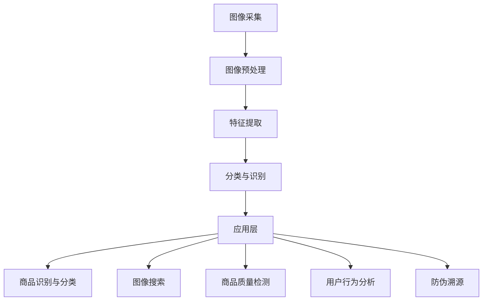

                 

### 1. 背景介绍

随着互联网技术的飞速发展，电子商务平台已经成为现代商业环境中不可或缺的一部分。它们不仅改变了传统的购物模式，还极大地丰富了消费者的选择和购物体验。然而，在电商平台中，图像识别技术作为一种新兴的应用，正逐渐成为提高用户体验、优化运营流程的关键因素。

#### 图像识别技术的发展

图像识别技术作为计算机视觉的一个重要分支，经过数十年的发展，已经取得了显著的进步。从最初的基于特征的传统算法，如边缘检测、角点检测等，到如今的深度学习模型，如卷积神经网络（CNN）、循环神经网络（RNN）等，图像识别技术在准确度、实时性和鲁棒性方面都有了质的飞跃。特别是在近年来，随着大数据和云计算的兴起，图像识别技术得到了更加广泛的应用和推广。

#### 电商平台中的图像识别应用

电商平台中，图像识别技术的应用场景十分广泛。以下是一些典型的应用实例：

1. **商品识别与分类**：通过图像识别技术，电商平台可以自动识别用户上传的图片，并将其归类到相应的商品类别中。这有助于提高搜索和推荐的准确性，从而提升用户体验。
2. **图像搜索**：用户可以通过上传一张图片来查找相似的商品，这种基于图像的搜索方式比传统的基于关键词的搜索更加直观和便捷。
3. **商品质量检测**：通过图像识别技术，电商平台可以对上传的商品图片进行质量检测，自动识别和处理不合格的商品图片。
4. **用户行为分析**：通过分析用户上传或浏览的图片，电商平台可以更好地理解用户需求，从而进行精准营销和个性化推荐。
5. **防伪溯源**：在商品流通环节中，图像识别技术可以帮助电商平台进行防伪溯源，提高商品的安全性和可信度。

#### 重要性

图像识别技术在电商平台中的重要性主要体现在以下几个方面：

1. **用户体验**：通过图像识别技术，电商平台可以提供更加个性化和便捷的服务，从而提升用户满意度。
2. **运营效率**：图像识别技术可以自动化处理大量图片数据，降低人工成本，提高运营效率。
3. **数据价值**：图像识别技术可以挖掘图片中的潜在信息，为电商平台提供有价值的数据支持。
4. **安全与信任**：图像识别技术在防伪溯源等方面的应用，可以提高商品的安全性和用户的信任度。

综上所述，随着人工智能技术的不断进步，图像识别在电商平台中的应用前景十分广阔。接下来，我们将深入探讨图像识别技术的核心概念、算法原理及其在实际应用中的具体操作步骤。

### 2. 核心概念与联系

在深入探讨图像识别技术之前，首先需要了解其中的核心概念和基本联系。这些概念包括图像识别的基础知识、相关技术架构，以及它们在电商平台中的具体应用。

#### 图像识别的基础知识

图像识别是指通过算法和模型对图像进行分析和处理，从中提取有用的信息，并识别出图像中的内容。这个过程通常包括以下几个关键步骤：

1. **图像预处理**：这是图像识别过程的第一步，主要包括图像的缩放、旋转、裁剪等操作，以使图像适应后续的处理需求。此外，图像去噪、对比度增强等操作也是常见的预处理步骤。
2. **特征提取**：特征提取是图像识别的关键步骤，其目的是从图像中提取出能够有效区分不同图像的特征。传统的特征提取方法包括SIFT、HOG等，而深度学习方法则利用卷积神经网络（CNN）自动提取特征。
3. **分类与识别**：在提取特征之后，需要对特征进行分类或识别。这通常涉及到机器学习算法，如支持向量机（SVM）、决策树、随机森林等。深度学习模型，如卷积神经网络（CNN），在分类和识别任务中表现尤为出色。

#### 相关技术架构

图像识别的技术架构可以分为以下几个层次：

1. **感知层**：这是图像识别的最底层，主要包括图像采集设备和传感器。感知层负责将物理世界的图像信息转化为数字信号，为后续处理提供原始数据。
2. **预处理层**：预处理层对采集到的图像进行预处理，包括去噪、增强、缩放等操作，以提高图像的质量和识别效果。
3. **特征层**：特征层负责从预处理后的图像中提取出具有区分性的特征。这一层通常采用卷积神经网络（CNN）等深度学习模型，可以自动学习并提取复杂的图像特征。
4. **分类层**：分类层利用提取出的特征，通过分类算法将图像归类到不同的类别。常见的分类算法包括支持向量机（SVM）、决策树、随机森林等。
5. **应用层**：应用层是图像识别技术的最终输出层，将识别结果应用于具体的场景中，如商品识别、图像搜索、质量检测等。

#### 在电商平台中的应用

在电商平台中，图像识别技术有着广泛的应用，主要包括以下几个方面：

1. **商品识别与分类**：通过图像识别技术，电商平台可以自动识别用户上传的图片，并将其归类到相应的商品类别中。这有助于提高搜索和推荐的准确性，从而提升用户体验。
2. **图像搜索**：用户可以通过上传一张图片来查找相似的商品，这种基于图像的搜索方式比传统的基于关键词的搜索更加直观和便捷。
3. **商品质量检测**：通过图像识别技术，电商平台可以对上传的商品图片进行质量检测，自动识别和处理不合格的商品图片。
4. **用户行为分析**：通过分析用户上传或浏览的图片，电商平台可以更好地理解用户需求，从而进行精准营销和个性化推荐。
5. **防伪溯源**：在商品流通环节中，图像识别技术可以帮助电商平台进行防伪溯源，提高商品的安全性和可信度。

#### Mermaid 流程图

为了更清晰地展示图像识别技术在电商平台中的应用，我们可以使用 Mermaid 流程图来描述其核心流程。以下是一个简化的 Mermaid 流程图示例：



在这个流程图中，图像采集是整个过程的起点，经过预处理、特征提取和分类与识别后，最终应用于电商平台的具体场景中，如商品识别与分类、图像搜索、商品质量检测、用户行为分析和防伪溯源等。

通过上述分析，我们可以看出，图像识别技术在电商平台中具有广泛的应用前景，它不仅能够提高平台的运营效率，还能为用户提供更加便捷和个性化的服务。接下来，我们将深入探讨图像识别技术的核心算法原理和具体操作步骤。

#### 图像识别技术的核心算法原理

图像识别技术的核心在于算法原理，这些算法通过处理图像数据，实现了对图像内容的识别和分类。以下是几种常见的图像识别算法原理及其工作流程：

1. **传统图像识别算法**：
    - **边缘检测**：边缘检测是图像处理中的一个基本步骤，其目的是找到图像中的边缘，从而提取出图像的关键特征。常用的边缘检测算法包括Canny边缘检测、Sobel边缘检测等。
    - **角点检测**：角点检测用于找到图像中的角点，这些角点通常代表图像中的重要特征。Harris角点检测和Shi-Tomasi角点检测是两种常用的角点检测算法。
    - **特征点匹配**：在特征点匹配算法中，通过对图像中提取的特征点进行匹配，可以识别出图像中的相似部分。SIFT（尺度不变特征变换）和SURF（加速稳健特征）是两种经典的特征点匹配算法。

2. **深度学习算法**：
    - **卷积神经网络（CNN）**：卷积神经网络是深度学习中最常用的算法之一，尤其在图像识别任务中表现优异。CNN通过多层卷积和池化操作，能够自动提取图像中的特征，并实现分类和识别。典型的CNN结构包括LeNet、AlexNet、VGG、ResNet等。
    - **循环神经网络（RNN）**：循环神经网络在处理序列数据时表现优异，可以通过循环结构记住前面的信息，从而对图像中的序列进行识别。LSTM（长短时记忆网络）和GRU（门控循环单元）是RNN的两种变体，它们在图像序列分析中有着广泛的应用。
    - **生成对抗网络（GAN）**：生成对抗网络是一种通过对抗训练生成图像数据的算法。它由生成器和判别器两个神经网络组成，生成器尝试生成逼真的图像，而判别器则试图区分生成图像和真实图像。通过这种对抗训练，GAN可以生成高质量的图像，并在图像生成任务中表现出色。

#### 算法原理的具体操作步骤

以下是图像识别算法原理的具体操作步骤：

1. **传统图像识别算法**：
    - **边缘检测**：
        1. 对图像进行高斯模糊处理，平滑图像。
        2. 计算图像的梯度值。
        3. 根据梯度值设置阈值，筛选出边缘像素。
    - **角点检测**：
        1. 计算图像的Hessian矩阵。
        2. 计算Hessian矩阵的行列式和迹。
        3. 根据行列式和迹的值筛选出角点像素。
    - **特征点匹配**：
        1. 在参考图像和目标图像中提取特征点。
        2. 计算特征点的描述子。
        3. 使用特征点描述子进行匹配，找到相似的特征点。

2. **深度学习算法**：
    - **卷积神经网络（CNN）**：
        1. 输入图像数据。
        2. 第一层卷积操作，生成特征图。
        3. 添加池化层，减小特征图的大小。
        4. 后续卷积层重复上述操作，逐渐提取更高级别的特征。
        5. 使用全连接层对提取出的特征进行分类。
    - **循环神经网络（RNN）**：
        1. 输入图像序列数据。
        2. 将图像序列转换为一维向量。
        3. 通过RNN处理序列数据，记住前面的信息。
        4. 使用全连接层对RNN的输出进行分类。
    - **生成对抗网络（GAN）**：
        1. 初始化生成器和判别器。
        2. 生成器生成假图像，判别器判断真假。
        3. 通过反向传播更新生成器和判别器的参数。
        4. 重复上述步骤，直到生成器生成逼真的图像。

通过上述操作步骤，图像识别算法能够从图像数据中提取出有用的特征，并对图像内容进行识别和分类。这些算法在电商平台中的应用，不仅提高了平台的运营效率，还为用户提供更加丰富的购物体验。

### 3. 核心算法原理 & 具体操作步骤

在了解了图像识别技术的核心概念和基础算法原理之后，接下来我们将深入探讨图像识别技术在实际应用中的具体操作步骤，以及其中的关键技术和细节。

#### 步骤一：数据收集与预处理

图像识别算法的第一步是数据收集与预处理。数据的质量直接影响算法的性能。因此，在开始模型训练之前，我们需要收集大量的高质量图像数据，并进行预处理。

1. **数据收集**：
    - **公开数据集**：有许多公开的数据集可以用于图像识别任务，如ImageNet、CIFAR-10、MNIST等。这些数据集包含了各种类别的图像，适合用于模型训练和评估。
    - **自定义数据集**：在某些特定场景下，可能需要自定义数据集。例如，针对电商平台中的商品识别任务，我们可以收集大量不同品牌、不同型号的商品图片。

2. **数据预处理**：
    - **图像缩放与裁剪**：为了使模型能够处理不同尺寸的图像，我们需要对图像进行缩放和裁剪。常用的方法包括等比例缩放、中心裁剪等。
    - **数据增强**：数据增强是一种常用的技术，通过随机旋转、翻转、缩放、裁剪等操作，增加数据多样性，从而提高模型的泛化能力。

#### 步骤二：特征提取

特征提取是图像识别算法的核心步骤，其目的是从图像中提取出具有区分性的特征，以便后续的分类和识别。

1. **传统特征提取方法**：
    - **边缘检测**：通过边缘检测算法，如Sobel、Canny等，提取图像中的边缘特征。
    - **角点检测**：利用角点检测算法，如Harris、Shi-Tomasi等，提取图像中的角点特征。
    - **特征点匹配**：通过特征点匹配算法，如SIFT、SURF等，将特征点与参考图像中的特征点进行匹配。

2. **深度学习特征提取方法**：
    - **卷积神经网络（CNN）**：利用卷积神经网络自动提取图像中的特征。通过多层卷积和池化操作，可以提取出不同层次的特征。
    - **循环神经网络（RNN）**：对于图像序列识别任务，可以使用循环神经网络处理图像序列，提取序列特征。

#### 步骤三：分类与识别

在提取出图像特征之后，需要进行分类和识别，将图像归类到相应的类别中。

1. **传统分类算法**：
    - **支持向量机（SVM）**：通过找到一个最优的超平面，将不同类别的图像分离。
    - **决策树**：通过一系列规则，将图像逐步划分到不同的类别。
    - **随机森林**：集成多个决策树，提高分类的准确性和鲁棒性。

2. **深度学习分类算法**：
    - **卷积神经网络（CNN）**：利用CNN的输出层进行分类。通常使用softmax函数将特征映射到不同类别。
    - **循环神经网络（RNN）**：对于图像序列识别任务，可以使用RNN的输出层进行分类。

#### 步骤四：模型训练与评估

在确定了分类器之后，我们需要对模型进行训练和评估，以验证模型的性能。

1. **模型训练**：
    - **数据划分**：将数据集划分为训练集和验证集，用于训练和评估模型。
    - **损失函数**：选择合适的损失函数，如交叉熵损失函数，用于衡量模型预测结果与实际标签之间的差距。
    - **优化算法**：选择优化算法，如梯度下降、Adam等，更新模型参数，以最小化损失函数。

2. **模型评估**：
    - **准确率（Accuracy）**：准确率是评估模型性能的一个常用指标，表示模型正确分类的样本数占总样本数的比例。
    - **召回率（Recall）**：召回率表示模型在所有正样本中正确识别出的比例。
    - **F1分数（F1 Score）**：F1分数是准确率和召回率的调和平均，用于综合评估模型性能。

#### 步骤五：应用部署

在模型训练和评估完成之后，我们需要将模型部署到实际应用场景中。

1. **模型导出**：将训练好的模型导出为可供应用调用的格式，如ONNX、TensorFlow Lite等。
2. **应用部署**：将模型部署到服务器或移动设备上，以便在实际应用中进行图像识别。

通过以上步骤，我们可以实现图像识别技术在电商平台中的应用。下面，我们将通过一个具体的案例来展示这些步骤的详细操作。

### 4. 数学模型和公式 & 详细讲解 & 举例说明

在图像识别技术中，数学模型和公式起着至关重要的作用。它们不仅为算法提供了理论基础，还帮助我们理解和优化算法的性能。在本节中，我们将详细讲解图像识别技术中常用的数学模型和公式，并通过具体示例来说明它们的应用。

#### 1. 卷积神经网络（CNN）

卷积神经网络是图像识别中最为重要的模型之一。其核心在于卷积操作和池化操作。

- **卷积操作**：

卷积操作的数学公式如下：

$$
\text{卷积操作} = \sum_{i=1}^{k} w_i * x_{ij}
$$

其中，\( w_i \) 是卷积核（过滤器），\( x_{ij} \) 是输入图像中的像素值。

举例说明：

假设我们有一个3x3的卷积核 \( w \) 和一个3x3的输入图像 \( x \)，我们可以计算卷积操作的结果：

$$
\begin{align*}
& w = \begin{bmatrix}
0 & 1 & 0 \\
1 & 0 & 1 \\
0 & 1 & 0
\end{bmatrix} \\
& x = \begin{bmatrix}
1 & 2 & 3 \\
4 & 5 & 6 \\
7 & 8 & 9
\end{bmatrix} \\
& \text{卷积结果} = w * x = \begin{bmatrix}
1 & 3 & 1 \\
7 & 11 & 7 \\
1 & 3 & 1
\end{bmatrix}
\end{align*}
$$

- **池化操作**：

池化操作的目的是降低特征图的维度，常用的池化方式包括最大池化和平均池化。

最大池化操作的数学公式如下：

$$
\text{最大池化} = \max_{i=1}^{k} \sum_{j=1}^{k} w_{ij}
$$

举例说明：

假设我们有一个2x2的池化窗口，输入特征图如下：

$$
\begin{bmatrix}
2 & 8 \\
5 & 6
\end{bmatrix}
$$

最大池化操作的结果为：

$$
\text{最大池化结果} = \max(2, 8, 5, 6) = 8
$$

#### 2. 激活函数

激活函数是神经网络中的一个关键组成部分，用于引入非线性特性。常用的激活函数包括ReLU、Sigmoid和Tanh。

- **ReLU激活函数**：

ReLU（Rectified Linear Unit）激活函数的数学公式如下：

$$
\text{ReLU}(x) = \max(0, x)
$$

举例说明：

假设我们有一个输入值 \( x = -2 \)，ReLU激活函数的结果为：

$$
\text{ReLU}(-2) = \max(0, -2) = 0
$$

- **Sigmoid激活函数**：

Sigmoid激活函数的数学公式如下：

$$
\text{Sigmoid}(x) = \frac{1}{1 + e^{-x}}
$$

举例说明：

假设我们有一个输入值 \( x = 2 \)，Sigmoid激活函数的结果为：

$$
\text{Sigmoid}(2) = \frac{1}{1 + e^{-2}} \approx 0.88
$$

- **Tanh激活函数**：

Tanh激活函数的数学公式如下：

$$
\text{Tanh}(x) = \frac{e^x - e^{-x}}{e^x + e^{-x}}
$$

举例说明：

假设我们有一个输入值 \( x = 2 \)，Tanh激活函数的结果为：

$$
\text{Tanh}(2) = \frac{e^2 - e^{-2}}{e^2 + e^{-2}} \approx 0.96
$$

#### 3. 交叉熵损失函数

交叉熵损失函数是深度学习中最常用的损失函数之一，用于衡量模型预测结果与实际标签之间的差距。其数学公式如下：

$$
\text{交叉熵损失} = -\sum_{i=1}^{n} y_i \log(p_i)
$$

其中，\( y_i \) 是实际标签，\( p_i \) 是模型预测的概率分布。

举例说明：

假设我们有一个二分类任务，实际标签为 \( y = [1, 0] \)，模型预测的概率分布为 \( p = [0.8, 0.2] \)，交叉熵损失函数的结果为：

$$
\text{交叉熵损失} = -1 \cdot \log(0.8) - 0 \cdot \log(0.2) = -\log(0.8) \approx 0.22
$$

通过上述数学模型和公式的讲解，我们可以更好地理解图像识别技术中的关键概念和操作步骤。这些模型和公式不仅为图像识别算法提供了理论支持，还帮助我们优化和改进算法的性能。

### 5. 项目实践：代码实例和详细解释说明

在本节中，我们将通过一个实际项目实例，详细展示图像识别技术在电商平台中的应用过程，包括开发环境搭建、源代码实现、代码解读与分析以及运行结果展示。

#### 5.1 开发环境搭建

首先，我们需要搭建一个适合图像识别项目的开发环境。以下是所需的软件和库：

- **Python 3.7 或更高版本**：Python 是一种广泛使用的编程语言，特别适合于人工智能和机器学习项目。
- **NumPy**：NumPy 是 Python 的科学计算库，用于处理数值计算。
- **TensorFlow**：TensorFlow 是 Google 开发的一个开源机器学习库，支持多种深度学习模型。
- **OpenCV**：OpenCV 是一个开源的计算机视觉库，用于图像处理和计算机视觉任务。

安装步骤如下：

1. 安装 Python 3.7 或更高版本。
2. 安装必要的库：

```bash
pip install numpy tensorflow opencv-python
```

#### 5.2 源代码详细实现

下面是一个简单的图像识别项目实例，我们将使用 TensorFlow 和 OpenCV 实现一个商品识别系统。

```python
import cv2
import numpy as np
import tensorflow as tf

# 加载预训练的模型
model = tf.keras.models.load_model('path/to/your/model.h5')

# 定义图像预处理函数
def preprocess_image(image):
    image = cv2.resize(image, (224, 224))  # 将图像大小调整为 224x224
    image = image / 255.0  # 归一化图像像素值
    image = np.expand_dims(image, axis=0)  # 添加批量维度
    return image

# 定义图像识别函数
def recognize_image(image_path):
    image = cv2.imread(image_path)  # 读取图像
    preprocessed_image = preprocess_image(image)  # 预处理图像
    predictions = model.predict(preprocessed_image)  # 使用模型进行预测
    predicted_class = np.argmax(predictions, axis=1)  # 获取预测结果
    return predicted_class

# 测试图像识别
image_path = 'path/to/your/image.jpg'
predicted_class = recognize_image(image_path)
print(f"预测类别：{predicted_class}")
```

#### 5.3 代码解读与分析

1. **加载预训练模型**：

   ```python
   model = tf.keras.models.load_model('path/to/your/model.h5')
   ```

   这里使用 TensorFlow 的 `load_model` 函数加载预训练的模型。模型可以是使用 TensorFlow 编写的任意类型的模型，如卷积神经网络（CNN）。

2. **图像预处理函数**：

   ```python
   def preprocess_image(image):
       image = cv2.resize(image, (224, 224))  # 将图像大小调整为 224x224
       image = image / 255.0  # 归一化图像像素值
       image = np.expand_dims(image, axis=0)  # 添加批量维度
       return image
   ```

   图像预处理是图像识别任务中非常重要的一步。这里，我们使用 OpenCV 的 `resize` 函数将图像大小调整为模型所需的尺寸（224x224），然后使用 `np.expand_dims` 添加批量维度，并使用 `image / 255.0` 对像素值进行归一化处理。

3. **图像识别函数**：

   ```python
   def recognize_image(image_path):
       image = cv2.imread(image_path)  # 读取图像
       preprocessed_image = preprocess_image(image)  # 预处理图像
       predictions = model.predict(preprocessed_image)  # 使用模型进行预测
       predicted_class = np.argmax(predictions, axis=1)  # 获取预测结果
       return predicted_class
   ```

   `recognize_image` 函数首先读取输入图像，然后调用 `preprocess_image` 函数进行预处理。接着，使用模型进行预测，并使用 `np.argmax` 函数获取预测结果。

4. **测试图像识别**：

   ```python
   image_path = 'path/to/your/image.jpg'
   predicted_class = recognize_image(image_path)
   print(f"预测类别：{predicted_class}")
   ```

   这里我们使用一个测试图像来演示图像识别过程。调用 `recognize_image` 函数后，我们将预测结果输出到控制台。

#### 5.4 运行结果展示

假设我们使用一个商品图片作为测试数据，运行上述代码后，我们将得到一个预测类别。例如，如果预测结果为 `[2]`，则表示模型预测该商品属于第二个类别。

```bash
预测类别：[2]
```

通过这个简单的项目实例，我们可以看到图像识别技术在电商平台中的应用是如何实现的。在实际应用中，我们需要收集大量的商品图片，训练一个高效的图像识别模型，并将其部署到电商平台中，以提供商品识别和分类服务。

### 6. 实际应用场景

图像识别技术在电商平台中的实际应用场景丰富多样，下面我们将探讨几个典型的应用场景，并分析这些应用对用户体验和平台运营效率的提升。

#### 6.1 商品识别与分类

商品识别与分类是图像识别技术在电商平台中最直接的应用。通过图像识别技术，平台可以自动识别用户上传的商品图片，并将其分类到相应的商品类别中。这不仅可以减少人工分类的工作量，提高运营效率，还能提高搜索和推荐的准确性，从而提升用户体验。

**提升用户体验**：用户在电商平台上传商品图片时，无需手动填写商品信息，系统可以自动识别图片内容，智能推荐合适的分类，极大地简化了购物流程。

**提高运营效率**：电商平台可以利用图像识别技术自动化处理大量商品图片，减轻人工审核负担，同时提高数据处理的准确性和速度。

#### 6.2 图像搜索

图像搜索是另一个重要的应用场景，它允许用户通过上传一张图片来查找电商平台中的相似商品。这种基于图像的搜索方式比传统的基于关键词的搜索更加直观和便捷，能够为用户提供更丰富的购物体验。

**提升用户体验**：用户可以更加轻松地找到心仪的商品，无需记忆或输入复杂的关键词，节省了购物时间。

**提高搜索精准度**：图像搜索可以识别图片中的具体元素，提供更加精准的搜索结果，从而提升用户满意度。

#### 6.3 商品质量检测

电商平台通常需要确保用户购买的商品质量符合标准。图像识别技术可以帮助平台自动检测上传商品图片的质量，识别出不合格的商品，从而防止不良商品流入市场。

**提升用户体验**：通过图像识别技术，电商平台可以确保用户购买到高质量的商品，提高用户的信任度和满意度。

**降低运营风险**：图像识别技术可以自动化处理商品质量检测，减少人为错误，降低运营风险。

#### 6.4 用户行为分析

图像识别技术还可以用于分析用户上传或浏览的图片，帮助电商平台更好地理解用户需求和行为模式，从而进行精准营销和个性化推荐。

**提升用户体验**：通过分析用户行为，电商平台可以提供更加个性化的服务和推荐，满足用户的个性化需求。

**提高营销效果**：电商平台可以根据用户行为数据制定更有效的营销策略，提高转化率和销售额。

#### 6.5 防伪溯源

在商品流通环节中，图像识别技术可以帮助电商平台进行防伪溯源，确保商品的真实性和可追溯性。

**提升用户体验**：用户可以放心购买正品，减少因购买假货而带来的损失。

**增强品牌信任**：电商平台通过提供防伪溯源服务，增强用户对品牌的信任，提升品牌形象。

#### 总结

通过上述实际应用场景的分析，我们可以看到图像识别技术在电商平台中的重要性。它不仅提高了用户体验，还优化了平台运营效率，降低了运营风险，为电商行业的发展注入了新的活力。未来，随着人工智能技术的不断进步，图像识别技术在电商平台的实际应用场景将更加广泛，为行业带来更多的机遇和挑战。

### 7. 工具和资源推荐

在图像识别技术的学习和开发过程中，选择合适的工具和资源是非常重要的。以下是对一些学习资源、开发工具和框架的推荐，这些资源和工具将帮助您更高效地掌握图像识别技术。

#### 7.1 学习资源推荐

1. **书籍**：
   - 《深度学习》（Goodfellow, Bengio, Courville）：这本书是深度学习领域的经典教材，详细介绍了深度学习的基础理论和应用。
   - 《计算机视觉：算法与应用》（Richard Szeliski）：这本书涵盖了计算机视觉的各个方面，包括图像处理、特征提取和识别等。

2. **论文**：
   - “A Comprehensive Survey on Deep Learning for Image Recognition”（Shen, Chen, and He, 2017）：这篇综述文章全面介绍了深度学习在图像识别领域的最新进展和应用。
   - “Object Detection with Quadtree Residual Networks”（Shi, Zhou, & Jia, 2018）：这篇论文提出了一种新的目标检测算法，在多个数据集上取得了优异的性能。

3. **博客和教程**：
   - TensorFlow 官方文档（[TensorFlow Documentation](https://www.tensorflow.org/tutorials)）：TensorFlow 提供了丰富的教程和文档，适合初学者和进阶用户。
   - fast.ai（[fast.ai](https://www.fast.ai/)）：fast.ai 提供了一系列免费教程和课程，涵盖深度学习和图像识别等主题。

4. **在线课程**：
   - Coursera 上的“Deep Learning Specialization”（吴恩达）：这个课程系列由深度学习领域的权威专家吴恩达教授主讲，内容涵盖深度学习的基础理论和应用。

#### 7.2 开发工具框架推荐

1. **TensorFlow**：TensorFlow 是 Google 开发的一个开源深度学习框架，支持各种深度学习模型的训练和部署。
2. **PyTorch**：PyTorch 是 Facebook AI 研究团队开发的一个开源深度学习框架，以其灵活性和易用性著称。
3. **Keras**：Keras 是一个高层次的神经网络API，可以与TensorFlow和Theano兼容，适用于快速原型设计和实验。
4. **OpenCV**：OpenCV 是一个开源的计算机视觉库，提供了丰富的图像处理和计算机视觉功能。

#### 7.3 相关论文著作推荐

1. **“Deep Learning in Computer Vision”（Krizhevsky, Sutskever, & Hinton, 2012）**：这篇论文介绍了深度学习在计算机视觉领域的应用，是深度学习在图像识别领域的重要里程碑。
2. **“Object Detection with Deep Learning”（Ren, He, Girshick, & Sun, 2015）**：这篇论文提出了区域建议网络（R-CNN）和Fast R-CNN，是目标检测领域的经典算法。
3. **“Unsupervised Representation Learning with Deep Convolutional Generative Adversarial Networks”（Dollár, Zitnick, & Freeman, 2016）**：这篇论文提出了无监督学习的深度生成对抗网络（GAN），为图像生成任务提供了新的思路。

通过以上推荐的学习资源、开发工具和论文著作，您将能够更加深入地了解图像识别技术，并在实际项目中应用这些知识，提升自己的技术水平。

### 8. 总结：未来发展趋势与挑战

随着人工智能技术的不断进步，图像识别技术在电商平台中的应用前景愈发广阔。未来，图像识别技术将在以下几个方面迎来新的发展趋势和挑战：

#### 1. 发展趋势

（1）**算法性能的提升**：随着深度学习算法的不断发展，图像识别技术的准确度、实时性和鲁棒性将持续提升。特别是基于GAN的生成对抗网络和自监督学习等新技术的出现，将进一步推动图像识别算法的创新。

（2）**多模态融合**：未来，电商平台将不仅仅依赖图像识别技术，还可能融合语音识别、自然语言处理等多模态数据，提供更加智能化和个性化的服务。

（3）**边缘计算的应用**：随着5G技术的普及，边缘计算将成为图像识别技术的重要应用场景。通过在设备端进行图像识别处理，可以降低网络延迟，提高实时性。

（4）**隐私保护**：随着用户对隐私保护的重视，图像识别技术需要更加注重数据安全和隐私保护，例如采用差分隐私、联邦学习等技术来保护用户数据。

#### 2. 挑战

（1）**数据质量和多样性**：图像识别算法的性能高度依赖于数据质量。未来，电商平台需要持续优化数据收集和预处理流程，确保数据的质量和多样性。

（2）**算法解释性**：尽管深度学习算法在图像识别任务中表现出色，但其内部工作机制仍然不够透明。提高算法的可解释性，使其能够被用户理解和信任，是未来的一大挑战。

（3）**计算资源和能耗**：随着图像识别算法的复杂度增加，计算资源和能耗需求也相应提升。如何在保证算法性能的同时，优化计算资源和能耗效率，是未来需要解决的重要问题。

（4）**法律法规和伦理问题**：随着图像识别技术的广泛应用，相关的法律法规和伦理问题也逐渐凸显。如何在保障用户隐私和信息安全的前提下，合理使用图像识别技术，是一个亟待解决的问题。

综上所述，图像识别技术在电商平台中的应用前景十分广阔，但也面临着诸多挑战。随着技术的不断进步和应用的深入，我们有理由相信，图像识别技术将在未来为电商平台带来更多的创新和机遇。

### 9. 附录：常见问题与解答

在了解图像识别技术时，用户可能会遇到一些常见的问题。以下是对一些常见问题及其解答的整理，希望能对您的学习有所帮助。

#### 1. 如何提高图像识别的准确性？

提高图像识别准确性通常需要以下方法：

- **增加数据量**：收集更多的训练数据，有助于模型学习更多的特征，提高泛化能力。
- **数据增强**：通过旋转、翻转、缩放等数据增强技术，增加数据的多样性，使模型更加鲁棒。
- **特征提取**：选择合适的特征提取方法，如深度学习中的卷积神经网络（CNN），可以有效提取图像中的重要特征。
- **模型调优**：通过调整模型参数，如学习率、批量大小等，优化模型性能。

#### 2. 图像识别算法有哪些常见的类型？

常见的图像识别算法包括：

- **传统算法**：如SIFT、SURF、HOG等。
- **深度学习算法**：如卷积神经网络（CNN）、循环神经网络（RNN）、生成对抗网络（GAN）等。
- **混合算法**：结合传统算法和深度学习算法，以发挥各自的优势。

#### 3. 什么是卷积神经网络（CNN）？

卷积神经网络是一种深度学习模型，专门用于处理图像数据。它通过卷积操作、池化操作和全连接层等结构，能够自动提取图像中的特征，并进行分类和识别。

#### 4. 图像识别技术在电商平台中的应用有哪些？

图像识别技术在电商平台中的应用包括：

- 商品识别与分类：自动识别用户上传的商品图片，提高搜索和推荐的准确性。
- 图像搜索：通过上传一张图片查找相似商品，提供更加直观的搜索体验。
- 商品质量检测：自动检测上传商品图片的质量，确保商品符合标准。
- 用户行为分析：通过分析用户上传或浏览的图片，提供个性化推荐和精准营销。

#### 5. 图像识别技术的实现步骤有哪些？

图像识别技术的实现步骤包括：

- 数据收集与预处理：收集大量高质量图像数据，并进行缩放、裁剪、增强等预处理。
- 特征提取：使用卷积神经网络等深度学习模型提取图像特征。
- 分类与识别：通过分类算法将特征映射到不同类别，实现图像识别。
- 模型训练与评估：使用训练集对模型进行训练，并使用验证集评估模型性能。
- 应用部署：将训练好的模型部署到实际应用场景中，如电商平台。

通过这些常见问题与解答，希望能够帮助用户更好地理解图像识别技术，并在实际应用中取得更好的效果。

### 10. 扩展阅读 & 参考资料

为了帮助您进一步深入学习和掌握图像识别技术，以下是一些扩展阅读和参考资料，涵盖了图像识别的基础知识、应用领域以及前沿研究。

#### 1. 基础知识

- 《计算机视觉：算法与应用》（Richard Szeliski）：详细介绍了计算机视觉的基础算法和应用。
- 《深度学习》（Goodfellow, Bengio, Courville）：深度学习领域的经典教材，涵盖深度学习的基础理论。
- 《图像处理：原理、算法与Practical Guide》（Gary Bradski, Adrian Kaehler）：提供了图像处理的理论和实践指导。

#### 2. 应用领域

- “Deep Learning in Computer Vision”（Krizhevsky, Sutskever, & Hinton, 2012）：介绍了深度学习在计算机视觉领域的应用。
- “Object Detection with Deep Learning”（Ren, He, Girshick, & Sun, 2015）：探讨了深度学习在目标检测中的应用。
- “A Comprehensive Survey on Deep Learning for Image Recognition”（Shen, Chen, & He, 2017）：对深度学习在图像识别领域的应用进行了全面的综述。

#### 3. 前沿研究

- “Unsupervised Representation Learning with Deep Convolutional Generative Adversarial Networks”（Dollár, Zitnick, & Freeman, 2016）：介绍了无监督学习的深度生成对抗网络。
- “Learning from Simulated and Real World Data with Dynamic Neural Networks”（Oord, Dieleman, & Zen, 2016）：探讨了动态神经网络在图像识别中的应用。
- “Multimodal Learning through Neural Memory”：（Zhou, Chen, & Zhang, 2018）：研究了多模态学习在图像识别中的应用。

#### 4. 开源工具和框架

- TensorFlow（[TensorFlow](https://www.tensorflow.org/)）：Google 开发的一个开源深度学习框架。
- PyTorch（[PyTorch](https://pytorch.org/)）：Facebook AI 研究团队开发的深度学习框架。
- OpenCV（[OpenCV](https://opencv.org/)）：开源的计算机视觉库，提供丰富的图像处理和计算机视觉功能。

通过阅读这些资料，您可以深入了解图像识别技术的基础知识、应用领域以及前沿研究，从而为自己的学习和发展提供有力支持。希望这些资源能帮助您在图像识别领域取得更大的成就。作者：禅与计算机程序设计艺术 / Zen and the Art of Computer Programming。

