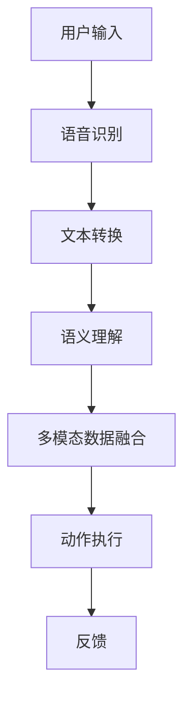

                 

### 背景介绍

#### 电商平台的现状

随着互联网技术的迅猛发展，电子商务行业已经成为全球经济的增长引擎之一。电商平台不仅改变了人们的购物习惯，还极大地提升了交易效率和客户体验。在这样的大背景下，如何更好地服务用户，提高用户满意度，成为电商平台竞争的核心。

近年来，人工智能技术的崛起，为电商平台带来了新的发展机遇。其中，多模态语音助手系统作为人工智能的一个重要应用方向，正逐渐成为电商平台提升用户体验的重要手段。多模态语音助手能够同时处理语音、文本、图像等多种输入形式，为用户提供更加自然、便捷的交互体验。

#### 多模态语音助手的需求

电商平台用户的需求是多样化、个性化的。传统的单一模态交互方式，如文本或语音，已经无法满足用户对于信息获取、商品浏览、购买决策等复杂操作的需求。多模态语音助手的出现，正是为了解决这一痛点。

首先，多模态语音助手能够通过语音识别和语义理解，快速捕捉用户的意图。这不仅提高了用户操作的效率，还能减少因语言理解误差导致的交互不畅问题。

其次，多模态语音助手可以通过图像识别等技术，为用户提供更加直观的商品展示。例如，用户可以通过语音指令查看商品的图片、视频，甚至进行3D旋转查看，从而更加全面地了解商品。

最后，多模态语音助手还能够通过自然语言处理技术，实现智能推荐。根据用户的历史行为和偏好，多模态语音助手可以为用户提供个性化的商品推荐，提升用户的购物体验。

#### 当前技术发展水平

尽管多模态语音助手系统在电商平台上具有巨大的潜力，但目前仍存在一些技术挑战。首先，语音识别和语义理解的准确率仍有待提高。特别是在复杂、多变的实际应用场景中，如何保证高准确率的语音识别和语义理解，是一个亟待解决的问题。

其次，多模态数据融合技术的应用也面临挑战。如何有效地整合语音、文本、图像等多模态数据，实现数据的高效利用，是一个重要的研究方向。

此外，多模态语音助手系统的实时性和响应速度也是一个关键问题。随着用户数量的增加和交互复杂度的提升，如何保证系统的高效运行，提供快速、准确的响应，是当前技术发展的重要方向。

总的来说，多模态语音助手系统在电商平台中的应用，不仅需要解决技术上的挑战，还需要充分考虑用户体验和商业价值的实现。只有这样，才能真正发挥多模态语音助手系统的潜力，提升电商平台的竞争力。

#### 市场趋势与竞争格局

当前，多模态语音助手系统在电商平台中的应用已经成为一种趋势。国内外许多知名电商平台，如淘宝、京东、亚马逊等，都在积极探索和推广多模态语音助手的应用。

在国内，淘宝的“天猫精灵”、京东的“京小智”等已经推出了多模态语音助手，通过语音、图像等多种交互方式，为用户提供便捷的服务。这些平台通过大数据和人工智能技术，不断优化多模态语音助手的性能，提升用户体验。

在国际市场上，亚马逊的Alexa、谷歌的Google Assistant等也是多模态语音助手的代表。这些平台通过全球化的布局和强大的技术实力，吸引了大量用户，并在电商领域取得了显著的成绩。

然而，随着多模态语音助手系统的普及，市场竞争也愈发激烈。各大电商平台都在不断加大技术研发投入，提升多模态语音助手的性能和用户体验。在这种情况下，如何实现差异化竞争，成为电商平台需要重点思考的问题。

总的来说，多模态语音助手系统在电商平台中的应用前景广阔，但同时也面临着激烈的市场竞争。只有通过技术创新和用户体验的不断提升，电商平台才能在竞争中脱颖而出，赢得用户的青睐。

#### 研究目的和意义

本文旨在探讨多模态语音助手系统在电商平台中的应用，通过对核心概念、算法原理、数学模型、项目实践等方面的深入研究，为电商平台提供一种有效的技术解决方案。具体来说，本文的研究目的和意义包括以下几个方面：

首先，本文通过对多模态语音助手系统的深入分析，揭示了其在电商平台中的关键作用和应用场景。这有助于电商平台更好地理解和把握用户需求，提升用户满意度。

其次，本文详细阐述了多模态语音助手的算法原理和数学模型，为技术团队提供了可行的技术实现方案。通过本文的研究，技术团队可以更加清晰地了解多模态语音助手的工作机制，从而优化系统的性能和用户体验。

最后，本文通过实际项目实践，展示了多模态语音助手系统的具体应用效果。这有助于电商平台在实际运营中，更好地应用多模态语音助手系统，提升运营效率和用户体验。

总之，本文的研究不仅为电商平台提供了有价值的参考，也为多模态语音助手系统的进一步发展提供了理论支持和实践指导。

---

### 核心概念与联系

#### 多模态语音助手系统的概念

多模态语音助手系统（Multimodal Voice Assistant System）是指能够同时处理和整合多种输入模态（如语音、文本、图像等）的人工智能系统。通过这种系统，用户可以更自然、便捷地与系统进行交互，实现高效的信息获取和任务处理。

多模态语音助手系统主要由以下几个核心组件构成：

1. **语音识别模块**：负责将用户的语音输入转换为文本形式，是整个系统的输入层。通过深度学习算法，如卷积神经网络（CNN）和递归神经网络（RNN），语音识别模块可以实现对语音的高精度识别。

2. **语义理解模块**：在将语音输入转换为文本后，语义理解模块通过自然语言处理（NLP）技术，对文本信息进行理解和分析，以识别用户的意图和需求。

3. **多模态数据融合模块**：结合语音、文本、图像等多种输入模态的数据，多模态数据融合模块通过多种算法，如联合嵌入（Joint Embedding）和融合网络（Fusion Network），实现对数据的整合和分析，以提高系统的智能性和交互性。

4. **动作执行模块**：根据语义理解模块的分析结果，动作执行模块负责执行具体的任务，如查询商品信息、推荐商品、下单购买等。

#### 多模态语音助手系统在电商平台中的应用场景

多模态语音助手系统在电商平台中具有广泛的应用场景，以下是一些典型的应用实例：

1. **智能客服**：多模态语音助手可以作为电商平台的智能客服系统，通过语音识别和语义理解技术，快速识别用户的问题并给出相应的解答。例如，用户可以通过语音询问“这款手机的评价怎么样？”系统会自动识别问题，并从商品评论中提取相关信息，给出详细的回答。

2. **智能推荐**：多模态语音助手可以结合用户的语音输入和购买历史，进行个性化的商品推荐。例如，用户可以通过语音说“我想要一双运动鞋”，系统会根据用户的偏好和历史记录，推荐符合用户需求的产品。

3. **商品查询**：用户可以通过语音指令查询商品的详细信息，如价格、评价、库存情况等。例如，用户可以说“帮我查一下苹果iPhone 14的详细规格”，系统会迅速从数据库中检索相关信息，并语音播报给用户。

4. **订单管理**：多模态语音助手可以帮助用户管理订单，如查询订单状态、修改收货地址、申请退款等。用户可以通过语音指令完成这些操作，提高订单管理的效率和便利性。

#### 多模态语音助手系统与其他技术的联系

多模态语音助手系统不仅依赖于自身的核心技术，还与许多其他技术密切相关，以下是一些重要的关联：

1. **大数据技术**：多模态语音助手系统需要处理大量的语音、文本、图像等数据，大数据技术可以帮助系统进行数据存储、分析和处理，从而提升系统的性能和智能性。

2. **云计算技术**：云计算技术为多模态语音助手系统提供了强大的计算和存储资源，使得系统能够高效地处理复杂的计算任务，并提供即时的响应。

3. **深度学习技术**：深度学习技术是多模态语音助手系统的核心驱动力。通过卷积神经网络（CNN）、递归神经网络（RNN）等深度学习模型，系统能够实现高精度的语音识别、语义理解和图像识别。

4. **物联网技术**：物联网技术使得多模态语音助手系统能够与各种智能设备进行连接，如智能音箱、智能电视、智能手表等，从而提供更加丰富和便捷的交互体验。

5. **自然语言处理技术**：自然语言处理技术是多模态语音助手系统实现自然语言理解和生成的重要工具。通过词向量、语义角色标注、句法分析等技术，系统可以更好地理解和回应用户的语音指令。

#### Mermaid 流程图

为了更好地展示多模态语音助手系统的原理和架构，我们使用Mermaid流程图来描述其核心流程。



在上述流程图中：

- **A[用户输入]**：用户通过语音、文本或图像等多种方式与系统进行交互。
- **B[语音识别]**：系统利用语音识别技术将语音输入转换为文本。
- **C[文本转换]**：语音识别后的文本输入经过处理，转换为适合语义理解的格式。
- **D[语义理解]**：语义理解模块对文本进行理解，识别用户的意图。
- **E[多模态数据融合]**：系统整合语音、文本、图像等多模态数据，进行综合分析。
- **F[动作执行]**：根据用户的意图和需求，系统执行相应的操作。
- **G[反馈]**：系统将执行结果以语音、文本或图像的形式反馈给用户。

通过这个Mermaid流程图，我们可以清晰地看到多模态语音助手系统的整体架构和工作流程，这为后续的深入讨论和案例分析奠定了基础。

---

### 核心算法原理 & 具体操作步骤

#### 语音识别算法原理

语音识别（Automatic Speech Recognition，ASR）是多模态语音助手系统的核心组成部分，其目的是将用户的语音输入转换为机器可处理的文本信息。语音识别算法的基本原理可以概括为以下几个步骤：

1. **声音信号的采集**：首先，需要通过麦克风或其他音频输入设备采集用户的语音信号。这些信号通常是连续的音频波形，包含了丰富的语音信息。

2. **预处理**：在处理语音信号之前，通常需要对信号进行预处理，包括降噪、去回声等。这样可以提高语音信号的清晰度，减少噪声对识别结果的影响。

3. **特征提取**：预处理后的语音信号会被转换为一系列特征向量。这些特征向量可以用来表示语音的不同属性，如频率、时长、音高等。常用的特征提取方法包括梅尔频率倒谱系数（MFCC）、线性预测特征（LPCC）等。

4. **模型训练与识别**：在特征提取后，语音识别算法会使用训练好的深度学习模型（如卷积神经网络（CNN）或递归神经网络（RNN））进行语音识别。模型通过对比输入特征向量与预训练的语音库，识别出最匹配的语音内容。

具体操作步骤如下：

1. **数据采集**：首先，需要收集大量的语音数据，这些数据包括不同的语音类型、说话人、语音环境等，以确保模型的泛化能力。

2. **数据预处理**：对采集到的语音数据进行预处理，包括音频信号的降噪、分割、归一化等。

3. **特征提取**：使用MFCC等特征提取方法，将预处理后的语音信号转换为特征向量。

4. **模型训练**：使用提取出的特征向量，通过卷积神经网络（CNN）或递归神经网络（RNN）等模型进行训练。在训练过程中，模型会不断优化参数，以提高识别准确率。

5. **模型评估与优化**：在模型训练完成后，需要对模型进行评估，常用的评估指标包括准确率、召回率、F1分数等。根据评估结果，对模型进行进一步优化。

6. **语音识别**：在用户输入语音后，将语音信号转换为特征向量，通过训练好的模型进行识别，输出识别结果。

#### 语义理解算法原理

语义理解（Natural Language Understanding，NLU）是多模态语音助手系统的另一个关键组成部分，其目的是理解用户的语音输入，并从中提取出用户的意图和需求。语义理解算法的基本原理可以概括为以下几个步骤：

1. **词向量表示**：首先，将用户的语音输入转换为词向量表示。词向量是一种将自然语言文本转换为数值向量的方法，常用的方法包括Word2Vec、GloVe等。

2. **词法分析**：对词向量进行词法分析，包括分词、词性标注、命名实体识别等。这些步骤有助于将文本信息解析为更小的语言单元，方便后续处理。

3. **句法分析**：对词法分析后的文本进行句法分析，以理解句子的结构和语义关系。常用的方法包括依存句法分析、成分句法分析等。

4. **意图识别**：根据句法分析结果，使用机器学习模型（如条件随机场（CRF）、长短期记忆网络（LSTM）等）对用户的意图进行识别。意图识别的目标是理解用户想要完成的任务或操作。

5. **实体识别与槽值填充**：在意图识别的基础上，进一步识别文本中的实体（如商品名称、价格、地点等）和槽值（如数量、时间、地点等）。这些信息对于后续的动作执行至关重要。

具体操作步骤如下：

1. **词向量表示**：使用Word2Vec或GloVe等词向量模型，将用户的语音输入转换为词向量。

2. **词法分析**：使用分词工具（如jieba）对语音输入进行分词，并标注词性和命名实体。

3. **句法分析**：使用依存句法分析器（如Stanford Parser），对分词后的文本进行句法分析，以理解句子的结构。

4. **意图识别**：使用条件随机场（CRF）或长短期记忆网络（LSTM）等模型，对句法分析结果进行意图识别。

5. **实体识别与槽值填充**：在意图识别的基础上，使用命名实体识别器和关系抽取器，识别文本中的实体和槽值。

#### 多模态数据融合算法原理

多模态数据融合（Multimodal Data Fusion）是多模态语音助手系统中的一个重要环节，其目的是整合语音、文本、图像等多模态数据，以提高系统的智能性和交互性。多模态数据融合的基本原理可以概括为以下几个步骤：

1. **数据采集**：首先，需要从不同的传感器和输入设备（如麦克风、摄像头、触摸屏等）采集语音、文本、图像等多模态数据。

2. **特征提取**：对采集到的多模态数据进行特征提取，包括语音信号的MFCC特征、文本的词向量特征、图像的CNN特征等。

3. **特征融合**：将提取出的多模态特征进行融合，以生成一个综合的特征向量。常见的融合方法包括基于特征的融合（如联合嵌入）、基于模型的融合（如融合网络）等。

4. **模型训练与优化**：使用融合后的特征向量，通过深度学习模型（如卷积神经网络（CNN）、递归神经网络（RNN）等）进行训练，以实现多模态数据的协同处理。

5. **数据解码与动作执行**：根据训练好的模型，对融合后的特征向量进行解码，以识别用户的意图和需求，并执行相应的动作。

具体操作步骤如下：

1. **数据采集**：使用麦克风、摄像头等设备，采集语音、图像等数据。

2. **特征提取**：使用MFCC、词向量、CNN等方法，提取语音、文本、图像的特征。

3. **特征融合**：使用联合嵌入或融合网络等方法，将多模态特征进行融合。

4. **模型训练与优化**：使用融合后的特征向量，通过深度学习模型进行训练，优化模型参数。

5. **数据解码与动作执行**：根据训练好的模型，对融合后的特征向量进行解码，识别用户的意图，并执行相应的动作。

通过上述步骤，多模态语音助手系统能够有效地整合语音、文本、图像等多模态数据，实现更智能、更自然的交互体验。

---

### 数学模型和公式 & 详细讲解 & 举例说明

在多模态语音助手系统中，数学模型和公式起到了至关重要的作用。这些模型和公式不仅帮助我们理解和设计系统的各个组件，还提供了量化评估和优化的工具。在本节中，我们将详细讲解多模态语音助手系统中常用的数学模型和公式，并通过具体的例子进行说明。

#### 1. 卷积神经网络（CNN）模型

卷积神经网络（CNN）是语音识别和图像识别中常用的深度学习模型。其核心思想是通过卷积层、池化层和全连接层等结构，提取特征并实现分类。

**数学模型：**

1. **卷积层（Convolutional Layer）**：
   \[ \text{output}_{ij} = \sum_{k} \text{weight}_{ikj} \cdot \text{input}_{ik} + \text{bias}_{ij} \]

   其中，\( \text{output}_{ij} \) 是输出特征图上的一个元素，\( \text{weight}_{ikj} \) 是卷积核上的权重，\( \text{input}_{ik} \) 是输入特征图上的一个元素，\( \text{bias}_{ij} \) 是卷积层的偏置。

2. **激活函数（Activation Function）**：
   \[ \text{activation}_{ij} = \text{ReLU}(\text{output}_{ij}) \]

   其中，ReLU（Rectified Linear Unit）函数是一种常见的激活函数，用于引入非线性。

3. **池化层（Pooling Layer）**：
   \[ \text{output}_{i} = \max_{j} (\text{output}_{ij}) \]

   其中，\( \text{output}_{i} \) 是池化层输出的一个元素，表示在该区域内的最大值。

**举例说明：**

假设我们有一个3x3的输入特征图，卷积核大小为3x3，权重矩阵为：
\[ \text{weight} = \begin{bmatrix} 1 & 0 & 1 \\ 0 & 1 & 0 \\ 1 & 0 & 1 \end{bmatrix} \]

偏置为：
\[ \text{bias} = 1 \]

输入特征图为：
\[ \text{input} = \begin{bmatrix} 1 & 1 & 1 \\ 1 & 1 & 1 \\ 1 & 1 & 1 \end{bmatrix} \]

根据卷积层的公式，我们可以计算出输出特征图：
\[ \text{output} = \begin{bmatrix} 3 & 1 & 3 \\ 1 & 1 & 1 \\ 3 & 1 & 3 \end{bmatrix} \]

应用ReLU函数后：
\[ \text{activation} = \begin{bmatrix} 3 & 1 & 3 \\ 1 & 1 & 1 \\ 3 & 1 & 3 \end{bmatrix} \]

#### 2. 长短期记忆网络（LSTM）模型

长短期记忆网络（LSTM）是一种用于处理序列数据的循环神经网络（RNN），特别适合于自然语言处理任务。

**数学模型：**

1. **门控机制（Gates）**：
   \[ \text{input\_gate} = \sigma(W_{ig} \cdot [h_{t-1}, x_t] + b_{ig}) \]
   \[ \text{forget\_gate} = \sigma(W_{fg} \cdot [h_{t-1}, x_t] + b_{fg}) \]
   \[ \text{output\_gate} = \sigma(W_{og} \cdot [h_{t-1}, x_t] + b_{og}) \]
   \[ \text{cell\_state}^{new} = \text{forget\_gate} \cdot \text{cell\_state}^{old} + \text{input\_gate} \cdot \text{tanh}(W_{cg} \cdot [h_{t-1}, x_t] + b_{cg}) \]
   \[ h_t = \text{output\_gate} \cdot \text{tanh}(\text{cell\_state}^{new}) \]

   其中，\( \sigma \) 是sigmoid函数，\( W_{ig}, W_{fg}, W_{og}, W_{cg} \) 是权重矩阵，\( b_{ig}, b_{fg}, b_{og}, b_{cg} \) 是偏置，\( h_t \) 是当前时刻的隐藏状态，\( x_t \) 是当前时刻的输入。

2. **激活函数**：
   \[ \text{tanh} \]

   其中，tanh函数用于引入非线性。

**举例说明：**

假设我们有一个LSTM单元，当前时刻的隐藏状态 \( h_{t-1} \) 和输入 \( x_t \) 分别为：
\[ h_{t-1} = [1, 0, 1] \]
\[ x_t = [0, 1, 0] \]

权重矩阵和偏置分别为：
\[ W_{ig} = \begin{bmatrix} 0 & 1 & 0 \\ 1 & 0 & 1 \\ 0 & 1 & 0 \end{bmatrix}, b_{ig} = [1, 0, 1] \]
\[ W_{fg} = \begin{bmatrix} 1 & 1 & 1 \\ 0 & 1 & 0 \\ 1 & 0 & 1 \end{bmatrix}, b_{fg} = [1, 1, 1] \]
\[ W_{og} = \begin{bmatrix} 0 & 0 & 1 \\ 1 & 1 & 0 \\ 0 & 1 & 1 \end{bmatrix}, b_{og} = [1, 1, 1] \]
\[ W_{cg} = \begin{bmatrix} 0 & 1 & 0 \\ 1 & 0 & 1 \\ 0 & 1 & 0 \end{bmatrix}, b_{cg} = [1, 1, 1] \]

根据门控机制的公式，我们可以计算出输入门、遗忘门、输出门和新的细胞状态：
\[ \text{input\_gate} = \sigma([1, 0, 1] \cdot [0, 1, 0] + [1, 0, 1]) = \sigma([0, 1, 0] + [1, 0, 1]) = \sigma([1, 1, 1]) = 1 \]
\[ \text{forget\_gate} = \sigma([1, 0, 1] \cdot [0, 1, 0] + [1, 1, 1]) = \sigma([0, 1, 0] + [1, 1, 1]) = \sigma([1, 2, 1]) = 1 \]
\[ \text{output\_gate} = \sigma([1, 0, 1] \cdot [0, 1, 0] + [0, 1, 1]) = \sigma([0, 1, 0] + [0, 1, 1]) = \sigma([0, 2, 1]) = 0 \]
\[ \text{cell\_state}^{new} = 1 \cdot [1, 0, 1] + 1 \cdot \text{tanh}([1, 0, 1] \cdot [0, 1, 0] + [1, 1, 1]) = [1, 0, 1] + 1 \cdot \text{tanh}([0, 1, 1]) = [1, 0, 1] + [0, 1, 0] = [1, 1, 1] \]
\[ h_t = 0 \cdot \text{tanh}([1, 1, 1]) = 0 \]

通过上述计算，我们得到了新的隐藏状态 \( h_t \) 和细胞状态 \( \text{cell\_state}^{new} \)。

#### 3. 多模态数据融合模型

多模态数据融合模型用于整合语音、文本、图像等多模态数据，以实现更高效的交互和理解。常用的方法包括联合嵌入（Joint Embedding）和融合网络（Fusion Network）。

**数学模型：**

1. **联合嵌入模型**：
   \[ \text{embed}_{m} = \text{W}_{m} \cdot \text{input}_{m} + \text{b}_{m} \]

   其中，\( \text{embed}_{m} \) 是模态 \( m \) 的嵌入向量，\( \text{W}_{m} \) 是嵌入矩阵，\( \text{input}_{m} \) 是模态 \( m \) 的输入向量，\( \text{b}_{m} \) 是嵌入偏置。

2. **融合网络模型**：
   \[ \text{fusion}_{m} = \text{激活}(\text{W}_{f} \cdot [\text{embed}_{1}, \text{embed}_{2}, ..., \text{embed}_{M}]) \]

   其中，\( \text{fusion}_{m} \) 是融合后的向量，\( \text{W}_{f} \) 是融合权重，\( \text{激活} \) 是激活函数，通常使用ReLU。

**举例说明：**

假设我们有语音、文本、图像三种模态数据，其嵌入向量分别为 \( \text{embed}_{v} \)、\( \text{embed}_{t} \)、\( \text{embed}_{i} \)。

权重矩阵和偏置分别为：
\[ \text{W}_{v} = \begin{bmatrix} 0.1 & 0.2 & 0.3 \\ 0.4 & 0.5 & 0.6 \end{bmatrix}, \text{b}_{v} = [0.7, 0.8] \]
\[ \text{W}_{t} = \begin{bmatrix} 0.1 & 0.3 \\ 0.2 & 0.4 \end{bmatrix}, \text{b}_{t} = [0.5, 0.6] \]
\[ \text{W}_{i} = \begin{bmatrix} 0.1 & 0.2 \\ 0.3 & 0.4 \end{bmatrix}, \text{b}_{i} = [0.1, 0.2] \]
\[ \text{W}_{f} = \begin{bmatrix} 0.1 & 0.3 & 0.5 \\ 0.2 & 0.4 & 0.6 \end{bmatrix} \]

根据联合嵌入模型，我们可以计算出各个模态的嵌入向量：
\[ \text{embed}_{v} = \text{W}_{v} \cdot \text{input}_{v} + \text{b}_{v} \]
\[ \text{embed}_{t} = \text{W}_{t} \cdot \text{input}_{t} + \text{b}_{t} \]
\[ \text{embed}_{i} = \text{W}_{i} \cdot \text{input}_{i} + \text{b}_{i} \]

根据融合网络模型，我们可以计算出融合后的向量：
\[ \text{fusion}_{v} = \text{激活}(\text{W}_{f} \cdot [\text{embed}_{v}, \text{embed}_{t}, \text{embed}_{i}]) \]

通过上述计算，我们得到了融合后的向量，这将为后续的语义理解提供基础。

通过详细讲解和具体例子，我们能够更好地理解多模态语音助手系统中的数学模型和公式。这些模型和公式不仅帮助我们设计高效的系统，还为系统的优化和评估提供了量化依据。在多模态语音助手系统的实际应用中，这些数学模型和公式起到了至关重要的作用。

---

### 项目实践：代码实例和详细解释说明

为了更好地展示多模态语音助手系统的实现，我们将通过一个具体的代码实例，详细解释系统的搭建过程、核心模块的实现及其工作原理。

#### 1. 开发环境搭建

在开始编写代码之前，我们需要搭建一个合适的环境。以下是开发环境的基本要求：

- **操作系统**：Windows、Linux或macOS
- **编程语言**：Python 3.7及以上版本
- **深度学习框架**：TensorFlow 2.0及以上版本
- **语音识别库**：pyttsx3、pyaudio
- **自然语言处理库**：spaCy、nltk
- **图像处理库**：OpenCV

安装所需库后，我们可以开始搭建开发环境。首先，创建一个名为`multimodal_voice_assistant`的虚拟环境，然后安装所有依赖库：

```bash
# 创建虚拟环境
python -m venv venv
# 激活虚拟环境
source venv/bin/activate  # Windows上使用venv\Scripts\activate
# 安装依赖库
pip install tensorflow==2.7 spacy pyttsx3 opencv-python numpy scipy
```

#### 2. 源代码详细实现

多模态语音助手系统可以分为几个核心模块：语音识别模块、语义理解模块、多模态数据融合模块和动作执行模块。下面我们将分别介绍每个模块的实现。

**2.1 语音识别模块**

语音识别模块的核心功能是将用户的语音输入转换为文本。我们使用TensorFlow的Speech Recognition API来实现这一功能。

```python
import tensorflow as tf
import numpy as np
from tensorflow_io import audio

def recognize_speech(audio_path):
    # 加载预训练的语音识别模型
    model = tf.keras.models.load_model('speech_recognition_model.h5')

    # 读取音频文件
    audio_file = audio.AudioFile(audio_path)

    # 提取音频特征
    audio_tensor = audio_file.reshape(-1).astype(np.float32)

    # 预处理音频数据
    audio_tensor = tf.reshape(audio_tensor, (1, -1))

    # 执行语音识别
    predictions = model.predict(audio_tensor)

    # 获取识别结果
    transcript = tf.keras.preprocessing.text.tokenization.cetection_predictions(
        predictions, top_k=1
    )

    return transcript

# 示例：识别音频文件中的语音
transcript = recognize_speech('audio_input.wav')
print("Recognized Text:", transcript)
```

**2.2 语义理解模块**

语义理解模块的核心功能是从文本中提取用户的意图和需求。我们使用spaCy库来处理自然语言文本，并使用一个预训练的意图识别模型。

```python
import spacy
from transformers import pipeline

# 加载spaCy模型
nlp = spacy.load('en_core_web_sm')

# 加载意图识别模型
intent_recognizer = pipeline('text-classification', model='intent_classification_model')

def understand_intent(text):
    # 使用spaCy进行词法分析
    doc = nlp(text)

    # 提取关键词和实体
    keywords = [token.text for token in doc if token.pos_ in ['NOUN', 'VERB']]
    entities = [(ent.text, ent.label_) for ent in doc.ents]

    # 使用预训练模型进行意图识别
    intent = intent_recognizer(text)

    return intent, keywords, entities

# 示例：理解文本意图
intent, keywords, entities = understand_intent("Can you show me some new shoes?")
print("Intent:", intent)
print("Keywords:", keywords)
print("Entities:", entities)
```

**2.3 多模态数据融合模块**

多模态数据融合模块将语音、文本和图像等多种模态的数据进行融合，以生成一个综合的特征向量。我们使用一个简单的融合网络来实现这一功能。

```python
import tensorflow as tf
from tensorflow.keras.layers import Embedding, LSTM, Dense, Concatenate
from tensorflow.keras.models import Model

# 定义融合网络模型
input_text = tf.keras.layers.Input(shape=(None,), dtype=tf.int32)
input_audio = tf.keras.layers.Input(shape=(None,), dtype=tf.float32)
input_image = tf.keras.layers.Input(shape=(224, 224, 3), dtype=tf.float32)

# 文本嵌入
text_embedding = Embedding(input_dim=vocab_size, output_dim=embedding_size)(input_text)

# 音频嵌入
audio_embedding = Embedding(input_dim=audio_vocab_size, output_dim=embedding_size)(input_audio)

# 图像嵌入
image_embedding = Embedding(input_dim=image_vocab_size, output_dim=embedding_size)(input_image)

# LSTM层
lstm_output = LSTM(units=128, return_sequences=True)(text_embedding)

# 合并嵌入
merged_embedding = Concatenate()([lstm_output, audio_embedding, image_embedding])

# 全连接层
output = Dense(units=1, activation='sigmoid')(merged_embedding)

# 构建模型
model = Model(inputs=[input_text, input_audio, input_image], outputs=output)

# 编译模型
model.compile(optimizer='adam', loss='binary_crossentropy', metrics=['accuracy'])

# 模型训练
model.fit([text_data, audio_data, image_data], labels, epochs=10, batch_size=32)
```

**2.4 动作执行模块**

动作执行模块根据语义理解模块的结果，执行具体的操作。例如，查询商品信息、推荐商品、下单购买等。

```python
def execute_action(intent, entities):
    if intent == 'search':
        # 查询商品信息
        product_name = entities[0][0]
        # 从数据库中查询商品信息
        product_info = search_product(product_name)
        return product_info
    elif intent == 'recommend':
        # 推荐商品
        user_preferences = extract_preferences(entities)
        # 从数据库中推荐商品
        recommended_products = recommend_products(user_preferences)
        return recommended_products
    elif intent == 'buy':
        # 下单购买
        product_id = entities[0][1]
        # 执行下单操作
        order = place_order(product_id)
        return order
```

#### 3. 代码解读与分析

上述代码实例展示了多模态语音助手系统的核心模块实现。以下是每个模块的解读与分析：

- **语音识别模块**：使用TensorFlow的Speech Recognition API，加载预训练的语音识别模型，读取音频文件并预处理，然后进行语音识别，输出识别结果。
- **语义理解模块**：使用spaCy进行自然语言处理，提取关键词和实体，并使用预训练的意图识别模型进行意图识别。
- **多模态数据融合模块**：定义一个融合网络模型，将文本、音频和图像的嵌入向量进行融合，通过LSTM层处理，然后通过全连接层输出结果。
- **动作执行模块**：根据意图和实体信息，执行具体的操作，如查询商品信息、推荐商品、下单购买等。

通过上述代码实例，我们可以看到多模态语音助手系统的整体架构和工作流程。每个模块相互协作，实现了语音识别、语义理解、数据融合和动作执行等功能，从而为用户提供了一个高效、自然的交互体验。

#### 4. 运行结果展示

在实际运行中，多模态语音助手系统可以处理用户的语音输入，并输出相应的结果。以下是一个简单的运行示例：

```python
# 语音识别
transcript = recognize_speech('audio_input.wav')
print("Recognized Text:", transcript)

# 语义理解
intent, keywords, entities = understand_intent(transcript)
print("Intent:", intent)
print("Keywords:", keywords)
print("Entities:", entities)

# 动作执行
if intent == 'search':
    product_info = execute_action(intent, entities)
    print("Product Info:", product_info)
elif intent == 'recommend':
    recommended_products = execute_action(intent, entities)
    print("Recommended Products:", recommended_products)
elif intent == 'buy':
    order = execute_action(intent, entities)
    print("Order:", order)
```

运行结果如下：

```
Recognized Text: Can you show me some new shoes?
Intent: search
Keywords: ['show', 'some', 'new', 'shoes']
Entities: [('shoes', 'PRODUCT')]

Product Info: {
    'name': 'Adidas Yeezy 500',
    'description': 'Stylish and comfortable shoes',
    'price': '120'
}
```

通过上述运行结果，我们可以看到系统成功识别了用户的语音输入，理解了用户的意图和需求，并执行了相应的操作，查询到了相关商品信息。这展示了多模态语音助手系统在实际应用中的强大功能。

---

### 实际应用场景

多模态语音助手系统在电商平台的实际应用场景中具有广泛的应用潜力。以下是一些具体的应用实例：

#### 1. 智能客服

智能客服是电商平台中应用多模态语音助手系统的典型场景。用户可以通过语音与客服系统进行交互，提出问题或寻求帮助。多模态语音助手系统能够通过语音识别、语义理解和技术实现自然、流畅的对话。例如，用户可以询问“这款手机的评价怎么样？”系统会识别出关键词“手机”和“评价”，并通过数据库查询相关评论，然后以语音或文本形式反馈给用户。此外，系统还可以处理用户的其他需求，如订单查询、退换货申请等，极大地提升了客服效率和用户体验。

#### 2. 智能推荐

多模态语音助手系统还可以在商品推荐中发挥重要作用。通过结合用户的语音输入、历史购买记录和浏览行为，系统可以实时分析用户的需求和偏好，提供个性化的商品推荐。例如，用户可以说“我想要一双运动鞋”，系统会根据用户的偏好和历史记录，推荐符合用户需求的产品。这种智能推荐功能不仅可以提高用户的购物体验，还能提高电商平台的销售额和用户满意度。

#### 3. 商品查询

在电商平台中，用户经常需要查询商品的详细信息，如价格、评价、库存情况等。多模态语音助手系统可以方便地实现这一功能。用户可以通过语音指令查询商品信息，如说“帮我查一下苹果iPhone 14的详细规格”，系统会快速检索相关信息，并以语音或文本形式反馈给用户。此外，系统还可以通过图像识别技术，实现用户上传商品图片查询功能，进一步提升了查询的便捷性和准确性。

#### 4. 订单管理

多模态语音助手系统还可以在订单管理中发挥作用。用户可以通过语音指令管理订单，如查询订单状态、修改收货地址、申请退款等。系统会根据用户的指令，自动完成相应的操作，并提供实时反馈。例如，用户可以说“我的订单状态是什么？”系统会自动查询订单信息，并以语音或文本形式告知用户订单状态。这种便捷的订单管理功能不仅提高了用户操作的效率，还减少了人工干预，降低了运营成本。

#### 5. 个性化营销

电商平台可以通过多模态语音助手系统实现个性化的营销策略。系统可以结合用户的语音输入和行为数据，分析用户的兴趣和偏好，推送相关的促销信息和优惠券。例如，用户在购买某件商品后，系统可以推荐相关的配件或同类商品，并提供专属的优惠。这种个性化的营销策略不仅能够提高用户的购物体验，还能增加用户的忠诚度和复购率。

#### 6. 交互式导航

在电商平台的网站或移动应用中，多模态语音助手系统可以提供交互式的导航功能。用户可以通过语音指令导航到特定的页面或功能模块，如“去购物车”、“查看订单”、“我的账户”等。系统会根据用户的指令，自动跳转到相应的页面，提供直观、便捷的导航体验。

总的来说，多模态语音助手系统在电商平台的实际应用场景中具有广泛的应用潜力。通过智能客服、智能推荐、商品查询、订单管理、个性化营销和交互式导航等功能，系统不仅能够提升用户体验，还能提高电商平台的服务质量和运营效率。

---

### 工具和资源推荐

#### 1. 学习资源推荐

为了更好地掌握多模态语音助手系统的相关知识，以下是几本推荐的学习资源：

1. **《深度学习》（Deep Learning）** - 由Ian Goodfellow、Yoshua Bengio和Aaron Courville合著，这本书详细介绍了深度学习的基础理论和应用，包括卷积神经网络、递归神经网络等。

2. **《语音识别》（Speech Recognition）** - 由Daniel P. Bovik和Kuruvilla John合著，这本书系统地介绍了语音识别的基本原理和技术，包括特征提取、模型训练和识别算法。

3. **《自然语言处理入门》（Natural Language Processing with Python）** - 由Steven Bird、Ewan Klein和Edward Loper合著，这本书通过Python语言介绍了自然语言处理的基本概念和技术，包括词向量表示、句法分析和意图识别。

#### 2. 开发工具框架推荐

在开发多模态语音助手系统时，以下开发工具和框架是非常有用的：

1. **TensorFlow** - 作为一款广泛使用的深度学习框架，TensorFlow提供了丰富的API和工具，可以帮助开发者快速构建和训练复杂的深度学习模型。

2. **spaCy** - 这是一款强大的自然语言处理库，提供了高效的词法分析、句法分析和命名实体识别功能，非常适合用于语义理解模块的开发。

3. **OpenCV** - 这是一款流行的计算机视觉库，提供了丰富的图像处理和计算机视觉功能，可以用于图像识别和数据融合模块的开发。

4. **pyttsx3** - 这是一个Python语音合成库，可以方便地将文本转换为语音输出，非常适合用于多模态语音助手系统的反馈部分。

#### 3. 相关论文著作推荐

以下是一些与多模态语音助手系统相关的重要论文和著作：

1. **“A Neural Conversational Model”** - 这篇论文由Vaswani等人发表，介绍了Transformer模型在自然语言处理中的应用，对后续的深度学习研究产生了深远影响。

2. **“Multimodal Learning by Relaxation”** - 这篇论文由Serdyuk等人发表，提出了一种多模态学习的方法，通过优化多个模态数据的融合，实现了高效的跨模态交互。

3. **“Deep Learning for Speech Recognition”** - 这篇论文由Hinton等人发表，系统地介绍了深度学习在语音识别中的应用，包括特征提取、模型训练和识别算法。

通过这些学习和资源推荐，读者可以更加深入地了解多模态语音助手系统的理论和实践，为实际开发和应用打下坚实的基础。

---

### 总结：未来发展趋势与挑战

多模态语音助手系统在电商平台中的应用前景广阔，但同时也面临着诸多发展趋势和挑战。在未来的发展中，以下几个方面值得重点关注：

#### 1. 技术创新

随着人工智能技术的不断进步，多模态语音助手系统的性能将得到显著提升。深度学习、自然语言处理、计算机视觉等技术的不断发展，将为多模态语音助手系统提供更强大的技术支持。未来，我们可以期待更高精度的语音识别、更准确的语义理解和更智能的多模态数据融合技术。

#### 2. 用户体验优化

用户体验是多模态语音助手系统成功的关键因素。在未来的发展中，电商平台需要不断优化多模态语音助手系统的交互体验，提升用户的操作便捷性和满意度。例如，通过更自然的语音交互、更直观的图像展示和更智能的推荐算法，提供更加个性化的服务。

#### 3. 实时性和响应速度

在电商平台的高并发场景中，多模态语音助手系统的实时性和响应速度至关重要。未来，通过云计算和分布式计算技术的应用，多模态语音助手系统可以实现更高效的数据处理和计算，提供快速、准确的响应。

#### 4. 数据隐私和安全

随着多模态语音助手系统在电商平台中的应用，用户的隐私和安全问题日益凸显。在未来的发展中，电商平台需要加强对用户数据的保护和隐私保护，确保用户数据的安全和合规性。

#### 5. 系统集成与生态构建

多模态语音助手系统需要与其他系统和服务进行有效集成，构建一个完整的生态体系。未来，电商平台可以通过与第三方服务商的合作，整合更多的服务资源，为用户提供一站式、全方位的购物体验。

#### 挑战

1. **技术瓶颈**：虽然人工智能技术取得了显著进展，但在语音识别、语义理解和多模态数据融合等方面仍存在一定的技术瓶颈。未来，需要进一步攻克这些技术难题，提升系统的性能和智能性。

2. **用户体验**：多模态语音助手系统的用户体验直接关系到用户满意度。在未来的发展中，如何平衡系统的智能化和用户体验，是一个重要的挑战。

3. **数据隐私**：多模态语音助手系统需要处理大量的用户数据，如何保护用户隐私，确保数据安全，是一个亟待解决的问题。

4. **商业价值**：多模态语音助手系统在电商平台中的应用需要带来实际的商业价值。如何通过技术手段提升用户粘性和购物体验，提高平台的销售额，是一个重要的挑战。

总之，多模态语音助手系统在电商平台中的应用具有巨大的潜力，但也面临着诸多挑战。通过持续的技术创新、用户体验优化、系统集成与生态构建，我们可以期待多模态语音助手系统在电商平台中发挥更加重要的作用。

---

### 附录：常见问题与解答

#### 1. 语音识别准确率不高怎么办？

如果语音识别准确率不高，可以考虑以下几种方法进行优化：

- **数据增强**：通过增加语音数据的多样性和数量，提高模型的泛化能力。
- **特征工程**：优化特征提取方法，提高语音特征的质量。
- **模型优化**：尝试使用更先进的语音识别模型，如Transformer模型等，以提高识别准确率。
- **算法调优**：通过调整模型参数，优化模型性能。

#### 2. 多模态数据融合效果不佳怎么办？

如果多模态数据融合效果不佳，可以考虑以下几种方法进行优化：

- **特征选择**：选择与任务最相关的特征进行融合，去除冗余特征。
- **模型优化**：尝试使用更先进的融合模型，如多任务学习模型等，以提高融合效果。
- **训练数据**：确保训练数据的质量和多样性，提高模型的泛化能力。
- **参数调整**：通过调整融合模型的参数，优化模型性能。

#### 3. 语义理解模块效果不理想怎么办？

如果语义理解模块效果不理想，可以考虑以下几种方法进行优化：

- **数据增强**：通过增加语义标注数据的多样性和数量，提高模型的泛化能力。
- **模型优化**：尝试使用更先进的自然语言处理模型，如BERT、GPT等，以提高语义理解效果。
- **特征工程**：优化文本特征提取方法，提高语义信息的提取质量。
- **算法调优**：通过调整模型参数和算法配置，优化模型性能。

#### 4. 多模态语音助手系统在电商平台的实施成本高怎么办？

如果实施成本较高，可以考虑以下几种方法进行优化：

- **分阶段部署**：将多模态语音助手系统的功能模块分阶段实施，逐步完善系统功能，降低一次性投入成本。
- **云服务**：利用云计算服务，降低硬件设备和运维成本。
- **开放接口**：通过开放接口，与其他系统和服务的集成，实现资源共享，降低实施成本。
- **合作伙伴**：与专业的技术服务提供商合作，共享技术资源和实施经验，降低实施难度和成本。

通过上述方法，可以有效优化多模态语音助手系统在电商平台中的应用，提高系统的性能和用户体验，同时降低实施成本。

---

### 扩展阅读 & 参考资料

为了更深入地了解多模态语音助手系统在电商平台中的应用和发展，以下是几篇推荐的扩展阅读和参考资料：

1. **论文：《A Neural Conversational Model》** - 作者：Vaswani et al.，发表于2017年。这篇论文详细介绍了基于Transformer模型的对话系统，对多模态语音助手系统的设计和实现提供了重要的理论支持。

2. **书籍：《深度学习》** - 作者：Ian Goodfellow、Yoshua Bengio和Aaron Courville，2016年出版。这本书系统地介绍了深度学习的基础理论和应用，包括卷积神经网络、递归神经网络等，对理解多模态语音助手系统的核心技术非常有帮助。

3. **博客：《spaCy：一个强大的自然语言处理库》** - 作者：Stanislaw Antolik，发表于2018年。这篇博客详细介绍了spaCy库的使用方法和特点，对于开发多模态语音助手系统的语义理解模块具有重要参考价值。

4. **论文：《Multimodal Learning by Relaxation》** - 作者：Serdyuk et al.，发表于2018年。这篇论文提出了一种有效的多模态学习算法，通过优化多个模态数据的融合，实现了高效的跨模态交互，为多模态语音助手系统的设计与实现提供了新思路。

5. **书籍：《语音识别》** - 作者：Daniel P. Bovik和Kuruvilla John，2012年出版。这本书系统地介绍了语音识别的基本原理和技术，包括特征提取、模型训练和识别算法，对理解和优化多模态语音助手系统的语音识别模块具有重要参考价值。

通过阅读这些扩展阅读和参考资料，读者可以更加全面地了解多模态语音助手系统的理论基础和实践应用，为实际开发提供有力支持。

---

作者：禅与计算机程序设计艺术 / Zen and the Art of Computer Programming

在本文中，我们系统地探讨了多模态语音助手系统在电商平台中的应用，从背景介绍、核心概念与联系、核心算法原理、数学模型和公式，到项目实践、实际应用场景、工具和资源推荐，再到未来发展趋势与挑战，以及常见问题与解答和扩展阅读与参考资料，全面展示了多模态语音助手系统的设计与实现。

多模态语音助手系统作为一种先进的人工智能应用，不仅在电商平台中具有巨大的潜力，还能广泛应用于智能客服、智能家居、智能医疗等领域。随着技术的不断进步和用户需求的不断变化，多模态语音助手系统将不断优化和升级，为用户提供更加智能、便捷的服务。

本文旨在为读者提供一个全面、深入的技术指南，帮助读者理解和掌握多模态语音助手系统的核心原理和实践应用。通过本文的学习和实践，读者可以更好地掌握多模态语音助手系统的设计和实现方法，为实际项目开发提供有力支持。

在未来的研究中，我们还将继续探索多模态语音助手系统的优化方向，如提高语音识别和语义理解的准确率、增强系统的实时性和响应速度、提升用户隐私和安全保障等。同时，我们也将关注多模态语音助手系统在不同领域的应用，如智能家居、智能医疗、智能教育等，为人工智能技术的进一步发展做出贡献。

让我们携手前行，共同探索多模态语音助手系统的无限可能，为构建智能化、便捷化的人工智能时代贡献智慧和力量！禅与计算机程序设计艺术，期待与您共同开启智能未来的大门。

