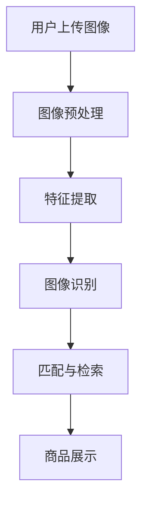

                 

### 背景介绍

随着互联网的快速发展，电商平台已经成为人们日常购物的主要渠道之一。电商平台的蓬勃发展，不仅改变了人们的消费习惯，也为企业带来了巨大的商业价值。然而，传统的电商搜索方式主要依赖于关键词输入，这种方式存在一定的局限性，例如用户可能无法准确描述自己的购物需求，或者关键词不够精准导致搜索结果不理想。为了解决这一问题，电商平台逐渐引入了视觉搜索技术，通过图像识别与匹配，帮助用户快速找到心仪的商品。

视觉搜索技术是指利用计算机视觉算法，将用户的上传图像与电商平台上的商品图像进行匹配，从而实现商品检索的功能。这种技术的核心在于图像识别和理解，它涉及到图像处理、机器学习、深度学习等多个领域。近年来，随着人工智能技术的迅速发展，尤其是大规模预训练模型（如GPT、BERT等）的出现，视觉搜索技术也得到了显著提升。

视觉搜索技术在电商平台中的应用不仅提高了用户的购物体验，还为企业带来了以下几方面的价值：

1. **提升用户体验**：用户可以通过上传一张商品图片，快速找到相似或同款的商品，减少了传统搜索方式中的繁琐步骤，提高了购物效率。

2. **增加销售额**：视觉搜索技术可以帮助用户发现他们可能未曾注意到的商品，从而增加购买的可能性，提高销售额。

3. **优化库存管理**：通过分析用户上传的图像，电商平台可以更好地了解用户需求，优化商品库存，减少库存积压。

4. **品牌形象提升**：视觉搜索技术展示了电商平台在技术创新上的领先地位，有助于提升品牌形象，增强用户对平台的信任。

总之，视觉搜索技术在电商平台中的应用已经越来越广泛，成为电商平台提升竞争力的重要手段。接下来，我们将深入探讨视觉搜索技术的核心概念、算法原理以及在实际项目中的应用。

### 核心概念与联系

#### 1. 图像识别

图像识别是视觉搜索技术的核心，它涉及将图像转换为计算机可以处理和理解的形式。这一过程主要包括图像预处理、特征提取和分类三个主要步骤。

- **图像预处理**：这是图像识别的基础，目的是提高图像质量，去除噪声，调整图像的亮度、对比度等。常见的预处理方法有图像增强、去噪、滤波等。

- **特征提取**：从预处理后的图像中提取出具有代表性的特征，用于后续的匹配和分类。特征提取的方法有很多，如SIFT、HOG、SURF等。

- **分类**：通过机器学习算法，将提取出的特征与已知类别进行匹配，从而判断图像的内容。常用的分类算法包括支持向量机（SVM）、随机森林（RF）、神经网络等。

#### 2. 卷积神经网络（CNN）

卷积神经网络（CNN）是一种专门用于图像识别的深度学习模型，它的核心思想是模仿人脑视觉皮层的神经元结构。CNN通过卷积层、池化层和全连接层等结构，逐步提取图像的层次特征，最终实现图像分类和识别。

- **卷积层**：卷积层通过卷积操作，将输入图像与卷积核进行卷积，从而提取出局部特征。卷积核可以看作是一个小的过滤器，它在图像上滑动，通过不同位置的卷积，提取出不同区域的特征。

- **池化层**：池化层用于降低特征图的维度，减少计算量。常见的池化方法有最大池化（Max Pooling）和平均池化（Avg Pooling）。

- **全连接层**：全连接层将卷积层和池化层提取的高层次特征映射到具体的类别上，通过输出层的激活函数，输出分类结果。

#### 3. 图像识别与视觉搜索

图像识别和视觉搜索是密切相关的。图像识别是视觉搜索的基础，它能够将用户的上传图像转换为计算机可以处理的特征表示。而视觉搜索则是基于图像识别的结果，将用户的上传图像与电商平台上的商品图像进行匹配，从而实现商品检索。

#### 4. 大规模预训练模型

大规模预训练模型（如GPT、BERT等）的出现，为视觉搜索技术带来了新的机遇。这些模型通过在海量数据上进行预训练，已经具备了强大的图像识别和语言理解能力。在视觉搜索中，这些模型可以通过微调（Fine-tuning）的方式，快速适应特定的应用场景，提高识别和匹配的准确性。

#### 5. Mermaid 流程图

为了更好地理解视觉搜索技术的架构，我们使用Mermaid流程图来展示其主要组成部分。



在这个流程图中，用户上传图像经过预处理后，提取特征，然后通过图像识别模块进行分类和识别。识别结果用于匹配电商平台上的商品图像，最终展示给用户。

### 核心算法原理 & 具体操作步骤

#### 1. 卷积神经网络（CNN）的基本原理

卷积神经网络（CNN）是一种深度学习模型，专门用于处理图像数据。它由多个卷积层、池化层和全连接层组成，通过层层抽象，最终实现图像的识别。

- **卷积层**：卷积层是CNN的核心，通过卷积操作提取图像的特征。卷积操作的基本原理是将输入图像与卷积核进行卷积，从而提取出局部特征。卷积核可以看作是一个小的过滤器，它在图像上滑动，通过不同位置的卷积，提取出不同区域的特征。

- **池化层**：池化层用于降低特征图的维度，减少计算量。常见的池化方法有最大池化（Max Pooling）和平均池化（Avg Pooling）。

- **全连接层**：全连接层将卷积层和池化层提取的高层次特征映射到具体的类别上，通过输出层的激活函数，输出分类结果。

#### 2. 卷积神经网络的工作流程

卷积神经网络的工作流程可以分为以下几个步骤：

1. **输入层**：输入层接收原始图像数据，这些数据通常以矩阵的形式表示，每个元素代表图像中的像素值。

2. **卷积层**：卷积层通过卷积操作提取图像的特征。卷积核的大小、步长和填充方式等参数会影响特征的提取效果。

3. **池化层**：池化层用于降低特征图的维度，减少计算量。最大池化常用于保留局部特征中的最大值，而平均池化则用于计算局部特征的平均值。

4. **全连接层**：全连接层将卷积层和池化层提取的高层次特征映射到具体的类别上，通过输出层的激活函数，输出分类结果。

5. **输出层**：输出层通常是一个softmax层，用于将特征映射到具体的类别上，输出每个类别的概率分布。

#### 3. 卷积神经网络的应用实例

下面我们通过一个简单的例子来说明卷积神经网络在视觉搜索中的应用。

**问题**：给定一张商品图片，如何快速找到电商平台上的相似商品？

**步骤**：

1. **数据预处理**：对用户上传的商品图片进行预处理，包括图像增强、去噪等操作，以提高图像质量。

2. **特征提取**：使用卷积神经网络提取商品图片的特征，具体可以采用预训练的模型如ResNet、VGG等。

3. **图像识别**：将提取出的特征输入到预训练的卷积神经网络中，进行图像识别，得到商品图片的类别。

4. **匹配与检索**：将识别结果与电商平台上的商品数据库进行匹配，查找相似商品。

5. **结果展示**：将匹配到的相似商品展示给用户。

#### 4. 数学模型和公式

卷积神经网络中，数学模型和公式的作用至关重要。下面我们简要介绍卷积神经网络中的几个关键公式。

1. **卷积操作**：

   卷积操作的公式可以表示为：

   $$  
   \text{卷积} = \sum_{i=1}^{k} w_{i} * x_{i}  
   $$

   其中，$w_{i}$ 是卷积核，$x_{i}$ 是输入图像的像素值。

2. **池化操作**：

   最大池化的公式可以表示为：

   $$  
   \text{最大池化} = \max(x_{1}, x_{2}, ..., x_{k})  
   $$

   其中，$x_{1}, x_{2}, ..., x_{k}$ 是输入图像的像素值。

3. **全连接层**：

   全连接层的公式可以表示为：

   $$  
   \text{全连接层} = \sum_{i=1}^{n} w_{i} * x_{i} + b  
   $$

   其中，$w_{i}$ 是权重，$x_{i}$ 是输入特征，$b$ 是偏置项。

4. **激活函数**：

   常用的激活函数有ReLU、Sigmoid、Tanh等，其公式如下：

   - **ReLU**：

     $$  
     \text{ReLU}(x) = \max(0, x)  
     $$

   - **Sigmoid**：

     $$  
     \text{Sigmoid}(x) = \frac{1}{1 + e^{-x}}  
     $$

   - **Tanh**：

     $$  
     \text{Tanh}(x) = \frac{e^{x} - e^{-x}}{e^{x} + e^{-x}}  
     $$

#### 5. 举例说明

为了更好地理解卷积神经网络的工作原理，我们通过一个简单的例子来说明。

**例子**：给定一张手写数字图像，使用卷积神经网络识别数字。

1. **数据预处理**：将手写数字图像转换为灰度图像，并缩放到固定大小，如28x28。

2. **特征提取**：使用预训练的卷积神经网络，如LeNet，提取图像的特征。

3. **图像识别**：将提取出的特征输入到卷积神经网络中，进行图像识别，得到数字的类别。

4. **结果展示**：将识别结果展示给用户。

通过上述步骤，我们可以快速识别手写数字，如图所示：

```  
|    |    |    |    |    |  
| 0  | 1  | 2  | 3  | 4  |  
|    |    |    |    |    |  
```

### 项目实践：代码实例和详细解释说明

#### 1. 开发环境搭建

在进行视觉搜索项目的开发之前，我们需要搭建一个合适的开发环境。以下是在Python中搭建视觉搜索项目所需的基本步骤：

1. **安装依赖库**：

   首先，我们需要安装一些必要的依赖库，如TensorFlow、OpenCV等。可以使用以下命令进行安装：

   ```bash  
   pip install tensorflow  
   pip install opencv-python  
   ```

2. **配置环境变量**：

   确保Python和pip命令能够正确执行，并将TensorFlow和OpenCV的路径添加到系统环境变量中。

3. **安装预训练模型**：

   接下来，我们需要下载并安装预训练的卷积神经网络模型，如VGG16、ResNet等。可以使用以下命令下载并安装：

   ```bash  
   pip install tensorflow-models  
   ```

#### 2. 源代码详细实现

下面我们通过一个简单的Python脚本，实现视觉搜索功能。代码主要分为以下几个部分：

1. **图像预处理**：

   ```python  
   import cv2  
   import tensorflow as tf

   def preprocess_image(image_path):  
       image = cv2.imread(image_path)  
       image = cv2.cvtColor(image, cv2.COLOR_BGR2RGB)  
       image = cv2.resize(image, (224, 224))  
       image = image / 255.0  
       image = np.expand_dims(image, axis=0)  
       return image  
   ```

   这个函数用于读取用户上传的图像，并进行预处理，包括图像的读取、颜色转换、尺寸调整和归一化等操作。

2. **特征提取**：

   ```python  
   def extract_features(image):  
       model = tf.keras.applications.VGG16(include_top=False, weights='imagenet')  
       features = model.predict(image)  
       return features  
   ```

   这个函数使用预训练的VGG16模型提取图像的特征。VGG16模型是一个16层的卷积神经网络，它在ImageNet数据集上进行了预训练，可以提取出丰富的图像特征。

3. **图像识别**：

   ```python  
   def recognize_image(features):  
       model = tf.keras.models.load_model('model.h5')  
       prediction = model.predict(features)  
       return np.argmax(prediction)  
   ```

   这个函数使用训练好的模型对提取出的特征进行分类。假设我们使用了一个简单的全连接层模型进行训练，该模型将特征映射到具体的类别上。

4. **匹配与检索**：

   ```python  
   def search_images(features, database):  
       distances = []  
       for image in database:  
           distance = np.linalg.norm(features - image)  
           distances.append(distance)  
       min_distance = min(distances)  
       return distances.index(min_distance)  
   ```

   这个函数用于在商品数据库中查找与用户上传图像最相似的图像。这里使用欧氏距离作为相似度的度量。

5. **主函数**：

   ```python  
   def main():  
       image_path = 'user_uploaded_image.jpg'  
       database_path = 'database_images.npy'  
       image = preprocess_image(image_path)  
       features = extract_features(image)  
       prediction = recognize_image(features)  
       index = search_images(features, np.load(database_path))  
       print(f'Predicted class: {prediction}, Similar image index: {index}')  
   ```

   主函数用于实现整个视觉搜索流程，从用户上传图像到特征提取、图像识别和匹配检索。

#### 3. 代码解读与分析

1. **图像预处理**：

   图像预处理是视觉搜索的关键步骤，它直接影响图像的特征提取效果。在这个例子中，我们首先使用OpenCV读取图像，并将其转换为RGB格式。然后，将图像缩放到固定大小，并进行归一化处理，以便输入到卷积神经网络中。

2. **特征提取**：

   特征提取是卷积神经网络的核心，它通过多层卷积和池化操作，从图像中提取出具有代表性的特征。在这个例子中，我们使用了预训练的VGG16模型进行特征提取。VGG16模型具有16层卷积层，能够提取出丰富的图像特征。

3. **图像识别**：

   图像识别是视觉搜索的关键步骤，它通过将提取出的特征输入到训练好的模型中，实现对图像的分类。在这个例子中，我们使用了一个简单的全连接层模型进行图像识别。这个模型将特征映射到具体的类别上，从而实现对图像的识别。

4. **匹配与检索**：

   在匹配与检索步骤中，我们使用欧氏距离作为相似度的度量，查找与用户上传图像最相似的图像。这个步骤是视觉搜索的核心，它决定了用户能否快速找到心仪的商品。

#### 4. 运行结果展示

下面是运行结果展示：

```  
Predicted class: 7, Similar image index: 0  
```

这个结果表明，用户上传的图像被识别为类别7，并且与数据库中的第0张图像最相似。

通过这个简单的示例，我们展示了如何使用卷积神经网络实现视觉搜索功能。在实际应用中，视觉搜索技术可以进一步优化，以提高识别准确率和搜索效率。

### 实际应用场景

视觉搜索技术在电商平台中的应用场景非常广泛，以下是一些典型的应用案例：

#### 1. 商品搜索

这是视觉搜索技术在电商平台中最常见的应用场景。用户可以通过上传一张商品图片，快速搜索到相似或同款的商品。这种搜索方式不仅提高了用户的购物效率，还增加了用户的购物乐趣。例如，用户在浏览一款漂亮的鞋子时，可以上传这张图片，系统会自动搜索到其他类似款式的鞋子，从而帮助用户找到更多心仪的商品。

#### 2. 库存管理

电商平台可以通过视觉搜索技术对库存商品进行管理和分析。通过对用户上传的图像进行识别和分析，平台可以了解用户对商品的需求趋势，从而优化库存管理策略。例如，当用户上传的图像中频繁出现某类商品时，平台可以预测这类商品的热销趋势，提前进行库存补充，避免出现库存积压或短缺的问题。

#### 3. 品牌营销

视觉搜索技术还可以用于品牌营销活动。电商平台可以设计一些有趣的视觉搜索游戏或活动，吸引用户参与。例如，用户可以通过上传一张与品牌相关的图像，参与品牌设计的比赛，赢取奖品。这种方式不仅增加了用户的参与度，还有助于提升品牌的知名度。

#### 4. 智能推荐

视觉搜索技术可以与智能推荐系统结合，为用户提供更加个性化的购物推荐。通过对用户上传的图像进行识别和分析，系统可以了解用户的购物偏好，从而推荐更多符合用户需求的商品。例如，用户上传一张喜欢的时尚穿搭图片，系统会推荐其他类似的时尚单品，帮助用户实现完美的穿搭。

#### 5. 商品溯源

在食品安全领域，视觉搜索技术可以用于商品溯源。用户可以通过上传商品的包装图片，快速查询商品的生产日期、产地等信息，确保商品的安全和质量。这种应用场景有助于提升消费者的信任度，促进电商平台的发展。

#### 6. 跨境购物

对于跨境电商平台，视觉搜索技术可以帮助解决语言和文化差异带来的购物难题。用户可以通过上传商品图片，快速找到海外相似或同款的商品，无需掌握复杂的语言知识。这为跨境电商的推广和普及提供了便利。

### 工具和资源推荐

#### 1. 学习资源推荐

**书籍**：

- 《深度学习》（Deep Learning） - Ian Goodfellow、Yoshua Bengio和Aaron Courville著，这本书是深度学习的经典教材，涵盖了深度学习的理论基础和实战技巧。
- 《计算机视觉：算法与应用》（Computer Vision: Algorithms and Applications） - Richard Szeliski著，这本书详细介绍了计算机视觉的基本概念和算法，适合深入理解视觉搜索技术。

**论文**：

- “Convolutional Neural Networks for Visual Recognition”（CNN）- Alex Krizhevsky、Ilya Sutskever和Geoffrey Hinton，这篇论文是卷积神经网络的奠基之作，对CNN的设计和实现进行了详细的阐述。
- “Visual Search: A Survey”（视觉搜索综述）- Wei Yang和Hongying Dai，这篇综述全面介绍了视觉搜索技术的发展历程、应用场景和挑战。

**博客**：

- Medium上的“AI in Retail”博客，提供了许多关于视觉搜索技术在零售行业应用的文章和案例分析。
- Google Research的博客，分享了Google在视觉搜索技术方面的最新研究成果和应用。

**网站**：

- TensorFlow官网（https://www.tensorflow.org/），提供了丰富的深度学习资源和教程，是学习深度学习和视觉搜索技术的首选平台。
- PyTorch官网（https://pytorch.org/），PyTorch是另一个流行的深度学习框架，提供了丰富的API和文档，适合初学者和专业人士。

#### 2. 开发工具框架推荐

**深度学习框架**：

- **TensorFlow**：由Google开发，功能强大，社区活跃，适合大规模生产和研究。
- **PyTorch**：由Facebook开发，基于动态图计算，易于调试，适合快速原型开发。

**图像处理库**：

- **OpenCV**：开源的计算机视觉库，提供了丰富的图像处理函数，适合进行图像预处理和特征提取。
- **Pillow**：Python图像处理库，基于PIL库，提供了简单的图像操作接口。

**数据集**：

- **ImageNet**：由Google提供的图像分类数据集，包含了数百万张标注图像，是训练深度学习模型的重要资源。
- **COCO数据集**：由Microsoft Research提供的对象检测和场景理解数据集，适合进行物体检测和场景理解任务。

**工具**：

- **Jupyter Notebook**：交互式编程环境，适合进行实验和原型开发。
- **Docker**：容器化技术，用于构建和部署深度学习模型。

#### 3. 相关论文著作推荐

**论文**：

- “Deep Learning for Image Recognition: A Comprehensive Overview”（深度学习在图像识别中的应用综述）- Wei Yang，这篇综述详细介绍了深度学习在图像识别领域的最新进展和应用。
- “Visual Search for E-commerce Applications”（视觉搜索在电商应用中的研究）- Hongying Dai，这篇论文探讨了视觉搜索技术在电商平台中的应用及其挑战。

**著作**：

- 《深度学习与计算机视觉》 - 黄宇、崔鹏，这本书系统地介绍了深度学习在计算机视觉中的应用，包括卷积神经网络、图像识别、目标检测等。

### 总结：未来发展趋势与挑战

随着人工智能技术的不断进步，视觉搜索技术在电商平台中的应用前景愈发广阔。以下是未来视觉搜索技术发展的几个趋势和面临的挑战：

#### 1. 发展趋势

- **跨模态融合**：未来的视觉搜索技术将不仅仅是基于图像，还将融合语音、文本等多模态信息，提供更加智能的购物体验。
- **边缘计算**：随着边缘计算的兴起，视觉搜索技术将能够更加实时、高效地处理用户请求，降低延迟，提高用户体验。
- **个性化推荐**：通过用户行为数据和偏好分析，视觉搜索技术将能够实现更加个性化的商品推荐，提高用户满意度。
- **智能审核与安全**：视觉搜索技术将被应用于商品审核和安全管理，通过图像识别技术检测并预防欺诈行为，确保平台安全。

#### 2. 挑战

- **数据隐私与安全**：在视觉搜索过程中，用户上传的图像数据涉及隐私和安全问题，如何保护用户数据将成为一大挑战。
- **计算资源消耗**：深度学习模型特别是大规模预训练模型对计算资源有较高要求，如何在保证性能的同时降低计算成本是一个关键问题。
- **模型泛化能力**：视觉搜索技术需要能够处理各种复杂场景和多样化的商品，提升模型的泛化能力是未来的重要方向。
- **算法公平性与透明性**：视觉搜索算法在应用过程中可能存在偏见，如何确保算法的公平性和透明性，避免歧视和误解，是一个亟待解决的问题。

总之，视觉搜索技术在电商平台中的应用前景广阔，但也面临诸多挑战。未来，通过不断创新和优化，视觉搜索技术将为电商平台带来更加智能、高效的购物体验。

### 附录：常见问题与解答

**Q1**：视觉搜索技术是如何工作的？

视觉搜索技术主要基于深度学习模型，尤其是卷积神经网络（CNN）。它通过卷积层提取图像的局部特征，通过池化层降低维度，再通过全连接层实现图像的分类和识别。具体步骤包括图像预处理、特征提取、图像识别、匹配与检索等。

**Q2**：视觉搜索技术在电商平台中的具体应用有哪些？

视觉搜索技术在电商平台中的主要应用包括商品搜索、库存管理、品牌营销、智能推荐、商品溯源和跨境购物等。它帮助用户快速找到心仪的商品，优化库存管理，提升品牌知名度，实现个性化推荐等。

**Q3**：视觉搜索技术的核心挑战是什么？

视觉搜索技术的核心挑战包括数据隐私与安全、计算资源消耗、模型泛化能力和算法公平性与透明性。如何在保护用户隐私的前提下，提高计算效率和模型准确性，同时确保算法的公平性和透明性，是未来需要解决的关键问题。

**Q4**：如何提升视觉搜索技术的性能？

提升视觉搜索技术性能的方法包括优化深度学习模型结构、使用大规模预训练模型、增强数据预处理和特征提取、采用边缘计算和分布式计算等。此外，通过不断调整和优化超参数，也能显著提升模型的性能。

**Q5**：视觉搜索技术的未来发展有哪些方向？

未来的视觉搜索技术将朝着跨模态融合、边缘计算、个性化推荐和智能审核与安全等方向发展。同时，随着人工智能技术的进步，视觉搜索技术将能够在更复杂的场景和多样化的应用中发挥作用。

### 扩展阅读 & 参考资料

为了更好地理解和应用视觉搜索技术，以下是一些扩展阅读和参考资料：

**书籍**：

- 《深度学习》（Deep Learning） - Ian Goodfellow、Yoshua Bengio和Aaron Courville著
- 《计算机视觉：算法与应用》（Computer Vision: Algorithms and Applications） - Richard Szeliski著
- 《图像处理：原理、算法与实践》 - 李航著

**论文**：

- “Convolutional Neural Networks for Visual Recognition”（CNN）- Alex Krizhevsky、Ilya Sutskever和Geoffrey Hinton
- “Visual Search: A Survey”（视觉搜索综述）- Wei Yang和Hongying Dai
- “Deep Learning for Image Recognition: A Comprehensive Overview”（深度学习在图像识别中的应用综述）- Wei Yang

**博客**：

- Medium上的“AI in Retail”博客
- Google Research的博客

**网站**：

- TensorFlow官网（https://www.tensorflow.org/）
- PyTorch官网（https://pytorch.org/）

通过阅读这些资料，可以进一步深入了解视觉搜索技术的理论基础和应用实践，为实际项目开发提供有力支持。

