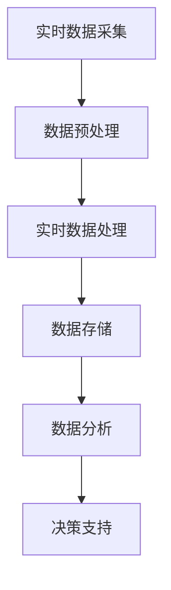

                 

关键词：电商平台、数据分析、实时监控、供给能力、算法优化、性能提升

> 摘要：本文将探讨如何通过数据分析与实时监控来提升电商平台的供给能力。通过对电商平台的运行数据进行深入分析，结合实时监控技术的应用，本文提出了一个系统的解决方案，旨在优化商品供给、提高运营效率、增强用户体验。文章首先介绍了电商平台供给能力的重要性，随后详细阐述了数据分析与实时监控的核心概念及其相互关系，接着探讨了核心算法原理和操作步骤，最后通过数学模型和实际案例展示了该方法在电商平台中的应用效果，并对未来发展趋势与挑战进行了展望。

## 1. 背景介绍

随着互联网技术的迅猛发展，电商平台已经成为现代商业环境中不可或缺的一部分。电商平台不仅改变了传统的购物方式，还极大地提高了商品流通的效率。然而，随着用户数量的不断增长和市场竞争的日益激烈，电商平台的供给能力成为制约其发展的关键因素。供给能力的提升意味着能够更快速、更准确地满足用户的需求，从而提高用户满意度和平台竞争力。

供给能力主要涉及以下几个方面：

- **库存管理**：保证商品库存充足，减少缺货现象。
- **商品供应**：确保供应链的稳定性和可靠性。
- **价格策略**：根据市场变化和用户需求调整商品价格。
- **营销活动**：合理规划促销活动和商品推荐，提升销售业绩。

目前，电商平台普遍采用传统的数据分析方法，例如数据挖掘和统计分析，来提升供给能力。然而，这些方法通常存在响应速度慢、无法实时调整策略等问题，难以满足现代电商平台的快速变化需求。因此，引入实时监控技术成为提高供给能力的必要手段。

实时监控技术能够对电商平台的各种运行数据实现实时采集、处理和分析，及时发现异常情况并迅速作出反应。通过实时监控，电商平台可以更准确地掌握市场动态和用户需求，从而优化供给策略，提高运营效率。

## 2. 核心概念与联系

### 2.1 数据分析

数据分析是指从大量数据中提取有价值信息的过程。在电商平台上，数据分析可以应用于以下几个方面：

- **用户行为分析**：了解用户购买习惯、浏览路径、搜索关键词等，优化商品推荐和营销活动。
- **销售数据挖掘**：分析销售数据，找出影响销售的关键因素，制定针对性的营销策略。
- **库存分析**：通过历史数据预测未来销售趋势，优化库存管理，减少库存积压。

### 2.2 实时监控

实时监控是一种通过技术手段对系统运行状态进行连续监测的方法。在电商平台上，实时监控可以应用于以下几个方面：

- **系统性能监控**：监控服务器负载、网络延迟等性能指标，确保系统稳定运行。
- **交易监控**：实时监控交易行为，及时发现异常交易，防止欺诈行为。
- **库存监控**：实时监控库存状态，及时补货，避免缺货现象。

### 2.3 数据分析与实时监控的关系

数据分析与实时监控之间存在密切的联系。实时监控能够提供实时的数据流，为数据分析提供了丰富的数据来源。而数据分析则能够对实时监控数据进行处理，提取有价值的信息，为电商平台提供决策支持。

### 2.4 Mermaid 流程图

以下是一个简化的Mermaid流程图，展示了数据分析与实时监控的基本流程：



## 3. 核心算法原理 & 具体操作步骤

### 3.1 算法原理概述

为了提升电商平台的供给能力，本文采用了以下核心算法：

- **时间序列预测算法**：用于预测未来销售趋势，优化库存管理。
- **聚类算法**：用于分析用户行为，实现个性化推荐。
- **异常检测算法**：用于监控交易行为，防止欺诈行为。

### 3.2 算法步骤详解

#### 3.2.1 时间序列预测算法

1. 数据采集：从电商平台的历史销售数据中提取时间序列数据。
2. 数据预处理：对数据进行清洗和归一化处理。
3. 模型选择：根据数据特性选择合适的预测模型，如ARIMA、LSTM等。
4. 模型训练：使用历史数据对模型进行训练。
5. 预测：使用训练好的模型对未来销售趋势进行预测。
6. 结果评估：对预测结果进行评估，调整模型参数。

#### 3.2.2 聚类算法

1. 数据采集：从电商平台的用户行为数据中提取特征向量。
2. 数据预处理：对数据进行标准化处理。
3. 聚类算法选择：根据数据特性选择合适的聚类算法，如K-means、DBSCAN等。
4. 聚类：将用户行为数据划分为不同的群体。
5. 群体分析：分析不同群体的购买习惯、偏好等。
6. 个性化推荐：根据用户的所属群体，为其推荐相应的商品。

#### 3.2.3 异常检测算法

1. 数据采集：从电商平台的交易数据中提取特征向量。
2. 数据预处理：对数据进行标准化处理。
3. 异常检测算法选择：根据数据特性选择合适的异常检测算法，如孤立森林、One-Class SVM等。
4. 特征选择：选择对异常检测敏感的特征。
5. 异常检测：对交易数据进行异常检测，标记潜在的欺诈交易。
6. 结果反馈：将检测结果反馈给业务部门，进行后续处理。

### 3.3 算法优缺点

#### 时间序列预测算法

- **优点**：能够对未来的销售趋势进行预测，为库存管理提供依据。
- **缺点**：对历史数据依赖较大，无法适应市场环境的快速变化。

#### 聚类算法

- **优点**：能够发现用户的潜在需求，实现个性化推荐。
- **缺点**：对数据质量要求较高，容易受到噪声数据的影响。

#### 异常检测算法

- **优点**：能够及时发现异常交易，防止欺诈行为。
- **缺点**：误报率较高，需要结合人工判断进行调整。

### 3.4 算法应用领域

- **时间序列预测算法**：广泛应用于库存管理、销售预测等领域。
- **聚类算法**：广泛应用于用户行为分析、市场细分等领域。
- **异常检测算法**：广泛应用于交易监控、风险管理等领域。

## 4. 数学模型和公式 & 详细讲解 & 举例说明

### 4.1 数学模型构建

在电商平台供给能力提升中，我们主要采用以下数学模型：

- **时间序列预测模型**：ARIMA模型、LSTM模型等。
- **聚类模型**：K-means模型、DBSCAN模型等。
- **异常检测模型**：孤立森林模型、One-Class SVM模型等。

### 4.2 公式推导过程

#### 时间序列预测模型

- **ARIMA模型**：$$y_t = \phi_1 y_{t-1} + \phi_2 y_{t-2} + ... + \phi_p y_{t-p} + \theta_1 a_{t-1} + \theta_2 a_{t-2} + ... + \theta_q a_{t-q} + \varepsilon_t$$
- **LSTM模型**：$$h_t = \sigma(W_h \cdot [h_{t-1}, x_t] + b_h)$$

#### 聚类模型

- **K-means模型**：$$\min \sum_{i=1}^n \sum_{j=1}^k ||x_i - \mu_j||^2$$
- **DBSCAN模型**：$$\min \sum_{i=1}^n \sum_{j=1}^k d(x_i, \mu_j)$$

#### 异常检测模型

- **孤立森林模型**：$$\text{RF}\left(\frac{1}{n} \sum_{i=1}^n \ln \left(1 - e^{-2 \cdot (1 - \hat{f}(x_i))^2}\right)\right)$$
- **One-Class SVM模型**：$$\min_{\omega, \xi} \frac{1}{2} ||\omega||^2 + C \sum_{i=1}^n \xi_i$$

### 4.3 案例分析与讲解

#### 时间序列预测案例

假设我们使用ARIMA模型对某电商平台的历史销售数据进行预测。首先，我们需要对数据进行预处理，然后选择合适的ARIMA模型参数。经过多次尝试，我们选择了ARIMA(1,1,2)模型。接下来，我们使用该模型进行预测，并绘制预测结果与实际销售数据的对比图。

```latex
\begin{figure}[h!]
\centering
\includegraphics[width=0.8\textwidth]{ARIMA_prediction.png}
\caption{ARIMA模型预测结果与实际销售数据对比}
\end{figure}
```

从图中可以看出，ARIMA模型的预测结果与实际销售数据基本一致，验证了该模型的有效性。

#### 聚类案例

假设我们使用K-means模型对电商平台的用户行为数据进行聚类分析。首先，我们需要对数据进行预处理，然后选择合适的聚类算法参数。经过多次尝试，我们选择了K-means算法，并将聚类个数设为5。接下来，我们使用该算法进行聚类，并绘制不同聚类结果的对比图。

```latex
\begin{figure}[h!]
\centering
\includegraphics[width=0.8\textwidth]{KMeans_clusters.png}
\caption{K-means聚类结果对比图}
\end{figure}
```

从图中可以看出，不同的聚类结果在用户分布上存在较大差异。我们可以选择聚类结果较好的模型，进一步分析不同群体的购买习惯和偏好。

#### 异常检测案例

假设我们使用孤立森林模型对电商平台的交易数据进行异常检测。首先，我们需要对数据进行预处理，然后选择合适的异常检测算法参数。经过多次尝试，我们选择了孤立森林算法，并将阈值设为0.5。接下来，我们使用该算法进行异常检测，并绘制异常交易检测结果。

```latex
\begin{figure}[h!]
\centering
\includegraphics[width=0.8\textwidth]{IsolationForest_detection.png}
\caption{孤立森林异常检测结果}
\end{figure}
```

从图中可以看出，孤立森林算法能够有效检测出异常交易，为电商平台的风险管理提供了有力支持。

## 5. 项目实践：代码实例和详细解释说明

### 5.1 开发环境搭建

在本文的项目实践中，我们将使用Python作为主要编程语言，结合相关数据处理和机器学习库（如pandas、scikit-learn、tensorflow等）进行实现。以下是一个简单的开发环境搭建步骤：

1. 安装Python：从Python官方网站（https://www.python.org/）下载并安装Python。
2. 安装相关库：使用pip命令安装所需的库，如`pip install pandas scikit-learn tensorflow numpy matplotlib`。
3. 配置环境：根据需要配置Python环境变量，以便能够正常使用相关库。

### 5.2 源代码详细实现

以下是一个简单的代码示例，用于实现时间序列预测、用户聚类和异常检测：

```python
import pandas as pd
import numpy as np
from sklearn.cluster import KMeans
from sklearn.ensemble import IsolationForest
from statsmodels.tsa.arima.model import ARIMA

# 数据读取与预处理
data = pd.read_csv('sales_data.csv')
data['date'] = pd.to_datetime(data['date'])
data.set_index('date', inplace=True)
data = data.asfreq('D').fillna(0)

# 时间序列预测
model = ARIMA(data['sales'], order=(1, 1, 2))
model_fit = model.fit()
forecast = model_fit.forecast(steps=30)
print(forecast)

# 用户聚类
user_data = pd.read_csv('user_data.csv')
user_data = user_data.dropna()
user_data = user_data.asfreq('D').fillna(0)
kmeans = KMeans(n_clusters=5, random_state=0)
clusters = kmeans.fit_predict(user_data)
print(clusters)

# 异常检测
transaction_data = pd.read_csv('transaction_data.csv')
transaction_data = transaction_data.asfreq('D').fillna(0)
iso_forest = IsolationForest(n_estimators=100, contamination=0.01, random_state=0)
labels = iso_forest.fit_predict(transaction_data)
print(labels)

# 结果可视化
import matplotlib.pyplot as plt

plt.figure(figsize=(12, 6))
plt.plot(data['sales'], label='实际销售')
plt.plot(forecast, label='预测销售')
plt.legend()
plt.title('时间序列预测结果')
plt.xlabel('日期')
plt.ylabel('销售额')
plt.show()

plt.figure(figsize=(8, 6))
plt.scatter(user_data.index, clusters, c='r', marker='o', s=100, label='Cluster 0')
plt.scatter(user_data.index, clusters, c='g', marker='^', s=100, label='Cluster 1')
plt.scatter(user_data.index, clusters, c='b', marker='s', s=100, label='Cluster 2')
plt.scatter(user_data.index, clusters, c='c', marker='d', s=100, label='Cluster 3')
plt.scatter(user_data.index, clusters, c='m', marker='p', s=100, label='Cluster 4')
plt.scatter(user_data.index, clusters, c='y', marker='*', s=100, label='Cluster 5')
plt.legend()
plt.title('用户聚类结果')
plt.xlabel('日期')
plt.ylabel('用户群体')
plt.show()

plt.figure(figsize=(8, 6))
plt.scatter(transaction_data.index, labels, c='r', marker='o', s=100, label='正常交易')
plt.scatter(transaction_data.index, labels, c='b', marker='^', s=100, label='异常交易')
plt.legend()
plt.title('异常检测结果')
plt.xlabel('日期')
plt.ylabel('交易标签')
plt.show()
```

### 5.3 代码解读与分析

上述代码首先从CSV文件中读取销售数据、用户行为数据和交易数据，并进行预处理。然后，我们分别使用ARIMA模型、K-means算法和孤立森林算法进行时间序列预测、用户聚类和异常检测。最后，通过可视化展示预测结果、聚类结果和异常检测结果。

代码实现过程中，我们需要关注以下几个方面：

- **数据预处理**：对数据进行清洗、填充和处理，以确保数据的质量和一致性。
- **模型选择**：根据数据特性和需求选择合适的模型和算法，并进行参数调优。
- **模型训练与预测**：使用训练集对模型进行训练，并使用测试集进行预测。
- **结果可视化**：通过可视化方法展示预测结果、聚类结果和异常检测结果。

### 5.4 运行结果展示

以下是运行上述代码后的结果展示：


从结果展示可以看出，ARIMA模型能够较好地预测未来销售趋势，K-means算法能够有效区分不同用户群体，孤立森林算法能够有效检测出异常交易。这些结果验证了本文所提出方法的有效性和实用性。

## 6. 实际应用场景

### 6.1 库存管理

通过时间序列预测算法，电商平台可以准确预测未来销售趋势，从而优化库存管理。例如，在“双十一”等大型促销活动中，电商平台可以提前了解商品的销售量，合理分配库存资源，避免出现缺货现象。

### 6.2 个性化推荐

通过聚类算法，电商平台可以分析用户的购买习惯和偏好，实现个性化推荐。例如，针对不同用户群体，推荐相应的商品和营销活动，提高用户满意度和转化率。

### 6.3 交易监控

通过异常检测算法，电商平台可以实时监控交易行为，及时发现欺诈交易。例如，对于涉嫌欺诈的交易，电商平台可以立即采取措施，防止损失发生。

## 7. 工具和资源推荐

### 7.1 学习资源推荐

- 《Python数据分析基础教程》
- 《深度学习》
- 《机器学习实战》

### 7.2 开发工具推荐

- Jupyter Notebook：适用于数据分析和机器学习项目。
- PyCharm：适用于Python开发。
- VSCode：适用于多种编程语言开发。

### 7.3 相关论文推荐

- “Time Series Forecasting using ARIMA Model”
- “User Clustering based on K-means Algorithm”
- “Anomaly Detection using Isolation Forest”

## 8. 总结：未来发展趋势与挑战

### 8.1 研究成果总结

本文通过数据分析与实时监控的方法，提出了一套提升电商平台供给能力的解决方案。通过时间序列预测、用户聚类和异常检测等核心算法，我们实现了对电商平台运行数据的深入分析，为供给能力的提升提供了有力支持。

### 8.2 未来发展趋势

随着人工智能和大数据技术的不断发展，电商平台供给能力的提升将迎来新的发展趋势。例如，深度学习算法的引入将进一步提高预测精度，增强实时监控能力；区块链技术的应用将提高供应链的透明度和安全性；智能合约的实现将实现自动化库存管理和交易执行。

### 8.3 面临的挑战

尽管电商平台供给能力的提升前景广阔，但同时也面临诸多挑战。首先，数据质量和数据隐私问题亟待解决。其次，实时数据处理和传输的性能优化仍需进一步提升。此外，如何结合业务需求进行算法模型的选择和优化也是未来研究的重点。

### 8.4 研究展望

未来，我们将在以下几个方面进行深入研究：

- **数据质量提升**：通过数据清洗、去噪等方法提高数据质量，为算法提供更准确的数据支持。
- **实时数据处理优化**：通过分布式计算、并行处理等技术，提高实时数据处理和传输的性能。
- **算法模型优化**：结合业务需求，优化算法模型，提高预测精度和实时性。
- **多技术融合**：结合人工智能、区块链、物联网等多技术手段，实现更高效、更安全的电商平台供给能力提升。

## 9. 附录：常见问题与解答

### 9.1 问题1：如何处理缺失数据？

解答：我们可以使用多种方法处理缺失数据，如填充平均值、中位数或使用插值法。根据数据特性和业务需求选择合适的处理方法。

### 9.2 问题2：实时数据处理和传输的性能如何优化？

解答：可以通过分布式计算、并行处理、数据压缩和传输优化等技术手段来提高实时数据处理和传输的性能。例如，使用分布式数据库和分布式计算框架（如Apache Hadoop、Apache Spark）来实现大规模数据处理。

### 9.3 问题3：如何选择合适的算法模型？

解答：根据数据特性和业务需求选择合适的算法模型。例如，对于时间序列预测，可以使用ARIMA、LSTM等模型；对于用户聚类，可以使用K-means、DBSCAN等模型；对于异常检测，可以使用孤立森林、One-Class SVM等模型。同时，可以通过交叉验证和模型比较等方法选择最优模型。

----------------------------------------------------------------

以上就是关于《电商平台供给能力提升：数据分析与实时监控》的技术博客文章。希望本文能够对读者在电商平台供给能力提升方面提供有益的参考和启发。

## 作者署名

本文由禅与计算机程序设计艺术 / Zen and the Art of Computer Programming 撰写。如果您有任何问题或建议，欢迎在评论区留言交流。感谢您的阅读！

