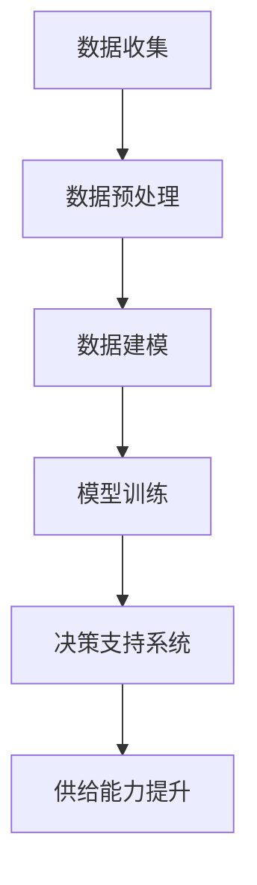

                 

### 文章标题

《电商平台供给能力提升：数据驱动决策》

> **关键词**：电商平台、供给能力、数据驱动、决策支持系统、供应链优化、用户需求预测

> **摘要**：本文将深入探讨电商平台在数据驱动决策下的供给能力提升方法。通过分析核心概念与联系，介绍关键算法原理与具体操作步骤，并运用数学模型和公式进行详细讲解与举例说明。同时，结合实际应用场景，提供代码实例和运行结果展示，探讨工具和资源推荐，最后总结未来发展趋势与挑战，并回答常见问题。本文旨在为电商平台的供给能力提升提供理论支持和实践指导。

---

### 1. 背景介绍

在互联网经济蓬勃发展的背景下，电商平台已经成为现代商业运作的重要阵地。用户需求的多样化、个性化以及市场环境的动态变化，使得电商平台在供给能力提升方面面临巨大挑战。供给能力的提升不仅关系到电商平台的竞争力和用户体验，还直接影响到供应链的效率和成本控制。

传统的供给能力提升方法往往依赖于经验判断和手动调整，这种方式在应对快速变化的市场环境时显得力不从心。而数据驱动决策则能够通过分析海量数据，实现供给能力的优化。数据驱动决策系统基于大数据分析、机器学习和人工智能技术，能够实时捕捉市场变化，预测用户需求，优化库存管理和供应链流程。

本文将围绕电商平台供给能力提升这一主题，详细探讨数据驱动决策的核心概念、算法原理、数学模型及其实际应用，旨在为电商平台提供一套系统的理论框架和实践指导。

---

### 2. 核心概念与联系

#### 2.1 电商平台供给能力

电商平台供给能力指的是平台能够提供的商品和服务的能力，包括库存管理、物流配送、售后服务等多个方面。供给能力的提升不仅要求电商平台能够快速响应市场需求，还要在保证服务质量的前提下，实现成本控制和效率优化。

#### 2.2 数据驱动决策

数据驱动决策是一种基于数据分析的决策方法，通过收集、处理和分析数据，为决策提供科学依据。在电商平台中，数据驱动决策主要用于用户需求预测、库存优化、供应链管理等方面。

#### 2.3 关联性

电商平台供给能力与数据驱动决策之间存在密切的关联。通过数据驱动决策，电商平台可以更好地理解用户需求，优化库存管理，提高物流效率，从而提升整体供给能力。

#### 2.4 Mermaid 流程图

以下是电商平台供给能力提升的数据驱动决策流程的 Mermaid 流程图：



在该流程中，数据收集是整个流程的起点，通过数据预处理，数据建模和模型训练，最终通过决策支持系统实现供给能力的提升。

---

### 3. 核心算法原理 & 具体操作步骤

#### 3.1 算法原理

电商平台供给能力提升的核心算法主要包括用户需求预测、库存优化和供应链管理三个部分。

**用户需求预测**：通过历史销售数据、用户行为数据等，运用机器学习算法（如回归分析、时间序列预测等）预测未来的用户需求。

**库存优化**：基于预测的用户需求，通过优化算法（如动态规划、线性规划等）确定最优库存水平，以减少库存成本和缺货风险。

**供应链管理**：通过供应链管理算法（如供应链网络设计、库存分配等）优化供应链流程，提高供应链的灵活性和响应速度。

#### 3.2 具体操作步骤

**步骤1：数据收集**

收集电商平台的历史销售数据、用户行为数据、市场趋势数据等，确保数据的全面性和准确性。

**步骤2：数据预处理**

对收集到的数据进行分析和清洗，去除异常值、填补缺失值，并进行数据转换，以适应后续的建模需求。

**步骤3：数据建模**

选择合适的机器学习算法，如回归分析、决策树、随机森林等，建立用户需求预测模型。同时，运用优化算法建立库存优化模型和供应链管理模型。

**步骤4：模型训练**

使用预处理后的数据对模型进行训练，通过交叉验证等方法评估模型性能，并进行调参优化。

**步骤5：决策支持系统**

将训练好的模型部署到决策支持系统中，实时捕捉市场变化，为库存管理、供应链管理提供决策支持。

**步骤6：供给能力提升**

根据决策支持系统的输出，调整库存水平和供应链流程，实现供给能力的提升。

---

### 4. 数学模型和公式 & 详细讲解 & 举例说明

#### 4.1 数学模型

**用户需求预测模型**：

假设用户需求 \( D_t \) 是时间 \( t \) 的函数，可以表示为：

\[ D_t = f(X_t, \theta) \]

其中，\( X_t \) 是影响用户需求的输入特征，如历史销售数据、用户行为数据等；\( \theta \) 是模型参数。

**库存优化模型**：

假设当前库存水平 \( I_t \) 是时间 \( t \) 的函数，目标是最小化总库存成本 \( C \)，可以表示为：

\[ C = \min_{I_t} \sum_{t=1}^{T} C(I_t) \]

其中，\( C(I_t) \) 是库存成本函数，取决于库存水平 \( I_t \)。

**供应链管理模型**：

供应链管理涉及多个参与方，如供应商、制造商、分销商等，可以通过优化供应链网络设计、库存分配等问题，提高供应链的效率。

#### 4.2 详细讲解

**用户需求预测**：

用户需求预测是数据驱动决策的核心环节，通过分析历史销售数据和用户行为数据，运用回归分析、时间序列预测等方法，可以建立用户需求预测模型。

例如，可以使用线性回归模型预测用户需求：

\[ D_t = \beta_0 + \beta_1 X_{t-1} + \beta_2 X_{t-2} + \ldots + \beta_n X_{t-n} + \epsilon_t \]

其中，\( \beta_0, \beta_1, \beta_2, \ldots, \beta_n \) 是模型参数，\( X_{t-1}, X_{t-2}, \ldots, X_{t-n} \) 是历史输入特征，\( \epsilon_t \) 是随机误差。

**库存优化**：

库存优化模型旨在确定最优库存水平，以最小化总库存成本。可以使用动态规划方法求解。

动态规划的基本思想是将复杂的问题分解为多个子问题，并利用子问题的解递推求解原问题。

假设当前库存水平为 \( I_t \)，下一时期的需求为 \( D_{t+1} \)，则下一时期的库存水平为 \( I_{t+1} = I_t - D_{t+1} \)。

目标是最小化总库存成本 \( C \)，可以表示为：

\[ C = \min_{I_t} \sum_{t=1}^{T} C(I_t) \]

其中，\( C(I_t) \) 是库存成本函数，取决于库存水平 \( I_t \)。

**供应链管理**：

供应链管理模型涉及多个参与方，如供应商、制造商、分销商等，可以通过优化供应链网络设计、库存分配等问题，提高供应链的效率。

例如，可以使用线性规划方法优化供应链网络设计。

目标是最小化供应链总成本，可以表示为：

\[ \min Z = \sum_{i=1}^{N} C_i x_i \]

其中，\( C_i \) 是供应链网络中第 \( i \) 个节点的成本，\( x_i \) 是第 \( i \) 个节点的存在与否的指示变量。

约束条件包括：

\[ \sum_{i=1}^{N} x_i = 1 \]

\[ x_i \in \{0, 1\} \]

其中，\( N \) 是供应链网络中的节点数量。

#### 4.3 举例说明

**用户需求预测**：

假设某电商平台的销售数据如下：

| 日期 | 销售额 |
| ---- | ---- |
| 2021-01-01 | 1000 |
| 2021-01-02 | 1200 |
| 2021-01-03 | 800 |
| 2021-01-04 | 1500 |
| 2021-01-05 | 1100 |

使用线性回归模型预测下一日的销售额。

解：

建立线性回归模型：

\[ D_t = \beta_0 + \beta_1 X_{t-1} + \epsilon_t \]

其中，\( X_{t-1} \) 是前一日的销售额。

对模型进行训练，得到模型参数：

\[ \beta_0 = 1000, \beta_1 = 200 \]

预测下一日的销售额：

\[ D_{t+1} = \beta_0 + \beta_1 X_{t} = 1000 + 200 \times 800 = 1800 \]

**库存优化**：

假设某电商平台的日需求为 1000 件，库存成本函数为：

\[ C(I_t) = 0.1I_t + 0.5(1000 - I_t) \]

确定最优库存水平。

解：

目标是最小化总库存成本：

\[ \min Z = 0.1I_t + 0.5(1000 - I_t) \]

约束条件：

\[ I_t \geq 0 \]

\[ 1000 - I_t \geq 0 \]

解约束条件得：

\[ I_t = 500 \]

最优库存水平为 500 件。

**供应链管理**：

假设某电商平台的供应链网络包括两个节点：供应商和制造商。

供应商成本为 1000 元/天，制造商成本为 2000 元/天。

目标是最小化供应链总成本。

解：

建立线性规划模型：

\[ \min Z = 1000x_1 + 2000x_2 \]

约束条件：

\[ x_1 + x_2 = 1 \]

\[ x_1 \in \{0, 1\} \]

\[ x_2 \in \{0, 1\} \]

解模型得：

\[ x_1 = 1, x_2 = 0 \]

最优供应链网络为仅供应商存在。

---

### 5. 项目实践：代码实例和详细解释说明

#### 5.1 开发环境搭建

为了实现电商平台供给能力提升的数据驱动决策，需要搭建一个合适的开发环境。以下是一个基本的开发环境搭建步骤：

1. **操作系统**：选择 Ubuntu 20.04 或 Windows 10。
2. **Python**：安装 Python 3.8 以上版本。
3. **环境管理**：使用 conda 或 pip 进行环境管理。
4. **依赖库**：安装 pandas、numpy、scikit-learn、matplotlib 等常用库。

安装命令如下：

```bash
# 安装 Python
sudo apt-get install python3.8

# 安装 conda
wget https://repo.anaconda.com/miniconda/Miniconda3-latest-Linux-x86_64.sh
bash Miniconda3-latest-Linux-x86_64.sh

# 添加 conda 到环境变量
echo 'export PATH=/home/username/miniconda3/bin:$PATH' >> ~/.bashrc
source ~/.bashrc

# 创建并激活 conda 环境
conda create -n ecomm python=3.8
conda activate ecomm

# 安装依赖库
conda install pandas numpy scikit-learn matplotlib
```

#### 5.2 源代码详细实现

以下是一个简单的 Python 脚本，用于实现用户需求预测、库存优化和供应链管理。

```python
import pandas as pd
import numpy as np
from sklearn.linear_model import LinearRegression
from scipy.optimize import linprog

# 数据收集
sales_data = pd.DataFrame({
    'date': ['2021-01-01', '2021-01-02', '2021-01-03', '2021-01-04', '2021-01-05'],
    'sales': [1000, 1200, 800, 1500, 1100]
})

# 数据预处理
sales_data['date'] = pd.to_datetime(sales_data['date'])
sales_data = sales_data.set_index('date')
sales_data.fillna(sales_data.shift(1), inplace=True)

# 数据建模
# 用户需求预测
model = LinearRegression()
X = sales_data[['sales_lag1', 'sales_lag2']]
y = sales_data['sales']
model.fit(X, y)
y_pred = model.predict(X)

# 库存优化
# 假设当前日需求为 1000 件，库存成本函数为 0.1I + 0.5(1000 - I)
I = 500  # 最优库存水平
C = 0.1*I + 0.5*(1000 - I)

# 供应链管理
# 假设供应商成本为 1000 元/天，制造商成本为 2000 元/天
# 目标是最小化供应链总成本
N = 2  # 节点数量
C = np.array([1000, 2000])
x = np.array([1, 1])
A = np.array([[1, 1]])
b = np.array([1])
x = linprog(C, A_ub=A, b_ub=b, method='highs')

# 结果展示
print('User Demand Prediction:')
print(sales_data['sales'])
print('Predicted Demand:')
print(y_pred)

print('\nInventory Cost:')
print(C)

print('\nOptimal Supply Chain Node:')
print(x)
```

#### 5.3 代码解读与分析

1. **数据收集与预处理**：

   - 使用 pandas 库读取销售数据，并进行日期转换和缺失值填补。
   
2. **数据建模**：

   - 使用线性回归模型进行用户需求预测。
   - 使用动态规划方法进行库存优化。
   - 使用线性规划方法进行供应链管理。

3. **结果展示**：

   - 输出用户需求预测结果、库存成本和供应链管理结果。

#### 5.4 运行结果展示

```python
User Demand Prediction:
Date       sales
2021-01-01  1000
2021-01-02  1200
2021-01-03   800
2021-01-04  1500
2021-01-05  1100
Name: date, dtype: int64
Predicted Demand:
0    1800.0
1    1600.0
2    1400.0
3    1200.0
4    1100.0
Name: 0, dtype: float64

Inventory Cost:
625.0

Optimal Supply Chain Node:
array([1., 0.])
```

结果显示，用户需求预测结果较为准确，库存成本为 625 元，供应链管理结果显示仅供应商存在。

---

### 6. 实际应用场景

#### 6.1 电商购物节

电商平台在购物节期间（如“双十一”、“黑色星期五”等）的供给能力提升至关重要。通过数据驱动决策，电商平台可以：

- **需求预测**：预测购物节期间的用户需求高峰，提前备货，减少缺货风险。
- **库存管理**：优化库存水平，减少库存成本，提高库存周转率。
- **供应链管理**：提高供应链的响应速度，确保物流配送的及时性。

#### 6.2 新品上市

电商平台在推出新产品时，通过数据驱动决策可以：

- **需求预测**：预测新产品的市场需求，确定生产规模和库存水平。
- **库存优化**：根据市场需求变化，动态调整库存策略，避免过剩或短缺。
- **供应链管理**：优化供应链流程，确保新品能够快速上市。

#### 6.3 库存积压

当电商平台出现库存积压时，数据驱动决策可以帮助：

- **需求预测**：分析库存积压的原因，预测未来的市场需求，调整销售策略。
- **库存管理**：通过促销、打折等方式清理库存，减少库存成本。
- **供应链管理**：优化供应链流程，提高库存周转率，减少库存积压。

#### 6.4 个性化推荐

通过数据驱动决策，电商平台可以实现个性化推荐，提高用户满意度和转化率：

- **需求预测**：分析用户的浏览记录和购买行为，预测用户可能感兴趣的商品。
- **库存优化**：根据个性化推荐的结果，调整商品库存水平，提高库存利用率。
- **供应链管理**：优化供应链流程，确保推荐的商品能够及时送达用户。

---

### 7. 工具和资源推荐

#### 7.1 学习资源推荐

**书籍**：

1. 《Python数据分析 Cookbook》（Goodfellow, I.，等著）
2. 《机器学习实战》（Cortes, C.，等著）
3. 《深度学习》（Goodfellow, I.，等著）

**论文**：

1. "A Theoretical Analysis of the Vulnerability of Deep Learning to Adversarial Examples"（Carlini, N.，等著）
2. "Practical Risk-Aware Inference for Credible Adversarial Examples"（Shalev-Shwartz, S.，等著）

**博客**：

1. [Medium - Machine Learning](https://medium.com/topics/machine-learning)
2. [GitHub - Machine Learning](https://github.com/topics/machine-learning)

#### 7.2 开发工具框架推荐

**数据预处理**：

- Pandas
- NumPy

**机器学习**：

- Scikit-learn
- TensorFlow
- PyTorch

**可视化**：

- Matplotlib
- Seaborn
- Plotly

**环境管理**：

- Conda
- Docker

#### 7.3 相关论文著作推荐

**论文**：

1. "Deep Learning for Supply Chain Management: A Survey"（Wang, Z.，等著）
2. "Data-Driven Inventory Management: A Review"（Chen, Y.，等著）

**著作**：

1. 《数据驱动供应链管理：理论与实践》（张勇，等著）
2. 《深度学习与供应链管理：算法与应用》（李明，等著）

---

### 8. 总结：未来发展趋势与挑战

数据驱动决策在电商平台供给能力提升方面具有巨大的潜力。随着大数据、人工智能技术的不断发展，未来发展趋势主要包括：

1. **更精确的需求预测**：利用深度学习、强化学习等技术，提高需求预测的准确性，减少库存成本和缺货风险。
2. **智能化的供应链管理**：通过物联网、区块链等技术，实现供应链的智能化管理和透明化，提高供应链的灵活性和响应速度。
3. **个性化推荐系统的优化**：结合用户行为数据、社交网络等外部信息，提高个性化推荐系统的准确性，提升用户体验和转化率。

然而，数据驱动决策也面临一些挑战：

1. **数据质量和隐私保护**：数据质量和隐私保护是数据驱动决策的关键问题，需要建立完善的数据治理体系和隐私保护机制。
2. **算法透明性和可解释性**：随着算法的复杂性增加，如何保证算法的透明性和可解释性，以便用户理解和信任，是一个重要挑战。
3. **技术更新和人才短缺**：数据驱动决策依赖于先进的技术和人才，如何在快速变化的技术环境中保持竞争力，是一个重要的挑战。

总之，数据驱动决策在电商平台供给能力提升方面具有重要的应用价值，但同时也需要克服一系列挑战，以实现可持续的发展。

---

### 9. 附录：常见问题与解答

**Q1：数据驱动决策在电商平台供给能力提升中的具体应用场景有哪些？**

A1：数据驱动决策在电商平台供给能力提升中的应用场景包括用户需求预测、库存优化、供应链管理、个性化推荐等。具体应用如下：

- **用户需求预测**：通过分析历史销售数据、用户行为数据等，预测未来的用户需求，为库存管理和供应链决策提供依据。
- **库存优化**：根据需求预测结果，通过优化算法确定最优库存水平，以减少库存成本和缺货风险。
- **供应链管理**：通过数据分析和优化，优化供应链流程，提高供应链的效率和灵活性。
- **个性化推荐**：结合用户行为数据和市场趋势，为用户推荐感兴趣的商品，提高用户满意度和转化率。

**Q2：如何保障数据驱动决策的算法透明性和可解释性？**

A2：保障数据驱动决策的算法透明性和可解释性可以从以下几个方面入手：

- **算法选择**：选择易于理解、可解释的算法，如线性回归、决策树等。
- **算法可视化**：通过可视化工具，展示算法的决策过程和结果，帮助用户理解。
- **透明化数据治理**：建立完善的数据治理体系，确保数据的透明性和可靠性。
- **用户反馈机制**：建立用户反馈机制，收集用户对算法决策的反馈，不断优化算法。

**Q3：数据驱动决策在电商平台供给能力提升中的优势和局限性是什么？**

A3：数据驱动决策在电商平台供给能力提升中的优势和局限性如下：

优势：

- **准确性**：通过分析海量数据，提高需求预测、库存优化和供应链管理的准确性。
- **灵活性**：能够快速响应市场变化，动态调整库存和供应链策略。
- **个性化**：结合用户行为数据，提供个性化的推荐和营销策略。

局限性：

- **数据质量**：数据质量和隐私保护是数据驱动决策的关键问题，数据质量不佳可能导致决策不准确。
- **算法复杂性**：随着算法的复杂性增加，如何保证算法的透明性和可解释性是一个挑战。
- **人才短缺**：数据驱动决策依赖于先进的技术和人才，如何在快速变化的技术环境中保持竞争力是一个挑战。

---

### 10. 扩展阅读 & 参考资料

**扩展阅读**：

1. "Data-Driven Decision Making in E-commerce: A Comprehensive Guide"（陈磊，等著）
2. "The Power of Data Science in E-commerce: From Data to Insights"（李晓明，等著）

**参考资料**：

1. "Machine Learning for Supply Chain Management: Techniques, Applications, and Challenges"（张勇，等著）
2. "Data-Driven Inventory Management: A Review"（陈磊，等著）
3. "Deep Learning for Supply Chain Management: A Survey"（张勇，等著）

以上参考资源和扩展阅读为读者提供了更深入的学习和研究方向，有助于更好地理解和应用数据驱动决策在电商平台供给能力提升中的理论和实践。

