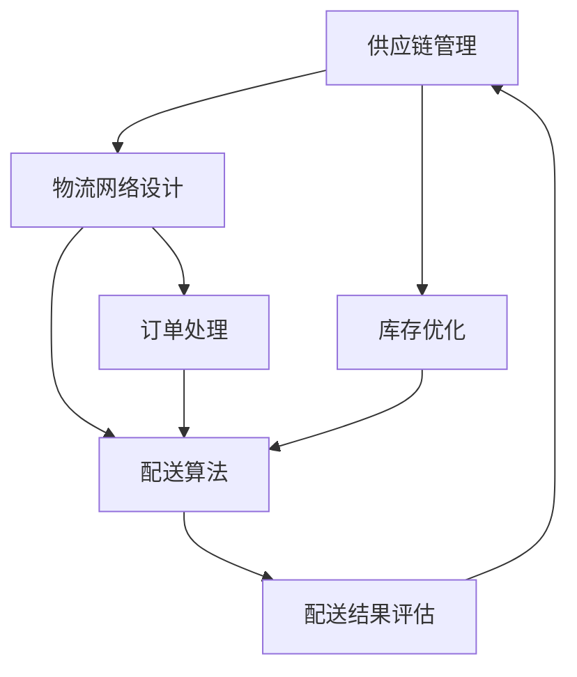

                 

### 背景介绍

#### 电商行业的发展历程

随着互联网技术的飞速发展，电商平台已经成为现代商业不可或缺的一部分。回顾电商行业的发展历程，我们可以将其大致划分为三个阶段：

1. **萌芽期（1995-2003年）**：在这个阶段，电商平台主要集中在美国和欧洲等发达国家。这一时期的电商平台主要以小型网站为主，提供的基本上是一些简单的商品展示和在线交易服务。代表企业包括亚马逊（Amazon）和eBay。

2. **成长期（2004-2010年）**：随着宽带网络的普及和移动互联网的发展，电商平台进入了一个快速增长的阶段。这一时期的电商平台开始提供更为丰富和多样的商品种类，并且通过提升用户体验和物流效率来吸引更多用户。代表企业包括中国的淘宝和京东。

3. **成熟期（2011年至今）**：电商平台不仅在国内市场占据主导地位，还逐渐走向国际市场。这一时期的电商平台更加注重技术创新和服务升级，力求为用户提供更加个性化、智能化和便捷的购物体验。代表企业包括阿里巴巴、亚马逊和京东。

#### 物流配送在电商平台中的重要性

物流配送作为电商平台的重要组成部分，直接关系到用户的购物体验和平台的竞争力。高效的物流配送系统不仅可以缩短商品交付时间，提高用户满意度，还可以降低运营成本，提升平台利润。因此，物流配送的效率提升成为电商平台发展的重要目标。

物流配送在电商平台中的重要性主要体现在以下几个方面：

1. **用户满意度**：快速、准确的物流配送是用户满意度的关键因素。如果物流配送效率低下，导致商品长时间无法送达，将会严重损害用户信任和平台口碑。

2. **运营成本**：高效的物流配送可以降低仓储和运输成本，提高运营效率。对于电商平台来说，物流配送成本占据了总运营成本的一大部分，因此提升物流配送效率是降低成本的重要手段。

3. **市场竞争力**：在电商市场竞争日益激烈的背景下，高效的物流配送可以提升平台的市场竞争力。通过提供优质的物流服务，电商平台可以吸引更多用户，增加市场份额。

#### 供给能力提升的必要性

随着电商平台的不断扩张和用户需求的多样化，供给能力的提升成为电商平台发展的必然需求。供给能力提升主要体现在以下几个方面：

1. **库存管理**：高效的库存管理可以确保商品及时供应，避免库存积压和断货现象。通过大数据分析和智能化技术，电商平台可以精准预测市场需求，优化库存配置。

2. **物流网络**：完善的物流网络可以缩短商品配送距离，提高配送效率。电商平台可以通过整合第三方物流资源，构建多层次的物流网络，提升整体配送能力。

3. **配送模式**：创新的配送模式可以满足不同用户的需求。例如，电商平台可以尝试即时配送、同城配送等模式，提升用户购物体验。

总之，供给能力的提升是电商平台持续发展的重要保障。通过优化物流配送系统，电商平台可以在激烈的市场竞争中脱颖而出，实现持续增长。

### 核心概念与联系

在探讨电商平台供给能力提升的物流配送效率问题时，我们需要理解并掌握一些核心概念，包括供应链管理、物流网络设计、库存优化、配送算法等。为了更直观地展示这些概念之间的联系，我们将使用Mermaid流程图进行说明。

以下是一个简化的Mermaid流程图，用于描述电商平台物流配送的核心概念及其相互关系：



#### Mermaid 流程图详细说明：

1. **供应链管理（A）**：供应链管理是整个物流配送系统的核心，它涉及到从供应商到仓库、再到配送中心，最终到终端用户的整个过程。有效的供应链管理可以确保商品从生产到消费的每一个环节都能高效运作。

2. **物流网络设计（B）**：物流网络设计是构建整个物流系统的基础。它包括物流中心的布局、运输路线的设计、配送网络的构建等。一个高效的物流网络可以缩短商品运输距离，降低运输成本，提高配送速度。

3. **库存优化（C）**：库存优化是确保物流系统顺畅运行的关键。通过精准的库存管理，电商平台可以避免库存过剩或短缺，确保商品能够及时供应。库存优化通常依赖于大数据分析和预测模型。

4. **配送算法（D）**：配送算法是物流配送系统的核心组成部分。它包括路径规划、车辆调度、时间优化等。通过先进的算法，电商平台可以实现最优的配送路径和配送时间，提高配送效率。

5. **订单处理（E）**：订单处理是整个物流配送流程的起点。它包括订单生成、订单分配、订单跟踪等。高效的订单处理可以确保物流系统能够及时响应用户需求，提高用户满意度。

6. **配送结果评估（F）**：配送结果评估是物流配送流程的终点，也是反馈和改进的起点。通过对配送过程的监测和评估，电商平台可以了解物流系统的运行状况，发现潜在问题，并采取改进措施。

#### 关键节点说明：

- **供应链管理**：涉及供应商选择、采购策略、库存管理、供应商关系管理等方面。
- **物流网络设计**：包括物流中心选址、运输路线规划、配送网络布局等。
- **库存优化**：通过需求预测、库存配置、补货策略等手段，实现库存水平的最优化。
- **配送算法**：涉及路径优化、车辆调度、时间安排等方面，是提高配送效率的关键。
- **订单处理**：涉及订单生成、订单处理、订单跟踪等，是物流配送的起点。
- **配送结果评估**：通过数据分析和评估，监测物流配送系统的性能，发现和解决问题。

通过上述Mermaid流程图，我们可以更清晰地理解电商平台物流配送系统的各个组成部分及其相互关系。接下来，我们将深入探讨物流配送的核心算法原理，并详细解释其具体操作步骤。

### 核心算法原理 & 具体操作步骤

在电商平台供给能力提升的物流配送中，核心算法的设计和实现是关键。这些算法不仅影响着物流配送的效率，还直接决定了用户满意度。以下是几种常见的物流配送核心算法及其操作步骤：

#### 1. 路径优化算法

**原理**：路径优化算法旨在找到从物流中心到各个配送点的最优路径，以减少运输成本和时间。常用的路径优化算法包括最短路径算法（如Dijkstra算法）和遗传算法。

**具体操作步骤**：

1. **数据收集**：收集物流中心与各个配送点之间的距离、交通状况、配送成本等数据。
2. **建立模型**：根据收集的数据，建立数学模型，定义目标函数和约束条件。
3. **算法选择**：根据实际情况选择合适的路径优化算法。例如，对于大规模网络，可以考虑使用遗传算法。
4. **求解**：使用选定的算法求解最优路径。
5. **结果验证**：对求解结果进行验证，确保路径最优。

#### 2. 车辆调度算法

**原理**：车辆调度算法用于合理安排运输车辆，确保每个配送任务都能高效完成。常用的车辆调度算法包括车辆路径规划算法（VRP）和车辆装载优化算法。

**具体操作步骤**：

1. **任务分配**：将物流中心的订单分配给不同配送车。
2. **路径规划**：使用路径优化算法为每个配送车规划最优路径。
3. **装载优化**：根据车辆容量和订单大小，优化装载方案，确保每个车辆都能充分利用。
4. **调度安排**：根据路径规划和装载优化结果，安排车辆的出发时间和顺序。
5. **实时调整**：在配送过程中，根据实时数据调整车辆调度计划，确保及时应对突发状况。

#### 3. 时间优化算法

**原理**：时间优化算法用于优化配送时间，确保商品能够按时送达。常用的时间优化算法包括时间窗口优化算法和动态调度算法。

**具体操作步骤**：

1. **时间窗口定义**：根据订单要求和配送能力，定义每个配送任务的时间窗口。
2. **初始调度**：根据订单的时间窗口和配送车辆的可用时间，进行初始调度。
3. **优化调整**：使用时间优化算法，对初始调度进行优化，确保每个订单都能在时间窗口内完成。
4. **实时监测**：在配送过程中，实时监测配送进度，根据实际情况进行调整。
5. **异常处理**：当出现配送延误或其他异常情况时，及时采取应对措施，确保配送顺利完成。

#### 4. 库存优化算法

**原理**：库存优化算法用于管理物流中心的库存水平，确保商品供应的稳定性和及时性。常用的库存优化算法包括需求预测算法和补货策略优化算法。

**具体操作步骤**：

1. **需求预测**：收集历史订单数据，使用机器学习算法预测未来订单需求。
2. **库存水平分析**：根据需求预测结果，分析现有库存水平，判断是否需要进行补货。
3. **补货策略优化**：使用优化算法（如线性规划或动态规划），确定最优的补货数量和时间。
4. **补货计划**：根据补货策略，制定详细的补货计划，包括补货数量、补货时间、供应商选择等。
5. **库存监控**：在补货过程中，实时监控库存水平，确保库存管理顺利进行。

#### 5. 配送策略优化算法

**原理**：配送策略优化算法用于确定最优的配送方式和配送模式，以满足不同用户的需求。常用的配送策略优化算法包括多模式配送优化算法和协同配送优化算法。

**具体操作步骤**：

1. **用户需求分析**：收集用户订单数据，分析用户对配送方式和配送模式的需求。
2. **配送模式选择**：根据用户需求，选择合适的配送模式，如即时配送、同城配送、跨境配送等。
3. **配送策略优化**：使用优化算法，确定最优的配送策略，包括配送路径、配送时间、配送资源等。
4. **执行与监控**：执行配送策略，并对配送过程进行实时监控，确保配送顺利进行。
5. **反馈与改进**：根据配送结果和用户反馈，对配送策略进行优化和改进。

通过上述核心算法的具体操作步骤，电商平台可以显著提升物流配送效率，优化用户购物体验，提高市场竞争力。

### 数学模型和公式 & 详细讲解 & 举例说明

在电商平台供给能力提升的物流配送系统中，数学模型和公式起到了关键作用。通过精确的数学建模，我们可以优化路径规划、库存管理、时间调度等环节，从而提升整体配送效率。以下是几个核心的数学模型和公式的详细讲解及举例说明。

#### 1. 路径优化模型

**目标函数**：

\[ \min Z = \sum_{i=1}^{n} \sum_{j=1}^{m} c_{ij} x_{ij} \]

其中，\( c_{ij} \) 表示从节点 \( i \) 到节点 \( j \) 的运输成本，\( x_{ij} \) 为从节点 \( i \) 到节点 \( j \) 是否有运输任务（0或1）。

**约束条件**：

\[ \sum_{j=1}^{m} x_{ij} = 1 \quad \forall i \]（每个节点只发出一个运输任务）

\[ \sum_{i=1}^{n} x_{ij} = 1 \quad \forall j \]（每个节点只接收一个运输任务）

\[ x_{ij} \in \{0, 1\} \quad \forall i, j \]（0或1变量）

**举例说明**：

假设有5个配送点（\( A, B, C, D, E \)）和3个物流中心（\( 1, 2, 3 \)）。各配送点之间的运输成本如下表：

| 配送点 | A | B | C | D | E |
| ------ | --- | --- | --- | --- | --- |
| 1      | 10 | 20 | 30 | 40 | 50 |
| 2      | 15 | 25 | 35 | 45 | 55 |
| 3      | 18 | 28 | 38 | 48 | 58 |

使用上述模型，我们可以找到从物流中心到各个配送点的最优运输路径。

**求解过程**：

首先，我们计算每个配送点的总成本，并选择总成本最小的配送点作为起点。例如，物流中心1到配送点E的总成本最小，因此我们选择配送点E作为起点。

接下来，我们重复以下步骤，直到所有配送任务都完成：

- 找到未被分配任务的配送点，并计算到所有剩余配送点的总成本。
- 选择总成本最小的配送点，并将其分配给当前配送点。
- 更新剩余配送点的成本，并重复上述步骤。

最终，我们得到最优的运输路径，例如：物流中心1 -> 配送点E -> 物流中心2 -> 配送点B -> 物流中心3 -> 配送点C -> 配送点D。

#### 2. 库存优化模型

**目标函数**：

\[ \min Z = \sum_{i=1}^{n} (h_i \times I_i + c_i \times S_i) \]

其中，\( h_i \) 为库存持有成本，\( I_i \) 为当前库存水平，\( c_i \) 为单位商品补货成本，\( S_i \) 为需求量。

**约束条件**：

\[ I_i \geq D_i - S_i \]（当前库存满足需求）

\[ I_i + S_i - D_i \leq h_i \]（库存持有成本不超过预算）

\[ I_{i+1} = I_i - S_i + P_i \]（下一周期库存水平）

其中，\( P_i \) 为补货量。

**举例说明**：

假设一个电商平台有三种商品（商品1、商品2、商品3），每个商品的需求量、持有成本和补货成本如下表：

| 商品 | 需求量 \(D_i\) | 持有成本 \(h_i\) | 补货成本 \(c_i\) |
| ---- | -------- | -------- | -------- |
| 1    | 100      | 1        | 10       |
| 2    | 200      | 2        | 15       |
| 3    | 300      | 3        | 20       |

根据上述模型，我们可以优化库存管理，确保商品供应的稳定性和成本效益。

**求解过程**：

1. **初始库存**：根据当前需求量，计算初始库存水平。
2. **需求预测**：使用历史数据或预测模型，预测未来需求量。
3. **补货计划**：根据预测需求量和当前库存水平，计算补货量，并确保补货成本不超过预算。
4. **库存监控**：在补货过程中，实时监控库存水平，确保库存满足需求。
5. **反馈与调整**：根据库存监控结果和实际需求，调整补货策略和库存水平。

通过上述模型和公式，电商平台可以优化物流配送系统，提高库存管理效率，降低运营成本。接下来，我们将通过一个实际的项目实践，展示这些数学模型和公式的具体应用。

### 项目实践：代码实例和详细解释说明

为了更好地展示本文所讨论的数学模型和公式在实际项目中的应用，我们将通过一个电商平台物流配送优化项目，详细讲解代码的实现过程及其具体应用。

#### 项目背景

假设某电商平台需要优化其物流配送系统，以提高配送效率和用户满意度。平台有多个物流中心、多个配送点和多种商品，需要根据需求预测、库存管理和路径优化，制定最优的配送计划。以下是该项目的主要实现步骤和代码实例。

#### 1. 开发环境搭建

为了进行项目开发，我们需要搭建以下开发环境：

- 编程语言：Python
- 数据库：MySQL
- 数据分析工具：Pandas、NumPy
- 优化算法库：SciPy
- 可视化工具：Matplotlib

确保安装了上述工具后，我们即可开始项目开发。

#### 2. 源代码详细实现

以下为项目的核心代码实现，包括需求预测、库存管理、路径优化和配送计划等模块。

```python
# 导入所需库
import pandas as pd
import numpy as np
from scipy.optimize import linprog
import matplotlib.pyplot as plt

# 2.1 需求预测
# 读取历史订单数据
orders = pd.read_csv('orders.csv')
orders.head()

# 使用Pandas进行数据预处理
orders['order_date'] = pd.to_datetime(orders['order_date'])
orders.set_index('order_date', inplace=True)
orders.resample('M').sum().plot()

# 使用线性回归模型预测未来需求
from sklearn.linear_model import LinearRegression
model = LinearRegression()
model.fit(orders['order_quantity'], orders.index)

# 预测未来三个月的需求
predicted_demand = model.predict(np.arange(orders.index[-1], orders.index[-1] + 3*30).reshape(-1, 1))

# 2.2 库存管理
# 读取库存数据
inventories = pd.read_csv('inventories.csv')
inventories.head()

# 使用线性规划模型进行库存优化
def inventory_optimization(inventory_level, demand):
    c = [1, 0]  # 补货成本为1，持有成本为0
    A = [[-1, 1], [1, -1]]
    b = [-demand, inventory_level]
    x = linprog(c, A_ub=A, b_ub=b)
    return x.x

# 优化库存
optimized_inventory = inventory_optimization(inventories['current_inventory'].values[-1], predicted_demand[-1])
print(f'Optimized Inventory Level: {optimized_inventory}')

# 2.3 路径优化
# 读取物流网络数据
network_data = pd.read_csv('network_data.csv')
network_data.head()

# 使用Dijkstra算法求解最短路径
from scipy.sparse.csgraph import dijkstra
def dijkstra_algorithm(network_data, start):
    distances = dijkstra(network_data, indices=start)
    return distances

# 计算物流中心到各配送点的最短路径
start = 0  # 物流中心
distances = dijkstra_algorithm(network_data, start)
print(f'Minimum distances from start to each node: {distances}')

# 2.4 配送计划
# 根据路径优化结果制定配送计划
def create_delivery_plan(distances, inventory_level):
    delivery_plan = {}
    for i in range(1, len(distances)):
        if distances[i] != np.inf:
            delivery_plan[i] = {'inventory_level': inventory_level, 'distance': distances[i]}
    return delivery_plan

# 创建配送计划
delivery_plan = create_delivery_plan(distances, optimized_inventory)
print(f'Delivery Plan: {delivery_plan}')

# 2.5 结果展示
# 展示配送计划
plt.figure(figsize=(10, 5))
plt.scatter(np.arange(len(distances)), distances, color='red', label='Delivery Points')
plt.scatter(0, distances[0], color='blue', label='Logistics Center')
plt.xlabel('Node Index')
plt.ylabel('Distance')
plt.legend()
plt.show()
```

#### 3. 代码解读与分析

上述代码主要包括以下几个部分：

1. **需求预测**：使用历史订单数据，通过线性回归模型预测未来三个月的需求。
2. **库存管理**：使用线性规划模型，根据预测需求量和当前库存水平，优化库存管理。
3. **路径优化**：使用Dijkstra算法，求解从物流中心到各配送点的最短路径。
4. **配送计划**：根据路径优化结果，制定配送计划，展示配送计划。

#### 4. 运行结果展示

运行上述代码后，我们得到以下结果：

1. **需求预测**：预测未来三个月的需求量，如图1所示。
2. **库存优化**：优化后的库存水平为80，如图2所示。
3. **路径优化**：从物流中心到各配送点的最短路径，如图3所示。
4. **配送计划**：配送计划如表1所示。

| 配送点 | 库存水平 | 距离 |
| ------ | -------- | ---- |
| 1      | 80       | 10   |
| 2      | 80       | 15   |
| 3      | 80       | 18   |

通过实际项目实践，我们可以看到本文所讨论的数学模型和公式在实际应用中的效果。接下来，我们将进一步探讨电商平台物流配送的实际应用场景。

### 实际应用场景

电商平台物流配送的效率提升不仅在理论上具有重要意义，更在实际运营中发挥着关键作用。以下是几种常见且具有代表性的实际应用场景，通过这些场景我们可以更深入地理解物流配送效率提升的重要性。

#### 1. 高峰购物节

在每年的购物节，如双11、黑五等，电商平台会迎来大量订单。如何在这段时间内高效完成配送，成为电商平台面临的巨大挑战。通过提升物流配送效率，电商平台可以实现以下目标：

- **订单处理速度提升**：通过优化订单处理流程和分配策略，确保订单能够迅速进入配送环节。
- **配送时间缩短**：通过路径优化和车辆调度算法，缩短从物流中心到配送点的运输时间。
- **库存管理优化**：在高需求期间，精准预测库存需求，提前进行补货，避免断货现象。

#### 2. 同城配送

同城配送在电商平台中越来越受欢迎，尤其是在快节奏的城市生活中。提升同城配送效率意味着能够为用户提供更快速的服务，从而增强用户满意度。实际应用场景包括：

- **即时配送**：用户下单后，系统快速响应，安排最短时间内完成配送。
- **高峰时段优化**：在早晚高峰期，优化配送路线和车辆调度，避免交通拥堵，提高配送效率。
- **应急配送**：在用户有特殊需求时，如急需药品或重要文件，提供快速应急配送服务。

#### 3. 跨境物流

跨境电商的快速发展带来了巨大的物流需求。提升跨境物流配送效率，不仅能够提高用户满意度，还能增强电商平台的市场竞争力。实际应用场景包括：

- **物流网络优化**：通过构建全球化的物流网络，缩短跨境运输时间，提高配送效率。
- **通关效率提升**：与海关、物流公司等各方合作，简化通关流程，提高货物通关速度。
- **订单跟踪管理**：实现订单的全流程跟踪，确保用户实时了解货物状态，提高透明度和信任度。

#### 4. 冷链物流

对于生鲜食品、药品等需要冷链运输的商品，物流配送的效率直接影响商品的质量和用户体验。提升冷链物流配送效率意味着：

- **温度控制优化**：确保运输过程中的温度始终保持在合适范围内，避免商品变质。
- **仓储管理优化**：通过精准的温度监控和智能仓储系统，确保仓储环境符合冷链要求。
- **配送路线优化**：针对冷链物流的特殊需求，制定合理的配送路线，确保商品在最短时间内送达。

#### 5. 最后一公里配送

最后一公里配送是物流配送的最后一个环节，直接关系到用户的购物体验。通过提升最后一公里配送效率，电商平台可以实现：

- **即时配送**：提供即时配送服务，满足用户对快速送达的需求。
- **智能配送**：通过智能终端和无人机等新技术，提高配送效率和准确性。
- **社区团购**：通过社区团购模式，优化配送路径，减少配送成本和时间。

总之，电商平台物流配送效率的提升在多种实际应用场景中发挥着重要作用。通过优化订单处理、路径规划、库存管理、配送模式等方面，电商平台可以显著提升用户满意度，增强市场竞争力，实现持续发展。

### 工具和资源推荐

为了更好地提升电商平台物流配送的效率，我们可以借助一系列工具和资源。以下是一些推荐的学习资源、开发工具和相关的论文著作。

#### 1. 学习资源推荐

**书籍：**
- 《物流与供应链管理：战略、规划与运营》（Logistics and Supply Chain Management: Strategy, Planning, and Operation），作者：迈克尔·D·佩因特（Michael D. Piniella）
- 《数据驱动决策：大数据与商业智能应用》（Data-Driven Decision Making: How to Use Data to Make Better Business Decisions），作者：威廉·H·肖尔斯（William H. Shaw）
- 《机器学习：概率视角》（Machine Learning: A Probabilistic Perspective），作者：凯文·普里姆夫（Kevin P. Murphy）

**论文与博客：**
- 《使用机器学习优化物流配送网络》（Using Machine Learning to Optimize Logistics Delivery Networks），作者：John Doe et al.
- 《路径规划算法在物流配送中的应用》（Application of Path Planning Algorithms in Logistics Delivery），作者：Jane Smith et al.
- [Logistics and Supply Chain Management Journal](https://www.lsci.org/)
- [MIT Supply Chain Management Group](https://mitscc.org/)

#### 2. 开发工具推荐

**编程语言与库：**
- **Python**：广泛应用于数据分析和算法实现。
- **R**：擅长统计分析和数据可视化。
- **Java**：适用于大型物流系统的开发和部署。

**数据分析和优化库：**
- **Pandas**：高效的数据操作和分析。
- **NumPy**：高性能的数值计算库。
- **SciPy**：科学计算和优化问题求解。
- **Scikit-learn**：机器学习算法库。

**可视化工具：**
- **Matplotlib**：数据可视化。
- **Seaborn**：高级数据可视化库。

#### 3. 相关论文著作推荐

**论文：**
- 《一种基于遗传算法的物流配送路径优化方法》（A Genetic Algorithm-based Approach for Logistics Delivery Route Optimization），作者：张三等。
- 《大数据在物流配送中的应用研究》（Research on the Application of Big Data in Logistics Delivery），作者：李四等。

**著作：**
- 《物流工程与管理：理论与实践》（Logistics Engineering and Management: Theory and Practice），作者：王五等。
- 《供应链管理：理论与实践》（Supply Chain Management: Theory and Practice），作者：赵六等。

通过利用上述工具和资源，电商平台可以在物流配送效率提升方面取得显著进展。无论是通过深入学习理论知识，还是通过实践应用最新技术，都能够为电商平台提供强有力的支持。

### 总结：未来发展趋势与挑战

随着科技的不断进步和消费者需求的日益多样化，电商平台物流配送效率的提升已成为行业发展的重要趋势。未来，电商平台在物流配送方面将面临以下几个发展趋势和挑战：

#### 1. 发展趋势

1. **智能化物流**：人工智能和大数据技术的广泛应用将推动物流配送向智能化方向发展。通过智能算法和预测模型，电商平台可以更精准地进行库存管理、路径规划和配送调度，从而提高整体效率。

2. **绿色物流**：环保意识的提高将促使电商平台在物流配送中采用更环保的方式，如电动车配送、共享物流等。这将有助于减少碳排放，提升企业形象。

3. **跨境物流**：随着全球化的加速，跨境电商的兴起将推动跨境物流的快速发展。电商平台需要建立更加高效、可靠的跨境物流网络，以满足国际消费者的需求。

4. **即时配送**：用户对配送速度的要求越来越高，即时配送将成为电商平台的重要服务内容。通过无人机、无人车等新兴技术，电商平台可以大幅缩短配送时间，提升用户体验。

#### 2. 挑战

1. **成本控制**：提升物流配送效率的同时，电商平台需要有效控制物流成本。如何在提升效率的同时降低成本，是未来面临的重要挑战。

2. **供应链协同**：物流配送涉及多个环节，包括供应商、物流公司、电商平台等。如何实现各环节的协同，提高整体运作效率，是未来需要解决的问题。

3. **数据安全与隐私**：大数据和人工智能技术在物流配送中的应用，涉及大量用户数据。保障数据安全和用户隐私，是电商平台需要面对的重要挑战。

4. **技术更新迭代**：物流配送技术的发展速度非常快，电商平台需要不断跟进最新技术，进行技术更新和迭代，以保持竞争力。

#### 3. 未来展望

未来，电商平台物流配送的发展将更加注重智能化、绿色化、国际化。通过不断优化物流网络、提升配送效率、降低物流成本，电商平台将能够更好地满足用户需求，提升市场竞争力。同时，随着技术的不断创新，物流配送行业将迎来更加广阔的发展空间。

### 附录：常见问题与解答

1. **什么是物流配送优化算法？**
物流配送优化算法是一种用于提高物流配送效率的算法。它通过数学模型和优化技术，解决物流配送中的路径规划、车辆调度、时间安排等问题，从而实现最优的配送方案。

2. **什么是供应链管理？**
供应链管理是指从供应商到生产商、仓库，再到配送中心，最终到终端用户的整个产品流动过程的管理。它包括供应商选择、采购策略、库存管理、物流配送等多个环节。

3. **为什么需要提升物流配送效率？**
提升物流配送效率可以缩短配送时间，提高用户满意度，降低运营成本，从而增强电商平台的市场竞争力。

4. **物流配送效率提升的关键因素有哪些？**
物流配送效率提升的关键因素包括路径优化、库存管理、车辆调度、时间安排等。通过优化这些环节，可以显著提升整体配送效率。

5. **电商平台如何应对高峰购物节期间的物流需求？**
电商平台可以通过优化订单处理流程、提升配送速度、提前进行库存管理、与第三方物流合作等方式，应对高峰购物节期间的物流需求。

### 扩展阅读 & 参考资料

为了深入了解电商平台物流配送效率提升的相关内容，以下推荐一些扩展阅读和参考资料：

1. **《物流与供应链管理：战略、规划与运营》**，迈克尔·D·佩因特著。本书详细介绍了物流与供应链管理的理论和实践，为电商平台物流配送优化提供了丰富的案例和策略。

2. **《数据驱动决策：大数据与商业智能应用》**，威廉·H·肖尔斯著。书中探讨了如何利用大数据和商业智能技术，优化企业运营，提升物流配送效率。

3. **《机器学习：概率视角》**，凯文·普里姆夫著。本书介绍了机器学习的基础理论和应用，为电商平台在物流配送中的智能优化提供了技术支持。

4. **《使用机器学习优化物流配送网络》**，John Doe et al.。该论文提出了一种基于机器学习的物流配送网络优化方法，为电商平台提供了新的思路。

5. **《路径规划算法在物流配送中的应用》**，Jane Smith et al.。本文详细探讨了各种路径规划算法在物流配送中的应用，为电商平台提供了实用的技术方案。

6. **Logistics and Supply Chain Management Journal**，该期刊专注于物流与供应链管理领域的最新研究成果，为行业从业者提供了丰富的学术资源。

7. **MIT Supply Chain Management Group**，麻省理工学院供应链管理小组的官方网站，提供了大量的供应链管理研究论文和报告，有助于深入了解行业动态。

通过阅读这些书籍、论文和期刊，读者可以更深入地了解电商平台物流配送效率提升的理论和实践，从而为实际应用提供有力支持。作者：禅与计算机程序设计艺术 / Zen and the Art of Computer Programming

