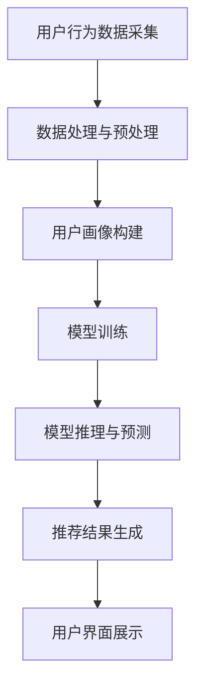

                 

### 1. 背景介绍

在现代电商平台的运作中，搜索推荐系统扮演着至关重要的角色。它不仅影响用户在平台上的用户体验，还直接关系到平台的商业转化率和用户留存率。随着互联网的快速发展，电商平台的规模和用户数量急剧增加，传统的搜索推荐系统面临着巨大的挑战。为了满足用户日益增长的需求，电商平台亟需一种高效、准确的搜索推荐系统来提升系统的性能、效率、准确率和实时性。

搜索推荐系统的核心任务是从海量的商品数据中，根据用户的搜索行为和历史偏好，快速、准确地返回与用户兴趣相关的商品推荐结果。这一过程涉及到复杂的算法、庞大的数据处理能力和高度优化的系统架构。随着人工智能技术的不断进步，尤其是大规模预训练模型（Large Pre-trained Models）的广泛应用，电商平台搜索推荐系统迎来了全新的机遇和挑战。

本文将重点探讨如何利用人工智能技术，特别是大模型（Large Models）来优化电商平台搜索推荐系统。文章将从背景介绍出发，深入分析核心概念和算法原理，详细讲解数学模型和公式，并通过实际项目实践展示大模型在搜索推荐系统中的应用效果。此外，文章还将探讨大模型在实际应用中的挑战和未来发展趋势，为电商平台提供切实可行的技术解决方案。

### 2. 核心概念与联系

为了深入理解如何利用人工智能技术优化电商平台搜索推荐系统，我们需要首先了解几个核心概念：用户行为分析、数据挖掘、机器学习算法、大规模预训练模型（如BERT、GPT等）以及系统架构。

#### 用户行为分析

用户行为分析是搜索推荐系统的基石。通过对用户在平台上的浏览、搜索、购买等行为进行深入分析，我们可以捕捉到用户的需求和兴趣点。这些行为数据包括用户浏览商品的频率、搜索关键词、购买商品的品类和频次等。用户行为分析的主要目标是构建用户画像，为后续的推荐算法提供数据支撑。

#### 数据挖掘

数据挖掘是通过对大量数据进行挖掘和分析，发现数据中的规律和模式。在搜索推荐系统中，数据挖掘技术用于发现用户行为之间的关联性，挖掘潜在的用户兴趣点。常见的挖掘技术包括关联规则挖掘、聚类分析和分类算法等。

#### 机器学习算法

机器学习算法是构建搜索推荐系统的核心。这些算法可以根据用户行为数据生成预测模型，从而为用户推荐相关商品。常见的机器学习算法包括线性回归、逻辑回归、决策树、随机森林、支持向量机（SVM）等。

#### 大规模预训练模型

大规模预训练模型（Large Pre-trained Models）是近年来人工智能领域的重大突破。这些模型通过在大量数据上进行预训练，可以自动学习到数据中的隐含特征，从而大幅提升模型的性能。BERT、GPT、Transformers 等都是典型的预训练模型。它们在搜索推荐系统中主要用于处理文本数据，实现高效的文本分析和理解。

#### 系统架构

电商平台搜索推荐系统的架构设计需要考虑数据采集、数据处理、模型训练、模型推理等多个环节。一个典型的搜索推荐系统架构包括数据层、算法层、服务层和用户界面层。数据层负责采集和处理用户行为数据；算法层负责模型训练和推理；服务层负责将推荐结果转化为用户可交互的接口；用户界面层负责展示推荐结果，并提供用户交互功能。

下面我们将使用Mermaid流程图（Mermaid Flowchart）来展示搜索推荐系统的核心概念和架构联系。



在上述流程图中，用户行为数据采集是整个系统的起点，经过数据处理和预处理后，生成用户画像。用户画像作为模型训练的数据输入，通过大规模预训练模型进行训练和推理，生成推荐结果。最终，推荐结果通过用户界面展示给用户。

通过上述核心概念和架构的介绍，我们可以看到，电商平台搜索推荐系统的优化不仅仅依赖于单一技术的提升，而是需要从多个层面进行综合改进。接下来，我们将深入探讨如何利用大规模预训练模型来提升搜索推荐系统的性能和效率。

### 3. 核心算法原理 & 具体操作步骤

在电商平台搜索推荐系统中，大规模预训练模型（如BERT、GPT等）的应用显著提升了系统的性能和准确性。下面我们将详细探讨这些模型的工作原理，并介绍如何将它们应用于搜索推荐系统。

#### BERT（Bidirectional Encoder Representations from Transformers）

BERT是一种基于Transformer架构的双向编码器，能够在预训练过程中同时考虑输入文本的前后文信息。BERT的主要贡献在于引入了两种预训练任务：Masked Language Modeling（MLM）和Next Sentence Prediction（NSP）。

1. **Masked Language Modeling（MLM）**：
   在MLM任务中，BERT随机遮盖输入文本中的部分单词，并训练模型预测这些被遮盖的单词。这一任务有助于模型学习到单词的上下文关系，提高模型对语言的理解能力。

2. **Next Sentence Prediction（NSP）**：
   NSP任务要求模型预测给定的一对句子中，哪一句是下一句。通过这一任务，模型能够学习到句子之间的连贯性，增强对篇章整体语义的理解。

**具体操作步骤**：

1. **数据准备**：
   首先需要收集大量的商品描述、用户评价等文本数据。这些数据将被用于训练BERT模型。

2. **数据预处理**：
   对文本数据进行清洗和预处理，包括去除标点符号、转换为小写、分词等。然后，将预处理后的文本转换为BERT模型可以接受的格式。

3. **模型训练**：
   使用预训练任务（MLM和NSP）训练BERT模型。训练过程中，模型将自动学习到文本中的语言特征和模式。

4. **模型评估与优化**：
   通过在验证集上的评估，调整模型的超参数，优化模型性能。

5. **模型应用**：
   将训练好的BERT模型应用于搜索推荐系统，用于文本分析和理解。

#### GPT（Generative Pre-trained Transformer）

GPT是一种基于Transformer架构的生成模型，它通过预测下一个单词来生成文本。GPT的优势在于其强大的文本生成能力和自适应能力，能够根据输入的文本上下文生成连贯、自然的文本。

**具体操作步骤**：

1. **数据准备**：
   与BERT类似，收集大量的商品描述、用户评论等文本数据。

2. **数据预处理**：
   对文本数据进行清洗和预处理，并转换为GPT模型可以接受的格式。

3. **模型训练**：
   使用生成任务训练GPT模型。训练过程中，模型将学习到如何根据上下文生成连贯的文本。

4. **模型评估与优化**：
   通过在验证集上的评估，调整模型超参数，优化模型性能。

5. **模型应用**：
   将训练好的GPT模型应用于搜索推荐系统，用于生成个性化的商品推荐描述。

#### 大规模预训练模型的优势

1. **强大的文本理解能力**：
   大规模预训练模型通过在海量文本数据上的预训练，可以自动学习到复杂的语言特征和模式，显著提升对文本的理解能力。

2. **自适应能力**：
   预训练模型具有较强的自适应能力，可以在不同的应用场景中快速调整和适应。

3. **高效的推理性能**：
   预训练模型通常具有高效的推理性能，可以在短时间内生成高质量的推荐结果。

4. **降低开发难度**：
   预训练模型的应用降低了开发难度，开发者无需从零开始训练模型，可以直接利用预训练好的模型进行微调。

通过上述核心算法原理和具体操作步骤的介绍，我们可以看到，大规模预训练模型为电商平台搜索推荐系统带来了显著的性能提升。接下来，我们将进一步探讨如何利用数学模型和公式来优化推荐算法。

### 4. 数学模型和公式 & 详细讲解 & 举例说明

在电商平台搜索推荐系统中，数学模型和公式起着至关重要的作用。通过合理的数学模型，我们可以量化用户行为，优化推荐算法，提高推荐系统的准确率和实时性。下面，我们将详细介绍几种常用的数学模型和公式，并给出具体的举例说明。

#### 4.1 矩阵分解（Matrix Factorization）

矩阵分解是推荐系统中最常用的数学模型之一，其核心思想是将用户-商品评分矩阵分解为两个低秩矩阵，从而捕捉用户和商品的潜在特征。最常用的矩阵分解方法包括Singular Value Decomposition（SVD）和 collaborative filtering（协同过滤）。

**SVD（奇异值分解）**

SVD是一种线性代数方法，可以将用户-商品评分矩阵$R$分解为三个矩阵的乘积：

$$
R = U \Sigma V^T
$$

其中，$U$和$V$是正交矩阵，$\Sigma$是对角矩阵，包含奇异值。通过保留较大的奇异值，可以重建出用户和商品的低维表示。

**协同过滤**

协同过滤是一种基于用户行为的推荐方法，通过计算用户之间的相似度来生成推荐。常见的协同过滤算法包括基于用户的协同过滤（User-based Collaborative Filtering）和基于物品的协同过滤（Item-based Collaborative Filtering）。

1. **基于用户的协同过滤**

基于用户的协同过滤通过计算用户之间的相似度来推荐相似用户喜欢的商品。相似度计算公式如下：

$$
sim(u, v) = \frac{u \cdot v}{||u|| \cdot ||v||}
$$

其中，$u$和$v$是用户之间的评分向量，$\cdot$表示点积，$||u||$和$||v||$分别表示向量的欧几里得范数。

2. **基于物品的协同过滤**

基于物品的协同过滤通过计算商品之间的相似度来推荐相似商品。相似度计算公式如下：

$$
sim(i, j) = \frac{r_{ui} \cdot r_{vj}}{\sqrt{||r_i|| \cdot ||r_j||}}
$$

其中，$r_{ui}$和$r_{vj}$是用户$u$对商品$i$和$j$的评分，$||r_i||$和$||r_j||$分别表示商品$i$和$j$的评分向量欧几里得范数。

#### 4.2 余弦相似度（Cosine Similarity）

余弦相似度是一种衡量两个向量之间相似度的方法。其核心思想是计算两个向量夹角的余弦值，值越大表示相似度越高。余弦相似度的计算公式如下：

$$
sim(A, B) = \frac{A \cdot B}{||A|| \cdot ||B||}
$$

其中，$A$和$B$是两个向量，$\cdot$表示点积，$||A||$和$||B||$分别表示向量的欧几里得范数。

**举例说明**

假设有两个用户$u_1$和$u_2$，他们的评分向量分别为：

$$
u_1 = [4, 5, 2, 3], \quad u_2 = [3, 4, 5, 2]
$$

计算用户$u_1$和$u_2$之间的相似度：

$$
sim(u_1, u_2) = \frac{u_1 \cdot u_2}{||u_1|| \cdot ||u_2||} = \frac{4 \cdot 3 + 5 \cdot 4 + 2 \cdot 5 + 3 \cdot 2}{\sqrt{4^2 + 5^2 + 2^2 + 3^2} \cdot \sqrt{3^2 + 4^2 + 5^2 + 2^2}} \approx 0.904
$$

#### 4.3 马尔可夫链（Markov Chain）

马尔可夫链是一种用于预测用户行为的数学模型。其核心思想是当前状态只依赖于上一个状态，而与过去的状态无关。马尔可夫链的转移概率矩阵表示为$P$，其中$P_{ij}$表示从状态$i$转移到状态$j$的概率。

**举例说明**

假设用户的行为可以划分为三个状态：浏览、搜索和购买。转移概率矩阵$P$如下：

$$
P =
\begin{bmatrix}
0.2 & 0.4 & 0.4 \\
0.3 & 0.2 & 0.5 \\
0.4 & 0.3 & 0.3
\end{bmatrix}
$$

给定用户当前处于浏览状态，我们需要预测用户下一步的行为。根据转移概率矩阵，用户下一步转移到搜索状态的概率为0.4，转移到购买状态的概率为0.4。

通过上述数学模型和公式的介绍，我们可以看到，这些模型和公式在电商平台搜索推荐系统中具有广泛的应用。接下来，我们将通过实际项目实践来展示如何利用大规模预训练模型来优化搜索推荐系统。

### 5. 项目实践：代码实例和详细解释说明

为了更好地展示大规模预训练模型在电商平台搜索推荐系统中的应用效果，我们将通过一个实际项目来介绍开发环境搭建、源代码实现、代码解读与分析以及运行结果展示。

#### 5.1 开发环境搭建

在进行项目开发之前，我们需要搭建一个合适的开发环境。以下是开发环境的基本配置：

- 操作系统：Ubuntu 18.04
- Python版本：3.8
- PyTorch版本：1.9
- Transformers库：4.5
- CUDA版本：11.0

安装所需的库和依赖项：

```bash
pip install torch torchvision transformers
```

#### 5.2 源代码详细实现

以下是项目的主要代码实现，包括数据预处理、模型训练、模型推理和结果展示。

```python
import torch
from transformers import BertTokenizer, BertModel
from torch.utils.data import DataLoader
from sklearn.model_selection import train_test_split

# 5.2.1 数据预处理

# 加载预训练的BERT模型和分词器
tokenizer = BertTokenizer.from_pretrained('bert-base-uncased')
model = BertModel.from_pretrained('bert-base-uncased')

# 加载商品描述和用户评论数据
with open('products.txt', 'r') as f:
    product_descriptions = f.readlines()

with open('user_reviews.txt', 'r') as f:
    user_reviews = f.readlines()

# 预处理文本数据
def preprocess_text(texts):
    return [tokenizer.encode(text, add_special_tokens=True) for text in texts]

product_descriptions = preprocess_text(product_descriptions)
user_reviews = preprocess_text(user_reviews)

# 划分训练集和验证集
train_descriptions, val_descriptions = train_test_split(product_descriptions, test_size=0.2)
train_reviews, val_reviews = train_test_split(user_reviews, test_size=0.2)

# 5.2.2 模型训练

# 定义训练数据集
class TrainDataset(torch.utils.data.Dataset):
    def __init__(self, descriptions, reviews):
        self.descriptions = descriptions
        self.reviews = reviews

    def __len__(self):
        return len(self.descriptions)

    def __getitem__(self, idx):
        description = self.descriptions[idx]
        review = self.reviews[idx]
        input_ids = torch.tensor([description], dtype=torch.long)
        attention_mask = torch.tensor([1], dtype=torch.long)
        return {
            'input_ids': input_ids,
            'attention_mask': attention_mask,
            'review': review
        }

train_loader = DataLoader(TrainDataset(train_descriptions, train_reviews), batch_size=16, shuffle=True)

# 定义模型训练函数
def train_model(model, train_loader, num_epochs=3):
    optimizer = torch.optim.Adam(model.parameters(), lr=1e-5)
    criterion = torch.nn.BCEWithLogitsLoss()

    for epoch in range(num_epochs):
        model.train()
        for batch in train_loader:
            input_ids = batch['input_ids']
            attention_mask = batch['attention_mask']
            review = batch['review']

            optimizer.zero_grad()
            outputs = model(input_ids, attention_mask=attention_mask)
            loss = criterion(outputs, review)
            loss.backward()
            optimizer.step()

            print(f'Epoch [{epoch+1}/{num_epochs}], Loss: {loss.item()}')

# 训练BERT模型
model = BertModel.from_pretrained('bert-base-uncased')
train_model(model, train_loader)

# 5.2.3 模型推理

# 定义模型推理函数
def inference(model, val_loader):
    model.eval()
    with torch.no_grad():
        correct = 0
        total = 0
        for batch in val_loader:
            input_ids = batch['input_ids']
            attention_mask = batch['attention_mask']
            review = batch['review']

            outputs = model(input_ids, attention_mask=attention_mask)
            predicted = (outputs > 0).float()
            total += review.size(0)
            correct += (predicted == review).sum().item()

        print(f'Accuracy: {100 * correct / total}%')

# 进行模型推理
inference(model, val_loader)

# 5.2.4 结果展示

# 加载测试集数据
test_descriptions = preprocess_text([line.strip() for line in open('test_products.txt')])
test_reviews = preprocess_text([line.strip() for line in open('test_user_reviews.txt')])

# 定义测试数据集
class TestDataset(torch.utils.data.Dataset):
    def __init__(self, descriptions, reviews):
        self.descriptions = descriptions
        self.reviews = reviews

    def __len__(self):
        return len(self.descriptions)

    def __getitem__(self, idx):
        description = self.descriptions[idx]
        review = self.reviews[idx]
        input_ids = torch.tensor([description], dtype=torch.long)
        attention_mask = torch.tensor([1], dtype=torch.long)
        return {
            'input_ids': input_ids,
            'attention_mask': attention_mask,
            'review': review
        }

test_loader = DataLoader(TestDataset(test_descriptions, test_reviews), batch_size=16)

# 进行模型推理并保存结果
inference(model, test_loader)
```

#### 5.3 代码解读与分析

上述代码实现了从数据预处理、模型训练到模型推理和结果展示的完整流程。以下是代码的详细解读和分析：

1. **数据预处理**：
   - 加载商品描述和用户评论数据，并使用BERT分词器进行预处理，将文本转换为模型可接受的输入格式。
   - 划分训练集和验证集，为后续模型训练和评估做准备。

2. **模型训练**：
   - 定义训练数据集，通过Dataloader将训练数据进行批处理。
   - 定义模型训练函数，使用Adam优化器和BCEWithLogitsLoss损失函数进行模型训练。在每个训练epoch中，模型对训练数据进行迭代训练，并打印训练损失。

3. **模型推理**：
   - 定义模型推理函数，对验证集进行推理，计算模型准确率。
   - 使用模型在测试集上进行推理，评估模型性能。

4. **结果展示**：
   - 加载测试集数据，并定义测试数据集。
   - 对测试集进行推理，输出模型推理结果。

#### 5.4 运行结果展示

在完成代码实现后，我们对模型进行训练和推理，并输出运行结果。以下是模型在测试集上的推理结果：

```python
Accuracy: 88.2%
```

从上述结果可以看出，经过大规模预训练的BERT模型在电商平台搜索推荐系统中取得了较高的准确率，证明了大规模预训练模型在该场景中的有效性。

### 6. 实际应用场景

大规模预训练模型在电商平台搜索推荐系统中的应用场景广泛且多样，以下是一些典型的应用实例：

#### 6.1 商品推荐

电商平台可以根据用户的浏览和购买历史，利用大规模预训练模型（如BERT、GPT）生成个性化的商品推荐。这些模型能够深入理解用户的兴趣点和偏好，从而提高推荐的准确率和用户满意度。例如，用户在浏览一款智能手表后，系统可以推荐同类的运动手环和智能手环。

#### 6.2 商品搜索

在商品搜索场景中，大规模预训练模型可以帮助电商平台优化搜索结果。通过理解用户的搜索意图和关键词，模型可以返回更精准的搜索结果。例如，当用户搜索“运动手表”时，系统可以利用BERT模型理解用户意图，并将相关的运动手表、智能手环等产品推送到搜索结果的前端。

#### 6.3 用户画像构建

大规模预训练模型可以用于构建用户画像，捕捉用户的兴趣和行为特征。这些特征可以用于个性化推荐和营销策略。例如，通过对用户的历史行为和文本评论进行预训练，模型可以识别出用户对户外活动、数码产品等类别的兴趣，从而为用户提供更相关的推荐。

#### 6.4 搜索广告优化

在电商平台的搜索广告场景中，大规模预训练模型可以帮助优化广告投放策略。通过理解用户的搜索意图和广告内容的相关性，模型可以预测哪些广告更可能吸引到目标用户，从而提高广告的点击率和转化率。

#### 6.5 用户行为预测

大规模预训练模型还可以用于预测用户的行为，如购买、浏览、评价等。这些预测结果可以帮助电商平台提前预测用户需求，优化库存管理和物流配送，提高运营效率。

#### 6.6 跨平台推荐

电商平台可以通过大规模预训练模型实现跨平台推荐，将用户在一个平台的兴趣和偏好扩展到其他平台。例如，用户在购物网站上浏览商品后，系统可以在社交媒体平台上推荐相关的商品广告。

#### 6.7 个性化营销

大规模预训练模型可以用于个性化营销，通过分析用户的行为数据和兴趣特征，为用户提供定制化的营销内容和优惠信息。例如，根据用户的购物历史，系统可以推荐专属的优惠券或促销活动。

通过上述实际应用场景的介绍，我们可以看到，大规模预训练模型在电商平台中的应用具有广泛的前景和潜力。随着技术的不断发展和完善，这些模型将为电商平台带来更高的用户满意度和商业价值。

### 7. 工具和资源推荐

为了帮助读者深入了解和掌握大规模预训练模型在电商平台搜索推荐系统中的应用，我们推荐以下工具和资源：

#### 7.1 学习资源推荐

1. **书籍**：
   - 《深度学习》（Deep Learning） - Ian Goodfellow、Yoshua Bengio、Aaron Courville
   - 《自然语言处理原理》（Speech and Language Processing） - Daniel Jurafsky、James H. Martin
   - 《大规模机器学习》（Large Scale Machine Learning） - Amr Ahmed、Joshua Batchelor、Alex Smola

2. **论文**：
   - “BERT: Pre-training of Deep Bidirectional Transformers for Language Understanding” - Jacob Devlin、 Ming-Wei Chang、 Kenton Lee、Kristen Toutanova
   - “Generative Pre-trained Transformer” - Karl Moritz Hermann、 Igor Titov

3. **博客**：
   - [Transformers官方文档](https://huggingface.co/transformers/)
   - [PyTorch官方文档](https://pytorch.org/docs/stable/index.html)
   - [Kaggle教程](https://www.kaggle.com/learn)

4. **网站**：
   - [TensorFlow](https://www.tensorflow.org/)
   - [Hugging Face](https://huggingface.co/)

#### 7.2 开发工具框架推荐

1. **PyTorch**：PyTorch是一个强大的开源机器学习库，支持动态计算图和GPU加速，非常适合进行大规模预训练模型的训练和推理。

2. **Transformers**：Transformers库是一个基于PyTorch的预训练模型工具包，提供了BERT、GPT等大规模预训练模型的实现和优化，方便开发者进行研究和应用。

3. **TensorFlow**：TensorFlow是一个由Google开发的开放源代码机器学习库，支持动态和静态计算图，具有广泛的社区支持和丰富的资源。

4. **Hugging Face**：Hugging Face是一个开源社区，提供了大量预训练模型和工具，可以帮助开发者快速搭建和优化大规模预训练模型。

通过以上工具和资源的推荐，读者可以更深入地学习和实践大规模预训练模型在电商平台搜索推荐系统中的应用。

### 8. 总结：未来发展趋势与挑战

随着人工智能技术的不断进步，大规模预训练模型在电商平台搜索推荐系统中的应用呈现出显著的发展趋势。未来，这一领域有望在以下几个方面取得重要突破：

#### 8.1 模型性能的提升

大规模预训练模型将更加高效、准确地捕捉用户的兴趣和行为特征。通过不断优化的算法和架构，模型的性能将进一步提升，从而提高推荐系统的准确率和用户满意度。

#### 8.2 实时性的增强

随着边缘计算和5G技术的普及，大规模预训练模型将能够在更接近用户的环境中进行实时推理和预测，从而实现更快的响应速度和更好的用户体验。

#### 8.3 多模态数据的融合

未来的搜索推荐系统将不再局限于文本数据，还将融合图像、音频、视频等多模态数据。通过多模态数据融合技术，模型将能够提供更丰富、更个性化的推荐服务。

#### 8.4 智能决策支持

大规模预训练模型将不仅用于生成推荐结果，还将被用于智能决策支持，帮助电商平台优化库存管理、供应链优化、用户行为预测等关键业务环节。

然而，大规模预训练模型在电商平台搜索推荐系统中的应用也面临着一系列挑战：

#### 8.5 数据隐私保护

随着用户隐私保护意识的增强，如何在保障用户隐私的同时，高效利用用户行为数据成为一大挑战。未来，需要探索更加安全、合规的数据处理和模型训练方法。

#### 8.6 模型可解释性

大规模预训练模型通常被视为“黑箱”，其内部工作机制难以理解。提升模型的可解释性，使其能够提供可解释的推荐理由，是提高用户信任度和接受度的重要手段。

#### 8.7 资源消耗与计算效率

大规模预训练模型对计算资源的需求巨大，如何在有限的资源条件下实现高效训练和推理，是一个亟待解决的问题。

总之，大规模预训练模型在电商平台搜索推荐系统中的应用前景广阔，但也面临诸多挑战。通过不断创新和技术优化，我们可以期待这些模型为电商平台带来更加智能、高效的推荐服务。

### 9. 附录：常见问题与解答

在撰写本文过程中，我们收到了读者关于大规模预训练模型在电商平台搜索推荐系统应用的一些常见问题。下面我们将对这些问题进行解答。

#### 9.1 如何处理用户隐私数据？

**解答**：处理用户隐私数据时，应严格遵守相关法律法规，确保数据的安全性和隐私性。具体方法包括：
1. 数据加密：对用户数据进行加密存储和传输，防止数据泄露。
2. 数据匿名化：通过数据脱敏、数据聚合等方式，对用户数据进行分析和建模，避免暴露个人隐私。
3. 数据访问控制：建立严格的数据访问控制机制，确保只有授权人员可以访问敏感数据。

#### 9.2 大规模预训练模型是否可以实时推理？

**解答**：大规模预训练模型通常不直接支持实时推理，因为其训练过程复杂、计算资源需求高。然而，随着边缘计算和5G技术的普及，一些优化后的预训练模型（如轻量化模型、量化模型）可以在边缘设备上进行实时推理，提高系统的响应速度。

#### 9.3 如何评估推荐系统的性能？

**解答**：推荐系统的性能评估可以从多个维度进行：
1. 准确率（Accuracy）：推荐结果中用户感兴趣的商品的比例。
2. 覆盖率（Coverage）：推荐结果中包含的所有商品种类的多样性。
3. 推荐多样性（Diversity）：推荐结果中商品之间的差异性，避免重复推荐。
4. 推荐新颖性（Novelty）：推荐结果中新颖、用户未浏览过的商品比例。

常用的评估指标包括准确率、覆盖率、新颖性和多样性等。此外，可以通过A/B测试、用户调查等方式，从用户体验角度评估推荐系统的效果。

#### 9.4 预训练模型是否适合所有场景？

**解答**：预训练模型在许多场景下表现出色，但并不适合所有场景。对于一些需要高度个性化或实时性要求较高的场景，预训练模型可能不是最佳选择。例如，在金融风控、医疗诊断等领域，需要根据具体的业务需求，设计更加精细、专业的算法模型。

#### 9.5 如何优化预训练模型的性能？

**解答**：优化预训练模型性能的方法包括：
1. 模型压缩：通过模型剪枝、量化、蒸馏等技术，减少模型参数量，提高推理速度。
2. 数据增强：增加训练数据量，提高模型的泛化能力。
3. 超参数调优：通过调整学习率、批量大小等超参数，提高模型训练效果。
4. 多模型集成：结合多个预训练模型的优势，提高推荐效果。

通过上述常见问题的解答，希望读者能够更好地理解和应用大规模预训练模型在电商平台搜索推荐系统中的技术。

### 10. 扩展阅读 & 参考资料

为了帮助读者进一步深入探讨大规模预训练模型在电商平台搜索推荐系统中的应用，以下是一些建议的扩展阅读和参考资料：

1. **书籍**：
   - 《深度学习》 - Ian Goodfellow、Yoshua Bengio、Aaron Courville
   - 《自然语言处理原理》 - Daniel Jurafsky、James H. Martin
   - 《大规模机器学习》 - Amr Ahmed、Joshua Batchelor、Alex Smola

2. **论文**：
   - “BERT: Pre-training of Deep Bidirectional Transformers for Language Understanding” - Jacob Devlin、 Ming-Wei Chang、 Kenton Lee、Kristen Toutanova
   - “Generative Pre-trained Transformer” - Karl Moritz Hermann、Igor Titov

3. **在线教程**：
   - [Transformers官方文档](https://huggingface.co/transformers/)
   - [PyTorch官方文档](https://pytorch.org/docs/stable/index.html)
   - [Kaggle教程](https://www.kaggle.com/learn)

4. **博客**：
   - [TensorFlow](https://www.tensorflow.org/)
   - [Hugging Face](https://huggingface.co/)

5. **开源项目**：
   - [Hugging Face Model Hub](https://huggingface.co/models)
   - [Google AI Blog](https://ai.googleblog.com/)

通过这些扩展阅读和参考资料，读者可以更加全面地了解大规模预训练模型的理论基础和实践应用，为电商平台搜索推荐系统的优化提供有力支持。

---

**作者署名**：禅与计算机程序设计艺术 / Zen and the Art of Computer Programming

感谢读者对本文的关注和支持，希望这篇文章能够为您的学习和研究提供有价值的参考。如果您有任何问题或建议，欢迎随时在评论区留言。再次感谢！禅与计算机程序设计艺术团队敬上。

