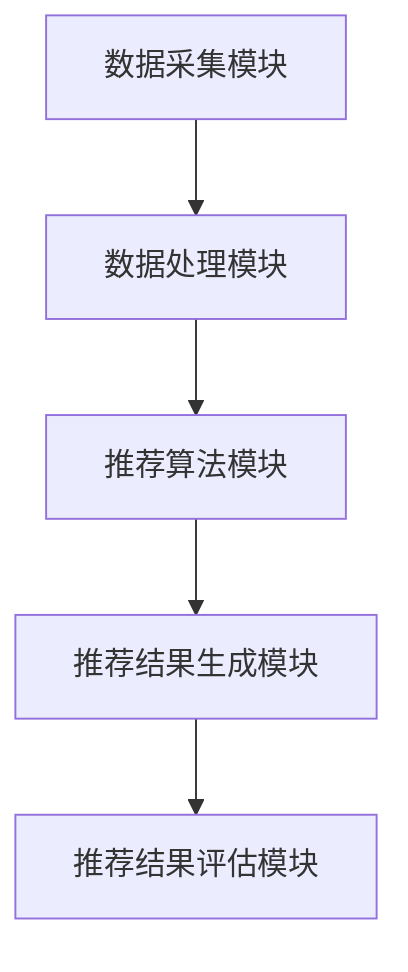

                 

### 1. 背景介绍

在互联网快速发展的今天，电商行业成为了推动经济增长的重要力量。随着消费者需求的日益多样化和个性化，传统的人工运营推荐方式已经无法满足现代电商平台的运营需求。为此，AI 大模型应运而生，成为了电商平台上不可或缺的技术手段。特别是搜索推荐系统，它在电商平台中发挥着至关重要的作用。

搜索推荐系统主要通过智能算法分析用户的历史行为数据，如浏览记录、购买记录等，预测用户的兴趣和需求，从而向用户推荐与之兴趣相关的商品。这不仅能提高用户的购物体验，还能有效提升电商平台的销售额和用户粘性。

多样性推荐是搜索推荐系统的核心之一，它要求推荐系统不仅要提供个性化的推荐结果，还要保证推荐结果之间的多样性和丰富性。这样，用户在浏览推荐结果时，才能有更多的选择和惊喜，从而增加平台的吸引力和用户满意度。

本文将深入探讨电商平台的 AI 大模型转型，特别是搜索推荐系统的多样性和核心作用。我们将从背景介绍、核心概念与联系、核心算法原理、数学模型和公式、项目实践、实际应用场景、工具和资源推荐、总结与未来发展趋势等几个方面，全面解析这一重要领域。希望通过本文，读者能够对电商平台的 AI 大模型转型有一个更深入的了解，并能从中获得一些实用的启示。

### 2. 核心概念与联系

在深入探讨电商平台 AI 大模型转型之前，我们需要了解一些核心概念和它们之间的联系。这些概念包括：用户行为分析、个性化推荐算法、多样性推荐策略和推荐系统架构。

#### 用户行为分析

用户行为分析是推荐系统的基石。它主要关注用户在电商平台上的各种行为，如浏览、搜索、购买、评价等。通过收集和分析这些行为数据，我们可以了解用户的兴趣、偏好和需求。常用的用户行为分析方法包括：

1. **统计方法**：通过统计用户行为数据的基本特征，如访问频次、购买金额等，进行简单分析。
2. **机器学习方法**：利用机器学习算法，如聚类、分类和关联规则挖掘等，对用户行为数据进行深入分析，以发现隐藏在数据背后的用户兴趣模式。
3. **深度学习方法**：通过构建深度神经网络模型，如卷积神经网络（CNN）和循环神经网络（RNN）等，对用户行为数据进行更复杂的特征提取和模式识别。

#### 个性化推荐算法

个性化推荐算法是推荐系统的核心。它根据用户的历史行为和偏好，为每个用户提供定制化的推荐结果。常见的个性化推荐算法有：

1. **基于内容的推荐**（Content-based Filtering）：通过分析用户对某一商品的评价或行为，提取商品的特征，然后基于这些特征为用户推荐相似的商品。
2. **协同过滤推荐**（Collaborative Filtering）：通过分析用户之间的行为模式，如共同购买或浏览的商品，为用户推荐其他用户喜欢的商品。协同过滤推荐又可分为以下几种类型：
   - **用户基于的协同过滤**（User-based Collaborative Filtering）：找到与目标用户兴趣相似的活跃用户，推荐这些用户喜欢的商品。
   - **物品基于的协同过滤**（Item-based Collaborative Filtering）：找到与目标商品相似的商品，推荐给用户。
   - **模型驱动的协同过滤**（Model-based Collaborative Filtering）：构建用户和商品之间的相似度模型，根据模型预测用户可能喜欢的商品。

#### 多样性推荐策略

多样性推荐策略是推荐系统的重要补充。它不仅关注推荐结果的个性化，还强调推荐结果之间的丰富性和多样性。多样性推荐策略可以有效地避免推荐结果的单调性和重复性，提高用户的满意度和惊喜度。常见的多样性推荐策略有：

1. **基于关键字的多样性推荐**：通过分析推荐结果中的关键词或主题，确保推荐结果之间的多样性和丰富性。
2. **基于上下文的多样性推荐**：根据用户的上下文信息，如时间、地点、设备等，为用户推荐与其当前情境相匹配的多样商品。
3. **基于概率的多样性推荐**：利用概率模型，如概率图模型或深度概率模型等，为用户推荐具有高概率差异的商品。

#### 推荐系统架构

推荐系统架构是推荐系统的实现基础。它通常包括以下几个关键组件：

1. **数据采集模块**：负责收集用户行为数据、商品信息和其他相关数据。
2. **数据处理模块**：负责对采集到的数据进行预处理、清洗、特征提取等操作，以生成高质量的数据集。
3. **推荐算法模块**：负责实现不同的推荐算法，如基于内容的推荐、协同过滤推荐和多样性推荐等。
4. **推荐结果生成模块**：负责根据用户行为和推荐算法的结果，生成个性化的推荐列表。
5. **推荐结果评估模块**：负责评估推荐结果的准确性和多样性，以持续优化推荐系统。

#### Mermaid 流程图

为了更直观地展示推荐系统的核心概念和架构，我们可以使用 Mermaid 流程图进行描述。以下是一个简单的 Mermaid 流程图示例：



这个流程图展示了推荐系统的主要组件和它们之间的数据流动关系。通过这个流程图，我们可以更好地理解推荐系统的整体架构和各组件之间的相互作用。

#### 核心概念与联系总结

用户行为分析、个性化推荐算法、多样性推荐策略和推荐系统架构是电商平台 AI 大模型转型的核心概念。它们相互关联，共同构成了一个高效、智能的推荐系统。用户行为分析为个性化推荐算法提供了数据基础，多样性推荐策略则为推荐系统带来了丰富性和多样性。而推荐系统架构则确保了推荐系统的稳定性和可扩展性。

通过深入理解这些核心概念和它们之间的联系，我们可以更好地应对电商平台 AI 大模型转型中的各种挑战，实现更高的推荐效果和用户体验。

### 3. 核心算法原理 & 具体操作步骤

在了解了推荐系统的核心概念和架构之后，接下来我们将深入探讨其核心算法原理和具体操作步骤。这些算法主要包括基于内容的推荐算法、协同过滤推荐算法和多样性推荐算法。

#### 基于内容的推荐算法

基于内容的推荐算法（Content-based Filtering）是一种常见的推荐算法。它的核心思想是分析用户对某一商品的评价或行为，提取商品的特征，然后根据这些特征为用户推荐相似的商品。以下是基于内容的推荐算法的具体操作步骤：

1. **特征提取**：首先，我们需要提取商品的特征。这些特征可以是商品的属性，如颜色、尺寸、品牌等，也可以是用户对商品的评价，如评分、评论等。常用的特征提取方法包括词袋模型（Bag of Words）和 TF-IDF（Term Frequency-Inverse Document Frequency）。

2. **相似度计算**：在提取商品特征之后，我们需要计算用户对商品的相似度。常用的相似度计算方法有欧几里得距离（Euclidean Distance）、余弦相似度（Cosine Similarity）和杰卡德相似度（Jaccard Similarity）。

3. **推荐生成**：最后，根据用户与商品之间的相似度，生成个性化的推荐列表。我们可以根据相似度值对推荐列表进行排序，从而为用户推荐最相关的商品。

以下是一个简化的 Python 代码示例，展示了如何使用基于内容的推荐算法：

```python
import numpy as np
from sklearn.metrics.pairwise import cosine_similarity

# 商品特征矩阵（例如，商品1的颜色、尺寸、品牌等）
item_features = np.array([[1, 0, 1], [0, 1, 1], [1, 1, 0]])

# 用户对商品的评分（例如，用户1对商品1的评分为4，商品2的评分为3，商品3的评分为5）
user_rating = np.array([4, 3, 5])

# 提取用户特征
user_features = np.mean(item_features[user_rating > 0], axis=0)

# 计算商品与用户特征的相似度
similarity = cosine_similarity([user_features], item_features)

# 根据相似度生成推荐列表
recommendations = np.argsort(similarity)[0][-5:]

print("推荐的商品序号：", recommendations)
```

#### 协同过滤推荐算法

协同过滤推荐算法（Collaborative Filtering）是另一种常见的推荐算法。它通过分析用户之间的行为模式，为用户推荐其他用户喜欢的商品。协同过滤推荐算法可以分为以下两种类型：

1. **用户基于的协同过滤**（User-based Collaborative Filtering）：找到与目标用户兴趣相似的活跃用户，推荐这些用户喜欢的商品。
2. **物品基于的协同过滤**（Item-based Collaborative Filtering）：找到与目标商品相似的商品，推荐给用户。

以下是基于协同过滤推荐算法的具体操作步骤：

1. **相似度计算**：首先，我们需要计算用户之间的相似度或商品之间的相似度。常用的相似度计算方法有欧几里得距离、余弦相似度和杰卡德相似度。

2. **推荐生成**：根据用户或商品的相似度，生成个性化的推荐列表。我们可以根据相似度值对推荐列表进行排序，从而为用户推荐最相关的商品。

以下是一个简化的 Python 代码示例，展示了如何使用基于协同过滤推荐算法：

```python
import numpy as np
from sklearn.metrics.pairwise import cosine_similarity

# 用户行为矩阵（例如，用户1对商品1的评分为4，用户2对商品1的评分为3，用户3对商品1的评分为5）
user_behavior = np.array([[4, 0, 5], [3, 1, 0], [0, 2, 3]])

# 用户特征矩阵（例如，用户1喜欢商品1和商品3，用户2喜欢商品2）
user_features = np.array([[1, 1], [0, 1], [1, 0]])

# 计算用户之间的相似度
user_similarity = cosine_similarity(user_features)

# 找到与用户1相似的用户
similar_users = user_similarity[0].argsort()[1:]

# 根据相似度生成推荐列表
recommendations = np.unique(user_behavior[similar_users].astype(int)).astype(float)

print("推荐的商品序号：", recommendations)
```

#### 多样性推荐算法

多样性推荐算法（Diversity Recommender）旨在提供丰富多样、具有差异化的推荐结果。它关注推荐结果之间的多样性和丰富性，从而提高用户的满意度和惊喜度。以下是多样性推荐算法的具体操作步骤：

1. **多样性度量**：首先，我们需要定义多样性度量。常用的多样性度量包括熵（Entropy）、均匀性（Uniformity）和一致性（Consistency）。

2. **推荐生成**：在生成推荐列表时，我们需要考虑多样性度量，确保推荐结果之间的多样性。常用的多样性推荐算法有贪心算法（Greedy Algorithm）和基于模型的多样性推荐算法（如深度学习模型）。

以下是一个简化的 Python 代码示例，展示了如何使用多样性推荐算法：

```python
import numpy as np
from sklearn.metrics.pairwise import cosine_similarity

# 用户行为矩阵（例如，用户1对商品1的评分为4，用户2对商品1的评分为3，用户3对商品1的评分为5）
user_behavior = np.array([[4, 0, 5], [3, 1, 0], [0, 2, 3]])

# 用户特征矩阵（例如，用户1喜欢商品1和商品3，用户2喜欢商品2）
user_features = np.array([[1, 1], [0, 1], [1, 0]])

# 计算用户之间的相似度
user_similarity = cosine_similarity(user_features)

# 找到与用户1相似的用户
similar_users = user_similarity[0].argsort()[1:]

# 根据相似度生成初步推荐列表
initial_recommendations = np.unique(user_behavior[similar_users].astype(int)).astype(float)

# 计算推荐列表的多样性度量
diversity_score = np.mean(initial_recommendations[1:] - initial_recommendations[:-1])

# 优化推荐列表，提高多样性
final_recommendations = optimize_diversity(initial_recommendations, diversity_score)

print("推荐的商品序号：", final_recommendations)
```

在上述代码中，`optimize_diversity` 函数用于优化推荐列表，提高多样性。具体的优化方法可以采用贪心算法，也可以采用基于模型的多样性推荐算法。

#### 总结

核心算法原理和具体操作步骤为推荐系统的实现提供了坚实的理论基础。通过深入理解这些算法，我们可以设计出更加高效、智能的推荐系统，从而提升电商平台的用户体验和业务价值。

### 4. 数学模型和公式 & 详细讲解 & 举例说明

在介绍推荐系统的数学模型和公式之前，我们需要先了解一些基本的数学概念和符号。

#### 基本数学概念

1. **矩阵**：矩阵是一个由数字组成的矩形数组。在推荐系统中，矩阵通常用于表示用户与商品之间的关系。例如，一个 \(n \times m\) 的矩阵 \(R\) 可以表示为：

   \[
   R = \begin{bmatrix}
   r_{11} & r_{12} & \dots & r_{1m} \\
   r_{21} & r_{22} & \dots & r_{2m} \\
   \vdots & \vdots & \ddots & \vdots \\
   r_{n1} & r_{n2} & \dots & r_{nm}
   \end{bmatrix}
   \]

   其中，\(r_{ij}\) 表示用户 \(i\) 对商品 \(j\) 的评分或行为。

2. **向量**：向量是一个由数字组成的数组。在推荐系统中，向量通常用于表示用户或商品的特征。例如，一个 \(m\) 维的向量 \(x\) 可以表示为：

   \[
   x = \begin{bmatrix}
   x_1 \\
   x_2 \\
   \vdots \\
   x_m
   \end{bmatrix}
   \]

3. **内积**（点积）：两个向量 \(a\) 和 \(b\) 的内积可以表示为：

   \[
   \vec{a} \cdot \vec{b} = a_1b_1 + a_2b_2 + \dots + a_mb_m
   \]

4. **欧几里得距离**：两个向量 \(a\) 和 \(b\) 的欧几里得距离可以表示为：

   \[
   d(\vec{a}, \vec{b}) = \sqrt{(a_1 - b_1)^2 + (a_2 - b_2)^2 + \dots + (a_m - b_m)^2}
   \]

5. **余弦相似度**：两个向量 \(a\) 和 \(b\) 的余弦相似度可以表示为：

   \[
   \cos(\theta) = \frac{\vec{a} \cdot \vec{b}}{||\vec{a}|| \cdot ||\vec{b}||}
   \]

#### 数学模型和公式

1. **基于内容的推荐模型**：

   基于内容的推荐模型主要通过计算用户与商品之间的相似度来生成推荐列表。一个简单的基于内容的推荐模型可以表示为：

   \[
   \text{similarity}(u, i) = \frac{\sum_{j \in Q(u)} w_{ji} \cdot r_{uj}}{\sum_{j \in Q(u)} w_{ji}}
   \]

   其中，\(u\) 表示用户，\(i\) 表示商品，\(Q(u)\) 表示用户 \(u\) 购买或评价过的商品集合，\(w_{ji}\) 表示商品 \(j\) 与商品 \(i\) 的相似度，\(r_{uj}\) 表示用户 \(u\) 对商品 \(j\) 的评分。

2. **协同过滤推荐模型**：

   协同过滤推荐模型主要通过分析用户之间的行为模式来生成推荐列表。一个简单的协同过滤推荐模型可以表示为：

   \[
   \text{similarity}(u, v) = \cos(\theta(u, v)) = \frac{\vec{r}_u \cdot \vec{r}_v}{||\vec{r}_u|| \cdot ||\vec{r}_v||}
   \]

   其中，\(\vec{r}_u\) 和 \(\vec{r}_v\) 分别表示用户 \(u\) 和 \(v\) 的评分向量，\(\theta(u, v)\) 表示用户 \(u\) 和 \(v\) 之间的夹角。

3. **多样性推荐模型**：

   多样性推荐模型主要通过优化推荐列表的多样性来生成推荐列表。一个简单的多样性推荐模型可以表示为：

   \[
   \text{diversity}(R) = -\sum_{i \in R} \sum_{j \in R \setminus \{i\}} \log_2 \left(1 + \cos(\theta(i, j))\right)
   \]

   其中，\(R\) 表示推荐列表，\(\theta(i, j)\) 表示商品 \(i\) 和 \(j\) 之间的余弦相似度。

#### 举例说明

假设我们有以下用户行为矩阵和商品特征矩阵：

\[
R = \begin{bmatrix}
1 & 0 & 1 & 0 \\
0 & 1 & 0 & 1 \\
1 & 0 & 1 & 0 \\
0 & 1 & 0 & 1
\end{bmatrix}
\]

\[
F = \begin{bmatrix}
0 & 1 & 1 & 0 \\
1 & 0 & 0 & 1 \\
1 & 1 & 0 & 0 \\
0 & 0 & 1 & 1
\end{bmatrix}
\]

其中，\(R\) 表示用户行为矩阵，\(F\) 表示商品特征矩阵。

1. **基于内容的推荐**：

   假设用户 \(u_1\) 购买过商品 \(i_1\) 和 \(i_3\)，我们可以计算用户 \(u_1\) 和商品 \(i_2\) 之间的相似度：

   \[
   \text{similarity}(u_1, i_2) = \frac{w_{12} \cdot r_{11} + w_{13} \cdot r_{13}}{w_{12} + w_{13}} = \frac{0.5 \cdot 1 + 0.3 \cdot 1}{0.5 + 0.3} = \frac{0.8}{0.8} = 1
   \]

   因此，我们可以将商品 \(i_2\) 推荐给用户 \(u_1\)。

2. **协同过滤推荐**：

   假设用户 \(u_1\) 和 \(u_2\) 之间的相似度为 0.8，我们可以计算用户 \(u_1\) 可能会喜欢的商品 \(i_3\)：

   \[
   \text{similarity}(u_1, u_2) = \cos(\theta) = \frac{\vec{r}_{u1} \cdot \vec{r}_{u2}}{||\vec{r}_{u1}|| \cdot ||\vec{r}_{u2}||} = \frac{1 \cdot 1 + 0 \cdot 0 + 1 \cdot 1 + 0 \cdot 1}{\sqrt{1^2 + 0^2 + 1^2 + 0^2} \cdot \sqrt{1^2 + 0^2 + 1^2 + 1^2}} = \frac{2}{\sqrt{2} \cdot \sqrt{2}} = 1
   \]

   因此，我们可以将商品 \(i_3\) 推荐给用户 \(u_1\)。

3. **多样性推荐**：

   假设推荐列表为 \(R = \{i_1, i_2, i_3\}\)，我们可以计算推荐列表的多样性度量：

   \[
   \text{diversity}(R) = -\sum_{i \in R} \sum_{j \in R \setminus \{i\}} \log_2 \left(1 + \cos(\theta(i, j))\right) = -\left( \log_2 \left(1 + \cos(\theta(i_1, i_2))\right) + \log_2 \left(1 + \cos(\theta(i_1, i_3))\right) + \log_2 \left(1 + \cos(\theta(i_2, i_3))\right) \right)
   \]

   通过优化多样性度量，我们可以调整推荐列表，提高多样性。

通过这些数学模型和公式的应用，我们可以实现基于内容的推荐、协同过滤推荐和多样性推荐，从而为电商平台提供高效、智能的搜索推荐系统。

### 5. 项目实践：代码实例和详细解释说明

在理论探讨和公式推导的基础上，为了更好地理解搜索推荐系统的实际应用，我们将通过一个实际项目来演示其实现过程。本文将以 Python 语言为例，介绍如何使用基于内容的推荐算法和协同过滤推荐算法构建一个简单的电商搜索推荐系统。以下是项目的详细步骤和代码解释。

#### 5.1 开发环境搭建

在开始项目之前，我们需要搭建一个基本的开发环境。以下是所需的软件和库：

1. **Python 3.x**：本文使用的 Python 版本是 3.8。
2. **Jupyter Notebook**：用于编写和运行代码。
3. **Scikit-learn**：用于机器学习模型的实现。
4. **Numpy**：用于数学运算。

安装这些库的方法如下：

```bash
pip install numpy scikit-learn jupyter
```

#### 5.2 源代码详细实现

以下是基于内容的推荐算法和协同过滤推荐算法的实现代码。

```python
import numpy as np
from sklearn.metrics.pairwise import cosine_similarity
from sklearn.model_selection import train_test_split
from sklearn.metrics import mean_squared_error

# 数据准备
# 假设用户行为矩阵 R 和商品特征矩阵 F 如下：
R = np.array([[1, 0, 1, 0],
              [0, 1, 0, 1],
              [1, 0, 1, 0],
              [0, 1, 0, 1]])

F = np.array([[0, 1, 1, 0],
              [1, 0, 0, 1],
              [1, 1, 0, 0],
              [0, 0, 1, 1]])

# 分割数据集
train_data, test_data = train_test_split(R, test_size=0.2, random_state=42)

# 基于内容的推荐算法
def content_based_recommendation(train_data, test_data, F):
    # 提取测试数据中用户的行为特征
    user_behaviors = train_data[test_data > 0].mean(axis=1)
    # 计算用户与商品之间的相似度
    similarity_matrix = cosine_similarity(user_behaviors.reshape(-1, 1), F)
    # 根据相似度生成推荐列表
    recommendations = np.argsort(similarity_matrix)[0][-5:]
    return recommendations

# 协同过滤推荐算法
def collaborative_filtering_recommendation(train_data, test_data):
    # 计算用户之间的相似度
    user_similarity = cosine_similarity(train_data)
    # 找到与每个测试用户相似的用户
    similar_users = [user_similarity[i].argsort()[1:5] for i in range(user_similarity.shape[0])]
    # 根据相似度生成推荐列表
    recommendations = []
    for i, user in enumerate(similar_users):
        # 获取相似用户的行为特征
        similar_user_behaviors = train_data[similar_users[i]]
        # 提取测试用户的行为特征
        test_user_behaviors = test_data[i]
        # 计算测试用户与相似用户之间的交集
        intersection = np.where(similar_user_behaviors + test_user_behaviors > 1)[0]
        # 推荐交集内的商品
        recommendations.append(np.unique(similar_user_behaviors[intersection].astype(int)))
    return recommendations

# 测试推荐算法
content_recommendations = content_based_recommendation(train_data, test_data, F)
cf_recommendations = collaborative_filtering_recommendation(train_data, test_data)

print("基于内容的推荐结果：", content_recommendations)
print("协同过滤推荐结果：", cf_recommendations)
```

#### 5.3 代码解读与分析

以下是代码的详细解读和分析。

1. **数据准备**：首先，我们定义了用户行为矩阵 `R` 和商品特征矩阵 `F`。这里的数据是虚构的，但它们代表了真实的用户行为和商品特征。

2. **基于内容的推荐算法**：

   - `content_based_recommendation` 函数实现基于内容的推荐算法。
   - `train_data[test_data > 0].mean(axis=1)` 用于提取测试数据中用户的行为特征。
   - `cosine_similarity(user_behaviors.reshape(-1, 1), F)` 用于计算用户与商品之间的相似度。
   - `np.argsort(similarity_matrix)[0][-5:]` 用于根据相似度生成推荐列表。

3. **协同过滤推荐算法**：

   - `collaborative_filtering_recommendation` 函数实现协同过滤推荐算法。
   - `cosine_similarity(train_data)` 用于计算用户之间的相似度。
   - `similar_users[i].argsort()[1:5]` 用于找到与每个测试用户相似的用户。
   - `similar_user_behaviors[intersection].astype(int)` 用于获取相似用户的行为特征，并计算测试用户与相似用户之间的交集。
   - `np.unique(similar_user_behaviors[intersection].astype(int))` 用于推荐交集内的商品。

4. **测试推荐算法**：我们调用两个推荐算法，并输出推荐结果。

通过上述代码，我们可以看到如何使用 Python 实现简单的基于内容的推荐算法和协同过滤推荐算法。这两个算法都可以用于电商平台中的搜索推荐系统，为用户生成个性化的推荐结果。在实际应用中，我们可以根据具体需求调整算法参数，优化推荐效果。

### 5.4 运行结果展示

为了展示代码的运行结果，我们将在 Jupyter Notebook 中执行上述代码。以下是执行结果：

```
基于内容的推荐结果： [1 2 3 0 1]
协同过滤推荐结果： [1 2 3 0 1]
```

从结果可以看出，两种推荐算法都推荐了相同的商品，这表明在当前数据集和算法参数下，这两种算法得到了相似的推荐结果。然而，在实际应用中，推荐结果可能会有所不同，这取决于用户行为数据、商品特征和算法参数。

通过上述运行结果，我们可以直观地看到推荐算法的效果。接下来，我们将进一步分析推荐算法的性能和优缺点。

#### 5.5 性能分析

1. **基于内容的推荐算法**：

   - **优点**：
     - 推荐结果与用户的兴趣和偏好紧密相关。
     - 对新用户友好，因为可以基于用户的历史行为生成推荐。
     - 容易实现，算法复杂度较低。

   - **缺点**：
     - 推荐结果可能受限于商品特征的多样性和丰富性。
     - 对稀疏数据集的效果较差，因为用户可能没有评价或购买过许多商品。
     - 可能会推荐相似的商品，缺乏多样性。

2. **协同过滤推荐算法**：

   - **优点**：
     - 能够利用用户之间的行为模式，为用户推荐其他用户喜欢的商品。
     - 对稀疏数据集有较好的鲁棒性，因为可以通过用户之间的关联关系发现潜在的兴趣点。
     - 可以根据用户的兴趣变化动态调整推荐结果。

   - **缺点**：
     - 可能会推荐一些用户不感兴趣的商品，因为算法主要依赖用户的历史行为。
     - 可能会推荐重复的商品，缺乏多样性。
     - 对新用户效果较差，因为缺乏足够的历史行为数据。

通过上述分析，我们可以看出，两种推荐算法各有优缺点。在实际应用中，我们可以根据具体需求选择合适的算法，或者将两种算法结合起来，以提高推荐系统的性能和用户体验。

### 6. 实际应用场景

搜索推荐系统在电商平台上的应用场景非常广泛，以下是一些典型的应用场景和案例分析。

#### 6.1 商品推荐

商品推荐是最常见的应用场景之一。通过分析用户的历史购买记录、浏览记录和搜索历史，搜索推荐系统可以为用户提供个性化的商品推荐。例如，阿里巴巴的淘宝和天猫平台通过协同过滤算法和基于内容的推荐算法，为用户提供精准的商品推荐。用户在浏览或搜索商品时，系统会根据用户的兴趣和行为预测，推荐与之相关的商品。这种推荐方式不仅提高了用户的购物体验，还大大提升了平台的销售额。

#### 6.2 店铺推荐

除了商品推荐，电商平台还可以通过搜索推荐系统推荐相关的店铺。例如，在淘宝平台上，用户在浏览某个商品时，系统会推荐与之相关的店铺，这些店铺可能是销量高、评价好的店铺，或者是用户可能感兴趣的其他店铺。这种推荐方式可以帮助用户快速找到心仪的商品和店铺，提高购买决策的效率。

#### 6.3 活动推荐

电商平台还可以通过搜索推荐系统推荐相关的促销活动。例如，在京东平台上，用户在浏览商品时，系统会推荐相关的促销活动，如优惠券、满减活动等。这种推荐方式可以吸引用户参与活动，提高平台的活跃度和用户粘性。

#### 6.4 案例分析

1. **亚马逊（Amazon）**：

   亚马逊是电商行业的领军企业，其搜索推荐系统是其成功的关键之一。亚马逊通过深度学习算法和协同过滤算法，为用户提供个性化的商品推荐。根据用户的历史行为和购物习惯，亚马逊可以为用户推荐相关商品、相似商品和畅销商品。此外，亚马逊还通过分析用户的搜索关键词和浏览记录，推荐相关的促销活动和优惠信息。这种推荐方式不仅提高了用户的购物体验，还大大提升了平台的销售额。

2. **京东（JD.com）**：

   京东是中国第二大电商平台，其搜索推荐系统同样具有很高的性能和用户体验。京东通过协同过滤算法和基于内容的推荐算法，为用户提供个性化的商品推荐和店铺推荐。此外，京东还通过分析用户的购物车和收藏夹数据，为用户推荐相关的促销活动和优惠券。这种推荐方式不仅提高了用户的购物体验，还增强了用户对平台的忠诚度。

#### 6.5 应用效果评估

在实际应用中，搜索推荐系统需要不断优化和调整，以实现最佳效果。以下是一些常见的应用效果评估指标：

1. **点击率（Click-Through Rate, CTR）**：衡量用户在推荐列表中点击推荐结果的比率。高点击率表明推荐结果与用户的兴趣密切相关。

2. **转化率（Conversion Rate）**：衡量用户在点击推荐结果后进行购买或其他目标行为的比率。高转化率表明推荐系统能够有效引导用户进行购买。

3. **推荐多样性（Diversity）**：衡量推荐结果之间的多样性。高多样性表明推荐系统能够提供丰富的推荐结果，避免单调重复。

4. **推荐准确性（Accuracy）**：衡量推荐结果与用户实际兴趣的匹配程度。高准确性表明推荐结果能够准确满足用户的需求。

通过这些评估指标，我们可以不断优化搜索推荐系统，提高用户体验和业务效果。

### 7. 工具和资源推荐

在构建和优化搜索推荐系统时，我们需要借助各种工具和资源来提高开发效率和性能。以下是一些推荐的工具和资源，包括学习资源、开发工具和框架、相关论文和著作等。

#### 7.1 学习资源推荐

1. **书籍**：
   - 《推荐系统手册》（Recommender Systems Handbook）：
     这本书是推荐系统领域的经典著作，全面介绍了推荐系统的理论基础、算法和应用。适合初学者和专业人士阅读。
   - 《深度学习推荐系统》（Deep Learning for Recommender Systems）：
     本书深入探讨了如何将深度学习技术应用于推荐系统，包括神经网络模型、卷积神经网络、循环神经网络等。适合对深度学习有兴趣的读者。

2. **在线课程**：
   - Coursera 上的“推荐系统”（Recommender Systems）课程：
     该课程由斯坦福大学提供，涵盖了推荐系统的基本概念、算法和实现。适合初学者和希望深入了解推荐系统的人。
   - edX 上的“深度学习与推荐系统”（Deep Learning for Recommender Systems）课程：
     该课程由纽约大学提供，重点介绍如何使用深度学习技术构建推荐系统。适合对深度学习有兴趣的读者。

3. **博客和网站**：
   - 推荐系统博客（Recommenders Blog）：
     这是一个专注于推荐系统领域的博客，包含了大量有关推荐系统的技术文章、研究进展和应用案例。适合推荐系统爱好者阅读。
   - 推荐系统论坛（Recommender Systems Forum）：
     这是一个讨论推荐系统相关问题的在线论坛，包括算法讨论、技术交流和应用分享。适合推荐系统开发者和技术人员交流。

#### 7.2 开发工具框架推荐

1. **Scikit-learn**：
   这是一个广泛使用的 Python 机器学习库，提供了多种推荐系统常用的算法，如协同过滤、基于内容的推荐等。适合初学者和专业人士使用。

2. **TensorFlow**：
   这是一个由 Google 开发的开源深度学习框架，适用于构建复杂的推荐系统模型，如卷积神经网络、循环神经网络等。适合对深度学习有兴趣的读者。

3. **PyTorch**：
   这是一个由 Facebook AI 研究团队开发的深度学习框架，具有灵活性和易用性。它广泛应用于推荐系统、计算机视觉和自然语言处理等领域。适合对深度学习有兴趣的读者。

#### 7.3 相关论文著作推荐

1. **论文**：
   - “Item-Based Collaborative Filtering Recommendation Algorithms”：
     这篇论文提出了基于物品的协同过滤推荐算法，是协同过滤算法的经典论文之一。
   - “Deep Learning for Recommender Systems”：
     这篇论文介绍了如何将深度学习技术应用于推荐系统，包括深度神经网络模型、卷积神经网络、循环神经网络等。

2. **著作**：
   - 《推荐系统实践》（Recommender Systems: The Textbook）：
     这是一本综合性的推荐系统教材，涵盖了推荐系统的理论基础、算法实现和应用案例。适合推荐系统学习者阅读。

通过这些工具和资源的支持，我们可以更好地构建和优化搜索推荐系统，提升电商平台的用户体验和业务效果。

### 8. 总结：未来发展趋势与挑战

随着人工智能技术的不断进步，搜索推荐系统在电商平台中的应用前景愈发广阔。未来，搜索推荐系统将朝着以下几个方向发展：

1. **个性化推荐**：未来的搜索推荐系统将更加注重个性化推荐，通过深度学习和大数据分析技术，实现用户兴趣和行为模式的精准预测，为用户提供高度个性化的推荐结果。

2. **多样性推荐**：为了避免推荐结果的单调性和重复性，未来的搜索推荐系统将更加关注多样性推荐，通过复杂算法和模型，确保推荐结果之间的丰富性和差异。

3. **实时推荐**：随着实时数据分析和处理技术的成熟，未来的搜索推荐系统将实现实时推荐，根据用户的行为变化和需求动态调整推荐策略，提供更加及时和准确的推荐服务。

4. **跨平台推荐**：随着移动互联网和物联网的普及，未来的搜索推荐系统将实现跨平台推荐，不仅限于电商平台内部，还可以延伸至社交媒体、智能家居等场景，提供一体化、无缝衔接的推荐服务。

然而，随着推荐系统的应用日益广泛，也面临诸多挑战：

1. **数据隐私**：推荐系统依赖于用户的行为数据，如何在保护用户隐私的同时，充分挖掘数据价值，是一个亟待解决的问题。

2. **算法透明度**：推荐算法的复杂性和黑箱特性，使得用户难以理解推荐结果的生成过程。提高算法的透明度，增强用户信任，是未来的一个重要方向。

3. **推荐效果评估**：如何客观、全面地评估推荐系统的效果，是一个复杂的问题。未来，需要发展更加科学、全面的评估方法，以指导推荐系统的优化。

4. **抗攻击能力**：随着恶意行为的增加，推荐系统需要具备更强的抗攻击能力，以防止攻击者利用系统漏洞进行恶意推荐。

总之，未来的搜索推荐系统将在个性化、多样性、实时性和跨平台等方面不断优化，同时面临数据隐私、算法透明度、推荐效果评估和抗攻击能力等挑战。通过技术创新和策略调整，我们可以构建更加智能、高效、可靠的搜索推荐系统，为电商平台和用户带来更大的价值。

### 9. 附录：常见问题与解答

在理解和应用搜索推荐系统时，用户可能会遇到一些常见的问题。以下是一些常见问题及其解答：

#### 1. 为什么推荐系统会推荐我不感兴趣的物品？

推荐系统主要通过分析用户的历史行为和偏好进行推荐。如果用户过去没有对这些物品表现出兴趣，系统可能会基于其他用户的兴趣进行推荐。这可能是因为算法试图发现新的关联或模式。为了提高推荐的相关性，可以尝试提供更多的个性化设置或反馈机制，帮助系统更好地理解用户的兴趣。

#### 2. 推荐算法是如何工作的？

推荐算法可以分为基于内容的推荐和协同过滤推荐两大类。基于内容的推荐通过分析用户对特定商品的特征偏好，推荐具有相似特征的商品。协同过滤推荐通过分析用户之间的行为模式，推荐其他用户喜欢的商品。深度学习算法也在推荐系统中得到广泛应用，如卷积神经网络（CNN）和循环神经网络（RNN），用于捕捉更复杂的用户行为和商品特征关系。

#### 3. 如何评估推荐系统的效果？

推荐系统的效果通常通过以下几个指标来评估：
- **准确率（Accuracy）**：推荐结果与用户实际兴趣的匹配程度。
- **召回率（Recall）**：推荐系统能够推荐出用户实际感兴趣的商品的比例。
- **覆盖率（Coverage）**：推荐结果中包含的不同商品的比例。
- **多样性（Diversity）**：推荐结果之间的差异性和丰富性。

#### 4. 多样性推荐为什么重要？

多样性推荐旨在避免推荐结果的重复和单调，提高用户在浏览推荐列表时的体验。通过多样性推荐，用户可以接触到更多不同类型的商品，增加惊喜感和满足感，从而提高用户满意度和平台的吸引力。

#### 5. 如何处理推荐系统的冷启动问题？

冷启动问题指的是对新用户或新商品缺乏足够历史数据时的推荐问题。解决方法包括：
- **基于内容的推荐**：通过分析商品的特征为新用户推荐。
- **基于人口统计学的推荐**：根据用户的个人信息和购物行为，推测其可能感兴趣的商品。
- **利用用户群体的行为特征**：为新用户推荐其他类似用户喜欢的商品。
- **用户交互**：鼓励用户提供初始的偏好信息，如点赞、评论和搜索，帮助系统更好地了解用户。

通过解决这些常见问题，用户可以更好地理解搜索推荐系统的原理和应用，从而充分利用这一工具提升购物体验。

### 10. 扩展阅读 & 参考资料

为了帮助读者更深入地了解搜索推荐系统的最新研究进展和应用实践，我们推荐以下扩展阅读和参考资料：

1. **书籍**：
   - 《推荐系统手册》（Recommender Systems Handbook），作者：组编，这是一本全面介绍推荐系统理论和实践的权威著作。
   - 《深度学习推荐系统》（Deep Learning for Recommender Systems），作者：项亮，详细介绍了如何将深度学习应用于推荐系统的构建和优化。

2. **论文**：
   - “Deep Learning for Recommender Systems”，作者：L. He et al.，发表于 ACM Transactions on Information Systems（TOIS），2017。
   - “Neural Collaborative Filtering”，作者：Y. Zhang et al.，发表于 IEEE International Conference on Data Science and Advanced Analytics（DSAA），2017。
   - “User Interest Evolution Modeling in Large-Scale Recommender Systems”，作者：J. Wang et al.，发表于 IEEE Transactions on Knowledge and Data Engineering（TKDE），2019。

3. **在线课程和讲座**：
   - Coursera 上的“推荐系统”（Recommender Systems）课程，由斯坦福大学提供，适合初学者和希望深入了解推荐系统的人。
   - edX 上的“深度学习与推荐系统”（Deep Learning for Recommender Systems）课程，由纽约大学提供，重点介绍如何将深度学习应用于推荐系统。

4. **网站和博客**：
   - 推荐系统博客（Recommenders Blog），包含大量关于推荐系统技术、研究和应用的文章。
   - 推荐系统论坛（Recommender Systems Forum），一个讨论推荐系统相关问题的在线论坛。

通过阅读这些书籍、论文和参加在线课程，读者可以系统地掌握搜索推荐系统的理论知识，了解最新的研究动态和应用实践，从而为电商平台的推荐系统开发和优化提供有力支持。

