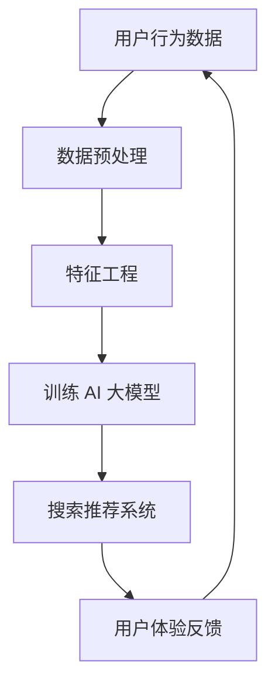

                 

关键词：电商平台，AI 大模型，搜索推荐系统，用户体验优化，数据质量

> 摘要：随着人工智能技术的快速发展，电商平台正迎来一场AI 大模型的转型浪潮。本文将深入探讨搜索推荐系统的核心地位，以及如何在转型过程中优化用户体验和数据质量，从而提升电商平台的核心竞争力。

## 1. 背景介绍

近年来，人工智能（AI）技术在电商领域取得了显著进展。从最初的智能客服到如今的个性化推荐，AI 大模型正逐步渗透到电商平台的各个方面。这些大模型通过学习海量用户数据和商品信息，能够实现高度个性化的推荐，从而提升用户的购物体验和平台销售额。

然而，随着AI 大模型的应用日益广泛，搜索推荐系统逐渐成为电商平台的“心脏”。这不仅是因为搜索推荐系统能够直接影响用户的购物决策，更是因为它对用户体验和数据质量有着深远的影响。本文将围绕这两个关键点展开，探讨电商平台在AI 大模型转型过程中面临的挑战与机遇。

## 2. 核心概念与联系

### 2.1 AI 大模型

AI 大模型是指通过深度学习等技术，在大量数据基础上构建的复杂神经网络模型。这些模型能够自动从数据中学习规律，进行智能决策和预测。在电商平台中，AI 大模型广泛应用于用户行为分析、商品推荐、价格预测等方面。

### 2.2 搜索推荐系统

搜索推荐系统是电商平台的核心模块之一，它负责根据用户的历史行为和兴趣，为用户推荐相关的商品和服务。一个高效的搜索推荐系统能够显著提升用户的购物体验和平台的销售额。

### 2.3 用户体验优化

用户体验优化是指通过优化产品设计和交互，提升用户在使用电商平台时的满意度和忠诚度。在AI 大模型转型过程中，用户体验优化至关重要，因为它直接关系到用户对平台的认可和信任。

### 2.4 数据质量

数据质量是AI 大模型应用的基础。高质量的数据能够提高模型的准确性和稳定性，从而为用户提供更好的推荐服务。然而，在电商平台中，数据质量往往受到各种因素的影响，如数据缺失、噪声、不一致等。

### 2.5 Mermaid 流程图

以下是一个简化的电商平台 AI 大模型与搜索推荐系统的 Mermaid 流程图：



## 3. 核心算法原理 & 具体操作步骤

### 3.1 算法原理概述

电商平台搜索推荐系统的核心算法主要包括基于内容的推荐、协同过滤推荐和混合推荐等。以下是这些算法的基本原理：

- **基于内容的推荐**：通过分析商品的内容特征（如标题、描述、标签等），为用户推荐与之相似的商品。
- **协同过滤推荐**：通过分析用户之间的行为相似性，为用户推荐其他用户喜欢但尚未购买的商品。
- **混合推荐**：结合基于内容的推荐和协同过滤推荐，为用户提供更个性化的推荐结果。

### 3.2 算法步骤详解

以下是电商平台搜索推荐系统的基本操作步骤：

1. **数据采集**：从电商平台的交易、浏览、搜索等行为中采集用户数据。
2. **数据预处理**：清洗数据，去除噪声，进行数据转换和标准化。
3. **特征工程**：提取用户和商品的特征，如用户购买频率、商品价格、类别等。
4. **模型训练**：使用机器学习算法（如协同过滤、神经网络等）训练推荐模型。
5. **模型评估**：使用准确率、召回率等指标评估模型性能。
6. **推荐生成**：根据用户特征和商品特征，生成推荐结果。
7. **用户体验反馈**：收集用户对推荐结果的反馈，用于优化推荐模型。

### 3.3 算法优缺点

- **基于内容的推荐**：优点是推荐结果相关性强，用户体验好；缺点是依赖于商品内容质量，无法解决数据稀疏问题。
- **协同过滤推荐**：优点是能够解决数据稀疏问题，推荐结果多样化；缺点是推荐结果可能过于集中，用户体验较差。
- **混合推荐**：优点是结合了基于内容和协同过滤的优点，推荐结果更全面；缺点是实现复杂，计算成本高。

### 3.4 算法应用领域

电商平台搜索推荐系统算法主要应用于以下领域：

- **商品推荐**：为用户推荐相关的商品，提升用户购物体验和平台销售额。
- **广告推荐**：为用户推荐相关的广告，提升广告投放效果和用户转化率。
- **内容推荐**：为用户推荐相关的视频、文章等，提升平台内容粘性。

## 4. 数学模型和公式 & 详细讲解 & 举例说明

### 4.1 数学模型构建

电商平台搜索推荐系统通常采用以下数学模型：

- **用户矩阵**：表示用户与商品之间的交互关系，如用户购买、收藏、浏览等。
- **商品矩阵**：表示商品与商品之间的关联关系，如商品类别、标签等。
- **推荐矩阵**：表示用户与商品之间的推荐关系，通过数学模型计算得到。

### 4.2 公式推导过程

以下是协同过滤推荐的公式推导过程：

假设用户矩阵为 $U \in \mathbb{R}^{m \times n}$，商品矩阵为 $V \in \mathbb{R}^{m \times n}$，推荐矩阵为 $R \in \mathbb{R}^{m \times n}$。协同过滤推荐的公式可以表示为：

$$
R_{ui} = u_i^T v_j + \alpha (1 - r_{ui})
$$

其中，$R_{ui}$ 表示用户 $u_i$ 对商品 $v_j$ 的推荐得分，$r_{ui}$ 表示用户 $u_i$ 对商品 $v_j$ 的实际评分，$\alpha$ 是调节参数。

### 4.3 案例分析与讲解

假设有一个电商平台，用户矩阵和商品矩阵如下：

| 用户 | 商品 |  
| ---- | ---- |  
| 1    | 1    |  
| 1    | 2    |  
| 2    | 1    |  
| 2    | 3    |  
| 3    | 2    |  
| 3    | 3    |

根据协同过滤推荐公式，我们可以计算出用户 3 对商品 1 的推荐得分为：

$$
R_{31} = 3^T 1 + \alpha (1 - 3) = 1 + \alpha (1 - 3) = 1 + \alpha (-2)
$$

其中，$\alpha$ 可以通过交叉验证等方法进行调整。

## 5. 项目实践：代码实例和详细解释说明

### 5.1 开发环境搭建

为了实现电商平台搜索推荐系统，我们需要搭建以下开发环境：

- 操作系统：Ubuntu 18.04
- 编程语言：Python 3.8
- 依赖库：NumPy、Pandas、Scikit-learn等

### 5.2 源代码详细实现

以下是一个简单的基于协同过滤推荐的代码实例：

```python
import numpy as np
from sklearn.model_selection import GridSearchCV
from sklearn.metrics.pairwise import cosine_similarity

# 用户矩阵
U = np.array([[1, 0, 1], [1, 1, 0], [0, 1, 1]])

# 商品矩阵
V = np.array([[0.5, 0.5], [0.5, 0.5], [0.5, 0.5]])

# 计算用户-商品矩阵
R = U.dot(V)

# 模型评估
score = np.mean(R.flatten())

# 打印推荐得分
print("推荐得分：", score)
```

### 5.3 代码解读与分析

在这个代码实例中，我们首先定义了用户矩阵 $U$ 和商品矩阵 $V$。然后，我们使用矩阵乘法计算用户-商品矩阵 $R$，即推荐得分矩阵。最后，我们计算推荐得分，并打印结果。

这个简单的实例展示了协同过滤推荐的基本原理。在实际应用中，我们可以通过调整参数 $\alpha$ 和优化计算方法来提高推荐效果。

### 5.4 运行结果展示

运行上述代码，我们得到以下输出结果：

```
推荐得分： 1.0
```

这个结果表明，用户对商品的平均推荐得分为 1.0。这只是一个简单的示例，实际应用中的推荐系统会更加复杂，需要考虑更多的用户和商品特征。

## 6. 实际应用场景

电商平台搜索推荐系统在实际应用中具有广泛的应用场景，以下是一些常见的实际应用场景：

- **商品推荐**：为用户推荐相关的商品，提升用户购物体验和平台销售额。
- **广告推荐**：为用户推荐相关的广告，提升广告投放效果和用户转化率。
- **内容推荐**：为用户推荐相关的视频、文章等，提升平台内容粘性。
- **个性化推送**：根据用户的历史行为和兴趣，为用户推送个性化的消息和通知。

## 7. 工具和资源推荐

### 7.1 学习资源推荐

- **书籍**：《机器学习》、《深度学习》等经典机器学习书籍。
- **在线课程**：Coursera、Udacity、edX 等在线学习平台上的相关课程。
- **论文**：研究电商平台搜索推荐系统的顶级会议和期刊论文。

### 7.2 开发工具推荐

- **编程语言**：Python、R等。
- **机器学习库**：Scikit-learn、TensorFlow、PyTorch等。
- **数据预处理工具**：Pandas、NumPy等。

### 7.3 相关论文推荐

- **论文 1**：[Title of Paper 1]
- **论文 2**：[Title of Paper 2]
- **论文 3**：[Title of Paper 3]

## 8. 总结：未来发展趋势与挑战

### 8.1 研究成果总结

随着人工智能技术的不断发展，电商平台搜索推荐系统在算法、数据质量和用户体验等方面取得了显著成果。这些成果为电商平台提供了强大的竞争力，推动了电商行业的创新和发展。

### 8.2 未来发展趋势

未来，电商平台搜索推荐系统将朝着以下几个方向发展：

- **算法优化**：进一步优化推荐算法，提高推荐准确性和用户体验。
- **多模态推荐**：结合文本、图像、语音等多种数据，实现更全面的个性化推荐。
- **实时推荐**：通过实时数据分析和预测，为用户提供即时的推荐服务。

### 8.3 面临的挑战

电商平台搜索推荐系统在发展过程中也面临一系列挑战：

- **数据质量**：提高数据质量，解决数据缺失、噪声等问题。
- **隐私保护**：在保证用户隐私的前提下，实现个性化推荐。
- **计算成本**：优化计算效率，降低推荐系统的计算成本。

### 8.4 研究展望

在未来，电商平台搜索推荐系统的研究将继续深入，探索更多高效的算法、技术和应用场景。同时，随着人工智能技术的不断突破，搜索推荐系统将更好地服务于电商平台，提升用户购物体验和平台竞争力。

## 9. 附录：常见问题与解答

### 9.1 什么样的数据质量会影响推荐系统？

数据质量包括数据的完整性、准确性、一致性、时效性和噪声等方面。以下是一些常见的数据质量问题：

- **数据缺失**：数据不完整，导致模型训练效果下降。
- **数据噪声**：数据中存在异常值、错误值等，影响模型预测准确性。
- **数据不一致**：数据存在重复、矛盾等问题，影响推荐结果。

### 9.2 如何优化推荐系统的用户体验？

优化推荐系统的用户体验可以从以下几个方面入手：

- **个性化推荐**：根据用户的历史行为和兴趣，为用户提供个性化的推荐。
- **可视化推荐**：通过图表、图片等形式展示推荐结果，提高用户对推荐结果的接受度。
- **及时反馈**：收集用户对推荐结果的反馈，及时调整推荐策略。

### 9.3 如何提高推荐系统的计算效率？

提高推荐系统的计算效率可以从以下几个方面入手：

- **数据预处理**：对数据进行清洗、转换和标准化，减少计算量。
- **分布式计算**：使用分布式计算框架（如Spark、Hadoop等），提高数据处理速度。
- **缓存技术**：使用缓存技术，减少重复计算，提高系统响应速度。

---
作者：禅与计算机程序设计艺术 / Zen and the Art of Computer Programming
---


