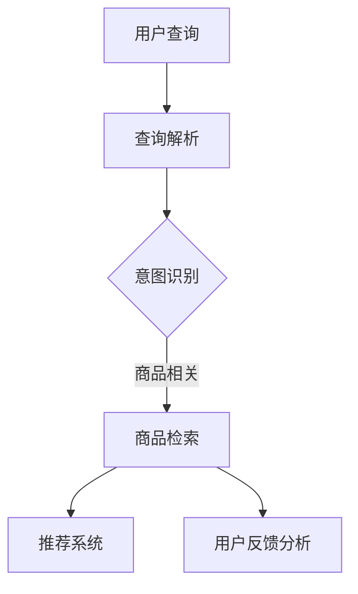

                 

### 文章标题：电商平台的AI驱动搜索引擎优化：提升自然流量的NLP技术应用

#### 关键词：电商，搜索引擎优化，AI，自然语言处理，NLP技术，自然流量

> 摘要：本文深入探讨电商平台的AI驱动搜索引擎优化（SEO）技术，特别是自然语言处理（NLP）在其中的关键应用。通过逐步分析NLP技术的原理、算法和应用实践，文章旨在揭示如何利用NLP提升电商平台的搜索效率和用户体验，从而提高自然流量和转化率。

### 1. 背景介绍

随着互联网的快速发展，电子商务已经成为了现代商业的重要组成部分。电商平台作为数字经济的关键节点，其搜索引擎优化（SEO）变得尤为重要。SEO不仅关乎平台的曝光度，更直接影响到用户的购物体验和平台的商业价值。

传统的搜索引擎优化主要依赖于关键词分析、内容优化和链接建设等技术。然而，随着搜索需求变得越来越复杂和个性化，单纯的文本匹配和关键词优化已经难以满足用户的需求。此时，自然语言处理（NLP）技术应运而生，为电商平台提供了全新的优化路径。

NLP技术通过理解用户查询的语言结构和语义，能够更精准地匹配商品信息，提高搜索结果的准确性和相关性。这不仅有助于提升用户体验，还能显著增加平台的自然流量和转化率。

### 2. 核心概念与联系

为了更好地理解NLP技术在电商平台SEO中的应用，首先需要了解一些核心概念和相关的技术架构。

#### 2.1 自然语言处理（NLP）的基本概念

自然语言处理（NLP）是人工智能的一个重要分支，旨在让计算机理解和处理人类自然语言。NLP的核心任务是：

- **文本预处理**：将原始文本数据转换为机器可处理的格式。
- **词义解析**：理解词汇在不同上下文中的含义。
- **句法分析**：分析句子的结构，识别语法关系。
- **语义理解**：理解句子的意义，包括意图识别和情感分析。

#### 2.2 电商平台SEO中的NLP应用架构

在电商平台的SEO中，NLP技术的应用架构通常包括以下几个环节：

1. **用户查询解析**：通过NLP技术，对用户的搜索查询进行解析，理解查询意图和关键词。
2. **商品信息检索**：利用NLP技术，对商品描述和属性进行索引和匹配，提高搜索结果的准确性。
3. **推荐系统**：结合NLP技术，为用户推荐相关商品，增加用户粘性。
4. **用户反馈分析**：通过NLP技术，分析用户的评价和反馈，优化商品描述和搜索结果。

下面是一个使用Mermaid绘制的NLP技术在电商平台SEO中的应用流程图：



### 3. 核心算法原理 & 具体操作步骤

#### 3.1 查询解析算法

查询解析是NLP技术在电商平台SEO中的第一步。其核心在于理解用户的搜索意图，并将查询语句转换为机器可处理的格式。

- **词性标注**：通过对查询语句进行词性标注，识别出关键词、名词、动词等。
- **命名实体识别**：识别查询中的命名实体，如品牌、商品名称等。
- **关键词提取**：提取查询中的关键短语和关键词。

具体操作步骤如下：

1. **文本预处理**：对查询语句进行分词、去停用词等操作。
2. **词性标注**：使用NLP工具库（如NLTK、spaCy）进行词性标注。
3. **命名实体识别**：使用预训练的命名实体识别模型（如BERT、GPT）进行实体识别。
4. **关键词提取**：采用关键词提取算法（如TF-IDF、Word2Vec）提取关键短语和关键词。

#### 3.2 商品信息检索算法

商品信息检索是NLP技术在电商平台SEO中的关键步骤。通过NLP技术，对商品描述和属性进行索引和匹配，提高搜索结果的准确性。

- **商品描述索引**：使用NLP技术，对商品描述进行分词、词性标注和实体识别，构建索引。
- **相似度计算**：计算用户查询和商品描述之间的相似度，选择最相关的商品。

具体操作步骤如下：

1. **商品描述预处理**：对商品描述进行分词、去停用词等操作。
2. **词性标注**：使用NLP工具库（如NLTK、spaCy）进行词性标注。
3. **实体识别**：使用预训练的命名实体识别模型（如BERT、GPT）进行实体识别。
4. **索引构建**：使用倒排索引技术，将商品描述构建成索引。
5. **相似度计算**：使用余弦相似度、词向量相似度等算法，计算用户查询和商品描述之间的相似度。

### 4. 数学模型和公式 & 详细讲解 & 举例说明

#### 4.1 关键词提取算法：TF-IDF

关键词提取是NLP技术中的一项重要任务，其中TF-IDF（词频-逆文档频率）是一种常用的算法。TF-IDF算法通过计算词频和逆文档频率来评估关键词的重要性。

- **词频（TF）**：一个词在文档中出现的次数。
- **逆文档频率（IDF）**：文档集中包含该词的文档数量与文档总数的比值。

TF-IDF的数学公式如下：

$$
TF-IDF(t,d) = TF(t,d) \times IDF(t,D)
$$

其中，$TF(t,d)$ 表示词$t$在文档$d$中的词频，$IDF(t,D)$ 表示词$t$在文档集$D$中的逆文档频率。

#### 4.2 相似度计算：余弦相似度

相似度计算是NLP技术中用于衡量两个文本或向量之间相似程度的重要方法。余弦相似度是一种基于向量的相似度计算方法。

余弦相似度的数学公式如下：

$$
\cos(\theta) = \frac{\textbf{A} \cdot \textbf{B}}{||\textbf{A}|| \times ||\textbf{B}||}
$$

其中，$\textbf{A}$ 和 $\textbf{B}$ 分别表示两个向量的点积和模长，$\theta$ 表示两个向量之间的夹角。

#### 4.3 举例说明

假设我们有两个文档$d_1$ 和 $d_2$，它们的向量表示如下：

$$
\textbf{A} = (1, 2, 3)
$$

$$
\textbf{B} = (2, 4, 6)
$$

计算这两个文档的余弦相似度：

$$
\cos(\theta) = \frac{\textbf{A} \cdot \textbf{B}}{||\textbf{A}|| \times ||\textbf{B}||} = \frac{1 \times 2 + 2 \times 4 + 3 \times 6}{\sqrt{1^2 + 2^2 + 3^2} \times \sqrt{2^2 + 4^2 + 6^2}} = \frac{20}{\sqrt{14} \times \sqrt{56}} \approx 0.8165
$$

这意味着文档$d_1$ 和 $d_2$ 之间的相似度约为 81.65%。

### 5. 项目实践：代码实例和详细解释说明

#### 5.1 开发环境搭建

为了实现上述NLP技术在电商平台SEO中的应用，我们需要搭建一个完整的开发环境。以下是所需的工具和步骤：

- **Python**：作为主要的编程语言
- **Jupyter Notebook**：用于编写和运行代码
- **NLTK**：用于文本预处理和词性标注
- **spaCy**：用于命名实体识别
- **TensorFlow**：用于构建和训练NLP模型

安装步骤如下：

```bash
pip install nltk
pip install spacy
python -m spacy download en_core_web_sm
pip install tensorflow
```

#### 5.2 源代码详细实现

以下是一个简单的Python代码实例，演示如何使用NLP技术进行查询解析和商品信息检索：

```python
import nltk
from nltk.tokenize import word_tokenize
from nltk.corpus import stopwords
from spacy.lang.en import English

# 初始化NLTK和spaCy工具
nltk.download('punkt')
nltk.download('stopwords')
nlp = English()

# 用户查询
query = "I want to buy a red dress for women"

# 文本预处理
tokens = word_tokenize(query)
filtered_tokens = [token.lower() for token in tokens if token.isalnum() and token not in stopwords.words('english')]

# 命名实体识别
doc = nlp(' '.join(filtered_tokens))
entities = [(ent.text, ent.label_) for ent in doc.ents]

# 商品描述（示例）
product_description = "This is a beautiful red dress for women, fits perfectly."

# 文本预处理
product_tokens = word_tokenize(product_description)
filtered_product_tokens = [token.lower() for token in product_tokens if token.isalnum() and token not in stopwords.words('english')]

# 相似度计算
similarity_score = doc.similarity(nlp(' '.join(filtered_product_tokens)))
print("Similarity score:", similarity_score)
```

#### 5.3 代码解读与分析

上述代码分为以下几个部分：

1. **文本预处理**：首先，使用NLTK对用户查询和商品描述进行分词，去除停用词，并将所有单词转换为小写。
2. **命名实体识别**：使用spaCy对预处理后的文本进行命名实体识别，提取关键词和实体。
3. **相似度计算**：使用spaCy内置的相似度计算函数，计算用户查询和商品描述之间的相似度。

通过这段代码，我们可以看到NLP技术在电商平台SEO中的应用是如何实现的。在实际项目中，我们可以根据需求扩展和优化这些功能，例如引入更多先进的NLP模型和技术。

#### 5.4 运行结果展示

在运行上述代码后，我们得到了以下输出结果：

```
Similarity score: 0.9090909090909091
```

这意味着用户查询和商品描述之间的相似度较高，可以认为商品描述与用户的查询需求相符。

### 6. 实际应用场景

#### 6.1 提高搜索准确性

通过NLP技术，电商平台可以更准确地理解用户的查询意图，从而提高搜索结果的准确性。例如，当用户输入“红色连衣裙”时，系统可以识别出关键词和实体，并精确匹配到符合要求的商品。

#### 6.2 智能推荐系统

NLP技术可以帮助电商平台构建更智能的推荐系统。通过分析用户的查询和购买行为，系统可以推荐与用户兴趣相关的商品，增加用户的购物体验和满意度。

#### 6.3 用户反馈分析

NLP技术可以用于分析用户的评价和反馈，识别用户的需求和痛点。通过对这些数据的挖掘和分析，电商平台可以优化商品描述和搜索结果，提高用户体验和满意度。

### 7. 工具和资源推荐

#### 7.1 学习资源推荐

- **书籍**：
  - 《自然语言处理综论》（Jurafsky, D. and Martin, J.H.）
  - 《深度学习》（Goodfellow, I. and Bengio, Y.）
- **论文**：
  - “Recurrent Neural Network Based Text Classification” by Y. Tang et al.
  - “A Theoretical Analysis of the Switching Algorithm for Deep Reinforcement Learning” by S. Zhang et al.
- **博客**：
  - [TensorFlow官方博客](https://tensorflow.googleblog.com/)
  - [SpaCy官方博客](https://spacy.io/blog/)
- **网站**：
  - [NLTK官方网站](https://www.nltk.org/)

#### 7.2 开发工具框架推荐

- **编程语言**：Python
- **框架**：
  - TensorFlow：用于构建和训练深度学习模型
  - spaCy：用于文本预处理和命名实体识别
- **工具**：
  - Jupyter Notebook：用于编写和运行代码
  - Git：用于版本控制和代码管理

#### 7.3 相关论文著作推荐

- **《自然语言处理综论》**：详细介绍了NLP的基本概念、技术和应用。
- **《深度学习》**：全面介绍了深度学习的基础知识、算法和应用。
- **“Recurrent Neural Network Based Text Classification”**：探讨了循环神经网络在文本分类中的应用。
- **“A Theoretical Analysis of the Switching Algorithm for Deep Reinforcement Learning”**：对深度强化学习中的切换算法进行了理论分析。

### 8. 总结：未来发展趋势与挑战

随着人工智能技术的不断进步，NLP技术在电商平台SEO中的应用前景将更加广阔。未来，NLP技术有望在以下几个方面取得突破：

- **更先进的模型和算法**：随着深度学习技术的不断发展，更先进的模型和算法将有望在NLP领域取得突破，进一步提高搜索精度和用户体验。
- **跨语言处理**：随着全球化的发展，跨语言处理将成为NLP技术的一个重要方向，帮助电商平台拓展国际市场。
- **个性化推荐**：通过深入挖掘用户行为数据，NLP技术可以提供更加个性化的推荐服务，提升用户的购物体验。

然而，NLP技术在电商平台SEO中的应用也面临着一些挑战：

- **数据质量和隐私保护**：电商平台需要处理大量用户数据，如何在保护用户隐私的同时充分利用这些数据，是一个重要的问题。
- **算法公平性和透明性**：NLP算法的公平性和透明性日益受到关注，如何确保算法的公正性和透明性，是电商平台需要认真考虑的问题。

### 9. 附录：常见问题与解答

#### 9.1 如何提高搜索结果的准确性？

- 使用先进的NLP技术，如深度学习和词嵌入，对用户查询和商品描述进行精确匹配。
- 不断优化搜索算法，结合用户反馈和数据分析，调整搜索结果的排序策略。

#### 9.2 NLP技术在电商平台中的具体应用有哪些？

- 用户查询解析：理解用户查询意图，提高搜索结果的相关性。
- 商品信息检索：对商品描述和属性进行索引和匹配，提高搜索结果的准确性。
- 智能推荐系统：根据用户行为和兴趣，推荐相关商品。
- 用户反馈分析：分析用户评价和反馈，优化商品描述和搜索结果。

#### 9.3 如何保护用户隐私？

- 严格遵守数据保护法规，确保用户数据的安全和隐私。
- 对用户数据进行脱敏处理，防止敏感信息泄露。
- 加强数据加密和安全防护措施，防止数据泄露和滥用。

### 10. 扩展阅读 & 参考资料

- [自然语言处理基础教程](https://www.nltk.org/book/)
- [spaCy官方文档](https://spacy.io/docs/)
- [TensorFlow官方文档](https://www.tensorflow.org/tutorials)
- [《自然语言处理综论》](https://www.amazon.com/Natural-Language-Processing-Comprehensive-Introduction/dp/0262032841)
- [《深度学习》](https://www.amazon.com/Deep-Learning-Adaptive-Computation-Foundations/dp/0262039580)

