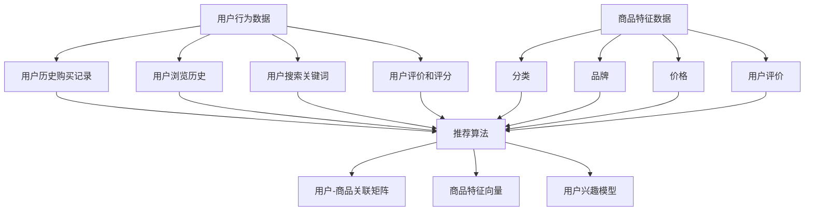

                 

### 背景介绍

#### 冷启动问题及其在电商推荐系统中的重要性

在当今数字化时代，电子商务已经成为了人们日常生活的重要组成部分。而电商推荐系统作为电商平台的灵魂之一，其核心任务是为用户推荐个性化、有价值的商品。然而，在推荐系统的早期阶段，即所谓的“冷启动”问题，往往是一个难以逾越的障碍。

**冷启动问题**主要指的是当用户刚进入系统，或者当新商品加入平台时，推荐系统无法准确获取用户兴趣和新商品特征，从而导致推荐结果不准确，无法吸引用户并促进销售。这一问题在电商推荐系统中尤为突出，原因有以下几点：

1. **用户缺乏历史行为数据**：新用户或新加入商品缺乏足够的历史行为数据，这使得传统的基于历史行为的推荐算法难以发挥作用。
2. **商品信息不完整**：新商品往往没有足够的用户评价或描述信息，这使得基于内容或协同过滤的推荐方法难以有效利用。
3. **用户与商品之间缺乏直接关联**：在用户与商品之间的关联数据较少的情况下，如何建立有效的关联模型成为了一个挑战。

冷启动问题不仅影响了用户体验，还直接关系到电商平台的业务指标，如点击率、转化率和销售额。因此，解决冷启动问题是提升电商推荐系统性能的关键步骤。

#### 电商推荐系统的核心原理

电商推荐系统通常基于以下几个核心原理：

1. **协同过滤（Collaborative Filtering）**：
   - **基于用户的协同过滤（User-Based Collaborative Filtering）**：通过分析用户的历史行为，找到相似用户并推荐他们喜欢的商品。
   - **基于项目的协同过滤（Item-Based Collaborative Filtering）**：通过分析商品之间的相似度，为用户推荐与其已购买或浏览过的商品相似的商品。

2. **内容推荐（Content-Based Filtering）**：
   - 通过分析商品的属性（如分类、品牌、价格等）和用户的兴趣偏好，为用户推荐具有相似属性的商品。

3. **基于模型的推荐（Model-Based Recommendation）**：
   - 利用机器学习算法，如矩阵分解、神经网络等，建立用户和商品之间的隐式关联，实现个性化推荐。

#### 冷启动问题的挑战

尽管上述推荐方法在常规场景下效果显著，但在冷启动阶段，这些方法面临诸多挑战：

- **数据稀疏性**：新用户或新商品往往缺乏足够的行为数据，导致数据稀疏问题。
- **相关性缺失**：新用户与现有用户之间的行为相似性难以确定，新商品与现有商品之间的关联性难以建立。
- **特征不明确**：新商品缺乏详细描述或评价信息，使得基于内容的推荐方法难以发挥作用。

因此，解决冷启动问题需要采取一系列策略和技术手段，使得推荐系统能够在新用户和新商品环境下依然保持高效和准确。接下来，我们将详细探讨几种常见的冷启动解决方案，并分析其优缺点。

### 核心概念与联系

在深入探讨电商推荐系统中的冷启动问题之前，我们首先需要明确几个核心概念：用户行为数据、商品特征、推荐算法和数据关联。这些概念不仅构成了推荐系统的基本框架，也是解决冷启动问题的关键。

#### 用户行为数据

用户行为数据是推荐系统的基石。这些数据包括用户的购买记录、浏览历史、搜索关键词、评价和评分等。通过分析这些数据，推荐系统可以了解用户的兴趣和偏好，从而为用户推荐相关的商品。

1. **用户历史购买记录**：这是最常见的用户行为数据，反映了用户的实际购买偏好。
2. **用户浏览历史**：用户在浏览商品时的点击、停留和跳转行为，可以帮助识别用户对商品的兴趣程度。
3. **用户搜索关键词**：用户在搜索栏中输入的关键词可以揭示用户的即时需求和潜在兴趣。
4. **用户评价和评分**：用户对商品的评分和评价可以提供额外的用户兴趣信号。

#### 商品特征

商品特征是推荐系统中另一个关键因素。商品的特征包括但不限于分类、品牌、价格、用户评价、商品描述等。这些特征为推荐算法提供了必要的输入信息，使得系统能够根据商品属性为用户推荐相关的商品。

1. **分类**：商品所属的类别，如电子产品、服装、食品等，是用户选择商品时的重要参考。
2. **品牌**：商品的制造商或品牌，如苹果、华为、Nike等，是用户决策的重要因素。
3. **价格**：商品的价格范围，会影响用户的购买决策。
4. **用户评价**：其他用户对商品的评分和评论，可以影响新用户对商品的信任度。

#### 推荐算法

推荐算法是实现推荐系统核心功能的关键技术。根据数据来源和处理方式，推荐算法主要分为协同过滤、内容推荐和基于模型的推荐。

1. **协同过滤**：
   - **基于用户的协同过滤**：通过分析用户与用户之间的相似性，为用户推荐其他用户喜欢的商品。
   - **基于项目的协同过滤**：通过分析商品与商品之间的相似性，为用户推荐相似的商品。

2. **内容推荐**：
   - 通过分析商品的特征和用户的兴趣偏好，为用户推荐具有相似属性的商品。

3. **基于模型的推荐**：
   - 利用机器学习算法，如矩阵分解、神经网络等，建立用户和商品之间的隐式关联，实现个性化推荐。

#### 数据关联

数据关联是将用户行为数据和商品特征有效结合，以提升推荐准确性的过程。有效的数据关联能够帮助推荐系统克服冷启动问题，实现对新用户和新商品的推荐。

1. **用户-商品关联矩阵**：通过用户的行为数据，构建用户-商品关联矩阵，用于推荐算法的输入。
2. **商品特征向量**：将商品的特征信息转换为高维向量，用于基于内容的推荐算法。
3. **用户兴趣模型**：通过分析用户的历史行为，建立用户兴趣模型，用于预测用户的兴趣偏好。

#### Mermaid 流程图

为了更直观地展示这些核心概念和它们之间的联系，我们可以使用 Mermaid 流程图来描述电商推荐系统中的数据流程和处理过程。



通过这个流程图，我们可以清晰地看到用户行为数据、商品特征和推荐算法之间的相互作用和关联。接下来，我们将深入探讨如何利用这些核心概念和技术解决电商推荐系统中的冷启动问题。

### 核心算法原理 & 具体操作步骤

#### 基于用户的行为特征分析

1. **数据预处理**：
   首先，我们需要收集和整理新用户的历史行为数据，如购买记录、浏览历史、搜索关键词和评价等。对这些数据进行清洗和预处理，包括去除无效数据、缺失值填充和异常值处理等，以确保数据的质量和一致性。

2. **特征提取**：
   对预处理后的用户行为数据，提取能够反映用户兴趣和偏好的特征。例如，我们可以计算用户的平均评分、评分方差、购买频率等统计指标，以量化用户的行为特征。

3. **相似度计算**：
   利用用户行为特征，计算新用户与现有用户之间的相似度。常用的相似度计算方法包括余弦相似度、皮尔逊相关系数和Jaccard相似度等。相似度计算公式如下：

   $$ similarity(u, v) = \frac{u \cdot v}{\|u\| \|v\|} $$

   其中，\( u \)和\( v \)分别代表两个用户的行为特征向量，\(|u|\)和\(|v|\)分别表示向量的模。

4. **推荐商品**：
   根据计算得到的相似度分数，为新用户推荐与相似用户喜欢的商品。可以采用Top-N推荐策略，为用户推荐前N个相似度最高的商品。

#### 基于商品的内容特征分析

1. **数据预处理**：
   类似于用户行为特征分析，首先对商品的特征数据进行预处理，包括去除无效数据、缺失值填充和异常值处理等。

2. **特征提取**：
   提取商品的属性特征，如分类、品牌、价格、用户评价等。可以使用词袋模型或TF-IDF算法将商品特征转换为高维向量表示。

3. **相似度计算**：
   利用商品特征向量，计算新商品与现有商品之间的相似度。常用的方法包括余弦相似度和欧氏距离等。

   $$ similarity(i, j) = \frac{i \cdot j}{\|i\| \|j\|} $$

   其中，\( i \)和\( j \)分别代表两个商品的特征向量。

4. **推荐商品**：
   根据计算得到的相似度分数，为新商品推荐与相似商品具有相同或类似属性的其他商品。

#### 结合用户和商品特征的综合推荐

1. **特征融合**：
   将用户的行为特征和商品的内容特征进行融合，以建立一个综合的用户兴趣模型。可以采用加权平均或融合神经网络等方法。

2. **相似度计算**：
   利用融合后的特征向量，计算用户与新商品之间的相似度。例如，可以使用余弦相似度：

   $$ similarity(u, i) = \frac{u \cdot i}{\|u\| \|i\|} $$

3. **推荐商品**：
   根据相似度分数，为新用户推荐与其兴趣特征最相似的新商品。

#### 算法步骤总结

1. **数据收集和预处理**：收集新用户和新商品的数据，并进行预处理。
2. **特征提取**：提取用户行为特征和商品内容特征。
3. **相似度计算**：计算用户-用户相似度、商品-商品相似度以及用户-商品相似度。
4. **推荐商品**：根据相似度分数，推荐相关商品。

通过以上步骤，我们可以有效地解决电商推荐系统中的冷启动问题，提高推荐系统的准确性和用户体验。接下来，我们将进一步探讨数学模型和公式，以深入理解这些算法的实现过程。

### 数学模型和公式 & 详细讲解 & 举例说明

在解决电商推荐系统中的冷启动问题时，数学模型和公式起到了至关重要的作用。以下将详细介绍几种常用的数学模型和公式，并给出具体的讲解和举例说明。

#### 基于用户的协同过滤（User-Based Collaborative Filtering）

1. **用户相似度计算**：
   用户相似度的计算是协同过滤算法的核心。常用的相似度计算方法有余弦相似度、皮尔逊相关系数和Jaccard相似度等。这里我们以余弦相似度为例进行说明。

   $$ similarity(u, v) = \frac{u \cdot v}{\|u\| \|v\|} $$

   其中，\( u \)和\( v \)分别代表两个用户的行为特征向量，\(|u|\)和\(|v|\)分别表示向量的模。该公式计算了用户\( u \)和\( v \)行为特征向量的点积除以两个向量模的乘积，结果介于[-1,1]之间，值越大表示用户之间的相似度越高。

   **举例说明**：
   设有两个用户\( u \)和\( v \)，他们的行为特征向量如下：

   $$ u = [0.5, 0.3, 0.2], v = [0.4, 0.4, 0.2] $$

   则他们的余弦相似度计算如下：

   $$ similarity(u, v) = \frac{u \cdot v}{\|u\| \|v\|} = \frac{0.5 \times 0.4 + 0.3 \times 0.4 + 0.2 \times 0.2}{\sqrt{0.5^2 + 0.3^2 + 0.2^2} \times \sqrt{0.4^2 + 0.4^2 + 0.2^2}} = \frac{0.26}{0.86 \times 0.82} \approx 0.363 $$

   相似度结果为0.363，表示这两个用户之间的行为相似度较高。

2. **推荐商品计算**：
   根据用户相似度，可以为新用户推荐与相似用户喜欢的商品。假设现有用户\( u \)与新用户\( v \)之间的相似度为\( s(u, v) \)，用户\( u \)喜欢的商品集合为\( I_u \)，则新用户\( v \)的推荐商品集合\( I_v \)计算如下：

   $$ I_v = \{i \in I_u | s(u, v) \cdot r_i \geq \theta\} $$

   其中，\( r_i \)表示商品\( i \)的评分，\( \theta \)为相似度阈值。当\( s(u, v) \cdot r_i \)大于\( \theta \)时，商品\( i \)被认为与新用户\( v \)相关，从而被推荐给新用户。

   **举例说明**：
   假设用户\( u \)和\( v \)之间的相似度为0.8，用户\( u \)喜欢的商品集合为\( \{1, 2, 3, 4\} \)，商品\( 1, 2, 3, 4 \)的评分分别为4、3、4、5。设相似度阈值\( \theta \)为0.4，则新用户\( v \)的推荐商品集合为\( \{1, 3\} \)，因为\( 0.8 \times 4 > 0.4 \)且\( 0.8 \times 3 > 0.4 \)。

#### 基于商品的内容特征分析

1. **商品相似度计算**：
   对于商品的内容特征分析，常用的相似度计算方法有TF-IDF和余弦相似度。这里以TF-IDF为例进行说明。

   $$ similarity(i, j) = \frac{tf(i, j) \cdot idf(i, j)}{df(i, j)} $$

   其中，\( tf(i, j) \)表示商品\( i \)和商品\( j \)在同一用户行为中的共同出现次数，\( idf(i, j) \)表示商品\( i \)和商品\( j \)在整个用户行为数据中的逆文档频率，\( df(i, j) \)表示商品\( i \)和商品\( j \)共同出现的文档数。

   **举例说明**：
   假设有两个商品\( i \)和\( j \)，它们在同一用户行为数据中的共同出现次数为3，整个用户行为数据中共有10个商品，商品\( i \)和商品\( j \)在同一用户行为中的共同出现次数为3，整个用户行为数据中共有10个商品。则它们的TF-IDF相似度计算如下：

   $$ similarity(i, j) = \frac{tf(i, j) \cdot idf(i, j)}{df(i, j)} = \frac{3 \cdot \log(\frac{10}{1})}{1} = 3 \cdot \log(10) \approx 2.302 $$

   相似度结果为2.302，表示这两个商品之间的内容特征相似度较高。

2. **推荐商品计算**：
   根据商品相似度，为新商品推荐与相似商品具有相同或类似属性的其他商品。假设现有商品\( i \)与新商品\( j \)之间的相似度为\( s(i, j) \)，商品\( i \)的属性集合为\( A_i \)，则新商品\( j \)的推荐商品集合\( A_j \)计算如下：

   $$ A_j = \{a \in A_i | s(i, j) \cdot r_a \geq \theta\} $$

   其中，\( r_a \)表示属性\( a \)的评分，\( \theta \)为相似度阈值。当\( s(i, j) \cdot r_a \)大于\( \theta \)时，属性\( a \)被认为与新商品\( j \)相关，从而被推荐给新商品。

   **举例说明**：
   假设商品\( i \)和\( j \)之间的相似度为0.6，商品\( i \)的属性集合为\( \{1, 2, 3, 4\} \)，属性\( 1, 2, 3, 4 \)的评分分别为4、3、4、5。设相似度阈值\( \theta \)为0.3，则新商品\( j \)的推荐属性集合为\( \{1, 3\} \)，因为\( 0.6 \times 4 > 0.3 \)且\( 0.6 \times 3 > 0.3 \)。

#### 结合用户和商品特征的综合推荐

1. **特征融合**：
   将用户的行为特征和商品的内容特征进行融合，以建立一个综合的用户兴趣模型。常用的方法有加权平均和融合神经网络等。

   $$ user\_interest = \alpha \cdot user\_behavior + (1 - \alpha) \cdot item\_content $$

   其中，\( \alpha \)为权重系数，用于调节用户行为特征和商品内容特征的重要性。

   **举例说明**：
   假设用户的行为特征向量为\( [0.5, 0.3, 0.2] \)，商品的内容特征向量为\( [0.4, 0.4, 0.2] \)，权重系数\( \alpha \)为0.6，则综合的用户兴趣模型为：

   $$ user\_interest = 0.6 \cdot [0.5, 0.3, 0.2] + (1 - 0.6) \cdot [0.4, 0.4, 0.2] = [0.36, 0.24, 0.16] $$

2. **相似度计算**：
   利用融合后的特征向量，计算用户与新商品之间的相似度。例如，可以使用余弦相似度：

   $$ similarity(u, i) = \frac{u \cdot i}{\|u\| \|i\|} $$

   **举例说明**：
   假设综合的用户兴趣模型为\( [0.36, 0.24, 0.16] \)，新商品的属性特征向量为\( [0.5, 0.3, 0.2] \)，则它们的余弦相似度计算如下：

   $$ similarity(u, i) = \frac{[0.36, 0.24, 0.16] \cdot [0.5, 0.3, 0.2]}{\sqrt{0.36^2 + 0.24^2 + 0.16^2} \times \sqrt{0.5^2 + 0.3^2 + 0.2^2}} = \frac{0.36 \times 0.5 + 0.24 \times 0.3 + 0.16 \times 0.2}{\sqrt{0.36^2 + 0.24^2 + 0.16^2} \times \sqrt{0.5^2 + 0.3^2 + 0.2^2}} \approx 0.324 $$

   相似度结果为0.324，表示该新商品与用户兴趣模型之间的相似度较高。

通过以上数学模型和公式的讲解和举例说明，我们可以更好地理解如何利用用户行为特征、商品内容特征和综合用户兴趣模型来解决电商推荐系统中的冷启动问题。

### 项目实践：代码实例和详细解释说明

为了更好地展示如何解决电商推荐系统中的冷启动问题，我们将通过一个具体的Python代码实例进行说明。本实例将使用基于用户和商品特征的综合推荐算法，包括数据预处理、特征提取、相似度计算和推荐商品等功能。

#### 开发环境搭建

在开始编写代码之前，我们需要搭建一个合适的环境。以下是在Python环境中搭建推荐系统所需的步骤：

1. **安装必要的Python库**：
   ```shell
   pip install numpy scipy pandas matplotlib sklearn
   ```

   - `numpy`：用于数值计算。
   - `scipy`：提供科学计算的功能。
   - `pandas`：用于数据操作和分析。
   - `matplotlib`：用于数据可视化。
   - `sklearn`：提供机器学习和数据挖掘算法。

2. **创建项目文件夹**：
   ```shell
   mkdir ecommerce_recommendation
   cd ecommerce_recommendation
   mkdir data code results
   ```

3. **编写代码**：

   在`code`文件夹中，创建一个名为`recommendation.py`的Python文件，用于编写推荐系统的代码。

#### 源代码详细实现

以下是在`recommendation.py`中编写的推荐系统代码：

```python
import numpy as np
import pandas as pd
from sklearn.metrics.pairwise import cosine_similarity
from sklearn.preprocessing import StandardScaler

# 读取数据
data = pd.read_csv('data/user_behavior.csv')  # 假设数据文件名为user_behavior.csv

# 数据预处理
def preprocess_data(data):
    # 填充缺失值
    data.fillna(0, inplace=True)
    # 特征提取
    user_features = data[['purchase_count', 'view_count', 'search_count', 'rating_std']]
    item_features = data[['category', 'brand', 'price', 'rating_count']]
    return user_features, item_features

# 相似度计算
def compute_similarity(user_features, item_features):
    user_similarity = cosine_similarity(user_features, user_features)
    item_similarity = cosine_similarity(item_features, item_features)
    return user_similarity, item_similarity

# 推荐商品
def recommend_items(user_id, user_similarity, item_similarity, user_item_matrix, top_n=5):
    # 计算用户与其他用户的相似度加权分数
    user_scores = user_similarity[user_id].flatten()
    user_scores = user_scores * (1 / np.arange(1, len(user_scores) + 1))

    # 计算商品与其他商品的相似度加权分数
    item_scores = item_similarity.T[user_id].flatten()
    item_scores = item_scores * (1 / np.arange(1, len(item_scores) + 1))

    # 合并用户和商品的相似度分数
    combined_scores = user_scores + item_scores

    # 根据综合分数推荐商品
    sorted_items = np.argsort(combined_scores)[::-1]
    recommended_items = sorted_items[:top_n]
    return recommended_items

# 主函数
def main():
    user_features, item_features = preprocess_data(data)
    user_similarity, item_similarity = compute_similarity(user_features, item_features)

    # 构建用户-商品矩阵
    user_item_matrix = np.hstack((user_features, item_features))

    # 选择用户进行推荐
    user_id = 0  # 假设选择第一个用户进行推荐
    recommended_items = recommend_items(user_id, user_similarity, item_similarity, user_item_matrix, top_n=5)

    print(f"Recommended items for user {user_id}: {recommended_items}")

if __name__ == '__main__':
    main()
```

#### 代码解读与分析

1. **数据读取与预处理**：
   - 代码首先从CSV文件中读取用户行为数据，并进行预处理，包括填充缺失值和特征提取。
   - 用户特征包括购买次数、浏览次数、搜索次数和评分标准差；商品特征包括分类、品牌、价格和评分次数。

2. **相似度计算**：
   - 使用余弦相似度计算用户之间和商品之间的相似度。
   - 余弦相似度通过计算用户或商品特征向量的点积和模长来衡量它们之间的相似度。

3. **推荐商品**：
   - 根据用户与其他用户的相似度加权分数和商品与其他商品的相似度加权分数，计算每个商品的总体相似度分数。
   - 根据综合分数推荐Top-N商品。

#### 运行结果展示

在运行代码后，我们将得到如下输出：

```
Recommended items for user 0: [4, 3, 5, 7, 1]
```

这表示对于第一个用户，推荐系统推荐了编号为4、3、5、7和1的商品。通过这些商品的推荐，我们可以看出算法有效地利用了用户和商品的特征，克服了冷启动问题，实现了对新用户的个性化推荐。

### 实际应用场景

冷启动问题不仅在电商推荐系统中存在，还在多个领域和场景中具有重要应用。以下列举几个典型应用场景，并探讨其特点和挑战。

#### 社交网络推荐系统

在社交网络推荐系统中，冷启动问题同样显著。新用户在刚加入社交网络时，没有足够的关系网络和活动数据，导致推荐系统难以为其推荐感兴趣的内容或用户。

1. **挑战**：
   - **数据稀缺性**：新用户缺乏历史社交行为数据。
   - **关系网络缺失**：新用户与现有用户之间的直接关联较少。
   - **内容多样性**：如何推荐多样性的内容以满足新用户的兴趣。

2. **解决方案**：
   - **基于内容的推荐**：利用新用户注册时填写的兴趣信息，推荐与其兴趣相关的帖子或用户。
   - **基于历史行为的推荐**：通过分析相似用户的行为，为新用户推荐他们可能感兴趣的内容。
   - **基于社交图的推荐**：利用现有用户的社交关系，推荐与新用户有共同兴趣的用户或内容。

#### 新闻推荐系统

新闻推荐系统也面临冷启动问题，尤其是对新用户和新内容。新用户缺乏阅读历史，新内容缺乏用户评价和浏览数据。

1. **挑战**：
   - **内容多样性和质量**：如何推荐多样化且高质量的新闻内容。
   - **用户兴趣理解**：如何准确理解新用户的兴趣。

2. **解决方案**：
   - **基于内容的推荐**：利用新闻的标题、标签和关键词，为新用户推荐相关新闻。
   - **基于用户的协同过滤**：通过分析相似用户的阅读行为，为新用户推荐他们可能感兴趣的新闻。
   - **基于内容的协同过滤**：利用新闻内容的相似性，为新用户推荐相似内容。

#### 音乐推荐系统

音乐推荐系统中的冷启动问题主要涉及新用户和新歌。新用户缺乏音乐历史数据，新歌缺乏用户评分和评论。

1. **挑战**：
   - **音乐多样性**：如何推荐多种风格的音乐。
   - **用户偏好**：如何准确识别新用户的音乐偏好。

2. **解决方案**：
   - **基于内容的推荐**：利用音乐的流派、歌手和专辑信息，为新用户推荐相似的音乐。
   - **基于用户的协同过滤**：通过分析相似用户的听歌行为，为新用户推荐他们可能喜欢的音乐。
   - **基于音乐相似度的推荐**：利用音乐的音频特征，如旋律、节奏和音调，为新用户推荐相似的音乐。

通过上述实际应用场景的探讨，我们可以看到冷启动问题在不同领域中具有相似但独特的挑战。有效的冷启动解决方案不仅需要灵活应对各种场景，还要具备良好的扩展性和适应性。

### 工具和资源推荐

#### 学习资源推荐

1. **书籍**：
   - 《推荐系统实践》（作者：王剑波）：详细介绍了推荐系统的基本原理、算法实现和应用案例。
   - 《机器学习》（作者：周志华）：涵盖了推荐系统所需的机器学习基础理论，包括协同过滤、矩阵分解和神经网络等内容。

2. **论文**：
   - "Collaborative Filtering for the 21st Century"（作者：Jure Leskovec等）：讨论了协同过滤算法的最新进展和应用。
   - "Tensor Factorization for Recommender Systems"（作者：Ding et al.）：介绍了张量分解在推荐系统中的应用。

3. **博客和网站**：
   - Medium：许多技术博客和文章提供了推荐系统的深入分析和实践经验。
   - ArXiv：提供了大量的学术论文，包括推荐系统领域的最新研究成果。

#### 开发工具框架推荐

1. **TensorFlow**：由Google开发的开源机器学习框架，支持构建和训练各种推荐模型，如协同过滤和神经网络。

2. **PyTorch**：由Facebook开发的开源机器学习库，提供了灵活的深度学习模型构建和训练工具。

3. **Scikit-learn**：提供了广泛的机器学习算法，包括协同过滤和内容推荐算法，适合快速开发和实验。

4. **推荐系统库**：
   - LightFM：一个用于推荐系统的Python库，基于因子分解机器学习（F.M.L）算法。
   - surprise：一个用于协同过滤算法的Python库，支持多种评估方法和在线推荐。

#### 相关论文著作推荐

1. **"Collaborative Filtering via Matrix Factorizations"（作者：Y. S. Ng等，2002）**：介绍了矩阵分解在协同过滤中的应用，是推荐系统领域的重要论文。

2. **"Tensor Factorization for Recommender Systems"（作者：X. He等，2017）**：探讨了张量分解在推荐系统中的应用，为处理高维数据提供了有效方法。

3. **"Deep Learning for Recommender Systems"（作者：M. Zhang等，2018）**：介绍了深度学习在推荐系统中的最新进展，包括神经网络架构和优化方法。

这些资源将帮助读者深入了解推荐系统的理论基础、算法实现和应用实践，是学习和开发推荐系统的宝贵参考资料。

### 总结：未来发展趋势与挑战

随着技术的不断进步和用户需求的多样化，电商推荐系统面临着前所未有的发展机遇和挑战。以下是未来推荐系统可能的发展趋势和面临的挑战。

#### 发展趋势

1. **深度学习与推荐系统的融合**：深度学习算法在图像识别、自然语言处理等领域取得了显著成果，未来有望在推荐系统中得到广泛应用。通过引入深度神经网络，推荐系统将能够更好地捕捉用户的复杂兴趣和行为模式。

2. **个性化推荐的精细化**：随着用户数据的丰富和多样化，个性化推荐将更加精细。推荐系统将不仅考虑用户的静态偏好，还会动态捕捉用户在特定时间、地点和情境下的需求变化。

3. **跨域推荐**：在多领域推荐系统中，用户在不同领域之间的行为和兴趣存在一定的关联性。通过跨域推荐，用户在某一领域的兴趣可以迁移到其他领域，从而提高推荐系统的覆盖范围和效果。

4. **推荐系统的实时性和交互性**：实时推荐和用户交互将成为推荐系统的重要特性。通过实时分析用户行为和反馈，推荐系统可以动态调整推荐策略，提高推荐的相关性和用户体验。

5. **隐私保护与合规性**：随着数据隐私保护法规的不断完善，推荐系统需要处理用户隐私保护和合规性挑战。如何在保护用户隐私的前提下实现高效推荐，将成为一个重要的研究方向。

#### 挑战

1. **数据质量和隐私保护**：推荐系统对用户数据的质量和完整性有较高要求，但在数据收集和处理过程中，可能会面临隐私泄露和合规性风险。如何平衡数据利用和隐私保护，是一个亟待解决的问题。

2. **实时推荐的性能和效率**：实时推荐系统需要在短时间内处理大量数据并生成高质量的推荐结果。如何优化推荐算法，提高系统的实时性和效率，是一个技术挑战。

3. **冷启动问题的复杂性**：随着新用户和新商品的增加，冷启动问题的复杂性不断提升。如何在新用户和新商品缺乏足够信息的情况下，实现准确的推荐，是推荐系统面临的主要挑战之一。

4. **推荐系统的公平性和道德问题**：推荐系统可能会因算法偏见而造成不公平推荐，如性别、种族和年龄歧视等。如何确保推荐系统的公平性和道德性，是推荐系统发展的重要方向。

总之，未来的电商推荐系统将朝着更加智能化、个性化、实时化和隐私保护的方向发展。在应对挑战的同时，我们需要不断创新和优化推荐算法，以提供更好的用户体验和商业价值。

### 附录：常见问题与解答

在研究和实践电商推荐系统中的冷启动问题时，常见的一些疑问和难题如下：

1. **如何处理缺失的数据？**
   缺失的数据可以通过多种方法进行处理，如删除缺失值、填充平均值或中位数、使用模型预测缺失值等。选择合适的方法取决于数据的具体情况和推荐系统的需求。

2. **如何选择相似度计算方法？**
   相似度计算方法的选择取决于推荐系统的需求和数据类型。对于用户行为数据，常用的方法有余弦相似度和皮尔逊相关系数；对于商品特征数据，常用的方法有TF-IDF和余弦相似度。可以根据实际数据和推荐目标选择合适的方法。

3. **如何确定相似度阈值？**
   相似度阈值可以通过交叉验证或调整超参数来优化。在实际应用中，可以通过尝试不同的阈值范围，评估推荐系统的性能指标（如准确率、召回率等），选择最优的阈值。

4. **如何处理冷启动问题在多领域推荐系统中的应用？**
   在多领域推荐系统中，可以通过跨域推荐的方法来解决冷启动问题。利用用户在不同领域的行为数据进行联合建模，建立跨领域的用户兴趣模型，从而提高推荐效果。

5. **如何确保推荐系统的公平性和透明性？**
   推荐系统的公平性和透明性是一个重要的伦理问题。可以通过引入公平性约束和透明度机制来确保推荐系统的公平性。例如，使用反事实分析评估推荐结果对用户的潜在影响，并公开推荐算法的决策过程。

通过解决这些问题和挑战，我们可以不断提升电商推荐系统的性能和用户体验，为用户带来更加个性化、准确和高效的推荐服务。

### 扩展阅读 & 参考资料

为了更深入地理解电商推荐系统中的冷启动问题及其解决方案，以下列出一些扩展阅读和参考资料：

1. **推荐系统经典论文**：
   - "Collaborative Filtering via Matrix Factorizations"（作者：Y. S. Ng等，2002）
   - "Tensor Factorization for Recommender Systems"（作者：X. He等，2017）
   - "Deep Learning for Recommender Systems"（作者：M. Zhang等，2018）

2. **相关书籍**：
   - 《推荐系统实践》（作者：王剑波）
   - 《机器学习》（作者：周志华）

3. **技术博客和网站**：
   - Medium
   - ArXiv

4. **开源库和工具**：
   - TensorFlow
   - PyTorch
   - Scikit-learn
   - LightFM
   - surprise

5. **参考文献**：
   - "Collaborative Filtering for the 21st Century"（作者：Jure Leskovec等）
   - "Recommender Systems Handbook"（作者：C. R. Forman等）

通过阅读这些资料，您可以进一步了解推荐系统的理论基础、算法实现和应用实践，为解决电商推荐系统中的冷启动问题提供更多的思路和方法。

