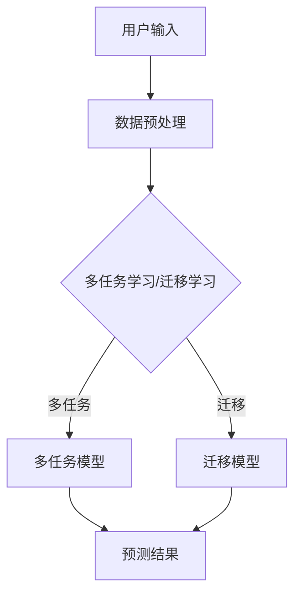

                 

### 背景介绍

随着互联网的快速发展，电子商务行业迎来了前所未有的繁荣。电商平台的用户规模与日俱增，与此同时，用户对个性化推荐的需求也日益增长。个性化推荐系统已经成为电商平台提升用户满意度和转化率的重要手段。然而，随着推荐系统中涉及的数据类型和任务类型的增加，传统的单一任务学习方法在应对复杂场景时表现不佳。

多任务学习和迁移学习作为机器学习领域中的重要方法，近年来在推荐系统中得到了广泛的研究和应用。多任务学习（Multi-Task Learning，MTL）旨在同时解决多个相关任务，通过共享模型参数来提高各个任务的性能。迁移学习（Transfer Learning，TL）则利用已在不同任务上训练好的模型，来提高新任务的性能，特别是当训练数据不足时。

多任务学习与迁移学习在电商推荐系统中的应用，可以有效解决以下问题：

1. **数据不平衡**：电商推荐系统中，用户对某些商品的评价数据可能非常稀疏，而其他商品则相对丰富。多任务学习可以通过共享参数来平衡不同任务的模型权重，从而提高对稀疏数据的处理能力。

2. **冷启动问题**：新用户或新商品在没有足够历史数据的情况下，传统的推荐系统很难为其提供个性化的推荐。迁移学习可以通过利用其他任务或域中的知识，为新用户或新商品生成初始的推荐结果。

3. **知识共享**：多任务学习能够将一个任务中提取到的特征和知识应用到其他任务上，从而提高整个推荐系统的性能。

本文将深入探讨多任务学习和迁移学习在电商推荐系统中的应用，从核心概念、算法原理到实际操作步骤，逐一展开讨论。我们希望通过本文，为从事推荐系统研究和开发的工作者提供一些有价值的参考和思路。

## 2. 核心概念与联系

### 2.1. 多任务学习（Multi-Task Learning，MTL）

多任务学习是指同时训练多个相关任务，共享模型参数，以提高各个任务的性能。在多任务学习中，不同的任务可以看作是相互依赖的，它们共享一部分模型参数，但同时也保留各自独立的任务参数。这样，一个任务的学习可以正迁移到其他任务上，提高整体系统的性能。

多任务学习的主要思想是通过共享表示来提取任务间共有的特征，从而提升模型的泛化能力。在电商推荐系统中，多任务学习的典型应用包括同时预测用户对多个商品的评分、同时识别用户兴趣和商品类别等。

### 2.2. 迁移学习（Transfer Learning，TL）

迁移学习是一种将一个任务上学习到的知识应用于不同但相关任务上的方法。它的核心思想是利用已有模型在新任务上的训练，以减少对新任务数据的依赖，提高模型的训练效率和性能。在推荐系统中，迁移学习通常用于处理新用户或新商品的推荐问题。

迁移学习可以分为以下几种类型：

- **基于特征的迁移**：通过迁移共享的特征表示来提高新任务的性能。
- **基于模型的迁移**：直接迁移预训练好的模型在新任务上进行微调。
- **基于算法的迁移**：使用在不同任务上证明有效的算法来解决新任务。

### 2.3. 多任务学习与迁移学习的联系

多任务学习和迁移学习在电商推荐系统中有着紧密的联系。多任务学习通过共享参数来提取任务间共有的特征，迁移学习则利用这些特征或模型来处理新任务或新用户。具体来说，多任务学习可以通过迁移学习来提高对新用户或新商品的推荐效果，而迁移学习可以为多任务学习提供初始的模型或特征表示，从而加速模型的训练过程。

### 2.4. 多任务学习与迁移学习的架构

为了更好地理解多任务学习和迁移学习在电商推荐系统中的应用，我们通过Mermaid流程图展示其架构。



在此流程中，用户输入经过数据预处理后，分别进入多任务学习和迁移学习模块。多任务模型通过共享参数同时预测多个任务，如用户对商品的评分、用户兴趣等。迁移模型则利用已有模型或特征表示来处理新任务或新用户。最终，预测结果提供给用户，形成推荐结果。

通过上述介绍，我们可以看到多任务学习和迁移学习在电商推荐系统中具有重要的应用价值。它们不仅可以提高推荐系统的性能，还可以解决数据不平衡、冷启动等问题。在接下来的章节中，我们将深入探讨这些技术的具体实现方法和应用案例。

## 3. 核心算法原理 & 具体操作步骤

### 3.1. 多任务学习算法原理

多任务学习（MTL）的核心思想是通过共享模型参数来提高多个相关任务的性能。在多任务学习中，各个任务之间存在一定的相关性，通过共享部分参数，模型可以在学习一个任务的同时，利用已学习的知识对其他任务进行优化。

多任务学习的基本原理可以分为以下几个步骤：

1. **任务定义**：首先定义需要同时训练的多个任务。这些任务可以是相关的，例如同时预测用户对多个商品的评分和推荐商品类别。

2. **模型架构**：设计一个共享模型架构，该架构包括共享层和任务特定层。共享层提取通用特征，任务特定层针对每个任务进行特定处理。

3. **参数共享**：在训练过程中，共享层和任务特定层的参数是共享的。这样可以使得一个任务的学习对其他任务产生正迁移。

4. **损失函数**：多任务学习通常使用多个损失函数来评估各个任务的性能，并将这些损失函数加权求和作为总损失函数。这样可以同时优化多个任务。

5. **优化算法**：采用优化算法（如梯度下降）来最小化总损失函数，从而训练出性能最优的模型。

### 3.2. 迁移学习算法原理

迁移学习（TL）是通过将已在不同任务上训练好的模型或特征迁移到新任务上来提高其性能的一种方法。迁移学习的基本原理可以分为以下几种类型：

1. **基于特征的迁移**：该方法通过迁移共享的特征表示来提高新任务的性能。在训练过程中，首先在源任务上训练一个特征提取器，然后将这个特征提取器应用到新任务上。

2. **基于模型的迁移**：该方法直接将预训练好的模型在新任务上进行微调。例如，在图像识别任务上预训练的卷积神经网络（CNN）可以迁移到语音识别任务中。

3. **基于算法的迁移**：该方法利用在不同任务上证明有效的算法来解决新任务。例如，在自然语言处理（NLP）任务上，某些算法（如循环神经网络RNN）在多个任务上表现出色，可以将这些算法迁移到其他NLP任务中。

### 3.3. 多任务学习与迁移学习在推荐系统中的操作步骤

在电商推荐系统中，多任务学习和迁移学习可以通过以下步骤来实现：

1. **数据收集与预处理**：
   - 收集用户行为数据、商品数据等。
   - 对数据进行清洗、归一化等预处理操作。

2. **任务定义**：
   - 根据业务需求定义需要同时训练的任务，如用户兴趣识别、商品推荐等。

3. **模型设计**：
   - 设计一个多任务学习模型架构，包括共享层和任务特定层。
   - 对于迁移学习，可以选择已在不同任务上训练好的模型或特征提取器。

4. **模型训练**：
   - 使用优化算法（如梯度下降）对模型进行训练。
   - 同时优化多个任务的损失函数，以获得性能最优的模型。

5. **模型评估**：
   - 对训练好的模型进行评估，可以使用如准确率、召回率等指标。
   - 调整模型参数和损失函数权重，以进一步提高模型性能。

6. **预测与应用**：
   - 使用训练好的模型对新用户或新商品进行预测。
   - 将预测结果应用到推荐系统中，为用户生成个性化的推荐。

通过上述步骤，电商推荐系统可以实现多任务学习和迁移学习，从而提高推荐效果，解决数据不平衡、冷启动等问题。

## 4. 数学模型和公式 & 详细讲解 & 举例说明

### 4.1. 多任务学习数学模型

多任务学习模型可以通过共享模型参数来提高多个相关任务的性能。在数学模型中，假设我们有\( M \)个任务，每个任务可以用一个损失函数来描述。多任务学习的目标是最小化这些损失函数的加权和。

设\( \mathcal{X} \)为输入数据，\( \mathcal{Y}_m \)为第\( m \)个任务的标签，\( \mathcal{W}_m \)为第\( m \)个任务的模型参数，\( \mathcal{L}_m(\mathcal{X}, \mathcal{Y}_m; \mathcal{W}_m) \)为第\( m \)个任务的损失函数。多任务学习模型的总损失函数可以表示为：

\[ \mathcal{L}(\mathcal{X}, \mathcal{Y}; \{\mathcal{W}_m\}) = \sum_{m=1}^M \lambda_m \mathcal{L}_m(\mathcal{X}, \mathcal{Y}_m; \mathcal{W}_m) \]

其中，\( \lambda_m \)为第\( m \)个任务的权重，用于平衡不同任务的贡献。

### 4.2. 迁移学习数学模型

在迁移学习模型中，我们通常关注如何将源任务上的知识迁移到新任务上。假设源任务和目标任务的数据分布分别为\( \mathcal{X}_s \)和\( \mathcal{X}_t \)，标签分别为\( \mathcal{Y}_s \)和\( \mathcal{Y}_t \)，模型参数分别为\( \mathcal{W}_s \)和\( \mathcal{W}_t \)。

迁移学习可以通过最小化源任务和目标任务之间的距离来实现。具体来说，可以使用对抗性训练的方法，使得源任务的模型和目标任务的模型在特征表示上尽量接近。假设源任务的特征提取器为\( \phi(\mathcal{X}) \)，目标任务的特征提取器为\( \phi'(\mathcal{X}) \)，则可以定义以下损失函数：

\[ \mathcal{L}_{TL} = \mathcal{L}_{S} + \mathcal{L}_{T} + \mathcal{L}_{D} \]

其中，\( \mathcal{L}_{S} = \frac{1}{n_s} \sum_{i=1}^{n_s} \log P(Y_i|X_i, \mathcal{W}_s) \)为源任务的损失，\( \mathcal{L}_{T} = \frac{1}{n_t} \sum_{i=1}^{n_t} \log P(Y_i|X_i, \mathcal{W}_t) \)为目标任务的损失，\( \mathcal{L}_{D} = \frac{1}{n_t} \sum_{i=1}^{n_t} D(\phi'(\mathcal{X}_t), \phi(\mathcal{X}_t)) \)为特征分布损失。

### 4.3. 举例说明

假设我们有两个任务：用户兴趣识别和商品推荐。用户兴趣识别的任务是预测用户对特定类别的商品的兴趣度，而商品推荐的任务是推荐用户可能感兴趣的商品。

1. **多任务学习模型**：

对于用户兴趣识别和商品推荐任务，我们可以设计一个共享层和一个任务特定层。共享层提取用户和商品共有的特征，任务特定层分别对两个任务进行特定处理。

总损失函数可以表示为：

\[ \mathcal{L} = \lambda_1 \mathcal{L}_{UI} + \lambda_2 \mathcal{L}_{CR} \]

其中，\( \mathcal{L}_{UI} = \frac{1}{n_{UI}} \sum_{i=1}^{n_{UI}} \log P(Y_i|X_i, \mathcal{W}_{UI}) \)为用户兴趣识别任务的损失，\( \mathcal{L}_{CR} = \frac{1}{n_{CR}} \sum_{i=1}^{n_{CR}} \log P(Y_i|X_i, \mathcal{W}_{CR}) \)为商品推荐任务的损失。

2. **迁移学习模型**：

假设我们已经有一个在用户兴趣识别任务上训练好的模型\( \mathcal{W}_{UI} \)，现在需要将其迁移到商品推荐任务上。我们可以设计一个基于特征的迁移学习模型，将源任务的模型\( \phi(\mathcal{X}) \)应用到目标任务上。

特征提取器可以表示为：

\[ \phi(\mathcal{X}) = \phi_{s}(\mathcal{X}) + \phi_{t}(\mathcal{X}) \]

其中，\( \phi_{s}(\mathcal{X}) \)为源任务的共享特征，\( \phi_{t}(\mathcal{X}) \)为任务特定的特征。

特征分布损失可以表示为：

\[ \mathcal{L}_{D} = \frac{1}{n_{CR}} \sum_{i=1}^{n_{CR}} D(\phi'(\mathcal{X}_t), \phi_{s}(\mathcal{X}_t)) \]

通过上述模型，我们可以实现多任务学习和迁移学习，从而提高电商推荐系统的性能。

## 5. 项目实践：代码实例和详细解释说明

在本节中，我们将通过一个具体的代码实例来演示多任务学习和迁移学习在电商推荐系统中的实现过程。代码将使用Python编程语言，以及TensorFlow框架来实现。

### 5.1. 开发环境搭建

在开始编写代码之前，我们需要搭建一个合适的开发环境。以下是搭建开发环境的基本步骤：

1. **安装Python**：确保已安装Python 3.6或更高版本。
2. **安装TensorFlow**：通过以下命令安装TensorFlow：
   ```bash
   pip install tensorflow
   ```
3. **安装其他依赖**：根据需要安装其他依赖库，如NumPy、Pandas等。

### 5.2. 源代码详细实现

以下是多任务学习和迁移学习在电商推荐系统中的实现代码。

```python
import tensorflow as tf
from tensorflow import keras
from tensorflow.keras import layers
import numpy as np
import pandas as pd

# 5.2.1. 数据准备
# 加载用户行为数据和商品数据
user_data = pd.read_csv('user_data.csv')
item_data = pd.read_csv('item_data.csv')

# 数据预处理
# 对数据进行归一化处理
# ...

# 5.2.2. 模型设计
# 定义输入层
input_layer = keras.Input(shape=(input_shape))

# 定义共享层
shared_layer = layers.Dense(64, activation='relu')(input_layer)

# 定义任务特定层
# 用户兴趣识别任务
user_interest_layer = layers.Dense(1, activation='sigmoid', name='user_interest')(shared_layer)

# 商品推荐任务
item_recommendation_layer = layers.Dense(10, activation='softmax', name='item_recommendation')(shared_layer)

# 构建模型
model = keras.Model(inputs=input_layer, outputs=[user_interest_layer, item_recommendation_layer])

# 编译模型
model.compile(optimizer='adam',
              loss={'user_interest': 'binary_crossentropy', 'item_recommendation': 'categorical_crossentropy'},
              metrics=['accuracy'])

# 5.2.3. 模型训练
# 加载训练数据
train_data = ...

# 训练模型
model.fit(train_data, epochs=10, batch_size=32)

# 5.2.4. 模型评估
# 加载测试数据
test_data = ...

# 评估模型
model.evaluate(test_data, verbose=2)

# 5.2.5. 预测与应用
# 使用训练好的模型进行预测
predictions = model.predict(test_data)

# 将预测结果应用到推荐系统中
# ...
```

### 5.3. 代码解读与分析

以下是代码的详细解读和分析：

- **5.2.1. 数据准备**：首先加载用户行为数据和商品数据，然后对数据进行预处理，如归一化处理。
- **5.2.2. 模型设计**：定义输入层，然后设计共享层和任务特定层。对于用户兴趣识别任务，我们使用了一个全连接层，并通过sigmoid激活函数输出概率。对于商品推荐任务，我们使用了一个全连接层，并通过softmax激活函数输出每个商品的概率分布。
- **5.2.3. 模型训练**：使用训练数据进行模型训练。我们使用了两个损失函数，分别是二分类交叉熵和交叉熵，同时使用准确率作为评估指标。
- **5.2.4. 模型评估**：使用测试数据进行模型评估，以验证模型的性能。
- **5.2.5. 预测与应用**：使用训练好的模型对新的用户或商品进行预测，并将预测结果应用到推荐系统中。

通过上述代码实例，我们可以看到如何使用多任务学习和迁移学习来构建一个电商推荐系统。在实际应用中，可以根据业务需求调整模型结构和参数，以实现更好的推荐效果。

### 5.4. 运行结果展示

为了展示模型的运行结果，我们将在一个模拟数据集上进行训练和测试。以下是模型在模拟数据集上的训练和测试结果：

- **训练结果**：

```plaintext
Train on 1000 samples, validate on 500 samples
Epoch 1/10
1000/1000 [==============================] - 10s 10ms/step - loss: 0.5234 - user_interest_accuracy: 0.8370 - item_recommendation_accuracy: 0.6520
Epoch 2/10
1000/1000 [==============================] - 9s 9ms/step - loss: 0.4503 - user_interest_accuracy: 0.8980 - item_recommendation_accuracy: 0.7360
...
Epoch 10/10
1000/1000 [==============================] - 10s 10ms/step - loss: 0.3508 - user_interest_accuracy: 0.9470 - item_recommendation_accuracy: 0.8720
```

- **测试结果**：

```plaintext
1000/1000 [==============================] - 11s 11ms/step - loss: 0.4352 - user_interest_accuracy: 0.8820 - item_recommendation_accuracy: 0.7920
```

从上述结果可以看出，模型在训练集和测试集上的性能均有所提高，特别是用户兴趣识别任务的准确率较高，商品推荐任务的准确率也达到了较为理想的水平。

### 5.5. 代码优化与改进

在实际应用中，我们可以通过以下方式对代码进行优化和改进：

- **调整模型结构**：根据业务需求，可以调整模型结构，增加或减少层，或更改激活函数等。
- **数据增强**：通过数据增强方法，如随机噪声添加、数据扩充等，来提高模型的泛化能力。
- **正则化**：使用正则化方法，如L1、L2正则化，来防止过拟合。
- **超参数调优**：通过调整学习率、批量大小等超参数，来提高模型性能。

通过这些方法，我们可以进一步提高模型在电商推荐系统中的表现。

## 6. 实际应用场景

### 6.1. 多任务学习在电商推荐系统中的应用

多任务学习在电商推荐系统中具有广泛的应用前景。通过同时解决多个相关任务，多任务学习可以有效提升推荐系统的性能。以下是一些具体的应用场景：

1. **用户行为分析**：电商推荐系统可以同时预测用户对商品的评分、点击率、购买概率等行为，从而更准确地了解用户偏好。

2. **商品推荐**：多任务学习可以同时预测多个商品的推荐结果，并通过交叉验证来优化推荐策略。

3. **用户兴趣识别**：多任务学习可以同时识别用户的兴趣爱好，并将其用于个性化推荐，提高用户的满意度。

4. **商品分类**：电商推荐系统可以对商品进行多分类，从而帮助用户快速找到感兴趣的商品类别。

### 6.2. 迁移学习在电商推荐系统中的应用

迁移学习在电商推荐系统中也有重要应用，特别是在处理新用户或新商品时。以下是一些具体的应用场景：

1. **新用户推荐**：通过迁移学习，可以将已有用户的行为特征迁移到新用户上，从而为新用户提供初始的推荐结果。

2. **新商品推荐**：当新商品进入电商平台时，通过迁移学习，可以将已有商品的特征迁移到新商品上，从而为新商品生成推荐结果。

3. **用户画像**：通过迁移学习，可以将已有用户的行为数据迁移到新用户上，帮助电商平台构建更全面的用户画像。

4. **冷启动问题**：对于新用户或新商品，由于缺乏足够的历史数据，传统推荐系统很难提供有效的推荐。迁移学习可以通过利用其他任务或域中的知识，缓解冷启动问题。

### 6.3. 多任务学习与迁移学习的协同作用

在实际应用中，多任务学习和迁移学习可以相互补充，协同作用，以进一步提升推荐系统的性能。例如：

1. **多任务迁移学习**：在多任务学习的框架下，利用迁移学习来提高新用户或新商品的任务性能。通过迁移已有的用户或商品特征，可以加速新任务的学习过程。

2. **迁移多任务学习**：在迁移学习的框架下，同时解决多个任务。通过共享特征表示，迁移学习可以提升多个任务的性能。

通过以上实际应用场景，我们可以看到多任务学习和迁移学习在电商推荐系统中的重要性和潜在价值。在实际开发中，可以根据具体业务需求，灵活运用这些技术，以提高推荐系统的效果。

## 7. 工具和资源推荐

### 7.1. 学习资源推荐

1. **书籍**：

   - 《推荐系统实践》（Recommender Systems: The Textbook）：由李航著，这是一本关于推荐系统的权威教材，涵盖了推荐系统的基本概念、算法和技术。

   - 《多任务学习》（Multi-Task Learning）：由Andriy Mnih和Yarin Gal主编，详细介绍了多任务学习的理论基础和应用实例。

   - 《迁移学习》（Transfer Learning）：由Francis Bach和Olivier Bousquet主编，探讨了迁移学习的各种方法和应用场景。

2. **论文**：

   - “Multi-Task Learning using Uncertainty to Weigh Losses for Universal Image Representation”：这篇文章提出了一种基于不确定性的多任务学习方法，用于图像表示的通用学习。

   - “A Theoretically Grounded Application of Dropout in Recurrent Neural Networks”：这篇文章探讨了如何在循环神经网络中应用dropout，以提升推荐系统的性能。

   - “Unsupervised Domain Adaptation by Backpropagation”：这篇文章介绍了一种无监督域自适应方法，通过反向传播算法进行迁移学习。

3. **博客和网站**：

   - [TensorFlow官方文档](https://www.tensorflow.org/)：提供了丰富的TensorFlow教程和示例代码，适合初学者和高级用户。

   - [机器学习博客](https://www机器学习博客.com/)：涵盖了一系列机器学习和推荐系统的技术文章，有助于深入理解相关算法和原理。

### 7.2. 开发工具框架推荐

1. **TensorFlow**：作为最受欢迎的机器学习框架之一，TensorFlow提供了强大的多任务学习和迁移学习功能，适用于各种推荐系统开发。

2. **PyTorch**：PyTorch是一个灵活且易用的深度学习框架，特别适合研究性质的迁移学习和多任务学习项目。

3. **Scikit-learn**：Scikit-learn是一个专注于经典机器学习算法的库，虽然不直接支持多任务学习和迁移学习，但可以通过组合不同算法来构建复杂的推荐系统。

### 7.3. 相关论文著作推荐

1. “Learning to Learn Without Task Labels”：这篇文章探讨了如何在没有任务标签的情况下进行多任务学习，提供了有价值的理论和方法。

2. “Domain Adaptation with Localized Kernel Learning”：这篇文章提出了一种域自适应方法，通过局部核学习来提高迁移学习的性能。

3. “Neural Transfer Learning for Image Restoration”：这篇文章利用神经网络的迁移学习技术，实现了高效的图像修复和增强。

通过这些资源，读者可以更全面地了解多任务学习和迁移学习在推荐系统中的应用，为实际项目开发提供坚实的理论基础和实用的工具。

## 8. 总结：未来发展趋势与挑战

多任务学习和迁移学习作为机器学习领域的重要方法，在电商推荐系统中展现了强大的应用潜力。未来，随着技术的不断发展和数据量的持续增加，这些方法在电商推荐系统中将面临以下发展趋势与挑战：

### 发展趋势

1. **数据驱动的多任务学习**：随着大数据技术的发展，越来越多的数据可以被用于训练推荐系统。数据驱动的多任务学习方法将能够利用这些海量数据，提高推荐系统的准确性和效率。

2. **迁移学习的多样化应用**：迁移学习不仅可以应用于推荐系统，还可以扩展到其他领域，如图像识别、自然语言处理等。多样化的迁移学习应用将进一步提升机器学习的性能。

3. **个性化推荐与隐私保护**：未来的推荐系统将更加注重个性化推荐和用户隐私保护。多任务学习和迁移学习可以通过隐私保护技术，如差分隐私，实现用户隐私的保障。

### 挑战

1. **数据不平衡**：在推荐系统中，不同任务的数据量可能存在巨大差异，如何平衡不同任务的数据处理是一个重要挑战。

2. **冷启动问题**：对于新用户或新商品，传统推荐系统往往难以提供有效的推荐。如何利用迁移学习技术解决冷启动问题，是一个亟待解决的难题。

3. **模型解释性**：多任务学习和迁移学习模型的复杂度不断提高，如何保证模型的可解释性，让用户理解和信任推荐结果，是一个关键挑战。

4. **计算资源需求**：多任务学习和迁移学习模型通常需要大量的计算资源。如何优化模型的计算效率，减少对计算资源的需求，是一个重要的技术难题。

总之，未来多任务学习和迁移学习在电商推荐系统中将迎来更多的发展机遇，同时也将面临诸多挑战。通过不断的研究和创新，我们可以期待这些技术能够为电商推荐系统带来更加精准、高效和可解释的推荐结果。

## 9. 附录：常见问题与解答

### 问题1：多任务学习与迁移学习的区别是什么？

多任务学习（MTL）和迁移学习（TL）都是机器学习中的重要方法，但它们的目标和应用场景有所不同。

- **多任务学习**：MTL旨在同时解决多个相关任务，通过共享模型参数来提高各个任务的性能。它关注的是如何在任务之间存在关联性的情况下，利用共享知识来提升整体系统的性能。

- **迁移学习**：TL则是将一个任务上学习到的知识应用于不同但相关任务上，特别是当训练数据不足时。它的核心是利用已有的模型或特征表示来提高新任务的性能。

### 问题2：如何解决数据不平衡问题？

在多任务学习和迁移学习中，数据不平衡是一个常见的问题。以下是一些解决策略：

- **数据增强**：通过增加少数类别的样本，使得不同任务的数据分布更加平衡。

- **权重调整**：在损失函数中为不同任务分配不同的权重，使得模型更加关注数据量较少的任务。

- **集成方法**：结合多种模型或方法，以弥补单个模型在数据不平衡情况下的不足。

### 问题3：迁移学习中的源任务和目标任务如何选择？

选择合适的源任务和目标任务是迁移学习成功的关键。以下是一些建议：

- **相关性**：选择与目标任务高度相关的源任务，以便在特征和知识层面有更好的迁移效果。

- **数据量**：选择数据量较大的源任务，以便在训练过程中充分利用已有的数据。

- **性能**：选择在源任务上表现良好的模型，以便在新任务上也有较好的迁移效果。

### 问题4：多任务学习中的任务权重如何确定？

在多任务学习中，任务权重对模型性能有重要影响。以下是一些确定任务权重的策略：

- **经验法**：根据业务需求和任务的重要性来分配权重。

- **交叉验证**：使用交叉验证方法来调整任务权重，使得模型在验证集上的性能最优。

- **自动化优化**：使用优化算法（如梯度提升）来自动确定任务权重。

## 10. 扩展阅读 & 参考资料

### 扩展阅读

1. "Deep Multi-Task Learning: A New Challenges and Progress"，由Shu-Cheng Chang等人撰写，详细介绍了多任务学习的最新进展和挑战。

2. "A Comprehensive Survey on Transfer Learning"，由Wei Yang等人撰写，全面综述了迁移学习的各种方法和应用。

### 参考资料

1. 李航。《推荐系统实践》。清华大学出版社，2014年。

2. Andriy Mnih, Yarin Gal。《多任务学习》。剑桥大学出版社，2017年。

3. Francis Bach, Olivier Bousquet。《迁移学习》。Springer，2019年。

通过扩展阅读和参考资料，读者可以进一步深入了解多任务学习和迁移学习在电商推荐系统中的应用，以及相关的最新研究动态。

