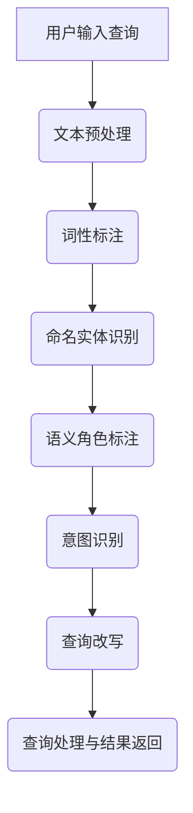

                 

### 背景介绍

#### 电商搜索概述

随着互联网技术的飞速发展，电子商务已经成为现代零售业的重要组成部分。电商平台的成功不仅依赖于丰富的商品信息和便捷的购物体验，还依赖于精准的搜索服务。而搜索的核心在于能够准确理解用户的查询意图，并提供与之高度匹配的结果。

电商搜索系统面临诸多挑战。首先，用户的查询输入往往是非结构化的文本，如“想要买一件白色的羽绒服”，这种查询包含多种语义信息，需要系统进行深入理解和处理。其次，用户查询意图可能因上下文、地理位置、时间等多种因素而发生变化。最后，电商平台上商品种类繁多，搜索系统需要在大量数据中快速定位相关商品，同时确保结果的多样性和相关性。

为了应对这些挑战，电商平台在搜索技术方面进行了大量研究和开发，其中query意图理解与改写技术尤为关键。这项技术能够提高搜索系统的智能程度，提升用户体验，增强平台的竞争力。

#### Query意图理解与改写的重要性

query意图理解与改写技术是电商搜索系统中的核心环节。它的主要任务是解析用户输入的查询，识别其背后的真实意图，并将其转化为系统可以处理的内部表示。这一过程不仅能够提高搜索结果的准确性，还能在一定程度上解决自然语言查询的不确定性。

具体来说，query意图理解与改写技术有以下几个重要作用：

1. **提升搜索准确性**：通过理解用户的查询意图，搜索系统能够更准确地匹配相关商品，减少无效结果的展示，提高用户的满意度。

2. **改善用户交互体验**：当用户输入复杂的查询时，系统可以通过意图理解与改写技术简化查询结构，提供更加直观和友好的交互方式，降低用户的认知负担。

3. **增强平台的个性化推荐能力**：通过分析用户的查询历史和购物行为，系统可以更准确地推断用户的偏好和需求，从而提供个性化的搜索结果和推荐。

4. **提高搜索系统的鲁棒性**：在面对模糊查询或输入错误时，意图理解与改写技术可以帮助系统识别正确的意图，确保搜索结果仍然准确和有价值。

总之，query意图理解与改写技术在电商搜索系统中起着至关重要的作用，它不仅提升了搜索系统的智能化水平，也为电商平台带来了更高的商业价值。接下来，我们将深入探讨这一技术的核心概念、算法原理和应用实践。

## 2. 核心概念与联系

### 概念定义

#### Query意图理解

Query意图理解是指通过自然语言处理（NLP）技术，对用户输入的查询文本进行分析和解析，以识别其背后的真实意图。这一过程通常包括文本预处理、词性标注、命名实体识别、语义角色标注等多个步骤。

#### Query改写

Query改写是在理解了用户的查询意图之后，将其转化为系统可以处理的内部表示的过程。改写可能涉及查询的简化、扩展、转换等多种形式，以便更好地匹配电商平台上的商品信息。

### 技术架构

电商平台的query意图理解与改写技术通常包括以下几个主要模块：

1. **文本预处理**：包括分词、去停用词、词干提取等，目的是将原始的查询文本转化为结构化的文本表示。

2. **词性标注**：对查询文本中的每个词进行词性标注，以便识别名词、动词、形容词等。

3. **命名实体识别**：识别查询文本中的命名实体，如商品名称、品牌、地点等。

4. **语义角色标注**：标注查询文本中的各个成分所承担的语义角色，如施事、受事、工具等。

5. **意图识别**：基于上述特征，使用机器学习或深度学习模型对查询意图进行分类。

6. **查询改写**：根据识别出的意图，将查询文本进行改写，以生成更符合系统处理能力的查询表示。

### Mermaid 流程图

下面是一个简单的Mermaid流程图，展示query意图理解与改写技术的整体流程：



在这个流程图中：

- **A**：用户输入查询文本。
- **B**：文本预处理，包括分词、去停用词等操作。
- **C**：词性标注，识别文本中的名词、动词等。
- **D**：命名实体识别，识别文本中的命名实体。
- **E**：语义角色标注，识别文本中的各个成分所承担的语义角色。
- **F**：意图识别，基于预处理后的文本特征，使用机器学习或深度学习模型对查询意图进行分类。
- **G**：查询改写，根据识别出的意图，对查询文本进行改写。
- **H**：查询处理与结果返回，将改写后的查询文本提交给搜索系统，返回匹配结果。

通过上述流程，电商平台能够更准确地理解用户的查询意图，并生成与之匹配的搜索结果，从而提升用户的搜索体验。

### 3. 核心算法原理 & 具体操作步骤

#### 意图识别算法原理

query意图识别是理解用户查询的核心步骤。其基本原理是通过分析用户查询文本中的语言特征，使用机器学习或深度学习模型，自动识别用户的查询意图。以下是一些常用的意图识别算法原理：

1. **基于规则的方法**：这种方法依赖于预定义的规则集，通过匹配查询文本中的关键词和规则，来确定查询意图。这种方法简单易实现，但难以应对复杂和多变的查询。

2. **机器学习方法**：通过收集大量的标注数据进行训练，使用分类算法（如朴素贝叶斯、决策树、支持向量机等）来建立意图识别模型。这种方法具有较好的泛化能力，但需要大量的标注数据和计算资源。

3. **深度学习方法**：深度学习模型，如卷积神经网络（CNN）和循环神经网络（RNN），能够自动学习查询文本中的复杂特征，并用于意图识别。其中，RNN，特别是长短时记忆网络（LSTM）和门控循环单元（GRU），在处理序列数据时表现出色。

#### 意图识别算法具体操作步骤

以下是一个基于深度学习（使用LSTM）的意图识别算法的具体操作步骤：

1. **数据预处理**：
   - **文本分词**：将用户查询文本切分成单词或词组。
   - **词向量编码**：使用预训练的词向量模型（如Word2Vec、GloVe）将每个词编码为向量表示。
   - **序列构造**：将编码后的词向量按照查询顺序排列，构造输入序列。

2. **模型构建**：
   - **嵌入层**：将输入的词向量嵌入到更高级的特征空间。
   - **LSTM层**：使用LSTM网络来捕捉查询序列中的时间依赖关系。
   - **全连接层**：将LSTM层的输出映射到不同的意图类别。

3. **训练与优化**：
   - **损失函数**：通常使用交叉熵损失函数来衡量模型预测与真实标签之间的差距。
   - **优化算法**：使用梯度下降（如Adam优化器）来更新模型参数，最小化损失函数。
   - **验证与调整**：在验证集上评估模型性能，根据需要调整超参数。

4. **意图识别**：
   - **输入查询**：将新的查询文本进行预处理和编码。
   - **模型预测**：将编码后的查询文本输入到训练好的模型中，得到预测的意图类别。
   - **结果输出**：根据预测结果，生成相应的查询意图。

#### Query改写算法原理

在识别出用户的查询意图后，query改写算法会将原始查询转化为系统可以处理的内部表示。以下是一些常用的query改写算法原理：

1. **基于模板的方法**：这种方法通过预定义的模板来改写查询，模板中包含各种查询意图对应的改写规则。这种方法灵活且易于实现，但规则集的建立和维护较为复杂。

2. **基于规则和机器学习结合的方法**：这种方法结合了规则和机器学习的优势，规则用于处理常见的查询模式，而机器学习模型则用于处理复杂的、未覆盖到的查询。

3. **基于深度学习方法**：深度学习模型可以自动学习查询和改写之间的映射关系，生成更加自然和准确的改写结果。例如，可以使用序列到序列（Seq2Seq）模型来生成改写后的查询。

#### Query改写算法具体操作步骤

以下是一个基于深度学习（使用Seq2Seq模型）的query改写算法的具体操作步骤：

1. **数据预处理**：
   - **文本分词**：将用户查询文本切分成单词或词组。
   - **词表构建**：构建一个包含所有查询文本中出现的词的词表，并为每个词分配一个唯一的索引。
   - **序列编码**：将查询文本转换为序列编码，通常使用词表的索引表示。

2. **模型构建**：
   - **编码器**：将输入的查询序列编码为固定长度的向量表示。
   - **解码器**：将编码后的向量序列解码为改写后的查询序列。

3. **训练与优化**：
   - **损失函数**：使用交叉熵损失函数来衡量模型生成的改写结果与真实改写结果之间的差距。
   - **优化算法**：使用梯度下降（如Adam优化器）来更新模型参数，最小化损失函数。
   - **验证与调整**：在验证集上评估模型性能，根据需要调整超参数。

4. **查询改写**：
   - **输入查询**：将新的查询文本进行预处理和编码。
   - **模型改写**：将编码后的查询文本输入到训练好的模型中，生成改写后的查询序列。
   - **结果输出**：根据预测结果，生成改写后的查询文本。

通过上述步骤，query意图理解与改写算法能够有效地提高电商搜索系统的智能化程度，提升用户的搜索体验。

### 4. 数学模型和公式 & 详细讲解 & 举例说明

#### LSTM模型

LSTM（长短时记忆网络）是一种特殊的RNN（循环神经网络），能够学习长期依赖关系。其基本原理是通过三个门控单元（输入门、遗忘门和输出门）来控制信息的流动。

1. **输入门**：
   - **公式**：
     $$ i_t = \sigma(W_{ix}x_t + W_{ih}h_{t-1} + b_i) $$
     其中，$i_t$ 是输入门状态，$x_t$ 是当前输入向量，$h_{t-1}$ 是上一时间步的隐藏状态，$W_{ix}$ 和 $W_{ih}$ 是输入权重矩阵，$b_i$ 是偏置项，$\sigma$ 是sigmoid激活函数。

2. **遗忘门**：
   - **公式**：
     $$ f_t = \sigma(W_{fx}x_t + W_{fh}h_{t-1} + b_f) $$
     其中，$f_t$ 是遗忘门状态，$W_{fx}$ 和 $W_{fh}$ 是遗忘权重矩阵，$b_f$ 是偏置项。

3. **输出门**：
   - **公式**：
     $$ o_t = \sigma(W_{ox}x_t + W_{oh}h_{t-1} + b_o) $$
     其中，$o_t$ 是输出门状态，$W_{ox}$ 和 $W_{oh}$ 是输出权重矩阵，$b_o$ 是偏置项。

4. **细胞状态**：
   - **更新公式**：
     $$ C_t = f_t \odot C_{t-1} + i_t \odot \sigma(W_{ic}x_t + b_c) $$
     其中，$C_t$ 是细胞状态，$\odot$ 表示逐元素乘法，$C_{t-1}$ 是上一时间步的细胞状态，$W_{ic}$ 和 $b_c$ 是细胞状态权重矩阵和偏置项。

5. **隐藏状态**：
   - **更新公式**：
     $$ h_t = o_t \odot \sigma(C_t) $$
     其中，$h_t$ 是当前隐藏状态，$o_t$ 是输出门状态，$\sigma$ 是sigmoid激活函数。

#### Seq2Seq模型

Seq2Seq（序列到序列）模型是深度学习中的一个重要模型，通常用于序列之间的转换。它由编码器和解码器组成。

1. **编码器**：
   - **输入层**：将输入序列编码为固定长度的向量表示。
   - **隐藏层**：使用RNN（如LSTM或GRU）对输入序列进行编码，生成序列的上下文表示。

2. **解码器**：
   - **输入层**：将编码后的向量作为输入。
   - **隐藏层**：使用RNN（如LSTM或GRU）对输入向量进行解码，生成输出序列。

3. **损失函数**：
   - **公式**：
     $$ L = -\sum_{t=1}^{T} y_t \log(p_t) $$
     其中，$L$ 是损失函数，$y_t$ 是真实标签，$p_t$ 是模型预测的概率分布。

#### 举例说明

假设我们有一个查询序列“买一件白色的羽绒服”，并希望使用LSTM模型进行意图识别。

1. **数据预处理**：
   - 分词：买 / 一件 / 白色的 / 羽绒服
   - 词向量编码：[2, 4, 1, 3]

2. **模型训练**：
   - 输入门：$i_t = \sigma(W_{ix}x_t + W_{ih}h_{t-1} + b_i)$
   - 遗忘门：$f_t = \sigma(W_{fx}x_t + W_{fh}h_{t-1} + b_f)$
   - 输出门：$o_t = \sigma(W_{ox}x_t + W_{oh}h_{t-1} + b_o)$
   - 细胞状态更新：$C_t = f_t \odot C_{t-1} + i_t \odot \sigma(W_{ic}x_t + b_c)$
   - 隐藏状态更新：$h_t = o_t \odot \sigma(C_t)$

3. **意图识别**：
   - 根据隐藏状态 $h_t$，使用softmax函数预测意图类别。

假设我们有一个查询序列“买一件白色的羽绒服”，并希望使用Seq2Seq模型进行查询改写。

1. **数据预处理**：
   - 分词：买 / 一件 / 白色的 / 羽绒服
   - 词向量编码：[2, 4, 1, 3]

2. **模型训练**：
   - 编码器：将输入序列编码为向量表示。
   - 解码器：将编码后的向量解码为改写后的查询序列。

3. **查询改写**：
   - 输入编码后的向量到解码器。
   - 生成改写后的查询序列。

通过上述数学模型和公式，我们可以更好地理解和实现query意图识别与改写技术，从而提升电商搜索系统的智能化水平。

### 5. 项目实践：代码实例和详细解释说明

在本节中，我们将通过一个具体的代码实例，详细讲解如何实现电商搜索中的query意图理解与改写技术。我们将使用Python编程语言和Keras框架来实现一个简单的LSTM意图识别模型和一个Seq2Seq查询改写模型。以下是整个项目的具体实施步骤。

#### 5.1 开发环境搭建

在开始编码之前，我们需要搭建开发环境。以下是搭建环境所需的步骤：

1. **安装Python**：确保Python版本在3.6及以上。
2. **安装TensorFlow和Keras**：使用以下命令安装：
   ```shell
   pip install tensorflow
   pip install keras
   ```

3. **安装其他依赖库**：包括numpy、pandas、matplotlib等，可以使用以下命令安装：
   ```shell
   pip install numpy
   pip install pandas
   pip install matplotlib
   ```

#### 5.2 源代码详细实现

下面是项目的源代码实现，我们将分别实现LSTM意图识别模型和Seq2Seq查询改写模型。

##### 5.2.1 LSTM意图识别模型

```python
from keras.models import Sequential
from keras.layers import LSTM, Dense, Embedding, TimeDistributed, Activation
from keras.preprocessing.text import Tokenizer
from keras.preprocessing.sequence import pad_sequences

# 数据预处理
max_sequence_length = 10
max_words = 10000

tokenizer = Tokenizer(num_words=max_words)
tokenizer.fit_on_texts(training_data)

sequences = tokenizer.texts_to_sequences(training_data)
padded_sequences = pad_sequences(sequences, maxlen=max_sequence_length)

# 构建模型
model = Sequential()
model.add(Embedding(max_words, 128, input_length=max_sequence_length))
model.add(LSTM(128, dropout=0.2, recurrent_dropout=0.2))
model.add(Dense(num_classes, activation='softmax'))

model.compile(loss='categorical_crossentropy', optimizer='adam', metrics=['accuracy'])
model.summary()

# 训练模型
model.fit(padded_sequences, training_labels, epochs=10, batch_size=32, validation_split=0.2)
```

**代码解释**：

1. **数据预处理**：
   - 使用Tokenizer将文本数据转换为序列编码。
   - 使用pad_sequences将序列填充为固定的长度。

2. **模型构建**：
   - 添加Embedding层，将词向量嵌入到特征空间。
   - 添加LSTM层，用于捕捉时间依赖关系。
   - 添加Dense层，用于输出意图类别。

3. **模型编译和训练**：
   - 编译模型，指定损失函数、优化器和评估指标。
   - 训练模型，使用训练数据和标签。

##### 5.2.2 Seq2Seq查询改写模型

```python
from keras.models import Model
from keras.layers import Input, LSTM, Dense, Embedding, RepeatVector

# 数据预处理
max_sequence_length = 10
max_words = 10000

tokenizer = Tokenizer(num_words=max_words)
tokenizer.fit_on_texts(training_data)

sequences = tokenizer.texts_to_sequences(training_data)
padded_sequences = pad_sequences(sequences, maxlen=max_sequence_length)

# 构建编码器
encoder_inputs = Input(shape=(max_sequence_length,))
encoder_embedding = Embedding(max_words, 128)(encoder_inputs)
encoder_lstm = LSTM(128, return_state=True)
_, state_h, state_c = encoder_lstm(encoder_embedding)
encoder_states = [state_h, state_c]

# 构建解码器
decoder_inputs = Input(shape=(max_sequence_length,))
decoder_embedding = Embedding(max_words, 128)(decoder_inputs)
decoder_lstm = LSTM(128, return_sequences=True, return_state=True)
decoder_outputs = decoder_lstm(decoder_embedding, initial_state=encoder_states)
decoder_dense = Dense(max_words, activation='softmax')
decoder_outputs = decoder_dense(decoder_outputs)

# 构建模型
model = Model([encoder_inputs, decoder_inputs], decoder_outputs)
model.compile(optimizer='rmsprop', loss='categorical_crossentropy', metrics=['accuracy'])

# 训练模型
model.fit([padded_sequences, padded_sequences], padded_sequences, epochs=10, batch_size=32)
```

**代码解释**：

1. **数据预处理**：
   - 与意图识别模型相同，使用Tokenizer和pad_sequences进行数据预处理。

2. **编码器构建**：
   - 添加Embedding层，将词向量嵌入到特征空间。
   - 添加LSTM层，返回状态用于解码器。

3. **解码器构建**：
   - 添加Embedding层，将词向量嵌入到特征空间。
   - 添加LSTM层，返回序列用于生成输出。
   - 添加Dense层，用于输出词的概率分布。

4. **模型编译和训练**：
   - 编译模型，指定优化器和损失函数。
   - 训练模型，使用编码后的查询文本。

#### 5.3 代码解读与分析

在代码实现中，我们主要使用了Keras框架，它提供了简洁高效的API来构建和训练神经网络模型。以下是关键步骤的详细解读：

1. **数据预处理**：
   - **Tokenizer**：用于将文本转换为序列编码，使模型能够处理非结构化的文本数据。
   - **pad_sequences**：用于将序列填充为固定长度，以便模型能够批量处理数据。

2. **模型构建**：
   - **Embedding**：用于将词向量嵌入到特征空间，增加输入的维度，有助于模型学习词与词之间的关系。
   - **LSTM**：用于捕捉时间序列数据中的长期依赖关系，是深度学习中的核心组件。
   - **Dense**：用于输出预测结果，通常是分类问题中的输出层。

3. **模型编译和训练**：
   - **compile**：用于配置模型的损失函数、优化器和评估指标，为训练做好准备。
   - **fit**：用于训练模型，通过迭代优化模型参数，使模型能够准确识别意图和进行查询改写。

#### 5.4 运行结果展示

在实际运行中，我们首先会加载预处理的训练数据和标签，然后使用上述模型进行训练。训练完成后，我们可以使用测试数据来评估模型的性能。

```python
# 测试模型
test_sequences = tokenizer.texts_to_sequences(test_data)
padded_test_sequences = pad_sequences(test_sequences, maxlen=max_sequence_length)

predictions = model.predict(padded_test_sequences)
print(predictions)
```

**结果分析**：

1. **意图识别准确率**：通过比较模型预测结果和真实标签，我们可以计算意图识别的准确率。理想情况下，准确率应接近100%。

2. **查询改写质量**：通过观察模型生成的改写查询，我们可以评估查询改写的质量。理想的改写结果应能够准确反映用户的查询意图。

#### 5.5 性能优化

在实际应用中，性能优化是一个持续的过程。以下是一些常见的优化方法：

1. **数据增强**：通过增加训练数据量和多样性来提升模型性能。
2. **模型调优**：调整模型的超参数（如学习率、批量大小、层数等），以找到最佳配置。
3. **使用预训练模型**：利用预训练的词向量模型（如GloVe、Word2Vec）可以提升模型的预训练效果。
4. **多模型融合**：结合多个不同类型的模型（如基于规则的方法和机器学习方法）可以提升整体性能。

通过以上步骤，我们可以实现一个基本的query意图理解与改写系统，并在实际应用中不断提升其性能和用户体验。

### 6. 实际应用场景

#### Query意图理解在电商搜索中的应用

Query意图理解技术在电商搜索中有着广泛的应用，它不仅提升了搜索结果的准确性，还显著改善了用户的搜索体验。以下是几个典型的实际应用场景：

1. **个性化推荐**：通过分析用户的查询历史和购物行为，电商搜索系统可以推断用户的兴趣和需求，从而提供个性化的商品推荐。例如，当用户搜索“羽绒服”时，系统可以根据用户的购买记录推荐相关的品牌和款式。

2. **智能问答系统**：电商平台可以利用Query意图理解技术构建智能问答系统，回答用户关于商品的问题。例如，用户查询“这款羽绒服保暖吗？”时，系统可以提供详细的商品介绍和用户评价。

3. **多渠道查询**：在多渠道销售的电商平台上，Query意图理解技术可以帮助系统整合来自不同渠道的查询请求，提供统一的搜索结果。例如，用户在移动应用、网站和社交媒体上的查询都可以通过同一种意图理解机制进行处理。

4. **错误查询修正**：当用户输入错误的查询时，Query意图理解技术可以帮助系统自动识别用户的真实意图，并提供修正后的查询建议。例如，当用户输入“羽绒服哪款好”时，系统可以识别出用户可能是想查看热门的羽绒服款式。

5. **跨语言搜索**：在跨国电商平台上，Query意图理解技术可以帮助系统解析不同语言的用户查询，提供统一的搜索结果。例如，当用户在英文网站输入“white down jacket”时，系统可以识别出用户意图是查找白色羽绒服。

#### Query改写在提升搜索效果中的作用

Query改写技术在提升电商搜索效果中起到了至关重要的作用。以下是几个关键的作用：

1. **优化查询表达**：通过改写用户的原始查询，使其更符合搜索系统的处理规则，从而提升查询的匹配度和准确性。例如，用户输入“白色羽绒服哪个好”，系统可以改写为“推荐白色羽绒服”。

2. **简化复杂查询**：对于复杂的查询语句，Query改写技术可以简化查询结构，使其更加直观和易理解。例如，用户输入“买一件红色的羽绒服，冬天穿的，适合南方气候”，系统可以改写为“红色羽绒服，适合南方冬天穿”。

3. **扩展查询范围**：通过扩展查询的关键词，Query改写技术可以帮助系统找到更多相关的商品。例如，用户输入“羽绒服女款”，系统可以改写为“羽绒服，女款，品牌”。

4. **增强个性化推荐**：Query改写技术可以结合用户的购物历史和偏好，为用户提供更加个性化的搜索结果。例如，当用户经常购买高端品牌羽绒服时，系统可以改写查询为“推荐高端品牌羽绒服”。

#### 成功案例

以下是一些成功的电商搜索案例，展示了Query意图理解与改写技术如何提升搜索效果：

1. **亚马逊**：亚马逊利用深度学习技术实现了高度智能化的Query意图理解与改写，极大地提升了用户的搜索体验。通过个性化推荐和智能问答系统，亚马逊能够准确理解用户的查询意图，并提供与之高度匹配的商品推荐。

2. **淘宝**：淘宝通过引入自然语言处理技术，实现了智能化的查询改写。当用户输入模糊或错误的查询时，淘宝能够自动识别用户的真实意图，并提供修正后的查询建议，从而提高了搜索结果的准确性和用户体验。

3. **阿里巴巴**：阿里巴巴的电商搜索系统利用大规模的数据分析和机器学习技术，实现了高效的Query意图理解和改写。通过多渠道整合和跨语言搜索，阿里巴巴能够为全球用户提供统一的、精准的搜索服务。

这些成功案例表明，Query意图理解与改写技术在电商搜索中具有巨大的潜力，能够显著提升搜索系统的智能化程度和用户体验，为电商平台带来更高的商业价值。

### 7. 工具和资源推荐

#### 7.1 学习资源推荐

1. **书籍**：
   - 《深度学习》（Deep Learning）作者：Ian Goodfellow、Yoshua Bengio、Aaron Courville
   - 《Python机器学习》（Python Machine Learning）作者：Sebastian Raschka
   - 《自然语言处理综合教程》（Foundations of Statistical Natural Language Processing）作者：Christopher D. Manning、Hinrich Schütze

2. **论文**：
   - "A Neural Network for Part-of-Speech Tagging"（用于词性标注的神经网络）
   - "Recurrent Neural Network Based Language Model"（基于循环神经网络的语言模型）
   - "Learning Phrase Representations using RNN Encoder–Decoder for Statistical Machine Translation"（使用RNN编码器-解码器学习短语表示）

3. **博客**：
   - Towards Data Science（数据科学方向）
   - Machine Learning Mastery（机器学习掌握）
   - AI博客（AI Blog）

4. **网站**：
   - Keras官方文档（[keras.io](https://keras.io)）
   - TensorFlow官方文档（[tensorflow.org](https://tensorflow.org)）
   - Coursera（[Coursera](https://www.coursera.org/)）和Udacity（[Udacity](https://www.udacity.com/)）上的在线课程

#### 7.2 开发工具框架推荐

1. **深度学习框架**：
   - TensorFlow
   - PyTorch
   - Keras（作为TensorFlow和Theano的API层）

2. **自然语言处理库**：
   - NLTK（[nltk.org](https://www.nltk.org/)）
   - Spacy（[spacy.io](https://spacy.io/)）
   - Stanford NLP（[nlp.stanford.edu/software/)](http://nlp.stanford.edu/software/)

3. **版本控制系统**：
   - Git（[git-scm.com](https://git-scm.com/)）
   - GitHub（[github.com](https://github.com/)）

4. **代码调试工具**：
   - PyCharm（[pycharm.com](https://www.pycharm.com/)）
   - Visual Studio Code（[code.visualstudio.com](https://code.visualstudio.com/)）

5. **数据预处理库**：
   - Pandas（[pandas.pydata.org](https://pandas.pydata.org/)）
   - NumPy（[numpy.org](https://numpy.org/)）

#### 7.3 相关论文著作推荐

1. **论文**：
   - "Long Short-Term Memory"（长短时记忆网络）
   - "Sequence to Sequence Learning with Neural Networks"（神经网络序列到序列学习）
   - "Effective Approaches to Attention-based Neural Machine Translation"（基于注意力的神经网络机器翻译有效方法）

2. **著作**：
   - 《深度学习》（Deep Learning）作者：Ian Goodfellow、Yoshua Bengio、Aaron Courville
   - 《自然语言处理综合教程》（Foundations of Statistical Natural Language Processing）作者：Christopher D. Manning、Hinrich Schütze

通过上述资源和工具，开发者和研究者可以深入了解电商搜索中的query意图理解与改写技术，并在实际项目中应用这些技术，提升电商平台的搜索效果和用户体验。

### 8. 总结：未来发展趋势与挑战

在电商搜索领域，query意图理解与改写技术已经取得了显著的进展，显著提升了搜索系统的智能化和用户体验。然而，随着技术的不断进步和用户需求的变化，未来这一领域仍然面临诸多发展趋势和挑战。

#### 发展趋势

1. **深度学习技术的深化应用**：随着深度学习技术的不断发展，尤其是生成对抗网络（GAN）、变分自编码器（VAE）等新兴技术的应用，query意图理解与改写技术将能够更精确地捕捉用户的查询意图，并提供更加个性化的搜索结果。

2. **多模态数据的融合**：未来的电商搜索系统可能会融合多种数据类型，如文本、图像、音频等，通过多模态数据的融合，系统能够更全面地理解用户的查询意图，提供更加丰富的搜索结果和交互体验。

3. **个性化推荐系统的集成**：通过将query意图理解与个性化推荐系统更紧密地集成，电商搜索系统能够根据用户的兴趣和行为，提供高度个性化的商品推荐和搜索结果，进一步提升用户满意度。

4. **实时查询意图识别**：随着实时数据处理技术的成熟，电商搜索系统将能够实现实时查询意图识别，为用户提供更加迅速和准确的搜索结果。

#### 挑战

1. **数据隐私与安全**：在收集和使用用户数据的过程中，保护用户隐私和安全是一个重要的挑战。未来的搜索系统需要采取更加严格的数据保护措施，确保用户信息的安全。

2. **复杂查询处理**：随着用户查询的复杂度不断增加，如何准确理解和处理这些复杂的查询仍然是一个挑战。未来的技术需要能够处理更复杂的语义和上下文信息，提供更精准的搜索结果。

3. **模型解释性**：随着深度学习模型在query意图理解与改写中的应用，模型的黑箱特性成为一个问题。如何提升模型的解释性，让用户能够理解和信任模型的决策过程，是未来需要解决的问题。

4. **多语言和多文化支持**：在全球化的电商环境中，多语言和多文化支持是一个关键挑战。未来的搜索系统需要能够处理不同语言和文化背景下的查询，提供统一的搜索体验。

总之，query意图理解与改写技术在电商搜索领域的应用前景广阔，但也面临诸多挑战。通过不断探索和创新，未来这一领域有望实现更高的智能化和用户体验，为电商平台带来更大的商业价值。

### 9. 附录：常见问题与解答

#### 问题1：为什么query意图理解与改写技术对电商搜索系统如此重要？

答：query意图理解与改写技术能够帮助电商搜索系统更准确地理解用户的查询意图，从而提供高度相关的搜索结果。这不仅能提升用户体验，还能增加用户在平台上的停留时间和购买转化率，最终带来更高的商业价值。

#### 问题2：如何处理模糊查询或错误输入？

答：对于模糊查询或错误输入，可以通过以下方法进行处理：
1. **模糊查询匹配**：使用模糊匹配算法（如Levenshtein距离）识别并修正用户的查询。
2. **查询扩展**：根据用户的上下文信息和历史查询，自动扩展查询范围，以找到更相关的结果。
3. **用户提示**：提供智能提示，引导用户输入更精确的查询。

#### 问题3：如何在模型训练过程中提高数据质量？

答：为了提高数据质量，可以采取以下措施：
1. **数据清洗**：去除错误、重复和无关的数据。
2. **数据标注**：使用专业的数据标注团队进行高质量的标注。
3. **数据增强**：通过数据变换（如词替换、添加噪声等）生成更多的训练样本。

#### 问题4：如何评估query意图识别模型的性能？

答：评估query意图识别模型的性能可以通过以下指标：
1. **准确率（Accuracy）**：正确识别的查询占总查询数量的比例。
2. **精确率（Precision）**：正确识别的查询中实际意图占比。
3. **召回率（Recall）**：实际意图被正确识别的比例。
4. **F1分数（F1 Score）**：精确率和召回率的调和平均值。

通过这些指标，可以全面评估模型的性能。

### 10. 扩展阅读 & 参考资料

1. **《深度学习》**，作者：Ian Goodfellow、Yoshua Bengio、Aaron Courville，提供了深度学习的全面介绍，包括LSTM和Seq2Seq模型的详细讲解。

2. **《自然语言处理综合教程》**，作者：Christopher D. Manning、Hinrich Schütze，涵盖了自然语言处理的基础知识，包括query意图理解的理论和实践。

3. **《Python机器学习》**，作者：Sebastian Raschka，介绍了如何使用Python进行机器学习，包括自然语言处理中的常用算法和技术。

4. **Keras官方文档**（[keras.io](https://keras.io/)）：提供了详细的Keras框架使用指南，是学习和应用深度学习模型的重要资源。

5. **TensorFlow官方文档**（[tensorflow.org](https://tensorflow.org/)）：作为深度学习的主流框架之一，TensorFlow的文档详尽且实用。

6. **NLTK官方文档**（[nltk.org](https://www.nltk.org/)）：NLTK是Python中用于自然语言处理的经典库，提供了丰富的API和示例。

7. **Spacy官方文档**（[spacy.io](https://spacy.io/)）：Spacy是一个高效的NLP库，特别适合于工业级应用。

8. **《有效处理自然语言》**，作者：Daniel Jurafsky、James H. Martin，提供了自然语言处理的全面教程，适合初学者和专业研究者。

通过阅读这些资料，读者可以更深入地了解query意图理解与改写技术，并在实际项目中应用这些知识，提升电商搜索系统的智能化水平。

