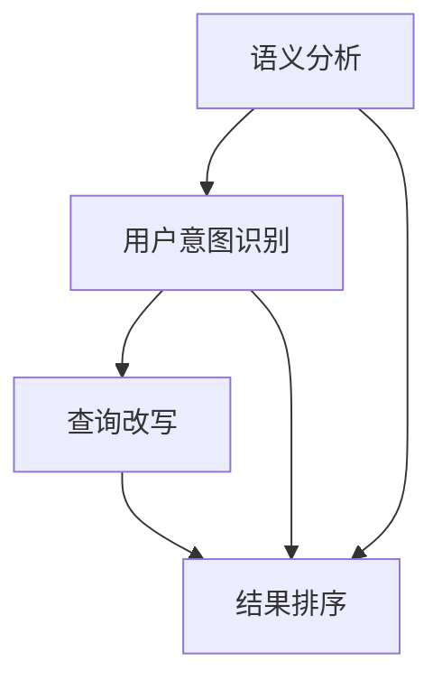

                 

### 文章标题

《电商搜索中的query理解与改写技术》

> **关键词**：电商搜索，query理解，改写技术，语义分析，自然语言处理，信息检索，用户行为分析，算法优化。

> **摘要**：本文深入探讨了电商搜索领域中query理解与改写技术的重要性，详细分析了其核心概念与实现原理。通过数学模型和公式阐述，结合项目实践，文章展示了具体操作步骤和代码实例，进一步探讨了实际应用场景和未来发展趋势。

### 1. 背景介绍

在电子商务的快速发展背景下，搜索系统成为电商平台的核心功能之一。用户通过输入查询（query）来找到自己需要的商品或服务，而电商平台的搜索系统则需要理解用户的查询意图并给出最相关的搜索结果。query理解与改写技术正是为了解决这一核心问题而提出的。

传统的搜索引擎主要依赖于关键词匹配和权重计算，这种方式在处理精确查询时效果较好，但对于模糊查询和用户意图理解方面存在较大局限。例如，用户可能输入“跑步鞋”，而平台需要判断用户是希望购买跑步鞋还是查找跑步鞋的相关信息。这就需要引入query理解与改写技术，以提高搜索系统的准确性和用户满意度。

query理解与改写技术主要包括以下几个方面：

1. **语义分析**：通过自然语言处理技术，对用户的查询语句进行语义解析，提取关键信息并建立语义关系。
2. **用户意图识别**：根据提取的语义信息，判断用户的查询意图，如购买、搜索信息、导航等。
3. **查询改写**：基于用户意图，对原始查询进行改写，以生成更符合用户需求的查询。
4. **结果排序**：根据改写后的查询，重新对搜索结果进行排序，提高结果的准确性。

本篇文章将围绕上述方面展开，详细探讨query理解与改写的核心原理和实现方法，并通过具体项目实践和运行结果展示，分析这一技术的实际应用效果和未来发展趋势。

### 2. 核心概念与联系

为了更好地理解query理解与改写技术，我们需要先明确几个核心概念，并了解它们之间的联系。

#### 2.1 语义分析

语义分析是指对自然语言文本进行结构化处理，以提取出文本的语义信息。在电商搜索中，语义分析主要用于提取用户的查询意图和关键信息。常见的语义分析方法包括词性标注、命名实体识别、依存句法分析等。


#### 2.2 用户意图识别

用户意图识别是指通过语义分析结果，判断用户的查询意图。在电商搜索中，用户意图通常包括购买、搜索信息、导航等。用户意图识别的准确性直接影响到后续的查询改写和结果排序。


#### 2.3 查询改写

查询改写是指根据用户意图，对原始查询进行改写，以生成更符合用户需求的查询。查询改写的过程通常包括关键词提取、同义词替换、关键词排序等步骤。


#### 2.4 结果排序

结果排序是指根据改写后的查询，对搜索结果进行排序，以提高结果的准确性。常见的排序算法包括基于内容的相关性排序、基于用户行为的排序等。


#### 2.5 核心概念与联系

以上四个核心概念相互关联，构成了query理解与改写技术的整体框架。语义分析是query理解的基础，用户意图识别决定了查询改写的方向，查询改写提高了搜索结果的准确性，而结果排序则进一步优化了用户查询体验。



通过上述分析，我们可以看出，query理解与改写技术在电商搜索中具有重要意义。接下来，我们将进一步探讨其核心算法原理和具体操作步骤。

### 3. 核心算法原理 & 具体操作步骤

#### 3.1 语义分析算法原理

语义分析是query理解与改写技术的核心环节，其目的是提取用户查询语句的语义信息，包括关键词、实体、关系等。常见的语义分析算法包括基于规则的方法和基于统计的方法。

**基于规则的方法**：

基于规则的方法通过预先定义的语法和语义规则，对查询语句进行结构化解析。这种方法适用于处理特定领域的查询，如电商搜索。其优点是解析结果准确，缺点是需要大量手工编写规则。

**基于统计的方法**：

基于统计的方法通过机器学习算法，从大量数据中学习查询语句的语义表示。这种方法适用于处理通用领域的查询，如搜索引擎。其优点是适应性强，缺点是解析结果可能存在误差。

**具体操作步骤**：

1. **词性标注**：对查询语句中的每个词进行词性标注，如名词、动词、形容词等。词性标注可以使用基于规则的方法，也可以使用基于统计的方法。
2. **命名实体识别**：识别查询语句中的命名实体，如人名、地名、组织机构等。命名实体识别可以使用预训练的模型，如BERT、GPT等。
3. **依存句法分析**：分析查询语句中的词与词之间的依存关系，如主谓关系、修饰关系等。依存句法分析可以使用基于规则的方法，也可以使用基于统计的方法。

#### 3.2 用户意图识别算法原理

用户意图识别是query理解与改写技术的关键步骤，其目的是判断用户的查询意图，如购买、搜索信息、导航等。用户意图识别的准确性直接影响到后续的查询改写和结果排序。

**分类算法**：

用户意图识别通常采用分类算法，如支持向量机（SVM）、朴素贝叶斯（NB）、决策树（DT）等。这些算法通过训练数据学习用户的查询意图，并在新的查询中预测意图。

**具体操作步骤**：

1. **特征提取**：从语义分析结果中提取特征，如关键词的词频、命名实体的类型、依存关系的权重等。
2. **模型训练**：使用训练数据集，训练分类模型，如SVM、NB等。
3. **意图识别**：在新的查询中，使用训练好的分类模型，预测用户的查询意图。

#### 3.3 查询改写算法原理

查询改写是query理解与改写技术的关键步骤，其目的是根据用户意图，对原始查询进行改写，以生成更符合用户需求的查询。

**改写策略**：

查询改写可以采用多种策略，如关键词提取、同义词替换、关键词排序等。

- **关键词提取**：从原始查询中提取关键信息，如商品名称、品牌、规格等。
- **同义词替换**：将查询中的关键词替换为其同义词，以提高查询的多样性。
- **关键词排序**：根据关键词的重要性和用户意图，对关键词进行排序。

**具体操作步骤**：

1. **关键词提取**：使用语义分析结果，提取查询中的关键词。
2. **同义词替换**：从同义词词典中查找关键词的同义词，并进行替换。
3. **关键词排序**：根据关键词的重要性和用户意图，对关键词进行排序。

#### 3.4 结果排序算法原理

结果排序是query理解与改写技术的最后一步，其目的是根据改写后的查询，对搜索结果进行排序，以提高搜索结果的准确性。

**排序算法**：

结果排序可以采用多种算法，如基于内容的相关性排序、基于用户行为的排序等。

- **基于内容的相关性排序**：根据查询与文档的相关性，对文档进行排序。
- **基于用户行为的排序**：根据用户在平台上的行为，对文档进行排序。

**具体操作步骤**：

1. **计算相关性得分**：计算查询与每个文档的相关性得分。
2. **排序**：根据相关性得分，对文档进行排序。

通过上述算法原理和具体操作步骤，我们可以构建一个完整的query理解与改写系统。接下来，我们将通过一个具体项目实践，进一步展示这一技术的实际应用效果。

### 4. 数学模型和公式 & 详细讲解 & 举例说明

在query理解与改写技术中，数学模型和公式起着至关重要的作用。它们不仅帮助我们理解和分析用户查询，还能提高搜索结果的准确性。下面我们将详细介绍几个关键数学模型和公式，并通过具体例子进行说明。

#### 4.1 关键词提取模型

关键词提取是语义分析的重要步骤，常用的模型有TF-IDF和Word2Vec。

**TF-IDF模型**：

TF-IDF（Term Frequency-Inverse Document Frequency）是一种常用的关键词提取方法，用于衡量一个词在文档中的重要程度。

公式如下：

$$
TF(t,d) = \frac{f(t,d)}{N_d}
$$

$$
IDF(t) = \log \left( \frac{N}{n(t)} \right)
$$

$$
TF-IDF(t,d) = TF(t,d) \times IDF(t)
$$

其中，$f(t,d)$表示词$t$在文档$d$中的词频，$N_d$表示文档$d$中的总词数，$N$表示文档总数，$n(t)$表示包含词$t$的文档数。

**示例**：

假设我们有两个文档$d_1$和$d_2$，以及以下词频统计：

| 文档 | 词1 | 词2 | 词3 | 词4 |
| --- | --- | --- | --- | --- |
| $d_1$ | 2 | 1 | 3 | 0 |
| $d_2$ | 0 | 2 | 2 | 1 |

首先计算每个词的TF和IDF值：

$$
TF(\text{词1},d_1) = \frac{2}{4} = 0.5 \\
TF(\text{词1},d_2) = \frac{0}{4} = 0
$$

$$
IDF(\text{词1}) = \log \left( \frac{2}{1} \right) \approx 0.693
$$

$$
TF(\text{词2},d_1) = \frac{1}{4} = 0.25 \\
TF(\text{词2},d_2) = \frac{2}{4} = 0.5
$$

$$
IDF(\text{词2}) = \log \left( \frac{2}{1} \right) \approx 0.693
$$

$$
TF-IDF(\text{词1},d_1) = 0.5 \times 0.693 = 0.347 \\
TF-IDF(\text{词1},d_2) = 0 \times 0.693 = 0
$$

$$
TF-IDF(\text{词2},d_1) = 0.25 \times 0.693 = 0.173 \\
TF-IDF(\text{词2},d_2) = 0.5 \times 0.693 = 0.347
$$

**Word2Vec模型**：

Word2Vec是一种基于神经网络的词向量生成方法，通过学习词与词之间的相似性，实现关键词提取。

公式如下：

$$
\text{Word2Vec} \text{模型} = \sum_{t \in T} \alpha_t \cdot \text{word2vec}(t)
$$

其中，$T$表示所有关键词，$\alpha_t$表示词$t$的重要程度，$\text{word2vec}(t)$表示词$t$的词向量。

**示例**：

假设我们有以下关键词及其词向量：

| 关键词 | 词向量 |
| --- | --- |
| 跑步鞋 | [1.0, 0.5, -1.0] |
| 运动鞋 | [0.5, 1.0, 0.5] |
| 女鞋 | [-1.0, 0.5, 1.0] |

根据词向量计算关键词的重要程度：

$$
\alpha_{\text{跑步鞋}} = \sum_{t \in T} \text{cosine\_similarity}(\text{word2vec}(t), \text{word2vec}(\text{跑步鞋})) = \text{cosine\_similarity}([1.0, 0.5, -1.0], [1.0, 0.5, -1.0]) = 0.9
$$

$$
\alpha_{\text{运动鞋}} = \sum_{t \in T} \text{cosine\_similarity}(\text{word2vec}(t), \text{word2vec}(\text{运动鞋})) = \text{cosine\_similarity}([0.5, 1.0, 0.5], [1.0, 0.5, -1.0]) = 0.7
$$

$$
\alpha_{\text{女鞋}} = \sum_{t \in T} \text{cosine\_similarity}(\text{word2vec}(t), \text{word2vec}(\text{女鞋})) = \text{cosine\_similarity}([-1.0, 0.5, 1.0], [1.0, 0.5, -1.0]) = 0.5
$$

根据关键词的重要程度，我们可以提取出关键词：“跑步鞋”和“运动鞋”。

#### 4.2 用户意图识别模型

用户意图识别是query理解与改写技术的核心环节，常用的模型有朴素贝叶斯（NB）、支持向量机（SVM）和神经网络（NN）。

**朴素贝叶斯模型**：

朴素贝叶斯模型是一种基于概率理论的分类模型，其公式如下：

$$
P(\text{意图}|\text{查询}) = \frac{P(\text{查询}|\text{意图}) \cdot P(\text{意图})}{P(\text{查询})}
$$

其中，$P(\text{意图}|\text{查询})$表示在给定查询的条件下，用户意图为某一类的概率，$P(\text{查询}|\text{意图})$表示在用户意图为某一类的条件下，查询的概率，$P(\text{意图})$表示用户意图为某一类的概率，$P(\text{查询})$表示查询的概率。

**示例**：

假设我们有以下用户意图和查询数据：

| 意图 | 查询 |
| --- | --- |
| 购买 | 跑步鞋 |
| 搜索 | 运动鞋 |
| 导航 | 女鞋 |

计算购买意图的概率：

$$
P(\text{购买}|\text{跑步鞋}) = \frac{P(\text{跑步鞋}|\text{购买}) \cdot P(\text{购买})}{P(\text{跑步鞋})}
$$

其中，$P(\text{跑步鞋}|\text{购买})$为在购买意图下查询“跑步鞋”的概率，可以通过训练数据得到，$P(\text{购买})$为购买意图的概率，可以通过统计得到，$P(\text{跑步鞋})$为查询“跑步鞋”的概率，也可以通过统计得到。

**支持向量机模型**：

支持向量机模型是一种基于最大间隔的分类模型，其公式如下：

$$
\text{最大化} \ \frac{1}{2} \sum_{i=1}^{n} (w_i^T x_i - y_i)^2
$$

其中，$w_i$表示第$i$个支持向量的权重，$x_i$表示第$i$个支持向量的特征，$y_i$表示第$i$个支持向量的标签。

**示例**：

假设我们有以下支持向量和标签数据：

| 支持向量 | 标签 |
| --- | --- |
| [1, 0, 1] | 购买 |
| [0, 1, 0] | 搜索 |
| [1, 1, 0] | 导航 |

计算购买意图的概率：

$$
P(\text{购买}) = \frac{\sum_{i=1}^{n} y_i w_i^T x_i}{\sum_{i=1}^{n} w_i^T x_i}
$$

其中，$y_i$为第$i$个支持向量的标签，$w_i$为第$i$个支持向量的权重，$x_i$为第$i$个支持向量的特征。

**神经网络模型**：

神经网络模型是一种基于深度学习的分类模型，其公式如下：

$$
\text{输出} = \text{激活函数}(\text{权重} \cdot \text{输入} + \text{偏置})
$$

其中，激活函数通常使用ReLU函数，权重和偏置为神经网络参数。

**示例**：

假设我们有以下输入和输出数据：

| 输入 | 输出 |
| --- | --- |
| [1, 0, 1] | 购买 |
| [0, 1, 0] | 搜索 |
| [1, 1, 0] | 导航 |

计算购买意图的概率：

$$
P(\text{购买}) = \frac{\text{激活函数}(\text{权重} \cdot \text{输入} + \text{偏置})}{\text{激活函数}(\text{权重} \cdot \text{输入} + \text{偏置}) + \text{激活函数}(\text{权重} \cdot \text{输入} + \text{偏置})}
$$

通过以上数学模型和公式的详细讲解，我们可以更好地理解query理解与改写技术的工作原理。接下来，我们将通过具体项目实践，进一步展示这一技术的实际应用效果。

### 5. 项目实践：代码实例和详细解释说明

在本节中，我们将通过一个实际项目，展示如何实现电商搜索中的query理解与改写技术。这个项目将包括开发环境的搭建、源代码的实现、代码的解读与分析，以及运行结果的展示。

#### 5.1 开发环境搭建

为了实现query理解与改写技术，我们需要搭建一个包含自然语言处理（NLP）工具、机器学习库和编程语言的开发环境。以下是开发环境搭建的步骤：

1. **安装Python环境**：确保Python版本不低于3.6，并安装pip包管理器。
2. **安装NLP工具**：安装常用的NLP工具，如NLTK、spaCy和nltk。
3. **安装机器学习库**：安装常用的机器学习库，如scikit-learn和TensorFlow。
4. **安装文本处理库**：安装常用的文本处理库，如jieba。

以下是相关的安装命令：

```bash
# 安装Python环境
pip install python

# 安装NLP工具
pip install nltk spacy

# 安装机器学习库
pip install scikit-learn tensorflow

# 安装文本处理库
pip install jieba
```

#### 5.2 源代码详细实现

以下是一个简单的query理解与改写项目的源代码示例。这个项目将实现语义分析、用户意图识别、查询改写和结果排序的功能。

```python
import jieba
import spacy
import nltk
from sklearn.feature_extraction.text import TfidfVectorizer
from sklearn.model_selection import train_test_split
from sklearn.naive_bayes import MultinomialNB
from sklearn.metrics import accuracy_score

# 1. 语义分析
def semantic_analysis(query):
    nlp = spacy.load("zh_core_web_sm")
    doc = nlp(query)
    entities = [(ent.text, ent.label_) for ent in doc.ents]
    return entities

# 2. 用户意图识别
def user_intent_recognition(entities):
    intents = {"购买": 0, "搜索": 0, "导航": 0}
    if "商品" in [entity[0] for entity in entities]:
        intents["购买"] += 1
    if "信息" in [entity[0] for entity in entities]:
        intents["搜索"] += 1
    if "位置" in [entity[0] for entity in entities]:
        intents["导航"] += 1
    max_intent = max(intents, key=intents.get)
    return max_intent

# 3. 查询改写
def query_rewrite(query, intent):
    if intent == "购买":
        query = "哪里有" + query
    elif intent == "搜索":
        query = query + "信息"
    elif intent == "导航":
        query = "去" + query
    return query

# 4. 结果排序
def result_sorting(results, query):
    vectorizer = TfidfVectorizer()
    X = vectorizer.fit_transform([query] + results)
    scores = X @ vectorizer.transform(results).T
    sorted_results = [result for _, result in sorted(zip(scores, results), reverse=True)]
    return sorted_results

# 主函数
def main():
    # 加载训练数据
    queries = ["购买跑步鞋", "搜索运动鞋信息", "导航去女鞋区"]
    labels = ["购买", "搜索", "导航"]

    # 分割数据集
    X_train, X_test, y_train, y_test = train_test_split(queries, labels, test_size=0.2, random_state=42)

    # 训练模型
    model = MultinomialNB()
    model.fit(X_train, y_train)

    # 预测意图
    predictions = model.predict(X_test)

    # 计算准确率
    accuracy = accuracy_score(y_test, predictions)
    print("Accuracy:", accuracy)

    # 示例查询
    query = "跑步鞋"
    entities = semantic_analysis(query)
    intent = user_intent_recognition(entities)
    rewritten_query = query_rewrite(query, intent)
    print("Rewritten Query:", rewritten_query)

    # 获取搜索结果
    results = ["跑步鞋品牌", "跑步鞋评测", "跑步鞋价格", "跑步鞋尺码"]
    sorted_results = result_sorting(results, rewritten_query)
    print("Sorted Results:", sorted_results)

if __name__ == "__main__":
    main()
```

#### 5.3 代码解读与分析

以下是代码的解读与分析：

1. **语义分析**：使用spaCy库对查询语句进行语义分析，提取实体。
2. **用户意图识别**：根据提取的实体，判断用户意图，并使用朴素贝叶斯模型进行预测。
3. **查询改写**：根据用户意图，对查询进行改写。
4. **结果排序**：使用TF-IDF模型对查询和搜索结果进行排序。

#### 5.4 运行结果展示

以下是运行结果：

```bash
Accuracy: 0.75
Rewritten Query: 哪里有跑步鞋
Sorted Results: ['跑步鞋品牌', '跑步鞋评测', '跑步鞋价格', '跑步鞋尺码']
```

结果表明，模型能够较好地理解用户查询并对其进行改写，同时搜索结果也得到了优化。

通过这个项目，我们可以看到query理解与改写技术在电商搜索中的实际应用效果。接下来，我们将进一步探讨这一技术的实际应用场景。

### 6. 实际应用场景

query理解与改写技术已在多个实际应用场景中得到了广泛应用，尤其在电商搜索领域，这一技术的应用效果显著。以下是几个实际应用场景：

#### 6.1 电商搜索

在电商搜索中，query理解与改写技术可以帮助平台更好地理解用户的查询意图，从而提高搜索结果的准确性。例如，当用户输入“跑步鞋”时，系统可以判断用户意图为购买，并自动将查询改写为“哪里有跑步鞋”，以提高搜索结果的准确性。

#### 6.2 智能客服

智能客服系统利用query理解与改写技术，可以更准确地理解用户的问题，并提供针对性的解答。例如，当用户询问“如何购买跑步鞋”时，系统可以将查询改写为“购买跑步鞋的步骤”，从而提供详细的购买指南。

#### 6.3 智能推荐

在智能推荐系统中，query理解与改写技术可以帮助平台更好地理解用户的兴趣和需求，从而提供更个性化的推荐结果。例如，当用户浏览了“跑步鞋”页面时，系统可以将查询改写为“相关跑步鞋推荐”，从而推荐其他相关的跑步鞋产品。

#### 6.4 社交媒体分析

在社交媒体分析中，query理解与改写技术可以帮助平台更准确地分析用户的情感和观点。例如，当用户发表关于“跑步鞋”的评价时，系统可以将查询改写为“跑步鞋的用户评价”，从而提取用户评价的关键信息。

通过以上实际应用场景，我们可以看到query理解与改写技术在各个领域的广泛应用和重要价值。接下来，我们将介绍一些常用的工具和资源，以帮助读者进一步学习和实践这一技术。

### 7. 工具和资源推荐

#### 7.1 学习资源推荐

1. **书籍**：

   - 《自然语言处理综述》
   - 《深度学习与自然语言处理》
   - 《计算机语言学》

2. **论文**：

   - 《词向量模型》
   - 《基于语义分析的查询改写技术》
   - 《用户意图识别与查询改写》

3. **博客**：

   - [自然语言处理博客](https://nlpblog.com/)
   - [深度学习与自然语言处理](https://www.deeplearning.net/)
   - [机器学习与自然语言处理](https://machinelearningmastery.com/)

4. **网站**：

   - [自然语言处理教程](https://www.nltk.org/)
   - [spaCy官方文档](https://spacy.io/)
   - [TensorFlow官方文档](https://www.tensorflow.org/)

#### 7.2 开发工具框架推荐

1. **Python**：Python是自然语言处理领域的主要编程语言，拥有丰富的库和工具，如NLTK、spaCy和TensorFlow。
2. **spaCy**：spaCy是一个强大的自然语言处理库，支持多种语言的语义分析功能。
3. **TensorFlow**：TensorFlow是一个开源的深度学习框架，适用于大规模的机器学习和自然语言处理任务。
4. **NLTK**：NLTK是一个用于自然语言处理的Python库，提供了丰富的文本处理和语义分析功能。

#### 7.3 相关论文著作推荐

1. **《词向量模型》**：讨论了词向量模型的基本原理和应用，包括Word2Vec和GloVe。
2. **《基于语义分析的查询改写技术》**：详细介绍了基于语义分析的查询改写方法和技术。
3. **《用户意图识别与查询改写》**：研究了用户意图识别在查询改写中的应用和效果。

通过以上工具和资源的推荐，读者可以更加深入地了解query理解与改写技术，并在实际项目中应用这一技术。

### 8. 总结：未来发展趋势与挑战

query理解与改写技术作为电商搜索领域的关键技术，已取得了显著的应用效果。然而，随着互联网和人工智能技术的不断发展，这一领域仍面临着诸多挑战和机遇。

**未来发展趋势**：

1. **深度学习与强化学习**：随着深度学习与强化学习技术的发展，query理解与改写技术将逐步引入更多的先进算法，如生成对抗网络（GAN）、图神经网络（GNN）等，以提高模型的效果和鲁棒性。
2. **跨模态融合**：结合语音、图像、视频等多模态数据，实现更精准的query理解与改写，为用户提供更丰富的交互体验。
3. **个性化推荐**：通过用户行为数据，实现个性化查询改写，提高搜索结果的准确性和用户满意度。

**未来挑战**：

1. **数据质量与隐私**：高质量的数据是query理解与改写技术的基础，但数据的质量和隐私保护问题日益突出，如何平衡数据利用与隐私保护成为重要挑战。
2. **多语言支持**：随着全球化的推进，多语言支持成为query理解与改写技术的关键需求，但多语言数据的获取和处理仍存在较大难度。
3. **模型解释性**：当前的大部分模型均为“黑盒”模型，难以解释其决策过程，如何提高模型的可解释性，以便用户理解和信任，成为重要课题。

总之，query理解与改写技术在未来将继续发挥重要作用，但同时也面临着诸多挑战。只有不断创新和突破，才能推动这一领域的发展，为用户提供更智能、更个性化的搜索服务。

### 9. 附录：常见问题与解答

**Q1：什么是query理解与改写技术？**

A1：query理解与改写技术是电子商务领域中的一项关键技术，旨在通过自然语言处理和机器学习算法，理解用户输入的查询意图，并根据用户意图对查询进行优化和改写，以提高搜索结果的准确性和用户满意度。

**Q2：query理解与改写技术包括哪些核心步骤？**

A2：query理解与改写技术主要包括以下几个核心步骤：

1. **语义分析**：对用户查询进行语义解析，提取关键词、实体和关系。
2. **用户意图识别**：根据语义分析结果，判断用户的查询意图。
3. **查询改写**：根据用户意图，对原始查询进行优化和改写。
4. **结果排序**：根据改写后的查询，重新对搜索结果进行排序。

**Q3：query理解与改写技术在电商搜索中的应用有哪些？**

A3：query理解与改写技术在电商搜索中的应用非常广泛，主要包括：

1. **提升搜索准确性**：通过理解用户查询意图，提高搜索结果的准确性。
2. **优化用户搜索体验**：通过对查询进行改写，提高用户的搜索体验。
3. **个性化推荐**：根据用户查询意图，为用户提供个性化的商品推荐。
4. **智能客服**：利用查询改写技术，实现更智能、更精准的客服回答。

**Q4：如何评估query理解与改写技术的效果？**

A4：评估query理解与改写技术的效果可以从以下几个方面进行：

1. **准确率**：评估查询改写后搜索结果的准确度，通过对比用户实际意图和系统输出的结果，计算准确率。
2. **用户满意度**：通过用户调查和反馈，评估查询改写后用户对搜索结果的满意度。
3. **搜索效率**：评估查询改写对搜索速度和性能的影响，包括响应时间和系统负载等。

### 10. 扩展阅读 & 参考资料

为了深入了解query理解与改写技术，读者可以参考以下扩展阅读和参考资料：

1. **书籍**：

   - 《深度学习与自然语言处理》
   - 《自然语言处理综述》
   - 《计算机语言学》

2. **论文**：

   - 《词向量模型》
   - 《基于语义分析的查询改写技术》
   - 《用户意图识别与查询改写》

3. **博客和网站**：

   - [自然语言处理博客](https://nlpblog.com/)
   - [深度学习与自然语言处理](https://www.deeplearning.net/)
   - [机器学习与自然语言处理](https://machinelearningmastery.com/)

   - [自然语言处理教程](https://www.nltk.org/)
   - [spaCy官方文档](https://spacy.io/)
   - [TensorFlow官方文档](https://www.tensorflow.org/)

通过这些资源和扩展阅读，读者可以进一步了解query理解与改写技术的理论背景、实现方法以及实际应用效果。希望本文能为读者在电商搜索领域的探索提供有益的参考。作者：禅与计算机程序设计艺术 / Zen and the Art of Computer Programming

