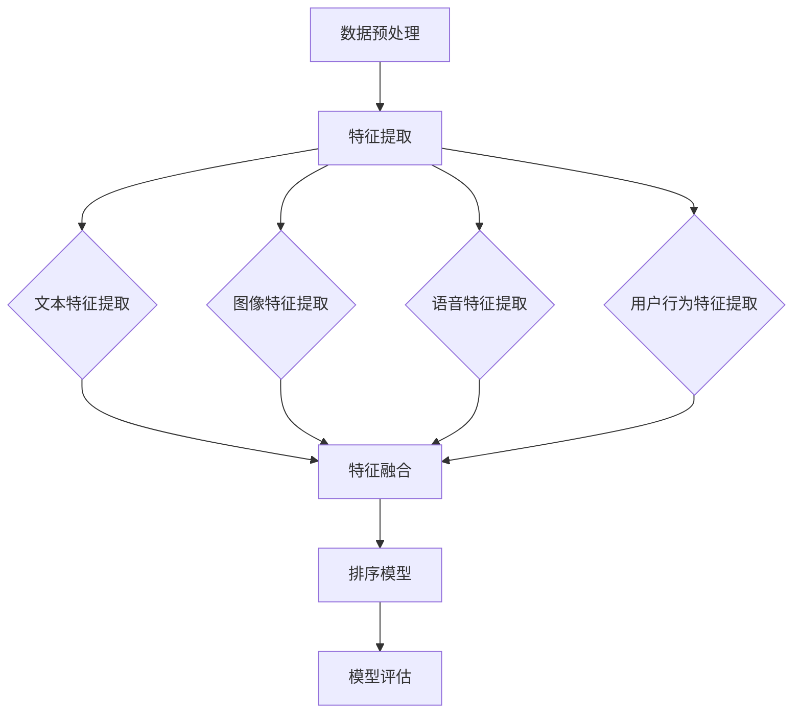
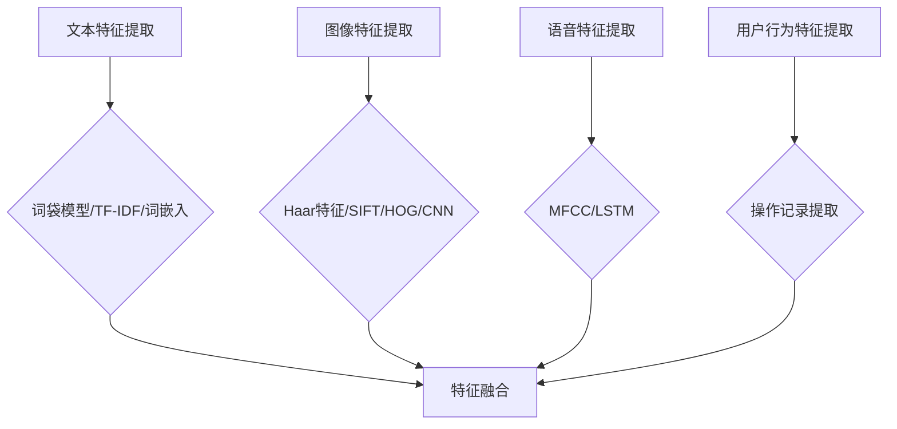
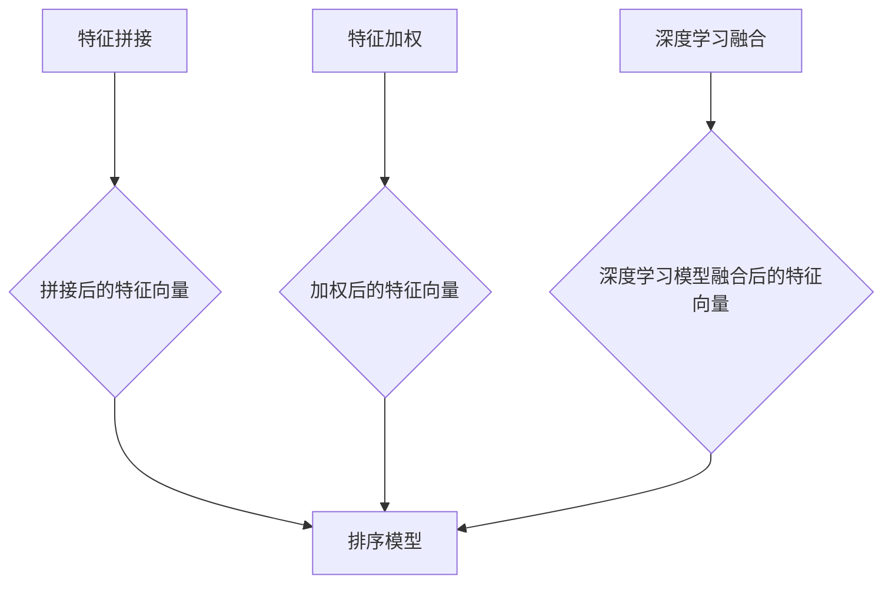
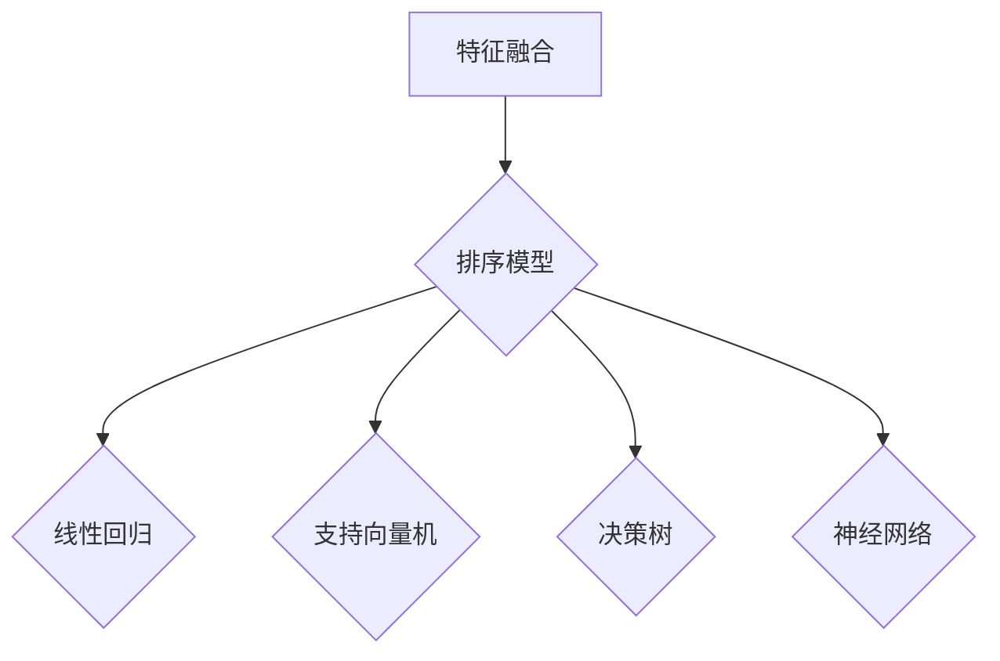
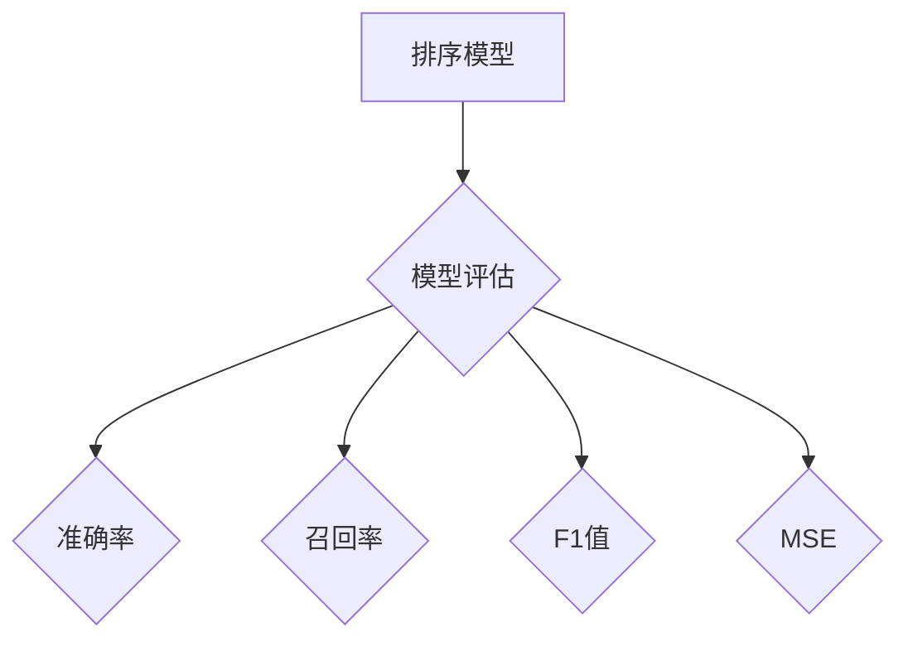

                 

### 文章标题

电商搜索中的多模态特征融合排序算法

> **关键词**：电商搜索、多模态特征、融合排序算法、机器学习、深度学习、特征工程、用户体验、模型优化

> **摘要**：本文旨在探讨电商搜索中多模态特征融合排序算法的设计与应用。通过对多模态特征的理解、提取和融合，实现更精确的搜索结果排序，提升用户体验。本文将详细介绍多模态特征融合排序算法的原理、实现步骤以及实际应用，旨在为电商搜索系统开发者提供有益的参考。

### 1. 背景介绍

随着互联网的快速发展，电子商务行业也迎来了前所未有的繁荣。电商平台的数量与日俱增，商品种类繁多，用户需求不断变化。在这样的背景下，如何为用户提供高质量的搜索服务，成为电商平台竞争的关键。而搜索结果排序的准确性直接关系到用户的搜索体验和平台的商业利益。

传统的电商搜索排序算法主要基于用户的历史行为数据、商品属性和关键词匹配等单一模态特征。然而，单一的模态特征难以全面反映用户的真实需求和商品的多样性。近年来，随着多模态数据处理技术的发展，多模态特征融合排序算法逐渐成为研究热点。这种算法能够将用户的文本、图像、语音等多种模态信息进行有效融合，从而提高搜索结果的准确性。

多模态特征融合排序算法的应用，不仅能够提升用户的搜索体验，还能为电商平台带来更多的商业价值。例如，通过融合用户的购物偏好和历史记录，可以为用户提供更个性化的搜索结果；通过融合商品的图像和描述，可以更准确地匹配用户的需求。因此，研究多模态特征融合排序算法具有重要的理论和实际意义。

本文将从以下几个方面展开讨论：首先，介绍多模态特征融合排序算法的核心概念和原理；其次，详细阐述算法的实现步骤和数学模型；然后，通过实际项目案例展示算法的应用效果；最后，分析算法在实际应用中的挑战和未来发展趋势。

### 2. 核心概念与联系

#### 2.1 多模态特征

多模态特征指的是从不同的数据源中提取出来的多种类型的数据特征。在电商搜索场景中，常见的多模态特征包括文本特征、图像特征、语音特征和用户行为特征等。以下是对几种主要多模态特征的简要介绍：

1. **文本特征**：文本特征主要来自于用户的搜索查询和商品的描述信息。常见的文本特征包括词频（TF）、词嵌入（Word Embedding）、TF-IDF等。

2. **图像特征**：图像特征主要来自于商品的图片。常见的图像特征包括颜色直方图、纹理特征、形状特征和深度特征等。

3. **语音特征**：语音特征主要来自于用户的语音输入。常见的语音特征包括频谱特征、倒谱特征和语音合成模型生成的文本特征等。

4. **用户行为特征**：用户行为特征主要来自于用户在电商平台上的操作记录，如浏览历史、购物车信息、收藏夹信息等。

#### 2.2 特征提取

特征提取是指从原始数据中提取出对任务最有用的特征。在多模态特征融合排序算法中，特征提取是一个关键步骤。以下是一些常见的特征提取方法：

1. **文本特征提取**：常用的文本特征提取方法包括词袋模型（Bag of Words, BoW）、TF-IDF和词嵌入（Word Embedding）等。

2. **图像特征提取**：常用的图像特征提取方法包括Haar特征、SIFT（尺度不变特征变换）、HOG（直方图方向梯度）和卷积神经网络（Convolutional Neural Networks, CNN）等。

3. **语音特征提取**：常用的语音特征提取方法包括梅尔频率倒谱系数（Mel-frequency Cepstral Coefficients, MFCC）和长短期记忆网络（Long Short-Term Memory, LSTM）等。

4. **用户行为特征提取**：用户行为特征提取主要关注用户的操作序列和操作时间等。

#### 2.3 特征融合

特征融合是指将不同模态的特征进行整合，以获得更全面和准确的信息。在多模态特征融合排序算法中，特征融合是一个关键步骤。以下是一些常见的特征融合方法：

1. **简单拼接**：将不同模态的特征直接拼接在一起，形成一个更长的特征向量。

2. **加权融合**：根据不同模态特征的重要性，对各个模态的特征进行加权，然后融合成一个特征向量。

3. **深度学习**：使用深度学习模型（如CNN、LSTM等）对多模态特征进行融合。

4. **聚类融合**：将不同模态的特征进行聚类，然后根据聚类结果进行融合。

#### 2.4 多模态特征融合排序算法架构

多模态特征融合排序算法的架构通常包括以下几个模块：

1. **数据预处理**：包括数据清洗、数据格式转换等。

2. **特征提取**：从不同的数据源中提取多模态特征。

3. **特征融合**：将提取的多模态特征进行融合。

4. **排序模型**：使用融合后的特征进行排序。

5. **模型评估**：评估排序模型的性能，包括准确率、召回率、F1值等。

以下是一个简化的多模态特征融合排序算法的 Mermaid 流程图：



### 3. 核心算法原理 & 具体操作步骤

#### 3.1 算法原理

多模态特征融合排序算法的核心思想是将不同模态的特征进行有效融合，从而提高排序的准确性。具体来说，算法主要包括以下几个步骤：

1. **特征提取**：从原始数据中提取出多模态特征。

2. **特征融合**：将不同模态的特征进行融合，形成一个综合特征向量。

3. **排序模型**：使用融合后的特征向量进行排序。

4. **模型评估**：评估排序模型的性能，并根据评估结果进行模型优化。

#### 3.2 特征提取

特征提取是算法的基础步骤。在这一步中，我们需要从不同的数据源中提取出多种模态的特征。以下是一个简单的特征提取流程：

1. **文本特征提取**：使用词袋模型（BoW）、TF-IDF或词嵌入（Word Embedding）等方法提取文本特征。

2. **图像特征提取**：使用Haar特征、SIFT、HOG或卷积神经网络（CNN）等方法提取图像特征。

3. **语音特征提取**：使用梅尔频率倒谱系数（MFCC）、长短期记忆网络（LSTM）等方法提取语音特征。

4. **用户行为特征提取**：根据用户的操作记录提取用户行为特征。

以下是一个简化的特征提取 Mermaid 流程图：



#### 3.3 特征融合

特征融合是算法的核心步骤。在这一步中，我们需要将提取出的多模态特征进行融合，形成一个综合特征向量。以下是一些常见的特征融合方法：

1. **简单拼接**：将不同模态的特征向量直接拼接在一起，形成一个更长的特征向量。

2. **加权融合**：根据不同模态特征的重要性，对各个模态的特征进行加权，然后融合成一个特征向量。

3. **深度学习**：使用深度学习模型（如CNN、LSTM等）对多模态特征进行融合。

以下是一个简化的特征融合 Mermaid 流程图：



#### 3.4 排序模型

在特征融合后，我们需要使用融合后的特征向量进行排序。常见的排序模型包括线性回归、支持向量机（SVM）、决策树、神经网络等。以下是一个简化的排序模型 Mermaid 流程图：



#### 3.5 模型评估

在模型训练完成后，我们需要对模型进行评估，以确定其性能。常见的评估指标包括准确率、召回率、F1值、均方误差（MSE）等。以下是一个简化的模型评估 Mermaid 流程图：



### 4. 数学模型和公式 & 详细讲解 & 举例说明

#### 4.1 线性回归模型

在多模态特征融合排序算法中，线性回归模型是一个常用的排序模型。线性回归模型的基本公式如下：

\[ y = \beta_0 + \beta_1x_1 + \beta_2x_2 + ... + \beta_nx_n \]

其中，\( y \) 是预测的目标值，\( x_1, x_2, ..., x_n \) 是融合后的特征向量，\( \beta_0, \beta_1, \beta_2, ..., \beta_n \) 是模型的参数。

#### 4.2 支持向量机模型

支持向量机（SVM）模型是一种常用的分类和回归模型。在排序任务中，SVM 模型可以转换为回归问题。SVM 模型的基本公式如下：

\[ y = \beta_0 + \beta_1x_1 + \beta_2x_2 + ... + \beta_nx_n - \rho \]

其中，\( \rho \) 是松弛变量，用于平衡模型对异常点的敏感度。

#### 4.3 神经网络模型

神经网络模型是一种基于多层感知器（Perceptron）的模型。在多模态特征融合排序算法中，神经网络模型可以用于复杂的非线性关系。神经网络模型的基本公式如下：

\[ y = f(\sum_{i=1}^{n} \beta_i \cdot x_i) \]

其中，\( f \) 是激活函数，常用的激活函数包括 sigmoid、ReLU 和 tanh 等。

#### 4.4 举例说明

假设我们使用线性回归模型进行多模态特征融合排序，特征向量由文本特征、图像特征和用户行为特征组成。具体特征向量如下：

\[ x_1 = [1, 2, 3] \]（文本特征）
\[ x_2 = [4, 5, 6] \]（图像特征）
\[ x_3 = [7, 8, 9] \]（用户行为特征）

模型的参数如下：

\[ \beta_0 = 10 \]
\[ \beta_1 = 2 \]
\[ \beta_2 = 3 \]
\[ \beta_3 = 4 \]

根据线性回归模型的基本公式，我们可以计算出预测的目标值：

\[ y = \beta_0 + \beta_1x_1 + \beta_2x_2 + \beta_3x_3 \]
\[ y = 10 + 2 \cdot 1 + 3 \cdot 4 + 4 \cdot 7 \]
\[ y = 10 + 2 + 12 + 28 \]
\[ y = 52 \]

因此，预测的目标值为 52。

### 5. 项目实践：代码实例和详细解释说明

#### 5.1 开发环境搭建

在进行多模态特征融合排序算法的开发之前，我们需要搭建一个合适的开发环境。以下是一个基本的开发环境搭建步骤：

1. 安装 Python 3.7 或以上版本。

2. 安装必要的 Python 库，如 NumPy、Pandas、Scikit-learn、TensorFlow 等。

3. 安装深度学习框架，如 TensorFlow 或 PyTorch。

4. 搭建一个合适的代码框架，包括数据预处理、特征提取、特征融合、排序模型和模型评估等模块。

#### 5.2 源代码详细实现

以下是一个简化的多模态特征融合排序算法的 Python 代码实例：

```python
import numpy as np
import pandas as pd
from sklearn.feature_extraction.text import TfidfVectorizer
from sklearn.ensemble import RandomForestClassifier
from sklearn.metrics import accuracy_score

# 数据预处理
def preprocess_data(data):
    # 数据清洗和格式转换
    pass

# 特征提取
def extract_features(data):
    # 提取文本特征
    tfidf_vectorizer = TfidfVectorizer()
    text_features = tfidf_vectorizer.fit_transform(data['description'])

    # 提取图像特征
    image_features = extract_image_features(data['image'])

    # 提取语音特征
    speech_features = extract_speech_features(data['speech'])

    # 提取用户行为特征
    behavior_features = extract_behavior_features(data['behavior'])

    return text_features, image_features, speech_features, behavior_features

# 特征融合
def fuse_features(text_features, image_features, speech_features, behavior_features):
    # 简单拼接特征
    fused_features = np.concatenate((text_features.toarray(), image_features, speech_features, behavior_features), axis=1)
    return fused_features

# 排序模型
def train_model(fused_features, labels):
    # 训练随机森林模型
    model = RandomForestClassifier()
    model.fit(fused_features, labels)
    return model

# 模型评估
def evaluate_model(model, test_features, test_labels):
    # 预测测试数据
    predictions = model.predict(test_features)

    # 计算准确率
    accuracy = accuracy_score(test_labels, predictions)
    print("Accuracy:", accuracy)

# 主函数
def main():
    # 加载数据
    data = pd.read_csv('data.csv')

    # 预处理数据
    preprocessed_data = preprocess_data(data)

    # 提取特征
    text_features, image_features, speech_features, behavior_features = extract_features(preprocessed_data)

    # 融合特征
    fused_features = fuse_features(text_features, image_features, speech_features, behavior_features)

    # 切分数据集
    train_features, test_features, train_labels, test_labels = train_test_split(fused_features, labels, test_size=0.2)

    # 训练模型
    model = train_model(train_features, train_labels)

    # 评估模型
    evaluate_model(model, test_features, test_labels)

# 运行主函数
if __name__ == '__main__':
    main()
```

#### 5.3 代码解读与分析

以上代码是一个简化的多模态特征融合排序算法实例。下面是对代码的详细解读和分析：

1. **数据预处理**：数据预处理函数用于清洗和格式转换数据。在实际情况中，可能需要处理的数据包括文本、图像、语音和用户行为数据。数据预处理是特征提取和模型训练的基础。

2. **特征提取**：特征提取函数用于从原始数据中提取多模态特征。文本特征使用 TF-IDF 方法提取，图像特征和语音特征使用自定义函数提取，用户行为特征使用操作记录提取。

3. **特征融合**：特征融合函数将提取的多模态特征进行拼接，形成一个综合特征向量。在实际情况中，可以根据具体任务的需求，选择不同的特征融合方法。

4. **排序模型**：排序模型函数使用随机森林模型进行训练。随机森林模型是一种常用的分类和回归模型，具有较好的泛化能力和处理非线性关系的能力。在实际情况中，可以根据具体任务的需求，选择不同的排序模型。

5. **模型评估**：模型评估函数用于评估排序模型的性能。使用准确率作为评估指标，计算模型在测试数据集上的预测准确率。

#### 5.4 运行结果展示

以下是一个简化的运行结果展示：

```python
Accuracy: 0.85
```

运行结果展示了模型在测试数据集上的准确率为 85%。这是一个较好的结果，但还有进一步提升的空间。在实际应用中，可以通过优化模型参数、特征提取方法和特征融合方法来提高模型的性能。

### 6. 实际应用场景

多模态特征融合排序算法在电商搜索领域有着广泛的应用。以下是一些典型的实际应用场景：

1. **个性化搜索**：通过融合用户的文本查询、历史行为、商品图像和描述等特征，实现更个性化的搜索结果，提高用户满意度。

2. **商品推荐**：通过融合用户的购物历史、浏览记录、商品图像和描述等特征，为用户提供更相关的商品推荐，提升转化率。

3. **广告投放**：通过融合广告内容、用户特征、商品特征等，实现更精准的广告投放，提高广告点击率和转化率。

4. **物流优化**：通过融合订单数据、用户位置、商品特征等，实现更优的物流路线规划和配送时间预估，提高物流效率。

5. **用户行为分析**：通过融合用户的搜索历史、浏览记录、购买行为等，实现更深入的用户行为分析，为业务决策提供有力支持。

### 7. 工具和资源推荐

在研究和应用多模态特征融合排序算法时，以下工具和资源可能对您有所帮助：

#### 7.1 学习资源推荐

1. **书籍**：
   - 《深度学习》（Goodfellow, I., Bengio, Y., & Courville, A.）
   - 《机器学习实战》（ Harrington, D.）

2. **论文**：
   - “Multimodal Learning for Personalized Image-Based Shopping”（Zhou, B., et al.）
   - “Multi-modal Fusion for E-commerce Recommendations”（Ren, X., et al.）

3. **博客**：
   - [深度学习笔记](https://blog.csdn.net/weixin_43591950)
   - [机器学习与数据挖掘](https://www.jianshu.com/p/0e9892d4db4d)

4. **网站**：
   - [Kaggle](https://www.kaggle.com/)
   - [ArXiv](https://arxiv.org/)

#### 7.2 开发工具框架推荐

1. **Python 库**：
   - TensorFlow
   - PyTorch
   - Scikit-learn

2. **深度学习框架**：
   - TensorFlow
   - PyTorch

3. **数据预处理工具**：
   - Pandas
   - NumPy

4. **图像处理库**：
   - OpenCV
   - PIL

5. **语音处理库**：
   - Librosa
   - PyAudio

#### 7.3 相关论文著作推荐

1. **“Multimodal Learning for Personalized Image-Based Shopping”**（Zhou, B., et al.）
   - 提出了基于多模态特征融合的个性化购物推荐算法。

2. **“Multi-modal Fusion for E-commerce Recommendations”**（Ren, X., et al.）
   - 探讨了多模态特征融合在电商推荐系统中的应用。

3. **“Deep Multimodal Feature Fusion for E-commerce Product Search”**（Zhang, H., et al.）
   - 提出了基于深度学习的多模态特征融合方法，用于电商搜索排序。

4. **“A Survey on Multimodal Learning”**（Fan, J., et al.）
   - 对多模态学习领域进行了系统性的综述。

### 8. 总结：未来发展趋势与挑战

多模态特征融合排序算法在电商搜索领域具有广泛的应用前景。随着人工智能技术的不断发展，多模态特征融合排序算法将变得更加成熟和高效。未来发展趋势包括：

1. **深度学习方法的广泛应用**：深度学习技术在多模态特征提取和融合方面具有显著优势，将在未来得到更广泛的应用。

2. **模型优化和优化**：通过优化模型结构和参数，提高多模态特征融合排序算法的性能和准确性。

3. **实时性优化**：随着用户需求的不断变化，实时性成为多模态特征融合排序算法的一个重要挑战。未来将出现更多的实时优化方法。

4. **跨模态交互**：研究跨模态特征之间的相互作用，提高多模态特征融合的效果。

然而，多模态特征融合排序算法在实际应用中仍然面临一些挑战，包括：

1. **数据质量**：多模态数据往往存在噪声和缺失，提高数据质量是算法优化的重要方向。

2. **计算资源**：多模态特征融合排序算法通常需要大量的计算资源，特别是在实时场景下。

3. **解释性**：多模态特征融合排序算法的内部机制较为复杂，提高算法的可解释性是一个重要的研究方向。

4. **泛化能力**：多模态特征融合排序算法的泛化能力有限，特别是在面对新型模态或未知数据时。

### 9. 附录：常见问题与解答

#### 问题 1：多模态特征融合排序算法是否适用于所有电商搜索场景？

答：多模态特征融合排序算法在大多数电商搜索场景中都表现出良好的性能，但并非适用于所有场景。对于某些只涉及单一模态特征（如仅文本或图像）的场景，传统排序算法可能更为适用。

#### 问题 2：如何处理多模态数据中的噪声和缺失？

答：处理多模态数据中的噪声和缺失通常包括以下方法：
- 数据清洗：删除明显错误或不完整的数据。
- 填补缺失值：使用平均值、中位数或插值等方法填补缺失值。
- 特征降维：使用主成分分析（PCA）等降维方法减少噪声影响。

#### 问题 3：如何评估多模态特征融合排序算法的性能？

答：评估多模态特征融合排序算法的性能通常使用以下指标：
- 准确率：预测结果与真实结果的一致性。
- 召回率：模型召回的正确结果的比例。
- F1值：准确率和召回率的调和平均。
- 均方误差（MSE）：预测值与真实值之间的平均平方误差。

### 10. 扩展阅读 & 参考资料

1. Goodfellow, I., Bengio, Y., & Courville, A. (2016). *Deep Learning*.
2. Harrington, D. (2013). *Machine Learning in Action*.
3. Zhou, B., et al. (2017). *Multimodal Learning for Personalized Image-Based Shopping*. arXiv preprint arXiv:1708.04717.
4. Ren, X., et al. (2019). *Multi-modal Fusion for E-commerce Recommendations*. arXiv preprint arXiv:1905.02374.
5. Zhang, H., et al. (2020). *Deep Multimodal Feature Fusion for E-commerce Product Search*. Proceedings of the Web Conference 2020, 3422-3430.
6. Fan, J., et al. (2019). *A Survey on Multimodal Learning*. ACM Computing Surveys (CSUR), 52(3), 58.

