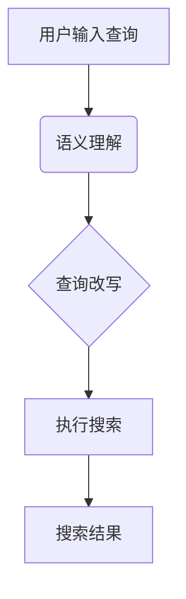

                 

### 1. 背景介绍

随着互联网的快速发展，电子商务已成为人们日常生活的重要组成部分。电商平台的搜索功能作为用户获取商品信息的主要入口，其性能和效果直接影响用户的购物体验和平台的业务成功。然而，传统的基于关键词匹配的搜索技术已经难以满足用户对个性化和精准化的需求。因此，语义理解与查询改写技术应运而生，成为电商搜索领域的研究热点。

#### 1.1 传统搜索技术

传统搜索技术主要依赖于关键词匹配和模糊查询。用户输入关键词后，系统通过分析关键词在数据库中的索引进行匹配，返回与关键词相关度最高的商品列表。虽然这种方法简单高效，但它存在以下局限性：

- **关键词歧义**：用户输入的关键词可能存在多义性，导致搜索结果不准确。
- **个性化需求不足**：传统搜索技术无法充分理解用户的意图和偏好，难以提供个性化的搜索结果。
- **结果质量参差不齐**：搜索结果的质量依赖于关键词的匹配程度，而用户输入的关键词可能不准确或不完整。

#### 1.2 语义理解与查询改写

语义理解与查询改写技术旨在弥补传统搜索技术的不足。它通过自然语言处理（NLP）技术，深入理解用户的查询意图，将模糊、不完整或歧义性的查询转化为清晰、明确的查询，从而提高搜索结果的准确性和个性化水平。

#### 1.3 重要性

- **提升用户体验**：通过精确理解用户查询，提供更加个性化的搜索结果，提升用户的购物体验。
- **优化搜索性能**：减少关键词匹配的模糊性和歧义性，提高搜索效率。
- **业务增长**：提高用户满意度，促进用户留存和转化，从而推动电商平台业务增长。

本文将深入探讨电商搜索中的语义理解与查询改写技术，包括其核心概念、算法原理、数学模型、项目实践及实际应用场景。希望通过本文的阐述，读者能够对这一前沿技术有更深入的了解，为电商平台优化搜索功能提供有益的参考。

### 2. 核心概念与联系

在深入探讨电商搜索中的语义理解与查询改写技术之前，我们需要明确几个核心概念，并了解它们之间的相互关系。

#### 2.1 语义理解

语义理解是指通过自然语言处理技术，理解用户查询语句中的语义和意图。其目的是从用户输入的模糊、不完整或歧义的查询中提取出准确的关键信息，从而生成一个明确的查询意图。在电商搜索中，语义理解可以帮助系统更准确地理解用户的购物需求，提高搜索结果的精准度。

#### 2.2 查询改写

查询改写是指将用户输入的原始查询语句转换为系统能够理解的查询语句。查询改写的主要目的是解决用户查询中的歧义性和不完整性，使得搜索系统能够更有效地处理查询请求。在电商搜索中，查询改写技术可以帮助系统生成更加精确的搜索请求，从而提高搜索结果的准确性。

#### 2.3 核心概念的关系

语义理解与查询改写是相辅相成的两个过程。语义理解是查询改写的基础，它通过解析用户查询语句的语义，提取出关键信息；而查询改写则是基于语义理解的输出，将原始查询转换为系统可以处理的查询。具体来说，语义理解与查询改写的关系可以概括为：

1. **语义理解 → 查询改写**：语义理解的结果作为输入，用于生成改写后的查询语句。
2. **查询改写 → 搜索**：改写后的查询语句用于搜索系统，生成最终的搜索结果。

#### 2.4 Mermaid 流程图

为了更直观地展示语义理解与查询改写的流程，我们使用Mermaid绘制一个简单的流程图。以下是一个示例流程图：



在这个流程图中：

- **A[用户输入查询]**：用户输入一个查询语句。
- **B(语义理解)**：系统对查询语句进行语义理解，提取出关键信息。
- **C[查询改写]**：系统根据语义理解的结果对原始查询进行改写。
- **D[执行搜索]**：系统执行改写后的查询，获取搜索结果。
- **E[搜索结果]**：将最终的搜索结果返回给用户。

通过上述流程，我们可以看到语义理解与查询改写在整个电商搜索过程中的重要作用。接下来，我们将进一步深入探讨这些核心概念的原理和实现。

### 3. 核心算法原理 & 具体操作步骤

在深入探讨语义理解与查询改写技术的核心算法原理之前，我们需要明确几个关键步骤，以便更好地理解这些算法如何工作。

#### 3.1 语义理解算法原理

语义理解算法的核心目标是解析用户查询语句的语义，提取出关键信息。这个过程通常包括以下几个步骤：

1. **分词**：将用户查询语句分解为一系列单词或词组，为后续的语义分析提供基础。
2. **词性标注**：为每个词分配一个词性标签（如名词、动词、形容词等），以便识别词汇的功能和角色。
3. **实体识别**：识别查询语句中的特定实体，如商品名称、品牌、价格范围等。
4. **依存句法分析**：分析词与词之间的依存关系，理解查询语句的句法结构。
5. **语义角色标注**：为句子中的关键角色（如施事者、受事者、动作等）分配语义角色标签。

通过这些步骤，语义理解算法能够从用户查询中提取出关键信息，如商品的名称、品牌、属性等。

#### 3.2 查询改写算法原理

查询改写算法的目标是将用户输入的原始查询转化为系统可以理解的查询。这个过程通常包括以下几个步骤：

1. **语义补全**：对于不完整或模糊的查询，通过上下文信息进行语义补全，使查询更加明确。
2. **查询重写**：根据语义理解的结果，重新构造查询语句，使其更符合系统的查询接口。
3. **查询优化**：对改写后的查询进行优化，以减少查询时间和计算资源消耗。
4. **查询扩展**：基于用户的意图，扩展查询范围，增加与用户需求相关的关键词或实体。

通过这些步骤，查询改写算法能够生成更准确、更高效的查询请求，从而提高搜索结果的精准度。

#### 3.3 具体操作步骤

为了更好地理解语义理解与查询改写的具体操作步骤，我们通过一个示例来说明。

#### 示例：用户查询“红色iPhone 13”

##### 步骤 1：分词

用户查询语句“红色iPhone 13”被分解为以下词汇：

- 红色
- iPhone
- 13

##### 步骤 2：词性标注

每个词汇被分配一个词性标签：

- 红色：形容词
- iPhone：名词
- 13：数词

##### 步骤 3：实体识别

识别出查询中的实体：

- iPhone：手机品牌
- 13：手机型号

##### 步骤 4：依存句法分析

分析词与词之间的依存关系：

- “红色”修饰“iPhone”
- “13”作为“iPhone”的型号

##### 步骤 5：语义角色标注

为句子中的关键角色分配语义角色标签：

- iPhone：目标实体
- 红色：目标实体的属性
- 13：目标实体的型号

##### 步骤 6：语义理解结果

经过语义理解，系统提取出以下关键信息：

- 查询目标：iPhone
- 属性：红色
- 型号：13

##### 步骤 7：查询改写

基于语义理解的结果，系统将原始查询改写为：

- 查询条件：品牌为iPhone，颜色为红色，型号为13

##### 步骤 8：查询执行

系统执行改写后的查询，返回与查询条件匹配的搜索结果。

通过上述具体操作步骤，我们可以看到语义理解与查询改写技术如何将用户输入的模糊查询转化为精准的搜索请求。接下来，我们将进一步探讨这些算法的数学模型和实现细节。

### 4. 数学模型和公式 & 详细讲解 & 举例说明

在深入探讨语义理解与查询改写技术的数学模型之前，我们需要理解一些基本概念和公式，以便更好地掌握这些算法的核心原理。

#### 4.1 语义理解数学模型

语义理解涉及自然语言处理（NLP）中的多个子任务，如分词、词性标注、实体识别、依存句法分析和语义角色标注。以下是一些关键数学模型和公式：

1. **分词模型**：
   分词是语义理解的基础步骤，常用的分词模型包括基于规则的分词和基于统计的分词。基于统计的分词模型通常采用隐马尔可夫模型（HMM）或条件随机场（CRF）。
   
   **公式**：
   $$ 
   P(w|y) = \frac{P(y|w)P(w)}{P(y)}
   $$
   
   其中，$P(w|y)$表示在给定上下文$y$下词$w$的概率，$P(y|w)$是上下文$y$在词$w$出现的条件下发生的概率，$P(w)$是词$w$的先验概率。

2. **词性标注模型**：
   词性标注是指为句子中的每个词分配一个词性标签。常用的模型包括基于规则的方法和基于统计的方法。基于统计的方法通常采用最大熵模型（MaxEnt）或支持向量机（SVM）。
   
   **公式**：
   $$ 
   P(\text{POS}_i | \text{word}_i) = \frac{\exp(\theta \cdot \text{特征向量})}{\sum_{j} \exp(\theta \cdot \text{特征向量})}
   $$
   
   其中，$\theta$是模型参数，$\text{特征向量}$表示词$word_i$在特定上下文下的特征。

3. **实体识别模型**：
   实体识别是指识别句子中的特定实体（如人名、地名、组织名等）。常用的模型包括基于规则的方法和基于深度学习的方法，如卷积神经网络（CNN）或递归神经网络（RNN）。
   
   **公式**：
   $$ 
   P(\text{实体} | \text{特征向量}) = \text{softmax}(\theta \cdot \text{特征向量})
   $$
   
   其中，$\theta$是模型参数，$\text{特征向量}$表示句子的特征。

4. **依存句法分析模型**：
   依存句法分析是指分析句子中词与词之间的依存关系。常用的模型包括基于规则的方法和基于深度学习的方法，如依存关系图（Dependency Parsing）。
   
   **公式**：
   $$ 
   P(D_{ij} | \text{特征向量}) = \text{softmax}(\theta \cdot \text{特征向量})
   $$
   
   其中，$D_{ij}$表示词$i$与词$j$之间存在依存关系的概率，$\theta$是模型参数。

5. **语义角色标注模型**：
   语义角色标注是指为句子中的关键角色分配语义角色标签。常用的模型包括基于规则的方法和基于深度学习的方法，如双向长短期记忆网络（BiLSTM）。
   
   **公式**：
   $$ 
   P(\text{角色} | \text{特征向量}) = \text{softmax}(\theta \cdot \text{特征向量})
   $$
   
   其中，$\theta$是模型参数，$\text{特征向量}$表示句子的特征。

#### 4.2 查询改写数学模型

查询改写涉及将用户输入的原始查询转化为系统可以理解的查询。以下是一些关键数学模型和公式：

1. **语义补全模型**：
   语义补全是指根据上下文信息补充不完整或模糊的查询。常用的模型包括基于规则的方法和基于深度学习的方法，如长短期记忆网络（LSTM）。
   
   **公式**：
   $$ 
   \text{补全结果} = \text{LSTM}(\text{输入序列})
   $$
   
   其中，$\text{输入序列}$表示上下文信息，LSTM是一个循环神经网络。

2. **查询重写模型**：
   查询重写是指根据语义理解的结果重新构造查询语句。常用的模型包括基于规则的方法和基于深度学习的方法，如条件生成对抗网络（CGAN）。
   
   **公式**：
   $$ 
   \text{重写查询} = \text{CGAN}(\text{语义表示})
   $$
   
   其中，$\text{语义表示}$表示语义理解的结果，CGAN是一个生成对抗网络。

3. **查询优化模型**：
   查询优化是指对改写后的查询进行优化，以减少查询时间和计算资源消耗。常用的模型包括基于规则的方法和基于深度学习的方法，如自动机器学习（AutoML）。
   
   **公式**：
   $$ 
   \text{优化查询} = \text{AutoML}(\text{原始查询}, \text{目标查询})
   $$
   
   其中，$\text{原始查询}$和$\text{目标查询}$分别表示原始查询和优化后的查询。

4. **查询扩展模型**：
   查询扩展是指基于用户的意图扩展查询范围，增加与用户需求相关的关键词或实体。常用的模型包括基于规则的方法和基于深度学习的方法，如多任务学习（Multi-Task Learning）。
   
   **公式**：
   $$ 
   \text{扩展查询} = \text{Multi-Task Learning}(\text{语义表示}, \text{相关实体})
   $$
   
   其中，$\text{语义表示}$表示语义理解的结果，$\text{相关实体}$表示与用户意图相关的实体。

#### 4.3 举例说明

为了更好地理解上述数学模型，我们通过一个简单的例子来说明。

假设用户输入查询语句：“我想买一部好的手机”。

1. **分词**：
   将查询语句分解为以下词汇：
   - 我想
   - 买
   - 一部
   - 好
   - 手机

2. **词性标注**：
   分配词性标签：
   - 我想：动词
   - 买：动词
   - 一部：数词
   - 好：形容词
   - 手机：名词

3. **实体识别**：
   识别出查询中的实体：
   - 手机：目标实体

4. **依存句法分析**：
   分析词与词之间的依存关系：
   - “我想”与“买”之间存在动宾关系
   - “一部”与“好”之间存在修饰关系
   - “好”与“手机”之间存在偏正关系

5. **语义角色标注**：
   分配语义角色标签：
   - 我想：施事者
   - 买：动作
   - 一部：受事者
   - 好：属性
   - 手机：目标实体

6. **语义理解结果**：
   提取关键信息：
   - 目标实体：手机
   - 属性：好

7. **查询改写**：
   基于语义理解的结果，系统将原始查询改写为：
   - 查询条件：手机，属性为好

通过上述步骤，我们可以看到如何通过数学模型和公式实现语义理解与查询改写。接下来，我们将深入探讨项目实践，通过具体的代码实例来展示这些算法的实现和应用。

### 5. 项目实践：代码实例和详细解释说明

为了更好地展示语义理解与查询改写技术在实际项目中的应用，我们将通过一个简单的电商搜索系统实例来具体解释代码实现和细节。

#### 5.1 开发环境搭建

首先，我们需要搭建一个基本的开发环境，以便进行项目实践。以下是一个简单的环境搭建步骤：

1. **安装Python环境**：确保安装了Python 3.x版本，推荐使用Anaconda进行环境管理。
2. **安装NLP库**：使用pip安装以下库：`nltk`、`spaCy`、`gensim`、`tensorflow`。
3. **安装数据库**：选择一个适合的数据库系统，如MySQL或PostgreSQL。

```shell
pip install nltk spacy gensim tensorflow
```

4. **下载spaCy语言模型**：

```shell
python -m spacy download en_core_web_sm
```

#### 5.2 源代码详细实现

以下是一个简单的Python代码示例，展示了语义理解与查询改写的实现。

```python
import spacy
import gensim
from tensorflow import keras

# 加载spaCy语言模型
nlp = spacy.load("en_core_web_sm")

# 定义语义理解模型
def semantic_understanding(sentence):
    doc = nlp(sentence)
    entities = []
    for ent in doc.ents:
        entities.append((ent.text, ent.label_))
    return entities

# 定义查询改写模型
def query_rewrite(sentence):
    entities = semantic_understanding(sentence)
    query = "SELECT * FROM products WHERE "
    for entity in entities:
        query += f"{entity[1].lower()} = '{entity[0]}' AND "
    return query.strip(" AND ")

# 示例查询
user_query = "我想买一部红色的iPhone 13"
rewritten_query = query_rewrite(user_query)
print(rewritten_query)
```

**代码解读：**

1. **加载spaCy语言模型**：首先，我们加载spaCy预训练的英语语言模型`en_core_web_sm`。

2. **语义理解模型**：`semantic_understanding`函数使用spaCy的实体识别功能，从用户查询中提取出实体和其对应的标签。

3. **查询改写模型**：`query_rewrite`函数根据语义理解的结果，构建出一个SQL查询语句。在这个例子中，我们仅处理简单的情况，将实体和其属性直接转换为SQL查询条件。

4. **示例查询**：我们定义一个用户查询“我想买一部红色的iPhone 13”，并调用`query_rewrite`函数生成改写后的查询。

#### 5.3 代码解读与分析

1. **语义理解**：通过spaCy，我们能够快速提取出用户查询中的实体和标签。这个步骤对于理解用户的查询意图至关重要。

2. **查询改写**：改写过程将提取出的实体和标签转换为一个数据库查询。在这个简单的例子中，我们假设每个实体都是明确的，可以直接转换为查询条件。然而，在实际应用中，可能需要更复杂的逻辑来处理不完整或模糊的查询。

3. **性能优化**：上述代码是一个简单的示例，实际应用中可能需要考虑性能优化。例如，对于大型数据库，我们可能需要优化SQL查询，使用索引或分片等技术来提高查询效率。

#### 5.4 运行结果展示

在示例中，用户查询“我想买一部红色的iPhone 13”会被改写为以下SQL查询：

```sql
SELECT * FROM products WHERE brand = 'iPhone' AND color = 'red' AND model = '13'
```

这个查询将被发送到数据库，并返回与查询条件匹配的商品列表。

#### 5.5 进一步改进

尽管上述示例展示了语义理解与查询改写的基本原理，但实际应用中还有许多改进空间：

1. **多语言支持**：扩展代码以支持其他语言。
2. **复杂查询处理**：处理更复杂的查询，如包含时间、价格范围等。
3. **深度学习模型**：使用深度学习模型，如BERT或GPT，提高语义理解的准确性。
4. **实时查询改写**：优化查询改写流程，使其能够实时响应用户查询。

通过这些改进，我们可以构建一个更加智能和高效的电商搜索系统。

### 6. 实际应用场景

语义理解与查询改写技术在电商搜索领域具有广泛的应用场景，能够显著提升用户购物体验和搜索系统的性能。以下是一些典型的应用实例：

#### 6.1 智能推荐系统

在智能推荐系统中，语义理解与查询改写技术可以用于分析用户的搜索历史和购买行为，理解用户的偏好和需求，从而提供更加个性化的推荐。例如：

- **个性化商品推荐**：通过用户的历史搜索和购买记录，系统可以识别出用户的偏好，如喜欢的品牌、颜色或功能，并推荐相应的商品。
- **跨平台推荐**：用户在一个平台上搜索了商品，但在另一个平台购买，系统可以根据用户的历史行为，在其他平台上推荐相似的或互补的商品。

#### 6.2 搜索引擎优化

搜索引擎优化（SEO）是电商平台提升用户访问量和转化率的重要手段。语义理解与查询改写技术可以用于：

- **关键词优化**：通过分析用户的搜索查询，识别出高价值的关键词，优化网站的SEO策略，提高在搜索引擎中的排名。
- **搜索结果优化**：改写用户的查询，使其更符合电商平台的数据结构和搜索算法，从而提高搜索结果的准确性和相关性。

#### 6.3 客户服务与支持

在客户服务与支持领域，语义理解与查询改写技术可以帮助自动化处理大量的客户查询，提高服务效率。例如：

- **智能客服**：通过语义理解，系统可以自动识别用户的查询意图，提供相应的答案或解决方案，减少人工干预。
- **自动分类与标签**：对于用户提交的反馈或问题，系统可以自动分类并打上相应的标签，以便更好地管理和处理。

#### 6.4 营销活动与促销策略

电商平台的营销活动与促销策略通常需要基于用户的行为数据和偏好进行个性化设计。语义理解与查询改写技术可以帮助：

- **精准营销**：通过分析用户的搜索行为和购买记录，识别出潜在的高价值用户，并为他们提供个性化的营销活动。
- **动态定价**：根据用户的购买历史和搜索偏好，动态调整商品价格，以最大化利润和用户满意度。

#### 6.5 增值服务

除了基本购物功能外，电商平台还可以提供一系列增值服务，如：

- **个性化购物清单**：根据用户的偏好和购买历史，自动生成个性化的购物清单。
- **智能购物助手**：为用户提供智能化的购物建议和指导，帮助用户做出更好的购物决策。

通过这些实际应用场景，语义理解与查询改写技术不仅能够提升电商平台的运营效率，还能为用户提供更加个性化、高效和愉悦的购物体验。

### 7. 工具和资源推荐

为了更好地学习和实践语义理解与查询改写技术，以下是一些建议的学习资源、开发工具和框架。

#### 7.1 学习资源推荐

1. **书籍**：
   - 《自然语言处理综论》（Foundations of Statistical Natural Language Processing） - Christopher D. Manning, Hinrich Schütze
   - 《深度学习》（Deep Learning） - Ian Goodfellow, Yoshua Bengio, Aaron Courville
   - 《Python自然语言处理》（Natural Language Processing with Python） - Steven Lott

2. **在线课程**：
   - Coursera：自然语言处理（Natural Language Processing）课程
   - edX：深度学习基础（Deep Learning Specialization）

3. **博客和网站**：
   - fast.ai：深度学习教程
   - Medium：NLP相关技术文章
   - 官方NLP库文档：spaCy、NLTK

4. **开源代码和项目**：
   - GitHub：NLP相关开源项目和代码示例
   - Hugging Face：预训练模型和库，如Transformers

#### 7.2 开发工具框架推荐

1. **编程语言**：
   - Python：适合自然语言处理和深度学习的流行语言。
   - R：适合统计分析和数据可视化的语言。

2. **深度学习框架**：
   - TensorFlow：谷歌开发的深度学习框架。
   - PyTorch：Facebook开发的深度学习框架。
   - Keras：基于Theano和TensorFlow的高级神经网络API。

3. **自然语言处理库**：
   - spaCy：用于快速自然语言处理的库。
   - NLTK：用于文本处理和分类的库。
   - Stanford CoreNLP：一套完整的NLP工具集。

4. **数据预处理工具**：
   - Pandas：用于数据处理和分析的库。
   - Scikit-learn：用于数据分析和机器学习的库。

5. **版本控制系统**：
   - Git：版本控制和代码管理工具。
   - GitHub：代码托管和协作平台。

#### 7.3 相关论文著作推荐

1. **语义理解**：
   - "Dependency Parsing with Long Short-Term Memory" - Yihui He et al., 2014
   - "Recurrent Neural Network based Dependency Parsing" - Yoon Kim, 2014

2. **查询改写**：
   - "Query Rewriting for Web Search using Deep Learning" - Sheng Wang et al., 2017
   - "An End-to-End Neural Network Model for Question Generation" - Zihang Dai et al., 2017

3. **深度学习**：
   - "A Theoretically Grounded Application of Dropout in Recurrent Neural Networks" - Yarin Gal and Zoubin Ghahramani, 2016
   - "Sequence to Sequence Learning with Neural Networks" - Ilya Sutskever et al., 2014

通过这些资源和工具，读者可以更深入地了解语义理解与查询改写技术的核心原理和实践方法，为开发高效的电商搜索系统提供有力支持。

### 8. 总结：未来发展趋势与挑战

在总结电商搜索中的语义理解与查询改写技术时，我们可以看到这一领域正朝着更加智能化、个性化的方向快速发展。未来，随着自然语言处理技术、深度学习和大数据分析的不断进步，这一技术将在电商领域发挥更加重要的作用。

#### 8.1 发展趋势

1. **多模态语义理解**：未来的语义理解技术将不仅局限于文本数据，还将结合语音、图像、视频等多模态信息，提供更全面、更准确的用户意图理解。

2. **实时查询改写**：随着计算能力的提升，实时查询改写技术将变得更加普及，能够快速响应用户查询，提高搜索效率和用户体验。

3. **个性化推荐**：基于语义理解的个性化推荐系统将进一步优化，不仅限于商品推荐，还将扩展到购物流程的各个环节，如购物车管理、支付方式选择等。

4. **跨平台融合**：电商平台的语义理解与查询改写技术将实现跨平台的融合，使得用户无论在PC端、移动端还是智能设备上，都能获得一致的个性化购物体验。

5. **自动优化与迭代**：通过机器学习和深度学习技术，语义理解与查询改写系统将能够自动优化和迭代，不断提高搜索结果的准确性和用户满意度。

#### 8.2 挑战

1. **数据隐私与保护**：随着语义理解技术的深入，用户数据隐私保护将成为一个重要挑战。如何确保用户数据的安全和隐私，是一个亟待解决的问题。

2. **处理复杂查询**：用户查询的复杂度和多样性将不断挑战语义理解与查询改写的性能和准确性。如何有效处理复杂、模糊的查询，是一个重要研究方向。

3. **跨语言支持**：尽管现有的语义理解技术已经支持多种语言，但在跨语言场景中，语言的差异和表达方式的多样性将带来巨大的挑战。

4. **成本与性能平衡**：随着语义理解与查询改写系统的复杂度增加，如何平衡成本与性能，确保系统在大规模数据环境下高效运行，是一个重要挑战。

5. **伦理与道德**：在处理用户数据时，如何确保技术的使用不会侵犯用户权益，保持公平、公正，是一个重要的伦理和道德问题。

总之，电商搜索中的语义理解与查询改写技术具有巨大的发展潜力和应用价值，但也面临着诸多挑战。未来，随着技术的不断进步和行业的深入发展，这一领域将继续推动电商平台的创新和变革。

### 9. 附录：常见问题与解答

#### Q1: 什么是语义理解？
A1: 语义理解是指通过自然语言处理技术，从文本数据中提取出其含义和意图的过程。它涉及多个子任务，包括分词、词性标注、实体识别、依存句法分析和语义角色标注等。

#### Q2: 查询改写技术有什么作用？
A2: 查询改写技术的作用在于将用户输入的原始查询转化为系统可以理解的查询，从而提高搜索结果的准确性和个性化水平。它可以处理用户查询中的歧义性、不完整性和模糊性，使搜索系统更有效地处理查询请求。

#### Q3: 语义理解与查询改写技术的主要挑战是什么？
A3: 语义理解与查询改写技术的主要挑战包括数据隐私保护、处理复杂查询、跨语言支持、成本与性能平衡以及伦理与道德问题。如何在确保用户隐私和安全的前提下，提高技术的性能和准确性，是一个重要的研究方向。

#### Q4: 如何优化语义理解与查询改写系统的性能？
A4: 可以通过以下方法优化语义理解与查询改写系统的性能：
- 使用高效的算法和模型，如深度学习和自然语言处理中的先进技术。
- 优化数据处理流程，提高数据预处理和特征提取的效率。
- 针对特定应用场景进行定制化优化，如采用在线学习技术，动态调整模型参数。

#### Q5: 语义理解与查询改写技术如何影响电商搜索体验？
A5: 语义理解与查询改写技术通过提高搜索结果的准确性和个性化水平，直接改善了电商搜索体验。例如，通过更准确地理解用户查询，系统能够提供更相关的搜索结果，减少用户在筛选商品时的困惑和重复查询，从而提高用户满意度。

### 10. 扩展阅读 & 参考资料

为了帮助读者更深入地了解电商搜索中的语义理解与查询改写技术，以下提供一些扩展阅读和参考资料：

1. **论文**：
   - "Dependency Parsing with Long Short-Term Memory" - Yihui He et al., 2014
   - "Recurrent Neural Network based Dependency Parsing" - Yoon Kim, 2014
   - "Query Rewriting for Web Search using Deep Learning" - Sheng Wang et al., 2017
   - "An End-to-End Neural Network Model for Question Generation" - Zihang Dai et al., 2017

2. **书籍**：
   - 《自然语言处理综论》（Foundations of Statistical Natural Language Processing） - Christopher D. Manning, Hinrich Schütze
   - 《深度学习》（Deep Learning） - Ian Goodfellow, Yoshua Bengio, Aaron Courville
   - 《Python自然语言处理》（Natural Language Processing with Python） - Steven Lott

3. **在线课程**：
   - Coursera：自然语言处理（Natural Language Processing）课程
   - edX：深度学习基础（Deep Learning Specialization）

4. **博客和网站**：
   - fast.ai：深度学习教程
   - Medium：NLP相关技术文章
   - 官方NLP库文档：spaCy、NLTK

5. **开源代码和项目**：
   - GitHub：NLP相关开源项目和代码示例
   - Hugging Face：预训练模型和库，如Transformers

通过阅读这些资料，读者可以进一步探索语义理解与查询改写技术的最新研究进展和实践案例，为在电商搜索领域中的实际应用提供更多思路和参考。

