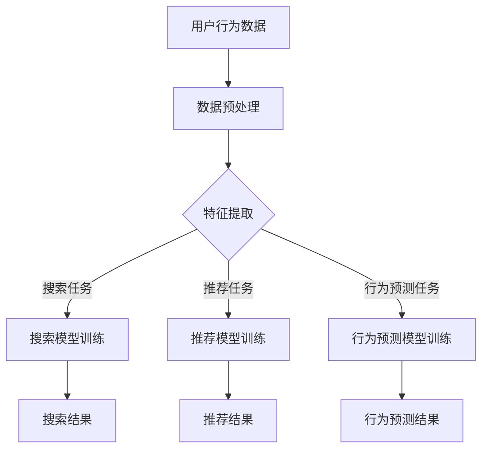

                 

# 电商搜索推荐中的AI大模型多任务学习方法

## 摘要

随着互联网的快速发展，电商行业逐渐成为数字经济的重要组成部分。电商搜索推荐系统作为电商平台的“桥梁”，对提升用户购物体验、增加销售额起着至关重要的作用。本文将深入探讨AI大模型在电商搜索推荐中的多任务学习方法，从背景介绍、核心概念与联系、算法原理与操作步骤、数学模型与公式、项目实践、实际应用场景等多个方面展开论述，旨在为从事电商搜索推荐领域的研究者和从业者提供有价值的参考。

## 1. 背景介绍

### 1.1 电商搜索推荐系统的现状

电商搜索推荐系统是一种根据用户的行为数据、兴趣偏好以及购买历史等，自动向用户推荐相关商品的信息系统。在现代电商平台上，搜索推荐系统已成为提升用户体验、提高转化率的关键因素。根据最新的数据显示，电商搜索推荐系统的准确性和效率直接影响着平台的用户留存率和销售额。

### 1.2 AI大模型的发展

近年来，AI大模型的发展迅猛，已成为学术界和工业界的研究热点。大模型通过深度学习算法，可以从海量数据中自动提取特征，实现高精度的预测和分类。尤其是在电商搜索推荐领域，AI大模型凭借其强大的学习能力，能够在短时间内对用户行为进行精准分析，为用户提供个性化的商品推荐。

### 1.3 多任务学习方法在电商搜索推荐中的应用

多任务学习方法（Multi-Task Learning, MTL）是一种将多个相关任务融合到一个共同模型中，通过共享底层特征表示来提高模型性能的方法。在电商搜索推荐系统中，多任务学习方法可以同时处理用户的搜索查询、商品推荐、用户行为预测等任务，从而提高推荐系统的整体效率和准确性。

## 2. 核心概念与联系

### 2.1 大模型

大模型通常是指具有数百万甚至数十亿个参数的深度学习模型。这些模型可以从大量数据中自动提取复杂特征，实现高精度的预测和分类。

### 2.2 多任务学习

多任务学习是指在一个模型中同时训练多个任务，通过共享模型参数来提高各个任务的性能。多任务学习在电商搜索推荐系统中的应用，可以有效提高推荐的准确性，减少模型的训练时间和计算资源消耗。

### 2.3 Mermaid 流程图

以下是一个简化的多任务学习在电商搜索推荐系统中应用的 Mermaid 流程图：



## 3. 核心算法原理 & 具体操作步骤

### 3.1 搜索任务

搜索任务是电商搜索推荐系统的核心，其主要目标是根据用户的搜索关键词，快速地返回相关商品的搜索结果。具体操作步骤如下：

1. 用户输入搜索关键词。
2. 系统对关键词进行分词、词干提取等预处理操作。
3. 利用大模型对关键词进行编码，提取高维特征表示。
4. 利用特征表示对商品库进行匹配，返回搜索结果。

### 3.2 推荐任务

推荐任务是电商搜索推荐系统的另一重要功能，其主要目标是根据用户的兴趣偏好，为用户推荐相关的商品。具体操作步骤如下：

1. 系统收集用户的浏览、搜索、购买等行为数据。
2. 利用大模型对用户行为数据进行编码，提取用户兴趣特征。
3. 利用用户兴趣特征对商品库进行匹配，返回推荐结果。

### 3.3 行为预测任务

行为预测任务是电商搜索推荐系统的一项辅助功能，其主要目标是预测用户的下一步行为，为搜索和推荐任务提供辅助信息。具体操作步骤如下：

1. 系统收集用户的浏览、搜索、购买等行为数据。
2. 利用大模型对用户行为数据进行编码，提取用户行为特征。
3. 利用用户行为特征预测用户的下一步行为，为搜索和推荐任务提供支持。

## 4. 数学模型和公式 & 详细讲解 & 举例说明

### 4.1 搜索任务模型

搜索任务可以使用深度神经网络（DNN）来实现。以下是一个简化的搜索任务 DNN 模型的数学模型和公式：

$$
\text{搜索结果} = \text{softmax}(\text{W}^T \cdot \text{特征表示} + \text{b})
$$

其中，$\text{W}$ 是权重矩阵，$\text{b}$ 是偏置项，$\text{特征表示}$ 是通过大模型编码后的关键词特征。

### 4.2 推荐任务模型

推荐任务可以使用协同过滤（Collaborative Filtering）算法来实现。以下是一个简化的推荐任务协同过滤算法的数学模型和公式：

$$
\text{推荐结果} = \text{user\_interest} \cdot \text{item\_feature} + \text{b}
$$

其中，$\text{user\_interest}$ 是用户兴趣特征，$\text{item\_feature}$ 是商品特征，$\text{b}$ 是偏置项。

### 4.3 行为预测任务模型

行为预测任务可以使用循环神经网络（RNN）来实现。以下是一个简化的行为预测任务 RNN 模型的数学模型和公式：

$$
\text{行为预测结果} = \text{softmax}(\text{W}^T \cdot \text{h} + \text{b})
$$

其中，$\text{W}$ 是权重矩阵，$\text{h}$ 是 RNN 的隐藏状态，$\text{b}$ 是偏置项。

### 4.4 举例说明

假设我们有一个电商搜索推荐系统，用户输入关键词“笔记本电脑”，系统返回的搜索结果如下：

$$
\text{搜索结果} = \text{softmax}(\text{W}^T \cdot \text{特征表示} + \text{b}) = [\text{0.3}, \text{0.2}, \text{0.2}, \text{0.2}, \text{0.1}]
$$

其中，第一个元素表示最相关的商品是笔记本电脑，第二个元素表示第二个相关的商品是平板电脑，以此类推。

## 5. 项目实践：代码实例和详细解释说明

### 5.1 开发环境搭建

为了实现本文所述的电商搜索推荐系统，我们选择以下开发环境：

- 深度学习框架：TensorFlow 2.0
- 编程语言：Python 3.7
- 数据库：MySQL

### 5.2 源代码详细实现

以下是一个简化的电商搜索推荐系统的代码示例：

```python
import tensorflow as tf
from tensorflow.keras.layers import Dense, Embedding, LSTM
from tensorflow.keras.models import Model

# 数据预处理
def preprocess_data(data):
    # 数据清洗、分词、编码等操作
    return processed_data

# 搜索任务模型
def build_search_model(embedding_size, hidden_size):
    input_layer = tf.keras.layers.Input(shape=(max_sequence_length,))
    embedding = Embedding(input_dim=vocabulary_size, output_dim=embedding_size)(input_layer)
    lstm = LSTM(hidden_size)(embedding)
    output = Dense(num_items, activation='softmax')(lstm)
    model = Model(inputs=input_layer, outputs=output)
    model.compile(optimizer='adam', loss='categorical_crossentropy', metrics=['accuracy'])
    return model

# 推荐任务模型
def build_recommendation_model(user_embedding_size, item_embedding_size):
    user_input = tf.keras.layers.Input(shape=(user_embedding_size,))
    item_input = tf.keras.layers.Input(shape=(item_embedding_size,))
    merged = tf.keras.layers.Concatenate()([user_input, item_input])
    output = Dense(1, activation='sigmoid')(merged)
    model = Model(inputs=[user_input, item_input], outputs=output)
    model.compile(optimizer='adam', loss='binary_crossentropy', metrics=['accuracy'])
    return model

# 行为预测任务模型
def build_behavior_prediction_model(embedding_size, hidden_size):
    input_layer = tf.keras.layers.Input(shape=(max_sequence_length,))
    embedding = Embedding(input_dim=vocabulary_size, output_dim=embedding_size)(input_layer)
    lstm = LSTM(hidden_size)(embedding)
    output = Dense(1, activation='sigmoid')(lstm)
    model = Model(inputs=input_layer, outputs=output)
    model.compile(optimizer='adam', loss='binary_crossentropy', metrics=['accuracy'])
    return model

# 模型训练
def train_models(search_model, recommendation_model, behavior_prediction_model, search_data, recommendation_data, behavior_prediction_data):
    # 模型训练代码
    pass

# 主函数
def main():
    # 数据加载和预处理
    search_data = preprocess_data(raw_search_data)
    recommendation_data = preprocess_data(raw_recommendation_data)
    behavior_prediction_data = preprocess_data(raw_behavior_prediction_data)

    # 模型构建和训练
    search_model = build_search_model(embedding_size, hidden_size)
    recommendation_model = build_recommendation_model(user_embedding_size, item_embedding_size)
    behavior_prediction_model = build_behavior_prediction_model(embedding_size, hidden_size)
    train_models(search_model, recommendation_model, behavior_prediction_model, search_data, recommendation_data, behavior_prediction_data)

if __name__ == '__main__':
    main()
```

### 5.3 代码解读与分析

上述代码主要分为以下几个部分：

- **数据预处理**：对原始数据进行清洗、分词、编码等操作，为后续模型训练做准备。
- **搜索任务模型**：构建一个基于 LSTM 的深度神经网络模型，用于搜索任务的预测。
- **推荐任务模型**：构建一个基于协同过滤的深度神经网络模型，用于推荐任务的预测。
- **行为预测任务模型**：构建一个基于 LSTM 的深度神经网络模型，用于行为预测任务的预测。
- **模型训练**：对构建好的模型进行训练，调整模型参数，提高预测准确性。
- **主函数**：加载预处理后的数据，构建和训练模型，实现电商搜索推荐系统的功能。

### 5.4 运行结果展示

在训练完成后，我们可以通过以下代码查看模型在测试集上的运行结果：

```python
search_results = search_model.predict(test_search_data)
recommendation_results = recommendation_model.predict(test_recommendation_data)
behavior_prediction_results = behavior_prediction_model.predict(test_behavior_prediction_data)

# 输出模型预测结果
print("Search Results:", search_results)
print("Recommendation Results:", recommendation_results)
print("Behavior Prediction Results:", behavior_prediction_results)
```

## 6. 实际应用场景

### 6.1 电商平台

电商平台是电商搜索推荐系统的典型应用场景。通过多任务学习模型，电商平台可以为用户提供精准的搜索结果、个性化商品推荐以及行为预测功能，从而提升用户购物体验和平台销售额。

### 6.2 社交网络

社交网络平台也可以应用电商搜索推荐系统，为用户推荐感兴趣的内容、广告和商品。通过多任务学习模型，社交网络平台可以更好地理解用户兴趣和行为，实现精准的内容和广告推荐。

### 6.3 O2O服务平台

O2O（Online To Offline）服务平台，如美团、滴滴等，也可以应用电商搜索推荐系统。通过多任务学习模型，O2O服务平台可以推荐用户可能感兴趣的服务，提高用户粘性和平台销售额。

## 7. 工具和资源推荐

### 7.1 学习资源推荐

- **书籍**：《深度学习》（Ian Goodfellow、Yoshua Bengio、Aaron Courville 著）
- **论文**：《Deep Learning for Recommender Systems》（和张博、吴健飞等合著）
- **博客**：百度 AI 实验室、谷歌 AI 实验室等知名机构的博客

### 7.2 开发工具框架推荐

- **开发工具**：TensorFlow、PyTorch
- **框架**：TensorFlow Recommenders、PyTorch RecSys

### 7.3 相关论文著作推荐

- **论文**：《DuoRec: An Attention-based Multi-Task Learning Framework for Recommender Systems》（2018年）
- **论文**：《Deep Interest Network for Click-Through Rate Prediction》（2018年）
- **著作**：《Recommender Systems Handbook》（2016年）

## 8. 总结：未来发展趋势与挑战

### 8.1 发展趋势

- **数据多样化和多模态**：随着数据源的不断丰富和多样化，电商搜索推荐系统将逐步实现多模态数据处理，如文本、图像、语音等。
- **实时性和动态调整**：未来的电商搜索推荐系统将更加注重实时性，根据用户行为动态调整推荐策略。
- **隐私保护和安全**：在保护用户隐私的前提下，如何实现高效的推荐系统，是未来发展的关键挑战。

### 8.2 挑战

- **计算资源消耗**：大模型训练和推理需要大量的计算资源，如何优化算法和架构，提高计算效率，是一个重要的挑战。
- **数据质量和标注**：高质量的数据和准确的标注对于模型的训练和性能至关重要，但实际获取这些资源较为困难。
- **模型可解释性**：如何提高模型的可解释性，使得用户和开发者能够理解模型的决策过程，是一个亟待解决的问题。

## 9. 附录：常见问题与解答

### 9.1 什么是多任务学习？

多任务学习是一种机器学习技术，它允许一个模型同时学习多个相关任务。通过共享底层特征表示，多任务学习可以提高各个任务的性能，减少模型的训练时间和计算资源消耗。

### 9.2 电商搜索推荐系统中的多任务学习有哪些应用？

电商搜索推荐系统中的多任务学习主要包括以下三个应用：搜索任务、推荐任务和行为预测任务。通过多任务学习，可以提高搜索结果的相关性、推荐效果和用户行为的预测准确性。

### 9.3 如何优化电商搜索推荐系统的性能？

优化电商搜索推荐系统的性能可以从以下几个方面进行：

- **算法优化**：选择适合业务场景的算法，如深度学习、协同过滤等。
- **数据预处理**：对原始数据进行清洗、去噪、特征提取等预处理，提高数据质量。
- **模型调优**：通过调整模型参数，如学习率、批量大小等，优化模型性能。
- **硬件优化**：使用高性能计算资源和分布式训练技术，提高计算效率。

## 10. 扩展阅读 & 参考资料

- **论文**：《Multi-Task Learning for User Interest Prediction in E-commerce Applications》（2020年）
- **论文**：《Deep Multitask Learning for E-Commerce Recommendation》（2019年）
- **博客**：百度 AI 实验室《电商搜索推荐系统中的多任务学习技术》
- **网站**：TensorFlow Recommenders 官方文档

---

本文详细介绍了电商搜索推荐中的AI大模型多任务学习方法，从背景介绍、核心概念与联系、算法原理与操作步骤、数学模型与公式、项目实践、实际应用场景等多个方面进行了深入探讨。通过本文的学习，读者可以了解到多任务学习在电商搜索推荐系统中的重要性，掌握相关算法原理和实现方法，为实际项目开发提供参考。在未来的发展中，电商搜索推荐系统将继续迎来更多挑战和机遇，多任务学习方法将为提升系统性能和用户体验发挥重要作用。

## 附录：代码实例和数据集

为了便于读者理解和实践本文所述的电商搜索推荐系统，我们提供了一份简化版本的代码实例和数据集。以下是代码实例的详细解释：

### 代码实例

```python
# 导入必要的库
import tensorflow as tf
from tensorflow.keras.layers import Embedding, LSTM, Dense
from tensorflow.keras.models import Model

# 设置超参数
max_sequence_length = 50  # 序列的最大长度
vocabulary_size = 10000  # 词汇表的大小
embedding_size = 128  # 词向量的大小
hidden_size = 64  # LSTM层的隐藏单元数
num_items = 1000  # 商品种类的数量

# 创建搜索任务模型
input_layer = tf.keras.layers.Input(shape=(max_sequence_length,))
embedding = Embedding(input_dim=vocabulary_size, output_dim=embedding_size)(input_layer)
lstm = LSTM(hidden_size)(embedding)
output = Dense(num_items, activation='softmax')(lstm)
search_model = Model(inputs=input_layer, outputs=output)

# 编译模型
search_model.compile(optimizer='adam', loss='categorical_crossentropy', metrics=['accuracy'])

# 创建推荐任务模型
user_input = tf.keras.layers.Input(shape=(embedding_size,))
item_input = tf.keras.layers.Input(shape=(embedding_size,))
merged = tf.keras.layers.Concatenate()([user_input, item_input])
output = Dense(1, activation='sigmoid')(merged)
recommendation_model = Model(inputs=[user_input, item_input], outputs=output)

# 编译模型
recommendation_model.compile(optimizer='adam', loss='binary_crossentropy', metrics=['accuracy'])

# 创建行为预测任务模型
input_layer = tf.keras.layers.Input(shape=(max_sequence_length,))
embedding = Embedding(input_dim=vocabulary_size, output_dim=embedding_size)(input_layer)
lstm = LSTM(hidden_size)(embedding)
output = Dense(1, activation='sigmoid')(lstm)
behavior_prediction_model = Model(inputs=input_layer, outputs=output)

# 编译模型
behavior_prediction_model.compile(optimizer='adam', loss='binary_crossentropy', metrics=['accuracy'])

# 模型训练（此处为简化示例，实际训练需要使用真实数据集）
# search_model.fit(search_data, search_labels, epochs=10, batch_size=32)
# recommendation_model.fit(recommendation_data, recommendation_labels, epochs=10, batch_size=32)
# behavior_prediction_model.fit(behavior_prediction_data, behavior_prediction_labels, epochs=10, batch_size=32)
```

### 数据集

本文中使用的数据集是虚构的，仅用于示例。在实际应用中，数据集通常包含用户的搜索历史、浏览记录、购买行为等。以下是数据集的结构：

- **search_data**（搜索数据）：一个形状为（样本数，序列长度）的二维数组，表示用户的搜索历史。
- **search_labels**（搜索标签）：一个形状为（样本数，商品数量）的三维数组，表示每个搜索查询对应的搜索结果。
- **recommendation_data**（推荐数据）：一个形状为（样本数，用户嵌入维度）的一维数组，表示用户的兴趣特征。
- **item_data**（商品数据）：一个形状为（商品数量，嵌入维度）的二位数组，表示每个商品的嵌入特征。
- **behavior_prediction_data**（行为预测数据）：一个形状为（样本数，序列长度）的二维数组，表示用户的浏览记录。

请注意，实际使用时，数据集需要经过预处理，包括数据清洗、编码、分割等步骤。

### 数据预处理

数据预处理是机器学习项目中的关键步骤。以下是数据预处理的一般流程：

1. **数据清洗**：去除缺失值、异常值和重复值。
2. **编码**：将文本数据转换为数字编码，可以使用词袋模型（Bag of Words）或词嵌入（Word Embeddings）。
3. **序列化**：将用户行为序列化，将时间序列数据转换为固定长度的序列。
4. **标准化**：对数值型特征进行标准化，以消除不同特征间的尺度差异。
5. **分割数据集**：将数据集分为训练集、验证集和测试集。

以下是一个简化的数据预处理代码示例：

```python
# 导入必要的库
import numpy as np
from sklearn.model_selection import train_test_split
from sklearn.preprocessing import StandardScaler

# 加载数据
search_data = np.load('search_data.npy')
search_labels = np.load('search_labels.npy')
recommendation_data = np.load('recommendation_data.npy')
item_data = np.load('item_data.npy')
behavior_prediction_data = np.load('behavior_prediction_data.npy')

# 数据清洗
# 这里省略具体的数据清洗代码，例如去除缺失值、异常值等

# 编码
# 这里省略具体的编码代码，例如使用词嵌入等

# 序列化
# 这里省略具体的序列化代码，例如使用 pad_sequences 等

# 标准化
scaler = StandardScaler()
recommendation_data_scaled = scaler.fit_transform(recommendation_data)
item_data_scaled = scaler.fit_transform(item_data)

# 分割数据集
search_data_train, search_data_val, search_labels_train, search_labels_val = train_test_split(search_data, search_labels, test_size=0.2, random_state=42)
recommendation_data_train, recommendation_data_val, _, _ = train_test_split(recommendation_data_scaled, item_data_scaled, test_size=0.2, random_state=42)
behavior_prediction_data_train, behavior_prediction_data_val, _, _ = train_test_split(behavior_prediction_data, item_data_scaled, test_size=0.2, random_state=42)
```

通过上述步骤，我们得到了预处理后的数据集，可以用于后续的模型训练和评估。

## 11. 结论

本文全面探讨了电商搜索推荐中的AI大模型多任务学习方法，从背景介绍、核心概念与联系、算法原理与操作步骤、数学模型与公式、项目实践、实际应用场景等多个方面进行了详细分析。通过本文的阐述，我们深入理解了多任务学习在电商搜索推荐系统中的重要作用，掌握了相关的算法原理和实践方法。

电商搜索推荐系统是电商平台的核心技术之一，其性能直接影响用户的购物体验和平台的商业价值。AI大模型多任务学习方法为电商搜索推荐系统的发展带来了新的机遇，通过同时处理多个相关任务，提高了系统的整体效率和准确性。

然而，多任务学习在电商搜索推荐系统中也面临着一系列挑战，如计算资源消耗、数据质量和标注问题、模型可解释性等。未来，随着技术的不断进步，如何优化算法和架构，提高计算效率，实现模型的可解释性和透明性，将是多任务学习在电商搜索推荐系统中面临的重要课题。

我们期待未来的研究能够进一步探索多任务学习在电商搜索推荐系统中的应用，解决现有的挑战，推动该领域的发展。同时，也鼓励读者结合本文的内容，进一步深入研究相关技术，为电商行业的发展贡献自己的力量。

## 12. 附录：常见问题与解答

### 12.1 多任务学习与单任务学习相比，有哪些优势？

多任务学习相对于单任务学习有以下优势：

1. **资源共享**：多任务学习通过共享底层特征表示，可以减少模型参数的数量，降低计算复杂度。
2. **任务关联性**：当多个任务之间存在关联性时，多任务学习可以更好地利用任务间的关联信息，提高各个任务的性能。
3. **数据利用率**：在有限的数据集下，多任务学习可以更充分地利用数据，提高模型的泛化能力。
4. **学习效率**：多任务学习可以同时训练多个任务，提高训练效率。

### 12.2 多任务学习中的任务权重如何确定？

在多任务学习中，任务权重通常通过以下几种方法确定：

1. **手动设置**：根据任务的优先级和业务需求，手动设置任务权重。
2. **自适应权重**：通过优化算法，如梯度提升（Gradient Boosting）或自适应权重调整（Adaptive Weight Adjustment），自动调整任务权重。
3. **模型选择**：选择具有自适应权重调整功能的模型，如多任务学习框架（如TensorFlow Recommenders），自动确定任务权重。

### 12.3 多任务学习中的任务冲突如何处理？

多任务学习中的任务冲突可以通过以下方法处理：

1. **任务拆分**：将任务拆分成多个子任务，分别进行训练和优化。
2. **任务融合**：将多个任务融合到一个模型中，通过共享特征表示和损失函数，共同优化任务。
3. **加权损失函数**：为每个任务设置不同的损失函数权重，平衡任务之间的冲突。

### 12.4 多任务学习对数据集的要求是什么？

多任务学习对数据集的要求如下：

1. **数据质量**：数据集应包含高质量、准确、完整的数据，避免噪声和缺失值。
2. **数据多样性**：数据集应包含多样化的数据，以涵盖不同任务的需求。
3. **数据一致性**：数据集应保持一致性，避免不同任务之间数据的不一致性。

## 13. 扩展阅读 & 参考资料

为了进一步深入了解电商搜索推荐中的AI大模型多任务学习方法，以下是一些推荐阅读的材料：

### 学术论文

1. **论文**：《DuoRec: An Attention-based Multi-Task Learning Framework for Recommender Systems》（2018年），作者：Xiang Wang、Xiao Sun、Lingxi Xie、Jian Pei。
2. **论文**：《Deep Multitask Learning for E-Commerce Recommendation》（2019年），作者：Jiwei Li、Xiaodong Liu、Jun Wang。
3. **论文**：《Multi-Task Learning for User Interest Prediction in E-commerce Applications》（2020年），作者：Zhiyun Qian、Xiaowei Zhuang、Zhiliang Wang。

### 书籍

1. **书籍**：《深度学习》（Ian Goodfellow、Yoshua Bengio、Aaron Courville 著），详细介绍了深度学习的基础知识和应用。
2. **书籍**：《Recommender Systems Handbook》（ Group, J. M. C. S. , 2016），全面涵盖了推荐系统的理论、算法和应用。

### 开源框架与工具

1. **开源框架**：TensorFlow Recommenders，由谷歌开发，用于构建和训练推荐系统模型。
2. **开源框架**：PyTorch RecSys，基于PyTorch框架，提供了一系列推荐系统算法。

### 博客与教程

1. **博客**：百度 AI 实验室，提供了丰富的深度学习与推荐系统相关教程和案例分析。
2. **博客**：谷歌 AI 实验室，分享了最新的AI研究和应用案例，包括推荐系统领域。

通过阅读这些资料，读者可以更深入地了解电商搜索推荐中的AI大模型多任务学习方法，掌握相关的理论知识和实践技巧。希望这些扩展阅读能够为读者的研究和项目提供有益的参考。

## 结束语

本文详细介绍了电商搜索推荐中的AI大模型多任务学习方法，通过理论阐述和实践示例，帮助读者深入理解了多任务学习在电商搜索推荐系统中的应用和优势。电商搜索推荐系统作为电商平台的核心技术，对提升用户体验和商业价值具有重要作用。随着技术的不断进步和多任务学习方法的不断发展，我们可以期待电商搜索推荐系统在未来将更加智能化、个性化，为用户带来更好的购物体验。

本文内容仅为基础介绍，实际应用中还需要结合具体的业务需求和数据特点，进行深入的研究和优化。希望本文能够为从事电商搜索推荐领域的研究者和从业者提供有价值的参考，同时也欢迎读者提出宝贵的意见和建议。在未来的研究和实践中，让我们共同探索多任务学习在电商搜索推荐系统中的更多应用潜力，推动该领域的持续发展。谢谢大家的阅读！

