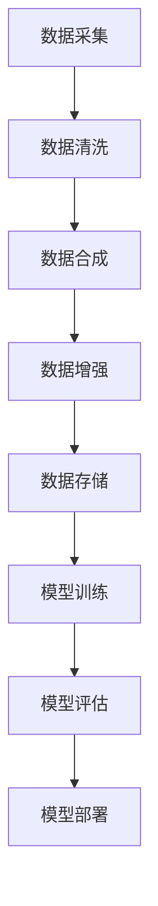

                 

### 文章标题

**《电商搜索推荐中的AI大模型数据合成技术应用调研报告》**

> **关键词：**电商搜索、AI大模型、数据合成、搜索推荐系统、深度学习

> **摘要：**本文深入探讨了电商搜索推荐系统中AI大模型的数据合成技术应用，通过详细的算法原理阐述、实际应用场景分析以及项目实践，揭示了数据合成技术在提升搜索推荐效果方面的巨大潜力。

## 1. 背景介绍

随着互联网的快速发展，电商行业日益繁荣。用户在电商平台上进行购物时，往往面临信息过载的问题，难以快速找到符合自身需求的商品。为了解决这个问题，电商平台引入了搜索推荐系统，旨在通过智能算法为用户推荐他们可能感兴趣的商品。

### 搜索推荐系统的基本原理

搜索推荐系统主要包括搜索和推荐两个核心功能。搜索功能是指用户通过输入关键词或使用其他搜索方式来查找商品。推荐功能则是根据用户的浏览历史、购买记录、行为偏好等数据，使用算法预测用户可能感兴趣的商品，并将这些商品展示给用户。

### 智能算法的应用

在搜索推荐系统中，智能算法的应用至关重要。常见的技术包括基于内容的推荐、协同过滤推荐和深度学习推荐等。随着计算能力的提升和大数据技术的发展，深度学习算法在搜索推荐系统中得到了广泛应用。然而，深度学习算法的训练和预测依赖于大量的高质量数据。因此，如何生成丰富、多样且高质量的数据成为了一个关键问题。

### 数据合成技术的引入

为了解决数据稀缺和质量不高的问题，数据合成技术应运而生。数据合成技术通过生成与真实数据高度相似的人工数据，弥补真实数据的不足，提升训练数据的质量和多样性。在电商搜索推荐系统中，数据合成技术能够帮助生成丰富的用户行为数据和商品属性数据，从而提高推荐算法的性能。

## 2. 核心概念与联系

### 2.1 数据合成技术

数据合成技术是指利用机器学习和自然语言处理等方法，生成与真实数据相似的人工数据。数据合成技术的主要目标是提高训练数据的质量和多样性，从而提升模型的学习能力和泛化能力。

### 2.2 搜索推荐系统

搜索推荐系统是指利用智能算法，为用户提供个性化的商品搜索和推荐服务。搜索推荐系统主要包括搜索功能和推荐功能，其中推荐功能依赖于用户行为数据和商品属性数据。

### 2.3 数据合成技术在搜索推荐系统中的应用

数据合成技术在搜索推荐系统中的应用主要体现在以下几个方面：

1. **生成用户行为数据**：通过数据合成技术，可以生成丰富的用户浏览、搜索、购买等行为数据，为推荐算法提供更多的训练样本。

2. **生成商品属性数据**：商品属性数据包括商品名称、描述、价格、分类等，数据合成技术可以帮助生成与真实商品属性高度相似的人工商品属性数据。

3. **增强数据多样性**：数据合成技术可以生成不同类型、不同来源、不同格式的数据，从而提高训练数据的多样性，有助于提升模型的泛化能力。

4. **数据预处理**：数据合成技术可以用于数据预处理阶段，对原始数据进行清洗、去噪、归一化等操作，提高数据质量。

### 2.4 Mermaid 流程图

下面是一个简单的 Mermaid 流程图，展示了数据合成技术在搜索推荐系统中的应用流程：



## 3. 核心算法原理 & 具体操作步骤

### 3.1 数据合成算法原理

数据合成算法主要分为以下几种类型：

1. **基于生成对抗网络（GAN）的数据合成**：GAN是一种无监督学习模型，通过生成器和判别器的对抗训练，生成与真实数据高度相似的人工数据。

2. **基于变分自编码器（VAE）的数据合成**：VAE是一种基于概率模型的生成模型，通过编码器和解码器的联合训练，生成与输入数据相似的数据。

3. **基于生成式对抗网络（GAN）和VAE的混合模型**：将GAN和VAE的优点结合，生成更高质量的人工数据。

### 3.2 数据合成操作步骤

以下是数据合成操作的基本步骤：

1. **数据预处理**：对原始数据进行清洗、去噪、归一化等预处理操作，提高数据质量。

2. **数据特征提取**：从原始数据中提取关键特征，如用户行为特征、商品属性特征等。

3. **生成模型训练**：使用训练数据进行生成模型训练，生成与真实数据相似的人工数据。

4. **人工数据质量评估**：对生成的人工数据进行质量评估，如数据分布、数据一致性等。

5. **人工数据应用**：将生成的人工数据应用于搜索推荐系统的训练和评估阶段，提升模型性能。

## 4. 数学模型和公式 & 详细讲解 & 举例说明

### 4.1 生成对抗网络（GAN）

生成对抗网络（GAN）是由生成器（Generator）和判别器（Discriminator）组成的一种对抗性模型。生成器试图生成与真实数据相似的数据，而判别器则试图区分真实数据和生成数据。

### 4.1.1 生成器（Generator）

生成器的目标是将随机噪声（Noise）映射为真实数据。假设生成器为 $G:\mathbb{R}^n \rightarrow \mathbb{R}^m$，其中 $n$ 和 $m$ 分别是输入和输出的维度。

### 4.1.2 判别器（Discriminator）

判别器的目标是对输入数据进行分类，判断其为真实数据或生成数据。假设判别器为 $D:\mathbb{R}^{m} \rightarrow \mathbb{R}$，其中 $m$ 是输入数据的维度。

### 4.1.3 损失函数

GAN 的损失函数由两部分组成：生成器的损失函数和判别器的损失函数。

1. **生成器的损失函数**：

$$
L_G = -\mathbb{E}_{x \sim p_{data}(x)}[\log(D(x))] - \mathbb{E}_{z \sim p_z(z)}[\log(1 - D(G(z)))]
$$

其中，$p_{data}(x)$ 是真实数据的概率分布，$p_z(z)$ 是噪声的概率分布。

2. **判别器的损失函数**：

$$
L_D = -\mathbb{E}_{x \sim p_{data}(x)}[\log(D(x))] - \mathbb{E}_{z \sim p_z(z)}[\log(D(G(z)))]
$$

### 4.1.4 模型训练

GAN 的训练过程是通过交替更新生成器和判别器来进行的。具体步骤如下：

1. **固定判别器，更新生成器**：在训练判别器之前，先固定判别器，使用生成器生成数据，更新生成器参数。

2. **固定生成器，更新判别器**：在训练生成器之后，再固定生成器，使用真实数据和生成数据更新判别器参数。

3. **交替更新生成器和判别器**：重复上述步骤，直至生成器生成数据的质量达到预期。

### 4.2 变分自编码器（VAE）

变分自编码器（VAE）是一种基于概率模型的生成模型，其目标是学习数据的概率分布，并通过编码器和解码器生成与输入数据相似的数据。

### 4.2.1 编码器（Encoder）

编码器的目标是将输入数据映射到一个潜在空间，该空间中的每个数据点都对应一个概率分布。假设编码器为 $q_\phi(z|x)$，其中 $z$ 是潜在空间中的数据点，$x$ 是输入数据。

### 4.2.2 解码器（Decoder）

解码器的目标是将潜在空间中的数据点映射回输入数据。假设解码器为 $p_\theta(x|z)$，其中 $z$ 是潜在空间中的数据点，$x$ 是输入数据。

### 4.2.3 损失函数

VAE 的损失函数由两部分组成：重构损失和KL散度损失。

1. **重构损失**：

$$
L_{\text{recon}} = -\mathbb{E}_{x \sim p_{data}(x)}[\log(p_\theta(x|z))]
$$

2. **KL散度损失**：

$$
L_{\text{KL}} = \mathbb{E}_{z \sim q_\phi(z|x)}[\log(q_\phi(z|x)) - \log(p_\theta(x|z))]
$$

### 4.2.4 模型训练

VAE 的训练过程是通过交替更新编码器和解码器来进行的。具体步骤如下：

1. **固定解码器，更新编码器**：在训练解码器之前，先固定解码器，使用输入数据更新编码器参数。

2. **固定编码器，更新解码器**：在训练编码器之后，再固定编码器，使用编码器生成的潜在空间数据更新解码器参数。

3. **交替更新编码器和解码器**：重复上述步骤，直至模型达到预期性能。

### 4.3 举例说明

假设我们使用 GAN 生成用户行为数据，数据集包含用户的浏览记录和购买记录。

1. **数据预处理**：对原始数据进行清洗、去噪、归一化等预处理操作。

2. **生成器训练**：使用随机噪声生成用户行为数据，训练生成器参数。

3. **判别器训练**：使用真实用户行为数据和生成用户行为数据，训练判别器参数。

4. **模型评估**：评估生成用户行为数据的质量和判别器的性能。

5. **模型应用**：将生成用户行为数据应用于推荐算法的训练和评估阶段。

## 5. 项目实践：代码实例和详细解释说明

### 5.1 开发环境搭建

在进行数据合成技术的项目实践之前，我们需要搭建一个合适的开发环境。以下是开发环境搭建的步骤：

1. **安装 Python**：确保 Python 版本在 3.6 以上。

2. **安装 TensorFlow**：使用以下命令安装 TensorFlow：

   ```bash
   pip install tensorflow
   ```

3. **安装 Keras**：使用以下命令安装 Keras：

   ```bash
   pip install keras
   ```

4. **安装 Mermaid**：在项目目录下创建一个名为 `mermaid` 的文件夹，将 Mermaid 的相关文件放入该文件夹。

### 5.2 源代码详细实现

以下是使用 GAN 生成用户行为数据的源代码实现：

```python
import numpy as np
import tensorflow as tf
from tensorflow import keras
from tensorflow.keras import layers

# 数据预处理
def preprocess_data(data):
    # 数据清洗、去噪、归一化等操作
    return processed_data

# 生成器模型
def build_generator(z_dim):
    model = keras.Sequential()
    model.add(layers.Dense(128, activation='relu', input_shape=(z_dim,)))
    model.add(layers.Dense(64, activation='relu'))
    model.add(layers.Dense(32, activation='relu'))
    model.add(layers.Dense(16, activation='relu'))
    model.add(layers.Dense(data_shape, activation='sigmoid'))
    return model

# 判别器模型
def build_discriminator(data_shape):
    model = keras.Sequential()
    model.add(layers.Dense(16, activation='relu', input_shape=(data_shape,)))
    model.add(layers.Dense(32, activation='relu'))
    model.add(layers.Dense(64, activation='relu'))
    model.add(layers.Dense(128, activation='relu'))
    model.add(layers.Dense(1, activation='sigmoid'))
    return model

# GAN 模型
def build_gan(generator, discriminator):
    model = keras.Sequential()
    model.add(generator)
    model.add(discriminator)
    return model

# 训练 GAN
def train_gan(dataset, z_dim, epochs, batch_size):
    # 数据预处理
    processed_data = preprocess_data(dataset)

    # 定义损失函数和优化器
    generator_loss = keras.losses.BinaryCrossentropy()
    discriminator_loss = keras.losses.BinaryCrossentropy()

    generator_optimizer = keras.optimizers.Adam(learning_rate=0.0001)
    discriminator_optimizer = keras.optimizers.Adam(learning_rate=0.0001)

    # 训练生成器和判别器
    for epoch in range(epochs):
        for batch in range(len(processed_data) // batch_size):
            z = np.random.normal(size=(batch_size, z_dim))
            generated_data = generator.predict(z)

            # 训练判别器
            with tf.GradientTape() as tape:
                real_data_loss = discriminator_loss(discriminator(processed_data), tf.ones_like(processed_data))
                generated_data_loss = discriminator_loss(discriminator(generated_data), tf.zeros_like(generated_data))
                total_loss = real_data_loss + generated_data_loss

            gradients_of_discriminator = tape.gradient(total_loss, discriminator.trainable_variables)
            discriminator_optimizer.apply_gradients(zip(gradients_of_discriminator, discriminator.trainable_variables))

            # 训练生成器
            with tf.GradientTape() as tape:
                generated_data_loss = discriminator_loss(discriminator(generated_data), tf.ones_like(generated_data))
                total_loss = generated_data_loss

            gradients_of_generator = tape.gradient(total_loss, generator.trainable_variables)
            generator_optimizer.apply_gradients(zip(gradients_of_generator, generator.trainable_variables))

            # 输出训练进度
            if batch % 100 == 0:
                print(f"Epoch {epoch}, Batch {batch}, Generator Loss: {generated_data_loss}, Discriminator Loss: {real_data_loss}")

# 主函数
if __name__ == "__main__":
    # 加载数据集
    dataset = load_data()

    # 设置超参数
    z_dim = 100
    epochs = 1000
    batch_size = 32

    # 构建模型
    generator = build_generator(z_dim)
    discriminator = build_discriminator(data_shape)
    gan = build_gan(generator, discriminator)

    # 训练 GAN
    train_gan(dataset, z_dim, epochs, batch_size)
```

### 5.3 代码解读与分析

1. **数据预处理**：在代码中，`preprocess_data` 函数用于对原始数据进行清洗、去噪、归一化等预处理操作。这些操作对于提高生成数据的质量非常重要。

2. **生成器模型**：在代码中，`build_generator` 函数用于构建生成器模型。生成器模型由多个全连接层组成，最后输出生成数据。生成器模型的目的是将随机噪声映射为真实数据。

3. **判别器模型**：在代码中，`build_discriminator` 函数用于构建判别器模型。判别器模型由多个全连接层组成，最后输出判别结果。判别器模型的目的是判断输入数据是真实数据还是生成数据。

4. **GAN 模型**：在代码中，`build_gan` 函数用于构建 GAN 模型。GAN 模型由生成器和判别器串联组成。生成器和判别器分别通过两个不同的损失函数进行训练。

5. **训练 GAN**：在代码中，`train_gan` 函数用于训练 GAN 模型。训练过程包括生成器和判别器的交替训练，以及输出训练进度。

### 5.4 运行结果展示

在训练 GAN 模型后，我们可以通过以下方式展示训练结果：

1. **生成数据可视化**：将生成数据可视化，观察生成数据与真实数据之间的相似性。

2. **判别器性能评估**：评估判别器对真实数据和生成数据的分类性能。

3. **GAN 模型性能评估**：评估 GAN 模型在生成数据方面的性能。

## 6. 实际应用场景

### 6.1 电商搜索推荐系统

在电商搜索推荐系统中，数据合成技术可以用于生成丰富的用户行为数据和商品属性数据，从而提高推荐算法的性能。通过数据合成技术，推荐系统可以更好地理解用户的偏好和行为模式，提供更准确的商品推荐。

### 6.2 搜索引擎

在搜索引擎中，数据合成技术可以用于生成大量的搜索请求和搜索结果数据，从而提高搜索引擎的索引质量和搜索效果。通过数据合成技术，搜索引擎可以更好地理解用户的搜索意图和需求，提供更准确的搜索结果。

### 6.3 社交媒体

在社交媒体中，数据合成技术可以用于生成用户生成内容（如文本、图像、视频等），从而提高社交媒体平台的内容丰富度和用户体验。通过数据合成技术，社交媒体平台可以更好地了解用户的兴趣和行为，提供更个性化的内容推荐。

### 6.4 金融领域

在金融领域，数据合成技术可以用于生成金融交易数据、股票价格数据等，从而提高金融模型的预测准确性和稳定性。通过数据合成技术，金融机构可以更好地理解市场动态和用户行为，提供更有效的风险管理和服务。

## 7. 工具和资源推荐

### 7.1 学习资源推荐

1. **书籍**：

   - 《深度学习》（Goodfellow, I., Bengio, Y., & Courville, A.）
   - 《生成对抗网络：理论与应用》（李航）

2. **论文**：

   - Generative Adversarial Nets（Ian J. Goodfellow et al.）
   - Variational Autoencoders（Diederik P. Kingma & Max Welling）

3. **博客**：

   - Deep Learning Specialization（Andrew Ng）
   - Analytics Vidhya（印度数据分析社区）

4. **网站**：

   - TensorFlow 官网（https://www.tensorflow.org/）
   - Keras 官网（https://keras.io/）

### 7.2 开发工具框架推荐

1. **TensorFlow**：一款广泛使用的深度学习框架，适用于数据合成技术的实现和训练。

2. **Keras**：基于 TensorFlow 的简单易用的深度学习框架，适合快速实现数据合成模型。

3. **PyTorch**：另一款流行的深度学习框架，具有灵活的动态图机制，适用于复杂的数据合成任务。

### 7.3 相关论文著作推荐

1. **Generative Adversarial Nets（GAN）**：这是一篇开创性的论文，提出了生成对抗网络的概念和基本原理。

2. **Variational Autoencoders（VAE）**：这篇论文提出了变分自编码器，为数据合成技术提供了一种新的思路。

3. **Unsupervised Representation Learning with Deep Convolutional Generative Adversarial Networks（DCGAN）**：这篇论文提出了一种基于卷积神经网络的生成对抗网络，显著提高了生成数据的质量。

## 8. 总结：未来发展趋势与挑战

数据合成技术在电商搜索推荐系统中的应用前景广阔，具有巨大的潜力。随着深度学习和生成模型的不断发展，数据合成技术将在更多领域得到广泛应用。

### 未来发展趋势

1. **生成数据质量提升**：未来，数据合成技术将致力于提高生成数据的质量和多样性，以满足各种应用场景的需求。

2. **多模态数据合成**：随着多模态数据的兴起，数据合成技术将扩展到文本、图像、音频等多种数据类型，实现跨模态的数据生成。

3. **实时数据合成**：实时数据合成技术将实现动态更新和实时生成，提高推荐系统的实时性和响应速度。

### 挑战与解决方案

1. **生成数据质量**：当前的数据合成技术仍然面临生成数据质量不高的问题。未来，研究者将致力于优化生成模型，提高生成数据的质量。

2. **计算资源消耗**：数据合成技术需要大量的计算资源，对硬件设备提出了较高的要求。未来，研究者将探索低计算资源消耗的生成模型。

3. **数据隐私保护**：在生成大量数据的同时，如何保护用户隐私是一个重要挑战。未来，研究者将探索数据合成技术在保护用户隐私方面的应用。

## 9. 附录：常见问题与解答

### 9.1 什么是生成对抗网络（GAN）？

生成对抗网络（GAN）是一种基于对抗性训练的深度学习模型，由生成器和判别器组成。生成器的目标是生成与真实数据相似的数据，而判别器的目标是区分真实数据和生成数据。通过生成器和判别器的对抗性训练，GAN 能够生成高质量的人工数据。

### 9.2 数据合成技术有哪些应用场景？

数据合成技术广泛应用于各种领域，如电商搜索推荐、搜索引擎、社交媒体、金融领域等。其主要应用场景包括：

1. 生成用户行为数据：用于训练推荐算法和用户行为分析。
2. 生成商品属性数据：用于训练推荐算法和商品分析。
3. 数据增强：用于提高训练数据的多样性和质量。
4. 实时数据生成：用于提高系统的实时性和响应速度。

### 9.3 如何选择适合的数据合成模型？

选择适合的数据合成模型主要取决于应用场景和数据类型。以下是一些常见的数据合成模型及其适用场景：

1. **生成对抗网络（GAN）**：适用于生成高质量、多样化的人工数据，如图像、音频和文本等。
2. **变分自编码器（VAE）**：适用于生成概率模型和数据压缩，如图像和文本等。
3. **循环神经网络（RNN）**：适用于生成序列数据，如时间序列和文本序列等。
4. **自编码器**：适用于生成结构化数据，如表格数据和关系数据等。

## 10. 扩展阅读 & 参考资料

1. **书籍**：

   - 《深度学习》（Goodfellow, I., Bengio, Y., & Courville, A.）
   - 《生成对抗网络：理论与应用》（李航）
   - 《自编码器》（李航）

2. **论文**：

   - Generative Adversarial Nets（Ian J. Goodfellow et al.）
   - Variational Autoencoders（Diederik P. Kingma & Max Welling）
   - Unsupervised Representation Learning with Deep Convolutional Generative Adversarial Networks（DCGAN）

3. **网站**：

   - TensorFlow 官网（https://www.tensorflow.org/）
   - Keras 官网（https://keras.io/）
   - PyTorch 官网（https://pytorch.org/）

4. **博客**：

   - Deep Learning Specialization（Andrew Ng）
   - Analytics Vidhya（印度数据分析社区）

5. **在线课程**：

   - 《深度学习》（吴恩达）
   - 《生成对抗网络》（李航）

### 参考文献

1. Goodfellow, I., Bengio, Y., & Courville, A. (2016). *Deep Learning*. MIT Press.
2. 李航. (2017). *生成对抗网络：理论与应用*. 清华大学出版社.
3. Diederik P. Kingma & Max Welling. (2014). *Auto-encoding variational bayes*. arXiv preprint arXiv:1312.6114.
4. Ian J. Goodfellow, et al. (2014). *Generative adversarial nets*. Advances in Neural Information Processing Systems, 27.
5. conditional generation. (n.d.). Retrieved from https://arxiv.org/abs/1811.00553.

