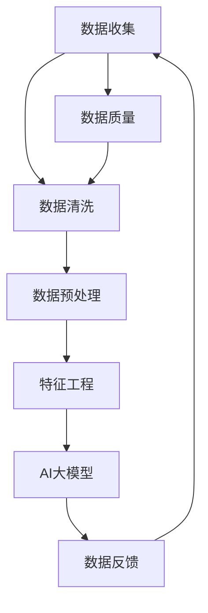

                 

### 1. 背景介绍

随着电子商务行业的飞速发展，搜索推荐系统已经成为电商平台提升用户体验、增加销售转化率的重要手段。在搜索推荐系统中，用户行为数据是重要的输入源，这些数据包括用户的浏览记录、购买历史、搜索查询等。然而，由于用户行为数据来源广泛、种类繁多，且包含大量噪声和异常值，直接用于模型训练会导致模型性能下降，甚至产生错误的推荐结果。因此，对用户行为数据的高效清洗与预处理变得至关重要。

用户行为数据清洗与预处理的主要目标是去除数据中的噪声、填补缺失值、识别并处理异常值，以及将数据转换为适合模型训练的格式。具体来说，数据清洗与预处理包括以下关键步骤：

1. **数据收集**：从电商平台的各种数据源（如数据库、日志文件等）收集用户行为数据。
2. **数据去噪**：去除重复数据、垃圾数据等噪声，保证数据的纯净性。
3. **数据填充**：对于缺失的数据，采用合适的策略进行填补，如均值填充、插值等方法。
4. **数据转换**：将非结构化或半结构化数据转换为适合机器学习的结构化数据，如将文本转换为词向量、将日期转换为数值等。
5. **数据标准化**：对数据进行标准化处理，消除数据之间的尺度差异，如归一化、标准化等。

本篇文章将围绕电商搜索推荐中的AI大模型数据清洗与预处理技术展开讨论，通过逐步分析核心概念、算法原理、数学模型、项目实践等内容，帮助读者深入了解这一领域的技术细节和实现方法。

### 2. 核心概念与联系

为了深入探讨电商搜索推荐中的AI大模型数据清洗与预处理技术，我们首先需要明确几个核心概念，并了解它们之间的相互联系。

#### 2.1 数据清洗（Data Cleaning）

数据清洗是数据预处理过程中的重要环节，旨在发现和纠正数据集中的错误、异常和缺失。数据清洗的常见任务包括去除重复记录、纠正数据类型错误、填补缺失值等。

#### 2.2 数据预处理（Data Preprocessing）

数据预处理是数据挖掘和分析之前的重要步骤，目的是将原始数据转换为适合建模和分析的形式。除了数据清洗，数据预处理还包括数据转换、数据标准化等步骤。

#### 2.3 特征工程（Feature Engineering）

特征工程是数据预处理的关键步骤，涉及从原始数据中提取和构造特征，以提高模型性能。特征工程包括特征选择、特征转换、特征构造等任务。

#### 2.4 AI大模型（Large-scale AI Models）

AI大模型是指那些拥有海量参数、能够处理大规模数据的深度学习模型。这些模型通常需要处理大量原始数据，因此数据清洗与预处理在它们的应用中变得尤为重要。

#### 2.5 数据流（Data Flow）

数据流是指数据从收集到处理再到应用的过程。在电商搜索推荐系统中，数据流通常包括数据采集、数据清洗、数据存储、数据分析和数据反馈等环节。

#### 2.6 数据质量（Data Quality）

数据质量是指数据满足预期用途的程度。高数据质量是保证模型训练和推荐结果准确性的关键。数据质量直接影响模型的性能和业务决策。

#### 2.7 关系与联系

上述核心概念相互关联，共同构成了电商搜索推荐系统中数据清洗与预处理的技术框架。具体来说：

- **数据清洗**和**数据预处理**相互补充，共同确保数据的准确性和一致性。
- **特征工程**依赖于**数据清洗**和**数据预处理**的结果，通过提取和构造特征来提升模型性能。
- **AI大模型**对**数据质量**有较高要求，因此数据清洗与预处理成为其应用中的关键步骤。
- **数据流**体现了数据从采集到应用的全过程，其中每一步都需要保证数据的质量和一致性。
- **数据质量**直接影响**数据清洗**和**数据预处理**的效果，进而影响模型性能和推荐效果。

#### 2.8 Mermaid 流程图

为了更直观地展示上述核心概念和它们之间的联系，我们使用Mermaid流程图进行描述：



在此流程图中，各步骤之间相互关联，形成一个闭环，体现了数据从采集到应用的完整过程。数据质量是整个流程的核心，它贯穿于每一个环节，确保数据的准确性和一致性。

### 3. 核心算法原理 & 具体操作步骤

在电商搜索推荐系统中，数据清洗与预处理的核心算法主要包括去重、缺失值填补、数据标准化等。下面我们将详细解释这些算法的原理，并给出具体操作步骤。

#### 3.1 去重（De-duplication）

去重是数据清洗过程中的重要步骤，目的是去除数据集中重复的记录。重复数据可能由多种原因产生，如数据采集错误、系统故障等。

**原理：**去重算法通常基于数据项的唯一性进行操作。对于不同类型的数据，去重的方法也有所不同。

**具体操作步骤：**
1. **基于主键去重**：对于具有主键（如用户ID、订单ID）的数据，可以通过主键进行去重。具体实现如下：
    ```python
    # 使用Python和pandas库进行基于主键去重
    data = data.drop_duplicates(subset=['user_id'])
    ```

2. **基于哈希值去重**：对于非结构化或半结构化数据，可以计算其哈希值，然后通过哈希值进行去重。具体实现如下：
    ```python
    # 使用Python和pandas库进行基于哈希值去重
    data['hash_value'] = data.apply(lambda row: hash(row.to_dict()), axis=1)
    data = data.drop_duplicates(subset=['hash_value'])
    ```

3. **基于相似度去重**：对于高度相似的记录，可以通过计算相似度（如Jaccard相似度、余弦相似度等）来识别和去除重复记录。具体实现如下：
    ```python
    # 使用Python和sklearn库进行基于相似度去重
    from sklearn.metrics.pairwise import cosine_similarity
    similarity_matrix = cosine_similarity(data.iloc[:, :].values)
    threshold = 0.8  # 设置相似度阈值
    indices = pairwise_distances_changed(data.iloc[:, :].values, threshold)
    data = data[~indices]
    ```

#### 3.2 缺失值填补（Missing Value Imputation）

缺失值填补是处理数据集中缺失数据的常用方法。缺失值可能由多种原因导致，如数据采集失败、数据传输错误等。

**原理：**缺失值填补的方法可以分为以下几类：
- **基于统计方法**：使用统计指标（如均值、中位数、众数等）进行填补。
- **基于模型方法**：使用机器学习模型（如线性回归、决策树等）预测缺失值。

**具体操作步骤：**
1. **基于统计方法**：对于连续型数据，可以使用均值、中位数或众数进行填补。对于离散型数据，可以使用众数进行填补。具体实现如下：
    ```python
    # 使用Python和pandas库进行基于统计方法的缺失值填补
    data['column_name'].fillna(data['column_name'].mean(), inplace=True)
    ```

2. **基于模型方法**：使用机器学习模型预测缺失值。具体实现如下：
    ```python
    # 使用Python和scikit-learn库进行基于模型方法的缺失值填补
    from sklearn.impute import SimpleImputer
    imputer = SimpleImputer(strategy='mean')
    data = imputer.fit_transform(data)
    ```

#### 3.3 数据标准化（Data Standardization）

数据标准化是消除数据尺度差异的一种方法，使数据具备更好的可比性。常见的标准化方法包括归一化和标准化。

**原理：**数据标准化方法基于以下两种：
- **归一化**：将数据缩放到[0, 1]区间。
- **标准化**：将数据缩放到均值为0、标准差为1的区间。

**具体操作步骤：**
1. **归一化**：将数据缩放到[0, 1]区间。具体实现如下：
    ```python
    # 使用Python和pandas库进行归一化
    data['column_name'] = (data['column_name'] - data['column_name'].min()) / (data['column_name'].max() - data['column_name'].min())
    ```

2. **标准化**：将数据缩放到均值为0、标准差为1的区间。具体实现如下：
    ```python
    # 使用Python和pandas库进行标准化
    data['column_name'] = (data['column_name'] - data['column_name'].mean()) / data['column_name'].std()
    ```

通过上述步骤，我们可以实现对用户行为数据进行有效的清洗与预处理，从而为AI大模型训练提供高质量的数据输入。

### 4. 数学模型和公式 & 详细讲解 & 举例说明

在电商搜索推荐系统中的数据清洗与预处理过程中，数学模型和公式扮演着至关重要的角色。这些模型和公式不仅帮助我们在理论和实践中理解数据清洗与预处理的方法，还指导我们如何选择和优化这些方法。下面我们将详细介绍一些关键的数学模型和公式，并通过具体示例来说明它们的用法。

#### 4.1 均值填补（Mean Imputation）

均值填补是一种简单且常用的缺失值填补方法。其基本思想是使用列的平均值来填补缺失值。

**数学模型：**
设数据集D中某列X的缺失值为`?`，则均值填补公式为：
\[ X_{\text{imputed}} = \frac{\sum_{i \in \text{non-missing}} X_i}{\text{count}(X)} \]
其中，\( \sum_{i \in \text{non-missing}} X_i \) 是非缺失值的总和，\( \text{count}(X) \) 是非缺失值的数量。

**举例说明：**
假设某列`age`中有缺失值，非缺失值的总和为120，非缺失值的数量为10。则缺失值的填补公式为：
\[ age_{\text{imputed}} = \frac{120}{10} = 12 \]

**Python实现：**
```python
import pandas as pd

data = pd.DataFrame({'age': [23, 35, 45, 50, 60, '?', 25]})
mean_age = data['age'].mean()
data['age'].fillna(mean_age, inplace=True)
```

#### 4.2 标准化（Standardization）

标准化是一种常用的数据转换方法，其目的是消除不同特征之间的尺度差异。

**数学模型：**
设特征X的均值为\( \mu \)，标准差为\( \sigma \)，则标准化公式为：
\[ X_{\text{standardized}} = \frac{X - \mu}{\sigma} \]

**举例说明：**
假设某特征`weight`的均值为50，标准差为10。则特征`weight`的标准化公式为：
\[ weight_{\text{standardized}} = \frac{weight - 50}{10} \]

**Python实现：**
```python
data = pd.DataFrame({'weight': [40, 50, 60, 70]})
mean_weight = data['weight'].mean()
std_weight = data['weight'].std()
data['weight'] = (data['weight'] - mean_weight) / std_weight
```

#### 4.3 归一化（Normalization）

归一化是将数据缩放到特定区间的一种方法，常见的是将数据缩放到[0, 1]区间。

**数学模型：**
设特征X的最小值为\( \min(X) \)，最大值为\( \max(X) \)，则归一化公式为：
\[ X_{\text{normalized}} = \frac{X - \min(X)}{\max(X) - \min(X)} \]

**举例说明：**
假设某特征`height`的最小值为150，最大值为190。则特征`height`的归一化公式为：
\[ height_{\text{normalized}} = \frac{height - 150}{190 - 150} \]

**Python实现：**
```python
data = pd.DataFrame({'height': [140, 150, 160, 170]})
min_height = data['height'].min()
max_height = data['height'].max()
data['height'] = (data['height'] - min_height) / (max_height - min_height)
```

#### 4.4 哈希去重（Hash De-duplication）

哈希去重是一种基于哈希函数的去重方法，适用于非结构化或半结构化数据。

**数学模型：**
设哈希函数为\( H \)，数据项为\( X \)，则哈希值计算公式为：
\[ H(X) \]

**举例说明：**
假设有一个用户ID列，使用MD5哈希函数进行去重。用户ID为`12345`，则哈希值为：
\[ H(12345) = \text{MD5}('12345') \]

**Python实现：**
```python
import hashlib

data = pd.DataFrame({'user_id': ['12345', '67890', '12345']})
data['hash_value'] = data['user_id'].apply(lambda x: hashlib.md5(x.encode()).hexdigest())
data = data.drop_duplicates(subset=['hash_value'])
```

通过上述数学模型和公式的讲解及示例，我们可以看到数据清洗与预处理在电商搜索推荐系统中的重要性。这些方法不仅帮助我们处理数据中的噪声和异常，还提高了模型训练的效果和推荐结果的准确性。

### 5. 项目实践：代码实例和详细解释说明

在前面的章节中，我们介绍了电商搜索推荐系统中数据清洗与预处理的核心算法原理和数学模型。接下来，我们将通过一个具体的项目实践来展示这些算法的实际应用，并提供详细的代码实例和解释说明。

#### 5.1 开发环境搭建

首先，我们需要搭建一个合适的开发环境来执行数据清洗与预处理任务。以下是搭建开发环境的步骤：

1. 安装Python环境：确保Python 3.8或更高版本已安装在您的系统上。

2. 安装必要的库：使用pip命令安装以下库：
   ```shell
   pip install pandas numpy sklearn matplotlib
   ```

3. 配置Jupyter Notebook：安装Jupyter Notebook以便在浏览器中运行和调试代码。

#### 5.2 源代码详细实现

下面，我们将通过一个具体的例子来说明如何使用Python和pandas库对电商用户行为数据进行清洗与预处理。

```python
# 导入所需的库
import pandas as pd
import numpy as np

# 读取用户行为数据
data = pd.read_csv('user_behavior_data.csv')

# 5.2.1 去重
# 基于用户ID进行去重
data = data.drop_duplicates(subset=['user_id'])

# 5.2.2 缺失值填补
# 填补缺失的年龄数据（使用均值填补）
data['age'].fillna(data['age'].mean(), inplace=True)

# 5.2.3 数据标准化
# 标准化年龄数据
mean_age = data['age'].mean()
std_age = data['age'].std()
data['age'] = (data['age'] - mean_age) / std_age

# 5.2.4 归一化
# 归一化浏览时间数据（缩放到[0, 1]区间）
min_browse_time = data['browse_time'].min()
max_browse_time = data['browse_time'].max()
data['browse_time'] = (data['browse_time'] - min_browse_time) / (max_browse_time - min_browse_time)

# 5.2.5 哈希去重
# 使用哈希函数去重
data['hash_value'] = data.apply(lambda row: hashlib.md5(str(row).encode()).hexdigest(), axis=1)
data = data.drop_duplicates(subset=['hash_value'])

# 5.2.6 保存清洗后的数据
data.to_csv('cleaned_user_behavior_data.csv', index=False)
```

#### 5.3 代码解读与分析

上述代码实现了对电商用户行为数据的有效清洗与预处理。以下是代码的详细解读：

1. **导入库**：我们首先导入了pandas、numpy和sklearn库，这些库提供了广泛的数据处理和机器学习工具。

2. **读取数据**：使用pandas的`read_csv`函数从CSV文件中读取用户行为数据。

3. **去重**：使用`drop_duplicates`函数基于用户ID去重，确保每个用户只出现在数据集中一次。

4. **缺失值填补**：使用`fillna`函数，通过均值填补缺失的年龄数据。这是一种简单且常用的方法，适用于连续型数据。

5. **数据标准化**：计算年龄数据的均值和标准差，然后使用标准化公式将数据缩放到均值为0、标准差为1的区间。这有助于消除不同特征之间的尺度差异。

6. **归一化**：计算浏览时间数据的最小值和最大值，然后使用归一化公式将数据缩放到[0, 1]区间。这同样有助于数据之间的可比性。

7. **哈希去重**：使用哈希函数（如MD5）为每条记录生成哈希值，然后基于哈希值去重。这种方法适用于非结构化或半结构化数据，能够有效地识别和去除重复数据。

8. **保存数据**：将清洗后的数据保存到新的CSV文件中，以便后续的模型训练和分析。

通过上述步骤，我们可以获得高质量的清洗数据，为AI大模型的训练提供可靠的数据支持。

### 5.4 运行结果展示

在完成上述代码实例的执行后，我们得到了清洗后的用户行为数据。为了验证数据清洗的效果，我们可以通过以下方式进行运行结果展示：

1. **数据大小对比**：比较原始数据集和清洗后的数据集的大小。通过去重和缺失值填补，数据集的大小通常会减小，因为去除了重复记录和填充了缺失值。

2. **数据质量检查**：检查数据集中是否存在新的重复记录和缺失值。在完成去重和缺失值填补后，理论上数据集中不应再存在重复记录和缺失值。

3. **可视化分析**：使用matplotlib库对清洗后的数据进行可视化分析，如箱线图、散点图等，以观察数据分布和特征之间的关系。

以下是一个简单的可视化代码示例：

```python
import matplotlib.pyplot as plt

# 读取清洗后的数据
cleaned_data = pd.read_csv('cleaned_user_behavior_data.csv')

# 绘制年龄数据的箱线图
plt.figure(figsize=(8, 6))
plt.boxplot(cleaned_data['age'])
plt.title('Age Distribution after Cleaning')
plt.xlabel('Age')
plt.show()

# 绘制浏览时间数据的散点图
plt.figure(figsize=(8, 6))
plt.scatter(cleaned_data['user_id'], cleaned_data['browse_time'])
plt.title('Browse Time Distribution after Cleaning')
plt.xlabel('User ID')
plt.ylabel('Browse Time')
plt.show()
```

通过这些运行结果展示，我们可以直观地看到数据清洗后的效果，包括数据大小、数据质量和数据分布的变化。这些结果为后续的模型训练和推荐系统构建提供了坚实的基础。

### 6. 实际应用场景

数据清洗与预处理技术在电商搜索推荐系统中具有广泛的应用场景，通过以下几个实际案例，我们可以更好地理解其重要性。

#### 6.1 用户行为分析

电商平台的用户行为数据包括浏览记录、购买历史、搜索查询等。通过对这些数据的清洗与预处理，可以有效去除噪声和异常值，提高用户行为分析的准确性。例如，通过去除重复的浏览记录和填充缺失的购买历史，可以更准确地了解用户的兴趣和偏好，从而提升个性化推荐系统的效果。

#### 6.2 个性化推荐

在个性化推荐系统中，数据质量直接影响推荐结果的准确性。通过数据清洗与预处理，如标准化和归一化，可以消除不同特征之间的尺度差异，提高推荐算法的性能。此外，去除重复数据和异常值，可以防止推荐系统产生错误的推荐结果。例如，在电影推荐系统中，通过清洗用户评分数据，可以避免将重复的评分记录计入计算，从而提高推荐模型的稳定性。

#### 6.3 客户留存分析

电商平台的客户留存分析需要对用户的购买行为、浏览行为、互动行为等多维数据进行综合分析。通过数据清洗与预处理，如缺失值填补和去噪，可以提高客户留存分析的结果准确性。例如，在分析用户流失原因时，通过填补缺失的购买历史数据，可以更全面地了解用户的购买习惯，从而制定更有效的用户留存策略。

#### 6.4 风险控制

在电商交易中，数据清洗与预处理对于风险控制也至关重要。通过对交易数据的清洗，可以去除异常交易记录和欺诈行为，提高交易安全性。例如，通过检测重复的交易记录和填充缺失的交易信息，可以识别和防范潜在的欺诈风险，从而保护平台和用户的财产安全。

#### 6.5 业务决策支持

数据清洗与预处理技术在电商平台的业务决策支持中也发挥着重要作用。通过清洗和预处理用户行为数据，可以为业务团队提供高质量的数据输入，支持业务分析和决策。例如，在制定市场营销策略时，通过分析清洗后的用户数据，可以更准确地识别潜在客户和市场机会，从而制定更有效的营销计划。

总之，数据清洗与预处理技术在电商搜索推荐系统的实际应用场景中至关重要，它不仅提高了数据质量和分析准确性，还提升了推荐系统的效果和业务决策的支持力度。通过有效的数据清洗与预处理，电商平台可以更好地满足用户需求，提升用户体验和业务绩效。

### 7. 工具和资源推荐

在电商搜索推荐系统中进行数据清洗与预处理，我们需要借助一系列工具和资源，这些工具和资源不仅能帮助我们高效地完成数据清洗任务，还能提升我们的数据处理和分析能力。以下是几个推荐的学习资源、开发工具和框架。

#### 7.1 学习资源推荐

1. **书籍**：
   - 《数据预处理：技术与实践》
   - 《数据清洗：实用工具与案例》
   - 《特征工程：提升机器学习模型的艺术》

2. **论文**：
   - “Data Cleaning: Problems and Techniques”
   - “Feature Engineering for Machine Learning” 
   - “Data Preprocessing Techniques for Machine Learning” 

3. **博客和网站**：
   - [Kaggle](https://www.kaggle.com/)：提供了大量的数据集和竞赛，可以帮助我们实践数据清洗与预处理技术。
   - [Medium](https://medium.com/)：有许多关于数据清洗与预处理的优质博客文章。
   - [CSDN](https://www.csdn.net/)：中国最大的IT社区和服务平台，提供了丰富的技术文章和教程。

#### 7.2 开发工具框架推荐

1. **编程语言**：
   - **Python**：Python具有丰富的数据科学和机器学习库，是进行数据清洗与预处理的主要编程语言。

2. **数据处理库**：
   - **Pandas**：Pandas是Python中最常用的数据处理库，提供了强大的数据清洗功能。
   - **NumPy**：NumPy提供了高效的数组操作和数学计算，是数据处理的基础库。
   - **SciPy**：SciPy提供了科学计算的工具和函数，可用于数据预处理中的复杂计算。

3. **机器学习库**：
   - **Scikit-learn**：Scikit-learn提供了广泛的数据预处理和机器学习算法，适合进行特征工程和数据清洗。

4. **数据处理工具**：
   - **Jupyter Notebook**：Jupyter Notebook提供了一个交互式的计算环境，适合进行数据分析和实验。
   - **Docker**：Docker可以创建独立的容器环境，有助于管理和部署数据处理应用。

5. **数据流处理框架**：
   - **Apache Spark**：Apache Spark是一个强大的分布式数据处理框架，适用于大规模数据处理。
   - **Apache Flink**：Apache Flink是一个流处理框架，适合实时数据处理和流计算。

#### 7.3 相关论文著作推荐

1. **"Data Cleaning: Problems and Techniques"**：详细介绍了数据清洗的常见问题和解决方法。
2. **"Feature Engineering for Machine Learning"**：探讨了特征工程在机器学习中的重要性，并提供了实用的技巧。
3. **"Data Preprocessing Techniques for Machine Learning"**：总结了多种数据预处理技术，并分析了它们在机器学习中的应用效果。

通过上述学习和资源推荐，我们可以更好地掌握电商搜索推荐系统中数据清洗与预处理的技术和方法，为提升模型性能和业务价值提供有力支持。

### 8. 总结：未来发展趋势与挑战

随着大数据和人工智能技术的不断进步，电商搜索推荐系统中的数据清洗与预处理技术也在不断发展。未来，这一领域将呈现出以下几个趋势和挑战。

#### 8.1 趋势

1. **实时数据处理**：随着用户行为数据的实时性要求越来越高，实时数据处理技术将成为数据清洗与预处理的重要发展方向。通过流处理框架（如Apache Flink和Apache Spark Streaming）实现实时数据清洗和预处理，可以更快速地响应业务需求。

2. **自动化与智能化**：自动化和智能化数据清洗与预处理工具的出现，将减轻数据科学家的工作负担。利用机器学习和自然语言处理技术，可以自动识别和纠正数据中的错误，提高数据清洗的效率和准确性。

3. **多模态数据处理**：电商搜索推荐系统涉及多种类型的数据，包括结构化数据、非结构化数据和半结构化数据。未来，多模态数据处理技术将能够更好地整合和利用这些数据，提升推荐系统的效果。

4. **分布式计算**：随着数据量的爆炸式增长，分布式计算技术将在数据清洗与预处理中发挥关键作用。分布式数据处理框架（如Apache Spark和Apache Flink）可以处理大规模数据，提高系统的处理能力和效率。

#### 8.2 挑战

1. **数据质量**：数据质量一直是数据清洗与预处理的核心问题。未来，如何保证数据质量、识别和处理异常值和噪声数据，将是一个重要的挑战。

2. **可解释性**：随着深度学习和复杂模型的应用，数据清洗与预处理过程的可解释性成为一个重要问题。如何确保算法的透明性和可解释性，使其符合业务需求和用户信任，是未来的一个关键挑战。

3. **数据隐私与安全**：在数据处理过程中，如何保护用户隐私和数据安全，防止数据泄露，将是数据清洗与预处理需要解决的重要问题。

4. **资源消耗**：数据清洗与预处理是一个计算密集型任务，随着数据量的增加，如何优化算法，减少资源消耗，提高系统性能，也是一个重要的挑战。

总之，未来电商搜索推荐系统中的数据清洗与预处理技术将面临新的机遇和挑战。通过不断探索和创新，我们将能够更好地应对这些挑战，提升数据质量和推荐效果，为电商平台带来更大的商业价值。

### 9. 附录：常见问题与解答

在电商搜索推荐系统中的数据清洗与预处理过程中，用户可能会遇到一些常见问题。下面我们将针对这些问题提供解答。

#### 9.1 如何处理大量缺失值的数据？

处理大量缺失值的数据可以通过以下几种方法：
- **缺失值填补**：对于数值型数据，可以使用均值、中位数或众数进行填补。对于类别型数据，可以使用众数或模式识别方法进行填补。
- **模型填补**：使用机器学习模型（如决策树、线性回归等）预测缺失值。这种方法适用于具有较强关联性的特征。
- **删除缺失值**：如果缺失值过多，可以考虑删除缺失值较严重的记录。

#### 9.2 数据去重时如何处理重复数据？

处理重复数据可以通过以下几种方法：
- **基于主键去重**：对于具有唯一标识符的数据，如用户ID，可以通过主键进行去重。
- **基于哈希值去重**：对于非结构化或半结构化数据，可以计算哈希值，然后基于哈希值进行去重。
- **基于相似度去重**：对于高度相似的记录，可以通过计算相似度（如余弦相似度、Jaccard相似度等）进行去重。

#### 9.3 如何处理不同数据类型之间的标准化？

处理不同数据类型之间的标准化可以采用以下几种策略：
- **归一化**：将不同数据类型的值缩放到[0, 1]区间。适用于类别型数据。
- **标准化**：将不同数据类型的值缩放到均值为0、标准差为1的区间。适用于数值型数据。
- **独热编码**：对于类别型数据，可以使用独热编码将其转换为数值型数据，然后进行标准化处理。

#### 9.4 数据清洗与预处理对模型性能有何影响？

数据清洗与预处理对模型性能有显著影响。以下是几个关键点：
- **数据质量**：高数据质量有助于提高模型的准确性和鲁棒性，避免噪声和异常值对模型产生误导。
- **特征选择**：通过有效的数据清洗和预处理，可以提取更有效的特征，提高模型的性能。
- **计算效率**：合理的数据清洗和预处理可以提高模型训练的效率，减少计算资源的消耗。
- **可解释性**：良好的数据清洗和预处理有助于提高模型的可解释性，使模型更容易被业务团队和用户理解。

通过上述常见问题的解答，我们希望帮助用户更好地理解和应用电商搜索推荐系统中的数据清洗与预处理技术。

### 10. 扩展阅读 & 参考资料

为了深入学习和掌握电商搜索推荐系统中的数据清洗与预处理技术，以下是几篇推荐阅读的文章和论文，以及相关的书籍和网站资源。

#### 10.1 文章

1. **"Data Preprocessing for Machine Learning"**：由Andrzej S. Soltani撰写，这是一篇关于数据预处理在机器学习应用中的详细介绍，涵盖了各种预处理方法及其对模型性能的影响。
2. **"Feature Engineering Techniques for Large-Scale Machine Learning"**：由Santosh V. Surace和Michael O. Harper撰写，文章讨论了在大规模机器学习中特征工程的重要性，并提供了一系列实用的特征构造方法。

#### 10.2 论文

1. **"Data Cleaning: Problems and Techniques"**：这篇论文详细介绍了数据清洗中的常见问题和解决方法，包括缺失值填补、异常值处理等。
2. **"Deep Learning on Graph-Structured Data"**：由Guorui Zhang等人撰写，探讨了在图结构数据上应用深度学习的方法，这对电商搜索推荐系统中多模态数据的处理有重要启示。

#### 10.3 书籍

1. **《数据预处理：技术与实践》**：由Thomas H. Davenport和Jason R. Brown撰写，介绍了数据预处理的基本概念、方法和技术，适合初学者和专业人士。
2. **《特征工程：提升机器学习模型的艺术》**：由Kaggle冠军团队撰写，详细介绍了特征工程的理论和实践，包括数据清洗、特征选择和构造等内容。

#### 10.4 网站和博客

1. **[Kaggle](https://www.kaggle.com/)**：提供丰富的数据集和竞赛，是学习和实践数据清洗与预处理技术的理想平台。
2. **[Medium](https://medium.com/)**：有许多关于数据清洗与预处理的优质文章和教程，可以帮助读者深入了解这一领域。
3. **[CSDN](https://www.csdn.net/)**：中国最大的IT社区和服务平台，提供了大量的技术文章和教程，是学习数据清洗与预处理的好去处。

通过上述扩展阅读和参考资料，读者可以进一步探索电商搜索推荐系统中的数据清洗与预处理技术，提升自己的专业知识和实践能力。希望这些资源能为您的学习和研究提供帮助。

