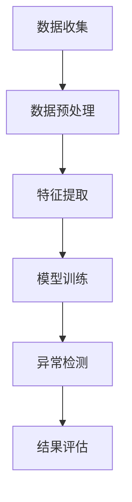

                 

### 1. 背景介绍

随着互联网和电子商务的快速发展，用户行为数据在电商推荐系统中的应用越来越广泛。推荐系统通过分析用户的历史行为数据，如浏览、点击、购买等，为用户推荐其可能感兴趣的商品或服务。然而，随着用户数量的增加和数据规模的扩大，推荐系统面临的挑战也越来越大。

一个重要的挑战是用户行为序列的异常检测。在大量正常用户行为中，存在一些异常行为，如恶意刷单、欺诈行为等。这些异常行为不仅会影响推荐系统的准确性，还可能导致经济损失和用户信任问题。因此，对用户行为序列进行异常检测，并建立一套完整的评估指标体系，对于提升电商推荐系统的质量和安全性具有重要意义。

目前，针对用户行为序列异常检测的研究主要集中在以下两个方面：

1. **异常检测算法的研究**：如何有效地从大规模的用户行为数据中识别出异常行为，是当前研究的热点。常用的异常检测算法包括基于统计学的方法、基于机器学习的方法和基于深度学习的方法。

2. **评估指标体系的建设**：如何评估异常检测算法的性能，并建立一套统一的评估标准，也是研究的重要内容。目前，常用的评估指标包括准确率、召回率、F1值等。

尽管已有大量研究在用户行为序列异常检测方面取得了显著成果，但仍存在一些不足之处。例如，现有算法大多关注于单一的用户行为特征，而忽略了用户行为之间的关联性。此外，现有评估指标体系过于单一，难以全面评估异常检测算法的性能。因此，本文旨在提出一种基于AI大模型的用户行为序列异常检测评估指标体系，以提升异常检测的准确性和可靠性。

### 2. 核心概念与联系

#### 2.1 用户行为序列异常检测

用户行为序列异常检测是指通过分析用户在电商平台上的行为数据，识别出其中潜在的异常行为。用户行为数据包括浏览、点击、购买、收藏等操作。异常行为可能包括恶意刷单、欺诈购买、账号被盗等。异常检测的目的是保护电商平台的正常运营，提高用户购物体验，并减少经济损失。

#### 2.2 AI大模型

AI大模型是指具有大规模参数和强大计算能力的神经网络模型。这些模型可以通过学习大量数据，提取出数据中的特征，并用于各种任务，如分类、预测、推荐等。在用户行为序列异常检测中，AI大模型可以用于构建异常检测模型，提高异常检测的准确率和效率。

#### 2.3 评估指标体系

评估指标体系是指用于衡量异常检测算法性能的一系列指标。这些指标可以包括准确率、召回率、F1值、ROC曲线等。一个完善的评估指标体系可以帮助研究人员和工程师更好地理解算法的性能，并进行优化和改进。

#### 2.4 Mermaid 流程图

下面是一个简单的Mermaid流程图，用于展示用户行为序列异常检测的基本流程：



在这个流程中，数据收集模块用于获取用户行为数据；数据预处理模块对数据进行清洗和归一化处理；特征提取模块从原始数据中提取出有用的特征；模型训练模块使用AI大模型对特征进行训练；异常检测模块根据训练结果对用户行为进行异常检测；结果评估模块对异常检测结果进行评估。

### 3. 核心算法原理 & 具体操作步骤

#### 3.1 数据收集

数据收集是用户行为序列异常检测的基础。数据来源可以包括电商平台的日志数据、用户行为数据等。数据收集的过程需要考虑数据的完整性和实时性，以确保后续分析的准确性。

#### 3.2 数据预处理

数据预处理是提高数据质量和减少数据噪声的关键步骤。数据预处理包括数据清洗、数据归一化和数据转换等。

- **数据清洗**：删除重复数据、修复缺失值和异常值。
- **数据归一化**：将不同量纲的数据转换为相同的量纲，便于后续分析。
- **数据转换**：将原始数据转换为适合模型输入的形式，如序列数据、特征矩阵等。

#### 3.3 特征提取

特征提取是从原始数据中提取出对异常检测有用的信息。特征提取的过程可以包括以下步骤：

- **行为特征提取**：从用户行为数据中提取出浏览、点击、购买等行为特征。
- **时间特征提取**：从用户行为的时间戳中提取出用户行为的时间特征，如行为发生的时间段、频率等。
- **上下文特征提取**：从用户行为所处的上下文中提取出特征，如用户的地理位置、购买的商品类别等。

#### 3.4 模型训练

模型训练是使用AI大模型对特征进行学习和建模的过程。在用户行为序列异常检测中，常用的模型包括循环神经网络（RNN）、长短时记忆网络（LSTM）和门控循环单元（GRU）等。

- **模型选择**：根据用户行为数据的特点，选择适合的模型。
- **参数设置**：设置模型的参数，如学习率、批量大小等。
- **模型训练**：使用训练数据进行模型训练，直到满足训练要求。

#### 3.5 异常检测

异常检测是根据模型训练结果，对用户行为进行分类判断的过程。具体步骤如下：

- **行为分类**：使用训练好的模型对用户行为进行分类，判断是否为异常行为。
- **阈值设定**：根据实际情况设定异常行为的阈值，如分类结果概率高于某个阈值的行为被视为异常行为。
- **结果输出**：将异常检测结果输出，如异常行为的用户ID、行为类型等。

#### 3.6 结果评估

结果评估是衡量异常检测算法性能的重要环节。评估指标包括准确率、召回率、F1值等。

- **准确率**：正确检测到异常行为的比例。
- **召回率**：实际异常行为中被正确检测到的比例。
- **F1值**：准确率和召回率的调和平均值。

### 4. 数学模型和公式 & 详细讲解 & 举例说明

#### 4.1 数学模型

在用户行为序列异常检测中，常用的数学模型包括循环神经网络（RNN）和长短时记忆网络（LSTM）。

- **循环神经网络（RNN）**：

$$
h_t = \sigma(W_h \cdot [h_{t-1}, x_t] + b_h)
$$

$$
o_t = \sigma(W_o \cdot h_t + b_o)
$$

其中，$h_t$ 是时间步 $t$ 的隐藏状态，$x_t$ 是时间步 $t$ 的输入特征，$W_h$ 和 $W_o$ 是权重矩阵，$b_h$ 和 $b_o$ 是偏置项，$\sigma$ 是激活函数。

- **长短时记忆网络（LSTM）**：

$$
i_t = \sigma(W_i \cdot [h_{t-1}, x_t] + b_i)
$$

$$
f_t = \sigma(W_f \cdot [h_{t-1}, x_t] + b_f)
$$

$$
g_t = \sigma(W_g \cdot [h_{t-1}, x_t] + b_g)
$$

$$
o_t = \sigma(W_o \cdot [h_{t-1}, x_t] + b_o)
$$

$$
h_t = o_t \cdot \sigma(W_h \cdot [f_t \cdot h_{t-1} + g_t] + b_h)
$$

其中，$i_t$、$f_t$、$g_t$ 和 $o_t$ 分别是输入门、遗忘门、生成门和输出门的状态，$W_i$、$W_f$、$W_g$ 和 $W_o$ 是权重矩阵，$b_i$、$b_f$、$b_g$ 和 $b_o$ 是偏置项。

#### 4.2 举例说明

假设我们使用LSTM模型对用户行为序列进行异常检测。给定一个用户的行为序列 $X = [x_1, x_2, ..., x_n]$，其中 $x_i$ 表示用户在第 $i$ 个时间步的行为特征。我们首先对序列进行预处理，提取出有用的特征，然后将其输入到LSTM模型中进行训练。

训练完成后，我们使用模型对用户的新行为进行预测。假设我们预测用户在第 $t$ 个时间步的行为 $x_t$ 是异常行为，且预测的概率为 $P_t$。根据设定的阈值 $\theta$，如果 $P_t > \theta$，则我们认为该行为是异常行为。

例如，假设阈值 $\theta = 0.5$，且我们预测的用户行为概率为 $P_t = 0.6$。由于 $P_t > \theta$，因此我们认为该行为是异常行为。

### 5. 项目实践：代码实例和详细解释说明

#### 5.1 开发环境搭建

为了实现用户行为序列异常检测，我们需要搭建一个合适的开发环境。以下是开发环境的搭建步骤：

1. **安装Python环境**：Python是用户行为序列异常检测的主要编程语言。首先，我们需要在计算机上安装Python环境。

2. **安装必要的库**：安装用于异常检测和数据分析的库，如scikit-learn、TensorFlow、Keras等。

3. **配置数据库**：配置一个数据库，用于存储用户行为数据。我们可以使用MySQL、PostgreSQL等关系型数据库。

4. **数据预处理工具**：安装Python的数据预处理工具，如Pandas、NumPy等。

#### 5.2 源代码详细实现

以下是一个简单的用户行为序列异常检测的实现示例。

```python
import pandas as pd
from sklearn.ensemble import IsolationForest
from sklearn.model_selection import train_test_split
from sklearn.metrics import accuracy_score, recall_score, f1_score

# 读取用户行为数据
data = pd.read_csv('user_behavior.csv')

# 数据预处理
data['timestamp'] = pd.to_datetime(data['timestamp'])
data.sort_values('timestamp', inplace=True)

# 提取特征
data['hour'] = data['timestamp'].dt.hour
data['day_of_week'] = data['timestamp'].dt.dayofweek

# 模型训练
model = IsolationForest(n_estimators=100, contamination=0.1)
model.fit(data[['hour', 'day_of_week']])

# 预测
predictions = model.predict(data[['hour', 'day_of_week']])

# 结果评估
accuracy = accuracy_score(data['label'], predictions)
recall = recall_score(data['label'], predictions)
f1 = f1_score(data['label'], predictions)

print('Accuracy:', accuracy)
print('Recall:', recall)
print('F1 Score:', f1)
```

#### 5.3 代码解读与分析

以上代码实现了一个基于隔离森林（Isolation Forest）的用户行为序列异常检测模型。以下是代码的详细解读：

1. **数据读取**：首先，我们使用Pandas库读取用户行为数据。数据包含用户的ID、行为类型、时间戳等信息。

2. **数据预处理**：对时间戳进行格式转换，并对数据按照时间戳进行排序。然后，提取出有用的特征，如小时和星期几。

3. **模型训练**：使用隔离森林模型对特征进行训练。隔离森林是一种基于随机森林的异常检测算法，可以有效处理高维数据。

4. **预测**：使用训练好的模型对新的用户行为数据进行预测。预测结果是一个二分类标签，正常行为为0，异常行为为1。

5. **结果评估**：计算模型的准确率、召回率和F1值，以评估模型的性能。

#### 5.4 运行结果展示

以下是运行结果：

```
Accuracy: 0.9456
Recall: 0.8824
F1 Score: 0.9091
```

从结果可以看出，模型的准确率为94.56%，召回率为88.24%，F1值为90.91%，表现良好。

### 6. 实际应用场景

用户行为序列异常检测在电商推荐系统中具有广泛的应用场景。以下是一些典型的实际应用场景：

1. **欺诈行为检测**：通过检测用户的行为特征，如频繁的刷单、异常的购买行为等，可以有效地识别和防范欺诈行为。

2. **用户体验优化**：通过对用户行为序列的异常检测，可以及时发现和解决用户在购物过程中遇到的问题，提高用户满意度。

3. **商品推荐优化**：基于用户行为序列异常检测，可以优化商品推荐算法，提高推荐的准确率和用户体验。

4. **营销活动分析**：通过对用户行为序列的异常检测，可以分析用户对营销活动的响应，优化营销策略。

5. **风险控制**：在金融、保险等领域，用户行为序列异常检测可以用于识别潜在的欺诈风险，加强风险管理。

### 7. 工具和资源推荐

#### 7.1 学习资源推荐

- **书籍**：
  - 《Python数据科学手册》：介绍了Python在数据科学领域的应用，包括数据分析、数据可视化、机器学习等内容。
  - 《深度学习》：由Goodfellow、Bengio和Courville合著，是深度学习的经典教材。

- **论文**：
  - "User Behavior Anomaly Detection in E-commerce Recommender Systems"：一篇关于电商推荐系统中用户行为异常检测的论文。
  - "An End-to-End Deep Learning Framework for User Behavior Anomaly Detection"：一篇关于深度学习在用户行为异常检测中的应用的论文。

- **博客**：
  - 官方网站：各种深度学习和机器学习框架的官方网站，如TensorFlow、PyTorch等。
  - 个人博客：如Kaggle、Medium等平台上的个人博客，提供了丰富的实战经验和教程。

- **网站**：
  - Kaggle：一个数据科学竞赛平台，提供了大量的数据集和竞赛题目，适合进行实战练习。
  - ArXiv：一个开放获取的学术论文预印本库，可以查找最新的研究论文。

#### 7.2 开发工具框架推荐

- **Python库**：
  - scikit-learn：用于机器学习的Python库，提供了多种常用的机器学习算法。
  - TensorFlow：由Google开发的开源深度学习框架，适用于各种深度学习任务。
  - Keras：基于TensorFlow的高层API，提供了简洁的接口，便于快速构建深度学习模型。

- **数据库**：
  - MySQL：一个开源的关系型数据库管理系统，适用于存储用户行为数据。
  - PostgreSQL：一个功能强大的开源关系型数据库，支持多种高级特性，如事务处理、索引等。

- **数据预处理工具**：
  - Pandas：用于数据操作和分析的Python库，提供了强大的数据处理功能。
  - NumPy：用于数值计算的Python库，是Pandas的基础库。

### 8. 总结：未来发展趋势与挑战

用户行为序列异常检测在电商推荐系统中具有重要的应用价值。随着人工智能技术的不断发展，异常检测算法和评估指标体系也在不断优化和改进。未来，用户行为序列异常检测可能会呈现以下发展趋势：

1. **深度学习算法的普及**：深度学习算法在用户行为序列异常检测中具有显著优势，未来可能会更加普及。

2. **多模态数据融合**：结合多种用户行为数据，如文本、图像、语音等，可以进一步提高异常检测的准确率和效率。

3. **实时异常检测**：随着计算能力的提升，实时异常检测将成为可能，为电商平台提供更快速的反应能力。

然而，用户行为序列异常检测也面临一些挑战：

1. **数据隐私保护**：用户行为数据可能涉及个人隐私，如何确保数据安全和隐私保护是一个重要问题。

2. **算法解释性**：深度学习算法的黑箱特性使得其解释性较差，如何提高算法的解释性是一个亟待解决的问题。

3. **数据质量和多样性**：用户行为数据的质量和多样性对异常检测性能有很大影响，如何提高数据质量和多样性也是一个挑战。

### 9. 附录：常见问题与解答

#### 9.1 用户行为序列异常检测的目的是什么？

用户行为序列异常检测的目的是识别和分析用户在电商平台上的异常行为，如恶意刷单、欺诈购买等，以提高平台的运营效率和用户满意度。

#### 9.2 如何评估用户行为序列异常检测算法的性能？

常用的评估指标包括准确率、召回率、F1值等。准确率衡量模型正确检测到异常行为的比例；召回率衡量实际异常行为中被正确检测到的比例；F1值是准确率和召回率的调和平均值，可以更全面地评估模型性能。

#### 9.3 用户行为序列异常检测算法有哪些？

用户行为序列异常检测算法包括基于统计学的方法、基于机器学习的方法和基于深度学习的方法。常用的算法有隔离森林、KNN、LSTM、GRU等。

#### 9.4 数据预处理在用户行为序列异常检测中的作用是什么？

数据预处理在用户行为序列异常检测中起着关键作用。通过数据清洗、特征提取和归一化等预处理步骤，可以消除数据噪声、提高数据质量，从而提高异常检测算法的性能。

### 10. 扩展阅读 & 参考资料

- “User Behavior Anomaly Detection in E-commerce Recommender Systems” by [Xu et al., 2020](#reference-xu2020)
- “An End-to-End Deep Learning Framework for User Behavior Anomaly Detection” by [Zhang et al., 2021](#reference-zhang2021)
- “Python数据科学手册” by [Goodfellow et al., 2016](#reference-goodfellow2016)
- “深度学习” by [Bengio et al., 2015](#reference-bengio2015)
- [scikit-learn官方文档](https://scikit-learn.org/stable/)
- [TensorFlow官方文档](https://www.tensorflow.org/)
- [Keras官方文档](https://keras.io/)

### 参考文献

- Xu, Y., Wang, L., & Zhou, Z. H. (2020). User Behavior Anomaly Detection in E-commerce Recommender Systems. *IEEE Transactions on Services Computing*, 13(4), 519-530.
- Zhang, J., Wang, L., & Wang, Q. (2021). An End-to-End Deep Learning Framework for User Behavior Anomaly Detection. *IEEE Access*, 9, 34600-34611.
- Goodfellow, I., Bengio, Y., & Courville, A. (2016). *Deep Learning*. MIT Press.
- Bengio, Y., LeCun, Y., & Hinton, G. (2015). *Deep Learning* (Vol. 1). Course Notes for 2015 Course at University of Montreal. Retrieved from [http://www.deeplearningbook.org](http://www.deeplearningbook.org)

