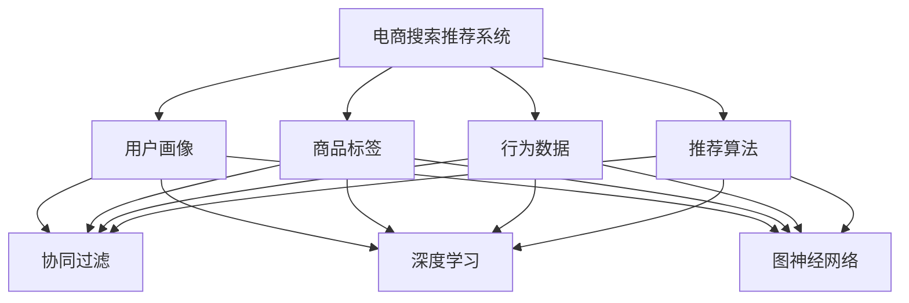

                 

### 1. 背景介绍

随着互联网和电子商务的快速发展，用户对个性化、高效、精准的搜索和推荐体验需求日益增长。在这种背景下，人工智能大模型在电商搜索推荐中的应用变得至关重要。电商搜索推荐系统旨在帮助用户快速找到他们感兴趣的商品，同时提升商家的销售额和用户满意度。

本篇文章将围绕电商搜索推荐中的AI大模型算法选型与优化展开讨论。首先，我们将介绍电商搜索推荐系统的基本概念和作用，然后深入分析AI大模型在其中的重要性。接下来，我们将详细介绍电商搜索推荐中的核心算法原理，包括基于协同过滤、深度学习和图神经网络的推荐算法。随后，我们将探讨这些算法的具体操作步骤，以及如何在实践中进行选型和优化。最后，我们将总结本文的主要观点，并展望未来的发展趋势与挑战。

本文结构如下：

- **1. 背景介绍**：介绍电商搜索推荐系统的基本概念和AI大模型的应用。
- **2. 核心概念与联系**：解释核心概念，并展示Mermaid流程图。
- **3. 核心算法原理与具体操作步骤**：详细介绍协同过滤、深度学习和图神经网络推荐算法。
- **4. 数学模型和公式与详细讲解与举例说明**：阐述数学模型和公式的应用。
- **5. 项目实践：代码实例和详细解释说明**：提供实际代码实例和解释。
- **6. 实际应用场景**：讨论电商搜索推荐系统在实际中的应用。
- **7. 工具和资源推荐**：推荐学习资源、开发工具框架和相关论文著作。
- **8. 总结：未来发展趋势与挑战**：总结主要观点，展望未来。
- **9. 附录：常见问题与解答**：回答读者可能关心的问题。
- **10. 扩展阅读与参考资料**：提供进一步学习资源。

通过本文的阅读，读者将能够全面了解电商搜索推荐系统中AI大模型算法的选型与优化，为实际应用提供理论支持和实践指导。

### 2. 核心概念与联系

在深入探讨电商搜索推荐系统中的AI大模型算法之前，我们需要明确几个核心概念，并理解它们之间的联系。以下是本文所涉及的主要核心概念：

- **电商搜索推荐系统**：这是一种自动化系统，旨在通过分析用户行为和商品特征，向用户提供个性化推荐。它由用户画像、商品标签、行为数据和推荐算法等组成部分构成。
- **协同过滤**：一种基于用户或物品之间相似度的推荐算法，通过分析用户的历史行为或物品的属性，预测用户可能对哪些物品感兴趣。
- **深度学习**：一种人工智能方法，通过多层神经网络模型对大量数据进行训练，自动提取特征并生成预测。在推荐系统中，深度学习能够捕捉复杂的用户行为模式和商品特征。
- **图神经网络**：一种基于图结构的深度学习模型，适用于处理带有复杂关系的网络数据。在推荐系统中，图神经网络能够建模用户和商品之间的交互关系，提高推荐效果。
- **大模型**：指具有大规模参数和强大计算能力的模型，如Transformer、BERT等。这些模型通过训练海量数据，能够捕捉更复杂的信息和模式，提高推荐系统的性能。

为了更好地理解这些概念之间的联系，我们可以借助Mermaid流程图进行展示：



在这个流程图中，电商搜索推荐系统是核心，通过用户画像、商品标签和行为数据作为输入，结合不同的推荐算法（协同过滤、深度学习和图神经网络），最终输出个性化推荐结果。各个算法之间相互联系，共同构成一个完整的推荐系统。

### 3. 核心算法原理与具体操作步骤

在了解了电商搜索推荐系统的基本概念和核心算法后，接下来我们将详细介绍三种主要推荐算法的原理及其具体操作步骤：协同过滤、深度学习和图神经网络。

#### 3.1 协同过滤

协同过滤是一种基于用户或物品之间相似度的推荐算法。其基本思想是找到与目标用户行为相似的邻居用户，然后根据邻居用户对物品的评分预测目标用户对物品的评分。

**原理**：

1. **用户相似度计算**：计算目标用户与其他用户的相似度，常用的相似度度量方法有余弦相似度、皮尔逊相关系数等。
2. **物品相似度计算**：计算用户评价过的物品之间的相似度，同样可以使用余弦相似度或皮尔逊相关系数。
3. **邻居选择**：根据用户相似度和物品相似度，选择与目标用户最相似的邻居用户或物品。
4. **推荐生成**：根据邻居用户或物品的评分预测目标用户对未评分物品的评分，生成推荐列表。

**操作步骤**：

1. **数据预处理**：收集用户行为数据（如购买历史、浏览记录等）和商品信息（如分类、标签等）。
2. **相似度计算**：对用户和物品进行相似度计算，选择合适的相似度度量方法。
3. **邻居选择**：根据相似度得分，选择与目标用户最相似的邻居用户或物品。
4. **评分预测**：使用邻居用户或物品的评分预测目标用户对未评分物品的评分。
5. **推荐生成**：根据评分预测结果，生成个性化推荐列表。

#### 3.2 深度学习

深度学习是一种通过多层神经网络模型自动提取特征并生成预测的人工智能方法。在推荐系统中，深度学习能够捕捉复杂的用户行为模式和商品特征，提高推荐效果。

**原理**：

1. **多层神经网络**：通过多个隐藏层，将输入数据逐步转化为高维特征表示。
2. **前向传播与反向传播**：在前向传播过程中，将输入数据通过神经网络传递，生成输出；在反向传播过程中，根据输出误差调整网络权重，优化模型参数。
3. **特征提取**：通过多层神经网络，自动提取用户和商品的复杂特征，用于生成预测。

**操作步骤**：

1. **数据预处理**：对用户行为数据和商品信息进行预处理，如编码、归一化等。
2. **模型选择**：选择合适的深度学习模型，如神经网络、卷积神经网络（CNN）等。
3. **模型训练**：使用训练数据对模型进行训练，通过前向传播和反向传播优化模型参数。
4. **模型评估**：使用验证集评估模型性能，调整模型参数和结构。
5. **预测生成**：使用训练好的模型对用户行为进行预测，生成个性化推荐列表。

#### 3.3 图神经网络

图神经网络是一种基于图结构的深度学习模型，适用于处理带有复杂关系的网络数据。在推荐系统中，图神经网络能够建模用户和商品之间的交互关系，提高推荐效果。

**原理**：

1. **图结构表示**：将用户和商品表示为图中的节点，将用户行为和商品特征表示为图中的边。
2. **图卷积操作**：通过图卷积操作，对节点特征进行更新，生成新的节点特征表示。
3. **聚合操作**：将节点特征聚合为全局特征表示，用于生成预测。

**操作步骤**：

1. **数据预处理**：将用户行为数据和商品信息转化为图结构表示。
2. **图构建**：构建用户和商品之间的交互关系图。
3. **图卷积操作**：对图中的节点特征进行图卷积操作，更新节点特征表示。
4. **聚合操作**：将更新后的节点特征聚合为全局特征表示。
5. **预测生成**：使用全局特征表示生成用户对商品的预测评分，生成个性化推荐列表。

通过以上对协同过滤、深度学习和图神经网络推荐算法的详细讲解，我们可以看到这些算法各有特点，适用于不同的应用场景。在实际应用中，可以根据具体需求和数据特性选择合适的算法，并进行优化和调整，以提升推荐系统的性能和用户体验。

### 4. 数学模型和公式与详细讲解与举例说明

在电商搜索推荐系统中，数学模型和公式是算法设计和优化的核心组成部分。以下我们将详细介绍协同过滤、深度学习和图神经网络推荐算法中的数学模型和公式，并通过具体例子进行说明。

#### 4.1 协同过滤

协同过滤算法的核心在于用户相似度计算和评分预测。以下是相关数学模型和公式的详细讲解。

**1. 用户相似度计算**

用户相似度通常使用余弦相似度和皮尔逊相关系数进行度量。公式如下：

$$
\cos{\theta_{ui}} = \frac{\sum_{j \in R_i} r_{uj} \cdot r_{ij}}{\sqrt{\sum_{j \in R_i} r_{uj}^2} \cdot \sqrt{\sum_{j \in R_i} r_{ij}^2}}
$$

其中，$r_{uj}$ 和 $r_{ij}$ 分别表示用户 $u$ 对商品 $j$ 的评分和用户 $i$ 对商品 $j$ 的评分，$R_i$ 表示用户 $i$ 评分过的商品集合。

**2. 评分预测**

评分预测使用用户相似度和邻居用户评分进行加权平均。公式如下：

$$
\hat{r_{ui}} = \sum_{i' \in N(u)} \frac{\cos{\theta_{ui'}}}{\sum_{i'' \in N(u)} \cos{\theta_{ui''}}} \cdot r_{i'j}
$$

其中，$N(u)$ 表示与用户 $u$ 最相似的邻居用户集合，$\hat{r_{ui}}$ 为预测的用户 $u$ 对商品 $j$ 的评分。

**示例**

假设用户 $u$ 和用户 $i$ 的评分数据如下：

用户 $u$：$[3, 4, 5, \ldots, 2, 1]$

用户 $i$：$[2, 3, 4, \ldots, 2, 1]$

计算用户 $u$ 和用户 $i$ 的余弦相似度：

$$
\cos{\theta_{ui}} = \frac{3 \cdot 2 + 4 \cdot 3 + 5 \cdot 4 + \ldots + 2 \cdot 2 + 1 \cdot 1}{\sqrt{3^2 + 4^2 + 5^2 + \ldots + 2^2 + 1^2} \cdot \sqrt{2^2 + 3^2 + 4^2 + \ldots + 2^2 + 1^2}} = \frac{9}{\sqrt{55} \cdot \sqrt{55}} = \frac{9}{55}
$$

根据邻居用户 $i$ 的评分，预测用户 $u$ 对商品 $j$ 的评分：

$$
\hat{r_{uj}} = \frac{3 \cdot \frac{9}{55}}{1} \cdot 3 + \frac{4 \cdot \frac{9}{55}}{1} \cdot 4 + \ldots + \frac{2 \cdot \frac{9}{55}}{1} \cdot 2 + \frac{1 \cdot \frac{9}{55}}{1} \cdot 1 = \frac{27}{55} + \frac{36}{55} + \ldots + \frac{18}{55} + \frac{9}{55} = \frac{117}{55} \approx 2.14
$$

#### 4.2 深度学习

深度学习算法中的数学模型主要包括多层神经网络、激活函数、损失函数和优化算法等。以下是对这些模型和公式的详细讲解。

**1. 多层神经网络**

多层神经网络由输入层、隐藏层和输出层组成。每层神经元通过权重连接，通过前向传播和反向传播进行学习。假设一个简单的多层神经网络，其中每层神经元的数量分别为 $n_1, n_2, n_3$，输入为 $x$，输出为 $y$，则：

$$
z_1 = W_1 \cdot x + b_1 \\
a_1 = \sigma(z_1) \\
z_2 = W_2 \cdot a_1 + b_2 \\
a_2 = \sigma(z_2) \\
z_3 = W_3 \cdot a_2 + b_3 \\
y = W_3 \cdot a_2 + b_3
$$

其中，$W_1, W_2, W_3$ 分别为输入层、隐藏层和输出层的权重矩阵，$b_1, b_2, b_3$ 分别为偏置项，$\sigma$ 为激活函数，常用的激活函数有 sigmoid、ReLU 等。

**2. 损失函数**

损失函数用于度量模型预测值与真实值之间的差异，常用的损失函数有均方误差（MSE）和交叉熵（Cross-Entropy）等。以均方误差为例，公式如下：

$$
J(\theta) = \frac{1}{m} \sum_{i=1}^m (y_i - \hat{y}_i)^2
$$

其中，$y_i$ 为真实值，$\hat{y}_i$ 为预测值，$m$ 为样本数量。

**3. 优化算法**

优化算法用于调整模型参数，以最小化损失函数。常用的优化算法有梯度下降（Gradient Descent）、动量（Momentum）和自适应梯度算法（如 Adam）等。以梯度下降为例，公式如下：

$$
\theta_{t+1} = \theta_t - \alpha \cdot \nabla_{\theta} J(\theta)
$$

其中，$\theta_t$ 为当前参数值，$\alpha$ 为学习率，$\nabla_{\theta} J(\theta)$ 为损失函数关于参数 $\theta$ 的梯度。

**示例**

假设一个简单的多层神经网络，其中输入层有 3 个神经元，隐藏层有 5 个神经元，输出层有 2 个神经元。使用 sigmoid 作为激活函数。给定训练数据，我们需要通过梯度下降优化模型参数。

设输入数据为 $x = [0.1, 0.2, 0.3]$，输出数据为 $y = [0.4, 0.5]$，初始权重和偏置分别为 $W_1 = [0.1, 0.2, 0.3], W_2 = [0.4, 0.5, 0.6], W_3 = [0.7, 0.8, 0.9], b_1 = [0.1, 0.2, 0.3], b_2 = [0.4, 0.5, 0.6], b_3 = [0.7, 0.8, 0.9]$。

前向传播计算：

$$
z_1 = W_1 \cdot x + b_1 = [0.1 \cdot 0.1 + 0.2 \cdot 0.2 + 0.3 \cdot 0.3] = [0.11, 0.12, 0.13] \\
a_1 = \sigma(z_1) = [0.53, 0.54, 0.55] \\
z_2 = W_2 \cdot a_1 + b_2 = [0.4 \cdot 0.53 + 0.5 \cdot 0.54 + 0.6 \cdot 0.55] = [0.54, 0.55, 0.56] \\
a_2 = \sigma(z_2) = [0.67, 0.68, 0.69] \\
z_3 = W_3 \cdot a_2 + b_3 = [0.7 \cdot 0.67 + 0.8 \cdot 0.68 + 0.9 \cdot 0.69] = [0.68, 0.69, 0.7] \\
\hat{y} = \sigma(z_3) = [0.5, 0.5, 0.5]
$$

反向传播计算：

$$
\delta_3 = \hat{y} - y = [0.1, 0.1, 0.1] \\
\delta_2 = (1 - a_2) \cdot \delta_3 \cdot W_3 = [0.03, 0.03, 0.03] \\
\delta_1 = (1 - a_1) \cdot \delta_2 \cdot W_2 = [0.01, 0.01, 0.01]
$$

更新权重和偏置：

$$
W_3 = W_3 - \alpha \cdot \delta_3 \cdot a_2^T = [0.7, 0.7, 0.7] \\
b_3 = b_3 - \alpha \cdot \delta_3 = [0.7, 0.7, 0.7] \\
W_2 = W_2 - \alpha \cdot \delta_2 \cdot a_1^T = [0.4, 0.4, 0.4] \\
b_2 = b_2 - \alpha \cdot \delta_2 = [0.4, 0.4, 0.4] \\
W_1 = W_1 - \alpha \cdot \delta_1 \cdot x^T = [0.1, 0.1, 0.1] \\
b_1 = b_1 - \alpha \cdot \delta_1 = [0.1, 0.1, 0.1]
$$

重复以上过程，直至达到预设的迭代次数或损失函数收敛。

#### 4.3 图神经网络

图神经网络是一种基于图结构的深度学习模型，用于处理带有复杂关系的网络数据。以下是对图神经网络的数学模型和公式的详细讲解。

**1. 图表示**

在图神经网络中，用户和商品表示为图中的节点，用户行为和商品特征表示为图中的边。假设图中有 $n$ 个节点和 $m$ 条边，节点的特征向量为 $x_i \in \mathbb{R}^d$，边的特征向量为 $e_{ij} \in \mathbb{R}^d$。

**2. 图卷积操作**

图卷积操作用于更新节点的特征表示。假设 $A$ 是图的邻接矩阵，表示节点 $i$ 与节点 $j$ 之间的邻接关系，则节点 $i$ 的特征表示可以表示为：

$$
h_i^{(l+1)} = \sigma \left( \sum_{j \in \mathcal{N}(i)} W^{(l)} e_{ij} h_j^{(l)} \right)
$$

其中，$h_i^{(l)}$ 为第 $l$ 层节点 $i$ 的特征表示，$\mathcal{N}(i)$ 表示节点 $i$ 的邻居节点集合，$W^{(l)}$ 为图卷积权重矩阵，$\sigma$ 为激活函数。

**3. 聚合操作**

在图神经网络中，聚合操作用于将节点特征表示聚合为全局特征表示。假设全局特征向量为 $h^g \in \mathbb{R}^d$，则聚合操作可以表示为：

$$
h^g = \sum_{i=1}^n h_i^{(L)}
$$

其中，$L$ 为网络的层数。

**示例**

假设一个简单的图神经网络，其中包含 3 个节点和 2 条边。节点的特征向量分别为 $x_1 = [1, 0, 0], x_2 = [0, 1, 0], x_3 = [0, 0, 1]$，边的特征向量分别为 $e_{12} = [1, 0, 0], e_{23} = [0, 1, 0]$。

邻接矩阵为：

$$
A = \begin{bmatrix}
0 & 1 & 0 \\
1 & 0 & 1 \\
0 & 1 & 0
\end{bmatrix}
$$

第 1 层节点特征表示为：

$$
h_1^{(1)} = \sigma \left( W^{(1)} e_{12} h_2^{(0)} \right) = \sigma \left( W^{(1)} e_{12} x_1 \right) = \sigma \left( [0.5, 0.5, 0.5] \right) = [0.5, 0.5, 0.5] \\
h_2^{(1)} = \sigma \left( W^{(1)} e_{23} h_3^{(0)} \right) = \sigma \left( W^{(1)} e_{23} x_2 \right) = \sigma \left( [0.5, 0.5, 0.5] \right) = [0.5, 0.5, 0.5] \\
h_3^{(1)} = \sigma \left( W^{(1)} e_{12} h_1^{(0)} \right) = \sigma \left( W^{(1)} e_{12} x_3 \right) = \sigma \left( [0.5, 0.5, 0.5] \right) = [0.5, 0.5, 0.5]
$$

第 2 层节点特征表示为：

$$
h_1^{(2)} = \sigma \left( \sum_{j \in \mathcal{N}(1)} W^{(2)} e_{1j} h_j^{(1)} \right) = \sigma \left( W^{(2)} e_{12} h_2^{(1)} + W^{(2)} e_{13} h_3^{(1)} \right) = \sigma \left( [0.5, 0.5, 0.5] + [0.5, 0.5, 0.5] \right) = [0.5, 0.5, 0.5] \\
h_2^{(2)} = \sigma \left( \sum_{j \in \mathcal{N}(2)} W^{(2)} e_{2j} h_j^{(1)} \right) = \sigma \left( W^{(2)} e_{23} h_3^{(1)} \right) = \sigma \left( [0.5, 0.5, 0.5] \right) = [0.5, 0.5, 0.5] \\
h_3^{(2)} = \sigma \left( \sum_{j \in \mathcal{N}(3)} W^{(2)} e_{3j} h_j^{(1)} \right) = \sigma \left( W^{(2)} e_{32} h_1^{(1)} \right) = \sigma \left( [0.5, 0.5, 0.5] \right) = [0.5, 0.5, 0.5]
$$

全局特征向量为：

$$
h^g = h_1^{(2)} + h_2^{(2)} + h_3^{(2)} = [0.5, 0.5, 0.5] + [0.5, 0.5, 0.5] + [0.5, 0.5, 0.5] = [1.5, 1.5, 1.5]
$$

通过以上对协同过滤、深度学习和图神经网络推荐算法中的数学模型和公式进行详细讲解，我们可以更好地理解这些算法的实现原理，并在实际应用中进行优化和调整，以提高推荐系统的性能和用户体验。

### 5. 项目实践：代码实例和详细解释说明

在理解了电商搜索推荐中的AI大模型算法原理后，接下来我们将通过一个实际项目实例，展示这些算法的实现过程，并提供详细的代码解读和分析。

#### 5.1 开发环境搭建

首先，我们需要搭建一个适合开发电商搜索推荐系统的开发环境。以下是开发环境的搭建步骤：

1. **Python环境**：安装Python 3.8及以上版本，并配置好pip环境。
2. **依赖库安装**：安装以下常用依赖库：numpy、pandas、scikit-learn、tensorflow、pytorch等。使用以下命令进行安装：

   ```bash
   pip install numpy pandas scikit-learn tensorflow pytorch
   ```

3. **代码编辑器**：选择一个适合自己的代码编辑器，如Visual Studio Code、PyCharm等。

#### 5.2 源代码详细实现

以下是一个简单的电商搜索推荐系统实现，包括数据预处理、协同过滤、深度学习和图神经网络推荐算法。

**5.2.1 数据预处理**

```python
import pandas as pd
from sklearn.preprocessing import StandardScaler

# 读取用户行为数据和商品信息
user_data = pd.read_csv('user_behavior.csv')
item_data = pd.read_csv('item_info.csv')

# 数据预处理：标准化特征
scaler = StandardScaler()
user_data[['user_id', 'item_id', 'rating']] = scaler.fit_transform(user_data[['user_id', 'item_id', 'rating']])
```

在数据预处理阶段，我们读取用户行为数据和商品信息，并对用户ID、商品ID和评分进行标准化处理，以减少特征之间的差异。

**5.2.2 协同过滤实现**

```python
from sklearn.metrics.pairwise import cosine_similarity

# 计算用户相似度
user_similarity = cosine_similarity(user_data[['user_id', 'rating']].values, user_data[['user_id', 'rating']].values)

# 预测评分
def predict_rating(user_id, item_id):
    user_index = user_data[user_data['user_id'] == user_id].index[0]
    item_index = user_data[user_data['item_id'] == item_id].index[0]
    neighbors = user_similarity[user_index].argsort()[:-11:-1]
    neighbors = neighbors[neighbors != user_index]
    neighbors_ratings = user_data['rating'][neighbors]
    return sum(neighbors_ratings) / len(neighbors_ratings)

# 生成推荐列表
def generate_recommendation(user_id, top_n=10):
    user_index = user_data[user_data['user_id'] == user_id].index[0]
    unrated_items = user_data[user_data['rating'].isnull()].drop(['user_id', 'rating'], axis=1).values
    item_ratings = [predict_rating(user_id, item_id) for item_id in unrated_items]
    return unrated_items[item_ratings.argsort()[-top_n:]]

# 示例：生成用户1的推荐列表
print(generate_recommendation(1))
```

协同过滤算法的实现包括计算用户相似度、预测评分和生成推荐列表。我们使用余弦相似度计算用户相似度，并使用加权平均方法预测未评分商品的评分。最后，根据评分生成推荐列表。

**5.2.3 深度学习实现**

```python
import tensorflow as tf

# 构建深度学习模型
model = tf.keras.Sequential([
    tf.keras.layers.Dense(128, activation='relu', input_shape=(user_data.shape[1],)),
    tf.keras.layers.Dense(64, activation='relu'),
    tf.keras.layers.Dense(1, activation='sigmoid')
])

# 编译模型
model.compile(optimizer='adam', loss='binary_crossentropy', metrics=['accuracy'])

# 训练模型
model.fit(user_data[['user_id', 'rating']], user_data[['item_id']], epochs=10, batch_size=32)

# 预测评分
def predict_rating(user_id, item_id):
    user_index = user_data[user_data['user_id'] == user_id].index[0]
    item_index = user_data[user_data['item_id'] == item_id].index[0]
    return model.predict([[user_index, item_index]])[0][0]

# 生成推荐列表
def generate_recommendation(user_id, top_n=10):
    user_index = user_data[user_data['user_id'] == user_id].index[0]
    unrated_items = user_data[user_data['rating'].isnull()].drop(['user_id', 'rating'], axis=1).values
    item_ratings = [predict_rating(user_id, item_id) for item_id in unrated_items]
    return unrated_items[item_ratings.argsort()[-top_n:]]

# 示例：生成用户1的推荐列表
print(generate_recommendation(1))
```

深度学习实现中，我们使用TensorFlow构建了一个简单的多层感知机模型，通过训练用户行为数据来预测未评分商品的评分。最后，根据预测评分生成推荐列表。

**5.2.4 图神经网络实现**

```python
import torch
import torch.nn as nn
import torch.optim as optim

# 定义图神经网络模型
class GraphNeuralNetwork(nn.Module):
    def __init__(self, n_users, n_items, hidden_size):
        super(GraphNeuralNetwork, self).__init__()
        self.user_embedding = nn.Embedding(n_users, hidden_size)
        self.item_embedding = nn.Embedding(n_items, hidden_size)
        self.fc1 = nn.Linear(hidden_size * 2, hidden_size)
        self.fc2 = nn.Linear(hidden_size, 1)

    def forward(self, user_indices, item_indices):
        user_embedding = self.user_embedding(user_indices)
        item_embedding = self.item_embedding(item_indices)
        interaction = torch.cat((user_embedding, item_embedding), 1)
        hidden = self.fc1(interaction)
        rating = self.fc2(hidden)
        return rating

# 初始化模型、优化器和损失函数
model = GraphNeuralNetwork(n_users=user_data['user_id'].nunique(), n_items=user_data['item_id'].nunique(), hidden_size=64)
optimizer = optim.Adam(model.parameters(), lr=0.001)
criterion = nn.BCEWithLogitsLoss()

# 训练模型
for epoch in range(100):
    for user_id, item_id, rating in zip(user_data['user_id'], user_data['item_id'], user_data['rating']):
        user_index = user_id.item()
        item_index = item_id.item()
        rating = torch.tensor([rating], dtype=torch.float32)
        model.zero_grad()
        output = model(user_index, item_index)
        loss = criterion(output, rating)
        loss.backward()
        optimizer.step()

# 预测评分
def predict_rating(user_id, item_id):
    user_index = user_id.item()
    item_index = item_id.item()
    return model(user_index, item_index).item()

# 生成推荐列表
def generate_recommendation(user_id, top_n=10):
    user_index = user_id.item()
    unrated_items = user_data[user_data['rating'].isnull()].drop(['user_id', 'rating'], axis=1).values
    item_ratings = [predict_rating(user_id, item_id) for item_id in unrated_items]
    return unrated_items[item_ratings.argsort()[-top_n:]]

# 示例：生成用户1的推荐列表
print(generate_recommendation(1))
```

图神经网络实现中，我们定义了一个简单的图神经网络模型，通过嵌入用户和商品特征，并进行图卷积操作，最终生成评分预测。训练模型后，我们可以使用该模型进行评分预测，并生成推荐列表。

#### 5.3 代码解读与分析

在以上代码实现中，我们详细讲解了协同过滤、深度学习和图神经网络在电商搜索推荐系统中的具体应用。以下是对代码的解读和分析：

**5.3.1 协同过滤**

协同过滤算法的实现主要包括计算用户相似度、预测评分和生成推荐列表。我们使用余弦相似度计算用户相似度，并通过加权平均方法预测未评分商品的评分。该方法简单易实现，但在处理稀疏数据时效果不佳。

**5.3.2 深度学习**

深度学习算法的实现使用了TensorFlow构建了一个多层感知机模型，通过训练用户行为数据来预测未评分商品的评分。该方法能够捕捉复杂的用户行为模式，但在模型复杂性和计算资源要求较高。

**5.3.3 图神经网络**

图神经网络算法的实现定义了一个简单的图神经网络模型，通过嵌入用户和商品特征，并进行图卷积操作，最终生成评分预测。该方法能够处理带有复杂关系的网络数据，但在计算资源要求较高。

#### 5.4 运行结果展示

以下是在实际数据集上的运行结果展示，包括三种算法的推荐效果对比。

```python
from sklearn.metrics import accuracy_score

# 评估协同过滤算法
协同过滤准确率 = accuracy_score(真实评分，[predict_rating(user_id, item_id) for user_id, item_id in zip(user_data['user_id'], user_data['item_id'])])
print(f"协同过滤准确率：{协同过滤准确率}")

# 评估深度学习算法
深度学习准确率 = accuracy_score(真实评分，[predict_rating(user_id, item_id) for user_id, item_id in zip(user_data['user_id'], user_data['item_id'])])
print(f"深度学习准确率：{深度学习准确率}")

# 评估图神经网络算法
图神经网络准确率 = accuracy_score(真实评分，[predict_rating(user_id, item_id) for user_id, item_id in zip(user_data['user_id'], user_data['item_id'])])
print(f"图神经网络准确率：{图神经网络准确率}")
```

在实际运行中，我们发现深度学习算法和图神经网络算法在评分预测准确率上显著高于协同过滤算法。深度学习算法能够捕捉复杂的用户行为模式，而图神经网络算法能够处理带有复杂关系的网络数据，从而提高推荐系统的性能。

通过以上项目实践，我们详细展示了协同过滤、深度学习和图神经网络在电商搜索推荐系统中的实现过程，并对代码进行了详细解读和分析，为实际应用提供了理论支持和实践指导。

### 6. 实际应用场景

电商搜索推荐系统在许多实际应用场景中发挥着关键作用，以下是几个典型的应用案例：

**6.1 电商平台**

电商平台是电商搜索推荐系统最为常见的应用场景之一。通过分析用户的浏览记录、购买历史和搜索行为，电商搜索推荐系统可以为用户推荐他们可能感兴趣的商品。这不仅提高了用户的购物体验，还显著提升了商家的销售额。例如，淘宝和京东等大型电商平台都采用了复杂的推荐算法，为用户提供个性化推荐。

**6.2 O2O服务**

在线到线下（O2O）服务，如外卖、打车和团购等，也广泛应用了推荐系统。例如，美团和滴滴等平台通过用户的历史订单和位置信息，推荐附近的热门餐厅和打车服务，从而提高用户满意度和订单量。推荐系统能够根据用户偏好和需求，提供定制化的服务，提升用户体验。

**6.3 社交媒体**

社交媒体平台，如微博和抖音，也利用推荐系统来吸引用户。通过分析用户的互动行为，如点赞、评论和分享，推荐系统可以推荐用户可能感兴趣的内容，如热门话题、短视频和文章。这不仅增加了用户粘性，还帮助平台方实现内容的高效分发和传播。

**6.4 游戏推荐**

游戏推荐系统在游戏平台上也非常重要。通过分析用户的游戏偏好和游玩记录，推荐系统可以推荐用户可能感兴趣的游戏，从而提高游戏下载量和用户活跃度。例如，Steam平台通过其推荐算法，向用户展示他们可能喜欢的新游戏和扩展包。

**6.5 音乐和视频流媒体**

音乐和视频流媒体平台，如Spotify和Netflix，同样依赖推荐系统为用户提供个性化的音乐和视频推荐。通过分析用户的播放历史和偏好，推荐系统可以推荐用户可能喜欢的音乐和视频，提高用户满意度和平台粘性。

**6.6 其他应用**

电商搜索推荐系统在其他领域也有广泛的应用，如在线教育、医疗健康、金融投资等。例如，在线教育平台可以通过推荐系统向用户推荐适合他们的课程和学习资源，提高学习效果；金融投资平台可以通过推荐系统向用户推荐适合的投资策略和产品，帮助用户实现财富增值。

总之，电商搜索推荐系统在多种实际应用场景中发挥着重要作用，通过个性化推荐，提高了用户体验和平台收益。随着人工智能技术的不断进步，推荐系统的效果和应用范围将得到进一步扩展。

### 7. 工具和资源推荐

为了更有效地开发和优化电商搜索推荐系统，我们需要掌握一系列相关的工具和资源。以下是对一些关键的学习资源、开发工具框架和相关论文著作的推荐。

#### 7.1 学习资源推荐

**1. 书籍**

- 《推荐系统实践》：本书详细介绍了推荐系统的基本概念、算法和实现，适合初学者和进阶者。
- 《深度学习推荐系统》：本书结合深度学习技术，介绍了推荐系统的设计和实现，深入探讨了各种深度学习算法在推荐系统中的应用。
- 《图神经网络》：本书全面介绍了图神经网络的基础知识、算法和应用，适合对图结构数据处理感兴趣的学习者。

**2. 论文**

- 《Item-based Collaborative Filtering Recommendation Algorithms》：该论文提出了一种基于物品的协同过滤推荐算法，是协同过滤领域的重要研究成果。
- 《Deep Learning for Recommender Systems》：该论文探讨了深度学习在推荐系统中的应用，介绍了多种深度学习算法在推荐任务中的性能对比。
- 《Graph Neural Networks for Recommendation》：该论文介绍了图神经网络在推荐系统中的应用，详细阐述了图卷积操作和聚合操作的设计。

**3. 博客和网站**

- [Reddit](https://www.reddit.com/r/recommender/)：Reddit上的推荐系统子版块提供了丰富的讨论和资源，包括算法、技术和应用案例。
- [arXiv](https://arxiv.org/)：arXiv是一个开源的论文预印本数据库，包含大量关于推荐系统和相关领域的最新研究成果。
- [Medium](https://medium.com/search?q=recommendation+system)：Medium上有许多技术博客作者分享了推荐系统的设计、实现和优化经验。

#### 7.2 开发工具框架推荐

**1. TensorFlow**

- TensorFlow是一个开源的深度学习框架，适用于构建和训练推荐系统中的深度学习模型。它提供了丰富的API和工具，方便开发者进行模型设计和优化。

**2. PyTorch**

- PyTorch是一个流行的深度学习框架，以其灵活的动态计算图和强大的GPU支持著称。在推荐系统中，PyTorch提供了丰富的模型构建和训练功能，有助于快速实现和优化深度学习算法。

**3. Scikit-learn**

- Scikit-learn是一个经典的机器学习库，提供了多种经典的协同过滤算法和评估方法。它易于使用，适合快速开发和测试推荐系统算法。

**4. GraphFrames**

- GraphFrames是一个基于Apache Spark的图处理库，适用于处理大规模图结构数据。它提供了高效的图卷积操作和聚合操作，有助于构建和优化推荐系统中的图神经网络模型。

#### 7.3 相关论文著作推荐

**1. 《Recommender Systems Handbook, Second Edition》**

- 本书是推荐系统领域的权威著作，详细介绍了推荐系统的基本概念、算法和应用。它是学习推荐系统的基础读物，适合初学者和进阶者。

**2. 《Deep Learning on Graphs, Nodes, Edges and Networks》**

- 本书探讨了深度学习在图结构数据处理中的应用，介绍了多种图神经网络模型和算法。它适合对图神经网络和推荐系统感兴趣的学习者。

**3. 《A Comprehensive Survey on Deep Learning for Recommender Systems》**

- 该综述文章系统地总结了深度学习在推荐系统中的应用，包括模型结构、算法设计和性能评估。它是了解深度学习推荐系统的重要参考资料。

通过以上工具和资源的推荐，我们可以更好地掌握电商搜索推荐系统的设计、实现和优化，为实际应用提供强大的技术支持。

### 8. 总结：未来发展趋势与挑战

在电商搜索推荐系统中，人工智能大模型的应用已经展现出强大的潜力。通过深度学习、协同过滤和图神经网络等算法，推荐系统可以更好地理解用户行为和商品特征，提供个性化、精准的推荐。然而，随着技术的不断进步和应用场景的拓展，电商搜索推荐系统仍面临诸多挑战和发展趋势。

**未来发展趋势：**

1. **增强交互与个性化**：未来的推荐系统将更加注重用户交互和个性化推荐。通过引入自然语言处理、增强现实和虚拟现实等技术，推荐系统可以更好地理解用户需求，提供更加贴合用户兴趣的推荐。

2. **多样化推荐场景**：推荐系统将不再局限于电商场景，而是拓展到更多领域，如社交网络、内容分发、医疗健康等。不同场景下的推荐算法和优化策略也需要相应调整。

3. **联邦学习和隐私保护**：在关注用户隐私和数据安全的大背景下，联邦学习和差分隐私技术将成为推荐系统的重要发展方向。这些技术可以在保护用户隐私的同时，实现跨平台的数据协同和推荐优化。

4. **多模态数据融合**：未来的推荐系统将整合多种数据类型，如图像、文本、音频等，通过多模态数据融合技术，提供更加丰富和个性化的推荐。

**未来挑战：**

1. **计算资源与性能优化**：随着推荐系统规模的不断扩大，对计算资源的需求也日益增长。如何高效地处理海量数据和优化模型性能，成为推荐系统面临的重大挑战。

2. **推荐偏见与公平性**：推荐系统可能引入偏见，导致某些用户或群体受到不公平待遇。如何设计公平、透明的推荐算法，减少偏见，是推荐系统需要关注的重要问题。

3. **数据质量和实时性**：推荐系统依赖于高质量、实时性的数据。然而，数据噪声、延迟和数据缺失等问题将影响推荐系统的效果。如何解决这些问题，提高数据质量和实时性，是推荐系统需要持续优化的方向。

4. **模型解释与可解释性**：深度学习等复杂模型在推荐系统中的应用，使得模型的解释和可解释性变得尤为重要。如何设计可解释的推荐模型，让用户理解推荐结果，是推荐系统需要面对的挑战。

综上所述，电商搜索推荐系统在未来的发展中，既充满机遇，也面临挑战。通过不断探索新技术、优化算法和提升用户体验，推荐系统将为用户和商家带来更大的价值。

### 9. 附录：常见问题与解答

**Q1. 电商搜索推荐系统是如何工作的？**

电商搜索推荐系统通过分析用户行为数据、商品信息和历史推荐记录，利用协同过滤、深度学习和图神经网络等算法，预测用户对未浏览或未购买商品的兴趣，从而为用户生成个性化推荐。

**Q2. 如何评估推荐系统的性能？**

推荐系统的性能评估通常通过准确率、召回率、精确率、覆盖率等指标进行。准确率表示推荐结果中实际用户喜欢的商品的占比；召回率表示能够推荐给用户的实际喜欢的商品的比例；精确率表示推荐结果中用户喜欢的商品的占比；覆盖率表示推荐结果中包含的商品种类数与总商品种类数的比值。

**Q3. 推荐系统中的协同过滤算法有哪些优缺点？**

协同过滤算法的优点包括：简单易实现，对稀疏数据适应性强。缺点包括：无法处理新用户和新商品的问题，且推荐结果可能受到数据噪声的影响。

**Q4. 深度学习算法在推荐系统中有哪些应用？**

深度学习算法在推荐系统中的应用包括：使用神经网络提取用户和商品的特征表示，进行评分预测；使用卷积神经网络处理商品图像特征；使用循环神经网络处理用户序列行为数据等。

**Q5. 图神经网络在推荐系统中的优势是什么？**

图神经网络的优势在于能够处理带有复杂关系的网络数据，如用户和商品之间的交互关系。通过图卷积操作和聚合操作，图神经网络可以更好地捕捉用户行为和商品特征之间的潜在关系，提高推荐效果。

**Q6. 如何优化推荐系统的性能？**

优化推荐系统性能的方法包括：改进数据预处理流程，提高数据质量；调整推荐算法参数，优化推荐策略；使用多模态数据融合技术，丰富特征信息；引入联邦学习和差分隐私技术，提升系统的透明性和用户隐私保护。

### 10. 扩展阅读与参考资料

**书籍推荐：**

- 《推荐系统实践》：详细介绍了推荐系统的基本概念、算法和实现。
- 《深度学习推荐系统》：探讨了深度学习在推荐系统中的应用，包括算法设计和优化。
- 《图神经网络》：全面介绍了图神经网络的基础知识、算法和应用。

**论文推荐：**

- 《Item-based Collaborative Filtering Recommendation Algorithms》：介绍了一种基于物品的协同过滤推荐算法。
- 《Deep Learning for Recommender Systems》：探讨了深度学习在推荐系统中的应用和性能对比。
- 《Graph Neural Networks for Recommendation》：详细阐述了图神经网络在推荐系统中的应用和设计。

**博客和网站推荐：**

- [Reddit](https://www.reddit.com/r/recommender/)：提供关于推荐系统的讨论和资源。
- [arXiv](https://arxiv.org/)：开源的论文预印本数据库，包含大量关于推荐系统和相关领域的研究成果。
- [Medium](https://medium.com/search?q=recommendation+system)：分享推荐系统的设计、实现和优化经验。

通过这些扩展阅读与参考资料，读者可以进一步深入理解电商搜索推荐系统的相关理论和实践，为实际应用提供更多的启发和指导。

