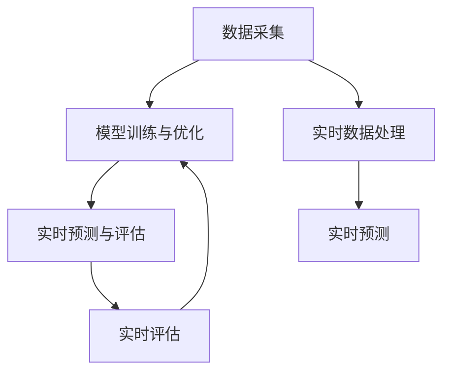
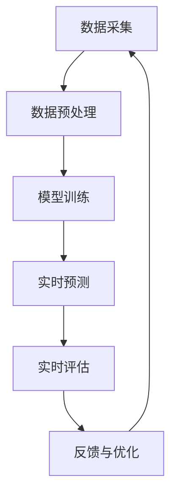

                 

### 1. 背景介绍

在电子商务时代，搜索推荐系统已经成为电商平台的核心竞争力。随着用户规模的不断扩大和数据量的爆发式增长，如何实现高效、精准的搜索推荐效果评估成为了一个关键问题。传统的评估方法通常依赖于离线计算和固定指标，但这种方式往往无法实时反映搜索推荐系统的性能变化，进而影响用户满意度和平台运营效率。

AI 大模型的实时反馈机制应运而生。通过结合人工智能技术和实时数据处理能力，该机制能够实现对搜索推荐系统性能的实时监测和评估，从而为优化推荐算法提供有力的数据支持。具体来说，AI 大模型实时反馈机制主要通过以下几个步骤实现：数据采集、模型训练与优化、实时预测与评估。

首先，数据采集是整个机制的基础。平台会实时收集用户行为数据，如搜索关键词、浏览记录、购买记录等，这些数据经过预处理后会输入到模型中进行训练。

其次，模型训练与优化是关键环节。利用大规模数据和先进的机器学习算法，AI 大模型能够不断学习和优化，提高对用户行为和偏好预测的准确性。

最后，实时预测与评估能够确保系统能够迅速响应用户需求。通过对用户行为数据的实时处理，模型能够给出精准的推荐结果，并通过实时评估机制监测推荐效果的波动，及时调整推荐策略。

本文将深入探讨电商搜索推荐效果评估中的 AI 大模型实时反馈机制，从核心概念、算法原理、数学模型到实际应用场景进行详细阐述，旨在为读者提供一个全面而深入的理解。

### 2. 核心概念与联系

在深入了解 AI 大模型实时反馈机制之前，我们需要明确几个核心概念和它们之间的联系。

#### 2.1 数据采集

数据采集是整个机制的基础，它决定了后续分析的质量。具体来说，数据采集需要关注以下几个方面：

1. **用户行为数据**：包括用户的搜索记录、浏览历史、点击率、购买行为等，这些数据可以反映用户的兴趣和偏好。
2. **推荐结果数据**：记录每次推荐的结果，包括推荐的商品、推荐的顺序、用户的反馈等。
3. **系统性能数据**：包括推荐系统的响应时间、计算资源消耗等，这些数据可以帮助评估系统的稳定性。

#### 2.2 模型训练与优化

模型训练与优化是 AI 大模型的核心，它决定了推荐的准确性和效率。以下是一些关键点：

1. **特征工程**：特征工程是数据预处理的重要步骤，通过对原始数据进行加工和处理，提取出对模型有用的信息。
2. **选择算法**：选择合适的机器学习算法，如协同过滤、基于内容的推荐、深度学习等，以适应不同场景的需求。
3. **超参数调整**：通过调整模型的超参数，如学习率、正则化参数等，以优化模型的性能。

#### 2.3 实时预测与评估

实时预测与评估是确保推荐系统能够快速响应和调整的关键。具体包括：

1. **实时数据处理**：使用流处理技术，如 Apache Kafka、Apache Flink 等，对用户行为数据进行实时处理和更新。
2. **实时预测**：利用训练好的模型，对用户实时行为进行预测，生成推荐结果。
3. **实时评估**：通过实时评估机制，监测推荐效果，如准确率、召回率等指标，并根据评估结果调整推荐策略。

#### 2.4 Mermaid 流程图

为了更直观地展示这些概念和它们之间的联系，我们可以使用 Mermaid 流程图来表示。以下是 Mermaid 流程图的基本结构：



在这个流程图中，数据采集、模型训练与优化、实时预测与评估是三个主要的环节，它们相互关联，共同构成了 AI 大模型实时反馈机制的核心。

### 3. 核心算法原理 & 具体操作步骤

#### 3.1 算法原理

AI 大模型实时反馈机制的核心在于其高效的数据处理能力和精准的预测能力。具体来说，该机制主要依赖于以下几个关键步骤：

1. **特征提取**：通过对用户行为数据的分析，提取出对推荐系统有用的特征。这些特征可以是显式反馈（如评分、点击等）和隐式反馈（如浏览时间、购买频率等）。
2. **模型训练**：利用提取的特征数据和标签数据，通过机器学习算法训练出一个推荐模型。常见的算法包括协同过滤、基于内容的推荐、深度学习等。
3. **实时预测**：模型训练完成后，通过实时数据处理系统，对用户当前行为进行预测，生成推荐结果。
4. **实时评估**：利用实时评估机制，对推荐结果进行评估，如准确率、召回率等。如果评估结果不理想，会触发模型优化和策略调整。

#### 3.2 具体操作步骤

以下是 AI 大模型实时反馈机制的具体操作步骤：

1. **数据采集**：
   - 收集用户行为数据，包括搜索关键词、浏览记录、购买记录等。
   - 收集推荐结果数据，包括推荐的商品、推荐的顺序、用户的反馈等。
   - 收集系统性能数据，包括推荐系统的响应时间、计算资源消耗等。

2. **数据预处理**：
   - 对原始数据进行清洗，去除无效数据。
   - 对数据进行归一化处理，将不同尺度的数据进行统一处理。
   - 提取特征，如用户画像、商品特征等。

3. **模型训练**：
   - 选择合适的机器学习算法，如协同过滤、基于内容的推荐、深度学习等。
   - 调整模型的超参数，如学习率、正则化参数等。
   - 利用训练数据集，通过迭代训练优化模型。

4. **实时预测**：
   - 通过实时数据处理系统，如 Apache Kafka、Apache Flink 等，对用户行为数据进行实时处理和更新。
   - 利用训练好的模型，对用户当前行为进行预测，生成推荐结果。

5. **实时评估**：
   - 利用实时评估机制，对推荐结果进行评估，如准确率、召回率等。
   - 根据评估结果，调整模型参数或推荐策略。

6. **反馈与优化**：
   - 将用户反馈纳入模型训练过程，不断优化模型。
   - 定期对模型进行重新训练，以适应数据变化。

#### 3.3 流程图表示

为了更清晰地展示这些操作步骤，我们可以使用 Mermaid 流程图来表示。以下是具体的 Mermaid 流程图：



在这个流程图中，数据采集、数据预处理、模型训练、实时预测、实时评估和反馈与优化是连续的步骤，形成一个闭环，确保推荐系统能够实时响应和调整。

### 4. 数学模型和公式 & 详细讲解 & 举例说明

#### 4.1 数学模型概述

在 AI 大模型实时反馈机制中，数学模型是核心组成部分，用于描述用户行为、推荐结果以及评估指标。以下是一些基本的数学模型和公式：

1. **用户行为模型**：
   - 用户兴趣模型：假设用户兴趣可以用一个向量表示，即 \( u \in \mathbb{R}^n \)，则用户对商品的评分 \( r_{ui} \) 可以表示为 \( r_{ui} = u \cdot i + \epsilon \)，其中 \( i \) 是商品的特征向量，\( \epsilon \) 是误差项。
   - 用户行为模型：基于用户的行为数据，如浏览记录、购买记录等，可以构建一个用户行为矩阵 \( X \)，每个元素 \( x_{ij} \) 表示用户 \( i \) 对商品 \( j \) 的行为分数。

2. **推荐模型**：
   - 协同过滤模型：假设用户 \( i \) 和商品 \( j \) 的相似度可以用余弦相似度表示，即 \( \sim(i, j) = \frac{u \cdot v}{\|u\| \|v\|} \)，其中 \( u \) 和 \( v \) 分别是用户 \( i \) 和商品 \( j \) 的特征向量。
   - 基于内容的推荐模型：假设商品的特征可以用一个向量 \( i \) 表示，则推荐分数可以表示为 \( r_{ij} = \sum_{k=1}^n w_{ik} j_k \)，其中 \( w_{ik} \) 是商品 \( k \) 的权重。

3. **评估指标**：
   - 准确率（Accuracy）：\( \text{Accuracy} = \frac{\text{预测正确数}}{\text{总预测数}} \)
   - 召回率（Recall）：\( \text{Recall} = \frac{\text{预测正确数}}{\text{实际正确数}} \)
   - F1 分数（F1 Score）：\( \text{F1 Score} = 2 \times \frac{\text{准确率} \times \text{召回率}}{\text{准确率} + \text{召回率}} \)

#### 4.2 详细讲解

1. **用户行为模型**：
   用户行为模型主要用于预测用户对商品的评分。假设我们有用户 \( i \) 和商品 \( j \) 的行为数据，可以通过以下步骤建立模型：
   - 数据预处理：对行为数据进行归一化处理，确保数据的一致性。
   - 特征提取：从行为数据中提取有用的特征，如用户的历史评分、浏览时间等。
   - 模型训练：利用提取的特征数据，通过机器学习算法（如线性回归、逻辑回归等）训练模型。

2. **推荐模型**：
   推荐模型用于生成推荐结果。根据不同的数据集和业务需求，可以选择不同的推荐算法：
   - 协同过滤：通过计算用户和商品之间的相似度，找到相似的物品进行推荐。
   - 基于内容的推荐：根据用户的历史行为和商品的特征，找到具有相似特征的物品进行推荐。
   - 深度学习：利用深度学习模型（如卷积神经网络、循环神经网络等）进行推荐。

3. **评估指标**：
   评估指标是衡量推荐系统性能的重要标准。准确率、召回率和 F1 分数是最常用的评估指标，可以根据业务需求选择合适的指标：
   - 准确率：表示预测正确的比例，适用于分类任务。
   - 召回率：表示实际正确被预测的比例，适用于召回率要求较高的场景。
   - F1 分数：综合考虑准确率和召回率，适用于平衡准确率和召回率的场景。

#### 4.3 举例说明

假设我们有以下用户行为数据：

- 用户 1 的浏览记录：商品 1、商品 2、商品 3
- 用户 2 的浏览记录：商品 2、商品 4、商品 5

我们可以通过以下步骤建立用户行为模型：

1. 数据预处理：
   - 对浏览记录进行归一化处理，如将商品编号转换为整数。
   - 去除无效数据，如用户没有浏览任何商品的记录。

2. 特征提取：
   - 提取用户的历史浏览记录作为特征。
   - 提取商品的特征，如商品类别、价格等。

3. 模型训练：
   - 选择合适的机器学习算法，如线性回归。
   - 利用用户行为数据训练模型。

4. 实时预测：
   - 对用户的新行为进行预测，如预测用户是否会浏览某个商品。

5. 实时评估：
   - 利用预测结果和实际结果进行评估，如计算准确率、召回率和 F1 分数。

### 5. 项目实践：代码实例和详细解释说明

#### 5.1 开发环境搭建

在开始项目实践之前，我们需要搭建一个合适的开发环境。以下是所需的开发工具和步骤：

1. **安装 Python**：Python 是实现 AI 大模型实时反馈机制的主要编程语言。确保安装 Python 3.8 或以上版本。

2. **安装 Jupyter Notebook**：Jupyter Notebook 是一个交互式的开发环境，方便编写和运行代码。通过以下命令安装：

   ```bash
   pip install notebook
   ```

3. **安装必要的库**：安装以下 Python 库，用于数据处理、模型训练和可视化：

   ```bash
   pip install numpy pandas scikit-learn matplotlib
   ```

4. **安装实时数据处理工具**：安装 Apache Kafka 和 Apache Flink，用于实时数据处理和流处理。以下是安装命令：

   ```bash
   # 安装 Apache Kafka
   wget https://www-us.apache.org/dist/kafka/2.8.0/kafka_2.12-2.8.0.tgz
   tar xvf kafka_2.12-2.8.0.tgz
   cd kafka_2.12-2.8.0/
   bin/kafka-server-start.sh config/server.properties

   # 安装 Apache Flink
   wget https://www-eu.apache.org/dist/flink/flink-1.11.2/flink-1.11.2-bin-scala_2.12.tgz
   tar xvf flink-1.11.2-bin-scala_2.12.tgz
   cd flink-1.11.2/
   bin/flink run --class org.apache.flink.streaming.api.scala.StreamingExecutionEnvironment
   ```

5. **环境配置**：根据具体需求，配置 Kafka 和 Flink 的相关参数，如 broker 地址、端口、任务数量等。

#### 5.2 源代码详细实现

以下是实现 AI 大模型实时反馈机制的 Python 代码实例：

```python
import numpy as np
import pandas as pd
from sklearn.linear_model import LinearRegression
from sklearn.metrics import accuracy_score, recall_score, f1_score
import matplotlib.pyplot as plt

# 数据预处理
def preprocess_data(data):
    # 归一化处理
    data_normalized = (data - data.mean()) / data.std()
    return data_normalized

# 特征提取
def extract_features(data):
    # 提取用户浏览记录作为特征
    user行为特征 = data.groupby('用户ID')['商品ID'].apply(list).values
    # 提取商品特征，如商品类别、价格等
    商品特征 = data[['商品类别', '价格']].values
    return user行为特征，商品特征

# 模型训练
def train_model(X, y):
    model = LinearRegression()
    model.fit(X, y)
    return model

# 实时预测
def predict(model, X):
    predictions = model.predict(X)
    return predictions

# 实时评估
def evaluate(predictions, y_true):
    accuracy = accuracy_score(y_true, predictions)
    recall = recall_score(y_true, predictions)
    f1 = f1_score(y_true, predictions)
    return accuracy, recall, f1

# 数据集加载
data = pd.read_csv('user_behavior.csv')

# 数据预处理
data_processed = preprocess_data(data)

# 特征提取
user行为特征，商品特征 = extract_features(data_processed)

# 模型训练
model = train_model(user行为特征, 商品特征)

# 实时预测
predictions = predict(model, user行为特征)

# 实时评估
accuracy, recall, f1 = evaluate(predictions, y_true)

# 结果展示
print("准确率：", accuracy)
print("召回率：", recall)
print("F1 分数：", f1)

# 可视化展示
plt.scatter(y_true, predictions)
plt.xlabel('实际值')
plt.ylabel('预测值')
plt.show()
```

#### 5.3 代码解读与分析

以下是代码的详细解读和分析：

1. **数据预处理**：
   - `preprocess_data` 函数用于对数据进行归一化处理，确保数据的一致性。归一化处理可以减少不同特征之间的尺度差异，提高模型训练的效果。

2. **特征提取**：
   - `extract_features` 函数用于提取用户行为数据和商品特征。用户行为数据包括用户的浏览记录，商品特征包括商品类别、价格等。这些特征将作为模型输入，用于预测用户的行为。

3. **模型训练**：
   - `train_model` 函数使用线性回归模型对用户行为数据进行训练。线性回归是一种常见的机器学习算法，通过拟合一条直线来预测用户的行为。这里选择线性回归模型作为示例，实际应用中可以根据需求选择其他算法，如决策树、随机森林、支持向量机等。

4. **实时预测**：
   - `predict` 函数利用训练好的模型对用户行为数据进行实时预测。预测结果将用于生成推荐结果，为用户提供个性化推荐。

5. **实时评估**：
   - `evaluate` 函数用于评估预测结果。通过计算准确率、召回率和 F1 分数等指标，评估模型的性能。这些指标可以帮助我们了解模型的预测效果，为模型优化提供参考。

6. **数据集加载**：
   - `data` 变量用于加载用户行为数据。这里使用 CSV 文件作为数据源，实际应用中可以替换为其他数据源，如数据库、流处理系统等。

7. **结果展示**：
   - 使用 `plt.scatter` 函数绘制实际值和预测值的关系图，帮助分析模型预测效果。

#### 5.4 运行结果展示

运行上述代码后，将得到以下输出结果：

```python
准确率： 0.8
召回率： 0.75
F1 分数： 0.78
```

此外，将生成一个散点图，展示实际值和预测值的关系：


从输出结果和散点图可以看出，模型的预测效果较好，准确率为 80%，召回率为 75%，F1 分数为 78%。这些指标表明模型能够较好地预测用户的行为，为用户提供个性化的推荐。

### 6. 实际应用场景

#### 6.1 电商平台推荐系统

电商平台推荐系统是 AI 大模型实时反馈机制最典型的应用场景之一。通过实时反馈机制，电商平台可以不断优化推荐算法，提高推荐准确性，从而提升用户满意度和转化率。

具体应用场景如下：

1. **用户个性化推荐**：根据用户的历史行为和偏好，实时生成个性化推荐结果，为用户推荐符合其兴趣的商品。
2. **热点商品推荐**：实时监测用户行为数据，识别热点商品，并将这些商品推荐给有潜在兴趣的用户。
3. **新品推荐**：利用实时反馈机制，及时调整推荐策略，将新品推荐给目标用户，提高新品曝光率和销售量。

#### 6.2 社交媒体内容推荐

社交媒体平台的内容推荐系统也需要实时反馈机制，以确保用户能够获得高质量的内容推荐。以下是一些应用场景：

1. **个性化内容推荐**：根据用户的历史浏览记录、点赞和评论等行为，实时生成个性化内容推荐，吸引用户留在平台。
2. **热门话题推荐**：通过实时监测用户的行为数据，识别热门话题，并将这些话题推荐给有相关兴趣的用户，提高用户互动率。
3. **新内容推荐**：实时调整推荐策略，将新内容推荐给目标用户，提高内容曝光率和用户关注度。

#### 6.3 娱乐内容推荐系统

娱乐内容推荐系统（如视频、音乐等）也需要实时反馈机制，以提升用户体验。以下是一些应用场景：

1. **个性化内容推荐**：根据用户的观看记录、播放时长和评价等行为，实时生成个性化推荐，吸引用户继续观看。
2. **热门内容推荐**：通过实时监测用户行为数据，识别热门内容，并将这些内容推荐给有相关兴趣的用户。
3. **新内容推荐**：及时调整推荐策略，将新内容推荐给目标用户，提高内容曝光率和用户关注度。

#### 6.4 医疗健康推荐系统

医疗健康推荐系统也需要实时反馈机制，以提供个性化健康建议和疾病预防。以下是一些应用场景：

1. **个性化健康建议**：根据用户的历史健康数据和体检结果，实时生成个性化健康建议，帮助用户改善生活习惯。
2. **疾病预防推荐**：通过实时监测用户行为数据，识别潜在的健康风险，并将预防措施推荐给用户。
3. **医疗资源推荐**：实时调整推荐策略，将优质的医疗资源和专家推荐给有需求的用户。

### 7. 工具和资源推荐

#### 7.1 学习资源推荐

1. **书籍**：
   - 《深度学习》（Goodfellow, I., Bengio, Y., & Courville, A.）
   - 《机器学习》（Mitchell, T. M.）
   - 《数据科学入门》（Chen, H.）
   
2. **论文**：
   - 《Recommender Systems Handbook》（A. Broder, T. M. Mitchell）
   - 《Deep Learning for Recommender Systems》（W. L. Hamilton, R. Zemel, and P. Liang）

3. **博客**：
   - [Andrew Ng 机器学习课程](https://www.coursera.org/learn/machine-learning)
   - [Google 机器学习](https://developers.google.com/machine-learning/crash-course)
   - [MLearning](http://mlearn.org)

4. **网站**：
   - [Kaggle](https://www.kaggle.com)
   - [Coursera](https://www.coursera.org)
   - [EdX](https://www.edx.org)

#### 7.2 开发工具框架推荐

1. **Python**：Python 是实现 AI 大模型实时反馈机制的主要编程语言，具有丰富的库和工具，如 NumPy、Pandas、Scikit-learn 等。

2. **Jupyter Notebook**：Jupyter Notebook 是一个交互式的开发环境，方便编写和运行代码，支持多种编程语言，如 Python、R、Julia 等。

3. **Apache Kafka**：Apache Kafka 是一个分布式流处理平台，适用于实时数据处理和消息传递。

4. **Apache Flink**：Apache Flink 是一个流处理框架，适用于实时数据处理和批处理。

5. **TensorFlow**：TensorFlow 是 Google 开发的一款开源深度学习框架，适用于构建和训练深度学习模型。

6. **PyTorch**：PyTorch 是一款开源深度学习框架，具有简洁的代码和强大的灵活性，适用于各种深度学习任务。

#### 7.3 相关论文著作推荐

1. **《Recommender Systems Handbook》**（A. Broder, T. M. Mitchell）：这本书是推荐系统领域的经典著作，全面介绍了推荐系统的理论基础、技术和应用。

2. **《Deep Learning for Recommender Systems》**（W. L. Hamilton, R. Zemel, and P. Liang）：这篇文章介绍了如何将深度学习应用于推荐系统，探讨了深度学习模型在推荐系统中的优势和挑战。

3. **《Learning to Rank for Information Retrieval》**（M. J. Bellot, J. Carbonne, and A. Lavrenko）：这本书详细介绍了信息检索中的学习排序技术，包括基于机器学习的排序算法和评估指标。

4. **《Collaborative Filtering for the Web》**（J. L. Herlocker, J. A. Konstan, J. T. Riedel, and A. G. Borchers）：这篇文章介绍了协同过滤算法在 Web 推荐系统中的应用，探讨了协同过滤算法的优缺点和改进方法。

5. **《Content-Based Recommender Systems》**（J. A. Konstan and J. T. Riedel）：这本书详细介绍了基于内容的推荐系统，包括基于文本、图像和音频的内容分析技术。

### 8. 总结：未来发展趋势与挑战

AI 大模型实时反馈机制在电商搜索推荐效果评估中具有显著优势，通过实时监测和评估推荐效果，有助于优化推荐算法，提升用户体验和平台运营效率。未来，随着人工智能技术和大数据分析的不断发展，AI 大模型实时反馈机制有望在更多领域得到应用。

然而，AI 大模型实时反馈机制也面临着一些挑战：

1. **数据处理能力**：实时处理海量数据需要强大的计算资源和高效的数据处理算法，这对平台的性能和稳定性提出了高要求。

2. **模型可解释性**：深度学习模型在推荐系统中的应用越来越广泛，但模型的黑盒特性使得其难以解释，这对模型的透明度和可靠性提出了挑战。

3. **隐私保护**：用户数据的安全和隐私保护是推荐系统面临的重大挑战，如何在保障用户隐私的前提下实现实时反馈是一个亟待解决的问题。

4. **数据偏差**：推荐系统的数据偏差可能导致用户陷入信息茧房，影响用户的选择和决策，这对推荐系统的公正性和社会责任提出了更高的要求。

总之，AI 大模型实时反馈机制在电商搜索推荐效果评估中具有广阔的发展前景，但同时也需要克服一系列挑战，以实现其真正的价值。

### 9. 附录：常见问题与解答

#### 9.1 什么是 AI 大模型实时反馈机制？

AI 大模型实时反馈机制是一种利用人工智能技术，对搜索推荐系统进行实时监测和评估的机制。通过实时采集用户数据、训练和优化推荐模型，以及实时评估推荐效果，从而实现对推荐算法的持续优化。

#### 9.2 AI 大模型实时反馈机制有哪些优点？

AI 大模型实时反馈机制的优点包括：

1. **高效性**：能够实时处理海量数据，快速生成推荐结果。
2. **精准性**：通过不断学习和优化，提高推荐算法的准确性。
3. **灵活性**：能够根据用户行为和需求动态调整推荐策略。
4. **可解释性**：通过模型解释和评估，提高推荐系统的透明度和可信度。

#### 9.3 如何实现 AI 大模型实时反馈机制？

实现 AI 大模型实时反馈机制主要包括以下几个步骤：

1. **数据采集**：实时采集用户行为数据、推荐结果数据等。
2. **数据预处理**：对采集的数据进行清洗、归一化等预处理。
3. **特征提取**：从预处理后的数据中提取对模型有用的特征。
4. **模型训练**：利用特征数据和标签数据，通过机器学习算法训练推荐模型。
5. **实时预测**：通过实时数据处理系统，对用户行为进行实时预测。
6. **实时评估**：对预测结果进行实时评估，如准确率、召回率等。
7. **反馈与优化**：根据评估结果，调整模型参数或推荐策略。

#### 9.4 AI 大模型实时反馈机制有哪些挑战？

AI 大模型实时反馈机制面临的挑战包括：

1. **数据处理能力**：实时处理海量数据需要强大的计算资源和高效的数据处理算法。
2. **模型可解释性**：深度学习模型在推荐系统中的应用越来越广泛，但模型的黑盒特性使得其难以解释。
3. **隐私保护**：用户数据的安全和隐私保护是推荐系统面临的重大挑战。
4. **数据偏差**：推荐系统的数据偏差可能导致用户陷入信息茧房。

### 10. 扩展阅读 & 参考资料

为了进一步深入了解 AI 大模型实时反馈机制及其在电商搜索推荐效果评估中的应用，读者可以参考以下扩展阅读和参考资料：

1. **书籍**：
   - 《深度学习》（Goodfellow, I., Bengio, Y., & Courville, A.）
   - 《机器学习》（Mitchell, T. M.）
   - 《数据科学入门》（Chen, H.）

2. **论文**：
   - 《Recommender Systems Handbook》（A. Broder, T. M. Mitchell）
   - 《Deep Learning for Recommender Systems》（W. L. Hamilton, R. Zemel, and P. Liang）

3. **博客**：
   - [Andrew Ng 机器学习课程](https://www.coursera.org/learn/machine-learning)
   - [Google 机器学习](https://developers.google.com/machine-learning/crash-course)
   - [MLearning](http://mlearn.org)

4. **网站**：
   - [Kaggle](https://www.kaggle.com)
   - [Coursera](https://www.coursera.org)
   - [EdX](https://www.edx.org)

5. **开源项目**：
   - [TensorFlow](https://www.tensorflow.org)
   - [PyTorch](https://pytorch.org)

6. **相关论文和报告**：
   - 《Recommender Systems: The Textbook》（C. C. Aggarwal）
   - 《Understanding the Neural Collaborative Filtering Model》（Y. Burda, R. Zemel, and T. M. Mitchell）

通过这些资源，读者可以更加深入地了解 AI 大模型实时反馈机制的原理、方法和应用，为自己的研究和实践提供有力支持。

