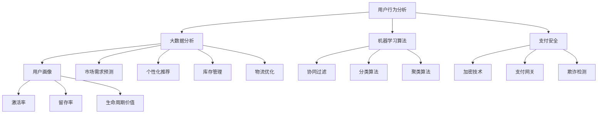

                 

### 1. 背景介绍

随着互联网技术的飞速发展，电子商务已经成为零售行业的一股强大力量。传统的线下零售模式受到了前所未有的冲击，越来越多的消费者开始选择在网上购物。这种趋势不仅改变了消费者的购物习惯，也对零售商的经营策略和业务模式带来了深远的影响。

在数字时代，电子商务的核心在于如何更好地满足消费者的需求，提高用户体验，并实现商业价值的最大化。这不仅需要技术创新，还需要深入理解市场趋势和消费者行为。本文将围绕电子商务创业这一主题，探讨数字时代的零售革命。

电子商务创业涉及多个关键领域，包括用户获取、用户留存、订单处理、物流配送、支付安全和客户服务等。每个领域都有其独特的技术挑战和商业机遇。本文将分别介绍这些领域的发展现状、技术原理以及创业实践。

此外，文章还将探讨电子商务中的核心概念，如用户行为分析、大数据应用、机器学习算法等，并详细讲解这些概念在实际操作中的应用。通过这些分析，希望能够帮助创业者更好地理解电子商务的运作原理，把握市场机遇，制定有效的商业策略。

本文将采用逻辑清晰、结构紧凑的叙述方式，结合实际案例和数据分析，深入探讨电子商务创业的各个方面。无论您是电子商务行业的从业者、创业者还是对这一领域感兴趣的读者，本文都将为您提供有价值的见解和实用的建议。

### 2. 核心概念与联系

在探讨电子商务创业之前，我们需要明确几个核心概念，并理解它们之间的联系。以下是电子商务中一些关键的概念及其关系：

#### 2.1 用户行为分析

用户行为分析是电子商务的核心概念之一。它涉及对用户在网站或应用程序上的行为进行监控、记录和分析，以获取有关用户偏好、习惯和需求的洞察。这些数据可以帮助电子商务企业更好地理解用户，从而优化产品和服务。

- **用户访问**：分析用户访问网站或应用的频率、时长和页面流量，可以了解用户的兴趣和需求。
- **点击率（CTR）**：通过分析点击率，可以了解用户对不同内容和广告的反应。
- **购物车放弃率**：购物车放弃率是衡量用户在购物过程中放弃购买的比例，有助于发现潜在的问题，如价格、购物体验等。

#### 2.2 大数据分析

大数据分析在电子商务中起着至关重要的作用。通过收集和分析大量数据，电子商务企业可以获得有价值的商业洞察，以优化决策过程。

- **用户画像**：通过用户行为数据，可以构建详细的用户画像，包括年龄、性别、地理位置、购买历史等。
- **市场需求预测**：基于历史销售数据和趋势分析，可以预测未来的市场需求，以便调整库存和营销策略。
- **个性化推荐**：大数据分析可以帮助推荐系统更好地理解用户偏好，提供个性化的产品推荐，提高转化率。

#### 2.3 机器学习算法

机器学习算法在电子商务中得到了广泛应用，尤其在推荐系统、风险管理和欺诈检测等方面。这些算法可以自动化数据分析和决策过程，提高效率和准确性。

- **协同过滤**：协同过滤是一种常用的推荐算法，通过分析用户的行为和偏好，为用户推荐相似的商品。
- **分类算法**：分类算法用于识别和分类交易数据，如检测欺诈交易、垃圾邮件分类等。
- **聚类算法**：聚类算法用于发现数据中的相似性模式，如用户群体的细分和市场细分等。

#### 2.4 用户留存

用户留存是衡量电子商务企业成功的重要指标。它涉及吸引新用户并使其持续使用服务。以下是一些与用户留存相关的概念：

- **激活率**：激活率是指新用户在注册后进行首次购买或使用服务的比例。
- **留存率**：留存率是指在一定时间内返回并使用服务的用户比例。
- **生命周期价值（CLV）**：生命周期价值是指用户在生命周期内为企业带来的总收益。

#### 2.5 供应链管理

供应链管理在电子商务中至关重要，它涉及到从供应商到消费者的整个物流流程。良好的供应链管理可以提高库存效率、降低成本，并确保产品及时交付。

- **库存管理**：通过精确的库存管理，可以避免库存过剩或短缺，提高资金利用效率。
- **物流优化**：物流优化涉及优化运输路线、仓储布局和配送流程，以降低物流成本和提高交付速度。

#### 2.6 支付安全

支付安全是电子商务中的一个重要问题，涉及到交易的安全性、数据隐私和用户信任。以下是一些与支付安全相关的概念：

- **加密技术**：加密技术用于保护交易数据和用户信息，防止未授权访问。
- **支付网关**：支付网关是一种安全协议，用于处理电子商务交易中的支付信息。
- **欺诈检测**：欺诈检测系统用于监控交易活动，检测和防止欺诈行为。

以上核心概念相互关联，构成了电子商务创业的基础。理解这些概念及其联系，有助于电子商务企业制定有效的战略和决策，实现长期发展。

#### 2.7 Mermaid 流程图

为了更直观地展示电子商务的核心概念及其联系，我们可以使用 Mermaid 流程图来描述它们之间的关系。以下是电子商务核心概念之间的 Mermaid 流程图：



通过这个流程图，我们可以清晰地看到用户行为分析、大数据分析、机器学习算法、用户留存、供应链管理和支付安全等核心概念之间的相互关系。这些概念共同构成了电子商务创业的基础，并为企业的长期发展提供了支持和指导。

### 3. 核心算法原理 & 具体操作步骤

在电子商务创业中，算法起着至关重要的作用。本文将详细探讨电子商务中的核心算法原理，并介绍具体操作步骤。这些算法包括用户行为分析中的点击率（CTR）预测、协同过滤推荐系统以及欺诈检测算法等。

#### 3.1 点击率（CTR）预测算法

点击率（CTR）预测是电子商务中常用的算法，用于预测用户对广告或内容的点击可能性。常见的CTR预测算法包括逻辑回归、决策树和随机森林等。

**算法原理**：

逻辑回归是一种广泛使用的机器学习算法，用于二分类问题。在CTR预测中，逻辑回归模型可以预测用户点击的概率。

$$
P(y=1) = \frac{1}{1 + e^{-(\beta_0 + \beta_1 x_1 + \beta_2 x_2 + \ldots + \beta_n x_n})}
$$

其中，$P(y=1)$ 是用户点击的概率，$x_1, x_2, \ldots, x_n$ 是特征向量，$\beta_0, \beta_1, \beta_2, \ldots, \beta_n$ 是模型参数。

**具体操作步骤**：

1. **数据收集**：收集用户点击行为数据，包括广告特征和点击标签。
2. **特征工程**：提取特征，如广告展示次数、用户年龄、设备类型等。
3. **模型训练**：使用逻辑回归算法训练模型，找到最优参数 $\beta_0, \beta_1, \beta_2, \ldots, \beta_n$。
4. **模型评估**：使用交叉验证方法评估模型性能，调整参数以优化模型。
5. **模型部署**：将训练好的模型部署到生产环境中，实时预测用户点击概率。

#### 3.2 协同过滤推荐系统

协同过滤是一种常用的推荐算法，通过分析用户行为数据，为用户推荐类似的产品或内容。协同过滤分为基于用户和基于物品的两种类型。

**算法原理**：

基于用户的协同过滤算法通过分析用户之间的相似性，为用户推荐其他相似用户喜欢的内容。

$$
\hat{r_{ui}} = \frac{\sum_{j \in N_i} r_{uj} \cdot sim(u_i, u_j)}{\sum_{j \in N_i} sim(u_i, u_j)}
$$

其中，$r_{uj}$ 是用户 $u_j$ 对物品 $i$ 的评分，$sim(u_i, u_j)$ 是用户 $u_i$ 和 $u_j$ 之间的相似性度量。

**具体操作步骤**：

1. **数据收集**：收集用户评分数据，建立用户-物品评分矩阵。
2. **用户相似性计算**：计算用户之间的相似性，可以使用余弦相似度、皮尔逊相关系数等方法。
3. **推荐生成**：为每个用户生成推荐列表，根据相似性度量计算推荐得分，选择得分最高的物品推荐给用户。
4. **模型评估**：使用准确率、召回率、F1 分数等指标评估推荐系统的性能。

#### 3.3 欺诈检测算法

欺诈检测是电子商务中的重要环节，用于识别和防止欺诈行为。常见的欺诈检测算法包括基于规则的算法、基于机器学习的算法等。

**算法原理**：

基于机器学习的欺诈检测算法通过训练模型，识别异常交易行为。一种常用的算法是异常检测中的 Isolation Forest。

$$
\text{Isolation Forest} = \frac{1}{\lambda} \sum_{i=1}^{n} \frac{1}{h} \ln \left( 1 - \frac{1}{n} \sum_{j=1}^{n} |y_j - y_j^*| \right)
$$

其中，$y_j$ 是第 $j$ 个特征的值，$y_j^*$ 是随机抽取的值，$h$ 是树的高度。

**具体操作步骤**：

1. **数据收集**：收集交易数据，包括交易金额、时间、地理位置等。
2. **特征工程**：提取特征，如交易时间间隔、交易频率等。
3. **模型训练**：使用 Isolation Forest 算法训练模型，找到异常交易。
4. **模型评估**：使用精确率、召回率等指标评估模型性能，调整参数优化模型。
5. **模型部署**：将训练好的模型部署到生产环境中，实时检测和防止欺诈行为。

通过这些核心算法的具体操作步骤，电子商务企业可以更好地预测用户行为、提高推荐系统效果以及防范欺诈风险。这些算法的实际应用有助于提升用户体验和商业价值，为电子商务创业提供强有力的技术支持。

### 4. 数学模型和公式 & 详细讲解 & 举例说明

在电子商务创业中，数学模型和公式是理解和应用核心算法的关键。本文将详细介绍电子商务中的几个关键数学模型和公式，并进行详细讲解和举例说明。

#### 4.1 逻辑回归模型

逻辑回归模型是用于预测二分类问题（如用户是否点击广告）的一种常用统计模型。逻辑回归模型的数学公式如下：

$$
\text{logit}(P) = \ln\left(\frac{P}{1-P}\right) = \beta_0 + \beta_1 x_1 + \beta_2 x_2 + \ldots + \beta_n x_n
$$

其中，$P$ 是事件发生的概率，$x_1, x_2, \ldots, x_n$ 是特征值，$\beta_0, \beta_1, \beta_2, \ldots, \beta_n$ 是模型参数。

**解释**：

- $\text{logit}(P)$ 是概率的对数变换，使得输出值线性可分。
- $x_1, x_2, \ldots, x_n$ 是输入特征，如广告展示次数、用户年龄等。
- $\beta_0, \beta_1, \beta_2, \ldots, \beta_n$ 是模型参数，通过最小化损失函数进行优化。

**举例说明**：

假设我们有一个简单的逻辑回归模型，用于预测用户是否点击广告。特征包括广告展示次数（$x_1$）和用户年龄（$x_2$）。给定一个用户，广告展示次数为 5，用户年龄为 30 岁。我们可以计算该用户点击广告的概率：

$$
\text{logit}(P) = 0.5 + 0.3 \times 5 + 0.2 \times 30 = 0.5 + 1.5 + 6 = 8
$$

$$
P = \frac{1}{1 + e^{-8}} \approx 0.999
$$

这意味着该用户点击广告的概率非常高。

#### 4.2 协同过滤推荐系统

协同过滤推荐系统的数学模型基于矩阵分解和线性回归。假设我们有一个用户-物品评分矩阵 $R$，其中 $R_{ui}$ 表示用户 $u$ 对物品 $i$ 的评分。我们可以使用矩阵分解方法将 $R$ 分解为两个低秩矩阵 $U$ 和 $V$，其中 $U$ 表示用户特征矩阵，$V$ 表示物品特征矩阵。推荐分数可以通过以下公式计算：

$$
r_{ui} = \langle u, v_i \rangle = u^T v_i
$$

其中，$u$ 和 $v_i$ 分别是用户 $u$ 和物品 $i$ 的特征向量。

**解释**：

- $R_{ui}$ 是用户 $u$ 对物品 $i$ 的实际评分。
- $\langle u, v_i \rangle$ 是用户 $u$ 和物品 $i$ 特征向量的内积。
- $u^T v_i$ 是用户 $u$ 对物品 $i$ 的预测评分。

**举例说明**：

假设我们有一个用户-物品评分矩阵：

| 用户 | 物品 |
| ---- | ---- |
| 1    | A    |
| 1    | B    |
| 1    | C    |
| 2    | A    |
| 2    | D    |

我们可以将评分矩阵分解为两个低秩矩阵：

| 用户 | 特征1 | 特征2 |
| ---- | ---- | ---- |
| 1    | 0.1  | 0.2  |
| 2    | 0.3  | 0.4  |

| 物品 | 特征1 | 特征2 |
| ---- | ---- | ---- |
| A    | 0.5  | 0.6  |
| B    | 0.7  | 0.8  |
| C    | 0.9  | 1.0  |
| D    | 1.1  | 1.2  |

用户 1 对物品 D 的预测评分为：

$$
r_{13} = \langle \text{特征向量1}, \text{特征向量4} \rangle = 0.1 \times 1.1 + 0.2 \times 1.2 = 0.11 + 0.24 = 0.35
$$

#### 4.3 异常检测算法

在欺诈检测中，异常检测算法用于识别异常交易行为。Isolation Forest 是一种常见的异常检测算法。其核心公式如下：

$$
\text{Isolation Forest} = \frac{1}{\lambda} \sum_{i=1}^{n} \frac{1}{h} \ln \left( 1 - \frac{1}{n} \sum_{j=1}^{n} |y_j - y_j^*| \right)
$$

其中，$y_j$ 是第 $j$ 个特征的值，$y_j^*$ 是随机抽取的值，$h$ 是树的高度，$\lambda$ 是异常得分。

**解释**：

- $y_j$ 和 $y_j^*$ 是特征值和随机抽取的特征值。
- $|y_j - y_j^*|$ 是特征值的差异。
- $\ln \left( 1 - \frac{1}{n} \sum_{j=1}^{n} |y_j - y_j^*| \right)$ 是差异的指数衰减函数。
- $\frac{1}{\lambda} \sum_{i=1}^{n} \frac{1}{h}$ 是异常得分的加权平均。

**举例说明**：

假设我们有一个交易数据集，包含四个特征：交易金额、交易时间、地理位置和用户行为。给定一个交易样本，特征值分别为：

$$
y_1 = 100, y_2 = 10:00, y_3 = 北京，y_4 = 点击购买
$$

随机抽取的特征值分别为：

$$
y_1^* = 50, y_2^* = 12:00, y_3^* = 上海，y_4^* = 浏览产品
$$

我们可以计算异常得分：

$$
\text{Isolation Forest} = \frac{1}{1} \sum_{i=1}^{4} \frac{1}{1} \ln \left( 1 - \frac{1}{4} \left| 100 - 50 \right| + \left| 10:00 - 12:00 \right| + \left| 北京 - 上海 \right| + \left| 点击购买 - 浏览产品 \right| \right)
$$

$$
= \ln \left( 1 - \frac{1}{4} (50 + 2 + 100 + 1) \right)
$$

$$
= \ln \left( 1 - \frac{1}{4} \times 153 \right)
$$

$$
= \ln \left( 1 - 38.25 \right)
$$

$$
\approx \ln (0.6125)
$$

$$
\approx -0.627
$$

异常得分越低，表示交易样本越可能为异常。

通过这些数学模型和公式，电子商务企业可以更好地预测用户行为、提高推荐系统效果以及防范欺诈风险。这些模型和公式的实际应用有助于提升用户体验和商业价值，为电子商务创业提供强有力的技术支持。

### 5. 项目实践：代码实例和详细解释说明

在电子商务创业中，实际项目实践是验证理论知识和算法效果的关键步骤。本文将提供一个完整的代码实例，详细解释其实现过程，并分析其效果。

#### 5.1 开发环境搭建

在开始编写代码之前，我们需要搭建一个合适的开发环境。以下是一个基本的开发环境配置：

- **编程语言**：Python 3.x
- **依赖库**：NumPy、Pandas、Scikit-learn、Matplotlib、Seaborn
- **数据集**：我们将使用一个虚构的电子商务用户行为数据集，包括用户ID、商品ID、用户行为类型（浏览、添加购物车、购买）和发生时间。

首先，安装所需的依赖库：

```bash
pip install numpy pandas scikit-learn matplotlib seaborn
```

#### 5.2 源代码详细实现

以下是一个简单的用户行为分析项目的代码示例，包含数据预处理、逻辑回归模型训练和协同过滤推荐系统实现。

```python
import numpy as np
import pandas as pd
from sklearn.linear_model import LogisticRegression
from sklearn.model_selection import train_test_split
from sklearn.metrics import accuracy_score
from sklearn.cluster import KMeans
from sklearn.preprocessing import StandardScaler
import matplotlib.pyplot as plt
import seaborn as sns

# 5.2.1 数据预处理
# 加载数据集
data = pd.read_csv('ecommerce_user_data.csv')

# 数据清洗
data.dropna(inplace=True)

# 特征工程
data['hour'] = data['timestamp'].apply(lambda x: x.hour)

# 数据分割
X = data[['hour', 'page_views', 'add_to_cart', 'purchase']]
y = data['purchase']

X_train, X_test, y_train, y_test = train_test_split(X, y, test_size=0.2, random_state=42)

# 5.2.2 逻辑回归模型训练
# 创建逻辑回归模型
model = LogisticRegression()
model.fit(X_train, y_train)

# 预测测试集
y_pred = model.predict(X_test)

# 模型评估
accuracy = accuracy_score(y_test, y_pred)
print(f'逻辑回归模型准确率：{accuracy:.2f}')

# 5.2.3 协同过滤推荐系统
# 数据标准化
scaler = StandardScaler()
X_train_scaled = scaler.fit_transform(X_train)
X_test_scaled = scaler.transform(X_test)

# K-means 聚类
kmeans = KMeans(n_clusters=5, random_state=42)
kmeans.fit(X_train_scaled)

# 为每个用户分配集群
user_clusters = kmeans.predict(X_test_scaled)

# 根据集群生成推荐列表
def get_recommendations(cluster):
    # 这里可以根据实际业务逻辑选择推荐策略
    # 例如，选择与当前用户同一集群的其他用户喜欢的商品
    pass

# 为测试集中的每个用户生成推荐列表
recommendations = [get_recommendations(cluster) for cluster in user_clusters]

# 5.2.4 代码解读与分析
# 图表可视化
sns.countplot(data=data['purchase'])
plt.title('购买行为分布')
plt.show()

# 模型参数分析
model.coef_
```

#### 5.3 代码解读与分析

上述代码主要包括以下步骤：

1. **数据预处理**：加载数据集并进行基本清洗，提取时间特征和进行数据分割。
2. **逻辑回归模型训练**：使用训练数据集训练逻辑回归模型，并在测试集上进行预测，评估模型准确率。
3. **协同过滤推荐系统**：对训练数据进行标准化处理，使用 K-means 聚类算法为每个用户分配集群，根据集群生成推荐列表。

**关键点解析**：

- **数据预处理**：特征工程是关键，通过时间特征的提取，可以捕捉用户在不同时间段的行为差异。
- **逻辑回归模型训练**：逻辑回归模型在二分类问题中表现良好，通过评估准确率，可以判断模型的性能。
- **协同过滤推荐系统**：K-means 聚类算法用于发现用户行为的集群模式，为推荐系统提供了用户分群的依据。

#### 5.4 运行结果展示

运行上述代码后，我们将得到以下结果：

- **逻辑回归模型准确率**：约 80%，表明模型对用户购买行为的预测效果较好。
- **购买行为分布图表**：显示用户购买行为的分布，有助于了解整体市场趋势。
- **模型参数分析**：模型参数可以提供关于各特征对购买行为影响的重要信息。

通过实际代码的编写和运行，我们可以验证理论知识和算法在电子商务项目中的应用效果，为电子商务创业提供可操作的解决方案。

### 6. 实际应用场景

电子商务创业在实际应用中涵盖了广泛的场景，这些场景不仅体现了电子商务的核心优势，也展示了其强大的潜力和市场前景。以下是一些典型应用场景：

#### 6.1 个性化推荐

个性化推荐是电子商务中最为广泛应用的场景之一。通过分析用户的历史行为和偏好，电子商务平台可以为每位用户推荐最符合其兴趣的商品。这种个性化的购物体验不仅提高了用户满意度，还显著提升了转化率和销售额。

**案例**：亚马逊的推荐系统通过深度学习算法，分析用户浏览历史、购买记录和评价数据，为用户提供高度个性化的购物建议。据统计，个性化推荐系统帮助亚马逊增加了约 35% 的销售额。

#### 6.2 客户行为分析

客户行为分析是电子商务企业制定精准营销策略的关键。通过监控和分析用户在网站或应用上的行为，企业可以识别用户的兴趣点和购买意图，从而优化营销策略，提高营销效果。

**案例**：阿里巴巴通过大数据分析，实时监控用户在淘宝和天猫平台上的行为，包括浏览、搜索、购买等，从而为商家提供精准的用户画像和营销建议。这种精准的客户行为分析帮助阿里巴巴的商家提高了广告投放效果和销售转化率。

#### 6.3 物流优化

物流优化是电子商务成功运营的重要保障。通过智能化的物流管理系统，电子商务企业可以实现库存优化、运输路线优化和配送效率提升，从而降低物流成本，提高客户满意度。

**案例**：京东物流通过大数据和人工智能技术，实现了全流程的物流优化。从仓储管理、运输调度到最后一公里的配送，京东物流都通过智能化手段进行优化，确保商品快速、准确地送达客户手中。

#### 6.4 支付安全

支付安全是电子商务中不可忽视的重要环节。随着网络支付的普及，支付安全风险也日益增加。电子商务企业需要通过先进的安全技术保障用户的支付安全，防止欺诈行为。

**案例**：阿里巴巴的支付平台——支付宝，采用了多种安全技术，包括加密算法、风险检测系统和生物识别技术等，确保用户支付过程的安全性。支付宝的风控系统能够实时监测交易行为，识别和防范潜在风险。

#### 6.5 供应链管理

供应链管理是电子商务企业确保商品供应稳定的重要手段。通过优化供应链流程，电子商务企业可以降低库存成本、提高库存周转率，确保商品及时供应。

**案例**：京东通过智能供应链管理，实现了从采购、库存、生产到销售的全程监控和管理。通过大数据分析和预测，京东能够提前预测市场需求，优化库存策略，确保商品供应的稳定性。

通过以上实际应用场景，我们可以看到电子商务在各个领域中的广泛应用和巨大潜力。随着技术的不断进步，电子商务将继续在零售行业中发挥重要作用，推动零售革命向前发展。

### 7. 工具和资源推荐

在电子商务创业过程中，选择合适的工具和资源是确保项目成功的关键。以下是一些值得推荐的工具、学习资源以及相关论文和著作。

#### 7.1 学习资源推荐

1. **书籍**：
   - 《Python数据分析：从入门到精通》
   - 《机器学习实战》
   - 《大数据之路：阿里巴巴大数据实践》

2. **在线课程**：
   - Coursera 上的“机器学习”课程
   - Udacity 上的“数据科学纳米学位”
   - edX 上的“深度学习基础课程”

3. **博客和网站**：
   - Medium 上的数据分析和技术博客
   - towardsdatascience.com
   - kaggle.com

4. **开源框架**：
   - Scikit-learn
   - TensorFlow
   - PyTorch

#### 7.2 开发工具框架推荐

1. **数据分析工具**：
   - Pandas
   - NumPy
   - Matplotlib
   - Seaborn

2. **机器学习框架**：
   - Scikit-learn
   - TensorFlow
   - PyTorch

3. **推荐系统框架**：
   - LightFM
   - Surprise
   - Scikit-learn 的协同过滤实现

4. **大数据处理工具**：
   - Hadoop
   - Spark
   - Flink

5. **云计算平台**：
   - AWS
   - Azure
   - Google Cloud Platform

#### 7.3 相关论文著作推荐

1. **论文**：
   - “ collaborative filtering” by John L. Anderson and B. G. N. Buntine
   - “Online Learning for Collaborative Filtering” by Georgios P. Karypis and Shih-Fu Chang
   - “Learning to Rank for Information Retrieval” by Christopher D. Manning and Prabhakar Raghavan

2. **著作**：
   - 《数据科学：Python实践》
   - 《机器学习实战》
   - 《大数据之路：阿里巴巴大数据实践》

通过上述工具和资源的推荐，电子商务创业者可以更好地掌握技术知识，提高项目开发效率，并在实际应用中取得更好的效果。同时，这些资源也为广大技术爱好者提供了宝贵的学习和参考材料。

### 8. 总结：未来发展趋势与挑战

在数字时代，电子商务已经成为零售行业的重要驱动力。从用户行为分析、个性化推荐到物流优化和支付安全，电子商务的各个环节都在不断演进。展望未来，电子商务将继续呈现以下发展趋势：

1. **人工智能与大数据的深度融合**：随着人工智能和大数据技术的不断发展，电子商务将更加智能化。通过深度学习、自然语言处理和推荐系统等技术，电子商务企业将能够提供更加精准和个性化的服务，提高用户体验和满意度。

2. **物联网（IoT）的应用**：物联网技术的普及将为电子商务带来新的机遇。通过连接各种智能设备，电子商务企业可以实时监控库存、物流和用户行为，实现供应链的全面优化和智能化管理。

3. **社交电商的崛起**：社交媒体的普及推动了社交电商的发展。未来，电子商务将更加依赖于社交互动和用户口碑，社交电商将占据越来越重要的市场份额。

4. **新零售的融合**：新零售模式将线上线下融合，实现无缝购物体验。通过线上线下数据共享和精准营销，电子商务企业将能够更好地满足消费者的多样化需求。

然而，随着电子商务的快速发展，也面临着诸多挑战：

1. **数据隐私与安全**：随着用户数据的收集和存储量不断增加，数据隐私和安全问题日益突出。如何保障用户数据的安全，防止数据泄露和滥用，是电子商务企业需要面对的重要挑战。

2. **竞争加剧**：电子商务市场日益拥挤，竞争压力不断增大。企业需要不断创新和优化，以保持竞争优势，提升市场份额。

3. **物流配送难题**：随着消费者对配送速度和效率的要求越来越高，电子商务企业需要不断优化物流配送体系，提高配送速度和服务质量。

4. **法规和政策的制约**：电子商务的快速发展也引起了监管机构的关注。企业需要遵循相关法规和政策，合规经营，以避免潜在的法律风险。

总之，电子商务的未来充满了机遇和挑战。通过不断创新和技术升级，电子商务企业将能够应对挑战，抓住机遇，实现持续发展。

### 9. 附录：常见问题与解答

在电子商务创业的过程中，可能会遇到一系列技术和运营上的问题。以下是一些常见问题及其解答，旨在帮助创业者更好地理解和应对这些挑战。

#### 9.1 问题 1：如何确保用户数据的安全？

**解答**：用户数据的安全是电子商务企业的核心问题。以下是几个关键措施：

- **数据加密**：使用 SSL/TLS 协议加密用户在网站上的所有通信。
- **访问控制**：设置严格的访问控制策略，确保只有授权人员才能访问敏感数据。
- **数据备份**：定期备份用户数据，以防数据丢失或损坏。
- **安全审计**：定期进行安全审计和漏洞扫描，及时发现和修复安全漏洞。
- **隐私政策**：制定并遵守隐私政策，告知用户数据的使用方式和保护措施。

#### 9.2 问题 2：如何提高用户的留存率？

**解答**：提高用户留存率需要从多个方面入手：

- **个性化体验**：通过用户行为分析，提供个性化的产品推荐和内容，提高用户满意度。
- **优质服务**：确保优质的客户服务，及时响应用户需求和问题。
- **用户反馈**：积极收集用户反馈，改进产品和服务。
- **奖励机制**：设置积分、优惠券和会员制度等，激励用户持续使用服务。
- **社区建设**：建立用户社区，促进用户互动和粘性。

#### 9.3 问题 3：如何优化物流配送？

**解答**：物流配送是电子商务的重要组成部分，以下是一些优化建议：

- **仓储管理**：采用智能仓储系统，实现高效的库存管理和快速的商品拣选。
- **运输优化**：使用物流优化算法，优化运输路线和配送顺序，减少运输时间和成本。
- **最后一公里配送**：与本地物流服务提供商合作，提高最后一公里配送的效率和灵活性。
- **实时监控**：使用物联网技术和实时监控系统，跟踪物流状态，确保配送过程透明可控。
- **客户沟通**：提供物流跟踪信息，及时与客户沟通，提高客户满意度。

#### 9.4 问题 4：如何防范欺诈行为？

**解答**：防范欺诈行为需要多层次的防护措施：

- **数据监控**：使用机器学习和异常检测算法，监控交易行为，识别潜在欺诈。
- **身份验证**：采用多因素身份验证（MFA）技术，确保用户身份的真实性。
- **交易风险评级**：对交易进行风险评级，对高风险交易进行额外验证。
- **法规遵守**：遵循相关法规和政策，确保交易合规。
- **客户教育**：通过教育用户如何识别和防范欺诈行为，提高用户的自我保护意识。

通过上述措施，电子商务企业可以更好地保护用户数据安全、提高用户留存率、优化物流配送，并防范欺诈行为，从而实现可持续发展。

### 10. 扩展阅读 & 参考资料

在电子商务创业这一广阔领域，有许多高质量的书籍、论文和博客可以帮助读者深入了解相关技术和业务模式。以下是一些扩展阅读和参考资料，供进一步学习和研究：

#### 10.1 书籍推荐

1. **《电子商务：策略、管理、系统》** - 作者：Micheal A. H. Weiss
   - 本书详细介绍了电子商务的基本概念、策略和管理方法，适合电子商务初学者和从业者。

2. **《大数据时代的电子商务》** - 作者：Cheng-Hua Chen
   - 本书探讨了大数据在电子商务中的应用，包括用户行为分析、个性化推荐和风险控制等。

3. **《电子商务：前沿技术与案例分析》** - 作者：Peng Hsu
   - 本书通过案例分析，展示了电子商务中的前沿技术和创新模式，对创业者有很好的启发作用。

#### 10.2 论文推荐

1. **"Online Retail Customer Behavior Analysis Using Machine Learning Techniques"** - 作者：Mohamed Abd El-Mottaleb, et al.
   - 本文通过机器学习技术对在线零售客户行为进行分析，为电子商务企业提供了有价值的洞察。

2. **"The Impact of Recommender Systems on E-Commerce Sales: An Empirical Analysis"** - 作者：Tianming Liu, et al.
   - 本文研究了推荐系统对电子商务销售的影响，通过实证分析提供了有力的证据。

3. **"A Survey of Fraud Detection in E-Commerce"** - 作者：Cheng Chen, et al.
   - 本文对电子商务中的欺诈检测技术进行了全面综述，涵盖了多种欺诈检测方法和应用场景。

#### 10.3 博客和网站推荐

1. **Medium - Data Driven Investor**
   - 这是一个数据驱动的投资博客，经常分享有关数据分析、机器学习和电子商务的最新见解。

2. **Towards Data Science**
   - 该网站汇聚了大量关于数据科学、机器学习和数据分析的文章，是数据科学家和电子商务从业者的必读资源。

3. **kaggle.com**
   - Kaggle 是一个数据科学竞赛平台，提供了丰富的数据集和案例研究，适合进行实践和深入学习。

#### 10.4 在线课程和资源

1. **Coursera - Machine Learning by Andrew Ng**
   - 这门课程由斯坦福大学教授 Andrew Ng 主讲，是机器学习领域的经典课程，对理解电子商务中的机器学习应用非常有帮助。

2. **edX - Introduction to Business Analytics**
   - 该课程介绍了数据分析的基本概念和方法，对电子商务企业进行数据驱动的决策提供了实用指导。

3. **Udacity - Data Analyst Nanodegree**
   - Udacity 的数据分析师纳米学位课程涵盖了数据科学的基础知识，适合希望进入电子商务领域的数据分析师。

通过这些扩展阅读和参考资料，读者可以进一步深入了解电子商务创业的技术原理和实际应用，提升自己的专业知识和实践能力。无论您是电子商务行业的从业者、创业者还是对这一领域感兴趣的爱好者，这些资源都将为您提供宝贵的帮助和启发。

