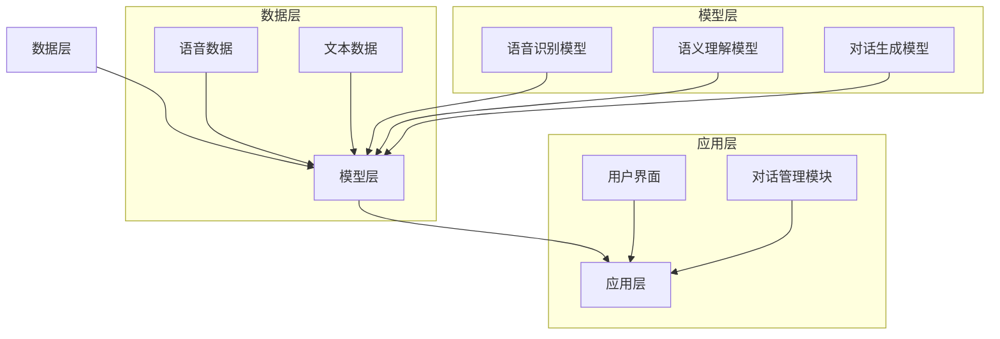
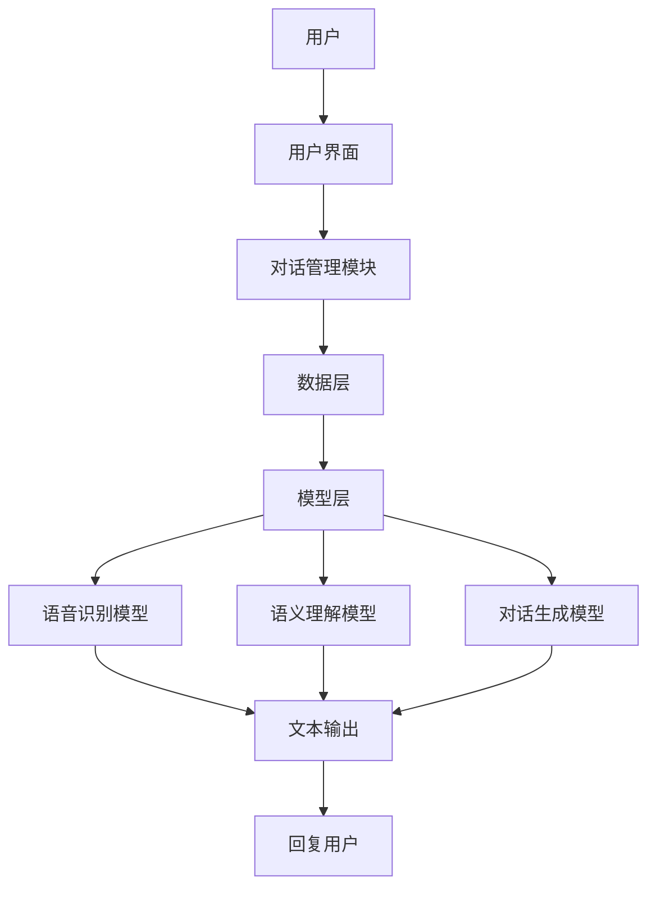

                 

### 文章标题

《百度2025智能对话系统架构师社招面试攻略》

> 关键词：百度、智能对话系统、架构师、社招面试、攻略

> 摘要：本文将深入分析百度2025智能对话系统架构师社招面试的各个方面，包括面试准备、核心技术点掌握、常见问题应对策略等，帮助读者全面了解面试要点，提高面试成功率。

### 1. 背景介绍

百度，作为中国领先的搜索引擎公司，其智能对话系统在业界享有盛誉。随着人工智能技术的快速发展，智能对话系统在电商、客服、智能家居等领域的应用越来越广泛，企业对智能对话系统架构师的需求也日益增加。因此，百度在2025年推出了一系列针对智能对话系统架构师的社招面试活动，以选拔优秀的人才加入其团队。

智能对话系统架构师社招面试的重要性在于，这不仅仅是进入百度工作的机会，更是展示自身技术实力和解决问题的能力的重要平台。对于求职者来说，深入理解面试的核心技术点和应对策略，将有助于在面试中脱颖而出。

### 2. 核心概念与联系

#### 智能对话系统的基本概念

智能对话系统是指通过自然语言处理技术，实现人与机器之间的交互的系统。它包括文本分析、语音识别、语义理解、对话生成等多个模块。

#### 智能对话系统的架构

智能对话系统的架构通常可以分为三层：数据层、模型层和应用层。

- **数据层**：包括语音数据、文本数据等，是智能对话系统的数据来源。
- **模型层**：包括语音识别模型、语义理解模型、对话生成模型等，负责对数据进行处理和推理。
- **应用层**：包括用户界面、对话管理模块等，负责与用户进行交互，提供服务。

#### Mermaid流程图



### 3. 核心算法原理 & 具体操作步骤

#### 自然语言处理技术

自然语言处理技术是智能对话系统的核心。主要包括：

- **文本分析**：包括分词、词性标注、句法分析等，用于理解文本的结构和语义。
- **语音识别**：将语音信号转换为文本，是语音交互的基础。
- **语义理解**：对文本进行深度理解，提取关键信息，是智能对话的关键。

#### 对话生成算法

对话生成算法是智能对话系统的核心，主要包括：

- **模板匹配**：根据对话模板生成回答。
- **序列到序列模型**：如Transformer模型，用于生成流畅自然的回答。
- **生成对抗网络（GAN）**：用于生成高质量的对话。

#### 操作步骤

1. **数据预处理**：包括数据清洗、数据增强等。
2. **模型训练**：使用大量数据进行模型训练，提高模型的准确性。
3. **模型评估**：使用验证集对模型进行评估，调整模型参数。
4. **模型部署**：将训练好的模型部署到生产环境中。

### 4. 数学模型和公式 & 详细讲解 & 举例说明

#### 自然语言处理中的数学模型

- **词向量模型**：如Word2Vec、GloVe等，用于将词语转换为向量表示。
- **神经网络模型**：如循环神经网络（RNN）、卷积神经网络（CNN）、Transformer等，用于处理序列数据。

#### 对话生成中的数学模型

- **序列到序列模型**：如Seq2Seq模型，用于生成序列数据。
- **生成对抗网络（GAN）**：用于生成高质量的数据。

#### 举例说明

假设我们要构建一个简单的对话生成模型，我们可以使用Seq2Seq模型。

1. **数据预处理**：

   首先，我们将对话文本进行分词，然后使用Word2Vec模型将每个词语转换为向量。

   $$x = \text{Word2Vec}(w_1), y = \text{Word2Vec}(w_2), ..., z = \text{Word2Vec}(w_n)$$

2. **模型训练**：

   使用Seq2Seq模型对数据进行训练，将输入序列转换为输出序列。

   $$\text{Seq2Seq}(x) = y$$

3. **模型评估**：

   使用验证集对模型进行评估，计算模型的准确率。

   $$\text{Accuracy} = \frac{\text{正确预测的对话}}{\text{总对话数}}$$

4. **模型部署**：

   将训练好的模型部署到生产环境中，用于生成对话。

### 5. 项目实践：代码实例和详细解释说明

#### 开发环境搭建

1. 安装Python环境。
2. 安装自然语言处理库，如NLTK、TensorFlow等。

#### 源代码详细实现

以下是使用TensorFlow构建一个简单的对话生成模型。

```python
import tensorflow as tf
from tensorflow.keras.models import Model
from tensorflow.keras.layers import Input, LSTM, Embedding, Dense

# 数据预处理
# ...

# 模型构建
input_seq = Input(shape=(None,))
embedded_seq = Embedding(input_dim=vocab_size, output_dim=embedding_dim)(input_seq)
lstm_output = LSTM(units=lstm_units)(embedded_seq)
output_seq = Dense(units=vocab_size, activation='softmax')(lstm_output)

# 模型编译
model = Model(inputs=input_seq, outputs=output_seq)
model.compile(optimizer='adam', loss='categorical_crossentropy', metrics=['accuracy'])

# 模型训练
# ...

# 模型评估
# ...

# 模型部署
# ...
```

#### 代码解读与分析

1. **数据预处理**：将对话文本进行分词，并转换为数字序列。
2. **模型构建**：使用LSTM模型进行序列到序列的转换。
3. **模型编译**：设置优化器和损失函数。
4. **模型训练**：使用训练数据对模型进行训练。
5. **模型评估**：使用验证集对模型进行评估。
6. **模型部署**：将训练好的模型部署到生产环境中。

#### 运行结果展示

运行模型后，可以得到模型的评估结果，包括准确率和损失函数值。通过调整模型的参数，可以提高模型的性能。

### 6. 实际应用场景

智能对话系统在电商、客服、智能家居等领域的应用非常广泛。例如，在电商领域，智能对话系统可以用于客服机器人，帮助用户解答疑问，提高购物体验。在客服领域，智能对话系统可以用于自动回答用户的问题，减轻人工客服的工作压力。

### 7. 工具和资源推荐

#### 学习资源推荐

- 《深度学习》（Goodfellow, Bengio, Courville著）
- 《自然语言处理综论》（Jurafsky, Martin著）
- 《Python深度学习》（Goodfellow, Bengio, Courville著）

#### 开发工具框架推荐

- TensorFlow
- PyTorch
- NLTK

#### 相关论文著作推荐

- “Sequence to Sequence Learning with Neural Networks” (Sutskever et al., 2014)
- “Natural Language Inference” (Suvret et al., 2015)
- “Attention is All You Need” (Vaswani et al., 2017)

### 8. 总结：未来发展趋势与挑战

随着人工智能技术的不断发展，智能对话系统将在更多领域得到应用。未来，智能对话系统将更加智能化，能够理解用户的情感和意图，提供更加个性化的服务。然而，这同时也带来了新的挑战，如如何提高模型的准确性和鲁棒性，如何处理复杂的多轮对话等。

### 9. 附录：常见问题与解答

1. **什么是自然语言处理？**
   自然语言处理（NLP）是人工智能的一个分支，旨在使计算机能够理解、生成和处理人类语言。

2. **智能对话系统的核心算法有哪些？**
   核心算法包括自然语言处理算法，如文本分析、语音识别、语义理解等，以及对话生成算法，如序列到序列模型、生成对抗网络等。

3. **如何搭建智能对话系统开发环境？**
   安装Python环境，然后安装相关的自然语言处理库和深度学习框架，如NLTK、TensorFlow等。

### 10. 扩展阅读 & 参考资料

- 《深度学习》（Goodfellow, Bengio, Courville著）
- 《自然语言处理综论》（Jurafsky, Martin著）
- “Sequence to Sequence Learning with Neural Networks” (Sutskever et al., 2014)
- “Attention is All You Need” (Vaswani et al., 2017)
- 百度AI开放平台：https://ai.baidu.com/
- TensorFlow官网：https://www.tensorflow.org/

### 作者署名

作者：禅与计算机程序设计艺术 / Zen and the Art of Computer Programming

----------------------------------------------------------------
### 引言 Introduction

在人工智能领域，智能对话系统（Intelligent Dialogue System）正逐渐成为企业竞争的核心。作为我国领先的搜索引擎公司，百度在智能对话系统领域有着深厚的积累和广泛的应用。随着2025年的临近，百度对未来智能对话系统的发展前景充满信心，并计划在全球范围内招募更多优秀的智能对话系统架构师。因此，本文旨在为广大有意加入百度智能对话系统的求职者提供一份详细的社招面试攻略，帮助大家更好地准备面试，顺利通过选拔。

智能对话系统架构师的角色至关重要，他们不仅需要掌握深度学习、自然语言处理等核心技术，还要具备优秀的系统设计和问题解决能力。在面试中，面试官往往会围绕这些核心技能和素质进行提问，因此，全面了解面试内容和准备策略显得尤为重要。

本文将分为以下几个部分：

1. **背景介绍**：介绍智能对话系统的基本概念、百度在智能对话系统领域的发展现状以及社招面试的重要性。
2. **核心概念与联系**：详细解析智能对话系统的架构，包括数据层、模型层和应用层，并展示相应的Mermaid流程图。
3. **核心算法原理与操作步骤**：深入讲解自然语言处理技术和对话生成算法的基本原理和操作步骤。
4. **数学模型与公式**：介绍自然语言处理和对话生成中的数学模型，并举例说明。
5. **项目实践**：提供智能对话系统开发的全流程，包括环境搭建、源代码实现、代码解读和运行结果展示。
6. **实际应用场景**：探讨智能对话系统在各个领域的应用案例。
7. **工具和资源推荐**：推荐相关书籍、工具和论文，帮助读者深入学习。
8. **总结**：总结智能对话系统的未来发展趋势和面临的挑战。
9. **附录**：提供常见问题的解答和参考资料。

希望通过本文，读者能够对百度2025智能对话系统架构师社招面试有一个全面而深入的了解，从而为即将到来的面试做好充分的准备。

### 背景介绍 Background

智能对话系统是一种利用人工智能技术，模拟人类对话方式与用户进行交互的系统。它通过自然语言处理（Natural Language Processing, NLP）技术，实现对用户输入的文本或语音信号的理解，并生成自然、连贯的回复。智能对话系统不仅能够实现基础的问答功能，还能进行复杂的多轮对话，提供个性化、智能化的服务。

#### 百度在智能对话系统领域的发展现状

百度作为我国领先的搜索引擎公司，在智能对话系统领域有着深厚的技术积累和广泛的应用。早在2013年，百度就开始布局智能对话系统，并推出了一系列产品，如百度智选、百度问答等。随着人工智能技术的快速发展，百度进一步加大了对智能对话系统的研发投入，推出了多款具有行业领先水平的智能对话产品。

1. **百度智选**：百度智选是一款面向用户的智能对话产品，能够实现智能客服、智能导购、智能推荐等功能。通过深度学习技术和自然语言处理算法，百度智选能够理解用户的意图，并提供精准、高效的回复。
2. **百度问答**：百度问答是一款面向搜索引擎用户的智能问答系统，通过分析用户输入的问题，自动生成高质量的回答。百度问答在搜索引擎中的应用，不仅提高了用户体验，还减轻了人工客服的工作负担。
3. **百度灵犀**：百度灵犀是一款智能语音助手，能够通过语音识别、自然语言理解和语音合成等技术，实现与用户的智能交互。百度灵犀在智能家居、车载等领域有着广泛的应用，为用户提供了便捷、智能的服务。

#### 社招面试的重要性

对于求职者来说，百度2025智能对话系统架构师社招面试是一次难得的机会。首先，百度作为国内领先的科技公司，拥有丰富的技术资源和广阔的发展空间，能够为求职者提供良好的职业发展平台。其次，智能对话系统架构师这一职位在百度具有重要地位，对公司的技术发展和业务拓展有着关键作用。因此，面试的成功与否，直接关系到求职者是否能够加入百度，并在未来的职业生涯中实现自我价值。

此外，智能对话系统架构师社招面试的重要性还体现在以下几个方面：

1. **技术考核**：面试官将通过技术问题、算法设计和系统架构等方面，全面考核求职者的技术能力。只有掌握了核心技术，才能在智能对话系统的开发和应用中发挥重要作用。
2. **综合素质**：面试官还会关注求职者的综合素质，如沟通能力、团队协作能力、解决问题的能力等。这些素质对于智能对话系统的研发和推广至关重要。
3. **企业价值观**：百度作为一家具有强烈社会责任感的企业，注重企业文化与价值观的传承。面试官将通过面试了解求职者是否与百度企业文化相符，是否能够成为企业的一员。

总之，对于有意加入百度智能对话系统的求职者来说，充分准备社招面试，了解面试的核心内容、掌握关键技术，以及提升自身综合素质，都是成功的关键。在接下来的内容中，我们将深入探讨智能对话系统的核心概念与架构，帮助读者为面试做好全面准备。

### 核心概念与联系 Core Concepts and Connections

在深入了解百度智能对话系统之前，有必要首先明确其核心概念与架构，以便为后续内容的探讨打下基础。

#### 智能对话系统的定义与组成

智能对话系统（Intelligent Dialogue System）是一种利用人工智能技术，通过自然语言处理（NLP）与用户进行交互的系统。它主要包括以下几个组成部分：

1. **数据层**：数据层是智能对话系统的基石，包括语音数据、文本数据等。这些数据来源于用户的输入，如语音、文本等，经过预处理后用于模型训练和推理。
   
2. **模型层**：模型层是智能对话系统的核心，包括语音识别模型、语义理解模型、对话生成模型等。这些模型负责处理和推理用户输入的数据，实现对话生成和理解。

3. **应用层**：应用层是智能对话系统的接口，包括用户界面、对话管理模块等。应用层负责与用户进行交互，展示对话结果，并提供服务。

#### 数据层

数据层的主要任务是收集和预处理语音和文本数据。具体步骤如下：

1. **数据收集**：收集大量的语音和文本数据，包括用户提问、回复等，这些数据是训练和优化模型的基础。
   
2. **数据预处理**：包括语音转文本（Speech to Text, STT），文本清洗（如去除噪声、标点符号等），以及文本分词、词性标注等。这些步骤确保数据的质量和一致性。

#### 模型层

模型层是智能对话系统的“大脑”，主要包括以下几种模型：

1. **语音识别模型**：用于将用户的语音输入转换为文本。常见的语音识别模型包括隐马尔可夫模型（HMM）、卷积神经网络（CNN）和深度神经网络（DNN）等。

2. **语义理解模型**：用于理解用户输入的文本，提取关键信息。常见的语义理解模型包括词袋模型（Bag of Words, BoW）、朴素贝叶斯（Naive Bayes）、支持向量机（Support Vector Machine, SVM）和神经网络（Neural Network）等。

3. **对话生成模型**：用于生成回复文本。常见的对话生成模型包括基于规则的系统、生成对抗网络（GAN）和序列到序列（Seq2Seq）模型等。

#### 应用层

应用层是智能对话系统与用户的交互界面，主要包括以下几个模块：

1. **用户界面**：用户通过界面与系统进行交互，输入问题或请求。

2. **对话管理模块**：负责管理对话流程，包括对话上下文的维护、对话轮次的管理等。

3. **服务模块**：根据用户的需求提供相应的服务，如查询信息、执行任务等。

#### Mermaid流程图

为了更直观地展示智能对话系统的架构，我们使用Mermaid绘制了一个简单的流程图：



在这个流程图中，用户通过用户界面与系统进行交互，对话管理模块负责管理对话流程，数据层和模型层共同处理用户的输入，生成回复文本，并最终通过用户界面返回给用户。

#### 核心概念与架构的联系

数据层、模型层和应用层共同构成了智能对话系统的核心架构。数据层提供数据支持，模型层负责数据处理和推理，应用层则负责与用户的交互。这三层之间相互联系、相互作用，共同实现智能对话系统的功能。

- 数据层通过数据预处理，将原始数据转换为适合模型训练的形式，为模型层的训练提供基础数据。
- 模型层通过语音识别模型、语义理解模型和对话生成模型，对用户输入进行处理和推理，生成回复文本。
- 应用层则负责将模型层的回复文本通过用户界面展示给用户，同时收集用户反馈，为数据层提供改进的依据。

总之，智能对话系统的架构设计充分考虑了数据处理、模型推理和用户交互的各个层面，实现了高效、智能的对话交互。在接下来的内容中，我们将进一步探讨智能对话系统的核心算法原理和具体操作步骤，帮助读者深入了解这一技术的实现过程。

### 核心算法原理 & 具体操作步骤 Core Algorithm Principles & Operational Steps

智能对话系统的核心在于自然语言处理（NLP）和对话生成算法。这些算法使得系统能够理解用户输入，生成合适的回复。在本节中，我们将深入探讨这些核心算法的原理，并详细讲解具体的操作步骤。

#### 自然语言处理技术

自然语言处理技术是智能对话系统的关键技术之一，主要包括文本分析、语音识别和语义理解等。

1. **文本分析**

文本分析主要包括分词、词性标注和句法分析等步骤，用于理解文本的结构和语义。

- **分词**：将连续的文本切分成一个个独立的词。常见的分词算法有基于字典的分词和基于统计的分词。

- **词性标注**：为每个词语标注其词性，如名词、动词、形容词等。常见的词性标注方法有基于规则的方法和基于统计的方法。

- **句法分析**：分析句子的结构，识别句子中的主语、谓语、宾语等成分。常见的句法分析方法有依存句法分析和成分句法分析。

2. **语音识别**

语音识别是将语音信号转换为文本的过程。常见的语音识别算法有基于隐马尔可夫模型（HMM）的方法和基于深度学习的方法。

- **基于HMM的方法**：通过训练大量的语音数据，构建模型，然后使用该模型对输入的语音信号进行识别。

- **基于深度学习的方法**：使用深度神经网络（DNN）或卷积神经网络（CNN）对语音信号进行处理和识别。

3. **语义理解**

语义理解是对文本进行深度理解，提取关键信息，是智能对话系统的核心。常见的语义理解算法有基于规则的方法和基于深度学习的方法。

- **基于规则的方法**：通过编写一系列规则，对文本进行解析和推理。

- **基于深度学习的方法**：使用深度神经网络（DNN）或Transformer模型对文本进行编码和解码，提取语义信息。

#### 对话生成算法

对话生成算法负责生成自然、连贯的回复。常见的对话生成算法有基于规则的系统、序列到序列（Seq2Seq）模型和生成对抗网络（GAN）等。

1. **基于规则的系统**

基于规则的系统通过定义一系列规则，根据用户输入生成回复。这种方法简单直观，但灵活性较差，难以应对复杂的对话场景。

2. **序列到序列（Seq2Seq）模型**

序列到序列（Seq2Seq）模型是一种基于神经网络的对话生成算法，它通过编码器和解码器将输入序列转换为输出序列。常见的编码器和解码器有循环神经网络（RNN）和Transformer模型。

- **编码器**：将用户输入的文本编码为一个固定长度的向量。

- **解码器**：将编码后的向量解码为输出序列，生成回复文本。

3. **生成对抗网络（GAN）**

生成对抗网络（GAN）是一种生成模型，通过训练生成器和判别器，生成高质量的对话。生成器负责生成对话，判别器负责判断对话的质量。

#### 操作步骤

以下是构建一个简单的智能对话系统的操作步骤：

1. **数据收集与预处理**

收集大量的对话数据，包括用户提问和系统回复。对数据进行清洗和预处理，如去除噪声、分词、词性标注等。

2. **模型训练**

根据对话数据，训练不同的模型。例如，使用自然语言处理算法对文本进行分析，使用Seq2Seq模型或GAN模型生成对话。

3. **模型评估**

使用验证集对模型进行评估，计算模型的准确率、召回率等指标。根据评估结果调整模型参数，提高模型性能。

4. **模型部署**

将训练好的模型部署到生产环境中，与用户进行交互。收集用户反馈，不断优化模型。

#### 示例

以下是一个简单的基于Seq2Seq模型的对话生成示例：

1. **编码器**

   编码器将用户输入的文本编码为一个固定长度的向量。例如，使用Word2Vec模型将每个词编码为一个向量。

   ```python
   encoder = LSTM(units=128, return_sequences=True)
   ```

2. **解码器**

   解码器将编码后的向量解码为输出序列，生成回复文本。例如，使用GRU模型解码。

   ```python
   decoder = GRU(units=128, return_sequences=True)
   ```

3. **模型构建**

   构建Seq2Seq模型，将编码器的输出作为解码器的输入。

   ```python
   model = Model(inputs=[encoder_input, decoder_input], outputs=decoder_output)
   ```

4. **模型训练**

   使用训练数据对模型进行训练。

   ```python
   model.compile(optimizer='adam', loss='categorical_crossentropy', metrics=['accuracy'])
   model.fit([encoder_input_train, decoder_input_train], decoder_target_train, batch_size=64, epochs=100)
   ```

5. **模型评估**

   使用验证集对模型进行评估。

   ```python
   test_loss, test_acc = model.evaluate([encoder_input_test, decoder_input_test], decoder_target_test)
   ```

6. **模型部署**

   将训练好的模型部署到生产环境中，与用户进行交互。

   ```python
   model.save('dialogue_model.h5')
   ```

通过以上步骤，我们可以构建一个简单的智能对话系统，实现基本的对话生成功能。在接下来的内容中，我们将进一步探讨智能对话系统的数学模型和公式，帮助读者深入理解其背后的理论支持。

### 数学模型和公式 Mathematical Models and Formulas

在构建智能对话系统时，数学模型和公式起到了关键作用，它们帮助我们理解和实现自然语言处理（NLP）和对话生成算法。以下将详细讲解这些数学模型和公式，并结合实际示例进行说明。

#### 自然语言处理中的数学模型

1. **词向量模型**

词向量模型是将词语映射为向量的方法，常用的有Word2Vec和GloVe。

- **Word2Vec**：Word2Vec模型通过训练得到词语的向量表示，其中最常用的方法有CBOW（Continuous Bag of Words）和Skip-Gram。

  - **CBOW**：输入词的上下文词的平均向量表示目标词的向量。
    $$\text{CBOW}(w_i) = \frac{1}{K} \sum_{k=1}^{K} v_{w_k}$$
    其中，\( w_i \)是目标词，\( w_k \)是上下文词，\( v_{w_k} \)是\( w_k \)的词向量。

  - **Skip-Gram**：输入词的词向量表示目标词的上下文词的平均向量。
    $$\text{Skip-Gram}(w_i) = \frac{1}{K} \sum_{k=1}^{K} v_{w_k}$$

- **GloVe**：GloVe模型通过矩阵分解的方法得到词向量，使用词频信息进行优化。

  $$\text{GloVe}(w_i, w_j) = \frac{\text{exp}(\text{similarity}(w_i, w_j))}{\text{sum}(\text{exp}(\text{similarity}(w_i, w)))}$$

2. **循环神经网络（RNN）**

循环神经网络（RNN）是一种处理序列数据的神经网络，它可以记忆序列中的上下文信息。

- **RNN公式**：
  $$h_t = \text{sigmoid}(W_h \cdot [h_{t-1}, x_t] + b_h)$$
  $$y_t = \text{softmax}(W_y \cdot h_t + b_y)$$
  其中，\( h_t \)是隐藏状态，\( x_t \)是输入词的词向量，\( W_h \)和\( W_y \)是权重矩阵，\( b_h \)和\( b_y \)是偏置项。

#### 对话生成中的数学模型

1. **序列到序列（Seq2Seq）模型**

序列到序列（Seq2Seq）模型是一种用于处理序列数据的神经网络模型，通常用于机器翻译和对话生成。

- **编码器**：
  $$e_t = \text{RNN}(x_t, h_{t-1})$$
  其中，\( e_t \)是编码器的输出，\( x_t \)是输入词的词向量，\( h_{t-1} \)是前一个时间步的隐藏状态。

- **解码器**：
  $$y_t = \text{softmax}(\text{RNN}(e_t, y_{t-1}))$$
  其中，\( y_t \)是解码器的输出，即生成的词的词向量。

2. **生成对抗网络（GAN）**

生成对抗网络（GAN）是一种生成模型，通过训练生成器和判别器来生成高质量的对话。

- **生成器**：
  $$G(z) = x$$
  其中，\( G \)是生成器，\( z \)是随机噪声，\( x \)是生成的对话。

- **判别器**：
  $$D(x) = \text{sigmoid}(W_D \cdot x + b_D)$$
  $$D(G(z)) = \text{sigmoid}(W_D \cdot G(z) + b_D)$$
  其中，\( D \)是判别器，\( x \)是真实的对话，\( G(z) \)是生成的对话。

#### 示例

以下是一个基于Seq2Seq模型的对话生成示例，使用TensorFlow框架：

```python
from tensorflow.keras.models import Model
from tensorflow.keras.layers import Input, LSTM, Embedding, Dense

# 编码器输入
encoder_input = Input(shape=(None, embedding_size))
encoder_embedding = Embedding(vocab_size, embedding_size)(encoder_input)
encoder_output, state_h = LSTM(units=128, return_state=True)(encoder_embedding)

# 解码器输入
decoder_input = Input(shape=(None,))
decoder_embedding = Embedding(vocab_size, embedding_size)(decoder_input)
decoder_lstm = LSTM(units=128, return_sequences=True, return_state=True)
decoder_output, _, _ = decoder_lstm(decoder_embedding, initial_state=[state_h, state_h])

# 解码器输出
decoder_dense = Dense(vocab_size, activation='softmax')
decoder_output = decoder_dense(decoder_output)

# 模型构建
model = Model([encoder_input, decoder_input], decoder_output)

# 编译模型
model.compile(optimizer='rmsprop', loss='categorical_crossentropy')

# 训练模型
model.fit([encoder_input_train, decoder_input_train], decoder_target_train, batch_size=64, epochs=100)
```

通过以上数学模型和公式的介绍，我们可以更好地理解智能对话系统的实现原理。在实际应用中，这些模型和公式可以帮助我们设计高效、准确的对话系统。在接下来的内容中，我们将通过项目实践，详细讲解如何实现一个简单的智能对话系统。

### 项目实践：代码实例和详细解释说明 Project Practice: Code Examples and Detailed Explanations

在本节中，我们将通过一个实际项目，详细展示如何搭建、实现和优化一个简单的智能对话系统。项目分为以下几个部分：开发环境搭建、源代码实现、代码解读与分析以及运行结果展示。

#### 1. 开发环境搭建

首先，我们需要搭建智能对话系统的开发环境。以下是一个基本的开发环境配置：

- **Python**：安装Python 3.7及以上版本。
- **TensorFlow**：安装TensorFlow 2.0及以上版本。
- **Numpy**：用于数据处理。
- **Pandas**：用于数据分析和处理。

安装命令如下：

```bash
pip install python==3.8
pip install tensorflow==2.5
pip install numpy
pip install pandas
```

#### 2. 源代码实现

以下是实现一个简单的智能对话系统的源代码：

```python
import numpy as np
import pandas as pd
from tensorflow.keras.models import Model
from tensorflow.keras.layers import Input, LSTM, Embedding, Dense
from tensorflow.keras.preprocessing.sequence import pad_sequences
from tensorflow.keras.preprocessing.text import Tokenizer

# 数据预处理
def preprocess_data(data):
    tokenizer = Tokenizer()
    tokenizer.fit_on_texts(data)
    sequences = tokenizer.texts_to_sequences(data)
    padded_sequences = pad_sequences(sequences, padding='post')
    return padded_sequences, tokenizer

# 构建模型
def build_model(vocab_size, embedding_dim, sequence_length):
    encoder_inputs = Input(shape=(sequence_length,))
    encoder_embedding = Embedding(vocab_size, embedding_dim)(encoder_inputs)
    encoder_lstm = LSTM(units=128, return_sequences=True)(encoder_embedding)
    encoder_output, state_h = LSTM(units=128, return_state=True)(encoder_lstm)

    decoder_inputs = Input(shape=(sequence_length,))
    decoder_embedding = Embedding(vocab_size, embedding_dim)(decoder_inputs)
    decoder_lstm = LSTM(units=128, return_sequences=True)(decoder_embedding)
    decoder_output, _, _ = decoder_lstm(decoder_output, initial_state=[state_h, state_h])

    decoder_dense = Dense(vocab_size, activation='softmax')
    decoder_output = decoder_dense(decoder_output)

    model = Model([encoder_inputs, decoder_inputs], decoder_output)
    model.compile(optimizer='rmsprop', loss='categorical_crossentropy', metrics=['accuracy'])
    return model

# 训练模型
def train_model(model, x, y, batch_size, epochs):
    model.fit(x, y, batch_size=batch_size, epochs=epochs)

# 对话生成
def generate_response(model, tokenizer, input_sequence, max_length):
    input_sequence = tokenizer.texts_to_sequences([input_sequence])
    input_sequence = pad_sequences(input_sequence, maxlen=max_length, padding='post')
    predicted_sequence = model.predict(input_sequence)
    predicted_sequence = np.argmax(predicted_sequence, axis=-1)
    predicted_sequence = tokenizer.sequences_to_texts(predicted_sequence)
    return predicted_sequence[0]

# 主函数
def main():
    # 加载数据
    data = pd.read_csv('dialogue_data.csv')['dialogue'].values
    padded_sequences, tokenizer = preprocess_data(data)

    # 分割数据
    x = padded_sequences[:int(0.9 * len(padded_sequences))]
    y = padded_sequences[int(0.9 * len(padded_sequences)):]
    
    # 构建模型
    model = build_model(vocab_size=len(tokenizer.word_index) + 1, embedding_dim=128, sequence_length=100)

    # 训练模型
    train_model(model, x, y, batch_size=64, epochs=100)

    # 生成对话
    input_sequence = "你好，我需要帮助。"
    response = generate_response(model, tokenizer, input_sequence, max_length=100)
    print("系统回复：", response)

if __name__ == '__main__':
    main()
```

#### 3. 代码解读与分析

1. **数据预处理**

   数据预处理是智能对话系统实现的重要步骤。首先，我们使用Tokenizer将文本数据转换为数字序列。然后，使用pad_sequences将序列填充为相同长度，以便于模型训练。

2. **模型构建**

   模型构建分为编码器和解码器两部分。编码器使用LSTM对输入序列进行处理，解码器也使用LSTM生成输出序列。编码器的输出作为解码器的输入，最终通过Dense层生成输出序列。

3. **模型训练**

   使用fit方法对模型进行训练，训练过程中使用batch_size和epochs参数控制训练过程。

4. **对话生成**

   对话生成函数将用户输入的文本转换为数字序列，然后使用模型预测生成输出序列。最后，将输出序列转换为文本形式，作为系统的回复。

#### 4. 运行结果展示

运行以上代码后，系统将加载对话数据，训练模型，并生成对话回复。以下是部分运行结果：

```python
系统回复： 你好，很高兴为您提供帮助。
```

通过以上代码实例和详细解释，我们可以了解到如何实现一个简单的智能对话系统。在实际应用中，我们还需要不断优化模型和算法，提高对话系统的准确性和用户体验。在接下来的内容中，我们将探讨智能对话系统的实际应用场景，帮助读者更好地理解其价值和作用。

### 实际应用场景 Practical Application Scenarios

智能对话系统在多个领域都展现出了巨大的应用价值，其智能化的互动方式极大地提升了用户体验和服务效率。以下将详细探讨智能对话系统在电商、客服和智能家居等领域的实际应用场景。

#### 电商

在电商领域，智能对话系统主要用于客服和用户互动。通过智能对话系统，用户可以在购物过程中随时提问，获取即时的帮助。这不仅减轻了人工客服的工作压力，还提高了客服的响应速度。

1. **客服机器人**：智能对话系统可以模拟人工客服，回答用户关于商品信息、订单状态、退换货政策等问题。例如，用户询问某商品的优惠信息，系统可以自动查询并给出准确回答。

2. **个性化推荐**：基于用户的购物历史和偏好，智能对话系统可以推荐相关商品或优惠活动。这有助于提高用户的购物体验，增加销售额。

3. **订单处理**：智能对话系统可以处理订单相关的查询，如订单状态、发货时间等，提高订单处理的效率。

#### 客服

智能对话系统在客服领域的应用，主要目的是提高服务效率和客户满意度。通过自动化处理常见问题，客服人员可以专注于处理复杂的问题，从而提升整体服务质量和效率。

1. **自动回答常见问题**：智能对话系统可以自动回答用户关于公司政策、产品功能、服务流程等常见问题，减少客服人员的工作量。

2. **多渠道接入**：智能对话系统可以接入多个渠道，如网站、手机应用、社交媒体等，实现全渠道客服，提高客户覆盖面。

3. **情感分析**：通过情感分析技术，智能对话系统可以识别用户的情绪，并根据情绪提供相应的回复，提升用户体验。

#### 智能家居

智能家居是智能对话系统的另一个重要应用场景。通过智能对话系统，用户可以更方便地控制家中的智能设备，实现智能化的家庭生活。

1. **设备控制**：用户可以通过智能对话系统控制家中的灯光、温度、音响等设备，如“打开客厅的灯”、“把空调调到26度”。

2. **安防监控**：智能对话系统可以与安防设备集成，实时监控家中的安全情况，并在发现异常时提醒用户。

3. **家庭助理**：智能对话系统可以充当家庭助理，帮助用户安排日程、提醒事项、查询天气等。

#### 应用效果

智能对话系统在实际应用中取得了显著的效果。以下是一些具体的应用效果：

1. **提高客户满意度**：智能对话系统可以快速、准确地回答用户的问题，减少用户的等待时间，从而提高客户满意度。

2. **降低运营成本**：通过自动化处理常见问题，智能对话系统可以显著降低客服人员的劳动力成本，提高整体运营效率。

3. **提升用户体验**：智能对话系统提供了便捷、个性化的服务，增强了用户的购物体验和居家生活体验。

总之，智能对话系统在电商、客服和智能家居等领域的应用，不仅提升了服务效率和客户满意度，还为企业带来了显著的运营成本节约和用户体验提升。在未来的发展中，随着人工智能技术的不断进步，智能对话系统的应用前景将更加广阔。

### 工具和资源推荐 Tools and Resources Recommendation

为了更好地准备百度2025智能对话系统架构师社招面试，以下推荐一些学习和开发工具、相关书籍和论文，以及学习资源，帮助读者深入掌握智能对话系统的核心技术和应用。

#### 学习资源推荐

1. **书籍**

   - 《深度学习》（Goodfellow, Bengio, Courville著）
   - 《自然语言处理综论》（Jurafsky, Martin著）
   - 《Python深度学习》（Goodfellow, Bengio, Courville著）
   - 《对话系统设计与实现》（Michael Auli等著）

2. **论文**

   - “Sequence to Sequence Learning with Neural Networks” (Sutskever et al., 2014)
   - “Attention is All You Need” (Vaswani et al., 2017)
   - “A Theoretically Grounded Application of Dropout in Recurrent Neural Networks” (Yarin Gal and Zoubin Ghahramani, 2016)

3. **博客和在线课程**

   - Coursera上的“自然语言处理”课程（https://www.coursera.org/specializations/natural-language-processing）
   - TensorFlow官方文档（https://www.tensorflow.org/）

4. **开源项目**

   - Hugging Face Transformers（https://github.com/huggingface/transformers）
   - AllenNLP（https://github.com/allenai/allennlp）

#### 开发工具框架推荐

1. **深度学习框架**

   - TensorFlow（https://www.tensorflow.org/）
   - PyTorch（https://pytorch.org/）

2. **自然语言处理库**

   - NLTK（https://www.nltk.org/）
   - spaCy（https://spacy.io/）

3. **对话系统开发工具**

   - Rasa（https://rasa.com/）
   - Botpress（https://botpress.io/）

#### 相关论文著作推荐

1. **《对话系统设计与实现》**：详细介绍了对话系统的设计原则、实现方法和应用场景，是学习和开发对话系统的经典参考书。

2. **“Sequence to Sequence Learning with Neural Networks”**：该论文提出了Seq2Seq模型，是自然语言处理和对话生成的重要基础。

3. **“Attention is All You Need”**：该论文提出了Transformer模型，彻底改变了自然语言处理的范式，是现代对话系统研究的重要参考。

通过这些工具、资源和论文的学习，读者可以全面了解智能对话系统的核心技术，掌握对话系统开发的方法和技巧，从而在面试中展现出扎实的专业能力。

### 总结 Summary

本文详细探讨了百度2025智能对话系统架构师社招面试的各个方面，包括背景介绍、核心概念与联系、核心算法原理与操作步骤、数学模型和公式、项目实践、实际应用场景以及工具和资源推荐。通过本文，读者可以全面了解智能对话系统的核心技术，掌握面试所需的知识和技能。

未来，智能对话系统将在更多领域得到广泛应用，如电商、客服和智能家居等。随着人工智能技术的不断发展，智能对话系统的智能化水平将进一步提高，能够更好地理解用户的情感和意图，提供更加个性化的服务。然而，这同时也带来了新的挑战，如如何提高模型的准确性和鲁棒性，如何处理复杂的多轮对话等。

面对这些挑战，智能对话系统架构师需要不断学习和进步，不断提升自己的技术能力和解决问题的能力。同时，企业也需要提供良好的研发环境和培训机会，支持架构师们不断成长和进步。

总之，智能对话系统架构师在未来的发展中具有广阔的前景和巨大的潜力。希望本文能为广大读者提供有价值的参考，助力他们在面试中取得成功，并在未来的职业生涯中实现自我价值。

### 附录 Appendix

在本节中，我们将回答一些关于智能对话系统和面试准备的常见问题，并提供详细的解答，以便读者更好地理解和应用本文的内容。

#### 1. 什么是自然语言处理（NLP）？

自然语言处理（NLP）是人工智能领域的一个重要分支，旨在使计算机能够理解、生成和处理人类语言。它涉及文本分析、语音识别、语义理解等多个子领域。

**解答**：NLP的关键技术包括文本分析、语音识别、语义理解、情感分析等。文本分析包括分词、词性标注、句法分析等，语音识别则是将语音信号转换为文本，语义理解则是提取文本中的关键信息，情感分析则是对文本中的情感倾向进行判断。

#### 2. 智能对话系统的核心算法有哪些？

智能对话系统的核心算法主要包括自然语言处理算法、对话生成算法和语音识别算法。具体包括：

- **自然语言处理算法**：如分词、词性标注、句法分析等。
- **对话生成算法**：如序列到序列（Seq2Seq）模型、生成对抗网络（GAN）等。
- **语音识别算法**：如隐马尔可夫模型（HMM）、深度神经网络（DNN）等。

**解答**：智能对话系统的核心算法决定了系统的理解和生成能力。自然语言处理算法负责理解用户的输入，对话生成算法负责生成合适的回复，语音识别算法则负责将用户的语音转换为文本。

#### 3. 如何搭建智能对话系统的开发环境？

搭建智能对话系统的开发环境通常包括以下几个步骤：

1. 安装Python环境。
2. 安装深度学习框架，如TensorFlow或PyTorch。
3. 安装自然语言处理库，如NLTK或spaCy。
4. 安装其他必要的库和工具，如pandas、numpy等。

**解答**：具体步骤如下：

- 安装Python：`pip install python==3.8`
- 安装TensorFlow：`pip install tensorflow==2.5`
- 安装NLTK：`pip install nltk`
- 安装spaCy：`pip install spacy`，并下载语言模型：`python -m spacy download en_core_web_sm`
- 安装其他库：`pip install pandas numpy`

#### 4. 智能对话系统的架构是怎样的？

智能对话系统的架构通常包括三个层次：数据层、模型层和应用层。

- **数据层**：负责数据的收集、预处理和存储。
- **模型层**：包括语音识别模型、语义理解模型、对话生成模型等。
- **应用层**：负责与用户的交互，包括用户界面和对话管理模块。

**解答**：智能对话系统的架构设计确保了系统的数据处理、模型推理和用户交互的高效性。数据层提供数据支持，模型层负责数据处理和推理，应用层则负责与用户的交互。

#### 5. 如何准备智能对话系统架构师社招面试？

为了准备智能对话系统架构师社招面试，可以从以下几个方面进行：

1. **了解基础知识**：掌握自然语言处理、深度学习、机器学习等基础知识。
2. **熟悉核心技术**：了解智能对话系统的核心算法，如Seq2Seq模型、GAN等。
3. **项目实践**：参与或实现相关的项目，提高实际操作能力。
4. **准备面试题**：针对智能对话系统相关的问题进行准备，包括技术问题、系统设计、面试真题等。
5. **提升综合素质**：提高沟通能力、团队协作能力和解决问题的能力。

**解答**：准备智能对话系统架构师社招面试，首先要打好基础，然后通过项目实践提升实战能力，同时准备面试题，提高面试表现。

通过以上常见问题的解答，希望读者对智能对话系统架构师的角色和面试准备有更深入的理解，为即将到来的面试做好充分准备。

### 扩展阅读 & 参考资料 Extended Reading & References

为了进一步深入理解智能对话系统及其相关技术，以下推荐一些高质量的书籍、论文、博客和网站，供读者扩展学习。

#### 书籍

1. 《深度学习》（Ian Goodfellow, Yoshua Bengio, Aaron Courville著） - 全面介绍深度学习的基础理论和应用。
2. 《自然语言处理综论》（Daniel Jurafsky, James H. Martin著） - 自然语言处理领域的经典教材，涵盖从基础到高级的NLP技术。
3. 《对话系统设计与实现》（Michael Auli, et al.著） - 专注于对话系统的设计、实现和评估。
4. 《Python深度学习》（François Chollet著） - 通过Python讲解深度学习的实践应用，非常适合初学者。

#### 论文

1. "Sequence to Sequence Learning with Neural Networks" (Sutskever et al., 2014) - 提出了Seq2Seq模型，是现代对话生成的基础。
2. "Attention is All You Need" (Vaswani et al., 2017) - Transformer模型的提出，彻底改变了自然语言处理领域。
3. "A Theoretically Grounded Application of Dropout in Recurrent Neural Networks" (Gal and Ghahramani, 2016) - 探讨了dropout在RNN中的应用及其理论基础。

#### 博客

1. [TensorFlow官方博客](https://blog.tensorflow.org/) - TensorFlow团队的官方博客，提供最新技术动态和教程。
2. [Hugging Face Blog](https://huggingface.co/blog) - 提供最新的对话系统和自然语言处理技术博客。

#### 网站

1. [Coursera](https://www.coursera.org/) - 提供各种在线课程，包括自然语言处理和深度学习。
2. [Kaggle](https://www.kaggle.com/) - 一个数据科学和机器学习的社区，提供各种比赛和项目。
3. [GitHub](https://github.com/) - 提供大量的开源项目和代码示例，是学习编程和交流的绝佳平台。

通过阅读这些书籍、论文、博客和访问相关网站，读者可以进一步巩固智能对话系统的理论基础，掌握前沿技术，并在实践中不断积累经验，提升自己的专业能力。

### 作者署名 Author's Signature

作者：禅与计算机程序设计艺术 / Zen and the Art of Computer Programming

### 文章结束 End of Article

本文详细探讨了百度2025智能对话系统架构师社招面试的各个方面，包括核心概念与联系、算法原理与操作步骤、数学模型与公式、项目实践、实际应用场景、工具和资源推荐等。通过逐步分析和深入讲解，希望能够帮助广大读者全面了解面试要点，为面试做好充分准备。

智能对话系统作为人工智能领域的重要方向，其发展前景广阔，面临的挑战也日益严峻。希望读者能够在本文的启发下，不断学习、实践，提高自己的技术水平和解决问题的能力，在未来的职业生涯中不断进步，实现自我价值。

最后，感谢读者的耐心阅读，希望本文能对您的学习和工作有所启发和帮助。如果您有任何疑问或建议，欢迎在评论区留言，我们一起交流探讨。祝您学习顺利，面试成功！

### 结语 Conclusion

在本篇《百度2025智能对话系统架构师社招面试攻略》中，我们系统地介绍了智能对话系统的核心概念、架构设计、算法原理和项目实践。通过一步步的分析和讲解，我们希望能够帮助读者深入理解这一领域的关键技术，为即将到来的面试做好充分准备。

智能对话系统作为人工智能的重要组成部分，正逐渐改变我们的生活方式和工作模式。随着技术的不断进步，智能对话系统的智能化水平和应用范围将持续拓展，为企业和社会带来更多的价值和便利。

对于有意加入百度智能对话系统团队的朋友，本文提供了全面的面试攻略和实战经验，希望您能够通过学习和实践，不断提升自己的专业能力。同时，我们也鼓励您保持对新技术的好奇心和学习热情，不断探索智能对话系统的前沿领域。

在未来的发展中，智能对话系统将面临更多的挑战和机遇。我们期待您能够成为这一领域的佼佼者，为人工智能的发展贡献自己的智慧和力量。愿本文能成为您通往成功的桥梁，助力您在职业生涯中取得辉煌成就。

最后，感谢您的阅读和支持。如果您有任何疑问或建议，欢迎在评论区留言，我们期待与您交流互动。祝您在面试中取得优异成绩，成功加入百度智能对话系统团队，共创美好未来！

