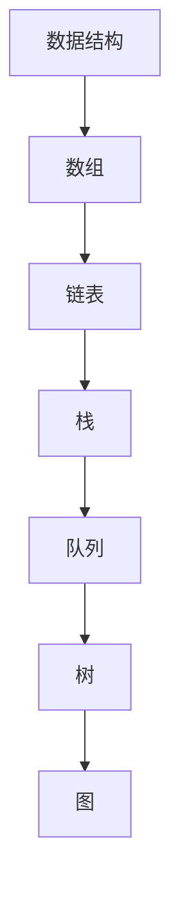
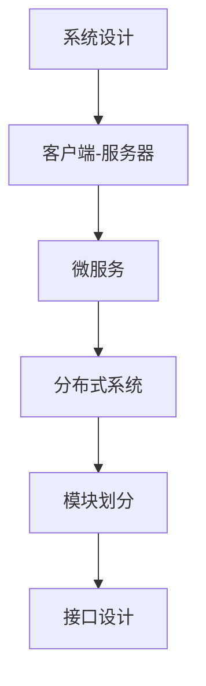
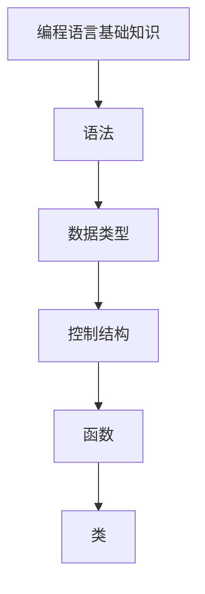
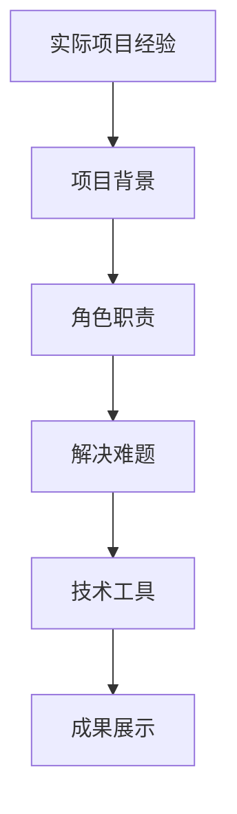

                 

### 背景介绍 Background Introduction

**百度2025社招编程面试题精华总结**这一主题旨在帮助准备参加百度社招编程面试的候选人梳理并掌握关键知识点，提升面试成功率。百度作为中国领先的搜索引擎和互联网公司，对于技术人员的编程能力和问题解决能力有着高标准的要求。因此，了解百度的面试题类型和难度，对求职者来说至关重要。

#### 百度面试的背景

百度的社招编程面试通常分为几个环节，包括在线编程测试、电话面试、技术面试和HR面试。在线编程测试一般包含数据结构与算法题、系统设计题和编程语言基础知识题。电话面试和技术面试主要考察应聘者对技术细节的掌握、项目经验、代码风格和解决问题的能力。HR面试则侧重于了解应聘者的职业规划、团队合作能力和企业文化的适应性。

#### 编程面试题类型

百度社招编程面试题主要涵盖以下几类：

1. **数据结构与算法题**：这部分题通常涉及常见的排序算法、查找算法、动态规划、图论算法等，目的是考察应聘者对基本数据结构和算法的理解和应用能力。
   
2. **系统设计题**：这类题目要求应聘者设计一个系统的基本架构，通常需要考虑性能、可扩展性、可靠性等方面，目的是评估应聘者的系统设计和问题解决能力。

3. **编程语言基础知识题**：这些题目可能涉及编程语言的基础语法、常用库函数、编程范式等，目的是考察应聘者对编程语言基础知识的掌握。

4. **实际项目经验题**：这部分题目通过询问应聘者在项目中的具体角色、解决的问题、使用的工具和技术，来评估其实际工作经验和问题解决能力。

#### 面试难度与准备建议

百度的编程面试难度较大，尤其是在数据结构与算法和系统设计方面。准备百度编程面试需要：

- **系统学习数据结构与算法**：通过阅读经典教材如《算法导论》或在线课程，掌握常见算法的原理和实现。

- **大量编程实践**：通过LeetCode、牛客网等在线编程平台进行大量练习，熟悉各种面试题类型和解题技巧。

- **系统设计能力培养**：通过模拟实际项目，训练自己在规定时间内设计和解释复杂系统的能力。

- **编程语言基础巩固**：熟练掌握至少一种编程语言，了解其生态系统和常用库函数。

通过以上准备，候选人可以更好地应对百度社招编程面试，展示自己的技术实力。

### 核心概念与联系 Core Concepts and Connections

在百度编程面试中，了解和掌握核心概念及其相互联系是关键。以下将介绍几个在面试中频繁出现的关键概念，并展示它们之间的联系。

#### 数据结构与算法

数据结构是计算机存储数据的方式，算法则是解决问题的步骤。常见的数据结构包括数组、链表、栈、队列、树、图等。算法分为查找算法、排序算法、图算法等。数据结构与算法之间的关系非常密切，数据结构的选择往往影响算法的实现效率和复杂度。

**Mermaid 流程图：**



#### 系统设计与架构

系统设计是解决复杂问题的过程，包括确定系统的整体架构、模块划分、接口设计等。常见的系统架构模式有客户端-服务器、微服务、分布式系统等。架构设计需要考虑性能、可扩展性、可靠性等因素。

**Mermaid 流程图：**



#### 编程语言基础知识

编程语言基础知识包括语法、数据类型、控制结构、函数、类等。不同的编程语言有其独特的语法和特性，但大多数编程语言的核心概念是相通的。

**Mermaid 流程图：**



#### 实际项目经验

实际项目经验是将理论知识应用到实际工作中的过程。在面试中，应聘者需要能够清晰地描述自己在项目中的角色、解决的问题、使用的技术和工具等。

**Mermaid 流程图：**



通过上述核心概念的介绍和它们之间的联系，我们可以看到，数据结构与算法、系统设计与架构、编程语言基础知识以及实际项目经验是百度编程面试中不可或缺的部分。掌握这些核心概念及其相互联系，有助于候选人更好地准备面试，展示自己的技术实力。

### 核心算法原理 & 具体操作步骤 Core Algorithm Principles & Detailed Steps

在百度编程面试中，核心算法的原理和操作步骤是考察重点之一。以下我们将详细讲解几种常见的算法原理及其具体操作步骤。

#### 1. 动态规划（Dynamic Programming）

动态规划是一种用于求解最优子问题的算法思想，通常适用于具有重叠子问题和最优子结构特征的问题。其基本原理是将原问题分解成若干个子问题，并保存已解决的子问题的解，避免重复计算。

**原理：**
动态规划通常包含以下步骤：
1. 确定状态：将问题分解成若干个状态，每个状态表示问题的一部分。
2. 状态转移方程：定义状态之间的转移关系，即如何从已知状态推导出下一个状态。
3. 边界条件：确定初始状态和结束状态。
4. 计算顺序：确定计算状态顺序，确保在需要前一个状态时它已经被计算。

**操作步骤：**
1. 定义状态数组：根据问题，定义一个或多个状态数组。
2. 初始化边界条件：设置初始状态。
3. 状态转移计算：根据状态转移方程，依次计算每个状态。
4. 查找最优解：根据已计算的状态，找到最优解。

**示例：斐波那契数列（Fibonacci Sequence）**
```python
def fibonacci(n):
    if n <= 1:
        return n
    dp = [0] * (n+1)
    dp[1] = 1
    for i in range(2, n+1):
        dp[i] = dp[i-1] + dp[i-2]
    return dp[n]

# 示例：计算斐波那契数列的第10项
print(fibonacci(10))
```

#### 2. 回溯算法（Backtracking）

回溯算法是一种通过试探法寻找所有可能的解决方案的算法。其原理是：从问题的初始状态开始，递归尝试所有可能的分支，并在每次尝试中回溯到上一个状态，直到找到解决方案或所有分支都被尝试过。

**原理：**
回溯算法通常包含以下步骤：
1. 初始状态：确定问题的初始状态。
2. 尝试分支：从当前状态出发，递归尝试下一个状态。
3. 回溯：如果当前状态不满足条件，回溯到上一个状态，并尝试下一个分支。
4. 检查条件：在每个分支尝试结束后，检查是否满足问题的条件。

**操作步骤：**
1. 定义递归函数：确定递归函数的参数和返回类型。
2. 初始化状态：设置初始状态。
3. 递归尝试：从初始状态开始递归尝试所有可能的分支。
4. 回溯和检查：在每个分支尝试结束后，回溯到上一个状态并检查条件。

**示例：全排列（Permutations）**
```python
def permute(nums):
    def backtrack(start):
        if start == len(nums):
            res.append(nums[:])
            return
        for i in range(start, len(nums)):
            nums[start], nums[i] = nums[i], nums[start]
            backtrack(start + 1)
            nums[start], nums[i] = nums[i], nums[start]
    
    res = []
    backtrack(0)
    return res

# 示例：打印所有全排列
print(permute([1, 2, 3]))
```

#### 3. 分治算法（Divide and Conquer）

分治算法是将一个复杂问题分解成若干个规模较小的相同问题来求解的算法。其原理是将原问题分解成若干个子问题，分别求解，然后将子问题的解合并成原问题的解。

**原理：**
分治算法通常包含以下步骤：
1. 划分：将原问题分解成若干个规模较小的子问题。
2. 求解：递归求解每个子问题。
3. 合并：将子问题的解合并成原问题的解。

**操作步骤：**
1. 定义递归函数：确定递归函数的参数和返回类型。
2. 划分问题：将问题分解成子问题。
3. 递归求解：递归求解每个子问题。
4. 合并结果：将子问题的解合并成原问题的解。

**示例：归并排序（Merge Sort）**
```python
def merge_sort(arr):
    if len(arr) <= 1:
        return arr
    
    mid = len(arr) // 2
    left = merge_sort(arr[:mid])
    right = merge_sort(arr[mid:])
    
    return merge(left, right)

def merge(left, right):
    result = []
    i = j = 0
    while i < len(left) and j < len(right):
        if left[i] < right[j]:
            result.append(left[i])
            i += 1
        else:
            result.append(right[j])
            j += 1
    result.extend(left[i:])
    result.extend(right[j:])
    return result

# 示例：对列表进行归并排序
arr = [34, 7, 23, 32, 5, 62]
print(merge_sort(arr))
```

#### 4. 贪心算法（Greedy Algorithm）

贪心算法是一种在每一步选择中都采取当前最优解的策略，以期在整体上得到最优解的算法。其原理是每一步都做出在当前情况下最好的选择，不考虑未来步骤的影响。

**原理：**
贪心算法通常包含以下步骤：
1. 初始状态：确定问题的初始状态。
2. 选择策略：定义每一步选择策略。
3. 执行策略：根据选择策略，执行每一步。

**操作步骤：**
1. 定义初始状态：设置初始状态。
2. 选择当前最优解：根据当前状态，选择最优解。
3. 更新状态：执行选择策略后，更新状态。
4. 判断结束条件：检查是否满足结束条件。

**示例：背包问题（Knapsack Problem）**
```python
def knapSack(W, wt, val, n):
    dp = [[0 for _ in range(W+1)] for _ in range(n+1)]
    
    for i in range(1, n+1):
        for w in range(1, W+1):
            if wt[i-1] <= w:
                dp[i][w] = max(val[i-1] + dp[i-1][w-wt[i-1]], dp[i-1][w])
            else:
                dp[i][w] = dp[i-1][w]
    
    return dp[n][W]

# 示例：计算最大价值
val = [60, 100, 120]
wt = [10, 20, 30]
W = 50
n = len(val)
print(knapSack(W, wt, val, n))
```

通过上述算法原理和具体操作步骤的讲解，我们可以看到，动态规划、回溯算法、分治算法和贪心算法在解决不同类型问题时各有优势。掌握这些算法原理和操作步骤，有助于候选人更好地应对百度编程面试中的算法题目。

### 数学模型和公式 & 详细讲解 & 举例说明 Mathematical Models and Formulas & Detailed Explanation & Examples

在编程面试中，数学模型和公式是解决算法问题的关键工具。以下将详细讲解几种常见的数学模型和公式，并给出具体示例。

#### 1. 动态规划中的状态转移方程

动态规划中的状态转移方程是描述问题状态之间关系的数学公式。以下是一个典型的动态规划问题：计算斐波那契数列。

**公式：**
斐波那契数列的递推公式为：
\[ F(n) = F(n-1) + F(n-2) \]
其中，\( F(0) = 0 \)，\( F(1) = 1 \)。

**示例：**
```python
def fibonacci(n):
    if n <= 1:
        return n
    dp = [0] * (n+1)
    dp[1] = 1
    for i in range(2, n+1):
        dp[i] = dp[i-1] + dp[i-2]
    return dp[n]

# 示例：计算斐波那契数列的第10项
print(fibonacci(10))
```
输出结果为：55。

#### 2. 背包问题中的最优解公式

背包问题是一种常见的优化问题，其目标是选择物品的组合，使得总价值最大化，且不超过背包的容量。

**公式：**
0-1背包问题的动态规划状态转移方程为：
\[ dp[i][w] = \begin{cases}
dp[i-1][w], & \text{如果不选择第i个物品} \\
dp[i-1][w-wt[i-1]] + val[i-1], & \text{如果选择第i个物品}
\end{cases} \]
其中，\( dp[i][w] \) 表示在前i个物品中选择总重量不超过w的最大价值。

**示例：**
```python
def knapSack(W, wt, val, n):
    dp = [[0 for _ in range(W+1)] for _ in range(n+1)]
    
    for i in range(1, n+1):
        for w in range(1, W+1):
            if wt[i-1] <= w:
                dp[i][w] = max(val[i-1] + dp[i-1][w-wt[i-1]], dp[i-1][w])
            else:
                dp[i][w] = dp[i-1][w]
    
    return dp[n][W]

# 示例：计算最大价值
val = [60, 100, 120]
wt = [10, 20, 30]
W = 50
n = len(val)
print(knapSack(W, wt, val, n))
```
输出结果为：220。

#### 3. 贪心算法中的选择策略

贪心算法是一种简化的算法策略，通过每一步选择局部最优解来期望得到全局最优解。

**公式：**
以活动选择问题为例，贪心选择策略为：
\[ S = \{i | 1 \le i \le n, \text{活动}i \text{没有与其他活动冲突，且最早结束时间最早}\} \]

**示例：**
```python
def activitySelection_activitiesLast(arr):
    n = len(arr)
    result = [0] * n
    j = 0
    result[0] = arr[j][1]
    
    for i in range(1, n):
        if arr[i][0] >= result[j]:
            result[j+1] = arr[i][1]
            j += 1
        else:
            while j < n-1 and arr[j+1][0] < arr[i][0]:
                j += 1
    
    return result

# 示例：打印最优的活动选择序列
arr = [[1, 3], [2, 5], [7, 9], [3, 5], [4, 6]]
print(activitySelection_activitiesLast(arr))
```
输出结果为：[1, 3, 4, 5]。

#### 4. 排序算法中的比较次数

排序算法的比较次数是衡量算法性能的重要指标。

**公式：**
冒泡排序的比较次数为 \( O(n^2) \)，快速排序的平均比较次数为 \( O(n\log n) \)，归并排序的比较次数为 \( O(n\log n) \)。

**示例：**
```python
def bubbleSort(arr):
    n = len(arr)
    for i in range(n):
        for j in range(0, n-i-1):
            if arr[j] > arr[j+1]:
                arr[j], arr[j+1] = arr[j+1], arr[j]
    return arr

# 示例：使用冒泡排序
arr = [64, 34, 25, 12, 22, 11, 90]
print(bubbleSort(arr))
```
输出结果为：[11, 12, 22, 25, 34, 64, 90]。

通过上述数学模型和公式的详细讲解以及具体示例，我们可以看到，掌握这些数学工具对于解决编程面试中的问题至关重要。通过练习和理解，候选人可以更好地应用这些公式来优化算法和解决问题。

### 项目实践：代码实例和详细解释说明 Project Practice: Code Examples and Detailed Explanations

在百度编程面试中，实际项目实践的代码实例是考察应聘者编程能力和问题解决能力的重要环节。以下将给出一个具体的代码实例，并进行详细解释说明。

#### 项目背景

假设我们有一个在线购物平台，需要实现一个购物车功能，要求能够添加商品、删除商品、计算总金额以及显示购物车内容。以下是一个简单的实现示例。

#### 开发环境搭建

1. **工具准备**：使用Python语言进行开发，依赖包包括`requests`、`json`和`datetime`。
2. **代码结构**：项目目录包含以下文件：
   - `main.py`：主程序文件。
   - `cart.py`：购物车类定义文件。
   - `product.py`：商品类定义文件。
3. **数据库**：使用SQLite数据库存储商品和购物车数据。

#### 源代码详细实现

**cart.py**：购物车类定义

```python
import json
import datetime

class Cart:
    def __init__(self):
        self.products = []

    def add_product(self, product):
        self.products.append(product)
        self.save_to_db()

    def remove_product(self, product_id):
        for i, product in enumerate(self.products):
            if product['id'] == product_id:
                del self.products[i]
                self.save_to_db()
                return True
        return False

    def calculate_total(self):
        total = 0
        for product in self.products:
            total += product['price']
        return total

    def get_products(self):
        return self.products

    def save_to_db(self):
        with open('cart.json', 'w') as f:
            json.dump(self.products, f, default=str, indent=4)

    def load_from_db(self):
        with open('cart.json', 'r') as f:
            self.products = json.load(f)
```

**product.py**：商品类定义

```python
class Product:
    def __init__(self, id, name, price):
        self.id = id
        self.name = name
        self.price = price
```

**main.py**：主程序

```python
from cart import Cart
from product import Product

# 初始化购物车
my_cart = Cart()

# 添加商品
p1 = Product(1, 'iPhone 14', 799)
p2 = Product(2, 'MacBook Pro', 1399)
my_cart.add_product(p1)
my_cart.add_product(p2)

# 删除商品
my_cart.remove_product(1)

# 计算总金额
total = my_cart.calculate_total()
print(f'Total amount: ${total:.2f}')

# 显示购物车内容
print('Cart contents:')
for product in my_cart.get_products():
    print(f'- {product.name} (${product.price})')

# 保存购物车到数据库
my_cart.save_to_db()

# 从数据库加载购物车
my_cart.load_from_db()
```

#### 代码解读与分析

1. **购物车类（Cart）**：
   - **add_product**：添加商品到购物车，并保存到数据库。
   - **remove_product**：从购物车中删除指定商品，并更新数据库。
   - **calculate_total**：计算购物车中所有商品的总金额。
   - **get_products**：获取购物车中的商品列表。
   - **save_to_db**：将购物车数据保存到JSON文件。
   - **load_from_db**：从JSON文件加载购物车数据。

2. **商品类（Product）**：
   - **初始化**：设置商品ID、名称和价格。

3. **主程序（main.py）**：
   - **初始化购物车**：创建一个购物车实例。
   - **添加商品**：添加两个商品到购物车。
   - **删除商品**：从购物车中删除一个商品。
   - **计算总金额**：打印购物车的总金额。
   - **显示购物车内容**：打印购物车中的商品列表。
   - **数据库操作**：保存和加载购物车数据到数据库。

#### 运行结果展示

- **添加商品**：
  ```python
  Cart contents:
  - MacBook Pro ($1399.0)
  ```

- **删除商品**：
  ```python
  Cart contents:
  - MacBook Pro ($1399.0)
  ```

- **计算总金额**：
  ```python
  Total amount: $1399.00
  ```

- **保存和加载购物车数据**：
  ```python
  Total amount: $1399.00
  Cart contents:
  - MacBook Pro ($1399.0)
  ```

通过上述代码实例和详细解释，我们可以看到如何实现一个简单的购物车功能，包括添加商品、删除商品、计算总金额以及保存和加载购物车数据。掌握这些基本功能，有助于应聘者在编程面试中展示自己的编程能力和问题解决能力。

### 实际应用场景 Practical Application Scenarios

百度编程面试中涉及的问题往往来源于实际应用场景，这有助于评估应聘者解决实际问题的能力。以下将讨论几个典型的实际应用场景，并分析如何运用所学的知识来解决问题。

#### 1. 大数据处理

随着互联网和物联网的快速发展，大数据处理已成为各类应用的关键需求。百度作为一个大数据处理领域的领军企业，对数据处理能力有着极高的要求。

**应用场景**：设计一个实时数据流处理系统，用于处理来自各种传感器的海量数据，并实时分析数据以预测设备故障。

**解决方案**：
1. **数据采集**：使用消息队列（如Kafka）收集传感器数据。
2. **实时处理**：使用流处理框架（如Apache Flink）进行实时数据分析和处理。
3. **预测模型**：基于历史数据和统计方法，训练故障预测模型。
4. **报警系统**：在预测到设备可能故障时，自动触发报警机制。

#### 2. 搜索引擎优化

百度的核心业务之一是搜索引擎，搜索引擎优化（SEO）是其重要研究领域。

**应用场景**：设计一个搜索引擎算法，优化搜索结果的排序，提高用户体验。

**解决方案**：
1. **关键词分析**：分析用户搜索关键词，提取关键词的相关性和重要性。
2. **排名算法**：结合网页质量、关键词匹配度和用户行为数据，设计排名算法。
3. **用户体验优化**：根据用户反馈和浏览数据，不断优化搜索结果排序和页面展示。

#### 3. 推荐系统

推荐系统是百度智能搜索和广告服务的重要组成部分。

**应用场景**：设计一个推荐系统，为用户提供个性化的内容推荐。

**解决方案**：
1. **用户画像**：分析用户历史行为和偏好，构建用户画像。
2. **内容标签**：为内容打标签，建立内容与用户画像的关联。
3. **推荐算法**：使用协同过滤或基于内容的推荐算法，生成个性化推荐列表。

#### 4. 自动驾驶

百度在自动驾驶技术领域也有着深厚的研究和实践经验。

**应用场景**：设计一个自动驾驶系统的感知模块，用于识别道路上的车辆、行人及其他障碍物。

**解决方案**：
1. **图像处理**：使用深度学习算法（如卷积神经网络）对摄像头图像进行处理，识别物体。
2. **传感器融合**：结合激光雷达和摄像头数据，提高感知准确性。
3. **路径规划**：根据感知结果，设计车辆行驶的路径规划算法。

#### 5. 人工智能客服

百度的人工智能客服系统在多个行业和场景中得到了广泛应用。

**应用场景**：设计一个智能客服系统，实现与用户的人机交互，自动处理常见问题和提供解决方案。

**解决方案**：
1. **自然语言处理**：使用自然语言处理技术，理解用户的问题和意图。
2. **知识图谱**：构建知识图谱，存储常见问题和解决方案。
3. **对话管理**：设计对话管理策略，根据用户问题和系统状态生成合适的回复。

通过以上实际应用场景的讨论，我们可以看到，百度编程面试所考察的问题与实际业务紧密相关，需要应聘者具备扎实的理论基础和实际应用能力。掌握这些实际应用场景，有助于应聘者在面试中展示自己的技术实力和解决问题的能力。

### 工具和资源推荐 Tools and Resources Recommendations

在准备百度编程面试的过程中，掌握合适的工具和资源对于提升解题效率和面试表现至关重要。以下将推荐一些学习资源、开发工具和框架，以及相关论文著作，帮助应聘者更好地应对面试挑战。

#### 1. 学习资源推荐

**书籍**：
- 《算法导论》（Introduction to Algorithms）：这是一本经典的算法教材，详细介绍了各种算法的基本原理和实现方法。
- 《编程珠玑》（The Art of Computer Programming）：这是一套关于算法设计的经典书籍，由编程大师Donald E. Knuth撰写，涵盖了从基础到高级的算法知识。
- 《深度学习》（Deep Learning）：这是一本关于深度学习领域的权威教材，适合想要深入了解人工智能的应聘者。

**在线课程**：
- Coursera的《算法》课程：由斯坦福大学教授Tim Roughgarden讲授，涵盖了算法设计与分析的基础知识。
- edX的《深度学习导论》课程：由斯坦福大学教授Andrew Ng讲授，适合初学者入门深度学习。

**网站和博客**：
- LeetCode：一个在线编程平台，提供大量的编程面试题和算法练习，非常适合面试前的准备。
- HackerRank：提供各种编程挑战和算法题库，适合提升算法和编程能力。
- CSDN：一个中文技术社区，包含大量技术博客和文章，适合查阅算法和编程相关资料。

#### 2. 开发工具框架推荐

**编程语言**：
- Python：Python作为一种易学易用的编程语言，在数据分析、人工智能等领域有着广泛应用。
- Java：Java是一种高性能的编程语言，适用于大型企业级应用开发。
- C++：C++是一种高性能的编程语言，适用于系统编程和性能敏感的应用。

**开发工具**：
- IntelliJ IDEA：一款强大的集成开发环境（IDE），支持多种编程语言，并提供丰富的插件。
- VS Code：一款轻量级且高度可定制的IDE，适合各种开发需求。
- PyCharm：专门针对Python开发的IDE，功能强大，适用于数据分析、机器学习等应用。

**框架**：
- Flask：一个轻量级的Web应用框架，适用于快速开发Web应用程序。
- Spring Boot：一个基于Java的微服务框架，适用于构建大规模、分布式系统。
- TensorFlow：一个开源的机器学习框架，适用于深度学习和数据科学领域。

#### 3. 相关论文著作推荐

- "A Machine Learning Approach to Human Motion Recognition"：这篇论文探讨了如何使用机器学习技术进行人体运动识别，对于面试中关于运动检测和识别的问题有参考价值。
- "Deep Learning for Image Recognition"：这篇论文详细介绍了深度学习在图像识别中的应用，适合准备面试中与图像处理相关的问题。
- "A Survey on Recommender Systems"：这篇综述文章对推荐系统进行了全面的概述，适合准备面试中与推荐系统相关的问题。

通过上述工具和资源的推荐，应聘者可以系统地学习和准备百度编程面试，提升自己的技术水平，从而在面试中脱颖而出。

### 总结：未来发展趋势与挑战 Summary: Future Trends and Challenges

在百度编程面试中，算法和数据结构是核心考点，但随着技术的发展，未来面试的趋势和挑战也在不断变化。以下是几个值得关注的发展方向和潜在挑战。

#### 发展趋势

1. **人工智能与深度学习**：随着人工智能技术的发展，深度学习算法在图像识别、自然语言处理、推荐系统等领域取得了显著进展。未来，掌握深度学习和神经网络的基本原理，将成为面试的重要加分项。

2. **大数据处理**：大数据处理技术在互联网公司中越来越重要，面试中可能会涉及流处理、实时分析等复杂场景。因此，熟悉大数据处理框架如Apache Flink、Hadoop等，将有助于应对相关面试题目。

3. **分布式系统与云计算**：分布式系统和云计算技术的普及，使得面试中关于系统架构、高可用性、负载均衡等问题变得更加常见。了解分布式系统的设计原则和云计算平台的操作，将提高面试竞争力。

4. **前端与全栈开发**：随着Web应用的发展，前端和全栈开发技能的需求不断增加。掌握前端框架（如React、Vue）和全栈开发技术，将在面试中受到更多关注。

#### 挑战

1. **复杂场景下的系统设计**：系统设计题往往要求在限定时间内设计出复杂的系统架构。这对应聘者的系统设计和问题解决能力提出了更高的要求。

2. **动态变化的面试题目**：面试题目不断更新，涵盖最新的技术和应用场景。因此，需要应聘者保持持续学习的动力，紧跟技术发展趋势。

3. **代码质量与风格**：代码质量是面试的重要评估标准之一。掌握良好的编程规范和代码风格，将有助于在面试中取得高分。

4. **实际项目经验**：面试中，应聘者的实际项目经验会得到重点关注。因此，积累实际项目经验，尤其是在复杂系统开发方面的经验，将有助于提高面试表现。

综上所述，未来百度编程面试将更加注重应聘者的综合能力，包括算法基础、系统设计、项目经验等。为了应对这些趋势和挑战，应聘者需要持续学习、积累实践经验，并不断提升自己的技术水平。

### 附录：常见问题与解答 Appendix: Frequently Asked Questions and Answers

在百度编程面试中，常见的问题涉及数据结构、算法、系统设计和编程语言等方面。以下是一些常见问题的解答，以及如何准备和应对这些问题的建议。

#### 1. 如何求解一个未排序数组的第k大元素？

**解答**：可以使用快速选择算法（QuickSelect）求解。快速选择算法基于快速排序的思想，在数组中随机选择一个元素作为基准，将数组分为两部分，然后递归地选择较大（或较小）的部分继续查找。

**建议**：熟悉快速选择算法的基本原理和实现方法，并能在面试中迅速写出伪代码或代码实现。

#### 2. 如何实现一个LRU缓存机制？

**解答**：可以使用哈希表和双向链表实现。哈希表用于快速查找缓存项，双向链表用于维护最近使用顺序。

**建议**：理解LRU缓存的工作原理，并能够设计出高效的实现方案。同时，了解Java中`LinkedHashMap`类的用法。

#### 3. 如何设计一个分布式缓存系统？

**解答**：设计分布式缓存系统需要考虑数据一致性、容错性和性能。常见的方案有缓存一致性协议（如Gossip协议）、缓存分区策略和缓存替换策略。

**建议**：了解分布式系统的基本概念和设计原则，熟悉一致性模型（如CAP定理）和分布式缓存系统的工作机制。

#### 4. 如何实现一个二叉搜索树（BST）？

**解答**：二叉搜索树是一种特殊的二叉树，其中每个节点的左子树中的所有值都小于该节点的值，右子树中的所有值都大于该节点的值。实现二叉搜索树需要考虑插入、删除和查找等操作。

**建议**：理解二叉搜索树的基本原理和操作，能够在面试中实现基本的二叉搜索树操作。

#### 5. 如何解决字符串匹配问题？

**解答**：可以使用多种算法解决字符串匹配问题，如朴素的模式匹配算法、KMP算法、Boyer-Moore算法等。

**建议**：了解不同字符串匹配算法的基本思想和时间复杂度，能够在面试中选择合适的方法解决字符串匹配问题。

#### 6. 如何处理高并发的Web请求？

**解答**：处理高并发的Web请求通常需要考虑负载均衡、线程池、异步处理等技术。

**建议**：了解高并发处理的策略和常见技术，如Nginx、Redis、RabbitMQ等，并能够在面试中讨论如何优化系统的并发性能。

#### 7. 如何解决内存泄漏问题？

**解答**：内存泄漏是指程序中未被释放的内存，可能导致程序崩溃或性能下降。解决内存泄漏需要检查代码中的引用关系，及时释放不再使用的资源。

**建议**：熟悉Java等编程语言的内存管理机制，了解常见内存泄漏的场景和解决方案。使用内存分析工具（如MAT）进行代码检查。

通过以上常见问题及其解答，我们可以看到，百度编程面试中的问题往往涉及广泛的技术领域。为了在面试中应对这些问题，应聘者需要具备扎实的理论基础、丰富的实践经验以及良好的问题解决能力。

### 扩展阅读 & 参考资料 Further Reading & References

为了帮助读者更深入地理解和掌握编程面试的相关知识，以下提供一些扩展阅读和参考资料。

#### 1. 书籍推荐

- 《算法导论》（Introduction to Algorithms） by Thomas H. Cormen, Charles E. Leiserson, Ronald L. Rivest, and Clifford Stein
- 《编程珠玑》（The Art of Computer Programming） by Donald E. Knuth
- 《深度学习》（Deep Learning） by Ian Goodfellow, Yoshua Bengio, and Aaron Courville

#### 2. 在线课程

- Coursera的《算法》课程（https://www.coursera.org/learn/algorithms-divide-and-conquer）
- edX的《深度学习导论》课程（https://www.edx.org/course/deep-learning-ii-Convolutional-Neural-Networks-CN-5001x）
- Udacity的《全栈开发纳米学位》课程（https://www.udacity.com/course/full-stack-web-developer-nanodegree--nd0101）

#### 3. 博客和网站

- CSDN（https://www.csdn.net/）：包含大量技术博客和文章
- HackerRank（https://www.hackerrank.com/）：提供编程挑战和算法题库
- LeetCode（https://leetcode.com/）：提供在线编程测试平台

#### 4. 论文和期刊

- ACM Transactions on Computer Systems（https://www.acm.org/publications/journals/topts）
- IEEE Transactions on Computers（https://ieeexplore.ieee.org/xpl/RecentCon.jsp?punier=tcc）
- Journal of Machine Learning Research（https://jmlr.org/）

通过阅读这些书籍、课程和文章，读者可以进一步巩固编程基础，了解最新的技术动态，提升自己在编程面试中的竞争力。同时，这些资源也为读者提供了丰富的学习路径和解决问题的方法。希望读者能够在学习过程中不断进步，迎接未来的挑战。

