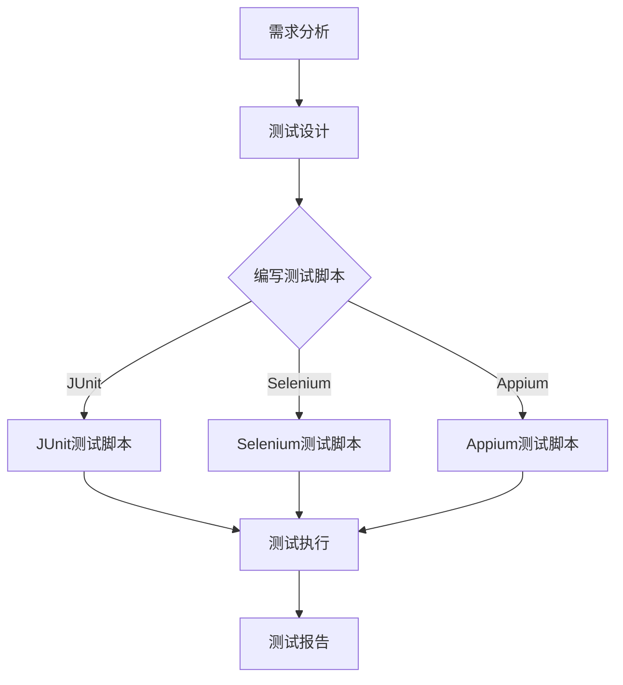

                 

### 背景介绍

百度，作为中国领先的互联网技术公司，近年来在人工智能领域取得了显著的成就。为了保持技术领先地位，百度不断加强研发团队的实力，特别是在自动化测试领域。自动化测试工程师在软件开发和产品发布过程中扮演着至关重要的角色。他们通过编写和维护自动化测试脚本，确保软件质量，提高开发效率，降低人工测试的成本和风险。

2025年，自动化测试工程师的招聘需求将会进一步增加。这不仅是因为软件开发的复杂度不断提高，也由于市场上对于高质量、稳定软件产品的需求日益增长。在百度，自动化测试工程师的职责包括但不限于：设计并执行自动化测试用例、分析测试结果、优化测试流程、维护测试脚本等。

百度对自动化测试工程师的招聘要求较高，除了需要具备扎实的计算机科学基础知识外，还要求候选人熟练掌握自动化测试工具和技术，具备良好的编程能力，能够快速适应新的测试框架和工具。此外，良好的沟通能力和团队合作精神也是不可或缺的。

本文旨在为有意向应聘百度自动化测试工程师岗位的候选人提供一份详细的面试指南，帮助大家了解面试准备的重点，掌握必要的技能和知识，从而顺利通过面试，加入百度的自动化测试团队。

### 核心概念与联系

在自动化测试领域，核心概念与联系是理解和应用自动化测试技术的基础。以下是对核心概念的详细解释，以及如何使用Mermaid流程图来展示它们之间的联系。

#### 自动化测试的定义

自动化测试是指使用自动化测试工具或脚本对软件进行测试的过程。与手动测试相比，自动化测试能够提高测试效率，减少人为错误，并且能够更快速地执行重复性的测试任务。自动化测试主要包括单元测试、集成测试、功能测试、性能测试等。

#### 测试工具和框架

自动化测试工具和框架是执行自动化测试的关键。常见的自动化测试工具有Selenium、Appium、JMeter、JUnit等。这些工具各有特点，适用于不同的测试场景。例如，Selenium是一个开源的Web自动化测试工具，可以用于测试各种Web应用；Appium是一个跨平台的应用自动化测试工具，可以用于测试iOS和Android应用。

测试框架则是为了提高自动化测试的可维护性和复用性而设计的。JUnit和TestNG是最常用的Java测试框架，它们提供了丰富的API和功能，使得编写自动化测试脚本更加容易。

#### 测试流程

自动化测试流程通常包括以下步骤：

1. **需求分析**：确定测试目标，分析测试需求。
2. **测试设计**：设计测试用例，确定测试数据。
3. **测试脚本编写**：根据测试设计编写自动化测试脚本。
4. **测试执行**：运行测试脚本，收集测试结果。
5. **测试报告**：生成测试报告，分析测试结果。

#### Mermaid流程图

为了更直观地展示上述核心概念和联系，我们可以使用Mermaid流程图来表示自动化测试的流程和工具之间的关系。



在这个流程图中，A代表需求分析，B代表测试设计，C代表编写测试脚本。然后，根据不同的测试框架（JUnit、Selenium、Appium），分别生成D、E、F三个测试脚本。这些测试脚本在测试执行阶段（G）运行，并生成测试报告（H）。

通过这个Mermaid流程图，我们可以清晰地看到自动化测试的各个环节以及它们之间的逻辑关系。这对于理解和应用自动化测试技术具有重要意义。

### 核心算法原理 & 具体操作步骤

在自动化测试中，核心算法原理主要涉及测试脚本的编写、执行和结果分析。以下将详细介绍这些核心算法原理，并提供具体的操作步骤。

#### 测试脚本编写

编写自动化测试脚本的第一步是选择合适的测试工具和框架。以Selenium为例，以下是使用Python语言和Selenium编写一个简单的Web页面测试脚本的基本步骤：

1. **安装Selenium**：
   在命令行中，使用以下命令安装Selenium：
   ```bash
   pip install selenium
   ```

2. **导入相关模块**：
   在Python脚本中，需要导入Selenium相关的模块，例如WebDriver。
   ```python
   from selenium import webdriver
   ```

3. **初始化浏览器驱动**：
   根据测试需求，初始化浏览器驱动，例如使用Chrome驱动：
   ```python
   driver = webdriver.Chrome(executable_path='path/to/chromedriver')
   ```

4. **打开网页**：
   使用WebDriver打开需要测试的网页：
   ```python
   driver.get('http://www.example.com')
   ```

5. **执行测试操作**：
   模拟用户在网页上的操作，例如点击按钮、输入文本等：
   ```python
   button = driver.find_element_by_id('my_button')
   button.click()
   input_box = driver.find_element_by_name('input_box')
   input_box.send_keys('Hello, World!')
   ```

6. **获取测试结果**：
   获取网页的当前状态，例如页面标题、元素文本等：
   ```python
   title = driver.title
   print(title)
   ```

7. **关闭浏览器**：
   测试完成后，关闭浏览器驱动：
   ```python
   driver.quit()
   ```

以上步骤可以概括为：
```python
from selenium import webdriver

# 初始化浏览器驱动
driver = webdriver.Chrome(executable_path='path/to/chromedriver')

# 打开网页
driver.get('http://www.example.com')

# 执行测试操作
button = driver.find_element_by_id('my_button')
button.click()
input_box = driver.find_element_by_name('input_box')
input_box.send_keys('Hello, World!')

# 获取测试结果
title = driver.title
print(title)

# 关闭浏览器
driver.quit()
```

#### 测试脚本执行

测试脚本的执行是自动化测试的核心步骤。以下是执行测试脚本的基本步骤：

1. **运行测试脚本**：
   使用测试工具执行测试脚本，例如使用Selenium IDE或直接在命令行中运行Python脚本。

2. **监控测试进度**：
   在测试执行过程中，监控测试进度和结果。例如，使用Selenium的日志功能记录测试步骤和异常。

3. **处理异常**：
   当测试过程中出现异常时，及时处理。例如，使用try-except语句捕获异常并记录错误信息。

4. **生成测试报告**：
   测试执行完成后，生成测试报告，记录测试结果和错误信息。

#### 测试结果分析

测试结果分析是自动化测试的最后一步。以下是分析测试结果的基本步骤：

1. **检查测试覆盖率**：
   分析测试用例的覆盖率，确保测试覆盖到软件的所有功能点和关键路径。

2. **识别缺陷**：
   分析测试结果，识别软件中的缺陷和问题。例如，使用断言（assertions）检查测试结果是否符合预期。

3. **生成报告**：
   根据测试结果生成详细的测试报告，包括测试用例执行情况、缺陷列表、测试覆盖率等。

4. **反馈与改进**：
   将测试报告反馈给开发团队，根据测试结果提出改进建议，优化软件设计和测试流程。

通过上述核心算法原理和具体操作步骤，自动化测试工程师可以高效地编写、执行和分析自动化测试脚本，确保软件质量和开发效率。

### 数学模型和公式 & 详细讲解 & 举例说明

在自动化测试中，数学模型和公式广泛应用于测试覆盖率分析、性能测试、回归测试等领域。以下将详细讲解这些数学模型和公式，并通过具体示例进行说明。

#### 测试覆盖率分析

测试覆盖率是衡量测试质量的重要指标，它表示测试用例覆盖到代码的比例。常见的测试覆盖率指标包括语句覆盖率、分支覆盖率和路径覆盖率。

1. **语句覆盖率**（Statement Coverage）：

   语句覆盖率是指测试用例执行到代码中每一条语句的比例。其计算公式如下：

   $$ 
   语句覆盖率（SC） = \frac{执行语句数}{总语句数} \times 100\% 
   $$

   例如，一个包含100条语句的代码，测试用例执行了70条，则语句覆盖率为：

   $$ 
   SC = \frac{70}{100} \times 100\% = 70\% 
   $$

2. **分支覆盖率**（Branch Coverage）：

   分支覆盖率是指测试用例覆盖到代码中每一条分支的比例。其计算公式如下：

   $$ 
   分支覆盖率（BC） = \frac{执行分支数}{总分支数} \times 100\% 
   $$

   例如，一个包含5个分支的代码，测试用例执行了其中3个分支，则分支覆盖率为：

   $$ 
   BC = \frac{3}{5} \times 100\% = 60\% 
   $$

3. **路径覆盖率**（Path Coverage）：

   路径覆盖率是指测试用例覆盖到代码中每一条路径的比例。其计算公式如下：

   $$ 
   路径覆盖率（PC） = \frac{执行路径数}{总路径数} \times 100\% 
   $$

   路径覆盖通常较为复杂，需要使用动态分析工具或手动分析代码结构来计算。

#### 性能测试

性能测试旨在评估软件在不同负载下的表现。常用的性能测试指标包括响应时间、吞吐量和资源消耗等。

1. **响应时间**（Response Time）：

   响应时间是指系统从接收到请求到返回结果所需的时间。其计算公式如下：

   $$ 
   响应时间（RT） = \frac{总请求时间}{总请求次数} 
   $$

   例如，100个请求的总时间为100秒，则平均响应时间为：

   $$ 
   RT = \frac{100}{100} = 1秒 
   $$

2. **吞吐量**（Throughput）：

   吞吐量是指系统在单位时间内处理请求的能力。其计算公式如下：

   $$ 
   吞吐量（TP） = \frac{总处理请求数}{总时间} 
   $$

   例如，100个请求在10秒内处理完毕，则吞吐量为：

   $$ 
   TP = \frac{100}{10} = 10请求/秒 
   $$

3. **资源消耗**（Resource Consumption）：

   资源消耗是指系统在运行过程中使用的资源，包括CPU、内存、网络等。其计算公式如下：

   $$ 
   资源消耗（RC） = \frac{总资源使用量}{总时间} 
   $$

   例如，系统在10秒内使用了100个CPU核心和500MB内存，则平均资源消耗为：

   $$ 
   RC = \frac{100 + 500}{10} = 60CPU核心/秒 + 50MB/秒 
   $$

#### 回归测试

回归测试是在软件修改后重新进行测试，以确保修改没有引入新的缺陷。常用的回归测试指标包括缺陷密度、缺陷发现率和缺陷修复率。

1. **缺陷密度**（Defect Density）：

   缺陷密度是指单位代码行中的缺陷数量。其计算公式如下：

   $$ 
   缺陷密度（DD） = \frac{总缺陷数}{总代码行数} 
   $$

   例如，一个包含1000行代码的模块发现了5个缺陷，则缺陷密度为：

   $$ 
   DD = \frac{5}{1000} = 0.005缺陷/行 
   $$

2. **缺陷发现率**（Defect Detection Rate）：

   缺陷发现率是指测试过程中发现的缺陷占总缺陷数的比例。其计算公式如下：

   $$ 
   缺陷发现率（DDR） = \frac{测试发现的缺陷数}{总缺陷数} \times 100\% 
   $$

   例如，在100个缺陷中，测试发现了70个，则缺陷发现率为：

   $$ 
   DDR = \frac{70}{100} \times 100\% = 70\% 
   $$

3. **缺陷修复率**（Defect Fix Rate）：

   缺陷修复率是指缺陷在修复后的比例。其计算公式如下：

   $$ 
   缺陷修复率（DFR） = \frac{已修复的缺陷数}{总缺陷数} \times 100\% 
   $$

   例如，在100个缺陷中，已修复了80个，则缺陷修复率为：

   $$ 
   DFR = \frac{80}{100} \times 100\% = 80\% 
   $$

通过上述数学模型和公式的详细讲解，自动化测试工程师可以更准确地评估测试质量、性能和回归测试效果，从而提高软件质量和开发效率。

### 项目实践：代码实例和详细解释说明

在本节中，我们将通过一个具体的自动化测试项目实例，详细解释自动化测试脚本的开发过程，包括开发环境搭建、源代码实现、代码解读与分析以及运行结果展示。

#### 开发环境搭建

首先，我们需要搭建一个自动化测试的开发环境。以下是在Windows系统上使用Python和Selenium搭建开发环境的基本步骤：

1. **安装Python**：
   - 访问Python官方网站（[python.org](https://www.python.org/)）下载并安装Python。
   - 确保安装过程中选择添加Python到系统环境变量。

2. **安装Selenium**：
   - 打开命令行工具，使用以下命令安装Selenium：
     ```bash
     pip install selenium
     ```

3. **安装浏览器驱动**：
   - 根据使用的浏览器下载相应的驱动。例如，对于Chrome，我们需要下载ChromeDriver。
   - 将下载的ChromeDriver放置在系统的PATH环境变量中或指定到脚本中。例如，将ChromeDriver放置在`C:\Tools\chromedriver.exe`，然后在Python脚本中指定：
     ```python
     driver = webdriver.Chrome(executable_path='C:/Tools/chromedriver.exe')
     ```

4. **安装其他依赖**：
   - 根据测试需求，可能需要安装其他依赖，例如页面解析库BeautifulSoup、数据驱动测试库PyTest等。

#### 源代码实现

以下是一个使用Python和Selenium实现的简单自动化测试脚本，用于测试一个在线购物网站的用户登录功能。

```python
from selenium import webdriver
from selenium.webdriver.common.by import By
from selenium.webdriver.common.keys import Keys

# 初始化浏览器驱动
driver = webdriver.Chrome(executable_path='C:/Tools/chromedriver.exe')

# 打开测试网站
driver.get("https://www.example.com/login")

# 定位用户名输入框和密码输入框
username_input = driver.find_element(By.ID, "username")
password_input = driver.find_element(By.ID, "password")

# 输入用户名和密码
username_input.send_keys("test_user")
password_input.send_keys("test_password")

# 点击登录按钮
login_button = driver.find_element(By.ID, "login_button")
login_button.click()

# 获取登录后的页面标题
title = driver.title

# 断言登录成功
assert "Dashboard" in title

# 关闭浏览器
driver.quit()
```

#### 代码解读与分析

1. **初始化浏览器驱动**：
   ```python
   driver = webdriver.Chrome(executable_path='C:/Tools/chromedriver.exe')
   ```
   这一行代码用于初始化Chrome浏览器驱动。`executable_path`参数指定了ChromeDriver的路径。

2. **打开测试网站**：
   ```python
   driver.get("https://www.example.com/login")
   ```
   使用`driver.get()`方法打开指定的登录页面。

3. **定位用户名和密码输入框**：
   ```python
   username_input = driver.find_element(By.ID, "username")
   password_input = driver.find_element(By.ID, "password")
   ```
   使用`find_element()`方法根据ID属性定位用户名和密码输入框。

4. **输入用户名和密码**：
   ```python
   username_input.send_keys("test_user")
   password_input.send_keys("test_password")
   ```
   使用`send_keys()`方法向用户名和密码输入框中输入预设的用户名和密码。

5. **点击登录按钮**：
   ```python
   login_button = driver.find_element(By.ID, "login_button")
   login_button.click()
   ```
   定位登录按钮并使用`click()`方法点击登录。

6. **获取登录后的页面标题**：
   ```python
   title = driver.title
   ```
   使用`title`属性获取当前页面的标题。

7. **断言登录成功**：
   ```python
   assert "Dashboard" in title
   ```
   使用`assert`语句检查页面标题中是否包含"Dashboard"，以验证登录是否成功。

8. **关闭浏览器**：
   ```python
   driver.quit()
   ```
   使用`quit()`方法关闭浏览器。

#### 运行结果展示

1. **运行脚本**：
   - 在命令行中运行脚本：
     ```bash
     python test_login.py
     ```

2. **查看输出**：
   - 如果登录成功，脚本将输出页面标题：
     ```shell
     Dashboard
     ```
   - 如果登录失败，脚本将抛出`AssertionError`，并显示错误消息。

通过上述代码实例和详细解释，我们可以看到自动化测试脚本的开发过程是如何实现的。这个实例展示了从初始化浏览器驱动、定位页面元素、执行操作到结果验证的完整流程。

### 实际应用场景

自动化测试在实际项目中具有重要的应用场景，能够显著提高软件质量和开发效率。以下列举几个典型的实际应用场景：

#### 1. 跨浏览器测试

随着Web应用的普及，不同的浏览器（如Chrome、Firefox、Safari、Edge）和不同的操作系统（如Windows、macOS、Linux）对Web应用的兼容性要求越来越高。通过自动化测试，可以确保Web应用在不同浏览器和操作系统上的稳定性和一致性。例如，使用Selenium可以编写跨浏览器测试脚本，自动化测试Web应用的界面和功能，确保在所有目标浏览器上都能正常运行。

#### 2. 性能测试

性能测试是评估软件在特定负载下的响应时间、吞吐量和资源消耗等性能指标。自动化性能测试可以模拟大量用户同时访问系统，测量系统的性能表现，帮助开发者识别性能瓶颈，优化系统架构和代码。例如，使用JMeter可以创建负载测试脚本，模拟成千上万的用户请求，分析系统的性能表现，并根据测试结果进行调整。

#### 3. 移动应用测试

随着移动设备的普及，移动应用测试变得尤为重要。自动化测试可以帮助开发者快速验证移动应用的界面、功能、性能等。例如，使用Appium可以编写自动化测试脚本，模拟用户在iOS和Android设备上的操作，确保移动应用在不同设备和操作系统上的稳定性和一致性。

#### 4. 回归测试

在软件迭代开发过程中，每次代码更改都可能引入新的缺陷。回归测试是确保修改不会破坏现有功能的关键。通过自动化回归测试，可以快速验证新代码是否引入了新的缺陷，确保软件的持续稳定。例如，使用JUnit或TestNG可以编写自动化测试用例，自动化执行回归测试，及时发现并修复缺陷。

#### 5. 夜间自动化测试

为了提高开发效率，许多团队采用敏捷开发模式，频繁发布新版本。夜间自动化测试可以在无人干预的情况下，自动执行一系列测试用例，确保每次发布前的代码质量。例如，使用CI/CD工具（如Jenkins、GitLab CI）可以自动化部署代码并执行测试，确保新版本在发布前通过所有测试。

通过这些实际应用场景，自动化测试能够显著提高软件质量和开发效率，降低测试成本和风险，成为现代软件开发中不可或缺的一部分。

### 工具和资源推荐

在自动化测试领域，有许多优秀的工具和资源可供开发者学习和使用。以下是一些推荐的学习资源、开发工具和相关论文著作。

#### 学习资源推荐

1. **书籍**：
   - 《Selenium WebDriver自动化测试实战》
   - 《Appium自动化测试实战》
   - 《软件测试的艺术》

2. **在线教程和课程**：
   - [Selenium官方文档](https://www.selenium.dev/documentation/)
   - [Appium官方文档](https://appium.io/docs/)
   - [Python官方教程](https://docs.python.org/zh-cn/3/tutorial/index.html)

3. **博客和网站**：
   - [TestGuild](https://www.testguild.com/)
   - [TestPython](https://testpython.com/)
   - [云栖社区自动化测试专栏](https://yq.aliyun.com/groups/2394544)

#### 开发工具框架推荐

1. **自动化测试工具**：
   - Selenium：适用于Web自动化测试。
   - Appium：适用于移动应用自动化测试。
   - JMeter：适用于性能测试。
   - JUnit、TestNG：适用于单元测试和集成测试。

2. **IDE和编辑器**：
   - IntelliJ IDEA：功能强大的Java IDE。
   - PyCharm：适用于Python开发的IDE。
   - VSCode：跨平台轻量级代码编辑器。

3. **持续集成工具**：
   - Jenkins：开源的持续集成工具。
   - GitLab CI：与GitLab集成的持续集成工具。

#### 相关论文著作推荐

1. **论文**：
   - "An Overview of Automated Software Testing"
   - "Automated Testing of Mobile Applications"
   - "Performance Testing in Agile Development"

2. **著作**：
   - 《自动化测试实战》
   - 《性能测试实战》
   - 《软件测试技术》

这些工具和资源为自动化测试工程师提供了丰富的学习和实践机会，帮助他们掌握自动化测试的核心技术和最佳实践。

### 总结：未来发展趋势与挑战

随着软件行业的不断发展，自动化测试已经成为确保软件质量和提高开发效率的重要手段。在未来，自动化测试将继续向更高效、更智能的方向发展。以下是对自动化测试未来发展趋势和挑战的总结：

#### 发展趋势

1. **智能化测试**：
   人工智能（AI）和机器学习（ML）技术的应用将使得自动化测试更加智能化。通过分析历史测试数据，AI算法可以预测潜在的问题，从而提前进行预防性测试。智能化的测试工具将能够自动生成测试用例，优化测试流程，提高测试覆盖率。

2. **多技术融合**：
   自动化测试将与其他领域的技术（如DevOps、云计算、大数据）融合，形成更强大的测试解决方案。例如，在DevOps环境中，自动化测试将无缝集成到持续集成和持续部署（CI/CD）流程中，实现自动化部署和测试的有机结合。

3. **无代码/低代码测试**：
   随着无代码/低代码技术的发展，自动化测试将不再局限于专业的测试工程师。普通开发人员和非技术人员也可以通过图形界面或拖拽操作，快速构建自动化测试流程，从而降低测试门槛。

#### 挑战

1. **测试数据的复杂性**：
   随着软件规模的扩大和复杂度的增加，测试数据的复杂性也在不断增加。如何有效地管理和利用测试数据，确保测试用例的全面性和准确性，是自动化测试面临的一大挑战。

2. **测试脚本的维护**：
   自动化测试脚本需要不断更新和维护，以适应软件的变化。随着测试用例的增加，测试脚本的维护成本也会相应增加。如何高效地管理和维护测试脚本，确保其稳定性和可维护性，是一个重要的问题。

3. **测试环境的多样性**：
   自动化测试需要在不同操作系统、浏览器、设备上运行。如何有效地管理和配置测试环境，确保测试的一致性和可靠性，是自动化测试需要解决的一个关键问题。

4. **测试质量的评估**：
   如何全面、客观地评估自动化测试的质量，是一个复杂的任务。测试覆盖率、测试执行速度、测试结果的准确性等指标虽然能够提供一定的参考，但仍然需要更完善的评估方法和工具。

总之，自动化测试的未来充满机遇和挑战。通过不断探索新技术、优化测试流程和工具，自动化测试将在软件行业中发挥更加重要的作用，为开发团队带来更高的生产力和更优质的软件产品。

### 附录：常见问题与解答

在准备自动化测试工程师面试的过程中，可能会遇到一些常见问题。以下是一些常见问题及其解答，以帮助您更好地准备面试。

#### 1. 自动化测试与手动测试有什么区别？

自动化测试与手动测试的主要区别在于执行方式。手动测试由测试人员手动执行测试用例，而自动化测试通过编写脚本，使用自动化测试工具执行测试。自动化测试的优点包括：

- **效率高**：自动化测试可以快速重复执行测试用例，节省时间和人力资源。
- **准确性高**：自动化测试可以减少人为错误，提高测试准确性。
- **可维护性高**：自动化测试脚本可以方便地更新和维护，适应软件的变更。

#### 2. 什么是测试覆盖率？

测试覆盖率是衡量测试质量的重要指标，表示测试用例覆盖到代码的比例。常见的测试覆盖率包括：

- **语句覆盖率**：测试用例执行到代码中每一条语句的比例。
- **分支覆盖率**：测试用例覆盖到代码中每一条分支的比例。
- **路径覆盖率**：测试用例覆盖到代码中每一条路径的比例。

高测试覆盖率有助于确保软件的质量，减少缺陷。

#### 3. 如何选择合适的自动化测试工具？

选择合适的自动化测试工具取决于多种因素，包括：

- **测试类型**：例如，Web应用测试可以选择Selenium，移动应用测试可以选择Appium。
- **技术栈**：根据项目使用的技术栈选择合适的工具，例如Java项目可以选择Selenium，Python项目可以选择PyTest。
- **开发资源**：考虑团队的资源和技能，选择易于学习和使用的工具。

#### 4. 自动化测试的优缺点有哪些？

自动化测试的优点包括：

- **高效**：自动化测试可以快速执行重复性的测试用例，节省时间和人力资源。
- **准确**：自动化测试可以减少人为错误，提高测试准确性。
- **可重复性**：自动化测试脚本可以重复执行，确保测试的一致性和可重复性。

自动化测试的缺点包括：

- **初期成本高**：编写和维护自动化测试脚本需要时间和资源。
- **维护成本高**：随着软件的变更，自动化测试脚本需要不断更新和维护。
- **依赖性高**：自动化测试依赖于测试工具和脚本，如果工具或脚本出现问题，测试会受到影响。

#### 5. 如何处理自动化测试中的异常情况？

在自动化测试中，可能会遇到各种异常情况，例如页面元素未找到、网络问题等。以下是一些处理异常情况的方法：

- **断言**：使用断言检查测试结果是否符合预期，例如使用`assert`语句。
- **异常处理**：使用异常处理机制捕获并处理异常，例如使用`try-except`语句。
- **日志记录**：记录测试过程中的错误和异常，便于分析和调试。

通过以上常见问题与解答，希望能帮助您更好地准备自动化测试工程师的面试。

### 扩展阅读 & 参考资料

为了进一步了解自动化测试领域的前沿知识和最佳实践，以下是一些建议的扩展阅读和参考资料：

#### 书籍

1. **《Selenium WebDriver自动化测试实战》**：详细介绍如何使用Selenium进行Web自动化测试，适合初学者和有经验的测试工程师。
2. **《Appium自动化测试实战》**：深入探讨如何使用Appium进行移动应用自动化测试，涵盖iOS和Android平台的实战案例。
3. **《软件测试的艺术》**：经典的软件测试入门书籍，全面介绍软件测试的基本概念、方法和实践。

#### 在线教程和课程

1. **[Selenium官方文档](https://www.selenium.dev/documentation/)**：Selenium的官方文档，提供详细的API和使用指南。
2. **[Appium官方文档](https://appium.io/docs/)**：Appium的官方文档，包含丰富的移动应用自动化测试案例。
3. **[Python官方教程](https://docs.python.org/zh-cn/3/tutorial/index.html)**：Python的官方教程，学习Python编程基础。

#### 博客和网站

1. **[TestGuild](https://www.testguild.com/)**：专注于软件测试的博客，提供大量测试技巧和工具介绍。
2. **[TestPython](https://testpython.com/)**：Python自动化测试资源分享平台，涵盖各种测试框架和工具。
3. **[云栖社区自动化测试专栏](https://yq.aliyun.com/groups/2394544)**：阿里巴巴云栖社区自动化测试专栏，分享自动化测试的最佳实践和案例分析。

#### 相关论文和著作

1. **“An Overview of Automated Software Testing”**：一篇综述性论文，详细介绍自动化软件测试的基本概念和发展趋势。
2. **“Automated Testing of Mobile Applications”**：探讨移动应用自动化测试的方法和挑战，适合移动应用测试工程师。
3. **“Performance Testing in Agile Development”**：分析敏捷开发中性能测试的重要性和实践方法。

通过阅读上述书籍、教程和论文，您可以更深入地了解自动化测试的原理、方法和工具，为成为一名优秀的自动化测试工程师打下坚实的基础。

