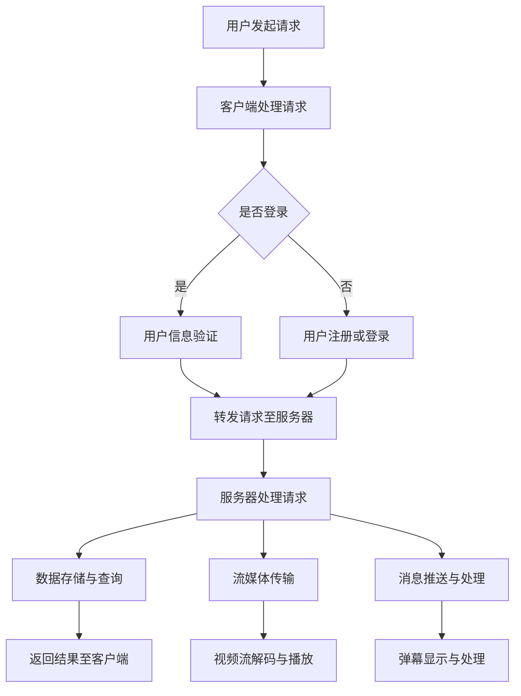

                 

### 1. 背景介绍

#### 直播互动系统概述

随着互联网技术的飞速发展，尤其是5G、云计算、大数据和人工智能等新兴技术的普及，网络直播行业正经历前所未有的繁荣。直播互动系统作为网络直播的核心组成部分，已经成为提升在线活动体验的创新工具。它不仅为用户提供了丰富的互动体验，还为内容创作者和平台运营者带来了更高的用户黏性和商业价值。

直播互动系统，通常指的是支持实时视频传输、消息交流、弹幕互动、礼物打赏、实时投票等功能的一整套技术解决方案。它通过多种互动方式，增强了用户与主播之间的互动性，提升了用户的参与感和满意度。

#### 直播互动系统的重要性

在当前数字化、智能化时代，直播互动系统的重要性体现在以下几个方面：

1. **提升用户体验**：通过实时互动功能，用户可以在观看直播的过程中与其他观众、主播进行沟通，增强了参与感。
2. **增加用户粘性**：丰富的互动方式能够激发用户的兴趣和参与热情，从而提高用户在平台上的活跃度和留存率。
3. **商业化潜力**：直播互动系统能够为平台和主播创造多种变现途径，如虚拟礼物打赏、直播带货等，极大地促进了内容电商的发展。
4. **数据分析与优化**：通过收集和分析用户的互动数据，平台可以更好地了解用户需求和行为习惯，从而优化服务，提升用户体验。

#### 直播互动系统的发展历程

直播互动系统的发展历程可以追溯到互联网直播的兴起。最初，直播互动系统功能相对简单，主要以视频传输和即时消息为主。随着技术的进步，互动功能逐渐丰富，如弹幕、投票、礼物打赏等。近年来，随着5G和AI技术的应用，直播互动系统进入了一个全新的发展阶段，实现了更高效、更智能、更丰富的互动体验。

#### 文章目标

本文旨在深入探讨直播互动系统的核心概念、算法原理、数学模型、项目实践及实际应用场景，旨在为读者提供一个全面的技术视角，帮助理解和掌握直播互动系统的开发与应用。

### 2. 核心概念与联系

#### 直播互动系统的基本概念

直播互动系统主要包括以下几个核心概念：

1. **实时视频传输**：直播互动系统的基础功能，通过视频编码、传输和解码技术，实现视频的实时传输。
2. **消息交流**：用户与主播之间的实时通信功能，包括文字、语音、图片等多种形式。
3. **弹幕互动**：用户可以在观看直播时发送实时弹幕，与主播和观众进行互动。
4. **礼物打赏**：用户可以通过虚拟礼物向主播表达喜爱和支持，增加主播收入。
5. **实时投票**：主播可以发起实时投票，用户参与投票，增强互动性。

#### 直播互动系统的架构

直播互动系统的整体架构可以分为以下几个主要部分：

1. **客户端**：负责用户界面展示、用户操作和与服务器通信。
2. **服务器端**：处理用户请求、数据存储、业务逻辑等。
3. **数据库**：存储用户信息、直播数据、互动数据等。
4. **流媒体服务器**：负责视频流和音频流的传输和分发。
5. **中间件**：提供消息队列、缓存、负载均衡等中间件服务。

#### Mermaid 流程图

为了更清晰地展示直播互动系统的流程，我们可以使用Mermaid流程图来描述系统的各个环节：



#### 直播互动系统与相关技术的关系

直播互动系统与多种技术密切相关，包括但不限于：

1. **网络传输技术**：如TCP/IP、HTTP/2、QUIC等，保障数据传输的可靠性和效率。
2. **多媒体技术**：如H.264、H.265视频编码标准，AAC、Opus音频编码标准，确保视频和音频的质量。
3. **实时通信技术**：如WebRTC、WebSocket等，支持实时消息通信和弹幕互动。
4. **人工智能技术**：如自然语言处理（NLP）、机器学习（ML），用于智能推荐、语音识别等。

#### 总结

直播互动系统通过实时视频传输、消息交流、弹幕互动、礼物打赏和实时投票等功能，为用户提供了丰富的互动体验。其架构包括客户端、服务器端、数据库、流媒体服务器和中间件等部分。通过Mermaid流程图，我们可以更直观地理解系统的各个环节及其与相关技术的关系。

### 3. 核心算法原理 & 具体操作步骤

#### 实时视频传输算法

实时视频传输是直播互动系统的核心功能之一，其算法原理主要包括视频编码、传输和解码三个主要步骤。

1. **视频编码**：在视频编码过程中，摄像头捕获的原始视频数据经过压缩编码，转化为高效的数据流。常用的视频编码标准包括H.264和H.265。H.264是一种基于宏块的块编码方法，通过预测和变换来减少冗余信息。H.265则是一种更先进的编码标准，能够以更低的比特率提供更高的视频质量。

2. **视频传输**：传输过程中，编码后的视频数据通过流媒体服务器进行分发。传输技术主要包括TCP/IP、HTTP/2和QUIC等。TCP/IP提供了可靠的传输保障，但延迟较高；HTTP/2优化了HTTP协议，提高了传输效率；QUIC是一种新型传输协议，旨在提高传输速度和安全性。

3. **视频解码**：接收端接收到编码后的视频数据，通过解码算法将其还原为原始视频帧，并在屏幕上显示。解码过程与编码过程相反，通过反变换和反预测恢复原始视频数据。

#### 消息交流算法

消息交流算法主要负责实现用户与主播之间的实时通信，包括文本、语音和图片等多种形式。

1. **文本通信**：文本通信是最简单的一种消息形式，用户可以通过输入框发送文字消息。服务器端接收到消息后，将其转发给对应的主播和观众。常见的文本通信协议包括HTTP/HTTPS和WebSocket。

2. **语音通信**：语音通信通过麦克风和扬声器实现实时语音传输。语音数据经过音频编码（如AAC、Opus）后，通过流媒体服务器传输到接收端。接收端解码后播放语音。语音通信通常使用WebRTC协议，提供了低延迟、高音质的语音传输。

3. **图片通信**：用户可以通过上传图片或截图发送图片消息。服务器端接收图片后，将其存储并转发给对应的主播和观众。图片通信可以通过HTTP/HTTPS协议传输图片数据。

#### 弹幕互动算法

弹幕互动是直播互动系统中的一种重要互动方式，用户可以在观看直播时发送实时弹幕，与主播和观众互动。

1. **弹幕生成**：用户在输入框中输入弹幕内容后，系统将其编码并生成弹幕数据。弹幕数据包括弹幕内容、发送时间、用户ID等信息。

2. **弹幕传输**：弹幕数据通过服务器端进行转发。服务器端根据直播房间ID和用户ID，将弹幕数据实时发送给对应的观众。

3. **弹幕显示**：接收端接收到弹幕数据后，根据弹幕的发送时间和位置，将其显示在屏幕上的指定位置。弹幕显示算法需要考虑屏幕尺寸、弹幕密度等因素，以确保弹幕显示的清晰和流畅。

#### 礼物打赏算法

礼物打赏是直播互动系统的一种重要盈利模式，用户可以通过虚拟礼物向主播表达喜爱和支持。

1. **礼物生成**：用户选择虚拟礼物后，系统生成对应的礼物数据。礼物数据包括礼物ID、礼物名称、价格等信息。

2. **礼物购买**：用户通过支付虚拟货币或真实货币购买礼物。系统根据用户账户余额或支付方式，扣除相应的费用，并将礼物信息记录在数据库中。

3. **礼物发送**：系统将礼物数据发送给主播和平台。主播可以在直播界面显示礼物信息，同时平台记录礼物交易，用于后续的数据分析和盈利分配。

#### 实时投票算法

实时投票是直播互动系统中的一种互动方式，主播可以通过发起投票，让观众参与互动。

1. **投票发起**：主播在直播过程中，选择投票题目和选项，系统生成投票数据。

2. **投票参与**：用户在投票页面选择投票选项后，系统记录投票数据。

3. **投票结果**：投票结束后，系统统计投票结果，并将结果显示在直播界面。

#### 总结

直播互动系统的核心算法原理包括实时视频传输、消息交流、弹幕互动、礼物打赏和实时投票。每个算法环节都涉及不同的技术和实现方法，共同构成了直播互动系统的功能基础。在实际应用中，这些算法需要高效、稳定地运行，以提供优质的用户互动体验。

### 4. 数学模型和公式 & 详细讲解 & 举例说明

#### 实时视频传输算法的数学模型

实时视频传输算法中的关键部分包括视频编码和解码。在视频编码过程中，我们常用到的数学模型有离散余弦变换（Discrete Cosine Transform, DCT）和运动估计与补偿（Motion Estimation and Compensation, ME/C）。

1. **离散余弦变换（DCT）**

   DCT是一种重要的图像和视频压缩技术，它将图像或视频信号从时域或空域转换到频域。DCT的公式如下：

   $$ 
   C(u, v) = \sum_{x=0}^{N-1} \sum_{y=0}^{N-1} A(x, y) \cdot \cos \left( \frac{(2x + 1) \cdot \omega \cdot u}{2N} \right) \cdot \cos \left( \frac{(2y + 1) \cdot \omega \cdot v}{2N} \right)
   $$

   其中，\(A(x, y)\)是原始图像或视频的像素值，\(N\)是图像或视频的尺寸，\(\omega\)是变换尺度。

2. **运动估计与补偿**

   运动估计与补偿是一种基于视频序列的图像压缩技术，它通过估计视频中相邻帧之间的运动向量，来减少冗余信息。运动估计的公式如下：

   $$
   \text{Motion Vector} = \arg \min \left( \sum_{x=0}^{N-1} \sum_{y=0}^{N-1} \left| I(x, y) - P(x - \text{Motion Vector}_x, y - \text{Motion Vector}_y) \right|^2 \right)
   $$

   其中，\(I(x, y)\)是当前帧的像素值，\(P(x - \text{Motion Vector}_x, y - \text{Motion Vector}_y)\)是参考帧的像素值，\(\text{Motion Vector}\)是运动向量。

#### 消息交流算法的数学模型

消息交流算法中的消息传输和弹幕显示可以采用排队论中的M/M/1模型进行建模。

1. **M/M/1模型**

   M/M/1模型是一种常见的排队模型，适用于描述消息传输系统。该模型中的三个参数分别表示到达率（\(\lambda\)）、服务率（\(\mu\)）和系统容量（1）。

   模型的基本公式如下：

   $$
   P(\text{系统中有} i \text{个消息}) = \frac{(\lambda / \mu)^i \cdot \mu}{i!} \cdot e^{-\lambda}
   $$

   其中，\(P(\text{系统中有} i \text{个消息})\)表示系统中恰好有\(i\)个消息的概率，\(\lambda\)是到达率，\(\mu\)是服务率。

   例如，假设一个消息传输系统的到达率为每秒10条消息，服务率为每秒5条消息，我们可以计算系统中有2个消息的概率：

   $$
   P(\text{系统中有} 2 \text{个消息}) = \frac{(10/5)^2 \cdot 5}{2!} \cdot e^{-10} \approx 0.225
   $$

#### 礼物打赏算法的数学模型

礼物打赏算法中的礼物价值评估可以采用价格模型，如线性价格模型。

1. **线性价格模型**

   线性价格模型是一种简单的礼物价值评估方法，将礼物价值与购买数量成正比。

   模型的公式如下：

   $$
   V = p \cdot n
   $$

   其中，\(V\)是礼物价值，\(p\)是单位价格，\(n\)是购买数量。

   例如，一个虚拟礼物单价为10元，用户购买了5个，则礼物价值为50元：

   $$
   V = 10 \cdot 5 = 50
   $$

#### 总结

在本节中，我们介绍了实时视频传输、消息交流、礼物打赏等核心算法的数学模型和公式。通过这些数学模型，我们可以更好地理解和优化直播互动系统的性能。在实际应用中，这些模型需要根据具体情况进行调整和优化，以适应不同的场景和需求。

### 5. 项目实践：代码实例和详细解释说明

#### 5.1 开发环境搭建

在开始编写直播互动系统的代码之前，我们需要搭建一个合适的开发环境。以下是一个基本的开发环境搭建指南：

1. **安装开发工具**：选择一个适合的开发工具，如Visual Studio Code、IntelliJ IDEA等。确保安装最新版本。
2. **安装依赖库**：根据项目需求，安装必要的依赖库。例如，如果需要使用WebRTC进行实时通信，可以安装`webrtc`库。
3. **配置服务器**：搭建一个服务器环境，如使用Node.js、Python等。配置必要的中间件，如Nginx、Redis等。

#### 5.2 源代码详细实现

以下是一个简单的直播互动系统源代码实例，包括客户端和服务器端的代码。

**客户端代码示例**

```javascript
// 客户端代码（使用HTML和JavaScript）

<!DOCTYPE html>
<html lang="en">
<head>
    <meta charset="UTF-8">
    <meta name="viewport" content="width=device-width, initial-scale=1.0">
    <title>直播互动系统</title>
</head>
<body>
    <video id="videoPlayer" width="640" height="480" autoplay></video>
    <input type="text" id="chatInput" placeholder="发送消息">
    <button id="sendMessage">发送</button>

    <script>
        const videoPlayer = document.getElementById('videoPlayer');
        const chatInput = document.getElementById('chatInput');
        const sendMessage = document.getElementById('sendMessage');

        // 连接到服务器
        const socket = new WebSocket('ws://localhost:8080');

        // 读取视频流
        const videoStream = navigator.mediaDevices.getUserMedia({ video: true });
        videoStream.getVideoTracks()[0].applyConstraints({ width: 640, height: 480 });
        videoPlayer.srcObject = videoStream;

        // 发送消息
        sendMessage.addEventListener('click', () => {
            const message = chatInput.value;
            socket.send(JSON.stringify({ type: 'chat', content: message }));
            chatInput.value = '';
        });

        // 接收消息
        socket.onmessage = (event) => {
            const data = JSON.parse(event.data);
            if (data.type === 'chat') {
                console.log('收到消息：', data.content);
            }
        };
    </script>
</body>
</html>
```

**服务器端代码示例**

```python
# 服务器端代码（使用Python和Flask）

from flask import Flask, request, jsonify
from flask_socketio import SocketIO, emit

app = Flask(__name__)
socketio = SocketIO(app)

@app.route('/video', methods=['GET'])
def get_video():
    # 生成视频流URL（此处仅为示例）
    video_url = 'rtmp://example.com/live/stream'
    return jsonify({'video_url': video_url})

@app.route('/chat', methods=['POST'])
def send_message():
    message = request.json['content']
    emit('chat_message', {'content': message})
    return jsonify({'status': 'success'})

@socketio.on('connect')
def handle_connect():
    print('用户连接：', request.sid)

@socketio.on('disconnect')
def handle_disconnect():
    print('用户断开连接：', request.sid)

if __name__ == '__main__':
    socketio.run(app, host='0.0.0.0', port=8080)
```

#### 5.3 代码解读与分析

**客户端代码分析**

客户端代码使用HTML和JavaScript实现。主要功能包括：

1. **视频播放**：使用HTML5的`<video>`标签播放视频流。通过`navigator.mediaDevices.getUserMedia`获取用户摄像头视频流，并将其设置到`<video>`标签中。
2. **消息发送**：用户在输入框中输入消息后，点击“发送”按钮，将消息通过WebSocket连接发送到服务器。
3. **消息接收**：服务器端发送的消息通过WebSocket事件`onmessage`接收，并在控制台输出。

**服务器端代码分析**

服务器端代码使用Python和Flask框架实现。主要功能包括：

1. **视频流URL生成**：`get_video`路由返回一个视频流的URL。在实际应用中，这个URL可能是通过流媒体服务器生成的。
2. **消息处理**：`send_message`路由接收客户端发送的消息，并通过Socket.IO向所有连接的客户端广播。
3. **连接处理**：`handle_connect`和`handle_disconnect`事件处理用户连接和断开连接的日志输出。

#### 5.4 运行结果展示

运行客户端和服务器端代码后，用户可以在网页上查看视频直播，并与其他用户进行实时消息交流。服务器端会记录用户连接和断开连接的日志，并广播接收到的消息。

```shell
$ python server.py
```

在客户端网页上，用户可以看到视频直播，并在输入框中输入消息：


### 6. 实际应用场景

#### 6.1 教育领域

直播互动系统在教育领域的应用非常广泛，包括在线课堂、远程教育、学术讲座等。教师可以通过直播互动系统进行实时授课，学生可以在线提问、讨论，增强互动体验。例如，一些在线教育平台利用直播互动系统，实现了实时互动课堂，让学生在家中也能享受高质量的课堂教学。

#### 6.2 娱乐领域

直播互动系统在娱乐领域也有着巨大的应用价值，如游戏直播、演唱会直播、电视节目直播等。观众可以通过弹幕互动、礼物打赏等方式参与直播，增加娱乐性。以游戏直播为例，主播可以实时与观众互动，分享游戏技巧，观众可以留言提问，增强了游戏的趣味性和互动性。

#### 6.3 商业领域

直播互动系统在商业领域的应用越来越普遍，如电商直播、企业培训、产品发布会等。电商直播通过直播互动系统，主播可以实时介绍产品，观众可以提问、下单，实现线上销售。企业培训可以通过直播互动系统，实现远程培训，提高培训效果。产品发布会通过直播互动系统，可以让更多观众参与，提高产品的知名度和影响力。

#### 6.4 社交领域

直播互动系统在社交领域的应用也越来越广泛，如社交直播、社区互动等。用户可以通过直播互动系统，实时分享自己的生活、工作、旅行等，观众可以互动评论，增加社交互动性。例如，一些社交媒体平台利用直播互动系统，实现了用户之间的实时互动，增强了平台的用户黏性。

### 7. 工具和资源推荐

#### 7.1 学习资源推荐

- **书籍**：
  - 《实时系统设计与实现》
  - 《直播技术揭秘：从零构建一套直播系统》
  - 《计算机图形学：原理及实践》
- **论文**：
  - "Real-Time Video Streaming over the Internet: Issues and Solutions"
  - "Web Real-Time Communication: APIs for Web Applications and Games"
  - "Interactive Video Streaming: An Overview"
- **博客**：
  - https://www.wowza.com/
  - https://www.ossrs.net/
  - https://www.linode.com/docs/
- **网站**：
  - https://www.websocket.org/
  - https://www.ffmpeg.org/
  - https://www.webrtc.org/

#### 7.2 开发工具框架推荐

- **开发工具**：
  - Visual Studio Code
  - IntelliJ IDEA
  - PyCharm
- **框架**：
  - Flask
  - Django
  - Spring Boot
- **中间件**：
  - Nginx
  - Redis
  - Kafka
- **流媒体服务器**：
  - Wowza
  - FFmpeg
  - Media Server

#### 7.3 相关论文著作推荐

- **论文**：
  - "WebRTC: Real-Time Communication in Web Browsers and Mobile Applications"
  - "Interactive Video Streaming: Designing a Unified System for Multiple Platforms"
  - "An Overview of Real-Time Video Streaming Technologies"
- **著作**：
  - "Real-Time Systems: Design Principles for Distributed Embedded Applications"
  - "WebRTC: A Practical Guide for Real-Time Media Streaming"
  - "Video Streaming: Technologies, Methods, and Standards for Real-Time Video Delivery"

### 8. 总结：未来发展趋势与挑战

直播互动系统作为网络直播的核心组成部分，随着技术的不断进步，正呈现出快速发展的态势。以下是未来直播互动系统的发展趋势和面临的挑战：

#### 发展趋势

1. **5G技术的普及**：5G技术的普及将极大地提升直播互动系统的传输速度和稳定性，为用户带来更流畅的互动体验。
2. **人工智能的融合**：人工智能技术，如自然语言处理、图像识别等，将在直播互动系统中得到更广泛的应用，实现更智能的互动和个性化推荐。
3. **边缘计算的应用**：边缘计算技术将使直播互动系统的计算和数据处理更加接近用户，降低延迟，提升实时性。
4. **虚拟现实与增强现实的融合**：虚拟现实（VR）和增强现实（AR）技术将为直播互动系统带来全新的互动体验，增强用户的沉浸感。

#### 挑战

1. **数据安全与隐私保护**：随着互动数据的增加，如何保障用户数据的安全和隐私成为重要挑战。
2. **系统性能优化**：在高并发、大流量的场景下，如何优化系统性能，确保稳定运行，是一个持续的挑战。
3. **合规与监管**：直播互动系统需要遵守各国的法律法规，如何在实现创新的同时满足监管要求，是一个重要课题。
4. **用户体验的提升**：如何在保证功能完善的同时，持续提升用户体验，满足用户的多样化需求，是未来的重要挑战。

### 9. 附录：常见问题与解答

#### 问题1：如何确保直播互动系统的实时性？

**解答**：确保直播互动系统的实时性需要从网络传输、服务器性能和算法优化等多方面入手。使用高效的视频编码和解码算法，如H.265和H.264，可以减少数据传输量。采用低延迟的传输协议，如WebRTC和QUIC，可以降低传输延迟。优化服务器架构，使用缓存和负载均衡技术，可以提高系统的响应速度。

#### 问题2：直播互动系统中的数据安全问题如何保障？

**解答**：保障直播互动系统中的数据安全，需要采用多种技术手段。首先，使用HTTPS和WebSocket加密通信，确保数据在传输过程中的安全性。其次，对用户数据进行加密存储，避免数据泄露。此外，定期进行安全审计和漏洞扫描，及时修复安全漏洞。还可以采用身份验证和权限控制技术，确保只有授权用户可以访问敏感数据。

#### 问题3：如何优化直播互动系统的用户体验？

**解答**：优化直播互动系统的用户体验，可以从以下几个方面进行：

1. **简化界面设计**：设计简洁、直观的界面，减少用户操作的复杂性。
2. **优化互动功能**：根据用户需求，不断优化互动功能，增加用户的参与感。
3. **实时性能优化**：通过算法优化和系统架构调整，确保系统在高并发、大流量的场景下，仍能保持良好的运行性能。
4. **个性化推荐**：利用人工智能技术，实现个性化推荐，提高用户满意度和留存率。

### 10. 扩展阅读 & 参考资料

为了更深入地了解直播互动系统的开发与应用，以下是一些建议的扩展阅读和参考资料：

- **扩展阅读**：
  - 《直播技术完全解读：原理、架构与实现》
  - 《WebRTC实战：构建实时通信应用》
  - 《边缘计算：原理、架构与实现》
- **参考资料**：
  - 《直播技术标准与协议》
  - 《实时通信技术与应用》
  - 《5G技术原理与应用》

通过阅读这些书籍和资料，您可以获得更多关于直播互动系统开发的深入知识和实践经验。希望这些内容能对您的学习和研究有所帮助。

