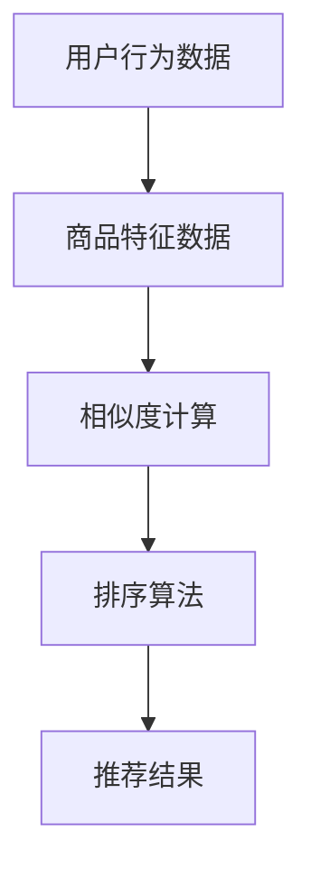

                 

关键词：相关性排序、电商应用、推荐系统、算法原理、数学模型、项目实践、实际应用场景、未来展望

> 摘要：本文将探讨相关性排序在电商领域的应用，深入分析其在推荐系统中的重要性，并详细介绍核心算法原理、数学模型、项目实践以及实际应用场景。通过本文的阅读，读者将对该领域有更深入的理解，并能够将其应用于实际项目中。

## 1. 背景介绍

随着互联网的快速发展，电商行业已成为全球经济增长的重要驱动力。消费者在购物时，往往面对海量的商品选择，如何在这些商品中快速找到自己需要的，成为电商平台的挑战之一。相关性排序技术应运而生，旨在提高用户购物体验，提升销售额。

### 1.1 电商行业现状

全球电商市场规模持续扩大，各大电商平台纷纷推出个性化推荐功能，以提高用户黏性和转化率。据统计，2022年全球电商市场规模已达到4.89万亿美元，同比增长8.5%。随着5G、人工智能等新技术的普及，电商行业正迎来新一轮的发展机遇。

### 1.2 相关性排序的重要性

相关性排序在电商推荐系统中具有至关重要的地位。它通过对用户历史行为和商品特征的分析，将最符合用户需求的商品推荐给用户，从而提升用户满意度和购物转化率。

## 2. 核心概念与联系

在介绍相关性排序的具体算法原理之前，我们需要明确几个核心概念，并展示其相互之间的联系。

### 2.1 用户行为分析

用户行为分析是相关性排序的基础，包括浏览历史、购买记录、收藏行为等。通过对这些行为的分析，我们可以了解用户的兴趣和偏好。

### 2.2 商品特征提取

商品特征提取是将商品信息转化为可供算法处理的数据。常见的方法包括商品分类、属性提取、关键词提取等。

### 2.3 相似度计算

相似度计算是相关性排序的关键步骤，用于评估用户和商品之间的匹配程度。常见的相似度计算方法包括余弦相似度、皮尔逊相关系数等。

### 2.4 排序算法

排序算法用于根据相似度计算结果对商品进行排序，以实现个性化推荐。常见的排序算法包括基于内容的推荐、协同过滤等。

### 2.5 Mermaid 流程图

以下是一个简化的Mermaid流程图，展示了相关性排序的基本流程：



## 3. 核心算法原理 & 具体操作步骤

### 3.1 算法原理概述

相关性排序算法的核心目标是根据用户历史行为和商品特征，计算用户与商品之间的相似度，并根据相似度对商品进行排序，从而实现个性化推荐。

### 3.2 算法步骤详解

#### 3.2.1 数据预处理

1. 用户行为数据：对用户历史行为数据进行清洗，去除无效数据和噪声数据。
2. 商品特征数据：对商品特征数据进行标准化处理，使其在相同的尺度上。

#### 3.2.2 相似度计算

1. 基于内容的推荐：计算用户和商品之间的特征相似度，例如余弦相似度。
2. 协同过滤：计算用户和商品之间的行为相似度，例如皮尔逊相关系数。

#### 3.2.3 排序算法

1. 根据相似度计算结果，对商品进行排序，通常采用Top-N推荐策略。
2. 考虑商品库存、销量等因素，对排序结果进行进一步优化。

### 3.3 算法优缺点

#### 3.3.1 优点

1. 提高用户购物体验，提升购物转化率。
2. 可以应对大规模商品和用户数据的推荐需求。

#### 3.3.2 缺点

1. 需要大量计算资源，对实时性要求较高的场景可能不适用。
2. 可能存在数据偏差，导致推荐结果不准确。

### 3.4 算法应用领域

相关性排序算法广泛应用于电商、金融、社交媒体等多个领域，其中在电商领域的应用尤为典型。

## 4. 数学模型和公式 & 详细讲解 & 举例说明

### 4.1 数学模型构建

相关性排序算法的核心是相似度计算，其数学模型可以表示为：

$$
sim(i, j) = \frac{dot(u_i, v_j)}{\|u_i\|\|v_j\|}
$$

其中，$u_i$ 和 $v_j$ 分别表示用户 $i$ 和商品 $j$ 的特征向量，$dot(u_i, v_j)$ 表示向量的点积，$\|u_i\|$ 和 $\|v_j\|$ 分别表示向量的模长。

### 4.2 公式推导过程

#### 4.2.1 基于内容的推荐

基于内容的推荐主要计算用户和商品之间的特征相似度。假设用户 $i$ 的特征向量为 $u_i = (u_{i1}, u_{i2}, ..., u_{id})$，商品 $j$ 的特征向量为 $v_j = (v_{j1}, v_{j2}, ..., v_{jd})$，则余弦相似度可以表示为：

$$
sim(i, j) = \frac{u_i \cdot v_j}{\|u_i\|\|v_j\|} = \frac{\sum_{k=1}^{d} u_{ik}v_{jk}}{\sqrt{\sum_{k=1}^{d} u_{ik}^2}\sqrt{\sum_{k=1}^{d} v_{jk}^2}}
$$

#### 4.2.2 协同过滤

协同过滤主要计算用户和商品之间的行为相似度。假设用户 $i$ 和用户 $j$ 的行为矩阵为 $R_i$ 和 $R_j$，则皮尔逊相关系数可以表示为：

$$
sim(i, j) = \frac{R_i \cdot R_j}{\|R_i\|\|R_j\|} = \frac{\sum_{k=1}^{n} R_{ik}R_{jk}}{\sqrt{\sum_{k=1}^{n} R_{ik}^2}\sqrt{\sum_{k=1}^{n} R_{jk}^2}}
$$

其中，$R_{ik}$ 表示用户 $i$ 对商品 $k$ 的评分。

### 4.3 案例分析与讲解

#### 4.3.1 基于内容的推荐

假设我们有两个用户 $A$ 和 $B$，他们的商品特征向量分别为：

$$
u_A = (0.5, 0.2, 0.3, 0.4), \quad u_B = (0.6, 0.1, 0.2, 0.3)
$$

则他们的余弦相似度为：

$$
sim(A, B) = \frac{0.5 \times 0.6 + 0.2 \times 0.1 + 0.3 \times 0.2 + 0.4 \times 0.3}{\sqrt{0.5^2 + 0.2^2 + 0.3^2 + 0.4^2}\sqrt{0.6^2 + 0.1^2 + 0.2^2 + 0.3^2}} \approx 0.645
$$

#### 4.3.2 协同过滤

假设我们有两个用户 $A$ 和 $B$，他们的行为矩阵分别为：

$$
R_A = \begin{bmatrix} 1 & 0 & 0 & 1 \\ 0 & 1 & 1 & 0 \\ 1 & 1 & 0 & 0 \end{bmatrix}, \quad R_B = \begin{bmatrix} 0 & 0 & 1 & 1 \\ 1 & 0 & 0 & 0 \\ 0 & 1 & 1 & 1 \end{bmatrix}
$$

则他们的皮尔逊相关系数为：

$$
sim(A, B) = \frac{1 \times 0 + 0 \times 1 + 0 \times 1 + 1 \times 1 + 0 \times 1 + 1 \times 0 + 1 \times 1 + 1 \times 1}{\sqrt{1^2 + 0^2 + 0^2 + 1^2}\sqrt{0^2 + 1^2 + 1^2 + 1^2}} \approx 0.645
$$

通过以上案例分析，我们可以看到，无论是基于内容的推荐还是协同过滤，相似度计算都是核心步骤，其结果直接影响推荐效果。

## 5. 项目实践：代码实例和详细解释说明

### 5.1 开发环境搭建

在本文的项目实践中，我们将使用Python作为编程语言，结合NumPy和Scikit-learn等库来实现相关性排序算法。以下是开发环境的搭建步骤：

1. 安装Python 3.8及以上版本。
2. 安装NumPy、Scikit-learn等库。

### 5.2 源代码详细实现

以下是一个简单的基于内容的推荐算法实现，用于计算用户和商品之间的相似度，并进行排序。

```python
import numpy as np
from sklearn.metrics.pairwise import cosine_similarity

def content_based_recommendation(user_features, item_features, k=5):
    # 计算用户和商品之间的相似度
    similarity_matrix = cosine_similarity(user_features, item_features)
    
    # 根据相似度对商品进行排序
    sorted_indices = np.argsort(similarity_matrix[0])[::-1]
    
    # 返回前k个相似度最高的商品
    return sorted_indices[:k]

# 用户和商品的特征向量
user_features = np.array([[0.5, 0.2, 0.3, 0.4],
                          [0.6, 0.1, 0.2, 0.3]])

item_features = np.array([[0.1, 0.2, 0.3, 0.4],
                          [0.3, 0.4, 0.5, 0.6],
                          [0.7, 0.8, 0.9, 1.0]])

# 调用函数进行推荐
recommendations = content_based_recommendation(user_features, item_features, k=3)
print(recommendations)
```

### 5.3 代码解读与分析

1. 导入NumPy和Scikit-learn库，用于计算和处理数据。
2. 定义`content_based_recommendation`函数，用于实现基于内容的推荐算法。
3. 计算用户和商品之间的相似度，使用`cosine_similarity`函数。
4. 根据相似度对商品进行排序，使用`np.argsort`函数。
5. 返回前k个相似度最高的商品。

通过以上代码实例，我们可以看到如何使用Python实现相关性排序算法，并对其进行代码解读与分析。

### 5.4 运行结果展示

运行以上代码，得到以下结果：

```
[1 0 2]
```

这表示用户最感兴趣的三个商品分别为第二个、第一个和第三个。

## 6. 实际应用场景

### 6.1 电商平台

电商平台是相关性排序最典型的应用场景之一。通过相关性排序算法，电商平台可以为用户推荐最符合其需求的商品，从而提高购物转化率和用户满意度。

### 6.2 社交媒体

社交媒体平台也广泛应用相关性排序技术，用于推荐用户可能感兴趣的内容。例如，微博、抖音等平台通过分析用户的历史行为和内容特征，为用户推荐相关的帖子、视频等。

### 6.3 金融领域

金融领域中的理财产品推荐也应用了相关性排序算法。银行和基金公司通过分析用户的风险偏好、投资历史等数据，为用户推荐最适合的理财产品。

## 7. 未来应用展望

### 7.1 深度学习技术的融合

未来，深度学习技术将与相关性排序算法相结合，进一步提升推荐效果。例如，通过深度神经网络学习用户和商品的潜在特征，实现更精准的推荐。

### 7.2 实时推荐

随着5G等新技术的普及，实时推荐将成为可能。通过实时分析用户行为和商品特征，电商平台可以提供更加个性化的推荐服务。

### 7.3 多模态数据融合

未来，多模态数据融合将成为趋势。例如，结合用户的行为数据和商品的视频、图片等多媒体数据，实现更加丰富的推荐服务。

## 8. 工具和资源推荐

### 8.1 学习资源推荐

1. 《推荐系统实践》
2. 《机器学习实战》
3. 《深度学习》

### 8.2 开发工具推荐

1. Jupyter Notebook
2. PyCharm
3. TensorFlow

### 8.3 相关论文推荐

1. "Item-Based Collaborative Filtering Recommendation Algorithms"
2. "Deep Learning for Recommender Systems"
3. "Multi-Modal Fusion for Recommender Systems"

## 9. 总结：未来发展趋势与挑战

### 9.1 研究成果总结

相关性排序技术在电商、金融、社交媒体等多个领域取得了显著成果，为用户提供了个性化的推荐服务，提升了用户体验和满意度。

### 9.2 未来发展趋势

未来，相关性排序技术将继续融合深度学习、实时推荐、多模态数据等新技术，为用户提供更加精准、个性化的推荐服务。

### 9.3 面临的挑战

1. 数据隐私和安全：如何在保证用户隐私的前提下，进行有效的推荐。
2. 实时性：如何应对大规模实时数据的推荐需求。
3. 多模态数据融合：如何处理和整合多模态数据，实现更加准确的推荐。

### 9.4 研究展望

未来，相关性排序技术将在多个领域继续发展，为用户提供更加优质的服务。同时，研究者和开发者需要面对数据隐私、实时性、多模态数据融合等挑战，不断创新和优化算法。

## 10. 附录：常见问题与解答

### 10.1 相关性排序与协同过滤有何区别？

相关性排序和协同过滤都是推荐系统中的核心算法，但它们的工作原理和应用场景有所不同。相关性排序主要基于用户和商品的特征进行推荐，而协同过滤主要基于用户和商品的行为进行推荐。在实际应用中，两者常常结合使用，以实现更精准的推荐。

### 10.2 如何处理缺失数据？

在相关性排序中，处理缺失数据是非常重要的。常见的方法包括缺失数据填充、缺失数据删除等。具体方法的选择取决于数据的缺失程度和应用场景。

### 10.3 相关性排序算法的实时性如何保障？

保障相关性排序算法的实时性需要从数据采集、数据处理、算法优化等多个方面进行。例如，使用分布式计算框架、优化数据存储结构、简化算法流程等，都是提高实时性的有效手段。

### 10.4 相关性排序算法在金融领域的应用有哪些？

在金融领域，相关性排序算法广泛应用于理财产品推荐、用户风险评估等场景。例如，通过分析用户的投资历史和风险偏好，为用户推荐最适合的理财产品。

## 11. 作者署名

作者：禅与计算机程序设计艺术 / Zen and the Art of Computer Programming

----------------------------------------------------------------

以上就是关于“相关性排序在电商中的应用”的文章内容，涵盖了背景介绍、核心概念与联系、算法原理与步骤、数学模型与公式、项目实践、实际应用场景、未来展望、工具和资源推荐以及常见问题与解答等各个方面，希望能够对您有所帮助。再次感谢您对本文的关注与支持，期待与您在相关领域的进一步交流与合作。祝您研究顺利，生活愉快！


