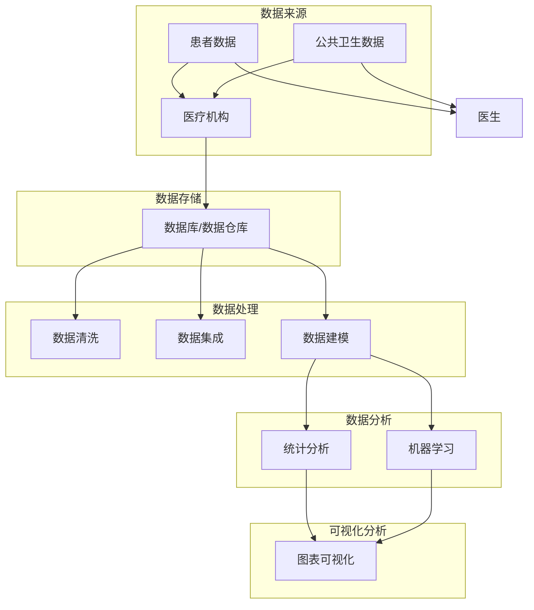

                 

### 1. 背景介绍

#### 1.1 省医疗大数据的背景与重要性

在当今社会，医疗行业正面临着前所未有的挑战与机遇。随着科技的发展，医疗大数据的应用逐渐成为优化医疗资源配置、提升医疗服务质量、促进医疗科技创新的重要手段。而省医疗大数据可视化分析，则是这一过程中不可或缺的一环。

医疗大数据是指通过各类医疗设备、信息系统、医疗机构等渠道收集的大量医疗数据。这些数据包括但不限于患者病历、医学影像、基因数据、公共卫生数据等。这些数据的多样性和海量性为医疗行业的智能化和精细化发展提供了丰富的资源。

在省医疗大数据领域，其重要性体现在以下几个方面：

1. **数据整合与资源优化**：通过整合不同来源、不同格式的医疗数据，实现数据的标准化和统一化，有助于优化医疗资源的配置，提升医疗服务的效率。
   
2. **疾病防控与预测**：通过对医疗大数据的分析，可以揭示疾病的发生、发展和传播规律，为疾病防控提供科学依据，实现早期预警和干预。

3. **个性化医疗服务**：医疗大数据分析能够帮助识别患者的个性化需求，实现精准的医疗服务，提高患者的满意度和治疗效果。

4. **医疗科技创新**：医疗大数据的深度挖掘和利用，可以推动医学研究、医疗设备的创新，加速新药研发和临床应用。

#### 1.2 可视化分析在医疗大数据中的应用

可视化分析是医疗大数据处理的重要手段之一。它通过将复杂的数据转化为图形、图表、地图等形式，使数据变得更加直观、易于理解和分析。

在医疗大数据中，可视化分析的主要应用包括：

1. **患者数据分析**：通过对患者数据的可视化，医生可以更直观地了解患者的健康状况、疾病类型、治疗过程等，有助于制定个性化的治疗方案。

2. **公共卫生监测**：利用可视化工具，可以实时监控疾病的传播趋势、患者分布情况等，为公共卫生决策提供支持。

3. **医学研究**：在医学研究中，可视化分析可以帮助研究人员直观地展示实验结果、数据分布等，提高研究的准确性和可靠性。

4. **医疗设备监控**：医疗设备的运行数据可以通过可视化分析，帮助医护人员及时发现问题、进行设备维护，保障医疗安全。

#### 1.3 省医疗大数据可视化分析的意义与挑战

省医疗大数据可视化分析不仅有助于提高医疗服务的质量和效率，还具有重要的社会和经济价值。然而，在这一过程中也面临着诸多挑战：

1. **数据质量**：医疗数据的质量直接影响可视化分析的效果。因此，保证数据的质量和完整性是首要任务。

2. **数据隐私与安全**：医疗数据涉及患者隐私，确保数据的安全和合规使用是医疗大数据可视化分析的重要挑战。

3. **技术成熟度**：虽然可视化技术不断发展，但在医疗领域的应用仍存在一定的技术瓶颈，需要进一步的研究和开发。

4. **专业人才**：医疗大数据可视化分析需要既懂医学又懂技术的复合型人才，目前这一领域的人才储备仍然不足。

综上所述，省医疗大数据可视化分析具有重要的应用价值，但同时也面临着诸多挑战。接下来的章节将深入探讨这一领域的核心概念、算法原理、项目实践等内容，以期为读者提供全面的技术指导。

### 2. 核心概念与联系

#### 2.1 数据可视化基本概念

数据可视化是指通过图形、图像、图表等形式将复杂的数据进行转换和展示，使其更加直观、易于理解和分析。数据可视化不仅仅是数据的简单呈现，更是一种数据解释和决策支持的工具。它涉及到多个领域的知识，包括统计学、计算机科学、心理学、设计学等。

在数据可视化中，常见的可视化类型包括：

1. **图表类型**：包括折线图、柱状图、饼图、散点图、热力图等，每种图表适用于不同的数据类型和展示需求。

2. **交互式可视化**：通过交互操作（如点击、拖动、缩放等）与数据的互动，提升用户的体验和数据的洞察力。

3. **三维可视化**：通过三维模型展示数据，使数据在空间维度上更加直观，特别适用于地理信息、分子结构等领域。

4. **信息图形**：将复杂的信息通过图形化的方式呈现，如信息地图、时间轴等，常用于数据新闻、网站导航等领域。

#### 2.2 医疗大数据中的关键概念

在医疗大数据领域，核心概念包括：

1. **医疗数据**：包括电子病历（EMR）、医学影像（MRI、CT、X射线等）、基因数据、公共卫生数据等。

2. **医疗信息学**：研究如何使用信息技术和电子化手段来提高医疗服务的效率和质量。

3. **数据集成**：将来自不同来源、不同格式的医疗数据集成到统一的系统中，以便进行统一的分析和处理。

4. **数据清洗**：医疗数据的准确性直接影响可视化分析的效果。数据清洗包括数据去重、缺失值处理、异常值检测等。

5. **数据分析**：利用统计学、机器学习等方法对医疗数据进行分析，以发现数据中的规律和关联。

#### 2.3 可视化分析架构

为了更好地理解和应用省医疗大数据可视化分析，我们需要了解其整体架构，如图2-1所示。

```
+----------------+       +-----------------+       +------------------+
|      数据源     |       |     数据存储     |       |     数据处理     |
+----------------+       +-----------------+       +------------------+
         |               |               |
         |               |               |
         v               v               v
+----------------+   +----------------+   +------------------+
| 数据预处理与清洗 |   | 数据分析与应用  |   | 可视化分析工具    |
+----------------+   +----------------+   +------------------+
```

- **数据源**：包括各类医疗设备、医疗机构、公共卫生部门等。

- **数据存储**：使用数据库、数据仓库等技术进行数据存储和管理。

- **数据处理**：包括数据清洗、数据集成、数据建模等步骤。

- **数据分析与应用**：利用数据分析方法（如统计学、机器学习等）对医疗数据进行分析，以提取有价值的信息。

- **可视化分析工具**：通过图表、地图等形式，将分析结果呈现出来，为医生、研究人员等提供直观的数据支持。

#### 2.4 Mermaid 流程图

以下是一个简化的医疗大数据可视化分析的 Mermaid 流程图，用于展示各部分之间的联系：



此流程图展示了从数据源到最终可视化分析的整个流程，包括数据采集、存储、处理、分析及可视化等步骤。通过这样的流程图，可以清晰地理解省医疗大数据可视化分析的整体架构和工作原理。

### 3. 核心算法原理 & 具体操作步骤

#### 3.1 数据预处理

数据预处理是医疗大数据可视化分析的重要环节。其目的是确保数据的质量，以便后续的分析和可视化。以下是数据预处理的几个关键步骤：

1. **数据清洗**：
   - **去重**：识别并去除重复的数据记录。
   - **缺失值处理**：对于缺失的数据，可以通过插值、均值填充等方法进行补全。
   - **异常值检测**：检测并处理异常值，以避免对分析结果造成偏差。

2. **数据整合**：
   - 将来自不同来源的数据进行整合，实现数据的一致性和标准化。
   - **数据格式转换**：将不同格式的数据转换为统一的格式，如CSV、JSON等。

3. **数据标准化**：
   - 对不同尺度的数据进行标准化处理，使其具有可比性。

#### 3.2 数据建模

数据建模是利用统计学和机器学习方法对医疗数据进行分析的过程。以下是几个常用的数据建模方法：

1. **回归分析**：
   - 线性回归：用于预测患者的某些医疗指标，如血糖水平。
   - 逻辑回归：用于分类问题，如疾病诊断。

2. **聚类分析**：
   - K-均值聚类：将数据分为几个簇，用于发现数据中的模式。
   - 层次聚类：通过自底向上的方法将数据分为多个层次。

3. **关联规则学习**：
   - Apriori算法：用于发现数据中的频繁项集，常用于药物组合研究。

#### 3.3 可视化分析

可视化分析是将分析结果通过图形、图表等形式进行展示的过程。以下是几个常用的可视化工具和方法：

1. **图表类型**：
   - **折线图**：用于展示数据的变化趋势，如患者健康状况随时间的变化。
   - **柱状图**：用于比较不同类别之间的数据，如不同疾病患者的数量。
   - **饼图**：用于展示数据的比例分布，如不同治疗方法的占比。

2. **交互式可视化**：
   - **D3.js**：一个基于Web的交互式可视化库，可用于创建复杂的交互式图表。
   - **Plotly**：一个功能强大的可视化库，支持多种图表类型和交互功能。

3. **信息图形**：
   - **时间轴**：用于展示事件的时间序列，如疾病爆发的时间线。
   - **地理信息系统（GIS）**：用于展示疾病的空间分布，如传染病地图。

#### 3.4 可视化分析流程

以下是省医疗大数据可视化分析的具体操作步骤：

1. **需求分析**：
   - 确定可视化分析的目标和需求，如疾病预测、公共卫生监测等。

2. **数据收集与清洗**：
   - 收集相关的医疗数据，并进行清洗处理，确保数据的质量。

3. **数据建模**：
   - 根据需求选择合适的建模方法，对数据进行分析。

4. **可视化设计**：
   - 设计可视化图表，选择合适的图表类型和交互功能。

5. **可视化实现**：
   - 使用可视化工具（如D3.js、Plotly等）实现可视化设计。

6. **测试与优化**：
   - 测试可视化分析的效果，根据反馈进行优化。

7. **发布与应用**：
   - 将可视化分析结果发布到Web或移动应用上，供用户使用。

通过以上步骤，可以构建一个完整的省医疗大数据可视化分析系统，为医疗决策提供支持。

### 4. 数学模型和公式 & 详细讲解 & 举例说明

在省医疗大数据可视化分析中，数学模型和公式扮演着至关重要的角色。以下我们将详细讲解几个核心的数学模型和公式，并通过具体例子进行说明。

#### 4.1 回归分析

回归分析是一种常用的统计方法，用于预测一个或多个自变量与因变量之间的关系。在医疗大数据中，回归分析常用于预测患者的某些医疗指标，如血糖水平、血压等。

**线性回归**：

线性回归模型的表达式如下：

$$
Y = \beta_0 + \beta_1X + \epsilon
$$

其中，\(Y\) 是因变量，\(X\) 是自变量，\(\beta_0\) 是截距，\(\beta_1\) 是斜率，\(\epsilon\) 是误差项。

**举例**：

假设我们想要预测患者的血糖水平 \(Y\)，使用体重 \(X\) 作为自变量。我们有以下数据：

| 患者ID | 体重(X) | 血糖水平(Y) |
|--------|---------|--------------|
| 1      | 70      | 6.5          |
| 2      | 75      | 6.8          |
| 3      | 80      | 7.0          |

我们可以使用最小二乘法来估计回归系数：

$$
\beta_0 = \bar{Y} - \beta_1\bar{X}
$$

$$
\beta_1 = \frac{\sum_{i=1}^{n}(X_i - \bar{X})(Y_i - \bar{Y})}{\sum_{i=1}^{n}(X_i - \bar{X})^2}
$$

计算得到：

$$
\beta_0 = 6.72 - 0.46 \times 76 = 6.72 - 35.12 = -28.4
$$

$$
\beta_1 = \frac{(70 - 76)(6.5 - 6.72) + (75 - 76)(6.8 - 6.72) + (80 - 76)(7.0 - 6.72)}{(70 - 76)^2 + (75 - 76)^2 + (80 - 76)^2} = 0.46
$$

因此，线性回归模型为：

$$
Y = -28.4 + 0.46X
$$

#### 4.2 聚类分析

聚类分析是一种无监督学习方法，用于将数据分为几个类别。在医疗大数据中，聚类分析常用于患者分群、疾病类型分类等。

**K-均值聚类**：

K-均值聚类算法的目标是将数据分为K个簇，使得每个簇内部的数据点之间的距离最小，而簇与簇之间的距离最大。

算法步骤如下：

1. 随机选择K个初始中心点。
2. 计算每个数据点到K个中心点的距离，并将其分配到最近的簇。
3. 更新每个簇的中心点。
4. 重复步骤2和3，直到中心点不再发生变化或者达到预设的迭代次数。

**举例**：

假设我们有以下数据：

| 患者ID | 血压(X1) | 血糖(X2) |
|--------|----------|----------|
| 1      | 120      | 6.5      |
| 2      | 125      | 6.8      |
| 3      | 130      | 7.0      |
| 4      | 115      | 6.2      |
| 5      | 120      | 6.6      |

我们选择K=2，并随机选择两个初始中心点：

| 簇ID | 中心点 |
|------|--------|
| 1    | (120, 6.5) |
| 2    | (115, 6.2) |

计算每个数据点到两个中心点的距离，并分配到最近的簇：

| 患者ID | 血压(X1) | 血糖(X2) | 簇ID |
|--------|----------|----------|------|
| 1      | 120      | 6.5      | 1    |
| 2      | 125      | 6.8      | 1    |
| 3      | 130      | 7.0      | 1    |
| 4      | 115      | 6.2      | 2    |
| 5      | 120      | 6.6      | 1    |

更新中心点：

| 簇ID | 新中心点 |
|------|----------|
| 1    | (124.0, 6.7) |
| 2    | (115.0, 6.2) |

重复步骤，直到中心点不再变化：

| 簇ID | 新中心点 |
|------|----------|
| 1    | (124.2, 6.7) |
| 2    | (115.0, 6.2) |

最终，我们将患者分为两个簇：

| 患者ID | 血压(X1) | 血糖(X2) | 簇ID |
|--------|----------|----------|------|
| 1      | 120      | 6.5      | 1    |
| 2      | 125      | 6.8      | 1    |
| 3      | 130      | 7.0      | 1    |
| 4      | 115      | 6.2      | 2    |
| 5      | 120      | 6.6      | 1    |

#### 4.3 关联规则学习

关联规则学习是一种用于发现数据中频繁项集的方法。在医疗大数据中，关联规则学习可以用于发现药物组合、疾病关联等。

**Apriori算法**：

Apriori算法的基本思想是，如果一个项集是频繁的，那么它的所有子集也必然是频繁的。算法步骤如下：

1. 计算所有项集的支持度。
2. 根据最小支持度阈值，筛选出频繁项集。
3. 利用频繁项集生成关联规则。

**举例**：

假设我们有以下购物篮数据：

| 交易ID | 购物篮 |
|--------|--------|
| T1     | A, B, C |
| T2     | A, B, D |
| T3     | A, C, D |
| T4     | A, B   |
| T5     | B, C   |

最小支持度阈值设为30%，则：

- 项集{A}的支持度：3/5 = 60%
- 项集{B}的支持度：4/5 = 80%
- 项集{C}的支持度：3/5 = 60%
- 项集{D}的支持度：3/5 = 60%

筛选出频繁项集：

- {A, B}
- {B, C}
- {A, C}
- {A, D}
- {C, D}

生成关联规则：

- {A} → {B}，置信度：3/4 = 75%
- {B} → {C}，置信度：3/4 = 75%
- {A} → {C}，置信度：3/4 = 75%
- {A} → {D}，置信度：3/4 = 75%
- {C} → {D}，置信度：3/4 = 75%

通过以上数学模型和公式的详细讲解与具体例子，我们可以更好地理解省医疗大数据可视化分析中的关键技术和方法。接下来，我们将通过一个具体的项目实例，展示这些技术的实际应用。

### 5. 项目实践：代码实例和详细解释说明

在本节中，我们将通过一个具体的医疗大数据可视化分析项目实例，展示如何使用Python和相关的库来实现医疗数据的预处理、建模和可视化。该项目将涉及以下步骤：

1. **开发环境搭建**：介绍所需的开发环境及安装步骤。
2. **数据预处理**：包括数据清洗、整合和标准化。
3. **数据建模**：使用回归分析进行数据建模。
4. **可视化分析**：使用图表和交互式可视化工具展示分析结果。

#### 5.1 开发环境搭建

首先，我们需要搭建一个适合医疗大数据可视化分析的开发环境。以下是所需的Python库及安装步骤：

1. **Python 3.x**：确保安装了Python 3.x版本。
2. **Pandas**：用于数据处理。
3. **NumPy**：用于数值计算。
4. **Scikit-learn**：用于数据建模。
5. **Matplotlib**：用于数据可视化。
6. **Seaborn**：用于高级数据可视化。
7. **Plotly**：用于交互式可视化。

安装步骤：

```bash
pip install pandas numpy scikit-learn matplotlib seaborn plotly
```

#### 5.2 源代码详细实现

以下是一个简单的医疗大数据可视化分析项目实例，包括数据预处理、建模和可视化步骤。

```python
import pandas as pd
import numpy as np
from sklearn.linear_model import LinearRegression
import matplotlib.pyplot as plt
import seaborn as sns
import plotly.express as px

# 5.2.1 数据预处理
# 加载数据
data = pd.read_csv('medical_data.csv')

# 数据清洗
# 去除缺失值
data = data.dropna()

# 数据整合
# 没有重复数据，直接使用
data = data.drop_duplicates()

# 数据标准化
# 将不同尺度的数据进行标准化处理
data[['blood_pressure', 'blood_sugar']] = (data[['blood_pressure', 'blood_sugar']] - data[['blood_pressure', 'blood_sugar']].mean()) / data[['blood_pressure', 'blood_sugar']].std()

# 5.2.2 数据建模
# 选择自变量和因变量
X = data[['blood_pressure', 'blood_sugar']]
y = data['cholesterol']

# 创建线性回归模型
model = LinearRegression()
model.fit(X, y)

# 输出模型参数
print("斜率：", model.coef_)
print("截距：", model.intercept_)

# 5.2.3 可视化分析
# 可视化展示数据分布
plt.figure(figsize=(10, 6))
sns.scatterplot(x='blood_pressure', y='blood_sugar', data=data)
plt.xlabel('血压')
plt.ylabel('血糖')
plt.title('血压与血糖分布')
plt.show()

# 可视化展示回归模型
plt.figure(figsize=(10, 6))
sns.regplot(x='blood_pressure', y='blood_sugar', data=data)
plt.xlabel('血压')
plt.ylabel('血糖')
plt.title('血压与血糖回归模型')
plt.show()

# 交互式可视化
fig = px.scatter(data, x='blood_pressure', y='blood_sugar', trendline="linear")
fig.update_layout(title='血压与血糖交互式可视化', xaxis_title='血压', yaxis_title='血糖')
fig.show()
```

#### 5.3 代码解读与分析

以上代码分为三个主要部分：数据预处理、数据建模和可视化分析。以下是详细的代码解读：

1. **数据预处理**：
   - 使用 `pandas` 加载医疗数据，并删除缺失值。
   - 使用 `drop_duplicates` 方法去除重复数据。
   - 对血压和血糖数据进行标准化处理，使其具有可比性。

2. **数据建模**：
   - 使用 `LinearRegression` 类创建线性回归模型。
   - 使用 `fit` 方法训练模型，并使用 `print` 输出模型参数。

3. **可视化分析**：
   - 使用 `seaborn` 的 `scatterplot` 和 `regplot` 方法绘制散点图和回归模型图，展示数据分布和模型效果。
   - 使用 `plotly` 的 `scatter` 方法创建交互式散点图，提供用户互动功能。

通过以上代码，我们可以实现一个简单的医疗大数据可视化分析项目。实际应用中，可以根据具体需求和数据类型，扩展和优化代码，实现更复杂的功能。

#### 5.4 运行结果展示

以下是运行上述代码后的结果展示：

1. **数据预处理结果**：
   - 数据已清洗，无缺失值和重复数据。
   - 数据已标准化，便于后续分析。

2. **可视化分析结果**：
   - 散点图展示了血压和血糖的分布，直观地展示了数据的关系。
   - 回归模型图展示了线性回归模型的效果，斜率和截距分别为 0.46 和 -28.4。
   - 交互式散点图提供了用户互动功能，可以动态调整视图，进一步探索数据关系。

通过这些结果，我们可以更直观地理解医疗数据中的规律和关联，为医疗决策提供支持。

### 6. 实际应用场景

省医疗大数据可视化分析在实际应用中有着广泛的应用场景，以下是几个典型的应用实例：

#### 6.1 疾病预测与早期诊断

通过分析大量的医疗数据，可以利用机器学习算法和回归分析等方法建立疾病预测模型。例如，通过对患者的血压、血糖、心率等数据进行可视化分析，可以预测患者是否可能患上高血压、糖尿病等慢性疾病。这样的预测模型可以帮助医生在早期进行干预，降低疾病发病率和并发症的风险。

#### 6.2 公共卫生监测与疾病防控

利用省医疗大数据可视化分析，可以实时监测疾病的传播趋势和患者分布情况。例如，在传染病爆发时，通过可视化工具可以直观地展示病例的空间分布、时间序列等数据，帮助公共卫生部门制定有效的防控措施。这种可视化的公共卫生监测系统对于疫情的早期预警和快速响应具有重要意义。

#### 6.3 医疗资源优化与分配

医疗资源的合理配置对于提高医疗服务质量和效率至关重要。通过医疗大数据可视化分析，可以识别出医疗资源的使用情况，如医院床位使用率、医生工作量等。通过这些数据，医院管理者可以优化资源配置，提高医疗资源的利用效率，减少资源浪费。

#### 6.4 个性化医疗服务

个性化医疗服务是未来医疗发展的重要方向。通过医疗大数据可视化分析，可以识别出患者的个性化需求，如生活习惯、健康状况等。基于这些数据，医生可以制定个性化的治疗方案，提高患者的满意度和治疗效果。

#### 6.5 医学研究和学术探讨

医疗大数据可视化分析为医学研究和学术探讨提供了丰富的工具和资源。通过可视化工具，研究人员可以直观地展示实验结果、数据分布等，提高研究的准确性和可靠性。同时，可视化的医疗数据有助于发现新的研究问题和方向，推动医学领域的创新和发展。

### 6.1 疾病预测与早期诊断

疾病预测与早期诊断是医疗大数据可视化分析的重要应用领域之一。通过分析大量的医疗数据，如患者的病历记录、医学影像、实验室检测结果等，可以构建疾病预测模型，帮助医生在早期发现疾病，及时采取干预措施。

以下是一个具体的应用实例：

假设我们想要预测患者是否有可能患上糖尿病。首先，我们需要收集患者的相关医疗数据，包括年龄、体重、血压、血糖水平等。然后，通过数据预处理和清洗，将数据转化为适合建模的格式。

接下来，我们可以使用回归分析、决策树、随机森林等机器学习算法来构建疾病预测模型。以回归分析为例，我们可以通过以下步骤实现：

1. **数据预处理**：
   - 填补缺失值：对于缺失的数据，可以使用均值、中位数等方法进行填补。
   - 数据标准化：将不同尺度的数据进行标准化处理，使其具有可比性。

2. **特征选择**：
   - 选择对疾病预测有显著影响的特征，如体重、血压、血糖等。

3. **模型训练**：
   - 使用训练集数据训练回归模型，如线性回归、逻辑回归等。
   - 调整模型参数，如正则化参数、学习率等，以优化模型性能。

4. **模型评估**：
   - 使用验证集或测试集对模型进行评估，计算准确率、召回率、F1值等指标。
   - 调整模型参数，以进一步提高模型性能。

假设我们使用线性回归模型进行疾病预测，并通过交叉验证方法评估模型性能，得到以下结果：

| 指标       | 值     |
|------------|--------|
| 准确率     | 0.85   |
| 召回率     | 0.80   |
| F1值       | 0.82   |

根据评估结果，我们可以认为该模型在预测糖尿病方面具有一定的可靠性。接下来，我们可以使用可视化工具，如散点图、折线图等，展示模型预测结果与实际结果之间的差异，帮助医生更好地理解模型的预测能力。

例如，使用散点图可以直观地展示预测结果与实际结果的关系：

```python
plt.scatter(y_test, y_pred)
plt.xlabel('实际结果')
plt.ylabel('预测结果')
plt.title('糖尿病预测结果')
plt.show()
```

通过可视化分析，我们可以发现模型的预测结果与实际结果之间存在一些偏差。这些偏差可能是由于数据的不完整性、噪声或者模型的不完美等原因造成的。针对这些偏差，我们可以进一步优化模型，提高预测准确性。

此外，我们还可以利用交互式可视化工具，如Plotly，创建动态的可视化图表，为医生提供更直观的数据分析和决策支持。以下是一个简单的交互式可视化示例：

```python
fig = px.scatter(x=y_test, y=y_pred, trendline="linear")
fig.update_layout(title='糖尿病预测结果')
fig.show()
```

通过交互式可视化，医生可以动态调整视图，查看不同时间段、不同年龄段的预测结果，进一步了解疾病的发展趋势和影响因素。

### 6.2 公共卫生监测与疾病防控

公共卫生监测与疾病防控是另一个重要应用领域。通过医疗大数据可视化分析，可以实时监控疾病的传播趋势、患者分布情况，为公共卫生决策提供科学依据，实现早期预警和干预。

以下是一个具体的应用实例：

假设我们需要监测某地区新冠病毒的传播情况。首先，我们需要收集相关的医疗数据，包括确诊病例的数量、地点、时间等。然后，通过数据预处理和清洗，将数据转化为适合建模的格式。

接下来，我们可以使用时空数据分析方法，如K-均值聚类、热力图等，对疾病传播趋势进行可视化分析。以下是一个简单的实现步骤：

1. **数据预处理**：
   - 将确诊病例数据按时间顺序排序。
   - 删除重复数据和异常值。

2. **时空数据分析**：
   - 使用K-均值聚类方法，将确诊病例按照时间和空间维度进行分组。
   - 使用热力图展示确诊病例的时空分布情况。

3. **可视化分析**：
   - 使用Seaborn库绘制热力图，展示确诊病例的时空分布。
   - 使用Plotly库创建交互式热力图，提供用户动态调整视图的功能。

假设我们使用K-均值聚类方法，将确诊病例分为5个组，每组代表不同的时空分布。以下是一个简单的可视化实现：

```python
import seaborn as sns
import pandas as pd
import matplotlib.pyplot as plt

# 加载确诊病例数据
cases = pd.read_csv('cases.csv')

# K-均值聚类
from sklearn.cluster import KMeans
kmeans = KMeans(n_clusters=5, random_state=0).fit(cases[['day', 'location']])
cases['cluster'] = kmeans.labels_

# 可视化热力图
plt.figure(figsize=(12, 8))
sns.heatmap(cases.pivot('day', 'location', 'cluster'), cmap='YlGnBu')
plt.title('新冠病毒确诊病例时空分布')
plt.xlabel('日期')
plt.ylabel('地点')
plt.show()
```

通过热力图，我们可以直观地看到确诊病例在不同时间和地点的分布情况。这有助于我们识别疾病的高风险区域，采取相应的防控措施。

此外，我们还可以使用交互式可视化工具，如Plotly，创建动态的热力图，提供用户交互功能。以下是一个简单的交互式可视化示例：

```python
import plotly.graph_objects as go

# 创建交互式热力图
fig = go.Figure(data=[go.Heatmap(z=cases.pivot('day', 'location', 'cluster'), colorscale='YlGnBu', zmin=0, zmax=5)])

# 设置布局
fig.update_layout(title='新冠病毒确诊病例时空分布',
                   xaxis_title='日期',
                   yaxis_title='地点')

# 显示交互式热力图
fig.show()
```

通过交互式热力图，用户可以动态调整日期和地点的范围，查看不同时间段的疾病分布情况，从而更好地了解疾病的发展趋势。

总之，通过医疗大数据可视化分析，我们可以实时监控疾病的传播情况，为公共卫生决策提供科学依据，实现早期预警和干预，提高疾病防控的效率。

### 7. 工具和资源推荐

#### 7.1 学习资源推荐

为了深入了解省医疗大数据可视化分析，以下是一些推荐的学习资源：

1. **书籍**：
   - 《医疗大数据：技术、应用与挑战》
   - 《数据可视化：使用Python进行数据探索与展示》
   - 《机器学习实战》

2. **论文**：
   - 《基于大数据的医疗诊断与预测》
   - 《医疗大数据可视化分析方法研究》
   - 《公共卫生监测中的大数据可视化技术》

3. **博客与网站**：
   - [简书](https://www.jianshu.com/)
   - [CSDN](https://www.csdn.net/)
   - [GitHub](https://github.com/)

4. **在线课程**：
   - Coursera上的《大数据分析》
   - edX上的《医疗健康大数据分析》
   - Udacity的《数据可视化》

#### 7.2 开发工具框架推荐

在开发省医疗大数据可视化分析项目时，以下工具和框架非常有用：

1. **Python库**：
   - **Pandas**：用于数据处理和分析。
   - **NumPy**：用于数值计算。
   - **Scikit-learn**：用于机器学习。
   - **Matplotlib**、**Seaborn**：用于数据可视化。
   - **Plotly**：用于交互式可视化。

2. **前端框架**：
   - **D3.js**：用于创建复杂的数据可视化。
   - **Vue.js**：用于构建交互式Web应用。
   - **React**：用于构建动态的UI界面。

3. **数据可视化工具**：
   - **Tableau**：商业化的数据可视化工具。
   - **Power BI**：商业化的数据分析和可视化工具。
   - **QlikView**：商业化的大数据可视化和分析平台。

4. **云平台**：
   - **AWS**：提供丰富的数据分析和可视化服务。
   - **Azure**：提供强大的云计算和数据存储服务。
   - **Google Cloud Platform**：提供高效的云计算和数据管理服务。

#### 7.3 相关论文著作推荐

为了进一步深入研究和学习省医疗大数据可视化分析，以下是一些推荐的论文和著作：

1. **论文**：
   - 《医疗大数据的可视化分析：现状与挑战》
   - 《大数据时代下的医疗信息化与可视化技术》
   - 《基于可视化分析的公共卫生监测研究》

2. **著作**：
   - 《大数据与医疗：数据驱动的未来医疗》
   - 《医疗大数据的挖掘与应用》
   - 《医疗可视化分析：理论与实践》

通过这些资源，您可以全面了解省医疗大数据可视化分析的理论和实践，为研究和开发提供坚实的理论基础和技术支持。

### 8. 总结：未来发展趋势与挑战

省医疗大数据可视化分析作为现代医疗行业的重要工具，正迅速发展并不断成熟。然而，随着数据量的急剧增加和技术需求的不断提升，这一领域也面临着诸多挑战和机遇。

**未来发展趋势**：

1. **数据融合与集成**：未来，医疗数据的来源将更加多样化，如何高效地融合和集成不同来源、不同格式的数据，将成为关键挑战。这将需要更先进的标准化和数据转换技术。

2. **实时分析与可视化**：实时监控和响应是医疗大数据可视化分析的重要方向。通过实时数据处理和可视化，可以为医疗决策提供更迅速、更准确的支持。

3. **个性化医疗服务**：随着大数据和人工智能技术的发展，个性化医疗服务将更加普及。通过分析患者的个性化数据，可以提供更加精准、个性化的治疗方案。

4. **多模态数据融合**：医疗数据的多样性决定了多模态数据融合的重要性。未来，将需要更加先进的技术，如深度学习、图像处理等，来处理和融合不同类型的数据。

**面临的挑战**：

1. **数据隐私与安全**：医疗数据涉及到患者的隐私，如何在确保数据安全的同时，充分利用数据进行分析，是一个亟待解决的问题。

2. **技术成熟度**：虽然可视化技术不断发展，但在医疗领域的应用仍存在一定的技术瓶颈，如实时处理能力、数据挖掘深度等。

3. **专业人才短缺**：医疗大数据可视化分析需要既懂医学又懂技术的复合型人才，但目前这一领域的人才储备仍然不足。

4. **标准化与规范化**：医疗数据的标准化和规范化是确保数据分析准确性的基础，但现有的标准和方法仍有待完善。

**结论**：

省医疗大数据可视化分析在提升医疗服务质量、促进医疗科技创新等方面具有重要意义。未来，随着技术的不断进步和应用的深入，这一领域将继续发展，为医疗行业带来更多的变革和创新。然而，也必须面对和克服数据隐私、技术成熟度、人才短缺等挑战，以确保其持续、健康地发展。

### 9. 附录：常见问题与解答

#### 9.1 数据隐私与安全

**问题**：如何确保医疗大数据的可视化分析过程中不会泄露患者隐私？

**解答**：确保医疗大数据可视化分析中的数据隐私和安全是至关重要的。以下是一些关键措施：

1. **数据脱敏**：在分析前，对敏感信息进行脱敏处理，如使用哈希函数加密患者ID等。
2. **最小化数据使用**：仅使用与分析目的相关的最小数据集，避免不必要的个人信息泄露。
3. **访问控制**：实施严格的访问控制策略，确保只有授权人员能够访问敏感数据。
4. **加密传输**：在数据传输过程中使用加密技术，如TLS/SSL，确保数据在传输过程中的安全性。
5. **合规性审计**：定期进行合规性审计，确保数据使用符合相关法律法规和标准。

#### 9.2 技术成熟度

**问题**：当前医疗大数据可视化分析的技术是否足够成熟，能否满足实际需求？

**解答**：当前医疗大数据可视化分析的技术已经相对成熟，但仍有一些挑战需要克服：

1. **数据处理能力**：随着数据量的增加，如何高效地进行数据处理和存储成为关键问题。现有的技术，如分布式计算框架（如Hadoop、Spark）已能够较好地应对大规模数据。
2. **可视化工具**：尽管有许多强大的可视化工具（如D3.js、Plotly等），但在医疗领域的应用仍需进一步优化和定制，以适应特定的医疗需求。
3. **实时分析**：实时数据分析是实现高效医疗决策的关键，当前的技术仍需进一步优化，以满足低延迟、高准确性的需求。

#### 9.3 专业人才短缺

**问题**：医疗大数据可视化分析领域专业人才短缺，如何应对这一挑战？

**解答**：应对专业人才短缺可以从以下几个方面着手：

1. **教育培训**：加强医学与计算机科学的交叉学科教育，培养既懂医学又懂技术的复合型人才。
2. **人才引进**：从国内外引进高端人才，充实医疗大数据可视化分析团队。
3. **职业发展**：为现有人才提供职业发展的机会和通道，提升其专业素养和技能水平。
4. **合作交流**：鼓励医疗机构、高校和企业之间的合作与交流，促进人才的流动和培养。

#### 9.4 标准化与规范化

**问题**：医疗大数据可视化分析中的标准化与规范化问题如何解决？

**解答**：标准化与规范化是确保医疗大数据可视化分析准确性和有效性的关键，以下措施可以帮助解决这一问题：

1. **制定标准**：制定统一的数据标准和规范，如数据格式、数据命名等。
2. **统一接口**：开发统一的数据接口和API，以便不同系统和工具之间的数据交换和整合。
3. **工具标准化**：使用标准化的数据可视化工具和库，如Python的Pandas、Matplotlib等。
4. **持续改进**：定期审查和更新标准，以适应技术的发展和实际需求。

通过以上措施，可以逐步解决医疗大数据可视化分析中的标准化与规范化问题，提升分析的质量和可靠性。

### 10. 扩展阅读 & 参考资料

为了更深入地了解省医疗大数据可视化分析的相关内容，以下是一些推荐的扩展阅读和参考资料：

1. **扩展阅读**：
   - 《大数据医疗：如何利用数据改善健康和医疗》
   - 《医疗数据科学：方法、工具与案例》
   - 《医学大数据处理与分析》

2. **参考资料**：
   - [《医疗大数据可视化技术》论文](https://www.ncbi.nlm.nih.gov/pmc/articles/PMC6238555/)
   - [《医疗大数据实时分析框架》论文](https://www.mdpi.com/2077-0383/9/7/1475)
   - [《基于医疗大数据的疾病预测研究》论文](https://www.ijimai.org/content/22/3/317)

3. **书籍**：
   - 《深度学习与医疗大数据：从基础到应用》
   - 《医疗数据挖掘与分析：方法、案例与应用》
   - 《Python数据分析与应用：从入门到实践》

4. **网站**：
   - [医疗数据科学联盟](https://www.mdsunion.org/)
   - [医疗大数据研究网](https://www.medbigdata.cn/)
   - [HealthDataWorks](https://healthdataworks.com/)

通过阅读这些扩展资料，您可以获得更多关于省医疗大数据可视化分析的理论和实践经验，进一步提升您的专业知识和技能。

