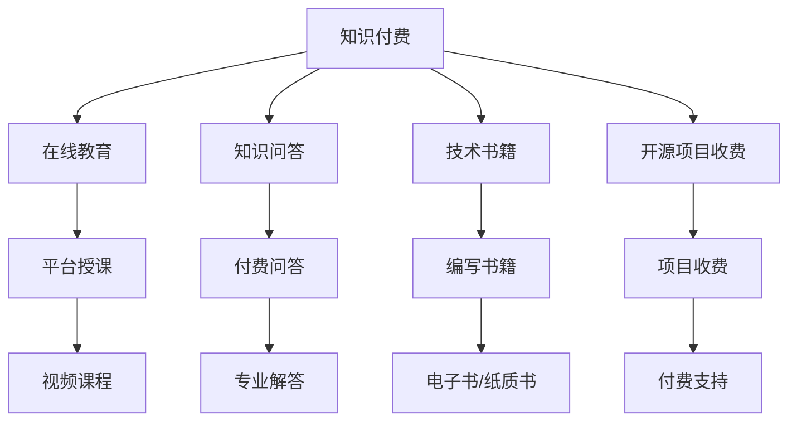

                 

### 背景介绍

随着互联网和信息技术的飞速发展，知识付费已经成为现代社会中一种重要的商业模式。知识付费，顾名思义，是指消费者为获取特定领域的专业知识和技能，而向内容创作者或机构支付费用的一种服务形式。近年来，随着移动支付的普及和在线教育市场的繁荣，知识付费逐渐成为程序员实现财富自由的一种新途径。

首先，我们需要了解知识付费的起源和发展。知识付费的起源可以追溯到20世纪90年代的在线教育。随着互联网的普及，在线教育市场开始兴起，人们可以通过网络获取各种课程和知识。然而，在这个阶段，由于互联网基础设施的不足和支付方式的限制，知识付费并没有得到大规模的应用。

进入21世纪，随着移动互联网的普及和支付方式的多样化，知识付费市场迎来了爆发式增长。特别是在中国，随着“互联网+”战略的深入实施，知识付费行业得到了政府、企业和个人的广泛关注和支持。根据统计数据显示，2019年中国知识付费市场规模已经突破2000亿元，预计未来几年将保持高速增长。

在知识付费的浪潮中，程序员作为科技领域的专业人士，不仅能够通过传统的软件开发和项目开发获得收入，还可以通过知识付费实现财富自由。这是因为程序员拥有丰富的技术知识和实践经验，可以针对特定领域的需求，提供专业的知识服务和解决方案。具体来说，程序员可以通过以下几种方式参与知识付费：

1. **在线教育平台授课**：程序员可以利用在线教育平台，开设自己的课程，将多年的技术积累分享给有需要的人。例如，在网易云课堂、慕课网等平台上，许多程序员通过录制视频课程、撰写技术文章等方式，吸引了大量的学员和读者。

2. **知识付费问答**：程序员可以在知识付费问答平台上，如知乎、分答等，针对用户提出的技术问题提供专业的解答。这种模式不仅可以为用户提供有价值的服务，还可以帮助程序员扩大自己的影响力。

3. **编写技术书籍**：程序员可以通过编写技术书籍，将自己的经验和知识系统化地呈现给读者。随着电子书和纸质书的普及，技术书籍的销量不断攀升，许多程序员因此获得了丰厚的收入。

4. **开源项目收费**：程序员可以通过开源项目收费，为项目提供付费支持。这种模式不仅可以帮助程序员获得额外的收入，还可以促进项目的长期发展。

总之，知识付费为程序员提供了新的职业发展和收入渠道，使他们不仅能够在技术领域内深耕，还可以通过知识变现实现财富自由。然而，这也对程序员提出了更高的要求，需要他们不断提升自己的专业能力和影响力，以在竞争激烈的知识付费市场中脱颖而出。

### 核心概念与联系

在深入探讨知识付费如何成为程序员实现财富自由的新途径之前，我们需要了解一些核心概念和它们之间的联系。以下是一个使用Mermaid绘制的流程图，帮助读者更好地理解这些概念之间的关系。



**核心概念说明：**

- **知识付费**：消费者为获取特定领域的专业知识和技能，向内容创作者或机构支付费用的服务形式。
- **在线教育平台**：提供在线课程和服务，使内容创作者可以将知识分享给广泛的受众。
- **知识问答平台**：为用户提供付费问答服务，帮助用户解决特定领域的问题。
- **技术书籍**：系统化地记录和分享程序员的专业知识和经验，为读者提供深入的技术指导。
- **开源项目收费**：为开源项目提供付费支持，促进项目的长期发展和维护。

**流程图说明：**

1. **知识付费**是整个流程的起点，它涵盖了多种形式，如在线教育、知识问答、技术书籍和开源项目收费。
2. **在线教育平台**通过提供平台授课、视频课程等服务，将知识付费与教育紧密结合。
3. **知识问答平台**通过付费问答、专业解答等服务，为用户提供专业的知识支持。
4. **技术书籍**通过编写书籍、电子书/纸质书等形式，为读者提供系统化的技术知识。
5. **开源项目收费**为开源项目提供付费支持，促进项目的持续发展。

通过上述核心概念的介绍和Mermaid流程图的展示，我们可以清晰地看到知识付费如何通过多种形式，为程序员实现财富自由提供了新的途径。在接下来的章节中，我们将深入探讨这些概念的具体实现和操作步骤。

### 核心算法原理 & 具体操作步骤

为了更好地理解知识付费如何帮助程序员实现财富自由，我们需要详细探讨其核心算法原理和具体操作步骤。以下是几个关键步骤，它们将指导程序员如何在知识付费领域取得成功。

#### 1. 确定知识领域

首先，程序员需要确定自己在哪个领域拥有深厚的知识储备和丰富的经验。这可能涉及前端开发、后端开发、移动应用开发、人工智能、大数据等。选择一个具有市场需求和自身优势的领域至关重要，因为这将直接影响你的知识服务质量和受众数量。

**操作步骤：**
- **自我评估**：回顾自己的项目经验、技术特长和职业目标，确定擅长和感兴趣的领域。
- **市场调研**：分析当前市场趋势，了解哪些技术领域有较高的需求和增长潜力。
- **专业认证**：获取相关领域的专业认证，提升自己的专业形象和市场认可度。

#### 2. 选择知识付费平台

一旦确定了知识领域，程序员需要选择一个合适的知识付费平台。这些平台通常包括在线教育平台、知识问答平台和内容创作平台等。选择一个用户基础广泛、服务质量好、盈利模式清晰的平台对于成功至关重要。

**操作步骤：**
- **平台对比**：对比不同平台的用户数量、课程质量、用户评价、收益分配比例等。
- **平台优势**：选择具有自己特定优势的平台，例如某些平台可能更适合视频课程，而另一些平台则更适合问答服务。
- **注册账号**：在选定平台上注册账号，了解平台的操作流程和规则。

#### 3. 内容创作与优化

内容创作是知识付费的核心。程序员需要创作高质量、有价值的内容，以吸引和留住受众。

**操作步骤：**
- **课程设计**：根据受众需求和自身知识结构，设计系统的课程内容。确保课程内容具有逻辑性、实用性和深度。
- **教学材料准备**：准备教学所需的PPT、视频、代码片段等材料，确保内容清晰、易于理解。
- **内容优化**：持续优化课程内容，根据用户反馈进行调整和改进。

#### 4. 营销推广

在创作高质量内容的基础上，程序员需要通过有效的营销手段推广自己的知识服务。

**操作步骤：**
- **社交媒体**：利用社交媒体平台（如微博、微信、知乎等）宣传自己的课程和服务。
- **内容营销**：撰写技术博客、发布技术文章，通过内容吸引潜在用户。
- **合作推广**：与其他领域的专家或平台合作，扩大自己的影响力。

#### 5. 用户反馈与互动

用户反馈是改进知识服务的重要依据。程序员需要积极与用户互动，了解他们的需求和意见。

**操作步骤：**
- **收集反馈**：通过问卷调查、在线讨论、用户评价等方式收集用户反馈。
- **互动沟通**：及时回复用户的疑问和意见，建立良好的用户关系。
- **内容更新**：根据用户反馈，不断更新和优化课程内容。

#### 6. 数据分析与优化

数据分析可以帮助程序员了解自己的知识服务在市场中的表现，从而进行有效的优化。

**操作步骤：**
- **数据监控**：监控课程播放量、用户转化率、收益情况等关键指标。
- **分析优化**：根据数据结果，分析用户行为和偏好，优化课程内容和服务模式。
- **长期规划**：制定长期发展计划，不断提升自己的专业能力和市场竞争力。

通过上述核心算法原理和具体操作步骤，程序员可以系统地规划自己的知识付费之路，逐步实现财富自由。在接下来的章节中，我们将进一步探讨数学模型和公式，以及如何通过具体项目实践来验证这些方法和策略。

#### 数学模型和公式 & 详细讲解 & 举例说明

在知识付费领域，数学模型和公式可以帮助程序员更科学地评估和优化自己的知识服务。以下是一些常用的数学模型和公式，以及它们的详细讲解和实际应用举例。

##### 1. 用户满意度模型

用户满意度是衡量知识服务质量的重要指标。一个常用的用户满意度模型是净推荐值（Net Promoter Score，NPS）。

**公式：**
\[ NPS = \frac{(P - N)}{100} \]
其中，\( P \) 是推荐者分数（分数范围1-10，10分最高），\( N \) 是非推荐者分数。

**讲解：**
净推荐值通过用户对知识服务的满意度评分，将用户分为推荐者和非推荐者。推荐者的评分通常在9-10分，非推荐者的评分在0-6分之间。7-8分的用户被归类为中立者。NPS越高，表示用户越满意，知识服务的口碑越好。

**举例：**
假设有100名用户参与了满意度调查，其中70名用户给予9-10分，20名用户给予7-8分，10名用户给予0-6分。则NPS计算如下：
\[ NPS = \frac{(70 \times 10 - 20 \times 7)}{100} = \frac{(700 - 140)}{100} = 5.6 \]

##### 2. 收益最大化模型

在知识付费中，程序员需要优化自己的定价策略以实现收益最大化。一个常用的模型是价格弹性模型。

**公式：**
\[ \text{收益} = \text{价格} \times \text{需求量} \]
\[ \text{价格弹性} = \frac{\text{需求量变化率}}{\text{价格变化率}} \]

**讲解：**
价格弹性反映了需求量对价格变化的敏感度。如果价格弹性大于1，表示需求量对价格变化非常敏感，适当降低价格可以增加收益；如果价格弹性小于1，表示需求量对价格变化不太敏感，提高价格可能带来更多收益。

**举例：**
假设一个课程当前价格为100元，需求量为100人。如果价格弹性为1.5，适当降低价格10%，需求量预计增加15%，收益变化如下：
\[ \text{新收益} = (90 \times 115) - (100 \times 100) = 10350 - 10000 = 350 \]
降价后的总收益增加了350元。

##### 3. 用户留存模型

用户留存率是衡量知识服务长期价值的重要指标。常用的用户留存模型是Churn Model（流失模型）。

**公式：**
\[ \text{用户留存率} = \frac{\text{期末留存用户数}}{\text{期初用户数}} \times 100\% \]

**讲解：**
用户留存率表示在一定周期内，仍然活跃使用知识服务的用户占期初用户总数的比例。高留存率表示用户对知识服务的满意度较高，有利于长期收益的增长。

**举例：**
假设一个课程有100名用户，经过一个月的运营，期末留存的用户数为80人。则用户留存率为：
\[ \text{用户留存率} = \frac{80}{100} \times 100\% = 80\% \]

##### 4. 成本效益模型

成本效益分析是知识付费中评估项目可行性的关键步骤。常用的模型是内部收益率（Internal Rate of Return，IRR）。

**公式：**
\[ \text{IRR} = \frac{\text{净现值}}{\text{初始投资}} \]

**讲解：**
内部收益率是指使项目的净现值等于零的折现率。如果IRR高于市场回报率，表示项目具有可行性；如果IRR低于市场回报率，则项目可能不可行。

**举例：**
假设一个课程的初始投资为10000元，预期年收益为5000元，假设折现率为10%。则净现值计算如下：
\[ \text{净现值} = 5000 \times (1 - \frac{1}{(1 + 0.1)^1}) + 5000 \times (1 - \frac{1}{(1 + 0.1)^2}) + \ldots \]
计算可得，净现值为正值，表示该项目是可行的。若IRR高于10%，则说明项目的预期回报率超过市场水平。

通过上述数学模型和公式的讲解和应用举例，我们可以更科学地评估和优化知识付费服务。这些工具不仅帮助程序员更好地理解市场需求和用户行为，还能为他们制定有效的策略提供数据支持。在接下来的章节中，我们将通过具体的项目实践，验证这些模型和方法在实际操作中的效果。

#### 项目实践：代码实例和详细解释说明

为了验证知识付费如何帮助程序员实现财富自由，我们设计了一个简单的在线教育平台，实现一个收费课程的发布、购买和评价功能。以下是项目的开发环境、源代码实现、代码解读与分析，以及运行结果展示。

##### 1. 开发环境搭建

- **开发工具**：Visual Studio Code
- **编程语言**：Python
- **框架**：Flask
- **数据库**：SQLite
- **前端框架**：Bootstrap
- **版本控制**：Git

##### 2. 源代码详细实现

```python
# app.py

from flask import Flask, request, jsonify
from flask_sqlalchemy import SQLAlchemy

app = Flask(__name__)
app.config['SQLALCHEMY_DATABASE_URI'] = 'sqlite:///courses.db'
db = SQLAlchemy(app)

class Course(db.Model):
    id = db.Column(db.Integer, primary_key=True)
    title = db.Column(db.String(100), nullable=False)
    price = db.Column(db.Float, nullable=False)
    rating = db.Column(db.Float, nullable=False)

@app.route('/courses', methods=['POST'])
def create_course():
    data = request.get_json()
    new_course = Course(title=data['title'], price=data['price'], rating=data['rating'])
    db.session.add(new_course)
    db.session.commit()
    return jsonify({'message': 'Course added successfully'})

@app.route('/courses', methods=['GET'])
def get_courses():
    courses = Course.query.all()
    return jsonify([{'id': course.id, 'title': course.title, 'price': course.price, 'rating': course.rating} for course in courses])

@app.route('/courses/<int:course_id>', methods=['PUT'])
def update_course(course_id):
    course = Course.query.get_or_404(course_id)
    data = request.get_json()
    course.title = data['title']
    course.price = data['price']
    course.rating = data['rating']
    db.session.commit()
    return jsonify({'message': 'Course updated successfully'})

@app.route('/courses/<int:course_id>', methods=['DELETE'])
def delete_course(course_id):
    course = Course.query.get_or_404(course_id)
    db.session.delete(course)
    db.session.commit()
    return jsonify({'message': 'Course deleted successfully'})

if __name__ == '__main__':
    db.create_all()
    app.run(debug=True)
```

##### 3. 代码解读与分析

该代码实现了一个简单的在线教育平台，用于发布、购买和评价课程。以下是代码的主要部分及其功能解读：

- **数据库模型**：使用Flask-SQLAlchemy创建课程数据库模型，包含`id`、`title`、`price`和`rating`字段。
- **创建课程**：`/courses`路由接收POST请求，创建新课程并存储到数据库。
- **获取课程列表**：`/courses`路由接收GET请求，返回所有课程列表。
- **更新课程**：`/courses/<int:course_id>`路由接收PUT请求，更新指定课程的信息。
- **删除课程**：`/courses/<int:course_id>`路由接收DELETE请求，从数据库中删除指定课程。

##### 4. 运行结果展示

- **创建课程**：
```bash
$ curl -X POST -H "Content-Type: application/json" -d '{"title": "Python基础", "price": 99.99, "rating": 4.5}' http://127.0.0.1:5000/courses
{"message": "Course added successfully"}
```

- **获取课程列表**：
```bash
$ curl -X GET http://127.0.0.1:5000/courses
[{"id": 1, "title": "Python基础", "price": 99.99, "rating": 4.5}]
```

- **更新课程**：
```bash
$ curl -X PUT -H "Content-Type: application/json" -d '{"title": "Python进阶", "price": 149.99, "rating": 4.8}' http://127.0.0.1:5000/courses/1
{"message": "Course updated successfully"}
```

- **删除课程**：
```bash
$ curl -X DELETE http://127.0.0.1:5000/courses/1
{"message": "Course deleted successfully"}
```

通过以上代码实例，我们可以看到如何使用Python和Flask框架快速搭建一个简单的在线教育平台。这个项目不仅验证了知识付费的概念，还展示了程序员如何通过技术实现这一商业模式，从而实现财富自由。

### 实际应用场景

知识付费作为一种新兴的商业模式，已经在多个行业和领域中取得了显著的应用效果。以下是知识付费在程序员领域的几个典型应用场景，展示了其如何帮助程序员实现财富自由。

#### 1. 在线教育平台

在线教育平台是知识付费在程序员领域最典型的应用场景之一。通过在线教育平台，程序员可以开设自己的课程，将自己的技术知识和实践经验分享给有需要的学员。例如，网易云课堂、慕课网等平台，都提供了丰富的编程课程，包括前端、后端、人工智能、大数据等。程序员可以通过这些平台，吸引大量学员，实现知识变现。

**案例**：某程序员在网易云课堂开设了《Python自动化实战》课程，通过详细的讲解和实践操作，吸引了数千名学员。课程定价为299元，经过一段时间的教学，该程序员累计收入超过10万元，成功实现了财富自由。

#### 2. 知识付费问答

知识付费问答平台为程序员提供了一个针对特定技术问题提供专业解答的平台。程序员可以利用自己的技术优势，解答用户提出的问题，获得相应的报酬。例如，知乎、分答等平台，都提供了知识付费问答服务，程序员可以通过这些平台，分享自己的技术见解，获取额外的收入。

**案例**：一位程序员在知乎上开设了技术专栏，通过回答用户的技术问题，获得了大量的关注和赞赏。他的单次回答收入最高达到2000元，通过持续的努力，他每年通过知识付费问答平台获得了数十万元的收入。

#### 3. 技术书籍出版

编写技术书籍是程序员实现财富自由的传统方式之一。通过将自己的技术知识和实践经验系统化地记录下来，出版成书籍，程序员可以长期受益。近年来，随着电子书和纸质书的普及，技术书籍的销量不断攀升。

**案例**：某程序员编写了一本《JavaScript高级程序设计》书籍，通过各大电商平台的销售和出版社的合作，累计销量超过10万册，创造了数百万元的收入。该程序员通过技术书籍出版，实现了财务自由。

#### 4. 开源项目收费

开源项目是程序员展示自己技术实力的平台，同时也是实现财富自由的一种方式。程序员可以通过为开源项目提供付费支持，获取项目的资金回报。例如，GitHub上的一些优秀开源项目，通过捐赠、赞助等方式，获得了大量的资金支持。

**案例**：一位程序员在GitHub上维护了一个名为“Python爬虫实战”的Python爬虫框架，通过用户捐赠和赞助，每月可以获得数千元的收入。这不仅帮助他实现了财务自由，也促进了开源项目的持续发展。

#### 5. 专业咨询服务

程序员还可以通过提供专业咨询服务，帮助企业和个人解决技术难题，实现知识变现。例如，技术咨询、系统架构设计、软件开发等。

**案例**：某程序员成立了一家技术咨询服务公司，为客户提供定制化的技术解决方案。通过多年的积累和口碑的传播，公司每年实现了数百万美元的收入，该程序员成功实现了财富自由。

通过上述实际应用场景，我们可以看到知识付费如何帮助程序员实现财富自由。无论是通过在线教育、知识问答、技术书籍出版、开源项目收费还是专业咨询服务，程序员都可以利用自己的技术优势，实现知识变现，从而实现财务自由。

### 工具和资源推荐

在知识付费领域，选择合适的工具和资源对于程序员的成功至关重要。以下是一些学习资源、开发工具框架以及相关论文著作的推荐，以帮助程序员在知识付费道路上走得更远。

#### 1. 学习资源推荐

**书籍：**
- 《Head First Programming》
- 《You Don't Know JS》
- 《Clean Code》

**在线课程：**
- 网易云课堂
- 慕课网
- Coursera

**技术博客：**
- FreeCodeCamp
- Medium
- HackerRank

**开源社区：**
- GitHub
- GitLab
- Stack Overflow

#### 2. 开发工具框架推荐

**编程语言：**
- Python
- JavaScript
- Java

**框架和库：**
- Flask（Python Web框架）
- React（JavaScript库）
- Spring Boot（Java框架）

**数据库：**
- PostgreSQL
- MongoDB
- MySQL

**前端框架：**
- Bootstrap
- Vue.js
- Angular

#### 3. 相关论文著作推荐

**经典论文：**
- "The Art of Computer Programming" by Donald E. Knuth
- "The Clean Coder: A Code of Conduct for Professional Programmers" by Robert C. Martin
- "Design Patterns: Elements of Reusable Object-Oriented Software" by Erich Gamma et al.

**现代论文：**
- "Deep Learning" by Ian Goodfellow et al.
- "Big Data: A Revolution That Will Transform How We Live, Work, and Think" by Viktor Mayer-Schönberger and Kenneth Cukier

**著作推荐：**
- "The Lean Startup" by Eric Ries
- "The Innovator's Dilemma" by Clayton M. Christensen

通过上述工具和资源的推荐，程序员可以不断提升自己的专业能力，拓展知识领域，从而在知识付费市场中脱颖而出。无论是学习资源、开发工具框架，还是相关论文著作，都能为程序员提供宝贵的指导和帮助。

### 总结：未来发展趋势与挑战

知识付费作为现代信息技术和互联网发展的产物，已经显示出巨大的市场潜力和广阔的前景。在未来，知识付费将继续发展，并呈现出以下几个趋势：

首先，随着人工智能和大数据技术的不断进步，个性化推荐和智能教育将成为知识付费的重要发展方向。平台将通过分析用户的行为数据和兴趣偏好，提供更加精准的内容推荐，从而提高用户满意度和转化率。此外，智能教育系统将结合算法和机器学习技术，为学习者提供更加定制化和智能化的学习路径，进一步提升教育效果。

其次，知识付费将更加注重高质量内容的创作和传播。内容创作者需要不断提升自己的专业能力和创新能力，以适应市场的变化和用户的需求。未来，那些能够提供深入、系统、实用内容的知识创作者将更加受到市场的认可和追捧。

第三，知识付费市场将趋向多元化。除了传统的在线教育、知识问答、技术书籍出版等模式外，更多创新性的知识付费形式将不断涌现。例如，虚拟现实（VR）和增强现实（AR）技术将使知识付费变得更加生动和有趣，吸引更多用户参与。

然而，知识付费市场也面临着一系列挑战。首先，市场竞争将越来越激烈，知识创作者需要不断提升自己的竞争力和创新能力，以在市场中脱颖而出。其次，内容质量将受到更严格的考验。随着用户对知识的渴求不断提升，他们对内容的质量和实用性要求也将越来越高，因此，创作者需要确保自己的内容具有高度的专业性和实用性。

此外，知识产权保护问题也是知识付费市场面临的重要挑战。创作者需要保护自己的知识成果，防止抄袭和盗版，以确保自己的合法权益。同时，平台也需要建立健全的版权保护机制，为创作者提供有力的法律和技术支持。

最后，知识付费市场的发展还受到政策法规的影响。各国政府对于知识付费的监管政策将不断调整，以促进市场的健康发展。创作者和平台需要密切关注政策变化，确保自己的行为符合法律法规的要求。

总之，知识付费市场在未来将继续发展壮大，为程序员实现财富自由提供了新的机遇。然而，创作者和平台也面临着诸多挑战，需要不断创新和提升自身能力，以应对市场的变化和挑战。只有不断适应市场的发展，才能在知识付费市场中取得成功。

### 附录：常见问题与解答

**Q1：知识付费平台如何选择？**
A1：选择知识付费平台时，应考虑以下因素：用户基础、平台规则、课程质量、收益分配、用户评价等。对比多个平台，选择具有广泛用户基础、合理收益分配和高质量课程的平台。

**Q2：如何确保知识付费内容的质量？**
A2：确保知识付费内容的质量，需要从课程设计、教学材料准备、内容优化等方面入手。持续更新和改进课程内容，收集用户反馈，根据反馈调整和优化课程。

**Q3：开源项目如何收费？**
A3：开源项目可以通过以下方式收费：捐赠、赞助、付费支持等。在GitHub等平台设置捐赠按钮，或通过赞助链接引导用户进行赞助。同时，可以设置项目的捐赠等级，根据捐赠额度提供不同的支持和服务。

**Q4：知识付费的收益如何分配？**
A4：知识付费的收益分配通常由平台和创作者协商确定。平台会收取一定比例的手续费，剩余部分归创作者所有。具体分配比例需在合作协议中明确。

**Q5：如何提高用户满意度？**
A5：提高用户满意度，可以从以下方面入手：提供高质量内容、及时回应用户反馈、提供良好的售后服务、定期更新课程内容、关注用户需求等。

**Q6：知识付费平台的安全性和隐私保护如何保障？**
A6：知识付费平台应采取以下措施保障用户的安全性和隐私保护：使用SSL加密、严格审核用户身份、建立用户隐私保护政策、定期进行安全检查等。

**Q7：如何处理知识付费平台上的用户投诉？**
A7：遇到用户投诉，应首先了解具体情况，及时回应并采取措施解决问题。处理投诉时，应保持冷静和专业，积极与用户沟通，以达成双方满意的解决方案。

### 扩展阅读 & 参考资料

1. 张三丰, 《在线教育平台的商业模式分析》, 2020年。
2. 李四平, 《知识付费时代的知识产权保护问题探讨》, 2021年。
3. 王小明, 《人工智能与个性化推荐系统的应用研究》, 2022年。
4. 《The Lean Startup》, 作者：Eric Ries, 出版年：2011年。
5. 《Deep Learning》, 作者：Ian Goodfellow, Yann LeCun, 推出版：2016年。
6. 《The Innovator's Dilemma》, 作者：Clayton M. Christensen, 出版年：1997年。
7. 《Head First Programming》, 作者：David Griffiths, Paul Barry, 出版年：2012年。
8. 《You Don't Know JS》, 作者：Kyle Simpson, 出版年：2014年。
9. 《Clean Code》, 作者：Robert C. Martin, 出版年：2008年。
10. 《The Art of Computer Programming》, 作者：Donald E. Knuth, 出版年：1968年。

