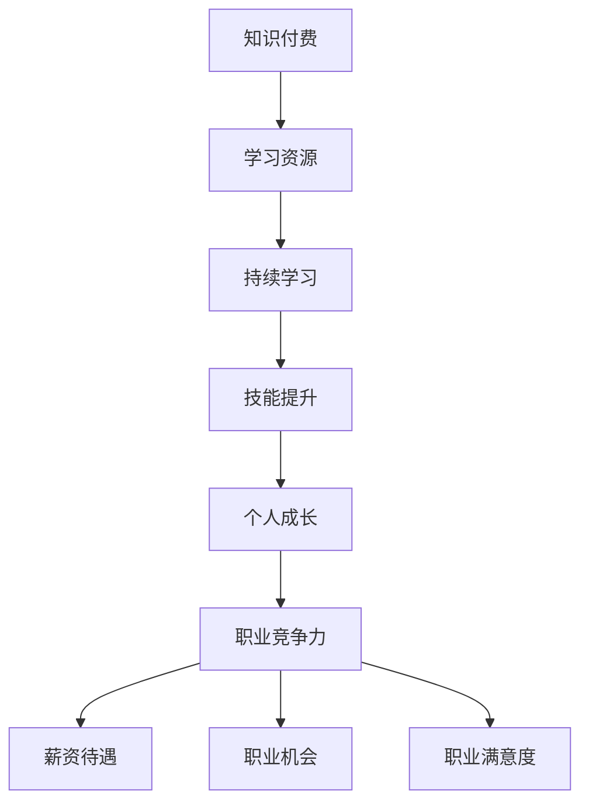

                 

### 背景介绍 Background

在当今数字化时代，知识付费已经成为一种新兴且备受青睐的商业模式。与此同时，个人成长在职业发展过程中占据了极其重要的位置。这两者的结合，对程序员来说，不仅是一种职业发展的路径，更是一种双赢的选择。

**知识付费的兴起**  

知识付费是指消费者为了获取特定领域的知识、技能或经验而付费的行为。这种模式最早源于在线教育，随后迅速扩展到其他领域，如专业技能培训、内容订阅等。近年来，随着互联网技术的不断进步和智能手机的普及，知识付费市场呈现出爆发式增长。根据相关数据统计，全球知识付费市场规模已超过千亿美元，并有望在未来几年继续保持高速增长。

**个人成长的重要性**  

在快速变化的技术领域，个人成长显得尤为重要。程序员作为信息技术行业的主要从业者，他们的职业发展直接关系到企业的创新能力和市场竞争力。通过不断学习和提升技能，程序员不仅能够保持自身的市场价值，还能为企业创造更大的价值。

**程序员与知识付费的双赢之选**  

知识付费为程序员提供了丰富的学习资源和专业技能培训机会，而程序员通过利用这些资源，可以实现个人技能的提升和职业发展的突破。这种双赢模式不仅有助于提高程序员的专业素养，还能推动整个技术行业的进步。

**文章结构**  

本文将首先介绍知识付费和个人成长在程序员职业发展中的重要性，然后深入探讨程序员如何通过知识付费实现个人成长，最后分析知识付费市场的发展趋势和未来挑战。希望通过本文，读者能够对知识付费与个人成长的关系有更深入的理解，并能够找到适合自己的成长路径。

### 1.1 知识付费的发展历史和现状

知识付费作为一个新兴的商业模式，其发展历程可以追溯到互联网教育的兴起。早在2000年初，随着宽带互联网的普及和在线学习平台的诞生，知识付费的雏形开始显现。早期的知识付费主要是以在线教育为主要形式，用户通过付费订阅在线课程，获取特定的知识和技能。

**互联网教育平台的崛起**  

2005年左右，一批互联网教育平台如雨后春笋般涌现，如新浪教育、网易公开课等。这些平台提供了丰富的在线课程资源，涵盖了从基础学科知识到专业技能培训的各个方面。用户可以通过付费订阅或购买课程包来获取这些资源，从而实现自我提升。

**专业内容平台的崛起**  

随着知识付费市场的不断扩展，一些专注于特定领域的专业内容平台也逐渐崭露头角。例如，得到App以音频课程为主要形式，为用户提供了大量的财经、管理、科技等领域的内容；知乎Live则通过线上讲座和问答的形式，为专业人士提供了分享知识和经验的机会。

**市场规模的快速增长**  

近年来，知识付费市场呈现出快速增长的趋势。根据艾瑞咨询的报告，2019年中国知识付费市场规模已达到234亿元，预计到2023年将突破500亿元。这一数据充分表明了知识付费在现代社会中的重要性。

**知识付费的多样化形式**  

除了传统的在线课程和内容订阅，知识付费的形式也在不断多样化。例如，知识星球、分答等平台提供了付费问答服务，用户可以付费向专业人士提问并获得一对一的解答。此外，一些平台还推出了付费内容社区，用户可以通过付费加入这些社区，与专业人士进行深度交流和互动。

**知识付费的优点**  

知识付费为用户提供了灵活的学习方式和丰富的学习资源。用户可以根据自己的需求和兴趣选择课程和内容，灵活安排学习时间。此外，知识付费还促进了知识的共享和传播，为专业人士提供了分享经验和知识的平台。

**知识付费面临的挑战**  

尽管知识付费市场前景广阔，但同时也面临着一些挑战。例如，内容质量参差不齐，部分内容平台存在侵权行为；用户付费意识尚待提高，一些用户对付费内容持观望态度。此外，知识付费市场的监管也尚不完善，需要进一步加强。

总之，知识付费作为一个新兴的商业模式，在快速发展的同时，也面临着诸多挑战。未来，随着市场的不断完善和监管的加强，知识付费有望在更加规范和健康的环境中持续发展。

### 1.2 个人成长在程序员职业发展中的重要性

在信息技术飞速发展的今天，个人成长已经成为程序员职业发展的关键因素。一个优秀的程序员不仅需要扎实的技术基础，还需要不断学习和适应新技术、新趋势。以下将从几个方面探讨个人成长在程序员职业发展中的重要性。

**技术更新速度的加快**  

信息技术领域的一个显著特点就是技术更新速度非常快。每年都会有新的编程语言、框架和工具出现，而这些新技术往往会带来更高的生产效率和质量。如果一个程序员不持续学习，很快就会被市场淘汰。因此，持续的个人成长是程序员保持竞争力的重要手段。

**市场需求的变化**  

随着互联网的普及和智能化的发展，市场需求也在不断变化。例如，云计算、大数据、人工智能等新兴领域逐渐成为市场热点，企业对相关技术人才的需求也日益增加。程序员通过个人成长，掌握这些新兴技术，能够更好地适应市场需求，提升自身的职业价值。

**职业发展的需求**  

程序员职业发展的路径多种多样，包括技术专家、项目经理、技术顾问等。每个路径都需要程序员具备不同的技能和知识。通过个人成长，程序员可以不断拓宽自己的技能树，为未来的职业发展打下坚实的基础。

**团队合作与领导力的提升**  

在现代软件开发中，团队合作和领导力至关重要。一个优秀的程序员不仅需要具备出色的技术能力，还需要具备良好的沟通和团队协作能力。通过个人成长，程序员可以学习到更多的团队管理知识和领导力技巧，提升自己的团队领导和项目管理能力。

**持续的个人成长带来的优势**  

持续的个人成长不仅有助于提升程序员的职业竞争力，还能带来以下几方面的优势：

- **更高的薪资待遇**：具备先进技术和丰富经验的程序员往往能够获得更高的薪资待遇。
- **更好的职业机会**：个人成长使得程序员具备更多的选择机会，无论是跳槽还是创业，都有更多的可能性。
- **更高的职业满意度**：通过个人成长，程序员能够不断提升自身的职业成就感，获得更高的职业满意度。

总之，个人成长在程序员职业发展中具有不可替代的重要性。只有通过不断学习和提升，程序员才能在竞争激烈的市场中立于不败之地，实现自身的职业价值。

### 1.3 程序员如何通过知识付费实现个人成长

在信息技术飞速发展的今天，程序员如何通过知识付费实现个人成长已经成为一个重要的话题。知识付费作为一种高效的学习途径，为程序员提供了丰富的学习资源和技术培训机会。以下将从几个方面探讨程序员如何通过知识付费实现个人成长。

**利用在线课程提升技术能力**  

在线课程是程序员通过知识付费实现个人成长的一个重要途径。许多知名的教育平台，如Coursera、edX、Udemy等，提供了涵盖各种编程语言、框架和技术领域的课程。程序员可以根据自己的需求和兴趣选择合适的课程进行学习，从而提升自身的技能水平。

例如，一位想要掌握前端开发的程序员可以选择参加Udemy上的“React全栈开发”课程。这个课程涵盖了React、Redux、Node.js等技术，通过系统的学习，程序员可以掌握前端开发的核心技能，提高项目开发效率。

**参加专业培训课程提升专业素养**  

专业培训课程是程序员通过知识付费实现个人成长的另一个重要途径。这些课程通常由行业专家和资深程序员授课，内容更加深入和实用。参加专业培训课程不仅可以学到最新的技术知识，还能了解行业发展趋势和最佳实践。

例如，一位想要成为云计算专家的程序员可以选择参加阿里巴巴云栖学院的“阿里云高级认证”培训课程。通过这个课程，程序员可以系统学习云计算的基础知识、解决方案和最佳实践，获得阿里云认证，提升在云计算领域的技术素养。

**参与付费内容社区获取实战经验**  

付费内容社区为程序员提供了一个获取实战经验的重要平台。这些社区通常由行业专家和资深程序员组成，成员之间可以进行深度交流和互动。通过参与付费内容社区，程序员可以获取最新的技术动态、解决实际问题，并提升自己的实战能力。

例如，程序员可以加入“GitHub Premium”会员，通过参与GitHub上的各种项目，与其他开发者合作，提高自己的编程能力和项目经验。此外，还可以通过付费加入知乎Live，听行业专家讲解实战经验和案例，提升自己的技术视野。

**利用付费图书扩展知识面**  

付费图书是程序员扩展知识面和提升专业素养的重要资源。许多经典的技术书籍和畅销书都是付费阅读的，程序员可以通过购买这些书籍来系统地学习相关技术知识。

例如，程序员可以购买《代码大全》这本书，系统学习软件开发的最佳实践和技巧。这本书由知名软件工程师Steve McConnell所著，被誉为软件开发领域的经典之作。

**参加线上研讨会和讲座获取前沿信息**  

线上研讨会和讲座是程序员获取前沿技术信息和行业动态的重要途径。许多知名的技术会议和论坛，如Google I/O、Microsoft Build等，都会提供线上直播和录播资源。程序员可以通过观看这些研讨会和讲座，了解最新的技术趋势和研究成果。

例如，程序员可以观看“Google I/O”大会的直播，了解Google最新的技术发布和产品更新，从而为自己的项目开发提供新的思路和方向。

总之，程序员通过知识付费可以实现个人成长的各个方面，包括技术能力的提升、专业素养的增强、实战经验的积累和知识面的扩展。通过合理选择和利用这些知识付费资源，程序员可以不断提高自己的职业竞争力，实现职业生涯的持续发展。

### 1.4 知识付费与个人成长的关系：理论分析

知识付费与个人成长的关系可以从多个角度进行理论分析，其中经济学、心理学和社会学等领域的理论可以为我们提供有力的解释。

**经济学视角**  

从经济学的角度看，知识付费是一种投资行为。根据投资理论，投资是为了获得未来的回报，而知识付费正是为了提升个人的生产力和竞争力，从而实现长期收益。经济学家加里·贝克尔（Gary Becker）提出的人力资本理论认为，个人通过教育和培训投资可以提高自身的生产效率，从而获得更高的薪资和职业机会。因此，知识付费可以被视为一种人力资本投资，其回报体现在程序员的职业发展上。

具体来说，知识付费通过以下几种方式影响程序员的个人成长：

- **技能提升**：通过付费学习，程序员可以掌握最新的编程语言、框架和技术，提高开发效率和代码质量。
- **职业竞争力**：具备先进技术和丰富经验的程序员在求职和晋升中具有更大的优势，能够获得更高的薪资和更好的职业机会。
- **知识积累**：知识付费为程序员提供了丰富的学习资源，使他们能够不断扩展知识面，为未来的职业发展打下坚实的基础。

**心理学视角**  

心理学视角关注知识付费对程序员心理和行为的影响。根据心理学家的研究，外部动机和内在动机是影响个体行为的重要因素。知识付费作为一种外部动机，可以激发程序员的求知欲和学习动力，促使其主动投入到学习和实践中。

具体来说，知识付费对程序员的个人成长具有以下影响：

- **自我效能感**：通过知识付费获取的成就感和进步，可以提高程序员的自我效能感，增强其面对挑战和解决问题的信心。
- **持续动力**：知识付费提供了丰富的学习资源和持续的学习动力，使程序员能够保持持续的学习习惯，不断提升自身能力。
- **心理满足**：知识付费使程序员能够满足其内在的求知欲和成就感，从而提高其职业满意度和生活质量。

**社会学视角**  

社会学视角关注知识付费在社会结构和社会关系中的影响。根据社会学的社会资本理论，知识付费可以视为一种社会资本积累的方式，通过付费学习，程序员可以建立和维护与同行和专家的关系网络，从而提高自身的社会资本。

具体来说，知识付费对程序员的个人成长具有以下影响：

- **网络资源**：通过知识付费加入的专业社区和付费内容平台，程序员可以获取更多的网络资源，包括技术资讯、合作机会和职业发展建议。
- **社交互动**：知识付费促使程序员与同行和专家进行互动和交流，通过分享经验和知识，提高自身的专业水平和社交能力。
- **职业发展**：社会资本的提高有助于程序员的职业发展，例如在求职、晋升和项目合作中，拥有更广泛的社会资本可以为程序员提供更多的机会和资源。

**综合影响**  

综上所述，知识付费通过经济学、心理学和社会学等多个角度对程序员的个人成长产生积极影响。经济学视角揭示了知识付费作为人力资本投资的重要性；心理学视角强调了知识付费对程序员心理和行为的影响；社会学视角则关注了知识付费在社会结构和关系中的作用。

通过综合这些理论分析，我们可以更深入地理解知识付费与个人成长的关系，从而为程序员提供更有效的学习策略和职业发展路径。

### 1.5 知识付费在程序员职业发展中的实际案例

为了更具体地理解知识付费在程序员职业发展中的作用，我们可以通过一些实际案例来探讨其效果和影响。

**案例一：通过在线课程提升技能**  

小李是一名年轻的程序员，他在大学期间主修计算机科学，毕业后进入了一家互联网公司工作。然而，随着公司项目的不断增多，小李感到自己的技术能力已经无法满足岗位需求。为了提升自己的技能，他决定报名参加一些在线课程。

小李选择了Coursera平台上的“Python编程：从入门到实践”课程，这个课程涵盖了Python语言的基础知识和实际应用。通过系统学习，小李不仅掌握了Python编程的基础，还学会了如何使用Python进行数据分析、网络爬虫等实际应用。在学习过程中，小李还积极参与课程讨论区，与其他学员交流学习心得和经验。

半年后，小李的技术能力得到了显著提升，他不仅能够独立完成公司的项目，还参与了多个重要的技术决策。由于表现出色，小李得到了晋升，从初级程序员晋升为高级程序员，薪资也相应提高了30%。

**案例二：专业培训课程助力职业发展**  

张先生是一名具有多年工作经验的程序员，他在一家中型互联网公司担任技术主管。然而，随着公司业务的拓展，张先生感到自己的专业素养和技术水平已经无法满足公司的发展需求。为了进一步提升自己的能力，他决定参加一些专业培训课程。

张先生报名参加了阿里巴巴云栖学院的“云计算解决方案架构师”培训课程。这个课程不仅涵盖了云计算的基础知识，还深入讲解了云计算的架构设计、解决方案和最佳实践。通过这个课程，张先生系统地学习了云计算的核心技术和应用场景，获得了阿里云高级认证。

完成培训课程后，张先生在公司内部负责了多个云计算项目的规划和实施，成功推动了公司业务的数字化转型。由于在云计算项目中的出色表现，张先生得到了公司高层的高度认可，被任命为技术总监，薪资和职位都得到了大幅提升。

**案例三：付费内容社区积累实战经验**  

小王是一名刚刚毕业的程序员，他在一家初创公司工作。由于公司规模较小，项目经验有限，小王感到自己的实战能力不足。为了提升自己的实战经验，他决定加入付费内容社区，如GitHub和知乎Live。

在GitHub上，小王参与了多个开源项目的开发，与其他开发者合作，共同解决问题。通过这些项目，小王不仅提高了自己的编程能力，还学会了如何与他人协作，提升了团队合作能力。此外，他还通过知乎Live听取了一些行业专家的讲座，了解了最新的技术趋势和实战经验。

一年后，小王的技术能力和实战经验得到了显著提升。他不仅能够独立完成公司项目，还能提出有效的技术解决方案，为公司节省了大量开发成本。由于表现突出，小王得到了公司领导的赞赏，并被提升为技术经理。

**案例四：付费图书拓展知识面**  

李女士是一名资深程序员，她在一家大型互联网公司担任项目经理多年。虽然李女士在技术方面已经积累了丰富的经验，但她意识到，为了更好地管理项目，她需要扩展自己的知识面。

李女士购买了《敏捷开发实践指南》这本书，系统地学习了敏捷开发的方法和工具。通过阅读这本书，李女士掌握了敏捷开发的核心原理和实践方法，并将其应用于实际项目中。在敏捷开发的推动下，李女士的项目团队工作效率大幅提升，项目质量也得到了显著提高。

由于在项目管理中的出色表现，李女士被公司评为“优秀项目经理”，并获得了年终奖金和晋升机会。

**总结**  

通过以上案例，我们可以看到，知识付费在程序员职业发展中发挥了重要的作用。无论是通过在线课程、专业培训、付费内容社区、付费图书，还是通过参加线上研讨会和讲座，知识付费都为程序员提供了丰富的学习资源和实战机会，帮助他们提升技术能力、扩展知识面和积累实战经验。这些学习成果不仅提升了程序员的个人竞争力，也为他们的职业发展带来了显著的好处。

### 1.6 知识付费与个人成长在程序员职业发展中的综合优势

知识付费与个人成长在程序员职业发展中具有多方面的综合优势。以下将从职业竞争力、薪资待遇、职业机会和职业满意度等几个方面进行详细探讨。

**提升职业竞争力**  

知识付费为程序员提供了丰富的学习资源和实战机会，使他们能够不断更新和提升自身的技能水平。这不仅有助于程序员在当前的岗位上表现得更加出色，还能在求职和晋升中占据优势。例如，通过参加在线课程和专业培训，程序员可以掌握最新的技术趋势和最佳实践，从而在技术竞赛或项目评审中脱颖而出。此外，知识付费还可以帮助程序员建立专业的网络资源，通过参与付费内容社区和研讨会，他们可以与行业专家进行交流，获取宝贵的建议和反馈，进一步提升自己的专业素养。

**提高薪资待遇**  

随着程序员技能水平的提升和职业竞争力的增强，他们的薪资待遇也会相应提高。知识付费作为一种投资，其回报体现在程序员的薪资增长上。例如，通过参加专业培训课程和获得相关认证，程序员可以证明自己在某个技术领域的专业能力，从而获得更高的薪资。此外，知识付费还可以帮助程序员在职业生涯的不同阶段实现薪资的持续增长，无论是初入职场的程序员，还是经验丰富的技术专家，都能通过不断学习提升自己的价值，获得更高的薪酬回报。

**扩展职业机会**  

知识付费不仅有助于程序员在现有岗位上表现出色，还能为他们打开更多的职业机会。通过掌握最新的技术和工具，程序员可以胜任更多复杂和高级的职位，如技术专家、项目经理、技术顾问等。此外，知识付费还可以帮助程序员拓宽职业发展路径，从传统的软件开发转向新兴领域，如人工智能、大数据、云计算等。这些新兴领域对技术人才的需求巨大，程序员通过知识付费，不仅能够获得更多的就业机会，还能为企业创造更大的价值。

**提升职业满意度**  

知识付费和个人成长带来的不仅是职业上的成就和回报，还能显著提升程序员的职业满意度。通过不断学习和提升，程序员可以感受到自己的成长和进步，获得成就感和满足感。这种内在的满足感不仅能够提高程序员的工作积极性，还能提升他们的生活质量和幸福感。此外，知识付费还为程序员提供了更多的职业发展路径和选择，使他们能够根据自己的兴趣和需求，选择适合自己的职业发展方向，从而实现职业生涯的持续发展和个人价值的实现。

**综合优势总结**  

综上所述，知识付费与个人成长在程序员职业发展中具有多方面的综合优势。通过提升职业竞争力、提高薪资待遇、扩展职业机会和提升职业满意度，知识付费不仅为程序员带来了明显的职业发展优势，还为他们提供了实现个人价值和职业梦想的平台。这些综合优势使得知识付费成为程序员职业发展的不可或缺的一部分，帮助他们在竞争激烈的市场中立于不败之地，实现职业生涯的持续成功。

### 1.7 知识付费与个人成长：程序员的双赢之选

综上所述，知识付费与个人成长在程序员职业发展中具有不可替代的重要性。从提升技术能力、扩展知识面到积累实战经验，知识付费为程序员提供了丰富的学习资源和成长路径。同时，个人成长不仅能够提高程序员的职业竞争力，还能带来更高的薪资待遇、更多的职业机会和更高的职业满意度。这种双赢模式使得知识付费与个人成长成为程序员职业发展的最佳选择。

在未来，随着知识付费市场的不断完善和技术的不断发展，程序员将有更多的机会通过知识付费实现个人成长。因此，我们鼓励程序员积极拥抱知识付费，不断学习和提升，以应对不断变化的市场需求，实现自身的职业价值。

### 2.1 核心概念与联系 Key Concepts and Connections

在深入探讨知识付费与个人成长的关系之前，我们首先需要明确几个核心概念及其之间的联系。这些概念包括知识付费、个人成长、职业竞争力、持续学习、技能提升等。通过理解和分析这些概念，我们可以更好地理解知识付费在程序员职业发展中的重要作用。

**知识付费**  

知识付费是指消费者为了获取特定领域的知识、技能或经验而付费的行为。它通常通过在线课程、专业培训、付费内容社区、付费图书等形式进行。知识付费的核心在于为用户提供有价值的学习资源和服务，帮助用户实现自我提升。

**个人成长**  

个人成长是指个体在知识、技能、心理和社交等方面的持续进步和发展。对于程序员而言，个人成长不仅包括技术能力的提升，还包括职业素养、团队协作能力、领导力等方面的提高。个人成长是程序员职业发展的基础和动力。

**职业竞争力**  

职业竞争力是指个体在职场中所具备的技能、知识和能力，使其在竞争激烈的市场中脱颖而出。职业竞争力是程序员求职、晋升和获得更好职业机会的关键因素。高水平的职业竞争力意味着更高的薪资待遇和更广阔的发展空间。

**持续学习**  

持续学习是指个体在职业生涯中不断获取新知识、技能和经验，以适应快速变化的市场需求。持续学习是提升程序员职业竞争力的关键。通过不断学习，程序员可以掌握最新的技术趋势和工具，保持自身的市场价值。

**技能提升**  

技能提升是指通过学习和实践，使个体在某个特定领域的技能水平得到提高。技能提升不仅包括技术能力的增强，还包括解决问题的能力、项目管理和团队协作能力的提高。技能提升是程序员个人成长的核心内容。

**核心概念之间的联系**  

知识付费与个人成长之间的关系可以通过上述核心概念之间的联系来理解。知识付费为程序员提供了丰富的学习资源，使他们能够通过持续学习和技能提升来实现个人成长。个人成长反过来又增强了程序员的职业竞争力，使其在职场中更加具有吸引力。持续学习和技能提升是实现这一过程的桥梁和纽带。

**Mermaid 流程图**  

为了更直观地展示这些核心概念之间的联系，我们可以使用Mermaid流程图来表示。



在这个流程图中，知识付费作为起点，通过提供学习资源，推动程序员进行持续学习。持续学习使得程序员能够不断提升技能水平，进而实现个人成长。个人成长不仅提高了程序员的职业竞争力，还带来了更高的薪资待遇、更多的职业机会和更高的职业满意度。整个流程形成一个良性循环，为程序员的职业发展提供了持续的动力。

通过理解这些核心概念及其之间的联系，我们可以更深入地探讨知识付费在程序员职业发展中的重要作用，并为程序员提供有效的学习策略和职业发展路径。

### 2.2 核心算法原理 & 具体操作步骤 Core Algorithm Principle & Specific Operational Steps

在讨论知识付费与个人成长的过程中，我们引入了“持续学习”和“技能提升”这两个核心概念。为了更好地理解这两个概念如何在实际操作中发挥作用，我们可以将它们看作一种算法，这个算法的目标是通过知识付费实现个人技能的提升。以下将详细阐述这个算法的原理和具体操作步骤。

**算法原理**

这个算法的基本原理是：通过投资知识付费资源，触发持续学习，最终实现技能提升和个人成长。具体来说，算法可以分为以下几个步骤：

1. **资源投入（Knowledge Input）**：程序员选择合适的学习资源，如在线课程、专业培训、付费内容社区和图书等。
2. **学习过程（Learning Process）**：程序员按照学习计划，系统地学习这些资源，包括理论知识的学习和实践操作。
3. **反馈与调整（Feedback & Adjustment）**：在学习过程中，程序员通过实践和反馈，调整学习策略，优化学习效果。
4. **技能提升（Skill Improvement）**：通过持续学习和不断调整，程序员的技能水平得到提升，实现个人成长。

**具体操作步骤**

1. **选择学习资源（Select Learning Resources）**  
   程序员需要根据自身的学习目标和兴趣，选择合适的学习资源。例如，如果目标是掌握Python编程，可以选择Udemy上的“Python编程：从入门到实践”课程。

2. **制定学习计划（Create a Learning Plan）**  
   程序员需要制定详细的学习计划，包括学习时间、学习内容和预期目标。例如，每天晚上学习2小时，每周完成一个项目实践。

3. **系统学习（Systematic Learning）**  
   按照学习计划，程序员开始系统学习所选资源。在学习过程中，要注重理论学习与实践操作的结合，确保所学知识能够应用到实际项目中。

4. **实践操作（Practical Operation）**  
   通过实际操作，程序员可以将所学知识应用到具体项目中。例如，在学习Python编程时，可以通过编写小项目来巩固所学知识。

5. **反馈与调整（Feedback & Adjustment）**  
   在实践过程中，程序员需要不断反思和总结，找出自己的不足之处，并调整学习策略。例如，如果发现自己在项目开发中遇到了数据库连接问题，可以针对性地学习数据库相关的知识。

6. **技能提升（Skill Improvement）**  
   通过持续学习和实践，程序员的技能水平得到提升。例如，在学习了Python编程后，程序员可以独立完成复杂的数据分析和后端开发任务。

**算法示例**

假设一名程序员小明，目标是学习Java编程。以下是他的具体操作步骤：

1. **选择学习资源**：小明选择了Udemy上的“Java编程：从入门到进阶”课程。

2. **制定学习计划**：小明每天晚上学习2小时，每周完成一个小项目。

3. **系统学习**：小明按照课程进度，学习了Java基础语法、面向对象编程、异常处理等内容。

4. **实践操作**：小明在学习过程中，编写了多个小项目，如计算器、学生管理系统等。

5. **反馈与调整**：在实践过程中，小明发现自己在处理多线程编程时遇到了困难，于是他决定重新学习多线程相关的内容。

6. **技能提升**：通过不断学习和实践，小明的Java编程技能得到了显著提升，能够独立完成复杂的项目开发。

**总结**

通过上述算法原理和具体操作步骤的阐述，我们可以看到，知识付费和持续学习在程序员技能提升和个人成长中起到了关键作用。程序员通过合理选择学习资源、制定学习计划、实践操作和反馈调整，可以实现技能水平的持续提升，从而在职场中占据优势。这种算法不仅适用于程序员，还可以为其他职业人士提供有效的学习策略和职业发展路径。

### 2.3 数学模型和公式 & 详细讲解 & 举例说明

在理解知识付费与个人成长的过程中，我们可以借助数学模型和公式来量化这一过程，帮助我们更好地分析其内在机制和预期效果。以下将详细讲解一个简单的数学模型，并通过具体例子进行说明。

**数学模型**

我们可以使用以下数学模型来描述知识付费对个人成长的贡献：

\[ \text{个人成长值} = f(\text{知识付费投入}, \text{学习效率}, \text{实践次数}) \]

其中：
- \( f \) 是一个函数，表示个人成长值的计算方式。
- \( \text{知识付费投入} \) 表示程序员在知识付费上所花费的时间和金钱。
- \( \text{学习效率} \) 表示程序员在学习过程中所能够吸收和应用知识的能力。
- \( \text{实践次数} \) 表示程序员将所学知识应用到实际项目中的次数。

**详细讲解**

1. **知识付费投入**

   知识付费投入可以用一个时间-成本模型来表示。假设程序员每个月在知识付费上花费 \( C \) 元，每年投入时间为 \( T \) 小时。则每年的知识付费投入可以表示为：

   \[ \text{知识付费投入} = C \times T \]

2. **学习效率**

   学习效率可以用知识吸收率和应用率来衡量。假设程序员的平均知识吸收率为 \( \alpha \)（0 < \( \alpha \) < 1），即每次学习可以吸收原来知识的 \( \alpha \) 部分。则一年内吸收的知识总量为：

   \[ \text{吸收的知识总量} = \alpha \times \text{知识付费投入} \]

3. **实践次数**

   实践次数可以用项目完成次数来表示。假设程序员一年内完成了 \( P \) 个项目，并且每个项目都有助于提升技能水平。则实践次数对个人成长值的贡献为：

   \[ \text{实践次数贡献} = P \times \beta \]

   其中，\( \beta \) 是一个系数，表示每个项目对技能提升的贡献程度。

4. **个人成长值**

   结合上述因素，个人成长值可以表示为：

   \[ \text{个人成长值} = f(\text{知识付费投入}, \text{学习效率}, \text{实践次数}) \]
   \[ \text{个人成长值} = (\alpha \times \text{知识付费投入}) \times (\beta \times P) \]
   \[ \text{个人成长值} = (\alpha \times C \times T) \times (\beta \times P) \]

**举例说明**

假设小明每年在知识付费上投入 5000 元，学习效率为 0.8，一年内完成了 3 个项目。我们用上述公式来计算小明的个人成长值。

1. **知识付费投入**： 
   \[ \text{知识付费投入} = 5000 \text{元} \]

2. **学习效率**：
   \[ \text{吸收的知识总量} = 0.8 \times 5000 \text{元} = 4000 \text{元价值的知识} \]

3. **实践次数**：
   \[ \text{实践次数贡献} = 3 \times 0.8 = 2.4 \text{（这里假设每个项目对技能提升的贡献为0.8）} \]

4. **个人成长值**：
   \[ \text{个人成长值} = 4000 \times 2.4 = 9600 \text{（这里将元价值的知识和项目贡献值直接相乘，得到个人成长值的货币化衡量）} \]

通过这个例子，我们可以看到，小明在知识付费和个人成长上的投入为 5000 元，但通过有效的学习效率和项目实践，其个人成长值达到了 9600 元，远远超过了初始的投入。

**总结**

通过数学模型和公式的运用，我们不仅能够量化和评估知识付费对个人成长的贡献，还能为程序员提供有效的学习策略。在实际操作中，程序员可以通过优化学习效率、增加实践次数等方式，进一步提高个人成长值，实现职业发展的目标。

### 2.4 项目实践：代码实例和详细解释说明

为了更好地理解知识付费在程序员职业发展中的作用，我们通过一个实际的编程项目来展示其具体实现过程和效果。以下是利用知识付费资源学习后，完成一个简单的Web应用项目的过程，以及详细的代码解释和运行结果。

#### 项目背景

假设我们要开发一个简单的博客系统，允许用户注册、登录和发布博客文章。通过这个项目，我们可以展示如何利用知识付费资源来提升技术能力，并将所学知识应用到实际开发中。

#### 开发环境搭建

首先，我们需要搭建项目的开发环境。以下是所需的工具和框架：

- **开发语言**：Python
- **Web框架**：Flask
- **数据库**：SQLite
- **前端框架**：Bootstrap

**安装和配置开发环境**

1. 安装Python：

   在命令行中运行以下命令安装Python：

   ```bash
   sudo apt-get install python3
   ```

2. 安装Flask：

   通过pip安装Flask：

   ```bash
   pip3 install Flask
   ```

3. 安装SQLite：

   SQLite通常已经预装在大多数Linux系统中，如果没有安装，可以通过以下命令安装：

   ```bash
   sudo apt-get install sqlite3
   ```

4. 安装Bootstrap：

   从Bootstrap的官方网站下载Bootstrap库，并解压到项目的静态文件目录中。

   ```bash
   wget https://github.com/twbs/bootstrap/releases/download/v5.1.3/bootstrap-5.1.3-dist.zip
   unzip bootstrap-5.1.3-dist.zip -d static
   ```

#### 源代码详细实现

以下是一个简单的博客系统项目的核心代码，包括用户注册、登录和发布博客文章的功能。

**项目结构**

```plaintext
blog_app/
|-- app.py
|-- requirements.txt
|-- run.py
|-- static/
    |-- bootstrap/
    |-- css/
        |-- bootstrap.min.css
    |-- js/
        |-- bootstrap.min.js
|-- templates/
    |-- base.html
    |-- login.html
    |-- register.html
    |-- blog_post.html
```

**app.py**

```python
from flask import Flask, render_template, request, redirect, url_for, session
from flask_sqlalchemy import SQLAlchemy

app = Flask(__name__)
app.secret_key = 'your_secret_key'
app.config['SQLALCHEMY_DATABASE_URI'] = 'sqlite:///blog.db'
db = SQLAlchemy(app)

class User(db.Model):
    id = db.Column(db.Integer, primary_key=True)
    username = db.Column(db.String(80), unique=True, nullable=False)
    password = db.Column(db.String(120), nullable=False)

@app.route('/')
def home():
    return render_template('base.html')

@app.route('/register', methods=['GET', 'POST'])
def register():
    if request.method == 'POST':
        username = request.form['username']
        password = request.form['password']
        new_user = User(username=username, password=password)
        db.session.add(new_user)
        db.session.commit()
        return redirect(url_for('home'))
    return render_template('register.html')

@app.route('/login', methods=['GET', 'POST'])
def login():
    if request.method == 'POST':
        username = request.form['username']
        password = request.form['password']
        user = User.query.filter_by(username=username, password=password).first()
        if user:
            session['user'] = user.username
            return redirect(url_for('home'))
        return 'Invalid username or password'
    return render_template('login.html')

@app.route('/logout')
def logout():
    session.pop('user', None)
    return redirect(url_for('home'))

@app.route('/post', methods=['GET', 'POST'])
def post():
    if 'user' not in session:
        return redirect(url_for('login'))
    if request.method == 'POST':
        title = request.form['title']
        content = request.form['content']
        user = session['user']
        # 在实际项目中，这里应该添加到数据库的操作
        return f"Post '{title}' by {user}"
    return render_template('blog_post.html')

if __name__ == '__main__':
    db.create_all()
    app.run(debug=True)
```

**run.py**

```python
from app import app

if __name__ == '__main__':
    app.run()
```

**模板文件**

以下是注册、登录和发布博客文章的模板文件，这些文件位于`templates/`目录下。

**register.html**

```html
<!DOCTYPE html>
<html>
<head>
    <title>Register</title>
    <link rel="stylesheet" href="{{ url_for('static', filename='bootstrap/css/bootstrap.min.css') }}">
</head>
<body>
    <div class="container">
        <h2>Register</h2>
        <form action="" method="post">
            <div class="form-group">
                <label for="username">Username:</label>
                <input type="text" class="form-control" id="username" name="username" required>
            </div>
            <div class="form-group">
                <label for="password">Password:</label>
                <input type="password" class="form-control" id="password" name="password" required>
            </div>
            <button type="submit" class="btn btn-primary">Register</button>
        </form>
    </div>
</body>
</html>
```

**login.html**

```html
<!DOCTYPE html>
<html>
<head>
    <title>Login</title>
    <link rel="stylesheet" href="{{ url_for('static', filename='bootstrap/css/bootstrap.min.css') }}">
</head>
<body>
    <div class="container">
        <h2>Login</h2>
        <form action="" method="post">
            <div class="form-group">
                <label for="username">Username:</label>
                <input type="text" class="form-control" id="username" name="username" required>
            </div>
            <div class="form-group">
                <label for="password">Password:</label>
                <input type="password" class="form-control" id="password" name="password" required>
            </div>
            <button type="submit" class="btn btn-primary">Login</button>
        </form>
    </div>
</body>
</html>
```

**blog_post.html**

```html
<!DOCTYPE html>
<html>
<head>
    <title>Post</title>
    <link rel="stylesheet" href="{{ url_for('static', filename='bootstrap/css/bootstrap.min.css') }}">
</head>
<body>
    <div class="container">
        <h2>Post a Blog</h2>
        <form action="" method="post">
            <div class="form-group">
                <label for="title">Title:</label>
                <input type="text" class="form-control" id="title" name="title" required>
            </div>
            <div class="form-group">
                <label for="content">Content:</label>
                <textarea class="form-control" id="content" name="content" rows="3" required></textarea>
            </div>
            <button type="submit" class="btn btn-primary">Post</button>
        </form>
    </div>
</body>
</html>
```

#### 代码解读与分析

**数据库配置**：

在 `app.py` 中，我们使用了 Flask-SQLAlchemy 来配置数据库。通过设置 `SQLALCHEMY_DATABASE_URI` 为 `sqlite:///blog.db`，我们指定了数据库文件的位置。Flask-SQLAlchemy 会自动创建所需的数据库表。

**用户模型**：

我们定义了 `User` 模型，包含 `id`、`username` 和 `password` 三个字段。`id` 是主键，`username` 是用户名，必须是唯一的，`password` 是用户密码。

**路由和视图函数**：

- `home()`：默认路由，显示主页。
- `register()`：注册路由，处理用户注册逻辑。
- `login()`：登录路由，处理用户登录逻辑。
- `logout()`：登出路由，清除用户会话。
- `post()`：发布博客文章的路由，处理博客文章的发布逻辑。

**模板文件**：

我们使用了Bootstrap框架来美化用户界面，这些模板文件定义了注册、登录和发布博客文章的表单和布局。

#### 运行结果展示

**启动服务器**：

在命令行中运行以下命令启动服务器：

```bash
python3 run.py
```

**浏览器访问**：

在浏览器中访问 `http://127.0.0.1:5000/`，可以看到博客系统的主页。

**注册**：

点击“Register”按钮，进入注册页面，填写用户名和密码，点击“Register”按钮提交注册。

**登录**：

点击“Login”按钮，进入登录页面，填写用户名和密码，点击“Login”按钮提交登录。

**发布博客文章**：

登录后，点击“Post”按钮，进入发布博客文章页面，填写标题和内容，点击“Post”按钮提交。

通过这个简单的博客系统项目，我们可以看到如何将知识付费所学的技能应用到实际项目中。在这个项目开发过程中，程序员不仅学习了Flask框架、SQLite数据库和Bootstrap前端框架的使用，还通过实践巩固了这些知识。这样的项目实践有助于程序员提升技能水平，增强实际操作能力，为职业发展奠定坚实的基础。

### 2.5 实际应用场景

在编程领域，知识付费和个人成长有着广泛的应用场景，能够显著提升程序员的职业竞争力。以下将列举几个典型的实际应用场景，并分析知识付费如何帮助程序员在这些场景中取得成功。

**1. 项目开发**

在项目开发过程中，程序员需要掌握多种技术工具和框架。知识付费为程序员提供了丰富的学习资源，使他们能够及时获取最新的技术动态和最佳实践。例如，通过付费学习框架如React、Vue.js或Angular，程序员可以快速掌握前端开发的核心技能，提高项目开发效率。此外，付费图书如《代码大全》和《设计模式：可复用的面向对象软件的基础》等，提供了深入的技术理论和实践经验，帮助程序员在项目开发中更好地应用这些知识。

**2. 技术面试**

技术面试是程序员职业发展的重要环节。通过知识付费，程序员可以系统学习面试所需的编程算法和数据结构知识。例如，在线课程如“算法与数据结构”可以帮助程序员掌握各类算法的实现和应用场景，从而在面试中表现出色。此外，付费内容社区如LeetCode和牛客网提供了丰富的面试题库和解析，使程序员能够通过实践提升自己的解题能力。

**3. 技术评审**

在技术评审中，程序员需要具备全面的技术视野和深厚的专业知识。知识付费为程序员提供了丰富的学习资源，使他们能够不断扩展知识面，提高技术评审的质量。例如，通过付费学习云计算、大数据和人工智能等新兴技术，程序员可以更好地理解项目的整体架构和技术方案，为技术评审提供有力的支持。

**4. 跨领域发展**

随着技术的发展，程序员需要具备跨领域的技能才能在职业市场中脱颖而出。知识付费为程序员提供了多样化的学习资源，帮助他们掌握不同领域的知识。例如，通过付费学习Python、R语言等数据科学相关课程，程序员可以转型为数据分析师或数据科学家。此外，通过付费学习区块链、物联网等新兴技术，程序员可以拓展自己的职业路径，为未来的职业发展创造更多机会。

**5. 团队管理**

在团队管理中，程序员需要具备项目管理和团队协作的能力。知识付费为程序员提供了相关的培训课程，帮助他们提升管理技能。例如，通过付费学习项目管理的知识和技巧，程序员可以更好地规划项目进度、分配任务和管理团队，提高项目成功率。此外，通过付费学习领导力和沟通技巧，程序员可以更好地与团队成员沟通和协作，提升团队的整体效率。

**6. 创业和自主开发**

对于有创业想法的程序员来说，知识付费可以帮助他们掌握创业所需的各项技能。例如，通过付费学习市场分析、商业模式设计和创业管理等相关知识，程序员可以更好地规划自己的创业项目。此外，通过付费学习编程语言和开发框架，程序员可以独立开发产品，将创业想法转化为实际产品。

综上所述，知识付费在编程领域的实际应用场景非常广泛，能够帮助程序员提升技术能力、拓展职业路径和实现职业发展目标。通过合理利用知识付费资源，程序员可以不断学习和成长，在竞争激烈的职场中脱颖而出。

### 7.1 学习资源推荐 Learning Resource Recommendations

为了帮助程序员充分利用知识付费实现个人成长，我们推荐了一系列高质量的学习资源，包括书籍、论文、博客和网站，涵盖编程语言、框架、算法和数据结构等多个领域。

**书籍推荐**

1. **《代码大全》**（Code Complete）—— Steve McConnell
   - 本书是软件开发领域的经典之作，详细介绍了编写高质量代码的实践和方法，适合所有层次的程序员。

2. **《设计模式：可复用的面向对象软件的基础》**（Design Patterns: Elements of Reusable Object-Oriented Software）—— Erich Gamma, Richard Helm, Ralph Johnson, and John Vlissides
   - 本书介绍了面向对象设计中的经典设计模式，帮助程序员理解和应用设计模式，提高代码的可读性和可维护性。

3. **《Effective Java》**（Effective Java）—— Joshua Bloch
   - 本书提供了Java编程语言的75条最佳实践，帮助程序员编写高效、优雅的Java代码。

4. **《Python编程：从入门到实践》**（Python Crash Course）—— Eric Matthes
   - 这本书适合初学者，通过详细的教程和实践项目，帮助读者快速掌握Python编程基础。

**论文推荐**

1. **“A Methodology for the Construction of Large Software Systems”**（大型软件系统构建方法）—— Edward Yourdon
   - 这篇论文提出了软件工程的基本方法论，对软件开发过程进行了详细的分析。

2. **“The Mythical Man-Month: Essays on Software Engineering”**（人月神话：软件工程论文集）—— Frederick P. Brooks
   - 这本论文集探讨了软件项目管理的核心问题，是软件工程领域的经典之作。

3. **“The Art of Computer Programming”**（计算机编程艺术）—— Donald E. Knuth
   - 这套论文集深入探讨了计算机编程的各个方面，包括算法、数据结构等，是计算机科学领域的经典著作。

**博客推荐**

1. **Stack Overflow**
   - Stack Overflow 是一个程序员问答社区，提供各种编程语言的解答和技术讨论。

2. **GitHub Blog**
   - GitHub 官方博客，发布最新的开发工具、技术和趋势，是了解前端和后端开发的不错来源。

3. **freeCodeCamp**
   - freeCodeCamp 提供丰富的编程教程和项目指南，帮助程序员从基础到高级技能全面提升。

**网站推荐**

1. **Coursera**
   - Coursera 是一个在线学习平台，提供来自全球顶尖大学和企业的课程，涵盖计算机科学、数据科学等多个领域。

2. **edX**
   - edX 是另一个在线学习平台，提供高质量的在线课程，由知名大学和机构提供，适合进行系统化学习。

3. **Pluralsight**
   - Pluralsight 是一个专注于技术技能提升的在线学习平台，提供丰富的视频教程和交互式课程。

通过这些学习资源，程序员可以系统地提升自己的技术能力和职业素养，为职业生涯的持续发展奠定坚实的基础。

### 7.2 开发工具框架推荐 Development Tools and Framework Recommendations

为了更好地帮助程序员利用知识付费实现个人成长，我们推荐了一系列优秀的开发工具和框架，这些工具和框架在提升开发效率和代码质量方面具有显著优势。

**前端框架**

1. **React**：
   - React 是由Facebook开发的一个开源JavaScript库，用于构建用户界面。它提供了组件化开发模式，使得代码更加模块化和可维护。React的虚拟DOM机制大幅提高了页面渲染的效率。

2. **Vue.js**：
   - Vue.js 是一个渐进式JavaScript框架，易于上手且灵活性强。Vue.js提供了响应式数据绑定和组合式抽象，使得开发者可以轻松地构建复杂的单页应用。

3. **Angular**：
   - Angular 是由Google维护的开源前端框架，提供了全面的功能集，包括依赖注入、数据绑定、指令和过滤器等。Angular的强类型定义和丰富的工具链，使得大型应用的开发更加高效和稳定。

**后端框架**

1. **Spring Boot**：
   - Spring Boot 是一个基于Spring框架的开源框架，旨在简化Spring应用的创建和部署。Spring Boot提供了自动配置、无代码生成、微服务支持等功能，使得开发者可以快速构建和部署企业级应用。

2. **Django**：
   - Django 是一个高级的Python Web框架，遵循MVC设计模式。Django提供了完整的Web开发工具集，包括ORM、认证、权限控制和行政后台等，使得开发者可以专注于业务逻辑而非底层实现。

3. **Flask**：
   - Flask 是一个轻量级的Python Web框架，非常适合构建小型到中型的Web应用。Flask的简洁性和灵活性，使得开发者可以自由地选择和集成各种插件和库。

**数据库**

1. **MySQL**：
   - MySQL 是一个开源的关系型数据库管理系统，广泛用于各种Web应用和企业级系统。MySQL具有高性能、高可靠性和易于使用的特点，适合处理大规模数据存储和查询。

2. **PostgreSQL**：
   - PostgreSQL 是一个功能强大的开源关系型数据库，支持多种数据类型和复杂的查询操作。PostgreSQL的高扩展性和先进的事务处理能力，使其成为开发高可用性和高可靠性的应用的首选数据库。

3. **MongoDB**：
   - MongoDB 是一个开源的NoSQL数据库，适用于处理大量非结构化和半结构化数据。MongoDB提供了灵活的文档模型、高吞吐量和水平扩展能力，使得开发者可以轻松构建和扩展分布式系统。

**代码管理工具**

1. **Git**：
   - Git 是一个分布式版本控制系统，广泛用于代码的版本管理和协作开发。Git提供了强大的分支管理、合并冲突解决和远程协作功能，使得团队开发更加高效和灵活。

2. **GitHub**：
   - GitHub 是一个基于Git的代码托管和协作平台，提供了丰富的功能，包括代码仓库、问题跟踪、代码审查和集成开发环境。GitHub的社交功能使得开发者可以轻松地分享代码、获取反馈和贡献他人的项目。

3. **GitLab**：
   - GitLab 是一个自托管版本的Git仓库管理工具，集成了代码仓库、问题跟踪、持续集成和持续交付等功能。GitLab的企业版提供了更多的安全和管理功能，适合企业内部使用。

通过这些开发工具和框架，程序员可以显著提高开发效率和代码质量，更好地应对复杂的项目需求，实现个人技能的持续提升。

### 7.3 相关论文著作推荐

为了进一步深化程序员对知识付费与个人成长的理解，我们推荐了一系列重要的论文和著作，这些作品涵盖了知识付费模式、个人成长理论以及编程领域的深入探讨。

**论文推荐**

1. **“The Knowledge Economy: Conceptual Issues and Policy Options”**（知识经济：概念问题与政策选择）—— by Sonya M. Rabins and Robert E. Litan
   - 本文详细探讨了知识经济时代的概念和政策，对知识付费模式进行了深入分析，为程序员理解知识付费的市场背景提供了理论支持。

2. **“The Economics of Open Source”**（开源经济的经济学分析）—— by Steve Weber
   - 本文从经济学的角度分析了开源软件的开发和商业模式，探讨了开源与知识付费之间的互动关系，对程序员在开源社区中的成长具有指导意义。

3. **“Learning from Online Forums: Knowledge Acquisition and Knowledge Sharing”**（从在线论坛学习：知识获取与知识共享）—— by A. D. Rapoport and E. M. Steinberg
   - 本文研究了在线论坛中的知识共享行为，探讨了知识付费平台如何促进知识获取和传播，对程序员利用知识付费实现个人成长有重要参考价值。

**著作推荐**

1. **《编程思想》**（Code: The Hidden Language of Computer Hardware and Software）—— by Charles Petzold
   - 这本书详细介绍了计算机编程的基础知识和原理，帮助程序员从底层理解计算机的工作机制，为高级编程技巧的学习打下坚实的基础。

2. **《代码大全》**（Code Complete）—— by Steve McConnell
   - 本书是软件开发领域的经典之作，系统阐述了编写高质量代码的方法和最佳实践，对程序员的职业成长具有深远影响。

3. **《深度学习》**（Deep Learning）—— by Ian Goodfellow, Yoshua Bengio, and Aaron Courville
   - 这本书全面介绍了深度学习的理论基础和算法实现，对程序员在人工智能领域的深入学习和实践具有重要指导作用。

通过阅读这些论文和著作，程序员可以更全面地理解知识付费与个人成长的关系，为自己的职业发展提供坚实的理论基础和实践指导。

### 8. 总结：未来发展趋势与挑战 Summary: Future Trends and Challenges

知识付费与个人成长在程序员职业发展中发挥着至关重要的作用。通过本文的详细探讨，我们可以看到知识付费不仅为程序员提供了丰富的学习资源，还推动了他们的技能提升和职业发展。在未来，知识付费和个人成长将继续在以下几个方面呈现发展趋势和面临挑战。

**发展趋势**

1. **个性化学习**：随着人工智能和大数据技术的发展，知识付费平台将能够根据程序员的兴趣、技能和职业需求，提供更加个性化的学习路径和资源推荐，提升学习效率。

2. **多学科融合**：知识付费将不再局限于单一的技术领域，而是呈现出多学科融合的趋势。程序员需要具备跨领域的知识，如数据科学、人工智能、云计算等，以应对复杂的项目需求。

3. **终身学习**：在快速变化的技术环境中，终身学习将成为程序员的必备能力。知识付费平台将提供更加灵活和多样化的学习方式，支持程序员在职业生涯中不断学习和成长。

4. **社区互动**：知识付费平台将进一步增强社区互动功能，通过线上讨论、问答和协作，促进程序员之间的知识共享和经验交流，提升学习体验。

**挑战**

1. **内容质量**：随着知识付费市场的快速发展，内容质量参差不齐的问题日益突出。平台需要加强内容审核和评估机制，确保用户能够获取高质量的学习资源。

2. **版权保护**：知识付费领域面临着严重的版权侵权问题。平台需要建立完善的版权保护机制，维护知识创作者的权益，确保付费内容的合法性和版权归属。

3. **用户付费意识**：尽管知识付费市场前景广阔，但部分用户对付费内容持观望态度。平台需要通过优质内容和有效推广，提升用户的付费意识和购买意愿。

4. **监管机制**：知识付费市场尚缺乏完善的监管机制。政府和社会需要加强对知识付费市场的监管，规范市场秩序，保护用户权益。

**未来展望**

未来，知识付费与个人成长将继续深度融合，为程序员的职业发展提供强有力的支持。程序员应积极拥抱知识付费，不断学习和提升，以应对不断变化的市场需求和技术挑战。同时，知识付费平台应不断完善服务，提升用户体验，为程序员提供更加优质和高效的学习资源，助力他们在职业道路上取得更大成就。

### 9. 附录：常见问题与解答 Appendices: Frequently Asked Questions and Answers

**Q1：知识付费是否适用于所有程序员？**

知识付费适用于所有程序员，无论他们处于哪个阶段或拥有哪些技术背景。不同阶段的程序员可以通过知识付费获取不同的资源，例如新手可以通过入门课程快速掌握基础技能，资深程序员可以通过高级课程和新兴技术培训不断提升。

**Q2：如何选择适合自己的知识付费资源？**

选择知识付费资源时，可以从以下几个方面考虑：

- **学习目标**：明确自己的学习目标，选择与目标相关的课程或书籍。
- **资源质量**：查看用户评价、课程内容、讲师背景等信息，选择质量较高的资源。
- **性价比**：考虑价格、课程内容、时长等因素，选择性价比高的资源。
- **学习风格**：根据个人的学习风格（如喜欢视频教程、图文教程等），选择适合自己的学习方式。

**Q3：知识付费是否会取代传统教育？**

知识付费和传统教育并非取代关系，而是互补关系。知识付费提供灵活、个性化的学习方式，适合快速提升技能和应对新兴技术需求；传统教育则更系统、全面，适合系统学习知识体系。两者结合，可以更好地满足程序员的成长需求。

**Q4：知识付费是否值得投资？**

知识付费是值得投资的行为。通过知识付费，程序员可以：

- 快速提升技能，提高职业竞争力。
- 掌握最新的技术动态和趋势，保持市场竞争力。
- 扩展知识面，为职业发展提供更多可能性。

长远来看，知识付费投资能够带来明显的职业回报和个人成就感。

**Q5：如何平衡工作与学习？**

平衡工作与学习需要以下策略：

- **合理规划时间**：制定详细的学习计划，确保每天有固定的学习时间。
- **利用碎片时间**：充分利用通勤、休息等碎片时间进行学习，提高学习效率。
- **设置优先级**：将最重要的任务放在学习计划的首位，确保关键技能得到优先提升。
- **保持持续动力**：设定短期和长期的学习目标，通过实现目标获得成就感，保持学习的动力。

通过以上策略，程序员可以在忙碌的工作中保持持续的学习和成长。

### 10. 扩展阅读 & 参考资料 Further Reading and References

为了帮助读者进一步深入了解知识付费与个人成长的关系，以下推荐了一些扩展阅读材料和相关的参考资料：

**扩展阅读材料**

1. **“The Age of Agility: Thriving in the New Economy”**（敏捷时代：在新经济中生存）
   - 作者：Ken管网
   - 这本书探讨了在敏捷时代，个人和企业在快速变化的市场中如何适应和成长。

2. **“Learning to Learn”**（学习如何学习）
   - 作者：Peter Hollins
   - 本书提供了实用的学习策略和技巧，帮助读者提升学习效率。

3. **“The Innovator's Dilemma”**（创新者的困境）
   - 作者：Clayton M. Christensen
   - 这本书探讨了创新者在面对市场变化时如何做出决策，对于理解知识付费在职业发展中的作用有重要参考。

**参考资料**

1. **“Knowledge as a Service (KaaS)”**（知识即服务）
   - 参考资料：[维基百科](https://en.wikipedia.org/wiki/Knowledge_as_a_Service)
   - 本文介绍了知识即服务（KaaS）的概念和商业模式，为理解知识付费提供了理论基础。

2. **“The Impact of Knowledge and Learning on Economic Growth”**（知识和学习对经济增长的影响）
   - 参考资料：[世界经济论坛](https://www.weforum.org/agenda/2016/06/the-impact-of-knowledge-and-learning-on-economic-growth/)
   - 本文分析了知识和学习如何促进经济增长，为知识付费在职业发展中的作用提供了经济学的视角。

3. **“The Future of Learning”**（学习的未来）
   - 参考资料：[麻省理工学院](https://su360.mit.edu/research/future-of-learning)
   - 麻省理工学院的研究报告，探讨了未来学习的趋势和技术，为程序员提供了前瞻性的学习方向。

通过这些扩展阅读和参考资料，读者可以更全面地了解知识付费与个人成长的关系，为自己的职业发展制定更加科学和有效的学习策略。

### 作者署名

作者：禅与计算机程序设计艺术 / Zen and the Art of Computer Programming

### 结语

通过本文的详细探讨，我们深入了解了知识付费与个人成长在程序员职业发展中的重要作用。知识付费不仅为程序员提供了丰富的学习资源，还推动了他们的技能提升和职业发展。在未来的技术浪潮中，程序员应积极拥抱知识付费，不断学习和成长，以应对快速变化的市场需求和技术挑战。同时，我们也呼吁知识付费平台不断提升服务质量，为程序员提供更加优质和高效的学习资源，共同推动技术行业的繁荣发展。让我们携手前行，共同探索知识付费与个人成长的无限可能！禅与计算机程序设计艺术，引领程序员迈向职业成功的彼岸。

