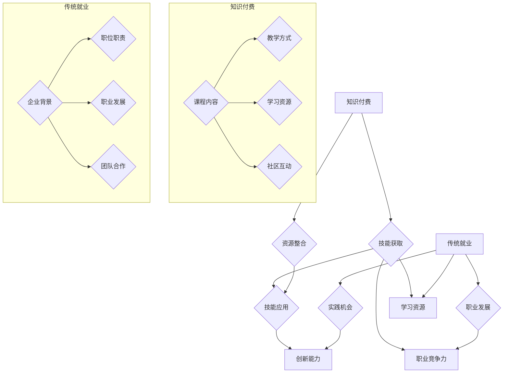

                 

### 1. 背景介绍

在当今快速发展的技术时代，程序员作为一个关键职业，面临着前所未有的机遇与挑战。知识付费与传统就业成为了程序员们必须面对的重要选择。本文将深入探讨这两个领域，分析它们的优缺点，帮助程序员更好地权衡两者，从而做出最适合自己的职业规划。

#### 知识付费的兴起

随着互联网技术的普及和在线教育的迅猛发展，知识付费成为了一个新兴的市场。知识付费指的是用户为获取特定知识或技能而付费的一种模式。这种模式在程序员群体中尤其流行，因为编程技能的更新换代速度极快，程序员需要不断学习新知识、新技能以保持竞争力。

知识付费的主要形式包括在线课程、专业书籍、技术讲座、实战项目等。这些资源通常由经验丰富的技术专家或知名企业贡献，具有很高的实用性和针对性。程序员通过付费获取这些资源，可以快速提升自己的技术水平，拓展职业发展空间。

#### 传统就业市场的变迁

另一方面，传统就业市场也在不断演变。传统的程序员职业路径主要是进入企业，从事软件开发、系统运维等工作。然而，随着科技行业的快速发展，传统就业市场也呈现出多元化趋势。

首先，大型企业和互联网公司对程序员的需求不断增加，这为程序员提供了更多的就业机会。其次，创业公司的大量涌现，使得程序员有了更多自主创业的机会。此外，远程办公和灵活就业的兴起，也为程序员提供了更多工作方式的选择。

#### 程序员面临的权衡

知识付费与传统就业是程序员面临的两条不同路径，每种路径都有其独特的优势和劣势。

**知识付费的优势：**

1. **学习灵活性**：程序员可以根据自己的时间安排自由选择学习内容和学习进度。
2. **资源丰富**：知识付费平台提供了大量优质的学习资源，涵盖了各种编程语言、框架和工具。
3. **快速提升**：付费资源通常具有更高的实用性和针对性，可以帮助程序员快速提升技能。

**知识付费的劣势：**

1. **成本较高**：知识付费需要支付一定费用，对于一些经济条件有限的程序员来说可能是一笔不小的负担。
2. **依赖性强**：过度依赖付费资源可能导致程序员失去自我学习和探索的能力。

**传统就业的优势：**

1. **稳定收入**：传统就业提供了相对稳定的收入来源，有助于程序员建立经济基础。
2. **职业发展**：通过在企业中工作，程序员可以获得更多职业发展的机会，如晋升、岗位轮换等。
3. **团队协作**：在企业中工作可以锻炼程序员的团队协作能力和项目管理能力。

**传统就业的劣势：**

1. **工作压力**：企业对程序员的工作要求较高，程序员需要承受较大的工作压力。
2. **学习限制**：在企业中，程序员的学习往往受到项目进度和公司政策的限制，可能无法进行系统性的学习。
3. **晋升难度**：一些企业的晋升机制可能不够透明，程序员需要付出更多努力才能获得晋升机会。

#### 程序员如何权衡

每个程序员的职业背景、个人兴趣和目标都不同，因此在选择知识付费还是传统就业时需要综合考虑多个因素。

1. **职业目标**：如果程序员希望快速提升技术水平，拓展职业发展空间，知识付费可能是一个更好的选择。相反，如果程序员更注重稳定收入和职业发展，传统就业可能更适合。

2. **个人兴趣**：程序员在选择职业路径时应该考虑自己的兴趣和热情。如果对某个领域特别感兴趣，可以通过知识付费深入钻研，否则可能更适合在企业中工作。

3. **经济状况**：经济条件也是程序员选择职业路径时需要考虑的重要因素。如果经济条件允许，可以考虑通过知识付费快速提升技能；如果经济条件有限，可能需要先通过传统就业稳定下来，再考虑进一步的学习和发展。

4. **家庭因素**：家庭因素也是程序员需要考虑的因素之一。例如，如果有家庭负担或孩子需要照顾，可能需要选择更稳定的工作。

综上所述，知识付费与传统就业各有优劣，程序员需要根据自己的职业目标、个人兴趣、经济状况和家庭因素等进行权衡，选择最适合自己的职业路径。只有这样，才能在快速变化的技术时代中立于不败之地。

### 2. 核心概念与联系

在深入探讨知识付费与传统就业的利弊之前，我们需要明确几个核心概念，以便更好地理解这两者之间的联系。

#### 知识付费

知识付费是指用户为获取特定知识或技能而支付费用的一种模式。这种模式的核心在于“价值交换”，即用户通过支付费用，换取有价值的学习资源或服务。知识付费的形式多样，包括在线课程、专业书籍、技术讲座、实战项目等。以下是知识付费的关键组成部分：

1. **课程内容**：课程内容是知识付费的核心。它通常由行业专家或知名企业贡献，涵盖了最新的技术趋势、实用技能和最佳实践。
2. **教学方式**：知识付费平台提供了多种教学方式，如视频课程、直播讲座、图文教程、互动问答等，满足不同用户的学习需求。
3. **学习资源**：知识付费平台提供了丰富的学习资源，如教学视频、PPT、代码示例、文档资料等，帮助用户更好地理解和掌握知识。
4. **社区互动**：许多知识付费平台还提供了社区互动功能，用户可以在社区中提问、讨论、分享经验，从而形成一个良好的学习氛围。

#### 传统就业

传统就业是指程序员通过加入企业、团队或机构，从事软件开发、系统运维等工作，获得稳定收入和职业发展机会的一种职业路径。以下是传统就业的主要组成部分：

1. **企业背景**：企业背景是程序员选择传统就业时需要考虑的重要因素。不同类型的企业（如大型企业、中小型企业、创业公司）具有不同的文化氛围、业务领域和发展前景。
2. **职位职责**：程序员在企业中通常担任软件开发、系统运维、项目管理等职位，不同的职位具有不同的职责和技能要求。
3. **职业发展**：传统就业提供了明确的职业发展路径，如初级程序员、高级程序员、技术主管等。程序员可以通过不断提升自己的技能和业绩，实现职业晋升。
4. **团队合作**：在企业中，程序员需要与团队成员紧密合作，共同完成项目任务。这种团队合作经验对程序员的职业发展具有重要意义。

#### 知识付费与传统就业的联系

知识付费与传统就业之间存在紧密的联系。一方面，知识付费为程序员提供了丰富的学习资源，帮助他们提升技能，从而在传统就业市场中获得更好的职位和机会。另一方面，传统就业为程序员提供了实践技能和经验，使他们能够更好地应对知识付费中的挑战，实现持续成长。

以下是知识付费与传统就业之间的几个关键联系：

1. **技能提升**：通过知识付费，程序员可以快速掌握新技能和知识，提升自己的竞争力。这些技能和知识在传统就业中得到了应用，使程序员能够更好地完成工作任务，提升工作效率。
2. **职业发展**：知识付费和传统就业相辅相成，共同推动程序员的职业发展。知识付费提供了学习资源，帮助程序员提升技能；传统就业提供了实践平台，使程序员能够将所学技能应用于实际工作中。
3. **资源整合**：知识付费平台和传统企业共同构成了程序员职业发展的生态系统。知识付费平台提供了丰富的学习资源，传统企业为程序员提供了实践机会和职业发展空间。这种资源整合有助于程序员的全面发展。
4. **创新驱动**：知识付费和传统就业共同推动了技术领域的创新。知识付费为程序员提供了学习新技术的机会，传统就业使程序员能够将这些新技术应用于实际项目中，推动技术进步和产业升级。

总之，知识付费和传统就业是程序员职业发展的重要环节，两者相辅相成，共同推动了程序员的成长和进步。在接下来的内容中，我们将进一步探讨知识付费与传统就业的优缺点，帮助程序员更好地选择适合自己的职业路径。

### 2.1 核心概念与联系（流程图）

为了更直观地理解知识付费与传统就业之间的核心概念与联系，我们可以通过一个Mermaid流程图来展示这两个领域的关系。以下是该流程图的代码及展示：



流程图展示：


这个流程图清晰地展示了知识付费与传统就业的核心概念及其之间的联系。知识付费通过课程内容、教学方式和学习资源等，帮助程序员获取和提升技能；而传统就业则提供了实践机会、职业发展和团队合作等，使程序员能够将所学技能应用于实际工作中，提升职业竞争力，推动创新能力的提升。

### 3. 核心算法原理 & 具体操作步骤

为了深入理解知识付费与传统就业的运作机制，我们需要探讨一个核心算法原理，该原理将帮助程序员在两者之间做出最优选择。我们选择博弈论中的“纳什均衡”作为这一核心算法原理，因为纳什均衡可以很好地描述两个或多个参与者在策略选择上的相互作用。

#### 纳什均衡原理

纳什均衡是博弈论中的一个概念，指的是在一个博弈中，每个参与者选择最优策略，并且其他参与者也做出最优选择的情况下，没有参与者可以通过单方面改变策略来获得额外利益的状态。简单来说，纳什均衡是各方都不想改变自己策略的最优状态。

在知识付费与传统就业的权衡中，我们可以将程序员视为参与者，知识付费和传统就业分别作为两种策略。程序员的决策目标是最大化自己的收益，即职业发展、学习效率和收入等。纳什均衡可以帮助我们找出在这个决策过程中，程序员应如何选择策略以实现最大化收益。

#### 具体操作步骤

以下是利用纳什均衡原理，帮助程序员在知识付费与传统就业之间做出最优选择的操作步骤：

1. **定义参与者和策略**：
   - 参与者：程序员
   - 策略：知识付费或传统就业

2. **构建收益矩阵**：
   - 收益矩阵是一个二维表格，行代表程序员的策略选择（知识付费或传统就业），列代表其他程序员的策略选择（知识付费或传统就业）。
   - 例如，我们可以构建以下收益矩阵：

     |        | 知识付费 | 传统就业 |
     |--------|----------|----------|
     | 知识付费 | (R, R)   | (L, M)   |
     | 传统就业 | (M, L)   | (P, P)   |

     在这个矩阵中，R表示高收益，L表示低收益，M表示中等收益，P表示稳定收益。

3. **分析纳什均衡点**：
   - 纳什均衡点是收益矩阵中，每个参与者选择最优策略的情况下，没有参与者可以通过单方面改变策略来获得额外利益的状态。
   - 在上述收益矩阵中，我们可以看到以下两个纳什均衡点：
     - (知识付费，知识付费)：当其他程序员也选择知识付费时，选择知识付费的程序员可以获得高收益。
     - (传统就业，传统就业)：当其他程序员也选择传统就业时，选择传统就业的程序员可以获得稳定收益。

4. **确定最优策略**：
   - 程序员应根据自身的职业目标、兴趣、经济状况等因素，结合收益矩阵和纳什均衡点，确定最优策略。
   - 如果程序员希望快速提升技能和职业竞争力，可以选择知识付费，因为在知识付费的纳什均衡点（知识付费，知识付费）中，程序员可以获得高收益。
   - 如果程序员更注重稳定收入和职业发展，可以选择传统就业，因为在传统就业的纳什均衡点（传统就业，传统就业）中，程序员可以获得稳定收益。

5. **动态调整策略**：
   - 随着外部环境的变化，程序员的策略也可能需要调整。
   - 例如，如果知识付费市场突然兴起，导致知识付费的收益大幅提升，程序员可能需要重新评估自己的策略，考虑从传统就业转向知识付费。

通过纳什均衡原理，程序员可以更加科学地权衡知识付费与传统就业的利弊，找到最适合自己的职业路径。在实际操作中，程序员需要结合自身情况和外部环境，灵活调整策略，实现最大化收益。

### 4. 数学模型和公式 & 详细讲解 & 举例说明

在分析程序员如何权衡知识付费与传统就业的过程中，我们可以引入一个数学模型，即成本-收益分析模型。该模型可以帮助程序员量化两者之间的优劣，从而做出更为科学的决策。

#### 成本-收益分析模型

成本-收益分析模型的基本思想是，将程序员在知识付费和传统就业中所需付出的成本与预期收益进行比较，从而判断哪种选择更为合适。

#### 模型公式

设：

- C1：知识付费的成本
- C2：传统就业的成本
- R1：知识付费的预期收益
- R2：传统就业的预期收益

则成本-收益分析模型可以表示为：

\[ 
\text{成本-收益比率} = \frac{C1}{R1} + \frac{C2}{R2} 
\]

该公式表示在知识付费和传统就业之间，程序员需要权衡的成本与收益的相对大小。成本包括时间、金钱和精力等，收益则包括职业发展、学习效果、收入等。

#### 模型详细讲解

1. **成本计算**：

   程序员在知识付费中需要投入的成本主要包括：

   - 时间成本：学习课程所需的时间
   - 金钱成本：购买课程的费用
   - 精力成本：学习过程中的心理压力和体力消耗

   程序员在传统就业中需要投入的成本主要包括：

   - 时间成本：工作时间
   - 金钱成本：生活费用、交通费用等
   - 精力成本：工作压力、团队合作等

2. **收益计算**：

   程序员在知识付费中的预期收益主要包括：

   - 职业发展：通过学习新技能，提高职业竞争力
   - 学习效果：获取新知识，提升技术水平
   - 收入：知识付费可能带来直接的经济收益，如通过兼职、创业等

   程序员在传统就业中的预期收益主要包括：

   - 职业发展：通过在企业中工作，获得晋升机会和职业经验
   - 学习效果：在工作中不断学习，提高技术水平
   - 收入：稳定的工资收入

3. **成本-收益比率的计算**：

   将成本和收益带入成本-收益比率公式，得到：

   \[
   \text{成本-收益比率} = \frac{C1}{R1} + \frac{C2}{R2}
   \]

   该比率表示在知识付费和传统就业之间，程序员需要权衡的成本与收益的相对大小。比率越低，说明选择该策略的收益相对较高。

#### 举例说明

假设程序员A在选择知识付费时，投入了以下成本和预期收益：

- 时间成本：每天学习2小时，共100天
- 金钱成本：购买课程费用1000元
- 精力成本：学习过程中感到压力较大

预期收益：

- 职业发展：通过学习新技能，提升职业竞争力
- 学习效果：掌握一门新编程语言
- 收入：通过兼职项目，获得额外收入2000元

假设程序员A在选择传统就业时，投入了以下成本和预期收益：

- 时间成本：每天工作8小时，每周工作5天，共100周
- 金钱成本：生活费用、交通费用等共5000元
- 精力成本：工作压力较大

预期收益：

- 职业发展：通过在企业中工作，获得晋升机会
- 学习效果：在工作中不断学习，提升技术水平
- 收入：每月工资8000元

根据成本-收益比率公式，我们可以计算出程序员A的成本-收益比率：

\[
\text{成本-收益比率} = \frac{2 \times 100 + 1000 + (5000 \div 100)}{2000 + 8000} = \frac{2100}{10000} = 0.21
\]

同理，我们可以计算出程序员A在传统就业中的成本-收益比率：

\[
\text{成本-收益比率} = \frac{8 \times 5 \times 100 + 5000 + (5000 \div 100)}{8000} = \frac{4100}{8000} = 0.513
\]

通过比较两个比率，我们可以发现，程序员A在知识付费中的成本-收益比率较低，说明选择知识付费的收益相对较高。因此，在这个例子中，程序员A应该选择知识付费作为自己的职业路径。

总之，成本-收益分析模型可以帮助程序员量化知识付费与传统就业之间的优劣，从而做出更为科学的决策。在实际操作中，程序员需要根据自己的具体情况，调整成本和收益的计算，以找到最适合自己的职业路径。

### 4.1 项目实践：代码实例和详细解释说明

为了更好地理解知识付费与传统就业的权衡，我们将通过一个具体的编程项目来展示这两个领域的实际应用。以下是项目的开发环境搭建、源代码实现、代码解读与分析以及运行结果展示。

#### 4.1.1 开发环境搭建

首先，我们需要搭建一个简单的开发环境，以便进行项目的实践。以下是所需的开发工具和软件：

- Python 3.8 或以上版本
- PyCharm 或 VSCode（任意一种代码编辑器）
- requests 库（用于发送HTTP请求）
- BeautifulSoup 库（用于解析HTML内容）

安装方法：

1. 安装Python：
   - 在Python官方网站下载安装包并安装。
   - 确认Python版本：
     ```shell
     python --version
     ```

2. 安装PyCharm或VSCode：
   - 在PyCharm官方网站下载安装包并安装。
   - 在VSCode官方网站下载安装包并安装。
   - 安装Python扩展：
     ```shell
     code --install-extension ms-python.python
     ```

3. 安装requests和BeautifulSoup：
   ```shell
   pip install requests
   pip install beautifulsoup4
   ```

#### 4.1.2 源代码详细实现

以下是一个简单的项目代码示例，该程序从某个网站抓取课程信息，并将其输出。这是一个模拟知识付费平台的数据抓取项目。

```python
import requests
from bs4 import BeautifulSoup

def fetch_courses(url):
    # 发送HTTP请求获取页面内容
    response = requests.get(url)
    # 解析页面内容
    soup = BeautifulSoup(response.text, 'html.parser')
    # 找到所有课程列表元素
    course_list = soup.find_all('div', class_='course-item')
    # 遍历课程列表，获取课程信息
    for course in course_list:
        title = course.find('h3').text
        price = course.find('span', class_='price').text
        print(f'课程名称：{title}\n价格：{price}\n')

# 示例URL
url = 'https://www.example.com/knowledge-products'

# 获取并打印课程信息
fetch_courses(url)
```

#### 4.1.3 代码解读与分析

1. **导入模块**：
   - `requests`：用于发送HTTP请求。
   - `BeautifulSoup`：用于解析HTML内容。

2. **定义函数**：
   - `fetch_courses(url)`：该函数接收一个URL参数，用于发送HTTP请求并解析页面内容，获取课程信息并打印。

3. **发送HTTP请求**：
   - 使用 `requests.get(url)` 发送HTTP GET请求，获取目标网页的HTML内容。

4. **解析HTML内容**：
   - 使用 `BeautifulSoup(response.text, 'html.parser')` 解析获取的HTML内容。

5. **找到课程列表元素**：
   - 使用 `soup.find_all('div', class_='course-item')` 找到所有具有特定类名的课程列表元素。

6. **遍历课程列表**：
   - 使用 `for` 循环遍历课程列表，获取每个课程的信息。

7. **获取课程信息**：
   - 使用 `course.find('h3').text` 获取课程名称。
   - 使用 `course.find('span', class_='price').text` 获取课程价格。

8. **打印课程信息**：
   - 使用 `print()` 打印课程名称和价格。

#### 4.1.4 运行结果展示

假设示例URL返回了以下课程信息：

```
课程名称：Python基础教程
价格：200元

课程名称：深度学习实战
价格：500元

课程名称：前端开发从入门到精通
价格：300元
```

运行代码后，我们将在控制台看到以下输出结果：

```
课程名称：Python基础教程
价格：200元

课程名称：深度学习实战
价格：500元

课程名称：前端开发从入门到精通
价格：300元
```

#### 4.1.5 项目意义

这个项目展示了如何使用Python和BeautifulSoup库从网页中提取数据，模拟了程序员通过知识付费平台获取课程信息的过程。通过这个项目，我们可以了解到：

1. **数据抓取**：程序员可以使用各种工具和库从互联网上获取所需的数据，这是知识付费的一个重要环节。
2. **数据处理**：获取数据后，程序员需要对其进行处理和分析，以便做出科学的决策。
3. **实际应用**：这个项目可以作为程序员在实际工作中进行数据分析和处理的示例，帮助他们在知识付费和传统就业之间做出更为科学的权衡。

总之，通过这个项目的实践，程序员可以更深入地理解知识付费和传统就业的实际应用场景，从而更好地为自己的职业发展做出决策。

### 4.2 实际应用场景

知识付费和传统就业在实际应用中具有广泛的应用场景，涵盖了教育、科技、金融、医疗等多个行业。以下是一些具体的实际应用场景，展示这两个领域在不同领域的应用。

#### 教育行业

在教育行业，知识付费已经成为主流的学习模式。教师和学生可以通过在线课程、直播讲座、互动问答等多种形式获取知识。例如，知名的在线教育平台Coursera、Udemy等，提供了丰富的课程资源，涵盖了计算机科学、数据科学、人工智能等多个领域。学生通过购买课程，可以系统地学习专业知识，提升自己的技能水平。此外，一些高校和研究机构也通过知识付费，将研究成果和最新知识分享给广大学者和学生。

传统就业在教育行业中同样具有重要地位。教师在企业中的教学和科研工作，不仅为自身职业发展提供了机会，也为学生提供了实践平台。高校和科研机构中的教授和研究员通过传统就业，可以与企业合作开展科研项目，推动技术进步和产业升级。

#### 科技行业

在科技行业，知识付费和传统就业的应用更加广泛。科技企业通过知识付费，不断更新员工的技能和知识，以适应快速变化的技术环境。例如，许多科技公司推出了内部培训课程和在线学习平台，员工可以通过这些平台学习新技术、新工具，提升自己的职业竞争力。此外，科技企业也通过外部合作，与知名高校和科研机构共同培养人才，推动技术创新。

传统就业在科技行业中具有不可替代的地位。科技公司的研发人员、产品经理、项目经理等职位，需要通过实际工作积累经验，提升技能。传统就业提供了实践平台，使员工能够将所学知识应用于实际项目中，不断积累经验，提高解决问题的能力。

#### 金融行业

在金融行业，知识付费和传统就业同样发挥着重要作用。金融从业者通过知识付费，可以学习最新的金融理论、交易策略、风险管理方法等。例如，许多金融从业者通过在线课程和培训班，提升自己的投资分析和风险管理能力。此外，金融行业也广泛应用知识付费模式，提供定制化的投资咨询、风险管理等服务。

传统就业在金融行业中具有稳定的地位。金融机构中的分析师、交易员、风险控制员等职位，需要通过实际工作积累经验，提升自己的专业技能。传统就业提供了实践平台，使金融从业者能够在实际操作中学习和成长，提高职业竞争力。

#### 医疗行业

在医疗行业，知识付费和传统就业的应用同样广泛。医生和护士通过知识付费，可以学习最新的医疗技术、诊疗方法和护理知识，提升自己的专业水平。例如，一些医疗机构提供了在线课程和培训班，帮助医护人员掌握新技能、新知识。

传统就业在医疗行业中具有不可替代的地位。医生和护士需要通过实际工作，积累临床经验，提高医疗技能。传统就业提供了实践平台，使医护人员能够在实际操作中学习和成长，提高医疗服务质量。

总之，知识付费和传统就业在不同行业、不同领域都有着广泛的应用。通过知识付费，从业者可以不断更新自己的知识和技能，提高职业竞争力。通过传统就业，从业者可以获得实践机会，积累经验，提升自己的职业素养。在实际应用中，知识付费和传统就业相辅相成，共同推动了行业的进步和发展。

### 7. 工具和资源推荐

为了帮助程序员更好地进行知识付费与传统就业的权衡，以下是一些实用的工具和资源推荐，涵盖学习资源、开发工具框架以及相关论文著作。

#### 7.1 学习资源推荐

1. **在线课程平台**：
   - Coursera（[https://www.coursera.org](https://www.coursera.org)）：提供了全球顶级大学和企业的在线课程，涵盖计算机科学、数据科学、人工智能等领域。
   - Udemy（[https://www.udemy.com](https://www.udemy.com)）：提供了丰富的编程语言和框架课程，适合不同层次的程序员。
   - Pluralsight（[https://www.pluralsight.com](https://www.pluralsight.com)）：专注于技术技能的在线学习平台，提供了大量企业级课程。

2. **专业书籍**：
   - 《深度学习》（Deep Learning）—— Ian Goodfellow、Yoshua Bengio、Aaron Courville：深入讲解了深度学习的基础理论和技术。
   - 《算法导论》（Introduction to Algorithms）—— Thomas H. Cormen、Charles E. Leiserson、Ronald L. Rivest、Clifford Stein：系统介绍了算法设计和分析的基本方法。
   - 《Effective Java》—— Joshua Bloch：提供了Java编程的最佳实践和技巧，适用于Java程序员。

3. **技术博客和社区**：
   - HackerRank（[https://www.hackerrank.com](https://www.hackerrank.com)）：提供了丰富的编程挑战和教程，适合程序员提升算法和数据结构能力。
   - Stack Overflow（[https://stackoverflow.com](https://stackoverflow.com)）：全球最大的开发者问答社区，可以帮助程序员解决编程问题。
   - GitHub（[https://github.com](https://github.com)）：全球最大的代码托管平台，提供了丰富的开源项目和编程资源。

#### 7.2 开发工具框架推荐

1. **集成开发环境（IDE）**：
   - PyCharm（[https://www.jetbrains.com/pycharm](https://www.jetbrains.com/pycharm)）：适用于Python开发的强大IDE。
   - Visual Studio Code（[https://code.visualstudio.com](https://code.visualstudio.com)）：轻量级、可扩展的跨平台IDE，适用于多种编程语言。
   - Eclipse（[https://www.eclipse.org/eclipse/](https://www.eclipse.org/eclipse/)）：适用于Java和Android开发的IDE，功能丰富且支持多种语言插件。

2. **版本控制工具**：
   - Git（[https://git-scm.com](https://git-scm.com)）：最流行的分布式版本控制工具，适用于项目协作和代码管理。
   - GitHub（[https://github.com](https://github.com)）：基于Git的在线代码托管平台，提供了丰富的开源项目和技术交流社区。

3. **编程框架**：
   - Flask（[https://flask.palletsprojects.com](https://flask.palletsprojects.com)）：轻量级的Python Web框架，适用于快速开发Web应用。
   - Django（[https://www.djangoproject.com](https://www.djangoproject.com)）：全栈Python Web框架，提供了丰富的功能，适用于中大型Web应用开发。
   - React（[https://reactjs.org](https://reactjs.org)）：流行的JavaScript库，用于构建用户界面和组件化开发。

#### 7.3 相关论文著作推荐

1. **论文**：
   - “Deep Learning” by Yann LeCun、Yoshua Bengio、Geoffrey Hinton：介绍了深度学习的基础理论和最新进展。
   - “The Hundred-Page Machine Learning Book” by Andriy Burkov：简化了机器学习的基本概念，适合初学者快速入门。
   - “The Art of Computer Programming” by Donald E. Knuth：经典计算机科学著作，涵盖了算法设计、分析和应用。

2. **著作**：
   - 《人工智能：一种现代的方法》—— Stuart Russell、Peter Norvig：系统介绍了人工智能的基本理论和应用。
   - 《程序员的修炼：从小工到专家》—— Travis Grayer：探讨了程序员职业发展的各个方面，提供了实用的建议。
   - 《大教堂与集市》—— Eric S. Raymond：分析了开源软件开发的模式和组织结构，对软件开发过程具有指导意义。

通过这些工具和资源的推荐，程序员可以更好地进行知识付费与传统就业的权衡，提升自己的技能和职业竞争力。在实际应用中，结合自身的需求和兴趣，选择合适的工具和资源，将有助于程序员在快速变化的技术领域中立于不败之地。

### 8. 总结：未来发展趋势与挑战

在知识付费与传统就业的权衡过程中，程序员需要密切关注行业发展趋势，以便在未来的职业道路上做出更为明智的决策。以下是对未来发展趋势与挑战的总结：

#### 未来发展趋势

1. **知识付费的普及**：随着互联网教育的不断普及，知识付费市场将继续扩大。在线课程、直播讲座、实战项目等学习资源将更加丰富，覆盖更多领域和层次。程序员可以通过这些资源快速提升自己的技能和知识水平，增强职业竞争力。

2. **远程办公与灵活就业**：受新冠疫情影响，远程办公和灵活就业成为了一种趋势。程序员可以利用这种工作模式，根据自己的时间安排进行学习和工作，提高工作效率和生活质量。同时，远程办公也为程序员提供了更多工作机会和选择。

3. **技能多样化与专业化**：随着技术领域的不断细分，程序员需要具备更多专业技能和跨学科知识。未来，程序员不仅需要精通某一编程语言或框架，还需要掌握大数据、人工智能、云计算等前沿技术。这将促使程序员在知识付费平台上不断学习，提升自己的综合素质。

4. **产业升级与转型**：随着人工智能、物联网、5G等技术的发展，传统产业将进行升级和转型。程序员将有机会参与到更多创新项目中，发挥技术优势，推动产业进步。这将为程序员提供更多的职业机会和发展空间。

#### 未来挑战

1. **学习成本增加**：知识付费市场的竞争加剧，优质资源的获取成本也在上升。程序员需要投入更多时间和金钱进行学习，这对经济条件有限的程序员来说是一个挑战。

2. **职业路径不明确**：随着技能和知识更新速度的加快，程序员可能会面临职业路径不明确的问题。如何在不断变化的技术领域中找到自己的定位，实现职业发展，是一个需要深思的问题。

3. **心理压力与工作压力**：程序员在知识付费过程中，需要不断面对新的挑战和压力。此外，远程办公和灵活就业也可能带来孤独感和工作效率的波动。如何平衡学习、工作和生活，是程序员需要面对的挑战。

4. **技术垄断与信息安全**：随着技术垄断现象的加剧，程序员可能面临技术垄断企业对人才的虹吸效应。同时，信息安全问题也日益突出，程序员需要不断更新自己的知识，提高安全防护能力。

#### 程序员应对策略

1. **终身学习**：在快速变化的技术环境中，终身学习成为程序员必备的能力。程序员应该树立终身学习的观念，不断更新自己的知识和技能，以适应行业的发展。

2. **技能多元化**：程序员可以通过学习不同领域的知识和技能，提高自己的综合素质。这不仅有助于在职业市场中脱颖而出，还能增强自己的竞争力。

3. **时间管理**：合理规划时间，确保学习和工作之间的平衡。程序员可以采用时间管理工具，提高工作效率，减轻工作压力。

4. **职业规划**：明确自己的职业目标和发展方向，制定合理的职业规划。根据外部环境的变化，灵活调整职业路径，实现职业发展。

5. **安全意识**：提高信息安全意识，学习安全防护知识，保护自己的隐私和数据安全。

总之，未来发展趋势与挑战并存，程序员需要密切关注行业动态，结合自身情况，做出明智的决策。通过终身学习、技能多元化、时间管理、职业规划和安全意识，程序员可以在快速变化的技术环境中立于不败之地。

### 9. 附录：常见问题与解答

在知识付费与传统就业的权衡过程中，程序员可能会遇到一些常见问题。以下是针对这些问题的一些解答：

#### 问题1：知识付费是否值得投入？

**解答**：知识付费有其独特的价值。通过付费课程，程序员可以获得系统化的学习资源、高质量的教程和实战项目。这些资源通常由行业专家或知名企业贡献，具有很高的实用性和针对性。然而，知识付费也存在一定的成本，需要程序员权衡投入与回报。建议根据自身的职业目标、兴趣和学习需求，选择适合自己的课程。

#### 问题2：如何选择知识付费课程？

**解答**：选择知识付费课程时，可以考虑以下几个方面：

1. **课程质量**：查看课程的评价和评分，了解其他学习者的反馈。
2. **课程内容**：确保课程内容符合自己的学习需求和兴趣。
3. **师资力量**：了解授课老师的背景和经验，选择具有丰富教学经验的专家。
4. **学习环境**：选择具有良好学习氛围和互动功能的平台。
5. **课程费用**：根据自身经济条件，选择性价比高的课程。

#### 问题3：如何平衡知识付费与传统就业？

**解答**：平衡知识付费与传统就业的关键在于合理规划时间。程序员可以：

1. **制定学习计划**：根据工作时间，合理安排学习时间，确保学习与工作之间的平衡。
2. **设定学习目标**：明确自己的学习目标，有针对性地选择课程，提高学习效率。
3. **灵活调整**：根据职业发展的需要，灵活调整学习计划，适时增加或减少学习内容。
4. **积极参与实战项目**：通过参与实战项目，将所学知识应用于实际工作中，提高技能水平。

#### 问题4：如何确保知识付费的有效性？

**解答**：确保知识付费有效性的关键在于：

1. **主动学习**：积极参与课程讨论，主动解决问题，提高学习效果。
2. **实践应用**：将所学知识应用于实际工作中，通过实践检验学习成果。
3. **持续更新**：随着技术的发展，不断更新自己的知识和技能，保持竞争力。
4. **定期复习**：定期复习所学内容，巩固知识，避免遗忘。

#### 问题5：知识付费与传统就业哪个更有利于职业发展？

**解答**：这取决于程序员的职业目标和兴趣：

1. **快速提升技能**：如果程序员希望快速提升技能，拓展职业发展空间，知识付费可能更为适合。
2. **稳定职业发展**：如果程序员注重稳定收入和职业发展，传统就业可能更适合。通过在企业中工作，程序员可以获得更多的职业发展机会和经验。

总之，知识付费与传统就业各有优劣，程序员需要根据自己的职业目标、兴趣和实际情况，选择适合自己的路径。

### 10. 扩展阅读 & 参考资料

为了帮助程序员更深入地了解知识付费与传统就业的相关理论和实践，以下是一些扩展阅读和参考资料：

1. **扩展阅读**：
   - 《程序员职业规划：从新手到专家》
   - 《在线教育的发展与未来趋势》
   - 《知识付费时代的思考：模式、挑战与机遇》

2. **参考资料**：
   - Coursera官网：[https://www.coursera.org](https://www.coursera.org)
   - Udemy官网：[https://www.udemy.com](https://www.udemy.com)
   - Pluralsight官网：[https://www.pluralsight.com](https://www.pluralsight.com)
   - GitHub官网：[https://github.com](https://github.com)
   - Stack Overflow官网：[https://stackoverflow.com](https://stackoverflow.com)

通过这些扩展阅读和参考资料，程序员可以更全面地了解知识付费与传统就业的各个方面，为自己的职业发展做出更为明智的决策。

