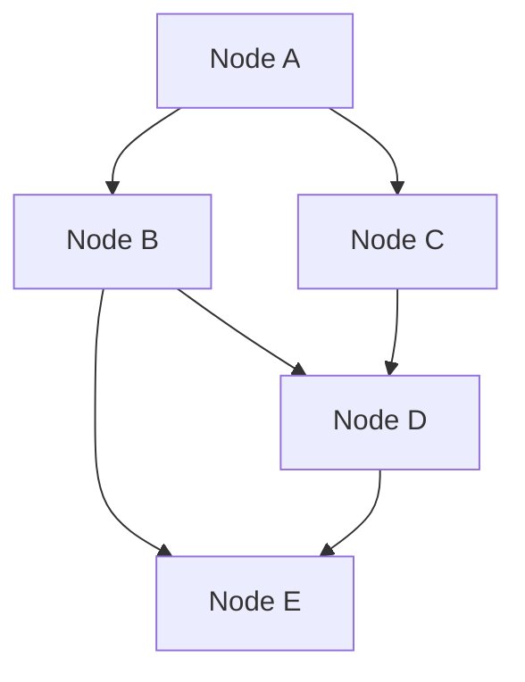

                 

### 知识付费与开源项目：相辅相成的关系

#### 关键词：
- 知识付费
- 开源项目
- 相辅相成
- 经济模型
- 社区参与
- 技术创新

> 摘要：本文深入探讨了知识付费与开源项目之间的关系，从经济模型、社区参与和技术创新三个方面分析两者如何相辅相成，共同推动技术发展和经济繁荣。

## 1. 背景介绍

知识付费和开源项目都是现代信息技术领域的重要现象。知识付费指的是用户为获取专业知识或服务而支付的费用，常见于在线课程、专业咨询和数字内容订阅。而开源项目则是指那些允许公众自由使用、修改和分发软件源代码的项目，它依托于开放、共享的原则，为全球开发者和用户提供了丰富的资源和机会。

过去，知识付费和开源项目往往是分离的。知识付费更多集中在商业领域，为专业人士和企业家提供盈利机会；而开源项目则更多关注于技术贡献和社会价值。然而，随着互联网的发展和数字化转型的加速，两者之间的关系变得更加紧密，形成了一种互利共赢的生态。

### 2. 核心概念与联系

为了更好地理解知识付费与开源项目之间的关系，我们需要先了解它们的核心概念和联系。

#### 2.1 知识付费的概念与作用

知识付费的核心在于“知识”的交换，即用户通过支付获得知识价值。知识付费的作用主要体现在以下几个方面：

- **提升专业水平**：用户通过付费获取高质量的专业知识和技能，有助于提升个人竞争力。
- **激励知识创造**：知识付费为知识创造者提供了收入来源，激励更多人参与到知识的创作和传播中。
- **优化资源分配**：知识付费能够更好地分配资源，将有限的资源投入到更有价值的知识领域。

#### 2.2 开源项目的概念与作用

开源项目是指那些遵循特定许可证（如GPL、Apache等）允许用户自由使用、修改和分发的软件项目。开源项目的作用主要体现在以下几个方面：

- **技术进步**：开源项目通过集体智慧推动技术进步，为开发者提供了丰富的技术资源和创新的平台。
- **降低研发成本**：开发者可以基于开源项目进行二次开发，降低研发成本和时间。
- **社区合作**：开源项目鼓励全球开发者共同参与，形成了一个庞大的技术社区，促进了知识的传播和共享。

#### 2.3 知识付费与开源项目的联系

知识付费与开源项目之间的联系可以从以下几个方面来看：

- **经济模型**：知识付费为开源项目提供了资金支持，使开源项目能够持续发展和壮大。
- **社区参与**：开源项目的参与者和贡献者往往也是知识付费的用户，他们在参与开源项目的过程中获得知识，同时也为知识付费市场提供了内容。
- **技术创新**：知识付费和开源项目共同推动了技术的创新和进步，为数字经济的发展提供了动力。

### 3. 核心算法原理 & 具体操作步骤

在深入探讨知识付费与开源项目的核心算法原理和具体操作步骤之前，我们需要了解一些基本的算法和操作流程。

#### 3.1 知识付费的算法原理

知识付费的算法原理主要涉及用户行为分析、需求匹配和支付流程。以下是一个简化的知识付费算法流程：

1. **用户注册与登录**：用户在知识付费平台注册并登录，提供个人信息和支付方式。
2. **用户行为分析**：平台通过用户行为数据（如浏览记录、购买历史等）分析用户需求，推荐相关课程或内容。
3. **需求匹配**：平台根据用户需求，匹配合适的课程或内容。
4. **支付流程**：用户确认购买，平台完成支付，用户获得课程或内容访问权限。

#### 3.2 开源项目的操作步骤

开源项目的操作步骤主要包括项目创建、代码贡献和社区合作。以下是一个简化的开源项目操作流程：

1. **项目创建**：开发者创建新的开源项目，并选择合适的许可证。
2. **代码贡献**：开发者向项目提交代码，进行功能开发或bug修复。
3. **社区合作**：开发者通过社区交流，共同解决问题，推动项目发展。
4. **代码审查与合并**：项目维护者对提交的代码进行审查，确保代码质量，并进行合并。

### 4. 数学模型和公式 & 详细讲解 & 举例说明

为了更深入地理解知识付费与开源项目之间的关系，我们可以借助数学模型和公式进行分析。

#### 4.1 知识付费的经济模型

知识付费的经济模型可以采用供需模型进行分析。以下是一个简化的供需模型：

1. **需求函数**：用户对知识的需求量与价格成反比，表示为 $D(p) = \frac{1}{p}$。
2. **供给函数**：知识提供者的供给量与价格成正比，表示为 $S(p) = kp$，其中 $k$ 为供给系数。
3. **均衡价格**：供需平衡时，需求量等于供给量，即 $D(p) = S(p)$，解得均衡价格 $p^* = \frac{1}{k}$。

#### 4.2 开源项目的贡献模型

开源项目的贡献模型可以采用协作网络模型进行分析。以下是一个简化的协作网络模型：

1. **节点表示**：每个节点表示一个开发者或贡献者。
2. **边表示**：边表示节点之间的合作关系，边的权重表示合作关系强度。
3. **贡献度**：每个节点的贡献度可以通过其连接边的权重之和计算，表示为 $C(v) = \sum_{u \in N(v)} w_{uv}$，其中 $C(v)$ 表示节点 $v$ 的贡献度，$N(v)$ 表示节点 $v$ 的邻居节点集合，$w_{uv}$ 表示节点 $u$ 和节点 $v$ 之间的边权重。

#### 4.3 举例说明

假设有一个知识付费平台，用户对课程的需求函数为 $D(p) = \frac{1}{p}$，知识提供者的供给函数为 $S(p) = 2p$。我们需要找出均衡价格。

1. 设定需求函数 $D(p) = \frac{1}{p}$，供给函数 $S(p) = 2p$。
2. 令 $D(p) = S(p)$，解得 $p^* = 1$。
3. 均衡价格为 1，此时用户支付 1 元，知识提供者获得 2 元。

#### 4.4 数学模型在开源项目中的应用

假设有一个开源项目，共有 5 个节点，节点之间的合作关系如图所示（使用 Mermaid 流程图）：



1. 节点 A 的贡献度 $C(A) = 1 + 1 = 2$。
2. 节点 B 的贡献度 $C(B) = 2 + 2 = 4$。
3. 节点 C 的贡献度 $C(C) = 1 + 1 = 2$。
4. 节点 D 的贡献度 $C(D) = 2 + 1 = 3$。
5. 节点 E 的贡献度 $C(E) = 2 + 1 = 3$。

通过这个例子，我们可以看到数学模型在分析知识付费与开源项目关系中的应用。

### 5. 项目实践：代码实例和详细解释说明

为了更好地理解知识付费与开源项目的实际运作，我们可以通过一个具体的开源项目实例进行分析。

#### 5.1 开发环境搭建

1. 安装 Git：在终端中执行 `sudo apt-get install git`。
2. 安装 Python：在终端中执行 `sudo apt-get install python3`。
3. 安装 Flask：在终端中执行 `pip3 install flask`。

#### 5.2 源代码详细实现

以下是一个简单的知识付费平台的源代码实现：

```python
from flask import Flask, request, jsonify

app = Flask(__name__)

# 课程列表
courses = [
    {"id": 1, "name": "Python基础", "price": 99},
    {"id": 2, "name": "机器学习入门", "price": 199},
    {"id": 3, "name": "Web开发教程", "price": 299}
]

# 购买课程
@app.route("/buy", methods=["POST"])
def buy_course():
    data = request.get_json()
    course_id = data["course_id"]
    user_id = data["user_id"]

    # 检查用户余额
    if user_id not in users:
        return jsonify({"error": "用户未注册"}), 401

    if users[user_id] < courses[course_id]["price"]:
        return jsonify({"error": "余额不足"}), 402

    # 扣除用户余额
    users[user_id] -= courses[course_id]["price"]

    # 提供课程访问权限
    return jsonify({"message": "购买成功，请访问课程页面", "course_id": course_id})

# 用户余额
users = {
    1: 500,
    2: 1000,
    3: 1500
}

if __name__ == "__main__":
    app.run()
```

#### 5.3 代码解读与分析

1. **课程列表**：定义了一个包含课程信息的列表 `courses`，每个课程包含课程ID、课程名称和价格。
2. **购买课程**：定义了一个 `/buy` 接口，用于处理购买课程的请求。接口接收用户ID和课程ID，检查用户余额，扣除余额，并提供课程访问权限。
3. **用户余额**：定义了一个 `users` 字典，用于存储用户的余额信息。

通过这个简单的实例，我们可以看到知识付费平台的基本架构和功能实现。

### 6. 实际应用场景

知识付费与开源项目在实际应用中有着广泛的应用场景，以下是一些典型例子：

1. **在线教育**：知识付费为在线教育平台提供了丰富的课程资源和盈利模式，促进了教育产业的发展。
2. **软件开发**：开源项目为软件开发提供了技术支持和协作平台，降低了开发成本，提高了开发效率。
3. **技术社区**：知识付费与开源项目共同构建了一个庞大的技术社区，为开发者提供了交流和学习的机会。
4. **创业孵化**：知识付费和开源项目为创业者提供了技术和资源支持，促进了创新和创业活动的开展。

### 7. 工具和资源推荐

为了更好地理解和实践知识付费与开源项目的关系，以下是相关工具和资源的推荐：

#### 7.1 学习资源推荐

- **书籍**：《开源之道》（The Open Source Revolution）、《创新者的窘境》（The Innovator's Dilemma）
- **论文**：《知识付费模式研究》、《开源软件社区的激励机制研究》
- **博客**：GitHub 博客、掘金博客、简书博客
- **网站**：Open Source Initiative（OSI）、GitHub、GitLab、Stack Overflow

#### 7.2 开发工具框架推荐

- **知识付费平台**：网易云课堂、慕课网、腾讯课堂
- **开源项目平台**：GitHub、GitLab、Bitbucket
- **代码托管与协作工具**：Git、GitHub、GitLab
- **云计算平台**：阿里云、腾讯云、华为云

#### 7.3 相关论文著作推荐

- **论文**：李彦宏，《知识付费时代，我们该怎么做》
- **著作**：《程序员修炼之道》、《敏捷开发实践指南》

### 8. 总结：未来发展趋势与挑战

知识付费与开源项目在未来将继续发展，但也将面临一些挑战。以下是一些发展趋势和挑战：

#### 发展趋势：

1. **知识付费市场的扩大**：随着互联网的普及和用户需求的增加，知识付费市场将持续扩大。
2. **开源项目的商业化**：开源项目将更加注重商业化运作，通过知识付费获得更多资金支持。
3. **技术创新的加速**：知识付费和开源项目将共同推动技术创新，为数字经济的发展提供动力。
4. **社区参与的深化**：开源项目将更加注重社区参与，通过知识付费激励更多开发者参与项目。

#### 挑战：

1. **版权与知识产权保护**：知识付费和开源项目需要在保护版权和知识产权方面做出平衡。
2. **平台监管与合规**：知识付费平台需要加强监管，确保内容和交易符合相关法律法规。
3. **用户隐私保护**：知识付费平台需要保护用户隐私，避免数据泄露。
4. **技术发展的不确定性**：技术发展带来的不确定性将对知识付费和开源项目的发展产生一定影响。

### 9. 附录：常见问题与解答

#### 问题 1：知识付费与开源项目是否矛盾？

解答：知识付费与开源项目并非矛盾，而是相辅相成的关系。知识付费为开源项目提供了资金支持，使开源项目能够持续发展和壮大；而开源项目则为知识付费提供了丰富的内容和资源。

#### 问题 2：如何平衡知识付费与开源项目的利益？

解答：平衡知识付费与开源项目的利益需要从以下几个方面进行：

1. **合理定价**：知识付费的定价应合理，确保既能满足用户需求，又能为知识创造者带来收益。
2. **激励机制**：建立激励机制，鼓励开发者参与开源项目，并通过知识付费获得回报。
3. **透明度**：提高知识付费和开源项目的透明度，确保用户和开发者都能看到项目的进展和贡献。
4. **合作与共赢**：知识付费平台和开源项目应加强合作，共同推动技术发展和经济繁荣。

### 10. 扩展阅读 & 参考资料

为了深入了解知识付费与开源项目的关系，以下是相关扩展阅读和参考资料：

- **书籍**：《知识付费：商业的未来》、《开源软件的经济学》
- **论文**：《知识付费与开源项目关系研究》、《知识付费与开源项目的协同发展研究》
- **博客**：知乎专栏《知识付费与开源项目的关系》、CSDN博客《知识付费与开源项目：共赢之道》
- **网站**：开源中国、InfoQ、36氪

通过这些扩展阅读和参考资料，您可以更深入地了解知识付费与开源项目的关系及其未来发展趋势。

## 作者署名

作者：禅与计算机程序设计艺术 / Zen and the Art of Computer Programming

