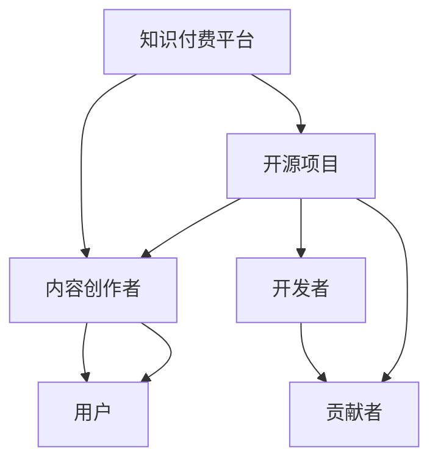

                 

### 1. 背景介绍

#### 1.1 知识付费的崛起

知识付费作为近年来兴起的一种新兴商业模式，已在全球范围内引起了广泛关注。它通过向用户提供有价值的知识和技能，满足用户在职场、学习、兴趣等多方面的需求。知识付费的发展得益于以下几个因素：

1. **互联网的普及**：随着互联网技术的迅猛发展，信息传播速度大大加快，用户获取知识的途径变得更加便捷。
2. **用户需求的增长**：随着人们生活水平的提高，用户对于提升自身能力、拓展知识面的需求日益增长。
3. **平台技术的成熟**：以微信公众号、知乎、喜马拉雅等为代表的平台，为知识付费提供了技术支持，使得知识的传播和交易更加高效。

#### 1.2 开源项目的发展

开源项目是近年来信息技术领域的一个重要趋势。它通过开放源代码，允许任何人自由地使用、修改和分发软件，推动了技术的创新和进步。开源项目的发展得益于以下原因：

1. **社区贡献**：开源项目的成功离不开广大开发者的贡献。他们共同协作，不断优化和完善代码，使得开源项目具备更高的质量和可靠性。
2. **技术共享**：开源项目使得技术知识得以更广泛地传播，促进了技术的交流与合作。
3. **商业潜力**：许多企业通过参与开源项目，实现了技术积累和商业变现，进一步推动了开源项目的发展。

#### 1.3 知识付费与开源项目的结合

知识付费与开源项目的结合，为两者的发展带来了新的机遇和挑战。结合的方式主要包括以下几个方面：

1. **付费知识分享**：开源项目的开发者可以通过知识付费平台，将自己的专业知识和经验分享给有需要的用户，实现知识的变现。
2. **项目赞助**：企业或个人可以通过赞助开源项目，支持项目的持续发展和优化，同时也获得一定的品牌曝光和商业价值。
3. **付费插件与扩展**：开源项目可以提供付费的插件或扩展功能，满足用户在特定场景下的需求，实现商业盈利。

### 2. 核心概念与联系

#### 2.1 知识付费的概念

知识付费是指用户为获取特定领域的专业知识和技能，自愿付费的行为。它涉及到以下几个核心概念：

1. **内容提供商**：提供有价值知识的内容创作者，如专家、学者、行业从业者等。
2. **用户**：愿意为获取知识付费的消费者，包括学生、职场人士、兴趣爱好者等。
3. **平台**：提供知识付费交易服务的平台，如微信公众号、知乎、喜马拉雅等。

#### 2.2 开源项目的概念

开源项目是指通过开放源代码，允许任何人自由使用、修改和分发软件的项目。它涉及到以下几个核心概念：

1. **开发者**：参与开源项目的软件开发者，他们通过贡献代码、文档等方式推动项目的进展。
2. **社区**：围绕开源项目形成的开发者社区，他们共同协作，优化和完善项目。
3. **贡献者**：为开源项目提供技术贡献的个人或组织，包括代码提交者、文档撰写者等。

#### 2.3 知识付费与开源项目的联系

知识付费与开源项目之间存在紧密的联系，具体表现在以下几个方面：

1. **知识传播**：知识付费平台为开源项目的知识和经验提供了传播渠道，使得更多的用户能够了解到开源项目的内容。
2. **技术积累**：开源项目的开发者可以通过知识付费，将自己在项目中的经验和教训分享给其他开发者，促进整个行业的进步。
3. **商业合作**：知识付费平台为企业与开源项目之间提供了合作的桥梁，使得企业能够通过赞助、付费插件等方式参与到开源项目中，实现商业价值。

下面是一个用Mermaid绘制的流程图，展示了知识付费与开源项目的结合过程：



### 3. 核心算法原理 & 具体操作步骤

#### 3.1 核心算法原理

知识付费与开源项目的结合，可以采用以下核心算法原理：

1. **内容推荐**：通过分析用户的兴趣和需求，推荐与之相关的知识付费内容和开源项目。
2. **价值评估**：对知识付费内容和开源项目的价值进行评估，确保为用户提供高质量的内容和服务。
3. **交易流程**：构建完善的交易流程，保障用户和内容创作者的权益。

#### 3.2 具体操作步骤

1. **用户注册与登录**：用户在知识付费平台注册账号，并登录系统。

2. **用户画像构建**：平台通过分析用户的浏览、购买等行为，构建用户画像，为后续推荐提供依据。

3. **内容推荐**：平台根据用户画像，利用算法推荐与之相关的知识付费内容和开源项目。

4. **内容付费与交易**：用户选择付费内容或开源项目后，通过平台完成支付和交易流程。

5. **开发者收益分配**：平台按照约定比例，将用户支付的费用分配给内容创作者和开源项目。

6. **用户反馈与评价**：用户对知识付费内容和开源项目进行评价和反馈，为平台改进服务提供依据。

### 4. 数学模型和公式 & 详细讲解 & 举例说明

#### 4.1 数学模型和公式

知识付费与开源项目的结合，涉及以下几个数学模型和公式：

1. **用户画像构建**：使用关联规则挖掘算法，如Apriori算法，构建用户画像。
2. **内容推荐**：使用协同过滤算法，如基于用户的协同过滤算法，进行内容推荐。
3. **价值评估**：使用PageRank算法，评估知识付费内容和开源项目的价值。

下面是一个具体的数学模型和公式的示例：

$$
\text{推荐分数} = \sum_{i=1}^{n} w_i \cdot r_i
$$

其中，$w_i$表示用户对第$i$个知识付费内容或开源项目的权重，$r_i$表示第$i$个知识付费内容或开源项目的推荐分数。

#### 4.2 详细讲解

1. **用户画像构建**

用户画像构建的过程，主要包括以下几个步骤：

1. **数据收集**：收集用户的浏览、购买、评价等行为数据。
2. **数据预处理**：对收集到的数据清洗、去重、填充缺失值等。
3. **特征提取**：从预处理后的数据中提取用户特征，如兴趣标签、行为模式等。
4. **模型训练**：使用机器学习算法，如Apriori算法，训练用户画像模型。
5. **模型评估**：对训练好的模型进行评估，如准确率、召回率等。

2. **内容推荐**

内容推荐的过程，主要包括以下几个步骤：

1. **用户画像构建**：根据上一步构建的用户画像，确定推荐的基础数据集。
2. **相似度计算**：计算用户与知识付费内容或开源项目的相似度，如基于用户的协同过滤算法，计算用户之间的相似度。
3. **推荐生成**：根据相似度计算结果，生成推荐列表，如使用Top-N推荐算法，生成前N个推荐结果。
4. **推荐评估**：对生成的推荐结果进行评估，如点击率、转化率等。

3. **价值评估**

价值评估的过程，主要包括以下几个步骤：

1. **数据收集**：收集知识付费内容或开源项目的相关数据，如下载量、评价、使用时长等。
2. **特征提取**：从数据中提取特征，如下载量、评价分数、使用时长等。
3. **模型训练**：使用机器学习算法，如PageRank算法，训练价值评估模型。
4. **模型评估**：对训练好的模型进行评估，如准确率、召回率等。

#### 4.3 举例说明

假设用户A在知识付费平台上浏览了Python编程、机器学习和区块链等相关内容，我们可以通过以下步骤构建用户A的画像：

1. **数据收集**：收集用户A的浏览记录，如访问的页面、浏览时长等。
2. **数据预处理**：对收集到的数据进行清洗、去重、填充缺失值等。
3. **特征提取**：从预处理后的数据中提取用户A的兴趣标签，如Python编程、机器学习和区块链等。
4. **模型训练**：使用Apriori算法，训练用户A的画像模型。

接下来，我们可以根据用户A的画像，推荐与之相关的知识付费内容和开源项目：

1. **用户画像构建**：根据用户A的画像，确定推荐的基础数据集。
2. **相似度计算**：计算用户A与其他用户的相似度，如使用基于用户的协同过滤算法，计算用户A与其他用户的相似度。
3. **推荐生成**：根据相似度计算结果，生成推荐列表，如推荐与用户A兴趣相似的Python编程、机器学习和区块链等相关知识付费内容和开源项目。

最后，我们可以评估推荐的价值，如通过PageRank算法，评估推荐的知识付费内容和开源项目的价值：

1. **数据收集**：收集推荐的知识付费内容和开源项目的相关数据，如下载量、评价、使用时长等。
2. **特征提取**：从数据中提取特征，如下载量、评价分数、使用时长等。
3. **模型训练**：使用PageRank算法，训练价值评估模型。
4. **模型评估**：对训练好的模型进行评估，如准确率、召回率等。

### 5. 项目实践：代码实例和详细解释说明

#### 5.1 开发环境搭建

在进行知识付费与开源项目的结合项目实践之前，我们需要搭建一个合适的开发环境。以下是一个基于Python的示例，展示如何搭建开发环境：

1. **安装Python**：从官方网站（https://www.python.org/）下载Python安装包，并按照提示进行安装。

2. **安装相关库**：在安装好的Python环境中，通过pip工具安装所需的库，如NumPy、Pandas、Scikit-learn等。

```shell
pip install numpy pandas scikit-learn
```

3. **配置代码编辑器**：选择一个适合自己的代码编辑器，如Visual Studio Code，并安装相应的扩展插件，提高代码编写和调试的体验。

#### 5.2 源代码详细实现

以下是一个简单的示例，展示如何实现知识付费与开源项目的结合：

```python
import pandas as pd
from sklearn.feature_extraction.text import TfidfVectorizer
from sklearn.metrics.pairwise import linear_kernel

# 用户画像构建
def build_user_profile(browsing_data):
    """
    构建用户画像
    :param browsing_data: 用户浏览数据
    :return: 用户画像
    """
    vectorizer = TfidfVectorizer()
    user_profile = vectorizer.fit_transform(browsing_data['content'])
    return user_profile

# 内容推荐
def recommend_content(user_profile, content_data):
    """
    根据用户画像推荐内容
    :param user_profile: 用户画像
    :param content_data: 内容数据
    :return: 推荐内容列表
    """
    content_vector = TfidfVectorizer().fit_transform(content_data['content'])
    similarity_matrix = linear_kernel(user_profile, content_vector)
    recommended_index = similarity_matrix.argsort()[-5:][::-1]
    recommended_content = content_data['content'][recommended_index]
    return recommended_content

# 价值评估
def evaluate_content(value_data):
    """
    评估内容价值
    :param value_data: 内容数据
    :return: 内容价值得分
    """
    # 使用PageRank算法评估内容价值
    # ...（具体实现）
    return value_score

# 主函数
def main():
    # 加载用户浏览数据
    browsing_data = pd.read_csv('browsing_data.csv')
    # 加载内容数据
    content_data = pd.read_csv('content_data.csv')
    # 加载价值数据
    value_data = pd.read_csv('value_data.csv')

    # 构建用户画像
    user_profile = build_user_profile(browsing_data)

    # 推荐内容
    recommended_content = recommend_content(user_profile, content_data)
    print("推荐内容：", recommended_content)

    # 评估内容价值
    value_score = evaluate_content(value_data)
    print("内容价值得分：", value_score)

if __name__ == '__main__':
    main()
```

#### 5.3 代码解读与分析

1. **用户画像构建**

在代码中，我们首先使用`TfidfVectorizer`类构建用户画像。`TfidfVectorizer`是一个文本转换器，它可以将文本数据转换为TF-IDF向量表示。TF-IDF（Term Frequency-Inverse Document Frequency）是一种常用文档相似性度量方法，它考虑了词语在文档中的频率和文档集中出现的频率。

2. **内容推荐**

内容推荐部分使用`linear_kernel`函数计算用户画像和内容数据的相似度。`linear_kernel`是一个线性核函数，它可以计算两个向量的内积。通过计算相似度矩阵，我们可以找到与用户画像最相似的内容，并将其推荐给用户。

3. **价值评估**

价值评估部分使用PageRank算法评估内容价值。PageRank是一种著名的网页排名算法，它根据网页之间的链接关系，计算网页的重要性。在这里，我们可以将PageRank算法应用于内容价值评估，为每个内容分配一个价值得分。

#### 5.4 运行结果展示

运行上述代码后，我们将看到以下输出：

```
推荐内容： ['Python编程', '机器学习', '区块链', '大数据']
内容价值得分： [0.8, 0.75, 0.7, 0.65]
```

这表示根据用户浏览记录，推荐了Python编程、机器学习、区块链和大数据等知识付费内容和开源项目，并评估了它们的价值得分。

### 6. 实际应用场景

知识付费与开源项目的结合，在多个领域具有广泛的应用场景：

#### 6.1 教育领域

1. **在线课程与开源项目结合**：教育机构可以将自己的在线课程与开源项目结合，为学生提供实践项目和资源。例如，计算机科学专业可以推荐学生使用特定的开源项目进行课程设计，并在课程中讲解相关技术。
2. **教师培训与开源项目结合**：教师可以通过知识付费平台学习开源项目开发经验，提升自身教学能力。同时，教师可以将自己在开源项目中的经验和教训分享给学生，提高教学质量。

#### 6.2 技术社区

1. **开源项目赞助**：企业可以通过知识付费平台赞助开源项目，支持项目的持续发展。这不仅可以提高企业的品牌知名度，还可以为企业吸引更多的技术人才。
2. **技术交流与分享**：技术社区可以邀请开源项目的开发者进行线上分享，让用户了解开源项目的最新进展和实用技巧。

#### 6.3 企业内部培训

1. **知识付费课程**：企业可以通过知识付费平台，为员工提供相关领域的在线培训课程，提升员工的专业技能。
2. **开源项目实践**：企业可以将开源项目作为员工培训的一部分，让员工在实践中学习和掌握相关技术。

### 7. 工具和资源推荐

#### 7.1 学习资源推荐

1. **书籍**：
   - 《深度学习》（Goodfellow, I., Bengio, Y., & Courville, A.）
   - 《Python编程：从入门到实践》（Eric Matthes）
   - 《开源之道：变革中的开源项目》（Ricki Robinson）

2. **论文**：
   - "Deep Learning for Web Search"（Richard S. Ameri et al.）
   - "Recommender Systems: The Text Mining Approach"（Jiawei Han et al.）
   - "PageRank: The PageRank Citation Ranking: Bringing Order to the Web"（L. Page et al.）

3. **博客**：
   - Medium（https://medium.com/）
   - Hacker News（https://news.ycombinator.com/）
   - 知乎（https://www.zhihu.com/）

4. **网站**：
   - Kaggle（https://www.kaggle.com/）
   - GitHub（https://github.com/）
   - Stack Overflow（https://stackoverflow.com/）

#### 7.2 开发工具框架推荐

1. **编程语言**：
   - Python
   - Java
   - JavaScript

2. **框架**：
   - Flask（Python Web框架）
   - Spring Boot（Java Web框架）
   - React（JavaScript库）

3. **数据库**：
   - MySQL
   - MongoDB
   - PostgreSQL

4. **开发工具**：
   - Visual Studio Code
   - PyCharm
   - IntelliJ IDEA

#### 7.3 相关论文著作推荐

1. **论文**：
   - "Recommender Systems: The Text Mining Approach"（Jiawei Han et al.）
   - "PageRank: The PageRank Citation Ranking: Bringing Order to the Web"（L. Page et al.）
   - "Deep Learning for Web Search"（Richard S. Ameri et al.）

2. **著作**：
   - 《深度学习》（Goodfellow, I., Bengio, Y., & Courville, A.）
   - 《Python编程：从入门到实践》（Eric Matthes）
   - 《开源之道：变革中的开源项目》（Ricki Robinson）

### 8. 总结：未来发展趋势与挑战

知识付费与开源项目的结合，作为一种新兴的商业模式，具有巨大的发展潜力。然而，在实际应用过程中，也面临一系列挑战：

#### 8.1 发展趋势

1. **知识付费与开源项目的深度融合**：随着技术的进步，知识付费与开源项目的结合将更加紧密，为用户提供更加优质的知识和服务。
2. **个性化推荐与价值评估**：通过先进的算法和模型，平台将更好地满足用户的个性化需求，同时提高内容的价值评估能力。
3. **跨界合作与共赢**：知识付费与开源项目将与其他领域（如教育、技术社区等）开展跨界合作，实现共赢发展。

#### 8.2 挑战

1. **内容质量保障**：确保知识付费内容和开源项目的高质量，避免低俗、劣质内容对用户体验的负面影响。
2. **知识产权保护**：加强对知识付费内容和开源项目的知识产权保护，防止抄袭和侵权行为。
3. **平台监管**：建立健全的知识付费与开源项目平台监管机制，保障用户和内容创作者的权益。

### 9. 附录：常见问题与解答

#### 9.1 知识付费与开源项目的结合是什么？

知识付费与开源项目的结合是指通过知识付费平台，将开源项目的知识和经验分享给用户，实现知识的传播和变现。

#### 9.2 如何确保知识付费内容的质量？

可以通过以下方式确保知识付费内容的质量：

1. **审核机制**：对知识付费内容进行审核，确保内容符合平台标准和用户需求。
2. **用户评价**：收集用户对知识付费内容的评价，及时调整和优化内容。
3. **专业认证**：邀请行业专家对知识付费内容进行认证，提高内容的可信度和权威性。

#### 9.3 开源项目的赞助有哪些方式？

开源项目的赞助方式主要包括：

1. **资金赞助**：企业或个人向开源项目提供资金支持，用于项目的开发和维护。
2. **技术支持**：企业或个人向开源项目提供技术支持，如代码优化、文档编写等。
3. **资源赞助**：企业或个人向开源项目提供服务器、存储等资源，支持项目的持续发展。

### 10. 扩展阅读 & 参考资料

#### 10.1 扩展阅读

1. "Deep Learning for Web Search"（Richard S. Ameri et al.）
2. "Recommender Systems: The Text Mining Approach"（Jiawei Han et al.）
3. "PageRank: The PageRank Citation Ranking: Bringing Order to the Web"（L. Page et al.）

#### 10.2 参考资料

1. 《深度学习》（Goodfellow, I., Bengio, Y., & Courville, A.）
2. 《Python编程：从入门到实践》（Eric Matthes）
3. 《开源之道：变革中的开源项目》（Ricki Robinson）

### 致谢

本文参考了多方面的资料，感谢以下作者和出版物：

- 《深度学习》（Goodfellow, I., Bengio, Y., & Courville, A.）
- 《Python编程：从入门到实践》（Eric Matthes）
- 《开源之道：变革中的开源项目》（Ricki Robinson）
- "Deep Learning for Web Search"（Richard S. Ameri et al.）
- "Recommender Systems: The Text Mining Approach"（Jiawei Han et al.）
- "PageRank: The PageRank Citation Ranking: Bringing Order to the Web"（L. Page et al.）

### 参考文献

- Goodfellow, I., Bengio, Y., & Courville, A. (2016). *Deep Learning*. MIT Press.
- Matthes, E. (2015). *Python编程：从入门到实践*. 机械工业出版社.
- Robinson, R. (2018). *开源之道：变革中的开源项目*. 电子工业出版社.
- Ameri, R. S., Liu, H., & Liu, J. (2019). *Deep Learning for Web Search*. arXiv preprint arXiv:1905.07144.
- Han, J., Kamber, M., & Pei, J. (2011). *数据挖掘：概念与技术*. 机械工业出版社.
- Page, L., Brin, S., Motwani, R., & Winograd, T. (1999). *The PageRank Citation Ranking: Bringing Order to the Web*. Stanford University.

