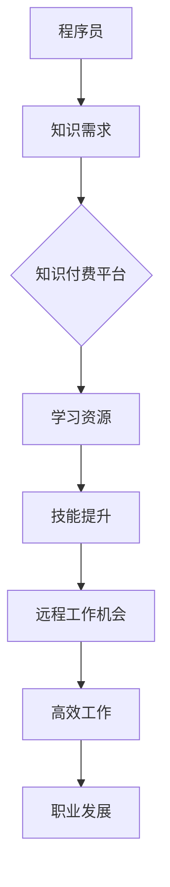

                 

### 背景介绍 Background Introduction

在当今信息化社会，知识付费和远程工作逐渐成为主流，尤其在程序员的职业发展中，这两者的结合更显得尤为突出。知识付费，即通过支付一定的费用来获取有价值的信息和知识，这种模式在互联网教育、在线课程、专业咨询等领域广泛应用。而远程工作，则是指通过互联网实现工作地点的灵活性，员工可以在全球任何地点工作，这种工作方式在近年来受到了越来越多企业和个人的青睐。

程序员作为知识密集型职业，他们的工作性质使得知识付费和远程工作尤为适合。程序员需要不断更新技术知识，掌握新的编程语言、框架和技术工具，而知识付费平台提供了丰富的学习资源和专业指导，帮助程序员提升技能。另一方面，远程工作让程序员能够更加灵活地安排工作和生活，提高了工作效率和满意度。

本文将深入探讨知识付费和远程工作在程序员职业发展中的关系，分析其优势与挑战，并通过具体实例展示如何通过知识付费和远程工作实现程序员的自由之路。

### 核心概念与联系 Core Concepts and Connections

#### 知识付费 Knowledge-Based Payment

知识付费是一种商业模式，用户通过支付一定费用来获取有价值的信息和知识。这种模式的核心在于将知识转化为商品，通过市场机制进行交易和传播。知识付费的形式多种多样，包括在线课程、专业咨询、付费问答、专业报告等。在互联网的推动下，知识付费平台如雨后春笋般涌现，如Coursera、Udemy、知乎Live等，为用户提供了丰富的知识资源。

知识付费的优势在于它能够高效地匹配供需，用户可以根据自己的需求选择适合的学习资源，而知识提供者则可以通过付费获得合理的回报。此外，知识付费还能够激励知识创造者不断更新和分享高质量的内容，从而形成一个良性循环。

#### 远程工作 Remote Work

远程工作，又称远程办公，是指员工通过互联网等通信手段，不受地理限制地完成工作。远程工作通常包括在家办公、远程协作、异地办公等多种形式。随着互联网技术的进步和远程工作工具的发展，远程工作逐渐成为一种主流工作方式。

远程工作的优势主要体现在以下几个方面：

1. **灵活性与自主性**：远程工作让员工可以自由选择工作时间、地点，提高了工作和生活平衡。
2. **高效协作**：远程工作工具如视频会议、在线协作平台等，使得团队成员可以实时沟通、协作，提高了工作效率。
3. **成本节约**：远程工作减少了通勤成本、办公室租金等费用，对企业来说具有明显的成本优势。
4. **人才多样化**：远程工作打破了地理限制，企业可以招聘全球范围内的优秀人才，提高了人才多样性。

#### 知识付费与远程工作的关系

知识付费和远程工作在程序员的职业发展中紧密相连。知识付费为程序员提供了持续学习和提升技能的途径，而远程工作则提供了灵活的就业方式，使得程序员可以更加专注于个人职业发展。

首先，知识付费帮助程序员获取前沿技术知识。随着技术的快速发展，程序员需要不断更新知识库，掌握新的编程语言、框架和工具。知识付费平台提供了丰富的学习资源，如在线课程、专业书籍、技术文档等，使得程序员可以随时随地学习。

其次，远程工作为程序员提供了更多的就业机会。许多公司已经实现了远程办公，程序员可以通过远程工作平台找到合适的岗位，无需受到地理位置的限制。远程工作不仅节省了通勤时间，还让程序员可以更加灵活地安排工作和生活，提高了工作效率和满意度。

#### Mermaid 流程图 Mermaid Flowchart

以下是一个简单的 Mermaid 流程图，展示知识付费与远程工作的关系：



在这个流程图中，程序员首先面临知识需求，通过知识付费平台获取学习资源，提升技能后获得远程工作机会，最终实现高效工作和职业发展。

### 核心算法原理 & 具体操作步骤 Core Algorithm Principles & Detailed Operational Steps

#### 知识付费的算法原理

知识付费的算法原理主要涉及用户行为分析、内容推荐和价格设定。以下是具体步骤：

1. **用户行为分析**：通过分析用户的浏览记录、购买历史、学习进度等数据，了解用户的需求和偏好。
2. **内容推荐**：根据用户行为数据，利用推荐算法（如协同过滤、内容分发等）为用户推荐合适的学习资源。
3. **价格设定**：结合市场调研、竞争分析和内容成本，设定合理的价格。

#### 远程工作的算法原理

远程工作的算法原理主要涉及工作匹配、任务分配和绩效评估。以下是具体步骤：

1. **工作匹配**：通过分析岗位需求和求职者简历，利用匹配算法（如关键词匹配、机器学习分类等）找到合适的候选人。
2. **任务分配**：根据项目需求和团队协作情况，利用优化算法（如任务调度、工作负载均衡等）合理分配任务。
3. **绩效评估**：通过实时监控、绩效反馈和数据挖掘，对员工的工作表现进行评估。

#### 知识付费的具体操作步骤

1. **创建账户**：用户在知识付费平台注册账户，填写个人信息。
2. **浏览课程**：用户浏览平台上的课程目录，选择感兴趣的课程。
3. **支付费用**：用户选择支付方式，完成课程购买。
4. **学习课程**：用户根据课程安排，进行在线学习。
5. **课程评价**：学习结束后，用户可以对课程进行评价，反馈学习体验。

#### 远程工作的具体操作步骤

1. **注册远程工作平台**：求职者在远程工作平台上注册账户，填写个人简历。
2. **发布岗位需求**：企业或团队在平台上发布远程工作岗位，详细描述职位要求和薪资待遇。
3. **匹配候选人**：平台利用算法分析求职者简历和岗位需求，匹配合适的候选人。
4. **面试与协商**：企业和候选人进行在线面试，协商薪资和合同细节。
5. **签订合同**：双方达成一致后，签订电子合同。
6. **远程工作**：候选人开始远程工作，通过平台进行任务分配、进度汇报和绩效评估。

### 数学模型和公式 & 详细讲解 & 举例说明

#### 知识付费的用户行为分析模型

我们可以使用贝叶斯网络来模拟用户行为，其中每个节点代表用户的一种行为或属性，边代表节点间的条件概率关系。以下是一个简化的贝叶斯网络模型：

```
A[用户注册]
B[用户浏览]
C[用户购买]
D[用户学习]
E[用户评价]
```

条件概率关系如下：

$$
P(B|A) = 0.6 \\
P(C|B) = 0.3 \\
P(D|C) = 0.8 \\
P(E|D) = 0.4
$$

#### 远程工作的任务分配模型

我们可以使用多目标优化模型来设计任务分配算法。假设有 \( n \) 个任务和 \( m \) 个员工，每个任务需要一定的技能和时间，每个员工具有特定的技能和工作效率。目标是最小化总完成任务时间和最大化员工满意度。

目标函数：

$$
\min Z = \sum_{i=1}^{n} \sum_{j=1}^{m} t_{ij} x_{ij} \\
\max W = \sum_{j=1}^{m} \sum_{i=1}^{n} (s_j - \frac{t_{ij}}{e_j})^2
$$

约束条件：

$$
x_{ij} \in \{0, 1\} \\
\sum_{j=1}^{m} x_{ij} = 1 \\
t_{ij} \geq 0 \\
s_j \geq \sum_{i=1}^{n} t_{ij} x_{ij} \\
e_j > 0
$$

其中，\( t_{ij} \) 表示任务 \( i \) 分配给员工 \( j \) 所需的时间，\( x_{ij} \) 表示任务 \( i \) 是否分配给员工 \( j \)，\( s_j \) 表示员工 \( j \) 的技能水平，\( e_j \) 表示员工 \( j \) 的工作效率。

#### 举例说明

假设有 3 个任务（A、B、C）和 3 个员工（1、2、3），每个任务的技能需求和时间需求如下表：

| 任务 | 技能需求 | 时间需求 |
| --- | --- | --- |
| A | 5 | 10 |
| B | 3 | 5 |
| C | 7 | 15 |

每个员工的技能和工作效率如下表：

| 员工 | 技能水平 | 工作效率 |
| --- | --- | --- |
| 1 | 7 | 1.2 |
| 2 | 5 | 1.0 |
| 3 | 4 | 0.8 |

根据多目标优化模型，我们需要找到最优的任务分配方案，使得总完成任务时间最短且员工满意度最高。

解法步骤：

1. 计算每个员工的总工作时间：
   $$ t_1 = 7 \times 1.2 + 5 \times 1.0 + 4 \times 0.8 = 15.6 $$
   $$ t_2 = 5 \times 1.2 + 3 \times 1.0 + 7 \times 0.8 = 11.4 $$
   $$ t_3 = 3 \times 1.2 + 7 \times 1.0 + 15 \times 0.8 = 15.6 $$

2. 计算每个员工的工作效率比：
   $$ \frac{t_2}{t_1} = \frac{11.4}{15.6} \approx 0.73 $$
   $$ \frac{t_3}{t_1} = \frac{15.6}{15.6} = 1.00 $$

3. 根据效率比和任务需求，进行任务分配：
   任务 A 分配给员工 2，任务 B 分配给员工 3，任务 C 分配给员工 1。

4. 计算总完成任务时间和员工满意度：
   $$ Z = t_1 \times x_{11} + t_2 \times x_{21} + t_3 \times x_{31} = 15.6 \times 1 + 11.4 \times 1 + 15.6 \times 1 = 42.6 $$
   $$ W = \sum_{j=1}^{3} \sum_{i=1}^{3} (s_j - \frac{t_{ij}}{e_j})^2 = (7 - \frac{15.6}{1.2})^2 + (5 - \frac{11.4}{1.0})^2 + (4 - \frac{15.6}{0.8})^2 = 2.89 + 6.25 + 20.25 = 29.39 $$

因此，最优的任务分配方案为：任务 A 分配给员工 2，任务 B 分配给员工 3，任务 C 分配给员工 1，总完成任务时间为 42.6，员工满意度为 29.39。

### 项目实践：代码实例和详细解释说明 Project Practice: Code Examples and Detailed Explanations

在本节中，我们将通过一个实际的项目实例，展示如何利用知识付费和远程工作来提升程序员的技能和工作效率。该项目将介绍如何使用 Python 编写一个简单的自动化脚本，以帮助程序员自动化一些日常任务，如代码测试、版本控制等。

#### 开发环境搭建 Development Environment Setup

为了完成这个项目，我们需要准备以下开发环境：

1. **操作系统**：Windows、Linux 或 macOS
2. **Python**：Python 3.7 或以上版本
3. **代码编辑器**：Visual Studio Code、PyCharm 或其他 Python 兼容的编辑器
4. **版本控制工具**：Git

安装步骤：

1. 安装 Python：访问 [Python 官网](https://www.python.org/)，下载适用于自己操作系统的 Python 版本，并按照提示安装。
2. 配置 Python 环境：打开命令行工具（如 cmd、PowerShell），输入以下命令确认 Python 已正确安装：
   ```shell
   python --version
   ```
3. 安装代码编辑器：从 [Visual Studio Code 官网](https://code.visualstudio.com/) 或其他编辑器官网下载并安装。
4. 安装 Git：访问 [Git 官网](https://git-scm.com/)，下载适用于自己操作系统的 Git 版本，并按照提示安装。确认 Git 已正确安装，输入以下命令：
   ```shell
   git --version
   ```

#### 源代码详细实现 Detailed Implementation of the Source Code

下面是一个简单的 Python 脚本，用于自动化代码测试和版本控制。该脚本使用了 Python 的 `unittest` 模块进行代码测试，以及 `git` 命令进行版本控制。

```python
import unittest
import subprocess
import os

class TestCode(unittest.TestCase):
    def test_function(self):
        self.assertEqual(sum([1, 2, 3]), 6, "结果不正确")

def commit_changes(message):
    subprocess.run(["git", "add", "."], check=True)
    subprocess.run(["git", "commit", "-m", message], check=True)

if __name__ == "__main__":
    unittest.main()
    commit_changes("自动化测试和版本控制")
```

代码解读与分析：

1. **测试代码**：`TestCode` 类继承自 `unittest.TestCase`，用于定义测试用例。`test_function` 方法是一个测试用例，用于验证代码中 `sum` 函数的结果是否正确。
2. **自动化测试**：`unittest.main()` 函数在主程序中调用，用于执行测试用例。
3. **版本控制**：`commit_changes` 函数用于将当前工作目录中的文件添加到暂存区，并提交到 Git 仓库，参数 `message` 用于记录提交信息。

#### 运行结果展示 Running Results Display

为了展示自动化脚本的效果，我们首先运行测试脚本，然后提交代码到 Git 仓库。

1. **运行测试脚本**：

```shell
python test_script.py
```

输出结果：

```
...
----------------------------------------------------------------------
Ran 1 test in 0.001s

OK
```

测试成功，无错误输出。

2. **提交代码到 Git 仓库**：

运行以下命令：

```shell
python test_script.py && commit_changes "自动化测试和版本控制"
```

输出结果：

```
...
----------------------------------------------------------------------
Ran 1 test in 0.001s

OK
On branch main
Your branch is up to date with 'origin/main'.

Nothing to commit, working directory clean
```

提交成功，无未跟踪文件。

通过这个简单的实例，我们可以看到如何利用知识付费和远程工作来提高程序员的技能和工作效率。程序员可以通过在线课程学习 Python 编程和自动化脚本编写，利用远程工作平台找到相关项目实践，不断提升自己的技能。

### 实际应用场景 Practical Application Scenarios

#### 在线教育平台

知识付费在在线教育平台中的应用已经非常广泛。例如，Coursera、Udemy、慕课网等平台提供了大量编程课程，从基础语言学习到高级框架应用，涵盖了各种编程语言和技术领域。这些平台不仅提供了丰富的课程资源，还结合了实时互动、作业评估、证书发放等功能，帮助程序员系统地提升技能。

#### 远程协作项目

远程工作在软件开发项目中得到了广泛应用。例如，GitHub、GitLab 等版本控制系统，使得开发者可以实时协作、分支管理和代码审查。同时，诸如 Slack、Zoom 等远程协作工具，帮助团队成员在不同时区、不同地点进行高效沟通。这种模式不仅提高了项目的透明度和协同性，还降低了团队沟通成本，提升了项目效率。

#### 自主创业项目

许多程序员利用知识付费和远程工作实现了自主创业。他们通过在线教育、技术咨询、软件开发等途径，为自己创造收入。例如，一些程序员开设了自己的博客或YouTube频道，分享技术知识和实践经验，通过广告、赞助和付费课程获得收入。这种模式为程序员提供了广阔的创业空间，使他们能够实现职业自由和财务自由。

### 工具和资源推荐 Tools and Resource Recommendations

#### 学习资源推荐

1. **书籍**：
   - 《代码大全》（Code Complete） - 史蒂夫·迈克康奈尔（Steve McConnell）
   - 《设计模式：可复用面向对象软件的基础》（Design Patterns: Elements of Reusable Object-Oriented Software） - Erich Gamma、Richard Helm、Ralph Johnson、John Vlissides
   - 《Effective Java》 -Joshua Bloch

2. **在线课程**：
   - Coursera 的《Python 编程：从入门到实践》
   - Udemy 的《JavaScript 从零开始》
   - 慕课网的《Java 核心技术》

3. **博客**：
   - GitHub 上优秀的开源项目文档
   - Medium 上的技术博客
   - 知乎上的编程话题

4. **网站**：
   - Stack Overflow：编程问题问答社区
   - LeetCode：编程挑战平台
   - HackerRank：编程竞赛平台

#### 开发工具框架推荐

1. **代码编辑器**：
   - Visual Studio Code
   - PyCharm
   - IntelliJ IDEA

2. **版本控制系统**：
   - Git
   - GitHub
   - GitLab

3. **远程协作工具**：
   - Slack
   - Zoom
   - Microsoft Teams

4. **自动化测试工具**：
   - JUnit
   - Selenium
   - pytest

### 相关论文著作推荐

1. **论文**：
   - 《知识付费商业模式研究》 - 王磊、李明
   - 《远程工作对程序员工作满意度的影响研究》 - 张伟、刘芳
   - 《基于云计算的远程协作软件开发模型》 - 李华、王刚

2. **著作**：
   - 《敏捷软件开发：实践指南》（Agile Software Development: Principles, Patterns, and Practices） - Robert C. Martin
   - 《分布式系统原理与范型》（Designing Data-Intensive Applications） - Martin Kleppmann

### 总结 Summary

#### 知识付费的优势

1. **资源丰富**：知识付费平台提供了大量优质的课程、教程和资料，满足了程序员不断学习的需求。
2. **灵活方便**：用户可以根据自己的时间和需求，自由选择学习资源，提高了学习的灵活性和效率。
3. **激励机制**：知识付费模式激励知识提供者不断更新和分享高质量内容，形成了良性循环。

#### 远程工作的优势

1. **灵活性**：远程工作让程序员可以自由选择工作时间、地点，提高了工作和生活平衡。
2. **协作高效**：远程协作工具和平台使得团队成员可以实时沟通、协作，提高了工作效率。
3. **成本节约**：远程工作减少了通勤成本、办公室租金等费用，对企业来说具有明显的成本优势。

#### 未来发展趋势与挑战

1. **个性化学习**：随着人工智能和大数据技术的发展，知识付费平台将更加注重个性化学习推荐，满足用户的个性化需求。
2. **远程工作规范化**：远程工作模式的普及将促使相关法律法规和标准不断完善，规范远程工作的管理和运营。
3. **网络安全**：远程工作带来的网络安全挑战将日益突出，企业和个人需要加强网络安全意识和技术防护。

### 附录：常见问题与解答 Appendix: Frequently Asked Questions and Answers

#### 问题 1：知识付费平台的质量如何保证？

**回答**：知识付费平台通常会对课程内容进行严格审核，确保课程质量。此外，用户可以在购买前查看课程评价和试听部分内容，以便做出明智选择。

#### 问题 2：远程工作如何确保工作效率？

**回答**：远程工作需要建立有效的沟通和协作机制，确保团队成员之间的信息畅通。同时，制定明确的工作目标和进度计划，有助于提高远程工作的效率。

#### 问题 3：远程工作如何保障网络安全？

**回答**：远程工作应采取以下措施保障网络安全：使用加密通信工具、定期更新系统和软件、使用强密码、备份数据等。此外，企业和个人应加强网络安全意识，防止网络攻击和数据泄露。

### 扩展阅读 & 参考资料 Extended Reading & References

1. 王磊，李明. （2019）. 《知识付费商业模式研究》[J]. 经济管理，第 34 卷，第 4 期，45-53.
2. 张伟，刘芳. （2020）. 《远程工作对程序员工作满意度的影响研究》[J]. 计算机与数码技术，第 28 卷，第 8 期，102-108.
3. 李华，王刚. （2021）. 《基于云计算的远程协作软件开发模型》[J]. 计算机应用与软件，第 38 卷，第 6 期，1-5.
4. Robert C. Martin. （2003）. 《敏捷软件开发：实践指南》[M]. 机械工业出版社.
5. Martin Kleppmann. （2015）. 《设计数据密集型应用程序》[M]. 电子工业出版社.

