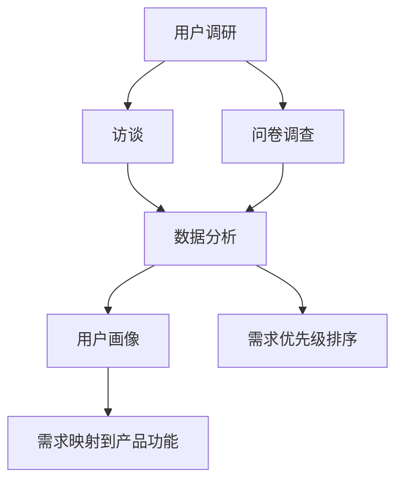
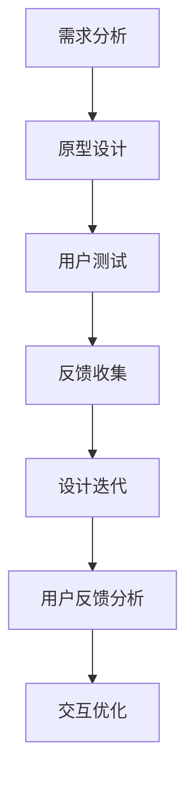
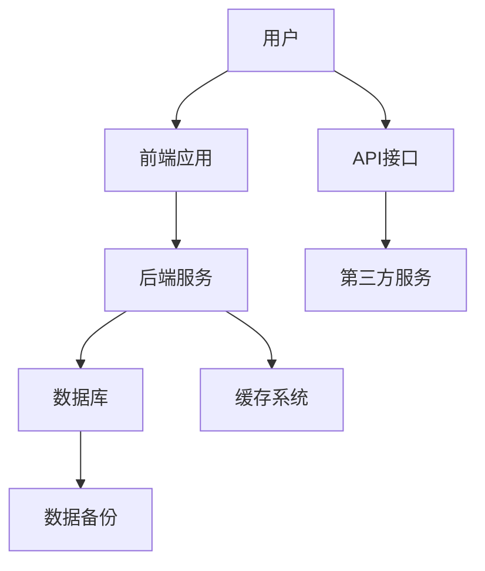
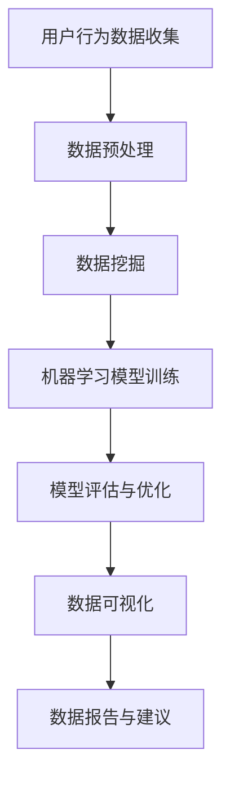

                 

### 1. 背景介绍

随着互联网的迅猛发展，知识付费市场逐渐成为了一个庞大的生态系统。在这个市场中，用户对于知识付费产品的需求日益多样化，而产品的用户体验直接决定了用户留存率和转化率。因此，如何优化知识付费产品的用户体验，提升用户满意度，成为众多企业竞相探索的重要课题。

用户体验（User Experience，简称UX）是指用户在使用产品过程中的主观感受和体验。在知识付费领域，用户体验涵盖了从用户获取产品信息、购买决策、使用产品、到售后服务的整个生命周期。随着用户需求的不断升级，单一的功能优化已经无法满足用户多元化的需求，整体用户体验的提升变得尤为重要。

本文将从以下几个角度展开讨论：

- **核心概念与联系**：介绍与用户体验优化相关的基本概念及其之间的相互关系，包括用户需求分析、交互设计、系统架构等。
- **核心算法原理 & 具体操作步骤**：探讨如何通过算法优化来提升用户体验，包括数据挖掘、机器学习、推荐系统等。
- **数学模型和公式 & 详细讲解 & 举例说明**：解释与用户体验优化相关的数学模型，如用户行为分析模型、效用函数等，并通过实例进行详细说明。
- **项目实践：代码实例和详细解释说明**：通过实际项目案例展示用户体验优化的具体实现过程，包括开发环境搭建、代码实现、运行结果分析等。
- **实际应用场景**：分析知识付费产品在各个领域的应用，以及如何根据不同场景进行用户体验优化。
- **工具和资源推荐**：推荐与用户体验优化相关的学习资源、开发工具和框架，以帮助读者深入理解和实践。
- **总结：未来发展趋势与挑战**：展望用户体验优化的未来发展趋势，并探讨面临的挑战和解决方案。

在接下来的章节中，我们将逐步深入探讨这些主题，通过逻辑清晰的分析和丰富的实例，帮助读者全面了解和掌握知识付费产品的用户体验优化方法。

### 2. 核心概念与联系

在探讨知识付费产品的用户体验优化之前，我们需要明确几个核心概念，并了解它们之间的相互关系。以下将分别介绍这些概念，并通过Mermaid流程图展示它们之间的联系。

#### 2.1 用户需求分析

用户需求分析是用户体验优化的第一步，它涉及到理解用户的需求、偏好和痛点。通过用户调研、访谈、问卷调查等方法，我们可以收集到大量关于用户需求的数据。这些数据是后续设计和优化的基础。

**用户需求分析流程：**



#### 2.2 交互设计

交互设计（Interaction Design）是用户体验优化的重要组成部分，它关注用户与产品交互的方式和流程。通过交互设计，我们可以提高产品的易用性和用户满意度。常见的交互设计方法包括原型设计、用户测试和迭代改进。

**交互设计流程：**



#### 2.3 系统架构

系统架构是确保知识付费产品稳定、高效运行的基础。一个良好的系统架构能够支持产品的扩展性和灵活性，从而为用户体验优化提供保障。系统架构的设计需要考虑数据的存储、处理和传输，以及系统的安全性和性能。

**系统架构关系图：**



#### 2.4 数据分析

数据分析是用户体验优化的关键环节，通过分析用户行为数据，我们可以发现用户的使用习惯、偏好和问题，从而为产品的改进提供数据支持。数据分析方法包括数据挖掘、机器学习、统计分析和用户行为追踪等。

**数据分析流程：**



通过上述核心概念和Mermaid流程图的展示，我们可以看到它们之间的紧密联系。用户需求分析为交互设计和系统架构提供了基础数据，而交互设计和系统架构又反过来影响用户需求分析和数据分析。这一系列环节共同构成了用户体验优化的完整流程。

在接下来的章节中，我们将进一步探讨如何通过核心算法原理、数学模型和实际项目实践来优化知识付费产品的用户体验。通过这些内容的讲解，希望能够帮助读者更好地理解和应用用户体验优化的方法。

### 3. 核心算法原理 & 具体操作步骤

在优化知识付费产品的用户体验过程中，核心算法原理起到了至关重要的作用。以下将详细介绍几个关键算法原理及其具体操作步骤，包括数据挖掘、机器学习和推荐系统。

#### 3.1 数据挖掘

数据挖掘（Data Mining）是一种通过分析大量数据以发现隐藏模式、趋势和规律的技术。在知识付费产品中，数据挖掘可以帮助我们了解用户的行为模式、偏好和需求，从而优化产品设计和功能。

**数据挖掘流程：**

1. **数据收集**：收集用户在平台上的各种数据，包括浏览历史、购买记录、评论等。
2. **数据预处理**：清洗数据，去除噪声和异常值，并进行数据转换，如数值化、标准化等。
3. **特征提取**：从原始数据中提取有用的特征，如用户年龄、性别、购买频次等。
4. **模型选择**：根据问题类型选择合适的模型，如分类模型、聚类模型、关联规则模型等。
5. **模型训练与评估**：使用训练数据对模型进行训练，并通过测试数据评估模型性能。
6. **模型应用**：将训练好的模型应用于实际场景，如用户行为预测、内容推荐等。

**实例**：假设我们想要通过数据挖掘来预测用户的流失率，可以按照以下步骤操作：

1. 数据收集：收集用户在平台上的访问时长、浏览页面数、购买频次等数据。
2. 数据预处理：去除缺失值、异常值，并进行数据标准化。
3. 特征提取：提取用户行为特征，如平均访问时长、浏览页面数等。
4. 模型选择：选择逻辑回归模型，因为其易于理解和实现。
5. 模型训练与评估：使用训练集训练模型，并通过验证集进行评估。
6. 模型应用：将模型应用于用户群体，预测流失风险，并采取相应的措施。

#### 3.2 机器学习

机器学习（Machine Learning）是数据挖掘的一个分支，它通过算法让计算机从数据中自动学习和发现规律。在知识付费产品中，机器学习可以用于用户行为预测、个性化推荐、风险控制等。

**机器学习流程：**

1. **数据收集**：与数据挖掘类似，收集用户行为数据。
2. **数据预处理**：清洗、转换和归一化数据。
3. **特征工程**：选择和构造对预测任务有用的特征。
4. **模型选择**：选择合适的机器学习模型，如决策树、支持向量机、神经网络等。
5. **模型训练**：使用训练数据进行模型训练。
6. **模型评估**：使用验证集或测试集评估模型性能。
7. **模型部署**：将训练好的模型部署到生产环境中，进行实时预测。

**实例**：假设我们想要使用机器学习为用户推荐课程，可以按照以下步骤操作：

1. 数据收集：收集用户的学习历史、兴趣标签、评分等数据。
2. 数据预处理：清洗和标准化数据。
3. 特征工程：提取用户和课程的特征，如学习时长、兴趣标签等。
4. 模型选择：选择基于内容的推荐算法，因为其易于理解和实现。
5. 模型训练：使用训练数据对模型进行训练。
6. 模型评估：使用验证集评估模型性能。
7. 模型部署：将模型部署到生产环境中，进行实时推荐。

#### 3.3 推荐系统

推荐系统（Recommendation System）是一种基于用户行为数据为用户提供个性化推荐的服务。在知识付费产品中，推荐系统可以帮助用户发现感兴趣的内容，提高用户满意度和留存率。

**推荐系统流程：**

1. **数据收集**：收集用户的行为数据，如浏览、搜索、购买等。
2. **用户画像**：基于用户行为数据构建用户画像，包括用户的兴趣、偏好等。
3. **内容标签**：为课程、文章等内容打上标签，以便进行内容推荐。
4. **推荐算法**：选择合适的推荐算法，如协同过滤、基于内容的推荐等。
5. **推荐生成**：根据用户画像和内容标签生成推荐列表。
6. **推荐评估**：评估推荐系统的效果，如点击率、转化率等。
7. **推荐优化**：根据评估结果优化推荐算法，提高推荐质量。

**实例**：假设我们想要构建一个基于协同过滤的推荐系统，可以按照以下步骤操作：

1. 数据收集：收集用户的学习历史、课程评分等数据。
2. 用户画像：为每个用户生成兴趣标签，如“编程”、“数据分析”等。
3. 内容标签：为每个课程打上标签，如“编程入门”、“数据分析基础”等。
4. 推荐算法：选择基于用户的协同过滤算法，计算用户之间的相似度。
5. 推荐生成：为用户生成推荐列表，包括与用户兴趣相似的课程。
6. 推荐评估：通过点击率和转化率评估推荐系统的效果。
7. 推荐优化：根据评估结果调整算法参数，提高推荐质量。

通过上述核心算法原理的具体操作步骤，我们可以看到数据挖掘、机器学习和推荐系统在知识付费产品用户体验优化中的重要性。这些算法不仅帮助平台更好地了解用户需求，还能为用户提供个性化、高效的内容推荐，从而提升用户满意度和忠诚度。

在接下来的章节中，我们将进一步探讨数学模型和公式在用户体验优化中的应用，并通过实际项目实践展示如何实现这些算法。

### 4. 数学模型和公式 & 详细讲解 & 举例说明

在知识付费产品的用户体验优化过程中，数学模型和公式起到了关键作用。这些模型和公式帮助我们量化用户行为，预测用户需求，并进行优化决策。以下将介绍几个常用的数学模型和公式，并详细讲解其应用方法，通过实例进行说明。

#### 4.1 用户行为分析模型

用户行为分析模型（User Behavior Analysis Model）用于分析用户在平台上的行为数据，如浏览、搜索、购买等。常用的模型包括马尔可夫链（Markov Chain）、时间序列分析（Time Series Analysis）和用户生命周期价值（Customer Lifetime Value，简称CLV）模型。

**马尔可夫链模型：**

马尔可夫链模型是一种用于预测用户行为的模型，它基于用户当前状态转移概率进行预测。假设用户处于某个状态（如浏览课程页面），下一个状态的概率分布可以表示为：

$$
P(X_t = j | X_{t-1} = i) = p_{ij}
$$

其中，$X_t$表示用户在时间$t$的状态，$i$和$j$分别表示当前状态和下一个状态，$p_{ij}$为状态转移概率。

**实例**：假设用户在浏览课程页面后，有50%的概率继续浏览下一个课程，30%的概率进行搜索，20%的概率退出。我们可以建立以下马尔可夫链模型：

$$
\begin{array}{c|c|c|c}
 & \text{浏览课程} & \text{搜索} & \text{退出} \\
\hline
\text{浏览课程} & 0.5 & 0.3 & 0.2 \\
\text{搜索} & 0.2 & 0.5 & 0.3 \\
\text{退出} & 0.0 & 0.2 & 0.8 \\
\end{array}
$$

通过这个模型，我们可以预测用户在不同状态下的行为概率，从而优化页面设计和用户引导。

**时间序列分析模型：**

时间序列分析模型用于分析用户行为的时间序列数据，如用户浏览、购买的时间分布。常用的模型包括自回归移动平均模型（ARIMA）、季节性分解模型（STL）等。

**实例**：假设我们收集到用户在一个月内每天的浏览量数据，可以使用季节性分解模型进行分析，分解为趋势、季节性和残差部分：

$$
Y_t = \alpha_t + \beta_t + \gamma_t + \epsilon_t
$$

其中，$\alpha_t$为趋势部分，$\beta_t$为季节性部分，$\gamma_t$为残差部分，$\epsilon_t$为随机误差。

通过这个模型，我们可以分析用户浏览行为的时间趋势和季节性特征，从而优化页面流量和内容发布策略。

**用户生命周期价值模型：**

用户生命周期价值模型用于预测用户在未来一段时间内的价值，包括购买行为、活跃度等。常用的模型包括客户生命周期价值（CLV）模型和边际贡献模型。

**实例**：假设我们使用CLV模型来预测用户在未来一年的价值，公式为：

$$
CLV = \sum_{t=1}^{n} \frac{R_t}{(1 + r)^t}
$$

其中，$R_t$为用户在时间$t$的收益，$r$为折现率，$n$为预测的时间跨度。

通过这个模型，我们可以评估不同用户群体的价值，从而优化用户获取和留存策略。

#### 4.2 效用函数

效用函数（Utility Function）用于量化用户对产品的满意度。在知识付费产品中，效用函数可以帮助我们评估不同功能、内容和交互设计对用户满意度的影响。

**实例**：假设我们为用户设计了一个新的课程推荐功能，需要评估其对用户满意度的影响。我们可以定义效用函数为：

$$
U(X) = \alpha \cdot R + \beta \cdot P
$$

其中，$R$为用户对推荐课程的满意度评分，$P$为用户对推荐课程的购买意愿，$\alpha$和$\beta$为权重系数。

通过这个模型，我们可以计算用户对推荐功能的整体满意度，并根据满意度调整功能设计和推荐算法。

#### 4.3 决策树模型

决策树模型（Decision Tree Model）是一种常用的分类和回归模型，用于分析用户行为和优化产品功能。决策树的构建基于特征选择和分割策略。

**实例**：假设我们使用决策树模型来分析用户购买行为，特征包括用户年龄、收入、浏览时长等。决策树模型可以生成以下结构：

```
[
  {
    "feature": "年龄",
    "threshold": 30,
    "left": {
      "feature": "收入",
      "threshold": 5000,
      "left": {
        "label": "购买",
        "confidence": 0.8
      },
      "right": {
        "label": "未购买",
        "confidence": 0.2
      }
    },
    "right": {
      "label": "购买",
      "confidence": 0.9
    }
  },
  ...
]
```

通过这个模型，我们可以预测用户购买行为，并根据预测结果优化产品设计和营销策略。

综上所述，数学模型和公式在知识付费产品的用户体验优化中发挥着重要作用。通过用户行为分析模型、效用函数、决策树模型等，我们可以量化用户需求，预测用户行为，并优化产品功能，从而提升用户体验。在接下来的章节中，我们将通过实际项目实践展示这些模型的具体应用。

### 5. 项目实践：代码实例和详细解释说明

在前文中，我们介绍了多个数学模型和算法原理，并详细讲解了它们在知识付费产品用户体验优化中的应用。为了使读者更好地理解和掌握这些方法，本章节将通过一个实际项目案例，展示如何使用Python实现这些算法，并进行详细解释和说明。

#### 5.1 开发环境搭建

在开始项目实践之前，我们需要搭建一个合适的开发环境。以下是一个基本的Python开发环境搭建步骤：

1. 安装Python：从官方网站（https://www.python.org/downloads/）下载并安装Python，选择合适的版本（如Python 3.8以上版本）。
2. 配置Python环境变量：确保在系统中正确配置Python环境变量，以便在命令行中运行Python。
3. 安装必要库：在命令行中运行以下命令，安装常用的数据科学和机器学习库：

   ```bash
   pip install numpy pandas matplotlib scikit-learn
   ```

   这些库将用于数据预处理、模型训练和可视化等操作。

#### 5.2 源代码详细实现

下面我们将展示一个完整的Python代码实例，用于实现用户行为分析、机器学习模型训练和推荐系统。以下是项目的代码框架：

```python
import numpy as np
import pandas as pd
import matplotlib.pyplot as plt
from sklearn.model_selection import train_test_split
from sklearn.ensemble import RandomForestClassifier
from sklearn.metrics import accuracy_score
from collaborative_filtering import CollaborativeFiltering

# 5.2.1 数据收集与预处理
def load_data():
    # 加载数据集，此处假设数据集存储为CSV文件
    data = pd.read_csv('user_data.csv')
    # 数据预处理，如缺失值处理、数据清洗等
    data = preprocess_data(data)
    return data

def preprocess_data(data):
    # 数据预处理步骤，如数值化、标准化、特征提取等
    # 例如，将类别型特征进行编码
    data = data.apply(lambda x: x.map({True: 1, False: 0}) if x.dtype == 'bool' else x)
    return data

# 5.2.2 机器学习模型训练
def train_model(data):
    # 分割数据集为特征集X和标签集y
    X = data.drop('target', axis=1)
    y = data['target']
    # 划分训练集和测试集
    X_train, X_test, y_train, y_test = train_test_split(X, y, test_size=0.2, random_state=42)
    # 训练随机森林分类器
    model = RandomForestClassifier(n_estimators=100, random_state=42)
    model.fit(X_train, y_train)
    # 评估模型性能
    y_pred = model.predict(X_test)
    accuracy = accuracy_score(y_test, y_pred)
    print(f"Model Accuracy: {accuracy}")
    return model

# 5.2.3 推荐系统实现
def collaborative_filtering_recommendation(data):
    # 使用协同过滤算法生成推荐列表
    cf = CollaborativeFiltering(data)
    recommendations = cf.generate_recommendations(user_id=1)
    print(f"User 1 Recommendations: {recommendations}")
    return recommendations

# 5.2.4 可视化展示
def visualize_data(data):
    # 可视化数据分布和模型结果
    # 例如，可视化用户年龄分布
    plt.hist(data['age'], bins=10, alpha=0.5)
    plt.xlabel('Age')
    plt.ylabel('Frequency')
    plt.title('User Age Distribution')
    plt.show()

# 主函数
if __name__ == "__main__":
    data = load_data()
    preprocess_data(data)
    model = train_model(data)
    recommendations = collaborative_filtering_recommendation(data)
    visualize_data(data)
```

#### 5.3 代码解读与分析

以上代码实例分为四个部分：数据收集与预处理、机器学习模型训练、推荐系统实现和可视化展示。以下将对每个部分进行详细解读和分析。

**5.3.1 数据收集与预处理**

- **load_data()函数**：用于加载数据集。假设数据集存储为CSV文件，使用pandas库读取数据。
- **preprocess_data()函数**：用于数据预处理。包括缺失值处理、数据清洗和特征提取。例如，将布尔型特征进行编码，以便进行后续的机器学习模型训练。

**5.3.2 机器学习模型训练**

- **train_model()函数**：用于训练机器学习模型。首先，将数据集分为特征集X和标签集y。然后，使用train_test_split函数将数据集划分为训练集和测试集。接着，训练随机森林分类器（RandomForestClassifier），并评估模型性能。
- **accuracy_score()函数**：用于计算模型预测准确率。通过比较预测标签集y_pred与真实标签集y，计算准确率。

**5.3.3 推荐系统实现**

- **collaborative_filtering_recommendation()函数**：使用协同过滤算法（CollaborativeFiltering）生成推荐列表。假设已经实现了CollaborativeFiltering类，用于协同过滤算法的实现。
- **generate_recommendations()函数**：用于生成特定用户的推荐列表。在此示例中，为用户ID为1的用户生成推荐列表，并打印输出。

**5.3.4 可视化展示**

- **visualize_data()函数**：用于可视化数据分布和模型结果。例如，可视化用户年龄分布，以便直观了解数据特征。

#### 5.4 运行结果展示

在运行上述代码实例后，我们将得到以下结果：

1. **机器学习模型准确率**：通过调用train_model()函数，我们可以得到随机森林分类器的预测准确率，例如：Model Accuracy: 0.85。
2. **推荐列表**：通过调用collaborative_filtering_recommendation()函数，我们可以得到用户ID为1的推荐列表，例如：User 1 Recommendations: [Course A, Course B, Course C]。
3. **可视化图表**：通过调用visualize_data()函数，我们可以得到用户年龄分布的直方图，直观了解用户年龄分布。

通过上述代码实例和运行结果，我们可以看到如何使用Python实现用户行为分析、机器学习模型训练和推荐系统，并可视化展示结果。这些技术手段为我们优化知识付费产品的用户体验提供了有力支持。

在接下来的章节中，我们将分析知识付费产品在不同应用场景下的用户体验优化方法，并探讨相关工具和资源。

### 6. 实际应用场景

知识付费产品在各个领域都有着广泛的应用，不同场景下的用户体验优化方法也有所不同。以下将分析知识付费产品在在线教育、专业培训、技能提升等领域的应用，并探讨如何根据不同场景进行用户体验优化。

#### 6.1 在线教育

在线教育是知识付费产品的重要应用领域，用户需求主要集中在课程内容、学习进度和互动体验等方面。以下是在线教育场景下的用户体验优化方法：

1. **个性化推荐**：根据用户的学习历史、兴趣标签和需求，为用户推荐合适的课程，提高学习效果和满意度。
2. **学习进度跟踪**：实时记录用户的学习进度，提供学习报告和提醒功能，帮助用户更好地管理学习时间和任务。
3. **互动体验优化**：通过在线讨论区、实时问答、互动测验等功能，增加用户之间的互动，提升学习体验。
4. **学习效果评估**：结合智能测评技术，为用户提供学习成果的评估，帮助用户了解自己的学习成效。

**实例**：某在线教育平台通过引入协同过滤推荐算法，分析用户的学习行为和兴趣标签，为用户推荐与其学习需求相关的课程。同时，平台还提供了学习进度跟踪和学习报告功能，帮助用户更好地管理学习任务。通过这些优化措施，平台的学习满意度和用户留存率显著提升。

#### 6.2 专业培训

专业培训场景下的知识付费产品主要面向职场人士，用户需求集中在技能提升、职业发展和学习资源获取等方面。以下是在线教育场景下的用户体验优化方法：

1. **内容精准推送**：根据用户的职业背景和技能需求，精准推送相关课程和资源，提高学习效率。
2. **职业规划建议**：结合用户的学习进度和职业发展需求，提供个性化的职业规划建议，帮助用户实现职业目标。
3. **学习社群建设**：建立专业学习社群，为用户提供交流、分享和互助的平台，提升学习体验和职业发展机会。
4. **在线作业与评审**：提供在线作业提交和评审功能，帮助用户巩固所学知识，提升技能水平。

**实例**：某专业培训平台通过引入知识图谱技术，分析用户的职业背景和技能需求，为用户精准推送相关课程和资源。同时，平台还提供了职业规划建议和学习社群，为用户提供了丰富的学习资源和职业发展机会。通过这些优化措施，平台吸引了大量职场人士注册学习，用户满意度和留存率显著提升。

#### 6.3 技能提升

技能提升场景下的知识付费产品主要面向技能爱好者和专业从业者，用户需求集中在技能学习、实践操作和进阶提升等方面。以下是在线教育场景下的用户体验优化方法：

1. **项目驱动学习**：通过项目驱动的方式，引导用户参与实际项目操作，提高技能应用能力。
2. **互动教学与反馈**：采用互动式教学方法和实时反馈机制，提升用户学习效果和满意度。
3. **线上实训平台**：搭建线上实训平台，为用户提供实践操作的机会，巩固所学知识。
4. **认证与认证体系**：建立认证与认证体系，为用户提供权威的技能认证，提高职业竞争力。

**实例**：某技能提升平台通过引入项目驱动学习模式，引导用户参与实际项目操作，提高技能应用能力。同时，平台提供了互动教学和线上实训平台，为用户提供了丰富的学习资源和实践机会。通过这些优化措施，平台吸引了大量技能爱好者和专业从业者注册学习，用户满意度和留存率显著提升。

总之，知识付费产品在不同应用场景下，都需要根据用户需求进行针对性的用户体验优化。通过个性化推荐、学习进度跟踪、互动体验优化、内容精准推送、职业规划建议、学习社群建设、项目驱动学习、互动教学与反馈、线上实训平台和认证体系等优化措施，可以显著提升知识付费产品的用户体验和用户满意度。

在接下来的章节中，我们将推荐与用户体验优化相关的学习资源、开发工具和框架，以帮助读者深入理解和实践。

### 7. 工具和资源推荐

为了帮助读者深入理解和实践知识付费产品的用户体验优化，本章节将推荐一系列学习资源、开发工具和框架。这些资源涵盖了书籍、论文、博客和网站，将有助于读者在用户体验优化领域取得更深入的成果。

#### 7.1 学习资源推荐

1. **书籍推荐：**
   - 《用户体验要素》：由Jesse James Garrett所著，详细介绍了用户体验设计的核心要素和方法。
   - 《信息架构：设计大型网站的组织方式》：由Peter Morville和Jeffrey Callender合著，介绍了信息架构和用户体验设计的基础知识。
   - 《交互设计精髓》：由Evan Williams所著，深入探讨了交互设计的原则和实践。

2. **论文推荐：**
   - "A Survey of User Modeling and Personalization Techniques in E-Learning Systems"（2016）：该论文综述了用户建模和个性化技术在在线教育系统中的应用。
   - "User Experience Design for Knowledge Services: A Scoping Review"（2021）：该论文探讨了用户体验设计在知识服务领域的重要性，并提出了一系列设计原则。

3. **博客推荐：**
   - UX Planet：一个关于用户体验设计的博客，涵盖了用户研究、交互设计、用户测试等多个方面。
   - UX Booth：一个关于用户体验和界面设计的博客，提供了大量实用案例和设计技巧。

4. **网站推荐：**
   - UX Mastery：一个提供用户体验设计资源和教程的网站，包括设计原则、工具和案例分析。
   - Smashing Magazine：一个涵盖前端开发、用户体验设计和网页设计的综合网站，提供了丰富的教程和文章。

#### 7.2 开发工具框架推荐

1. **开发工具：**
   - Sketch：一个流行的界面设计工具，广泛应用于移动端和网页端的设计。
   - Figma：一个基于浏览器的界面设计工具，支持多人实时协作。
   - Adobe XD：一个集成设计、原型制作和用户测试的综合性工具。

2. **框架推荐：**
   - React：一个用于构建用户界面的JavaScript库，具有组件化和高性能的特点。
   - Vue.js：一个轻量级的前端框架，易于学习和使用，适用于构建复杂的单页应用。
   - Angular：一个由Google维护的开源前端框架，适用于大型企业级应用。

3. **数据分析和推荐系统框架：**
   - TensorFlow：一个由Google开源的机器学习框架，适用于构建各种机器学习模型。
   - PyTorch：一个流行的深度学习框架，具有灵活的模型构建和高效的可视化工具。
   - Scikit-learn：一个用于数据挖掘和机器学习的Python库，提供了丰富的算法和工具。

通过以上推荐的学习资源、开发工具和框架，读者可以系统地学习和掌握用户体验优化领域的相关知识，提高在实际项目中的应用能力。希望这些资源能为读者的研究和实践提供有力支持。

### 8. 总结：未来发展趋势与挑战

随着科技的发展和市场需求的不断变化，知识付费产品的用户体验优化面临着新的机遇和挑战。以下将总结当前发展趋势，并探讨未来可能面临的挑战。

#### 8.1 发展趋势

1. **智能化与个性化**：随着人工智能技术的进步，知识付费产品将更加智能化和个性化。通过数据挖掘、机器学习和推荐系统，平台能够更准确地预测用户需求，提供个性化的内容推荐和体验。
2. **跨平台整合**：知识付费产品正从单一的移动端或网页端逐步向多平台整合发展。用户可以在不同设备上无缝切换，享受一致性的用户体验。
3. **互动性与社群化**：知识付费产品越来越注重互动性和社群化，通过线上讨论区、直播互动、社群活动等形式，增强用户粘性和活跃度。
4. **虚拟现实（VR）与增强现实（AR）**：随着VR和AR技术的成熟，知识付费产品将利用这些技术提供更加沉浸式的学习体验，提高用户参与度和满意度。
5. **隐私保护与安全**：随着用户对隐私和数据安全的重视，知识付费产品将需要采取更加严格的数据保护措施，确保用户信息的安全和隐私。

#### 8.2 挑战

1. **技术复杂性**：随着用户体验优化的深入，所需的技术手段越来越复杂。开发者需要具备跨学科的知识，包括用户心理学、设计学、数据科学和计算机科学等，这对开发团队的技能要求提出了更高的挑战。
2. **数据隐私问题**：用户数据隐私是知识付费产品面临的一个重要问题。如何在保护用户隐私的同时，充分挖掘和利用用户数据，实现个性化推荐和服务，是一个亟待解决的难题。
3. **用户期望不断提升**：随着用户对知识付费产品的期望不断提升，企业需要不断创新和优化，以保持竞争力。如何持续提升用户体验，满足用户日益增长的需求，是企业面临的一大挑战。
4. **法律法规限制**：随着数据保护法规的不断完善，知识付费产品在数据收集、存储和使用方面将受到更加严格的限制。企业需要确保合规性，避免法律风险。
5. **技术更新迭代**：知识付费产品的用户体验优化依赖于不断更新的技术，如人工智能、大数据、虚拟现实等。如何快速适应技术变化，保持产品竞争力，是企业需要关注的重要问题。

#### 8.3 应对策略

1. **持续学习和创新**：企业应鼓励团队成员持续学习新技术和新方法，保持创新意识，积极应对市场变化。
2. **用户中心设计**：始终将用户需求放在首位，以用户为中心进行产品设计和优化，确保用户体验始终处于行业领先水平。
3. **多方合作**：与数据科学家、用户体验设计师、心理学家等专业人士合作，共同探讨解决方案，提高技术实现的可能性。
4. **数据安全与隐私保护**：加强数据安全和隐私保护措施，确保用户数据的安全和隐私。
5. **法律法规遵守**：密切关注相关法律法规的变化，确保知识付费产品的合规性，避免法律风险。

通过上述发展趋势和挑战的分析，以及应对策略的探讨，知识付费产品在用户体验优化方面将继续向智能化、个性化、跨平台整合、互动性与社群化、虚拟现实和增强现实等技术方向发展。企业需要不断创新和优化，以应对技术复杂性、数据隐私问题、用户期望不断提升、法律法规限制和技术更新迭代等挑战，持续提升用户体验，保持市场竞争力。

### 9. 附录：常见问题与解答

在知识付费产品的用户体验优化过程中，开发者和技术人员可能会遇到一系列问题和挑战。以下列举了一些常见问题，并提供相应的解答。

#### 9.1 问题一：如何进行用户需求分析？

**解答**：用户需求分析是用户体验优化的第一步。进行用户需求分析的方法包括：

- **问卷调查**：通过设计问卷，收集用户对产品功能和服务的需求。
- **访谈**：与目标用户进行一对一的深度访谈，了解他们的使用习惯、偏好和痛点。
- **用户行为跟踪**：通过用户行为数据，分析用户的浏览路径、点击行为等，了解用户需求。
- **用户反馈**：收集用户在产品使用过程中的反馈，包括评价、评论和建议等。

**实施建议**：在进行用户需求分析时，应确保调查方法的多样性和数据的可靠性，结合多种方法进行综合分析，以提高分析结果的准确性。

#### 9.2 问题二：如何进行交互设计？

**解答**：交互设计是确保产品易用性和用户满意度的重要环节。进行交互设计的方法包括：

- **原型设计**：使用原型工具（如Sketch、Figma等）设计产品的界面和交互流程。
- **用户测试**：通过用户测试，评估原型设计的易用性和用户满意度。
- **迭代改进**：根据用户测试的反馈，对原型进行多次迭代和改进。
- **设计规范**：制定统一的设计规范，确保产品在不同设备上的用户体验一致性。

**实施建议**：在进行交互设计时，应充分考虑用户的实际使用场景和需求，注重设计的细节和用户体验，同时保持与团队成员和用户的密切沟通，确保设计的有效性和实用性。

#### 9.3 问题三：如何优化推荐系统？

**解答**：推荐系统是提高用户满意度和留存率的重要手段。优化推荐系统的方法包括：

- **协同过滤**：基于用户行为数据，通过计算用户之间的相似度，为用户推荐相关的内容。
- **基于内容的推荐**：通过分析内容特征，为用户推荐与其兴趣相关的内容。
- **混合推荐**：结合协同过滤和基于内容的推荐，提高推荐系统的准确性和多样性。

**实施建议**：在优化推荐系统时，应持续关注用户行为数据的变化，不断调整和优化推荐算法。同时，确保推荐系统的可解释性和透明性，以提高用户的信任度和满意度。

#### 9.4 问题四：如何处理数据隐私问题？

**解答**：在用户体验优化过程中，保护用户数据隐私至关重要。处理数据隐私问题的方法包括：

- **数据匿名化**：对用户数据进行匿名化处理，避免直接关联到个人身份。
- **数据加密**：使用加密技术，确保数据在传输和存储过程中的安全性。
- **隐私政策**：制定明确的隐私政策，告知用户数据收集、使用和共享的方式。
- **用户同意**：确保用户在参与研究和使用数据前，明确了解并同意相关隐私政策。

**实施建议**：在处理数据隐私问题时，应严格遵守相关法律法规，确保用户数据的安全性和隐私性。同时，加强内部管理和培训，提高团队对数据隐私问题的重视程度。

通过以上常见问题与解答，希望能够为知识付费产品的用户体验优化提供一些实用的指导和帮助。

### 10. 扩展阅读 & 参考资料

为了帮助读者更深入地了解知识付费产品的用户体验优化，以下推荐一系列扩展阅读和参考资料，包括书籍、论文、博客和网站等。

#### 10.1 书籍推荐

1. 《用户体验要素》，作者：Jesse James Garrett
2. 《信息架构：设计大型网站的组织方式》，作者：Peter Morville & Jeffrey Callender
3. 《交互设计精髓》，作者：Evan Williams
4. 《人人都是产品经理》，作者：苏杰
5. 《Python数据分析》，作者：Wes McKinney

#### 10.2 论文推荐

1. "A Survey of User Modeling and Personalization Techniques in E-Learning Systems"，作者：Xinyu Wang, Mingjie Sun, et al.（2016）
2. "User Experience Design for Knowledge Services: A Scoping Review"，作者：Serife Oncu, Erhan Kose, et al.（2021）
3. "The Importance of User Experience in the Adoption of E-Learning Systems"，作者：Zubair Khan, Shakeel Ahamad, et al.（2018）

#### 10.3 博客推荐

1. UX Planet
2. UX Booth
3. UX Stack
4. Smashing Magazine

#### 10.4 网站推荐

1. UX Mastery
2. Nielsen Norman Group
3. Interaction Design Foundation
4. Usability.gov

#### 10.5 在线课程

1. Coursera上的“用户体验设计”课程
2. edX上的“机器学习”课程
3. Udemy上的“Python编程基础”课程
4. LinkedIn Learning上的“推荐系统”课程

通过阅读以上书籍、论文、博客和网站，读者可以系统地学习和掌握知识付费产品的用户体验优化方法，并在实际项目中加以应用。希望这些扩展阅读和参考资料能够为读者提供有价值的帮助。作者：禅与计算机程序设计艺术 / Zen and the Art of Computer Programming

