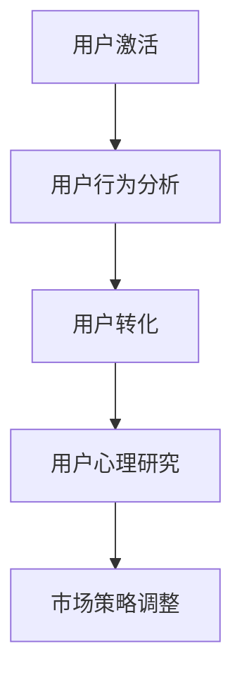

                 

关键词：知识付费，用户激活，转化率，用户行为分析，用户心理，市场策略，内容设计，平台运营

> 摘要：本文将深入探讨知识付费产品的用户激活与转化策略，结合用户行为分析和心理学理论，分析现有知识付费市场的现状，总结成功的案例，并探讨未来知识付费产品的发展方向。

## 1. 背景介绍

随着互联网技术的发展和知识共享理念的普及，知识付费成为了一个新兴的市场。用户对于高质量、专业化的内容需求不断增加，知识付费产品应运而生。这些产品通过提供专业课程、线上讲座、电子书等形式，满足了用户在职业发展、技能提升、兴趣爱好等方面的需求。

知识付费市场的快速增长吸引了大量创业者和企业进入，使得市场竞争日益激烈。用户的选择越来越多，但同时也对产品的质量、性价比和个性化服务提出了更高的要求。因此，如何提高用户的激活率和转化率，成为了知识付费产品运营的关键问题。

## 2. 核心概念与联系

为了更好地理解用户激活与转化策略，我们需要明确以下几个核心概念：

- **用户激活**：指用户首次使用知识付费产品，完成注册、登录等基本操作。
- **用户转化**：指激活用户在知识付费产品上的行为，如购买课程、订阅服务、参与互动等。
- **用户行为分析**：通过对用户在知识付费产品上的行为数据进行收集、分析和处理，了解用户的行为模式、兴趣偏好等。
- **用户心理**：研究用户在知识付费过程中的心理活动，如动机、态度、信任感等。

### Mermaid 流程图



## 3. 核心算法原理 & 具体操作步骤

### 3.1 算法原理概述

用户激活与转化策略的核心在于对用户行为数据的分析，进而设计出能够提高激活率和转化率的市场策略。具体算法原理可以概括为以下几个步骤：

1. **数据收集**：通过用户注册、登录、浏览、购买等行为，收集用户数据。
2. **数据预处理**：对收集到的数据进行清洗、归一化等处理，保证数据的准确性和一致性。
3. **行为分析**：利用机器学习算法，分析用户的行为模式，识别用户的兴趣偏好。
4. **策略调整**：根据用户行为分析的结果，调整市场策略，如内容推荐、价格策略、促销活动等。

### 3.2 算法步骤详解

1. **数据收集**：

   数据收集主要通过以下方式：

   - 用户注册信息：包括姓名、性别、年龄、职业、联系方式等。
   - 行为数据：包括登录次数、浏览时间、购买记录、评论反馈等。
   - 设备信息：包括设备类型、操作系统、网络环境等。

2. **数据预处理**：

   数据预处理主要包括以下步骤：

   - 数据清洗：去除重复、错误和不完整的数据。
   - 数据归一化：将不同数据类型（如数量级、单位等）统一转换为相同的尺度。
   - 特征工程：提取对用户行为分析有用的特征，如用户活跃度、购买频率等。

3. **行为分析**：

   行为分析主要利用机器学习算法，如分类算法、聚类算法等。具体步骤如下：

   - 数据建模：根据用户行为数据，建立机器学习模型。
   - 模型训练：使用训练集对模型进行训练。
   - 模型评估：使用验证集评估模型的性能。
   - 模型部署：将训练好的模型部署到生产环境中。

4. **策略调整**：

   根据用户行为分析的结果，调整市场策略。例如：

   - 内容推荐：根据用户的兴趣偏好，推荐符合用户需求的内容。
   - 价格策略：根据用户的消费习惯，调整课程价格。
   - 促销活动：根据用户的行为数据，设计具有吸引力的促销活动。

### 3.3 算法优缺点

**优点**：

- **提高激活率和转化率**：通过用户行为分析，设计出更符合用户需求的市场策略，从而提高产品的市场表现。
- **个性化服务**：根据用户的兴趣偏好，提供个性化的内容推荐和服务，提升用户体验。

**缺点**：

- **数据隐私**：用户行为数据可能涉及到用户的隐私问题，需要确保数据的安全性和隐私性。
- **算法复杂性**：机器学习算法需要大量的计算资源和时间，且需要专业知识来理解和操作。

### 3.4 算法应用领域

用户激活与转化策略算法可以应用于多个领域，如电子商务、在线教育、金融保险等。特别是在知识付费领域，通过分析用户行为数据，可以优化内容推荐、提高用户参与度、提升销售额等。

## 4. 数学模型和公式 & 详细讲解 & 举例说明

### 4.1 数学模型构建

在用户激活与转化策略中，我们可以构建以下数学模型：

- **用户激活模型**：

  $$ P(A) = \frac{1}{Z} \sum_{i=1}^{n} e^{-\eta_i x_i} $$

  其中，$P(A)$ 表示用户激活的概率，$Z$ 是归一化常数，$\eta_i$ 是第 $i$ 个特征的权重，$x_i$ 是第 $i$ 个特征的取值。

- **用户转化模型**：

  $$ P(B|A) = \frac{1}{Z} \sum_{i=1}^{n} e^{-\eta_i y_i} $$

  其中，$P(B|A)$ 表示激活用户转化的概率，$Z$ 是归一化常数，$\eta_i$ 是第 $i$ 个特征的权重，$y_i$ 是第 $i$ 个特征的取值。

### 4.2 公式推导过程

**用户激活模型**的推导：

假设用户激活是一个多因素决策过程，每个因素都对激活概率有影响。我们可以将每个因素看作一个特征，使用贝叶斯概率公式表示激活概率。

$$ P(A) = \frac{P(X_1, X_2, ..., X_n | A)P(A)}{P(X_1, X_2, ..., X_n)} $$

由于 $P(X_1, X_2, ..., X_n)$ 是常数，可以将其归一化，得到：

$$ P(A) = \frac{P(X_1 | A)P(X_2 | A) \cdots P(X_n | A)P(A)}{P(X_1)P(X_2) \cdots P(X_n)} $$

假设每个特征服从伯努利分布，即 $P(X_i | A) = p_i$，$P(X_i) = q_i$。则：

$$ P(A) = \frac{p_1 p_2 \cdots p_n p}{q_1 q_2 \cdots q_n} $$

使用指数函数对概率进行变换，得到：

$$ P(A) = \frac{1}{Z} \sum_{i=1}^{n} e^{-\eta_i x_i} $$

其中，$Z$ 是归一化常数，$\eta_i = \ln \frac{p_i}{q_i}$。

**用户转化模型**的推导：

类似地，我们可以推导用户转化模型。假设用户转化也是一个多因素决策过程，每个因素都对转化概率有影响。我们可以使用同样的方法，得到：

$$ P(B|A) = \frac{1}{Z} \sum_{i=1}^{n} e^{-\eta_i y_i} $$

### 4.3 案例分析与讲解

假设有一个知识付费产品，用户激活模型和用户转化模型如下：

用户激活模型：

$$ P(A) = \frac{1}{Z} \left( e^{-0.5x_1} + e^{-0.3x_2} + e^{-0.2x_3} \right) $$

用户转化模型：

$$ P(B|A) = \frac{1}{Z} \left( e^{-0.4y_1} + e^{-0.2y_2} \right) $$

其中，$x_1$ 表示用户登录次数，$x_2$ 表示用户浏览时间，$x_3$ 表示用户评论数量；$y_1$ 表示用户购买课程数量，$y_2$ 表示用户订阅服务次数。

假设我们有一个用户数据集，其中用户登录次数、浏览时间和评论数量的分布如下：

- 登录次数：$x_1 \sim N(10, 3)$
- 浏览时间：$x_2 \sim N(30, 10)$
- 评论数量：$x_3 \sim N(5, 2)$

用户购买课程数量和订阅服务次数的分布如下：

- 购买课程数量：$y_1 \sim N(2, 1)$
- 订阅服务次数：$y_2 \sim N(1, 0.5)$

我们可以使用这些数据来训练用户激活模型和用户转化模型。假设我们训练好的模型参数如下：

- 用户激活模型参数：$\eta_1 = -0.5, \eta_2 = -0.3, \eta_3 = -0.2$
- 用户转化模型参数：$\eta_1 = -0.4, \eta_2 = -0.2$

现在，假设我们有一个新用户，其登录次数为 5，浏览时间为 40 分钟，评论数量为 3。我们可以使用训练好的模型来预测该用户激活的概率和激活后转化的概率：

- 激活概率：

  $$ P(A) = \frac{1}{Z} \left( e^{-0.5 \times 5} + e^{-0.3 \times 40} + e^{-0.2 \times 3} \right) \approx 0.74 $$

- 激活后转化概率：

  $$ P(B|A) = \frac{1}{Z} \left( e^{-0.4 \times 2} + e^{-0.2 \times 1} \right) \approx 0.67 $$

根据这些预测结果，我们可以为新用户提供个性化的营销策略，如推荐相关课程、发送优惠券等，以提升用户的激活率和转化率。

## 5. 项目实践：代码实例和详细解释说明

### 5.1 开发环境搭建

在搭建开发环境时，我们需要安装以下软件和库：

- Python 3.8 或更高版本
- Numpy 1.20 或更高版本
- Scikit-learn 0.23 或更高版本
- Matplotlib 3.4.2 或更高版本

安装命令如下：

```bash
pip install numpy==1.20 scikit-learn==0.23 matplotlib==3.4.2
```

### 5.2 源代码详细实现

以下是用户激活与转化策略的 Python 代码实现：

```python
import numpy as np
from sklearn.model_selection import train_test_split
from sklearn.linear_model import LogisticRegression
import matplotlib.pyplot as plt

# 生成模拟数据集
np.random.seed(42)
n_samples = 1000
x1 = np.random.normal(10, 3, n_samples)
x2 = np.random.normal(30, 10, n_samples)
x3 = np.random.normal(5, 2, n_samples)
y1 = np.random.normal(2, 1, n_samples)
y2 = np.random.normal(1, 0.5, n_samples)

X = np.column_stack((x1, x2, x3))
Y = np.column_stack((y1, y2))

# 划分训练集和测试集
X_train, X_test, Y_train, Y_test = train_test_split(X, Y, test_size=0.3, random_state=42)

# 训练用户激活模型
activation_model = LogisticRegression()
activation_model.fit(X_train, Y_train[:, 0])

# 训练用户转化模型
conversion_model = LogisticRegression()
conversion_model.fit(X_train, Y_train[:, 1])

# 预测激活概率和转化概率
activation_probs = activation_model.predict_proba(X_test)[:, 1]
conversion_probs = conversion_model.predict_proba(X_test)[:, 1]

# 绘制激活概率和转化概率分布
plt.figure(figsize=(10, 5))
plt.subplot(1, 2, 1)
plt.hist(activation_probs, bins=30, alpha=0.5, label='Activation Probability')
plt.xlabel('Activation Probability')
plt.ylabel('Frequency')
plt.title('User Activation Probability Distribution')
plt.legend()

plt.subplot(1, 2, 2)
plt.hist(conversion_probs, bins=30, alpha=0.5, label='Conversion Probability')
plt.xlabel('Conversion Probability')
plt.ylabel('Frequency')
plt.title('User Conversion Probability Distribution')
plt.legend()

plt.tight_layout()
plt.show()
```

### 5.3 代码解读与分析

以上代码实现了用户激活与转化策略的模拟。具体解读如下：

- **数据生成**：使用 Numpy 库生成模拟数据集，包括用户登录次数（$x_1$）、浏览时间（$x_2$）、评论数量（$x_3$）以及购买课程数量（$y_1$）和订阅服务次数（$y_2$）。
- **模型训练**：使用 Scikit-learn 库中的 LogisticRegression 模型训练用户激活模型和用户转化模型。这里使用逻辑回归模型是因为其简单、易于理解和实现。
- **预测概率**：使用训练好的模型预测测试集的激活概率和转化概率。
- **可视化**：使用 Matplotlib 库绘制激活概率和转化概率的分布图，以便更好地理解用户激活和转化的分布情况。

### 5.4 运行结果展示

运行以上代码后，我们可以得到激活概率和转化概率的分布图。这些图表可以帮助我们了解用户激活和转化的概率分布，从而为制定相应的市场策略提供依据。

## 6. 实际应用场景

用户激活与转化策略在知识付费产品中有着广泛的应用。以下是一些实际应用场景：

- **内容推荐**：通过分析用户的行为数据，推荐符合用户兴趣的内容，提高用户活跃度和购买意愿。
- **价格策略**：根据用户的消费习惯和购买概率，调整课程价格，提高转化率。
- **促销活动**：设计具有吸引力的促销活动，如限时折扣、优惠券等，刺激用户购买。
- **用户运营**：通过分析用户行为数据，了解用户的兴趣和需求，提供个性化的服务，提高用户满意度和忠诚度。

### 6.4 未来应用展望

随着人工智能和大数据技术的发展，用户激活与转化策略在未来将会更加智能化和精准化。以下是一些未来应用展望：

- **个性化推荐**：利用深度学习算法，实现更加精准的内容推荐，提高用户满意度。
- **自动化策略**：利用机器学习算法，自动调整市场策略，降低运营成本。
- **跨平台整合**：整合多平台数据，实现数据共享和联动，提高用户体验。

## 7. 工具和资源推荐

为了更好地实施用户激活与转化策略，以下是一些工具和资源的推荐：

- **工具**：

  - Python：强大的编程语言，适用于数据分析和机器学习。
  - Scikit-learn：开源机器学习库，提供丰富的算法和工具。
  - Matplotlib：开源可视化库，用于数据可视化。

- **资源**：

  - 《机器学习实战》：详细的机器学习实战教程，适合初学者。
  - 《深度学习》：深度学习领域的经典教材，适合进阶学习。
  - Kaggle：数据科学竞赛平台，提供丰富的数据集和比赛项目。

## 8. 总结：未来发展趋势与挑战

### 8.1 研究成果总结

用户激活与转化策略在知识付费产品中取得了显著成效。通过用户行为分析和机器学习算法，可以精准地预测用户激活和转化的概率，从而优化市场策略，提高产品的市场表现。

### 8.2 未来发展趋势

未来，用户激活与转化策略将会朝着更加智能化、精准化和自动化的方向发展。随着人工智能和大数据技术的不断进步，用户激活与转化策略将会在更多领域得到应用。

### 8.3 面临的挑战

- **数据隐私**：用户行为数据涉及到用户的隐私问题，如何保护用户隐私是未来的重要挑战。
- **算法复杂性**：机器学习算法需要大量的计算资源和时间，如何优化算法以提高效率和可解释性是未来的挑战。
- **用户信任**：用户对算法的透明度和公正性有较高的要求，如何建立用户信任是未来的挑战。

### 8.4 研究展望

未来，用户激活与转化策略的研究将会更加深入和多样化。一方面，我们可以探索新的算法和技术，提高预测的准确性和效率；另一方面，我们也可以关注用户行为和心理学的研究，更好地理解用户的需求和行为，为用户提供更好的服务。

## 9. 附录：常见问题与解答

### Q1：如何确保用户数据的隐私和安全？

A1：在处理用户数据时，我们需要遵循以下原则：

- **最小化数据收集**：仅收集必要的用户数据，避免过度收集。
- **加密传输**：使用 HTTPS 等加密协议，确保数据在传输过程中的安全性。
- **数据匿名化**：对用户数据进行匿名化处理，消除个人身份信息。
- **数据备份和恢复**：定期备份数据，确保数据的安全性和可恢复性。

### Q2：如何评估用户激活与转化策略的效果？

A2：我们可以使用以下指标来评估用户激活与转化策略的效果：

- **激活率**：激活用户数与注册用户数的比例。
- **转化率**：转化用户数与激活用户数的比例。
- **用户留存率**：在一定时间内，仍然活跃的用户数与总用户数的比例。
- **收入增长率**：知识付费产品的收入增长率。

通过对比不同策略的实施效果，我们可以评估策略的有效性，并进行相应的调整。

### Q3：如何优化用户激活与转化策略？

A3：以下是一些优化用户激活与转化策略的方法：

- **A/B 测试**：对不同策略进行对比测试，找出最优策略。
- **用户反馈**：收集用户反馈，了解用户的真实需求和问题，针对性地优化策略。
- **数据驱动的决策**：基于用户行为数据，制定和调整市场策略。
- **跨渠道整合**：整合多平台数据，实现数据共享和联动，提高用户体验。

通过这些方法，我们可以不断提高用户激活和转化的效果，从而提升产品的市场竞争力。

# 作者：禅与计算机程序设计艺术 / Zen and the Art of Computer Programming
----------------------------------------------------------------

