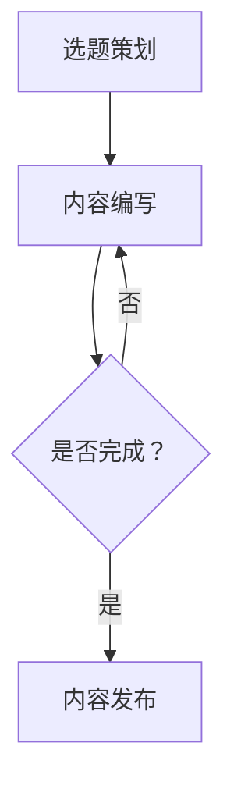

                 

  
关键词：知识付费、内容生产、效率提升、人工智能、算法优化、技术工具、案例研究

摘要：本文将探讨知识付费创业者在内容生产过程中如何提升生产效率。通过分析现有问题、介绍核心算法原理和具体操作步骤，以及提供项目实践和实际应用场景，文章旨在为知识付费创业者提供切实可行的技术解决方案，助力其在激烈的市场竞争中脱颖而出。

## 1. 背景介绍

随着互联网的快速发展，知识付费市场呈现出爆炸式增长。越来越多的创业者投身于知识付费领域，希望通过高质量的内容生产吸引并留住用户。然而，内容生产的效率问题成为制约创业团队发展的瓶颈。生产内容需要耗费大量的时间和精力，而且内容的质量和数量往往难以平衡。

### 1.1 现有挑战

- **内容质量参差不齐**：创作者水平不一，导致内容质量难以保证。
- **内容生产周期长**：从选题到内容发布往往需要较长时间。
- **用户需求多变**：用户需求变化快，内容更新速度跟不上。

### 1.2 目标

- 提升内容生产效率：在保证内容质量的前提下，缩短生产周期。
- 满足用户需求：快速响应用户需求，提高用户满意度。

## 2. 核心概念与联系

为了提升内容生产效率，我们需要关注以下几个核心概念：

### 2.1 人工智能

人工智能技术在内容生产中的应用主要包括自然语言处理（NLP）和机器学习。通过这些技术，我们可以实现自动化内容生成、内容推荐和用户需求分析。

### 2.2 算法优化

算法优化是指通过改进算法结构和参数设置，提高算法的执行效率和准确性。在内容生产中，算法优化可以帮助我们更快地生成高质量的内容。

### 2.3 技术工具

技术工具如内容管理系统（CMS）、自动化写作工具等，可以大大提高内容生产的效率。此外，一些开源框架和库也可以帮助我们快速搭建内容生产平台。

### 2.4 Mermaid 流程图

以下是一个简单的 Mermaid 流程图，描述了内容生产流程中的关键环节：



## 3. 核心算法原理 & 具体操作步骤

### 3.1 自动化写作工具

自动化写作工具如GPT-3，通过训练大量文本数据，可以生成高质量的文章。以下是使用自动化写作工具的具体步骤：

1. 数据收集：收集与主题相关的文本数据。
2. 数据预处理：对文本数据进行分析和处理，去除无关信息。
3. 模型训练：使用预处理后的数据训练模型。
4. 文本生成：输入主题关键词，模型生成文章。

### 3.2 自然语言处理（NLP）

NLP 技术可以帮助我们分析用户需求，提供个性化的内容推荐。以下是 NLP 技术的具体应用步骤：

1. 用户行为分析：收集用户浏览、搜索、购买等行为数据。
2. 数据预处理：对用户行为数据进行清洗和处理。
3. 用户需求识别：使用 NLP 算法分析用户行为数据，识别用户需求。
4. 内容推荐：根据用户需求推荐相关内容。

### 3.3 机器学习

机器学习技术可以帮助我们预测内容趋势，优化内容生产策略。以下是机器学习技术的具体应用步骤：

1. 数据收集：收集历史内容数据。
2. 数据预处理：对历史内容数据进行清洗和处理。
3. 模型训练：使用预处理后的数据训练模型。
4. 预测分析：输入当前内容数据，模型预测未来趋势。
5. 内容优化：根据预测结果调整内容生产策略。

## 4. 数学模型和公式 & 详细讲解 & 举例说明

### 4.1 模型评估指标

在内容生产中，常用的模型评估指标包括准确率（Accuracy）、精确率（Precision）、召回率（Recall）和 F1 分数（F1 Score）。以下是这些指标的计算公式：

$$
Accuracy = \frac{TP + TN}{TP + FN + FP + TN}
$$

$$
Precision = \frac{TP}{TP + FP}
$$

$$
Recall = \frac{TP}{TP + FN}
$$

$$
F1 Score = 2 \times \frac{Precision \times Recall}{Precision + Recall}
$$

举例说明：

假设一个推荐系统有100个用户，其中70个用户点击了推荐内容，60个用户对推荐内容感兴趣。计算该系统的准确率、精确率和召回率。

准确率：

$$
Accuracy = \frac{60 + 40}{100} = 0.8
$$

精确率：

$$
Precision = \frac{60}{70} = 0.857
$$

召回率：

$$
Recall = \frac{60}{100} = 0.6
$$

F1 分数：

$$
F1 Score = 2 \times \frac{0.857 \times 0.6}{0.857 + 0.6} = 0.714
$$

### 4.2 模型优化策略

为了提高模型性能，我们可以使用以下优化策略：

1. **数据增强**：通过增加训练数据量，提高模型泛化能力。
2. **正则化**：使用正则化方法，防止模型过拟合。
3. **参数调优**：通过调整模型参数，优化模型性能。

## 5. 项目实践：代码实例和详细解释说明

### 5.1 自动化写作工具应用

以下是一个使用 GPT-3 自动生成文章的简单示例：

```python
import openai

openai.api_key = "your-api-key"

prompt = "人工智能在知识付费领域的应用"
response = openai.Completion.create(
  engine="davinci",
  prompt=prompt,
  max_tokens=500
)

print(response.choices[0].text.strip())
```

此代码通过调用 OpenAI 的 GPT-3 API，输入一个主题关键词，生成一篇关于该主题的文章。

### 5.2 NLP 应用

以下是一个使用 NLTK 库进行文本分类的示例：

```python
import nltk
from nltk.corpus import movie_reviews
from nltk.classify import NaiveBayesClassifier

nltk.download('movie_reviews')

def extract_features(word_list):
    return dict([(word, True) for word in word_list])

def train_classifier():
    fileids_pos = movie_reviews.fileids('pos')
    fileids_neg = movie_reviews.fileids('neg')

    features_pos = [(extract_features(movie_reviews.words(file)), 'positive') for file in fileids_pos]
    features_neg = [(extract_features(movie_reviews.words(file)), 'negative') for file in fileids_neg]

    threshold = 0.8

    classifier = NaiveBayesClassifier.train(features_pos + features_neg)
    return classifier

classifier = train_classifier()
print(classifier.show_most_informative_features(10))
```

此代码使用 NLTK 的电影评论数据集，训练一个基于朴素贝叶斯分类器的文本分类器，并输出10个最有影响力的特征词。

## 6. 实际应用场景

### 6.1 在线教育平台

在线教育平台可以通过人工智能技术，实现个性化课程推荐和自动化内容生成。例如，平台可以根据学生的学习行为和兴趣，推荐最适合的课程内容；同时，使用自动化写作工具生成课程笔记和复习资料。

### 6.2 专业咨询公司

专业咨询公司可以利用人工智能技术，提高报告生成效率和内容质量。例如，通过自动化写作工具，快速生成报告草稿；使用 NLP 技术分析行业报告，提取关键信息。

### 6.3 企业内训

企业内训可以通过人工智能技术，实现个性化培训方案和高效的内容生产。例如，分析员工的学习数据，推荐适合的培训课程；使用自动化写作工具生成培训资料和课程笔记。

## 7. 工具和资源推荐

### 7.1 自动化写作工具

- **OpenAI GPT-3**：强大的自动化写作工具，支持多种编程语言接口。
- **Hugging Face Transformers**：开源的自动写作工具，支持多种预训练模型。

### 7.2 NLP 工具

- **NLTK**：经典的自然语言处理库，适用于文本分类、情感分析等任务。
- **spaCy**：高效的自然语言处理库，支持多种语言。

### 7.3 机器学习框架

- **TensorFlow**：谷歌开发的机器学习框架，支持多种机器学习模型。
- **PyTorch**：热门的机器学习框架，易于使用和调试。

## 8. 总结：未来发展趋势与挑战

### 8.1 发展趋势

- **人工智能技术的深入应用**：随着人工智能技术的不断进步，内容生产效率将进一步提高。
- **大数据的挖掘与利用**：通过对大数据的深入挖掘，为内容生产提供更多有价值的信息。
- **云计算与边缘计算的结合**：云计算和边缘计算的结合，将为内容生产提供更强大的计算能力和更低的延迟。

### 8.2 挑战

- **数据隐私与安全**：随着内容生产过程中数据的增加，数据隐私和安全问题日益凸显。
- **算法公平性与透明性**：确保算法的公平性和透明性，防止算法偏见和歧视。
- **人才缺口**：随着人工智能技术的发展，对相关领域人才的需求日益增加，但人才缺口问题仍然存在。

## 9. 附录：常见问题与解答

### 9.1 问题1

**问题**：如何保证自动化写作工具生成的内容质量？

**解答**：确保自动化写作工具生成的内容质量，可以从以下几个方面入手：

1. **高质量的数据集**：使用高质量的文本数据集进行训练，提高模型的写作能力。
2. **人类审核**：在生成内容后，进行人类审核，确保内容符合预期。
3. **持续优化**：不断优化模型结构和参数，提高模型生成内容的质量。

### 9.2 问题2

**问题**：如何选择合适的自然语言处理（NLP）工具？

**解答**：选择合适的 NLP 工具，可以从以下几个方面考虑：

1. **任务需求**：根据实际任务需求，选择适合的 NLP 工具。
2. **性能表现**：比较不同 NLP 工具的性能表现，选择效果最好的工具。
3. **社区支持**：选择具有良好社区支持的 NLP 工具，便于解决问题和获取帮助。

## 10. 扩展阅读 & 参考资料

- **《自然语言处理综论》**：李航 著
- **《机器学习实战》**：Peter Harrington 著
- **《深度学习》**：Ian Goodfellow、Yoshua Bengio 和 Aaron Courville 著
- **《知识付费行业报告》**：艾瑞咨询

### 结论

本文介绍了知识付费创业者在内容生产过程中如何提升生产效率的方法。通过人工智能技术、算法优化和工具推荐，创业者可以大大提高内容生产效率，更好地满足用户需求。在未来的发展中，人工智能技术将继续为知识付费领域带来变革，创业者应积极拥抱新技术，应对挑战，抓住机遇。作者：禅与计算机程序设计艺术 / Zen and the Art of Computer Programming
```

