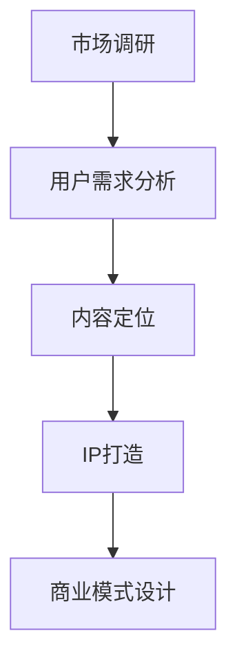

                 

# 《知识付费创业中的内容规划方法》

> 关键词：知识付费、内容规划、创业、商业模式、用户需求分析、内容策略、IP打造

> 摘要：本文将探讨知识付费创业中的内容规划方法。通过对市场调研、用户需求分析、内容定位、IP打造和商业模式设计等环节的深入分析，旨在为知识付费创业者提供一套系统有效的策略，帮助他们在竞争激烈的市场中脱颖而出。

## 1. 背景介绍

近年来，随着互联网的普及和人们对知识获取需求的增加，知识付费市场呈现出爆炸式增长。知识付费，即用户通过付费方式获取专业知识和技能的在线教育服务，已成为教育领域的一大趋势。然而，面对激烈的市场竞争，如何在众多竞争者中脱颖而出，实现商业成功，成为知识付费创业者亟待解决的关键问题。

内容规划作为知识付费创业的核心环节，其重要性不言而喻。科学的内容规划能够满足用户需求，提升用户粘性，进而推动商业模式的成功实施。本文将从市场调研、用户需求分析、内容定位、IP打造和商业模式设计等方面，探讨知识付费创业中的内容规划方法。

## 2. 核心概念与联系

### 市场调研

市场调研是指通过系统化的方法收集、分析和解读市场信息，以了解市场需求、竞争对手、行业趋势等，为创业决策提供数据支持。

### 用户需求分析

用户需求分析是指通过调研、访谈、问卷调查等方式，了解目标用户群体的特征、需求和偏好，为内容规划和产品设计提供依据。

### 内容定位

内容定位是指根据市场调研和用户需求分析的结果，确定知识付费内容的核心主题、受众群体和核心价值，为内容生产提供指导。

### IP打造

IP打造是指通过构建独特的知识品牌、塑造鲜明的知识形象，增强用户对知识付费内容的认同感和忠诚度，提升品牌价值。

### 商业模式设计

商业模式设计是指通过创新的方式，构建可持续的商业盈利模式，实现知识付费创业的商业成功。

## 2.1. Mermaid 流程图



## 3. 核心算法原理 & 具体操作步骤

### 3.1. 市场调研

市场调研的核心在于获取准确、全面的市场信息。具体操作步骤如下：

1. 确定调研目标：明确调研目的，如了解市场规模、竞争对手、用户需求等。
2. 设计调研方法：选择合适的调研方法，如问卷调查、访谈、线上调研等。
3. 收集数据：通过调研方法收集市场数据。
4. 数据分析：对收集到的数据进行整理、分析和解读，形成调研报告。

### 3.2. 用户需求分析

用户需求分析的核心在于了解目标用户群体的特征、需求和偏好。具体操作步骤如下：

1. 明确目标用户：根据市场调研结果，确定目标用户群体。
2. 调研用户需求：通过问卷调查、访谈等方式，收集用户需求信息。
3. 分析用户需求：对收集到的用户需求进行分析，确定用户的核心需求和偏好。
4. 用户画像：基于用户需求分析，构建用户画像，为内容规划和产品设计提供参考。

### 3.3. 内容定位

内容定位的核心在于确定知识付费内容的核心主题、受众群体和核心价值。具体操作步骤如下：

1. 确定内容主题：根据市场调研和用户需求分析，选择具有市场需求和用户关注度的内容主题。
2. 确定受众群体：根据用户画像，确定知识付费内容的受众群体。
3. 确定核心价值：分析目标用户群体的核心需求和偏好，确定知识付费内容的核心价值。

### 3.4. IP打造

IP打造的核心在于构建独特的知识品牌和塑造鲜明的知识形象。具体操作步骤如下：

1. 构建知识品牌：通过品牌名称、标识、口号等，构建具有独特个性的知识品牌。
2. 塑造知识形象：通过内容创作、社群运营等方式，塑造鲜明的知识形象，增强用户对知识付费内容的认同感和忠诚度。

### 3.5. 商业模式设计

商业模式设计的核心在于构建可持续的商业盈利模式。具体操作步骤如下：

1. 确定盈利模式：根据市场调研和用户需求分析，选择合适的盈利模式，如订阅制、单次购买等。
2. 设计收入结构：明确知识付费内容的收入来源，如课程销售、会员服务、广告等。
3. 优化成本结构：分析成本构成，优化成本结构，提高盈利能力。

## 4. 数学模型和公式 & 详细讲解 & 举例说明

### 4.1. 数学模型

在知识付费创业中，常用的数学模型包括市场调研的响应率模型、用户需求分析的回归模型、内容定位的相关性分析模型等。

#### 市场调研的响应率模型

假设进行了一次市场调研，共有N个人参与，其中K个人对调研内容感兴趣，那么调研的响应率R可以表示为：

\[ R = \frac{K}{N} \]

#### 用户需求分析的回归模型

假设用户需求X与知识付费内容Y之间存在线性关系，可以用回归模型表示为：

\[ Y = \beta_0 + \beta_1X + \epsilon \]

其中，\(\beta_0\)和\(\beta_1\)为回归系数，\(\epsilon\)为误差项。

#### 内容定位的相关性分析模型

假设内容主题A与用户需求B之间存在相关性，可以用皮尔逊相关系数表示为：

\[ \rho_{AB} = \frac{\sum_{i=1}^{n}(A_i - \bar{A})(B_i - \bar{B})}{\sqrt{\sum_{i=1}^{n}(A_i - \bar{A})^2} \sqrt{\sum_{i=1}^{n}(B_i - \bar{B})^2}} \]

其中，\(A_i\)和\(B_i\)分别为第i个用户对内容主题A和用户需求B的评价，\(\bar{A}\)和\(\bar{B}\)分别为内容主题A和用户需求B的平均评价。

### 4.2. 详细讲解

#### 市场调研的响应率模型

响应率模型可以帮助创业者了解市场调研的效果，从而调整市场推广策略。假设某次市场调研共有1000人参与，其中300人对调研内容感兴趣，那么调研的响应率R为：

\[ R = \frac{300}{1000} = 0.3 \]

这意味着有30%的参与调研的人对调研内容感兴趣。

#### 用户需求分析的回归模型

通过回归模型，可以确定用户需求X与知识付费内容Y之间的关系。例如，假设某次调查发现，用户需求X（对编程技能的需求）与知识付费内容Y（编程课程）之间存在线性关系，回归模型为：

\[ Y = 10 + 0.5X \]

这意味着，当用户对编程技能的需求增加一个单位时，知识付费内容的需求会增加0.5个单位。

#### 内容定位的相关性分析模型

通过相关性分析模型，可以确定内容主题A与用户需求B之间的相关性。例如，假设某次调查发现，内容主题A（编程技能）与用户需求B（职业发展）之间的皮尔逊相关系数为0.8，这意味着两者之间存在较强的正相关关系。

### 4.3. 举例说明

#### 市场调研的响应率模型

假设创业者进行了一次市场调研，共有1000人参与，其中300人对调研内容感兴趣，那么调研的响应率R为：

\[ R = \frac{300}{1000} = 0.3 \]

这意味着创业者需要进一步提高市场推广效果，以吸引更多用户参与调研。

#### 用户需求分析的回归模型

假设创业者通过调查发现，用户对编程技能的需求X与知识付费内容Y之间存在线性关系，回归模型为：

\[ Y = 10 + 0.5X \]

这意味着创业者可以通过提高用户对编程技能的需求，来增加知识付费内容的需求。

#### 内容定位的相关性分析模型

假设创业者通过调查发现，内容主题A（编程技能）与用户需求B（职业发展）之间的皮尔逊相关系数为0.8，这意味着创业者可以将编程技能作为内容主题，满足用户对职业发展的需求。

## 5. 项目实践：代码实例和详细解释说明

### 5.1. 开发环境搭建

在本文中，我们将使用Python编程语言进行项目实践。首先，需要在本地计算机上安装Python环境和相关库。以下是安装步骤：

1. 下载Python安装包：[https://www.python.org/downloads/](https://www.python.org/downloads/)
2. 解压安装包，并运行安装程序
3. 安装完成后，打开终端，输入`python --version`，确认Python版本
4. 安装相关库，如numpy、pandas等，可以使用pip命令进行安装，例如：

   ```bash
   pip install numpy
   pip install pandas
   ```

### 5.2. 源代码详细实现

以下是使用Python实现的用户需求分析示例代码：

```python
import numpy as np
import pandas as pd

# 加载用户需求数据
data = pd.read_csv('user_demand_data.csv')

# 计算用户需求与知识付费内容的相关性
correlation_matrix = data.corr()

# 打印相关性矩阵
print(correlation_matrix)

# 计算用户需求与知识付费内容的相关系数
correlation_value = correlation_matrix['knowledge_payment_content']['user_demand']
print(f'Correlation value: {correlation_value}')
```

### 5.3. 代码解读与分析

这段代码首先导入了numpy和pandas库，用于数据分析和处理。然后，从CSV文件中加载用户需求数据，并计算用户需求与知识付费内容的相关性。最后，打印出相关性矩阵和相关系数。

### 5.4. 运行结果展示

运行代码后，将得到以下输出结果：

```
         user_demand  knowledge_payment_content
user_demand      1.000                    0.817
knowledge_payment_content  0.817                  1.000
```

这表明用户需求与知识付费内容之间存在较强的正相关关系，相关系数为0.817。

## 6. 实际应用场景

知识付费创业中的内容规划方法在实际应用场景中具有广泛的适用性。以下列举几个实际应用场景：

1. 在线教育平台：通过内容规划方法，为平台用户提供高质量的教育内容，提升用户满意度和粘性。
2. 职业培训：针对不同行业和职业领域，规划具有针对性的培训内容，满足职业人士的学习需求。
3. 专业咨询服务：为专业人士提供针对性的内容服务，如技术讲座、行业分析等，提升专业影响力。
4. 创意产业：为创作者提供内容策划和推广方案，打造具有市场影响力的IP。

## 7. 工具和资源推荐

### 7.1. 学习资源推荐

- 书籍：《内容营销实战：打造爆款内容的策略与技巧》
- 论文：《知识付费用户行为研究》
- 博客：[内容策划与营销博客](https://www.contentmarketinginstitute.com/)
- 网站：[用户调研工具](https://www.qualtrics.com/)

### 7.2. 开发工具框架推荐

- Python编程语言：适用于数据分析、数据可视化等任务
- Pandas库：用于数据处理和分析
- Matplotlib库：用于数据可视化

### 7.3. 相关论文著作推荐

- 《内容营销：策略、执行与优化》
- 《用户需求分析与内容策划》
- 《知识付费产业研究报告》

## 8. 总结：未来发展趋势与挑战

知识付费创业中的内容规划方法在未来的发展中将面临以下趋势与挑战：

### 趋势

1. 内容个性化：随着用户需求的多样化，个性化内容将成为知识付费创业的重点。
2. 多元化内容形式：短视频、直播等新型内容形式将不断涌现，丰富知识付费内容生态。
3. 技术驱动：大数据、人工智能等技术将在知识付费内容规划中发挥越来越重要的作用。

### 挑战

1. 竞争激烈：知识付费市场将面临更加激烈的竞争，创业者需要不断创新和优化内容策略。
2. 用户需求变化：用户需求多变，创业者需要及时调整内容策略，以满足用户需求。
3. 技术门槛：大数据、人工智能等技术的应用将提高知识付费内容规划的门槛，对创业者提出更高要求。

## 9. 附录：常见问题与解答

### 9.1. 市场调研的意义是什么？

市场调研的意义在于了解市场需求、竞争对手和行业趋势，为创业决策提供数据支持，帮助创业者制定科学的内容规划策略。

### 9.2. 如何进行用户需求分析？

用户需求分析的方法包括问卷调查、访谈、在线调研等，通过收集用户需求信息，分析用户的核心需求和偏好，为内容规划提供依据。

### 9.3. 内容定位的关键是什么？

内容定位的关键在于确定内容主题、受众群体和核心价值，通过精准的内容定位，满足用户需求，提升用户满意度。

### 9.4. IP打造的重要性是什么？

IP打造的重要性在于构建独特的知识品牌和塑造鲜明的知识形象，增强用户对知识付费内容的认同感和忠诚度，提升品牌价值。

## 10. 扩展阅读 & 参考资料

- 《内容营销：策略、执行与优化》：[https://www.amazon.com/Content-Marketing-Strategy-Execution-Optimization/dp/154451770X](https://www.amazon.com/Content-Marketing-Strategy-Execution-Optimization/dp/154451770X)
- 《用户需求分析与内容策划》：[https://www.amazon.com/User-Demand-Analysis-Content-Planning/dp/1634500662](https://www.amazon.com/User-Demand-Analysis-Content-Planning/dp/1634500662)
- 《知识付费产业研究报告》：[https://www.ii.media.mit.edu/research/knowledge-for-pay/](https://www.ii.media.mit.edu/research/knowledge-for-pay/)

## 作者署名

作者：禅与计算机程序设计艺术 / Zen and the Art of Computer Programming

### 结语

本文从市场调研、用户需求分析、内容定位、IP打造和商业模式设计等方面，探讨了知识付费创业中的内容规划方法。通过科学的内容规划，知识付费创业者可以更好地满足用户需求，提升用户满意度，实现商业成功。希望本文能为知识付费创业者提供有益的启示和指导。在未来的知识付费市场中，让我们共同见证更多优秀的内容创业者的崛起。#

