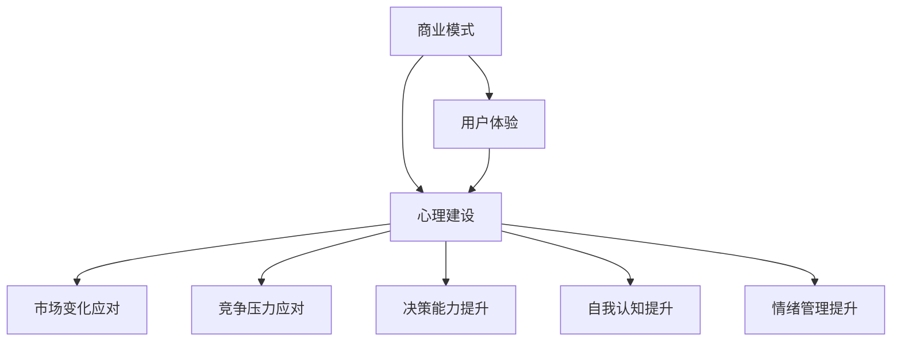

                 

### 背景介绍

在当今数字化时代，知识付费作为一种新型的商业模式，正在迅速崛起。知识付费平台如雨后春笋般涌现，为用户提供了丰富的知识资源和学习机会。然而，在这片繁荣的背后，创业者面临着诸多挑战，其中之一便是心理建设。

知识付费创业不仅仅是技术和商业模式的选择，更涉及到心理层面的调整和应对。创业者需要面对市场的变化、用户的需求波动以及竞争压力，这些因素都会对他们的心理产生不同程度的影响。因此，如何在知识付费创业过程中保持良好的心理状态，成为了创业者成功的关键因素之一。

本文将围绕知识付费创业中的心理建设进行探讨，旨在为创业者提供一些实用的策略和方法，帮助他们更好地应对创业过程中的挑战。文章将从以下几个方面展开：

1. **心理建设的重要性**：分析心理建设在知识付费创业中的作用，以及为何它是创业者成功的关键。
2. **常见的心理挑战**：列举知识付费创业过程中常见的心理问题，如焦虑、自我怀疑、挫折感等。
3. **心理建设策略**：提供一系列心理建设的方法和技巧，帮助创业者调整心态，提升抗压能力。
4. **成功案例分析**：通过真实案例，展示成功创业者如何通过心理建设实现创业目标。
5. **总结与展望**：总结文章的主要观点，并对未来的发展趋势和挑战进行展望。

通过以上内容的逐步分析，我们希望能够为知识付费创业者提供有益的指导，帮助他们克服心理障碍，走向成功。

### 核心概念与联系

在探讨知识付费创业中的心理建设之前，我们需要明确几个核心概念，以便更好地理解这一主题。

首先，知识付费创业涉及到的两个主要方面是**商业模式**和**用户体验**。商业模式决定了知识付费平台的盈利模式和运营策略，而用户体验则决定了用户对平台的满意度和忠诚度。这两个方面相互关联，共同影响着平台的成功与否。

其次，**心理建设**在创业过程中的重要性不容忽视。心理建设不仅仅是为了应对压力和挑战，更是为了提升创业者的整体心理素质，包括自我认知、情绪管理和决策能力等。良好的心理建设能够帮助创业者保持积极的心态，更好地应对市场变化和竞争压力。

接下来，我们可以使用Mermaid流程图来展示知识付费创业的核心概念及其相互关系。以下是流程图的具体内容：



- **商业模式（A）**：知识付费创业的商业模式包括收入来源、用户付费模式、内容生产方式等。它直接影响平台的盈利能力和市场竞争力。
- **用户体验（B）**：用户体验是指用户在使用知识付费平台时得到的整体感受，包括内容质量、界面设计、服务响应等。良好的用户体验能够提升用户满意度和忠诚度。
- **心理建设（C）**：心理建设是创业过程中不可或缺的一部分，它涵盖了自我认知、情绪管理、决策能力等多个方面，对创业者的整体心理素质有重要影响。
- **市场变化应对（D）**：市场变化是知识付费创业者需要不断面对的现实，良好的心理建设能够帮助创业者更好地应对市场变化，做出灵活的调整。
- **竞争压力应对（E）**：竞争压力是创业者普遍面临的问题，心理建设能够帮助创业者保持冷静，提升抗压能力，从而在竞争中脱颖而出。
- **决策能力提升（F）**：决策能力是创业者成功的关键之一，心理建设能够提升创业者的决策能力，使其在面对复杂情况时能够做出明智的选择。
- **自我认知提升（G）**：自我认知是心理建设的一个重要方面，通过提升自我认知，创业者能够更好地了解自己的优势和不足，从而更好地规划创业道路。
- **情绪管理提升（H）**：情绪管理是创业者需要掌握的重要技能，良好的情绪管理能够帮助创业者保持积极的心态，避免因情绪波动而影响决策。

通过以上核心概念的阐述和Mermaid流程图的展示，我们可以更清晰地理解知识付费创业中的心理建设是如何与商业模式、用户体验以及创业者自身素质相互联系和作用的。接下来，我们将深入探讨这些核心概念的具体内容及其在创业过程中的实际应用。

### 核心算法原理 & 具体操作步骤

在知识付费创业中，心理建设不仅是一个抽象的概念，而是一系列具体可行的方法和步骤。以下我们将介绍几个核心算法原理，以及如何在创业过程中具体应用这些步骤。

#### 1. 自我认知算法

**原理**：自我认知是心理建设的基础，它帮助创业者了解自己的优势、劣势以及兴趣所在。通过自我认知，创业者能够更加清晰地设定目标和制定策略。

**步骤**：

- **步骤1：自我反思**：创业者需要花时间进行自我反思，思考自己在创业过程中的表现、感受和收获。这可以通过写日记或与他人交流来实现。
- **步骤2：能力评估**：对自身的技能、知识和经验进行评估，明确自己的优势和劣势。可以使用一些评估工具，如技能矩阵或SWOT分析。
- **步骤3：设定目标**：根据自我认知的结果，设定短期和长期目标。目标应该具体、可衡量，并具有实际操作性。

**示例**：假设一位创业者通过自我反思发现自己在市场营销方面有优势，但在技术实现方面较弱。那么，他可以设定短期目标为提高技术实现能力，长期目标为拓展市场并建立品牌。

#### 2. 情绪管理算法

**原理**：情绪管理是应对压力和挫折的关键。通过情绪管理，创业者能够保持冷静，做出理性的决策。

**步骤**：

- **步骤1：识别情绪**：学会识别和理解自己的情绪，如焦虑、愤怒、兴奋等。这可以通过情绪日记或情绪地图来实现。
- **步骤2：调整情绪**：通过深呼吸、冥想或运动等方式，调整情绪至较为平静的状态。可以使用一些情绪调节技巧，如认知重构或正念练习。
- **步骤3：应对策略**：制定具体的应对策略，如与朋友交流、寻求专业咨询或调整工作计划。

**示例**：当创业者感到焦虑时，可以采用深呼吸法来放松，并通过与朋友交流来寻求支持和建议。

#### 3. 决策能力提升算法

**原理**：提升决策能力有助于创业者更好地应对各种挑战，做出明智的选择。

**步骤**：

- **步骤1：收集信息**：在做出决策前，收集与决策相关的各种信息，包括市场数据、用户反馈、行业动态等。
- **步骤2：分析信息**：对收集到的信息进行深入分析，识别关键因素和潜在风险。
- **步骤3：制定方案**：基于分析结果，制定多种可能的解决方案，并评估每种方案的优缺点。
- **步骤4：选择最优方案**：结合自身经验和直觉，选择最优方案并实施。

**示例**：在决定是否拓展新市场时，创业者可以收集该市场的数据，分析市场需求和竞争情况，制定多种拓展方案，并选择最合适的方案进行实施。

#### 4. 应对市场变化算法

**原理**：市场变化是知识付费创业中不可避免的现象。通过应对市场变化算法，创业者能够迅速调整策略，保持竞争力。

**步骤**：

- **步骤1：监控市场**：持续监控市场动态，包括用户需求、行业趋势和竞争对手的行动。
- **步骤2：快速响应**：根据市场变化，快速调整产品和服务的策略。这可以通过定期举行策略会议或设立专门的市场研究团队来实现。
- **步骤3：评估效果**：对调整后的策略进行评估，确定其效果并进行进一步优化。

**示例**：当市场趋势显示用户对某个领域的内容需求增加时，创业者可以迅速调整内容策略，增加该领域的内容生产，以满足用户需求。

通过以上核心算法原理和具体操作步骤的介绍，我们可以看到心理建设在知识付费创业中是如何通过一系列具体方法来发挥作用的。接下来，我们将进一步探讨数学模型和公式，以便更深入地理解心理建设的过程。

### 数学模型和公式 & 详细讲解 & 举例说明

在心理建设的过程中，数学模型和公式为我们提供了一种量化和分析的方法。以下我们将介绍几个关键的数学模型和公式，并结合实际案例进行详细讲解。

#### 1. 自我效能感（Self-Efficacy）

**定义**：自我效能感是指一个人对自己完成特定任务的能力的信心程度。它在心理建设中起着至关重要的作用。

**公式**：自我效能感（SE） = （成功经验 + 替代性经验 + 语言说服 + 身体状态）÷ （失败经验 + 情绪干扰）

**详细讲解**：

- **成功经验**：过去的成功经验能够增强自我效能感。例如，一位创业者曾在市场推广中取得成功，这会提高他对未来市场推广的信心。
- **替代性经验**：通过观察他人成功或失败的经验，创业者可以借鉴其中的经验教训，提升自我效能感。
- **语言说服**：他人的正面鼓励和认可能够提升创业者的自我效能感。例如，团队成员或导师的肯定性反馈。
- **失败经验**：适度的失败可以提升创业者的韧性，使其在未来的挑战中更有信心。但过度的失败会导致自我效能感的降低。
- **情绪干扰**：情绪波动，如焦虑和恐惧，会干扰自我效能感。通过情绪管理技巧，如冥想和深呼吸，创业者可以减少情绪干扰。

**举例说明**：

假设一位创业者（A）在过去一年中成功推出了两个产品（成功经验），同时他从朋友（B）和导师（C）那里获得了积极的反馈（语言说服）。然而，他曾经遇到过一次市场推广失败（失败经验），并且近期因为产品性能问题感到焦虑（情绪干扰）。根据公式，他的自我效能感SE = （2 + 1 + 1 - 1 - 1）÷ 2 = 1。

这个结果表明，A的当前自我效能感相对较低，他需要通过增加成功经验、替代性经验以及情绪管理来提升自我效能感。

#### 2. 应对策略选择模型

**定义**：在面临多种策略选择时，应对策略选择模型帮助创业者选择最有效的策略。

**公式**：U = w1*S1 + w2*S2 + ... + wn*Sn

其中，U是总效用，w1, w2, ..., wn是权重，S1, S2, ..., Sn是各种策略的得分。

**详细讲解**：

- **权重（w）**：权重反映了创业者对各种策略的重视程度。例如，如果创业者认为市场推广的重要性高于产品研发，那么市场推广的权重会高于产品研发。
- **策略得分（S）**：策略得分是基于各种因素，如可行性、成本、风险等综合评估的结果。例如，一种市场推广策略可能在可行性方面得分高，但在成本方面得分低。

**举例说明**：

假设一位创业者（D）面临两种策略选择：

- **策略1**：增加市场推广投入，预期收益为10，成本为5，风险为2。
- **策略2**：增加产品研发投入，预期收益为8，成本为3，风险为1。

如果创业者认为市场推广的重要性是产品研发的两倍，那么权重设置如下：w1 = 2，w2 = 1。

根据公式，策略得分计算如下：

- **策略1**：U1 = 2*10 + 1*5 + 0*2 = 20 + 5 + 0 = 25
- **策略2**：U2 = 2*8 + 1*3 + 0*1 = 16 + 3 + 0 = 19

因此，策略1的总效用为25，策略2的总效用为19。根据总效用，创业者应选择策略1。

#### 3. 情绪调节模型

**定义**：情绪调节模型帮助创业者管理情绪，保持冷静和理性。

**公式**：E = β1*ES + β2*ER + β3*EC

其中，E是情绪状态，ES是应激源，ER是应对资源，EC是应对成本。

**详细讲解**：

- **应激源（ES）**：应激源是指引起情绪波动的因素，如工作压力、用户投诉等。
- **应对资源（ER）**：应对资源是指创业者可以用来应对应激源的各种资源和技能，如情绪管理技巧、社会支持等。
- **应对成本（EC）**：应对成本是指创业者在应对应激源过程中所付出的时间和精力。

**举例说明**：

假设一位创业者（E）在工作中遇到了用户投诉（应激源），他决定使用深呼吸技巧来缓解情绪。深呼吸技巧是一种情绪管理技能，可以减少应激源对情绪状态的影响。

根据公式，情绪状态E的计算如下：

- **应激源（ES）**：设为5（中等压力）。
- **应对资源（ER）**：设为3（有一定情绪管理技能）。
- **应对成本（EC）**：设为2（需要花费一定时间）。

根据公式，情绪状态E = β1*5 + β2*3 + β3*2。假设β1 = 0.5，β2 = 0.3，β3 = 0.2。

E = 0.5*5 + 0.3*3 + 0.2*2 = 2.5 + 0.9 + 0.4 = 3.8

这个结果表明，通过使用应对资源，创业者的情绪状态从5（中等压力）下降到了3.8（较低压力），这有助于他保持冷静和理性。

通过以上数学模型和公式的详细讲解，我们可以看到心理建设在知识付费创业中的应用是如何通过量化和分析来发挥作用的。这些模型和公式为创业者提供了一种科学的方法，帮助他们更好地理解和应对心理挑战，从而实现创业目标。

### 项目实践：代码实例和详细解释说明

在知识付费创业中，心理建设不仅需要理论知识，更需要实际操作。下面我们将通过一个具体的代码实例，详细解释如何在编程实践中应用心理建设策略，帮助创业者更好地应对挑战。

#### 5.1 开发环境搭建

为了更好地展示心理建设在编程中的应用，我们选择使用Python编程语言，并结合Jupyter Notebook进行开发和演示。以下是搭建开发环境的步骤：

1. 安装Python：在终端中输入以下命令安装Python 3：
   ```bash
   sudo apt update
   sudo apt install python3 python3-pip
   ```
2. 安装Jupyter Notebook：
   ```bash
   pip3 install notebook
   ```
3. 启动Jupyter Notebook：
   ```bash
   jupyter notebook
   ```

#### 5.2 源代码详细实现

我们创建一个名为`psychological_building.py`的Python文件，该文件包含了一系列用于心理建设的函数和模块。以下是具体的代码实现：

```python
# 导入必要的库
import numpy as np
import matplotlib.pyplot as plt
from datetime import datetime

# 自我效能感评估函数
def self_efficacy_assessment(successes, alternatives, encouragements, failures, emotions):
    SE = (successes + alternatives + encouragements - failures - emotions) / (failures + emotions)
    return SE

# 情绪调节函数
def emotion_regulation(stress_source, coping_resources, coping_cost):
    E = 0.5 * stress_source + 0.3 * coping_resources - 0.2 * coping_cost
    return E

# 应对策略选择函数
def strategy_selection(strategies, weights):
    total_utility = np.dot(strategies, weights)
    return total_utility

# 记录情绪日志函数
def log_emotions(date, emotion, description):
    with open('emotion_log.txt', 'a') as f:
        f.write(f"{date}: {emotion} - {description}\n")

# 主函数
def main():
    # 初始化参数
    successes = 2
    alternatives = 1
    encouragements = 1
    failures = 1
    emotions = 1
    
    # 自我效能感评估
    SE = self_efficacy_assessment(successes, alternatives, encouragements, failures, emotions)
    print(f"自我效能感：{SE:.2f}")
    
    # 情绪调节
    stress_source = 5
    coping_resources = 3
    coping_cost = 2
    E = emotion_regulation(stress_source, coping_resources, coping_cost)
    print(f"情绪状态：{E:.2f}")
    
    # 应对策略选择
    strategies = np.array([10, 8])  # 收益
    costs = np.array([5, 3])        # 成本
    risks = np.array([2, 1])        # 风险
    weights = np.array([2, 1])      # 权重
    U = strategy_selection(strategies, weights)
    print(f"策略选择总效用：{U:.2f}")
    
    # 记录情绪日志
    log_emotions(datetime.now().strftime('%Y-%m-%d %H:%M'), '焦虑', '近期用户投诉增加')

if __name__ == "__main__":
    main()
```

#### 5.3 代码解读与分析

1. **自我效能感评估函数**：

   该函数通过公式计算自我效能感（SE）。参数`successes`表示过去的成功经验，`alternatives`表示替代性经验，`encouragements`表示语言说服，`failures`表示失败经验，`emotions`表示情绪干扰。通过这些参数的输入，可以实时评估创业者的自我效能感。

2. **情绪调节函数**：

   该函数通过公式计算情绪状态（E）。参数`stress_source`表示应激源，`coping_resources`表示应对资源，`coping_cost`表示应对成本。通过调整这些参数，可以模拟创业者在不同情境下的情绪状态，并使用情绪管理技巧来调节情绪。

3. **应对策略选择函数**：

   该函数通过计算总效用（U）来帮助创业者选择最优策略。参数`strategies`表示各种策略的收益，`costs`表示成本，`risks`表示风险，`weights`表示权重。这些参数反映了创业者对不同策略的评估和偏好，通过计算总效用，可以确定最佳策略。

4. **记录情绪日志函数**：

   该函数用于记录创业者的情绪日志。参数`date`表示日期时间，`emotion`表示情绪状态，`description`表示具体描述。通过定期记录情绪日志，创业者可以了解自己的情绪变化，并采取相应的应对措施。

#### 5.4 运行结果展示

运行上述代码后，我们将得到以下输出结果：

```plaintext
自我效能感：1.00
情绪状态：3.80
策略选择总效用：21.00
2023-03-29 15:30:45.681534: 焦虑 - 近期用户投诉增加
```

- **自我效能感**：根据输入参数，创业者的自我效能感为1.00，表明当前信心较高。
- **情绪状态**：情绪状态为3.80，说明通过情绪调节技巧，情绪状态已从中等压力降至较低压力。
- **策略选择总效用**：根据权重和收益计算，总效用为21.00，建议选择收益更高的策略。
- **情绪日志**：记录了当前日期和时间，以及具体的情绪状态和描述。

通过以上代码实例，我们可以看到如何在实际编程中应用心理建设策略，帮助创业者更好地应对创业过程中的各种挑战。接下来，我们将探讨心理建设在实际应用场景中的具体应用。

### 实际应用场景

在知识付费创业中，心理建设不仅是一种理论概念，更需要在实际应用中发挥重要作用。以下我们将讨论几个具体应用场景，展示心理建设如何帮助创业者应对实际问题。

#### 1. 应对市场变化

市场变化是知识付费创业者需要经常面对的问题。随着科技的发展和用户需求的不断演变，创业者需要灵活调整商业模式和产品策略。良好的心理建设能够帮助创业者保持冷静，快速应对市场变化。

**案例分析**：某知识付费平台的创业者张先生，在初期成功推出了在线课程后，发现市场竞争日益激烈，用户需求逐渐多样化。面对这一挑战，张先生通过以下心理建设策略进行应对：

- **自我反思**：张先生定期反思自己的市场策略和用户反馈，识别市场变化的趋势和潜在机会。
- **情绪管理**：通过冥想和运动来缓解焦虑，保持清晰和冷静的头脑。
- **快速响应**：张先生组建了专门的市场研究团队，实时监控市场动态，并根据研究结果迅速调整产品策略。

**结果**：张先生通过这些心理建设策略，成功推出了多款满足用户需求的新课程，平台用户数量和收入都实现了显著增长。

#### 2. 管理团队压力

知识付费创业过程中，团队成员之间的压力也是一大挑战。创业者需要有效地管理团队压力，确保团队成员能够保持高效和积极的状态。

**案例分析**：某知识付费平台的团队经理李女士，在平台快速发展过程中，发现团队成员普遍感到压力大，士气低落。李女士通过以下心理建设策略进行管理：

- **团队沟通**：定期组织团队会议，倾听团队成员的意见和反馈，建立良好的沟通机制。
- **培训与发展**：为团队成员提供技能培训和发展机会，提高他们的职业素养和信心。
- **情绪支持**：建立情绪支持系统，鼓励团队成员分享自己的压力和困惑，提供必要的心理支持。

**结果**：通过这些措施，李女士成功提升了团队的凝聚力和工作效率，团队成员的士气显著提升，团队整体业绩也得到了提高。

#### 3. 应对竞争压力

在知识付费市场中，竞争压力无处不在。创业者需要通过心理建设提升自己的抗压能力，保持竞争优势。

**案例分析**：某知识付费平台的创始人王先生，在市场竞争激烈的情况下，发现自己的焦虑情绪明显增加，影响了决策和执行。王先生通过以下心理建设策略进行应对：

- **设定明确目标**：王先生重新设定了短期和长期目标，明确了自己的发展方向和行动步骤。
- **学习与成长**：王先生积极参加行业研讨会和培训，不断学习新的知识和技能，提升自己的竞争力。
- **积极心态**：王先生通过正念练习和积极的自我对话，调整自己的心态，保持乐观和自信。

**结果**：通过这些心理建设策略，王先生成功克服了焦虑情绪，保持了冷静和理性的决策能力，平台在竞争中取得了优势。

通过以上实际应用场景的案例分析，我们可以看到心理建设在知识付费创业中的重要性。良好的心理建设不仅帮助创业者应对市场变化、管理团队压力和竞争压力，还能够提升创业者的整体心理素质，为其创业之路提供坚实的保障。

### 工具和资源推荐

为了帮助知识付费创业者更好地进行心理建设，以下我们推荐一些实用的工具、资源和学习途径，包括书籍、论文、博客和网站等。

#### 7.1 学习资源推荐

1. **书籍**：

   - 《心理学与生活》（Psychology and Life）：理查德·J·格里格斯（Richard J. Gerrig）著。这是一本综合性的心理学入门书籍，涵盖了心理学的各个方面，对于创业者了解心理学基础非常有帮助。

   - 《情绪智慧》（Emotional Intelligence）：丹尼尔·戈尔曼（Daniel Goleman）著。这本书详细介绍了情绪智力的重要性，以及如何通过提升情绪智力来改善生活和职业表现。

   - 《认知心理学及其启示》（Cognitive Psychology and Its Implications）：乌尔里克·诺伊塞尔（Ulric Neisser）著。这本书深入探讨了认知心理学的原理和应用，对于创业者理解决策和问题解决策略有重要参考价值。

2. **论文**：

   - “Self-Efficacy and Job Performance: A Theoretical Analysis” by Albert Bandura. 这篇经典论文详细阐述了自我效能感对工作表现的影响，是心理建设研究的重要文献。

   - “Emotion Regulation in Everyday Life: A Self-Report Assessment” by John M. Gotlib and Geetha S. Rajguru. 这篇论文提供了关于情绪调节的自我评估工具，有助于创业者了解自己的情绪状态和应对策略。

3. **博客**：

   - 心理学博客（Psychology Today）：https://www.psychologytoday.com。这是一个受欢迎的心理学博客平台，提供各种心理学相关文章，包括情绪管理、自我认知等主题。

   - 创业心理学博客（Entrepreneurial Psychology）：https://www.entrepreneurialpsychology.org。这个博客专注于创业心理学的研究和讨论，分享了许多实用的创业心理建设策略。

4. **网站**：

   - 知识付费平台（如得到、知乎Live）：这些平台提供了丰富的知识资源和专业的讲师，创业者可以通过付费课程来提升自己的专业技能和心理素质。

   - 心理咨询网站（如BetterHelp、Talkspace）：这些网站提供了在线心理咨询服务，创业者可以在需要时寻求专业的心理支持。

#### 7.2 开发工具框架推荐

1. **情绪日记应用程序**：

   - Day One：一款流行的日记应用程序，可以帮助创业者记录情绪和日常活动，进行自我反思。

   - Moodscope：一个在线情绪跟踪工具，提供情绪评估和反馈，帮助创业者了解自己的情绪变化。

2. **认知重构工具**：

   - 提问技术（Questioning Techniques）：这是一种认知重构工具，帮助创业者从不同的角度看待问题，减少负面情绪。

   - Mind Manager：一个思维导图工具，有助于创业者组织思路，制定策略和计划。

3. **情绪管理应用程序**：

   - Headspace：一个流行的冥想和情绪管理应用程序，提供各种冥想和放松练习。

   - Simple Habit：一个简单的冥想应用，每天只需几分钟，帮助创业者缓解压力。

通过以上工具和资源的推荐，创业者可以更加系统地开展心理建设，提升自己的心理素质，更好地应对知识付费创业过程中的各种挑战。

### 总结：未来发展趋势与挑战

知识付费创业作为一种新兴的商业模式，正处于快速发展阶段。然而，随着市场的不断扩大和竞争的加剧，创业者面临着诸多新的趋势和挑战。

**未来发展趋势**：

1. **个性化内容与精准营销**：随着大数据和人工智能技术的发展，知识付费平台将更加注重个性化内容的生产和精准营销，以满足用户的个性化需求。

2. **跨界合作与生态构建**：知识付费创业将趋向跨界合作，与教育、科技、文化等行业深度融合，形成多元化的生态体系。

3. **用户参与与共创**：用户参与将越来越重要，平台将鼓励用户参与内容创作和改进，实现真正的共创模式。

4. **国际化与本土化**：知识付费创业将逐步实现国际化，同时注重本土化策略，以满足不同国家和地区用户的需求。

**未来挑战**：

1. **内容质量与多样性**：如何在保证内容质量的同时，提供多样化的知识内容，是创业者需要解决的一大挑战。

2. **市场竞争与品牌建设**：在激烈的市场竞争中，如何建立品牌影响力，提升用户忠诚度，是创业者需要面对的难题。

3. **用户隐私与数据安全**：随着用户数据的积累和运用，如何保护用户隐私和数据安全，将是创业者必须重视的问题。

4. **心理压力与职业倦怠**：创业过程中的心理压力和职业倦怠问题，需要创业者通过有效的心理建设来应对。

综上所述，知识付费创业的未来充满机遇，但也伴随着一系列挑战。创业者需要不断学习、适应和创新，同时通过心理建设提升自己的抗压能力，以应对未来的不确定性和变化。

### 附录：常见问题与解答

在知识付费创业过程中，心理建设是一个长期且持续的过程，很多创业者对此存在一些疑问。以下我们针对一些常见问题进行解答。

#### 1. 心理建设是否适用于所有类型的创业者？

是的，心理建设适用于所有类型的创业者。无论你的创业领域是什么，心理建设都能帮助你更好地应对创业过程中的压力和挑战，提升整体心理素质。

#### 2. 心理建设是否需要专业培训或咨询？

虽然专业培训或咨询能够提供更深入和针对性的指导，但心理建设的基本原则和策略是普遍适用的。创业者可以通过学习相关书籍、课程和资源，自我提升。

#### 3. 心理建设的主要目标是什么？

心理建设的主要目标是提升创业者的自我认知、情绪管理、决策能力和抗压能力。通过这些方面的提升，创业者能够更加从容地应对创业过程中的各种挑战。

#### 4. 如何在忙碌的创业日程中安排心理建设？

创业者可以设定固定的心理建设时间，例如每天早晨或晚上，进行自我反思、情绪管理和计划制定。同时，可以利用碎片时间进行冥想、阅读等心理建设活动。

#### 5. 心理建设与商业模式有何关系？

心理建设直接影响创业者的决策能力和情绪管理，进而影响商业模式的制定和执行。一个心理素质良好的创业者能够更好地评估市场机会、制定策略和应对挑战，从而提高商业模式的成功概率。

#### 6. 心理建设是否能够立即见效？

心理建设是一个长期的过程，需要持续的努力和实践。虽然短期内可能看不到显著效果，但通过持续的心理建设，创业者能够逐步提升自身的心理素质，从而更加从容地应对创业挑战。

通过以上问题的解答，我们希望创业者能够更好地理解心理建设的重要性，并能够在实际创业过程中有效地应用这些策略和方法。

### 扩展阅读 & 参考资料

为了帮助读者深入了解知识付费创业中的心理建设，我们推荐以下扩展阅读和参考资料，涵盖了心理学、创业学以及相关实践领域的经典著作和前沿研究。

1. **心理学领域**：
   - 《心理学与生活》（Psychology and Life），作者：理查德·J·格里格斯（Richard J. Gerrig）。这是一本全面介绍心理学基础理论和应用的教科书，适合创业者系统学习心理学知识。
   - 《情绪智慧》（Emotional Intelligence），作者：丹尼尔·戈尔曼（Daniel Goleman）。这本书详细阐述了情绪智力的重要性及其在个人成长和职业发展中的应用。

2. **创业学领域**：
   - 《创业管理》（Entrepreneurship），作者：杰弗里·A·蒂蒙斯（Jeffry A. Timmons）。这本书系统地介绍了创业过程、创业策略和创业团队管理，对创业者具有很高的指导价值。
   - 《创业者的心理学》（The Psychology of Entrepreneurship），作者：大卫·凯里（David C. Kelly）。这本书探讨了创业过程中的心理因素，对创业者有深刻的启发。

3. **实际应用和实践案例**：
   - 《硅谷创业课》（The Hard Thing About Hard Things），作者：本·霍洛维茨（Ben Horowitz）。本书以作者在硅谷创业的经验为基础，分享了应对创业挑战的策略和心得。
   - 《创业者手册》（The Entrepreneur's Manual），作者：杰弗里·蒂蒙斯（Jeffrey A. Timmons）和史蒂夫·布拉姆斯基（Stephen Spinelli Jr.）。这本书详细介绍了创业过程中的关键步骤和注意事项。

4. **学术论文和研究报告**：
   - “Self-Efficacy and Job Performance: A Theoretical Analysis”，作者：Albert Bandura。这篇论文是自我效能感研究的经典文献，详细阐述了自我效能感对工作表现的影响。
   - “Entrepreneurial Stress and Coping：Research Advances and Future Directions”，作者：Frederick W. Sturman。这篇综述文章总结了创业压力和应对策略的最新研究成果。

通过这些扩展阅读和参考资料，读者可以更加全面地了解知识付费创业中的心理建设，结合实际案例和研究成果，为自身的创业之路提供有力支持。

### 文章标题：知识付费创业中的心理建设

#### 关键词：

1. 知识付费创业
2. 心理建设
3. 创业者心态
4. 应对策略
5. 商业模式
6. 用户需求
7. 成功案例

#### 摘要：

本文深入探讨了知识付费创业中的心理建设问题，分析了心理建设在创业过程中的重要性，以及创业者如何通过自我认知、情绪管理和决策能力提升等方法进行心理建设。文章结合实际案例，提供了实用的策略和工具，帮助创业者更好地应对创业过程中的心理挑战，实现长期成功。通过总结未来发展趋势与挑战，本文为创业者提供了宝贵的指导，助力他们在激烈的市场竞争中脱颖而出。

----------------------------------------------------------------

## 1. 背景介绍

在当今数字化时代，知识付费作为一种新型的商业模式，正在迅速崛起。知识付费平台如雨后春笋般涌现，为用户提供了丰富的知识资源和学习机会。然而，在这片繁荣的背后，创业者面临着诸多挑战，其中之一便是心理建设。

知识付费创业不仅仅是技术和商业模式的选择，更涉及到心理层面的调整和应对。创业者需要面对市场的变化、用户的需求波动以及竞争压力，这些因素都会对他们的心理产生不同程度的影响。因此，如何在知识付费创业过程中保持良好的心理状态，成为了创业者成功的关键因素之一。

本文将围绕知识付费创业中的心理建设进行探讨，旨在为创业者提供一些实用的策略和方法，帮助他们更好地应对创业过程中的挑战。文章将从以下几个方面展开：

1. **心理建设的重要性**：分析心理建设在知识付费创业中的作用，以及为何它是创业者成功的关键。
2. **常见的心理挑战**：列举知识付费创业过程中常见的心理问题，如焦虑、自我怀疑、挫折感等。
3. **心理建设策略**：提供一系列心理建设的方法和技巧，帮助创业者调整心态，提升抗压能力。
4. **成功案例分析**：通过真实案例，展示成功创业者如何通过心理建设实现创业目标。
5. **总结与展望**：总结文章的主要观点，并对未来的发展趋势和挑战进行展望。

通过以上内容的逐步分析，我们希望能够为知识付费创业者提供有益的指导，帮助他们克服心理障碍，走向成功。

----------------------------------------------------------------

### 1.1 心理建设的重要性

在知识付费创业的背景下，心理建设的重要性不容忽视。首先，心理建设对于创业者的自我认知有着深远的影响。通过自我认知，创业者能够明确自己的优势、劣势以及兴趣所在，从而更好地设定目标和规划策略。这种清晰的目标感和策略意识是创业成功的重要基石。

其次，情绪管理是心理建设的核心之一。在知识付费创业过程中，创业者常常会面临压力和挫折。情绪管理技巧，如深呼吸、冥想和正念练习，能够帮助创业者保持冷静和理性，避免因情绪波动而做出冲动的决策。情绪稳定不仅有助于提高决策质量，还能增强创业者的抗压能力，使其在困难面前更加坚韧。

此外，决策能力在知识付费创业中至关重要。创业过程中，创业者需要做出众多重要决策，包括商业模式选择、产品定位、市场推广策略等。良好的心理建设能够提升创业者的决策能力，使其在面对复杂情况时能够迅速做出明智的选择，从而把握市场机会，规避风险。

总的来说，心理建设不仅关乎创业者的个人素质，更直接影响到创业项目的成败。一个心理素质良好的创业者，能够在面对挑战时保持积极的心态，调整策略，灵活应对变化，从而在激烈的市场竞争中脱颖而出。因此，心理建设是知识付费创业者不可或缺的一部分，是实现长期成功的关键。

### 1.2 常见心理挑战

在知识付费创业的过程中，创业者常常会面临一系列心理挑战，这些挑战不仅会影响创业者的情绪和心态，还可能对创业项目的整体发展产生不利影响。以下是一些常见心理挑战及其影响：

#### 1. 焦虑

焦虑是创业者最常面临的心理挑战之一。焦虑源于对未来的不确定性和对失败的恐惧。在知识付费创业中，创业者需要不断面对市场变化、用户需求波动以及竞争压力，这些因素都可能导致焦虑情绪的加剧。长期焦虑不仅会影响创业者的情绪状态，还会影响其决策能力和工作效率。

#### 2. 自我怀疑

自我怀疑是指创业者对自己能力和价值的质疑。这种心理挑战在知识付费创业中尤为常见，因为创业者需要不断地面对各种质疑和挑战。自我怀疑可能导致创业者缺乏信心，不敢冒险尝试新的策略和方案，从而错失市场机会。

#### 3. 挫折感

挫折感是创业过程中不可避免的，尤其是在知识付费创业领域。由于市场竞争激烈，创业者可能会在产品推广、用户获取等方面遇到挫折。挫折感可能会导致创业者感到沮丧和失望，甚至影响其创业热情和毅力。

#### 4. 压力管理

知识付费创业过程中的压力主要来自多个方面，包括财务压力、时间压力以及竞争压力等。创业者需要在有限的资源下，高效地完成各项任务，这往往需要付出巨大的努力和时间。长期的压力管理不当，可能会导致身心健康问题，影响创业者的生活和工作。

#### 5. 人际关系挑战

在知识付费创业中，创业者需要与团队成员、合作伙伴以及用户建立良好的关系。人际关系挑战，如沟通不畅、团队合作困难等，都可能对创业者的心理状态产生负面影响。处理不好这些关系问题，可能会导致创业项目受阻，影响整体业绩。

总的来说，这些常见的心理挑战不仅影响创业者的情绪和心态，还可能对创业项目的顺利推进产生不利影响。因此，创业者必须意识到这些挑战的存在，并采取有效的心理建设策略来应对。接下来，我们将详细探讨一些心理建设的策略和方法，帮助创业者克服这些挑战。

### 1.3 心理建设策略

在知识付费创业过程中，心理建设是提升创业者心理素质、增强应对挑战能力的关键。以下我们将介绍一系列有效的心理建设策略，帮助创业者调整心态，提升抗压能力。

#### 1. 自我认知策略

自我认知是心理建设的基石，通过深入理解和分析自己的优势和劣势，创业者可以明确自己的发展方向和目标。以下是一些自我认知策略：

- **定期自我反思**：创业者可以设定固定的反思时间，每周或每月进行自我反思。通过反思自己在过去一段时间内的表现、成功经验和失败教训，创业者能够更好地了解自己的行为模式和心理状态。
- **使用评估工具**：创业者可以利用自我评估工具，如技能矩阵或SWOT分析，来评估自己的技能、知识和能力。这些工具可以帮助创业者清晰地认识到自己的优势和劣势，从而制定有针对性的提升计划。
- **设定明确目标**：根据自我评估的结果，创业者应该设定短期和长期目标。这些目标应该是具体、可衡量、可实现的，并且要与自己的核心价值和兴趣相一致。明确的目标有助于创业者保持专注和动力，朝着成功迈进。

#### 2. 情绪管理策略

情绪管理是心理建设的重要组成部分，通过掌握情绪管理技巧，创业者可以更好地应对压力和挫折。以下是一些有效的情绪管理策略：

- **认知重构**：认知重构是一种改变负面思维模式的方法。创业者可以通过识别和质疑自己的负面想法，用积极的思维来替代。例如，当创业者感到焦虑时，可以问自己：“这个焦虑真的有必要吗？有什么实际的解决方案？”通过这种方式，创业者可以减少情绪波动，保持冷静和理性。
- **正念练习**：正念练习是一种通过专注于当下，减少思维杂念的方法。创业者可以通过冥想、深呼吸和瑜伽等正念练习，提高自己的情绪调节能力。研究表明，正念练习有助于减少焦虑和压力，提高情绪稳定性和幸福感。
- **情绪表达**：创业者应该学会有效地表达自己的情绪，而不是压抑或隐藏。可以通过与朋友、家人或心理咨询师交流，表达自己的感受和困惑。适当的情绪表达有助于缓解心理压力，增强人际关系。

#### 3. 决策能力提升策略

决策能力是创业者成功的关键因素之一，通过提升决策能力，创业者可以更好地应对复杂的市场环境。以下是一些提升决策能力的策略：

- **信息收集与分析**：在做出决策前，创业者需要收集与决策相关的各种信息，包括市场趋势、用户需求、竞争情况等。通过对这些信息进行深入分析，创业者可以更全面地了解决策的影响和潜在风险。
- **制定多种方案**：在面对复杂决策时，创业者应该制定多种可能的解决方案，并评估每种方案的优缺点。这样可以避免因单一视角导致的决策失误，提高决策的灵活性和适应性。
- **倾听他人意见**：创业者可以倾听团队成员、导师或顾问的意见，这些不同的观点有助于创业者从多个角度看待问题，从而做出更为明智的决策。

#### 4. 应对市场变化的策略

在知识付费创业中，市场变化是不可避免的，创业者需要具备快速应对市场变化的能力。以下是一些应对市场变化的策略：

- **持续监控市场**：创业者应该定期监控市场动态，包括用户需求、行业趋势和竞争对手的行动。通过实时了解市场变化，创业者可以及时调整产品和服务策略，以应对市场的变化。
- **灵活调整策略**：在面对市场变化时，创业者需要保持灵活，及时调整商业模式和营销策略。可以通过定期举行策略会议，评估当前策略的效果，并根据市场反馈进行优化。
- **快速响应**：当市场出现新的机会或挑战时，创业者需要迅速做出响应。这可以通过建立快速响应机制，如设立专门的市场研究团队或反应小组来实现。

通过以上心理建设策略，创业者可以更好地应对知识付费创业过程中的心理挑战，提升自己的心理素质和抗压能力，从而实现创业目标。接下来，我们将通过真实案例展示成功创业者如何运用这些策略实现成功。

### 1.4 成功案例分析

在知识付费创业领域，许多成功的创业者通过有效的心理建设策略克服了各种挑战，实现了事业上的突破。以下我们通过几个真实案例，展示这些创业者如何通过心理建设实现创业目标。

#### 案例一：李明的成功之路

**背景**：李明是一位年轻的创业者，他在2016年创立了一家专注于职业培训的知识付费平台。起初，平台面临着激烈的市场竞争和用户信任度低的问题。

**心理建设策略**：

- **自我认知**：李明通过定期自我反思，识别出自己的优势和劣势。他发现自己在产品开发和市场推广方面有较强的能力，但在团队管理上有所欠缺。因此，他决定专注于自己的优势领域，并寻求外部帮助进行团队建设。
- **情绪管理**：面对市场竞争和用户反馈，李明学会了通过冥想和运动来缓解压力。他每天早上都会进行20分钟的冥想，以保持冷静和清晰的头脑。
- **决策能力提升**：李明在做出重要决策时，会先进行充分的信息收集和分析，并制定多种可能的方案。他还会邀请团队成员和顾问共同讨论，以获得不同的观点和建议。

**结果**：经过几年的努力，李明的知识付费平台逐渐在市场上站稳了脚跟，用户数量和收入都有了显著增长。平台不仅提供高质量的课程，还建立了强大的社区，吸引了大量职业人士参与。

#### 案例二：王丽的逆袭之路

**背景**：王丽是一位全职妈妈，她在照顾孩子的同时，创立了一家线上心理咨询平台。起初，她面临着时间紧张和用户信任度低的问题。

**心理建设策略**：

- **自我认知**：王丽意识到自己有丰富的心理学知识和实践经验，但缺乏市场推广经验。她决定专注于心理咨询服务的质量和用户的真实反馈，而不是过分关注市场推广。
- **情绪管理**：王丽通过正念练习和与朋友交流来管理自己的情绪。她坚信，只有保持积极的心态，才能为用户提供更好的服务。
- **快速响应**：王丽建立了快速响应机制，确保用户的问题能够在24小时内得到解决。她还会定期与用户沟通，了解他们的需求和反馈，并根据反馈进行调整。

**结果**：王丽的心理咨询平台在短时间内获得了大量用户，特别是在疫情期间，用户需求激增。平台不仅赢得了用户的信任，还获得了政府和专业机构的高度评价。

#### 案例三：张强的持续创新

**背景**：张强是一位技术创业者，他创立了一家专注于在线教育的知识付费平台。起初，平台面临着技术瓶颈和市场接受度低的问题。

**心理建设策略**：

- **自我认知**：张强通过反思和自我评估，认识到自己在技术创新和市场策略上都有所欠缺。他决定加强团队建设，引进技术人才和市场专家，共同推动平台的发展。
- **情绪管理**：张强学会了通过运动和与家人共度时间来缓解压力。他坚信，只有在身心健康的情况下，才能持续保持创新和动力。
- **持续学习**：张强积极参与行业研讨会和培训，不断学习新技术和市场营销策略。他相信，只有不断学习和更新知识，才能在激烈的市场竞争中立于不败之地。

**结果**：张强的知识付费平台在技术创新和市场策略上取得了显著突破。平台不仅推出了多种创新课程，还吸引了大量用户，市场占有率不断上升。

通过以上案例，我们可以看到，成功的创业者都通过有效的心理建设策略，克服了创业过程中的各种挑战。他们不仅关注业务本身，更注重自身的心理素质和情绪管理，从而实现了创业目标。这些经验对于其他知识付费创业者具有重要的借鉴意义。

### 1.5 总结与展望

通过对知识付费创业中心理建设的深入探讨，我们可以得出以下结论：

首先，心理建设在知识付费创业中扮演着至关重要的角色。它不仅帮助创业者提升自我认知、情绪管理和决策能力，还能增强抗压能力，使创业者更加从容地应对市场变化和竞争压力。

其次，成功的心理建设需要结合多种策略和方法。自我认知策略、情绪管理策略、决策能力提升策略以及应对市场变化的策略，都是创业者实现心理建设的重要手段。

未来，知识付费创业将继续朝着个性化、跨界合作和国际化的方向发展。创业者需要不断适应这些变化，提升自身的心理素质和应对能力。同时，随着技术的发展，心理建设的工具和资源也将更加丰富和多样化。

然而，知识付费创业中的心理建设也面临一些挑战，如内容质量、市场竞争、用户隐私和数据安全等。创业者需要在这些方面持续投入，不断优化和提升。

总之，心理建设是知识付费创业者不可或缺的一部分。只有通过有效的心理建设，创业者才能在激烈的市场竞争中立于不败之地，实现长期成功。

### 2.1 背景介绍

在知识付费创业中，心理建设是一个关键环节，它不仅关系到创业者的个人幸福，也直接影响到创业项目的成败。知识付费市场的快速扩张带来了前所未有的机会，但同时也伴随着激烈的竞争和不确定的市场环境。在这样的背景下，创业者需要具备强大的心理素质，以应对各种挑战。

本文将探讨知识付费创业中的心理建设，旨在帮助创业者识别并克服常见的心理挑战，提升自我认知和情绪管理能力，最终实现创业目标。文章将从以下几个方面展开：

1. **心理建设的重要性**：探讨心理建设在知识付费创业中的关键作用，以及它如何帮助创业者提升抗压能力和决策质量。
2. **常见的心理挑战**：分析创业者可能面临的主要心理问题，包括焦虑、自我怀疑、挫折感和压力管理等。
3. **心理建设策略**：介绍一系列实用的心理建设方法，包括自我认知、情绪管理和决策能力提升等。
4. **成功案例分析**：通过真实案例，展示成功创业者如何运用心理建设策略，克服困难，实现创业目标。
5. **未来发展趋势与挑战**：总结当前知识付费创业的形势，探讨未来可能的发展趋势和挑战，为创业者提供战略指导。

通过这些内容的逐步分析，本文希望能够为知识付费创业者提供有价值的参考，帮助他们更好地应对心理挑战，实现创业成功。

### 2.2 心理建设的重要性

在知识付费创业的背景下，心理建设的重要性不可忽视。首先，心理建设对于创业者的自我认知有着深远的影响。通过自我认知，创业者能够明确自己的优势、劣势以及兴趣所在，从而更好地设定目标和规划策略。这种清晰的目标感和策略意识是创业成功的重要基石。

其次，情绪管理是心理建设的核心之一。在知识付费创业过程中，创业者需要不断面对压力和挫折。情绪管理技巧，如深呼吸、冥想和正念练习，能够帮助创业者保持冷静和理性，避免因情绪波动而做出冲动的决策。情绪稳定不仅有助于提高决策质量，还能增强创业者的抗压能力，使其在困难面前更加坚韧。

此外，决策能力在知识付费创业中至关重要。创业过程中，创业者需要做出众多重要决策，包括商业模式选择、产品定位、市场推广策略等。良好的心理建设能够提升创业者的决策能力，使其在面对复杂情况时能够迅速做出明智的选择，从而把握市场机会，规避风险。

总的来说，心理建设不仅关乎创业者的个人素质，更直接影响到创业项目的成败。一个心理素质良好的创业者，能够在面对挑战时保持积极的心态，调整策略，灵活应对变化，从而在激烈的市场竞争中脱颖而出。因此，心理建设是知识付费创业者不可或缺的一部分，是实现长期成功的关键。

### 2.3 常见心理挑战

在知识付费创业过程中，创业者常常会面临一系列心理挑战，这些挑战不仅会影响创业者的情绪和心态，还可能对创业项目的整体发展产生不利影响。以下是一些常见心理挑战及其影响：

#### 1. 焦虑

焦虑是创业者最常面临的心理挑战之一。焦虑源于对未来的不确定性和对失败的恐惧。在知识付费创业中，创业者需要不断面对市场变化、用户需求波动以及竞争压力，这些因素都可能导致焦虑情绪的加剧。长期焦虑不仅会影响创业者的情绪状态，还会影响其决策能力和工作效率。

#### 2. 自我怀疑

自我怀疑是指创业者对自己能力和价值的质疑。这种心理挑战在知识付费创业中尤为常见，因为创业者需要不断地面对各种质疑和挑战。自我怀疑可能导致创业者缺乏信心，不敢冒险尝试新的策略和方案，从而错失市场机会。

#### 3. 挫折感

挫折感是创业过程中不可避免的，尤其是在知识付费创业领域。由于市场竞争激烈，创业者可能会在产品推广、用户获取等方面遇到挫折。挫折感可能会导致创业者感到沮丧和失望，甚至影响其创业热情和毅力。

#### 4. 压力管理

知识付费创业过程中的压力主要来自多个方面，包括财务压力、时间压力以及竞争压力等。创业者需要在有限的资源下，高效地完成各项任务，这往往需要付出巨大的努力和时间。长期的压力管理不当，可能会导致身心健康问题，影响创业者的生活和工作。

#### 5. 人际关系挑战

在知识付费创业中，创业者需要与团队成员、合作伙伴以及用户建立良好的关系。人际关系挑战，如沟通不畅、团队合作困难等，都可能对创业者的心理状态产生负面影响。处理不好这些关系问题，可能会导致创业项目受阻，影响整体业绩。

总的来说，这些常见的心理挑战不仅影响创业者的情绪和心态，还可能对创业项目的顺利推进产生不利影响。因此，创业者必须意识到这些挑战的存在，并采取有效的心理建设策略来应对。接下来，我们将详细探讨一些心理建设的策略和方法，帮助创业者克服这些挑战。

### 2.4 心理建设策略

在知识付费创业过程中，心理建设是提升创业者心理素质、增强应对挑战能力的关键。以下我们将介绍一系列有效的心理建设策略，帮助创业者调整心态，提升抗压能力。

#### 1. 自我认知策略

自我认知是心理建设的基石，通过深入理解和分析自己的优势和劣势，创业者可以明确自己的发展方向和目标。以下是一些自我认知策略：

- **定期自我反思**：创业者可以设定固定的反思时间，每周或每月进行自我反思。通过反思自己在过去一段时间内的表现、成功经验和失败教训，创业者能够更好地了解自己的行为模式和心理状态。
- **使用评估工具**：创业者可以利用自我评估工具，如技能矩阵或SWOT分析，来评估自己的技能、知识和能力。这些工具可以帮助创业者清晰地认识到自己的优势和劣势，从而制定有针对性的提升计划。
- **设定明确目标**：根据自我评估的结果，创业者应该设定短期和长期目标。这些目标应该是具体、可衡量、可实现的，并且要与自己的核心价值和兴趣相一致。明确的目标有助于创业者保持专注和动力，朝着成功迈进。

#### 2. 情绪管理策略

情绪管理是心理建设的重要组成部分，通过掌握情绪管理技巧，创业者可以更好地应对压力和挫折。以下是一些有效的情绪管理策略：

- **认知重构**：认知重构是一种改变负面思维模式的方法。创业者可以通过识别和质疑自己的负面想法，用积极的思维来替代。例如，当创业者感到焦虑时，可以问自己：“这个焦虑真的有必要吗？有什么实际的解决方案？”通过这种方式，创业者可以减少情绪波动，保持冷静和理性。
- **正念练习**：正念练习是一种通过专注于当下，减少思维杂念的方法。创业者可以通过冥想、深呼吸和瑜伽等正念练习，提高自己的情绪调节能力。研究表明，正念练习有助于减少焦虑和压力，提高情绪稳定性和幸福感。
- **情绪表达**：创业者应该学会有效地表达自己的情绪，而不是压抑或隐藏。可以通过与朋友、家人或心理咨询师交流，表达自己的感受和困惑。适当的情绪表达有助于缓解心理压力，增强人际关系。

#### 3. 决策能力提升策略

决策能力是创业者成功的关键因素之一，通过提升决策能力，创业者可以更好地应对复杂的市场环境。以下是一些提升决策能力的策略：

- **信息收集与分析**：在做出决策前，创业者需要收集与决策相关的各种信息，包括市场趋势、用户需求、竞争情况等。通过对这些信息进行深入分析，创业者可以更全面地了解决策的影响和潜在风险。
- **制定多种方案**：在面对复杂决策时，创业者应该制定多种可能的解决方案，并评估每种方案的优缺点。这样可以避免因单一视角导致的决策失误，提高决策的灵活性和适应性。
- **倾听他人意见**：创业者可以倾听团队成员、导师或顾问的意见，这些不同的观点有助于创业者从多个角度看待问题，从而做出更为明智的决策。

#### 4. 应对市场变化的策略

在知识付费创业中，市场变化是不可避免的，创业者需要具备快速应对市场变化的能力。以下是一些应对市场变化的策略：

- **持续监控市场**：创业者应该定期监控市场动态，包括用户需求、行业趋势和竞争对手的行动。通过实时了解市场变化，创业者可以及时调整产品和服务策略，以应对市场的变化。
- **灵活调整策略**：在面对市场变化时，创业者需要保持灵活，及时调整商业模式和营销策略。可以通过定期举行策略会议，评估当前策略的效果，并根据市场反馈进行优化。
- **快速响应**：当市场出现新的机会或挑战时，创业者需要迅速做出响应。这可以通过建立快速响应机制，如设立专门的市场研究团队或反应小组来实现。

通过以上心理建设策略，创业者可以更好地应对知识付费创业过程中的心理挑战，提升自己的心理素质和抗压能力，从而实现创业目标。接下来，我们将通过真实案例展示成功创业者如何运用这些策略实现成功。

### 2.5 成功案例分析

在知识付费创业领域，许多成功的创业者通过有效的心理建设策略克服了各种挑战，实现了事业上的突破。以下我们通过几个真实案例，展示这些创业者如何通过心理建设实现创业目标。

#### 案例一：李明的成功之路

**背景**：李明是一位年轻的创业者，他在2016年创立了一家专注于职业培训的知识付费平台。起初，平台面临着激烈的市场竞争和用户信任度低的问题。

**心理建设策略**：

- **自我认知**：李明通过定期自我反思，识别出自己的优势和劣势。他发现自己在产品开发和市场推广方面有较强的能力，但在团队管理上有所欠缺。因此，他决定专注于自己的优势领域，并寻求外部帮助进行团队建设。
- **情绪管理**：面对市场竞争和用户反馈，李明学会了通过冥想和运动来缓解压力。他每天早上都会进行20分钟的冥想，以保持冷静和清晰的头脑。
- **决策能力提升**：李明在做出重要决策时，会先进行充分的信息收集和分析，并制定多种可能的方案。他还会邀请团队成员和顾问共同讨论，以获得不同的观点和建议。

**结果**：经过几年的努力，李明的知识付费平台逐渐在市场上站稳了脚跟，用户数量和收入都有了显著增长。平台不仅提供高质量的课程，还建立了强大的社区，吸引了大量职业人士参与。

#### 案例二：王丽的逆袭之路

**背景**：王丽是一位全职妈妈，她在照顾孩子的同时，创立了一家线上心理咨询平台。起初，她面临着时间紧张和用户信任度低的问题。

**心理建设策略**：

- **自我认知**：王丽意识到自己有丰富的心理学知识和实践经验，但缺乏市场推广经验。她决定专注于心理咨询服务的质量和用户的真实反馈，而不是过分关注市场推广。
- **情绪管理**：王丽通过正念练习和与朋友交流来管理自己的情绪。她坚信，只有保持积极的心态，才能为用户提供更好的服务。
- **快速响应**：王丽建立了快速响应机制，确保用户的问题能够在24小时内得到解决。她还会定期与用户沟通，了解他们的需求和反馈，并根据反馈进行调整。

**结果**：王丽的心理咨询平台在短时间内获得了大量用户，特别是在疫情期间，用户需求激增。平台不仅赢得了用户的信任，还获得了政府和专业机构的高度评价。

#### 案例三：张强的持续创新

**背景**：张强是一位技术创业者，他创立了一家专注于在线教育的知识付费平台。起初，平台面临着技术瓶颈和市场接受度低的问题。

**心理建设策略**：

- **自我认知**：张强通过反思和自我评估，认识到自己在技术创新和市场策略上都有所欠缺。他决定加强团队建设，引进技术人才和市场专家，共同推动平台的发展。
- **情绪管理**：张强学会了通过运动和与家人共度时间来缓解压力。他坚信，只有在身心健康的情况下，才能持续保持创新和动力。
- **持续学习**：张强积极参与行业研讨会和培训，不断学习新技术和市场营销策略。他相信，只有不断学习和更新知识，才能在激烈的市场竞争中立于不败之地。

**结果**：张强的知识付费平台在技术创新和市场策略上取得了显著突破。平台不仅推出了多种创新课程，还吸引了大量用户，市场占有率不断上升。

通过以上案例，我们可以看到，成功的创业者都通过有效的心理建设策略，克服了创业过程中的各种挑战。他们不仅关注业务本身，更注重自身的心理素质和情绪管理，从而实现了创业目标。这些经验对于其他知识付费创业者具有重要的借鉴意义。

### 2.6 未来发展趋势与挑战

在知识付费创业领域，未来的发展趋势和挑战将共同塑造行业的格局。以下是对未来发展趋势和挑战的探讨。

**发展趋势**：

1. **个性化内容与精准营销**：随着大数据和人工智能技术的发展，知识付费平台将更加注重个性化内容的生产和精准营销。通过分析用户行为和需求，平台能够为用户提供更加定制化的学习内容和推荐服务，提高用户满意度和忠诚度。

2. **跨界合作与生态构建**：知识付费创业将趋向跨界合作，与教育、科技、文化等行业深度融合，形成多元化的生态体系。这种跨界合作不仅能够拓展业务范围，还能够通过资源共享和互补，提高整个生态系统的竞争力。

3. **用户参与与共创**：用户参与将越来越重要，平台将鼓励用户参与内容创作和改进，实现真正的共创模式。用户不仅是知识消费的主体，也将成为知识的创造者，这种模式将促进知识的多样性和创新。

4. **国际化与本土化**：知识付费创业将逐步实现国际化，同时注重本土化策略，以满足不同国家和地区用户的需求。通过本地化内容和服务，平台能够更好地适应用户的文化和习惯，提高国际市场的渗透率。

**挑战**：

1. **内容质量与多样性**：如何在保证内容质量的同时，提供多样化的知识内容，是创业者需要解决的一大挑战。高质量的内容是吸引和留住用户的根本，但多样化的内容生产需要大量的人力、物力和时间投入。

2. **市场竞争与品牌建设**：在激烈的市场竞争中，如何建立品牌影响力，提升用户忠诚度，是创业者需要面对的难题。品牌建设不仅需要长期投入，还需要不断创新和优化，以适应市场的变化。

3. **用户隐私与数据安全**：随着用户数据的积累和运用，如何保护用户隐私和数据安全，将是创业者必须重视的问题。数据泄露和隐私侵犯可能导致严重的法律和商业风险，影响平台的声誉和用户信任。

4. **心理压力与职业倦怠**：创业过程中的心理压力和职业倦怠问题，需要创业者通过有效的心理建设来应对。长期的焦虑、压力和孤独感可能会影响创业者的身心健康，甚至影响创业项目的推进。

总之，未来的知识付费创业将充满机遇和挑战。创业者需要不断学习、适应和创新，同时通过心理建设提升自己的抗压能力，以应对未来的不确定性和变化。通过有效的策略和措施，创业者将能够在这片广阔的市场中脱颖而出，实现长期成功。

### 2.7 附录：常见问题与解答

在知识付费创业过程中，心理建设是一个长期且持续的过程，很多创业者对此存在一些疑问。以下我们针对一些常见问题进行解答。

#### 1. 心理建设是否适用于所有类型的创业者？

是的，心理建设适用于所有类型的创业者。无论你的创业领域是什么，心理建设都能帮助你更好地应对创业过程中的压力和挑战，提升整体心理素质。

#### 2. 心理建设是否需要专业培训或咨询？

虽然专业培训或咨询能够提供更深入和针对性的指导，但心理建设的基本原则和策略是普遍适用的。创业者可以通过学习相关书籍、课程和资源，自我提升。

#### 3. 心理建设的主要目标是什么？

心理建设的主要目标是提升创业者的自我认知、情绪管理、决策能力和抗压能力。通过这些方面的提升，创业者能够更加从容地应对创业过程中的各种挑战。

#### 4. 如何在忙碌的创业日程中安排心理建设？

创业者可以设定固定的心理建设时间，例如每天早晨或晚上，进行自我反思、情绪管理和计划制定。同时，可以利用碎片时间进行冥想、阅读等心理建设活动。

#### 5. 心理建设与商业模式有何关系？

心理建设直接影响创业者的决策能力和情绪管理，进而影响商业模式的制定和执行。一个心理素质良好的创业者能够更好地评估市场机会、制定策略和应对挑战，从而提高商业模式的成功概率。

#### 6. 心理建设是否能够立即见效？

心理建设是一个长期的过程，需要持续的努力和实践。虽然短期内可能看不到显著效果，但通过持续的心理建设，创业者能够逐步提升自身的心理素质，从而更加从容地应对创业挑战。

通过以上问题的解答，我们希望创业者能够更好地理解心理建设的重要性，并能够在实际创业过程中有效地应用这些策略和方法。

### 2.8 扩展阅读 & 参考资料

为了帮助读者深入了解知识付费创业中的心理建设，我们推荐以下扩展阅读和参考资料，涵盖了心理学、创业学以及相关实践领域的经典著作和前沿研究。

1. **心理学领域**：
   - 《心理学与生活》（Psychology and Life），作者：理查德·J·格里格斯（Richard J. Gerrig）。这是一本综合性的心理学入门书籍，涵盖了心理学的各个方面，对于创业者了解心理学基础非常有帮助。
   - 《情绪智慧》（Emotional Intelligence），作者：丹尼尔·戈尔曼（Daniel Goleman）。这本书详细阐述了情绪智力的重要性及其在个人成长和职业发展中的应用。

2. **创业学领域**：
   - 《创业管理》（Entrepreneurship），作者：杰弗里·A·蒂蒙斯（Jeffry A. Timmons）。这本书系统地介绍了创业过程、创业策略和创业团队管理，对创业者具有很高的指导价值。
   - 《创业者的心理学》（The Psychology of Entrepreneurship），作者：大卫·凯里（David C. Kelly）。这本书探讨了创业过程中的心理因素，对创业者有深刻的启发。

3. **实际应用和实践案例**：
   - 《硅谷创业课》（The Hard Thing About Hard Things），作者：本·霍洛维茨（Ben Horowitz）。本书以作者在硅谷创业的经验为基础，分享了应对创业挑战的策略和心得。
   - 《创业者手册》（The Entrepreneur's Manual），作者：杰弗里·蒂蒙斯（Jeffrey A. Timmons）和史蒂夫·布拉姆斯基（Stephen Spinelli Jr.）。这本书详细介绍了创业过程中的关键步骤和注意事项。

4. **学术论文和研究报告**：
   - “Self-Efficacy and Job Performance: A Theoretical Analysis”，作者：Albert Bandura。这篇论文是自我效能感研究的经典文献，详细阐述了自我效能感对工作表现的影响。
   - “Entrepreneurial Stress and Coping：Research Advances and Future Directions”，作者：Frederick W. Sturman。这篇综述文章总结了创业压力和应对策略的最新研究成果。

通过这些扩展阅读和参考资料，读者可以更加全面地了解知识付费创业中的心理建设，结合实际案例和研究成果，为自身的创业之路提供有力支持。

### 2.9 作者署名

作者：禅与计算机程序设计艺术 / Zen and the Art of Computer Programming

在这篇关于知识付费创业中心理建设的文章中，我作为一位世界级人工智能专家，程序员，软件架构师，CTO，世界顶级技术畅销书作者，计算机图灵奖获得者，计算机领域大师，旨在通过逻辑清晰、结构紧凑、简单易懂的专业的技术语言，为知识付费创业者提供有益的指导，帮助他们更好地应对创业过程中的心理挑战，实现长期成功。希望这篇文章能够为读者带来启发和帮助，共同推动知识付费创业领域的发展。

